

# RBAC 관리

RBAC(역할 기반 접근 제어) 관리를 통해 슈퍼 관리자는 세분화된 세부 권한을 묶은 역할을 정의하고 사용자에게 할당할 수 있습니다. RBAC를 사용하면 Backend.AI 시스템 전반에서 특정 사용자가 다양한 리소스에 대해 수행할 수 있는 동작을 제어할 수 있습니다.

RBAC 관리 페이지에 접근하려면 사이드바 메뉴의 **관리자 설정** 섹션에서 **RBAC 관리**를 클릭합니다.

이 페이지에는 **역할**과 **프리셋** 두 개의 탭이 있습니다.

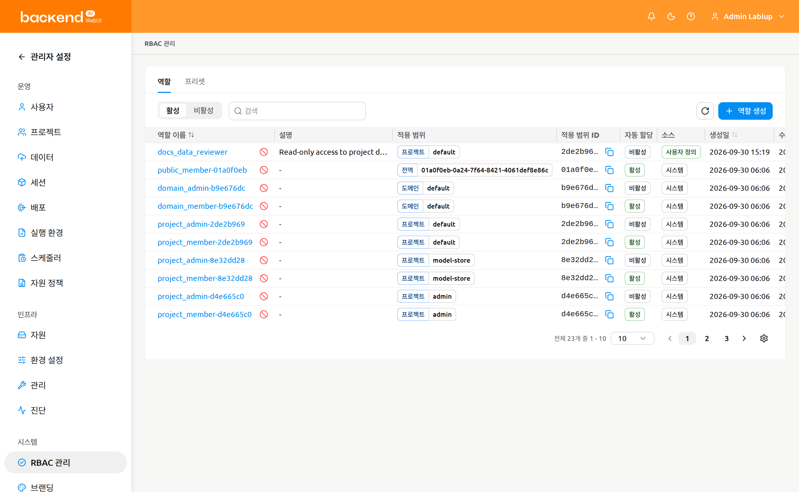

## 역할 목록

역할 목록 페이지는 모든 역할을 테이블 형태로 표시합니다. 페이지 상단의 컨트롤을 사용하여 역할을 필터링, 검색 및 정렬할 수 있습니다.

- **상태 필터**: **활성** 및 **비활성** 역할을 전환하는 세그먼트 컨트롤입니다. 기본적으로 활성이 선택되어 있습니다.
- **속성 필터**: 목록을 좁히는 속성 필터입니다. 필터 입력은 선택한 속성에 따라 달라집니다. 다음 속성을 사용할 수 있습니다:
   * **이름**: 역할 이름으로 검색하는 자유 형식 텍스트입니다.
   * **소스**: 사용 가능한 값(**시스템** / **사용자 정의**)을 자유 형식 텍스트 대신 선택형 입력으로 노출합니다.
   * **할당된 사용자**: 사용자 선택기로, 선택한 사용자에게 할당된 역할만 표시하도록 목록을 필터링합니다. 생성된 조건 태그에는 사용자의 이메일이 표시됩니다.
   * **적용 범위**: RBAC 적용 범위 타입(예: 도메인, 프로젝트, 사용자)을 나열하는 선택형 입력입니다.
   * **적용 범위 ID**: 정확한 적용 범위 UUID로 목록을 필터링합니다.
- **역할 생성**: 새로운 사용자 정의 역할을 생성하는 버튼입니다.

테이블에는 다음 열이 표시됩니다:

- **역할 이름**: 역할의 이름입니다. 이름을 클릭하면 역할 상세 패널이 열립니다.
- **설명**: 역할의 목적에 대한 간략한 설명입니다.
- **적용 범위**: 역할에 설정된 적용 범위의 타입이며, 적용 범위 이름과 함께 표시됩니다.
- **적용 범위 ID**: 역할에 설정된 적용 범위의 원시 ID입니다.
- **소스**: 역할이 **시스템**(사전 정의) 또는 **사용자 정의**(사용자 생성)인지 나타냅니다.
- **자동 할당**: 역할이 등록된 적용 범위에 사용자가 추가될 때 자동으로 역할이 할당되는지 여부를 나타냅니다. 자동 할당이 활성화된 경우 **활성**, 비활성화된 경우 **비활성**으로 표시됩니다.
- **생성일**: 역할이 생성된 날짜와 시간입니다.
- **수정일**: 역할이 마지막으로 수정된 날짜와 시간입니다.

### 시스템 역할과 사용자 정의 역할

역할은 두 가지 소스 유형으로 분류됩니다:

- **시스템**: 자동 생성되는 역할입니다. 이름, 설명, 세부 권한을 편집할 수 없지만, 사용자 할당은 관리할 수 있습니다.
- **사용자 정의**: 슈퍼 관리자가 생성한 역할입니다. 이름, 설명, 사용자 할당, 세부 권한을 모두 편집할 수 있습니다.

## 역할 생성

역할을 생성할 때는 **적용 범위**를 먼저 정의합니다. 적용 범위는 역할을 특정 리소스 엔티티(도메인, 프로젝트, 사용자 등)에 바인딩하여, 이후 추가되는 모든 세부 권한이 여기에서 정의한 적용 범위 내에서만 작동하도록 제한합니다. 하나의 역할에는 적용 범위를 하나만 설정할 수 있습니다.

새로운 사용자 정의 역할을 생성하려면:

1. 역할 목록 페이지 오른쪽 상단의 **역할 생성** 버튼을 클릭합니다
2. 생성 모달에서 다음 필드를 입력합니다:
   - **역할 이름** (필수): 고유한 역할 이름을 입력합니다
   - **설명** (선택): 역할의 목적에 대한 설명을 입력합니다
   - **자동 할당** (선택): 활성화하면 역할이 등록된 적용 범위에 사용자가 추가될 때 자동으로 역할이 부여됩니다. 기본적으로 비활성화되어 있습니다.
   - **적용 범위** (필수): 역할이 적용될 적용 범위 타입을 선택합니다(예: 도메인, 프로젝트, 사용자)
   - **적용 대상** (필수): 선택한 적용 범위 타입 안에서 구체적인 대상을 선택합니다. 역할에는 하나의 적용 범위만 설정됩니다.
3. **확인**을 클릭하여 역할을 생성합니다

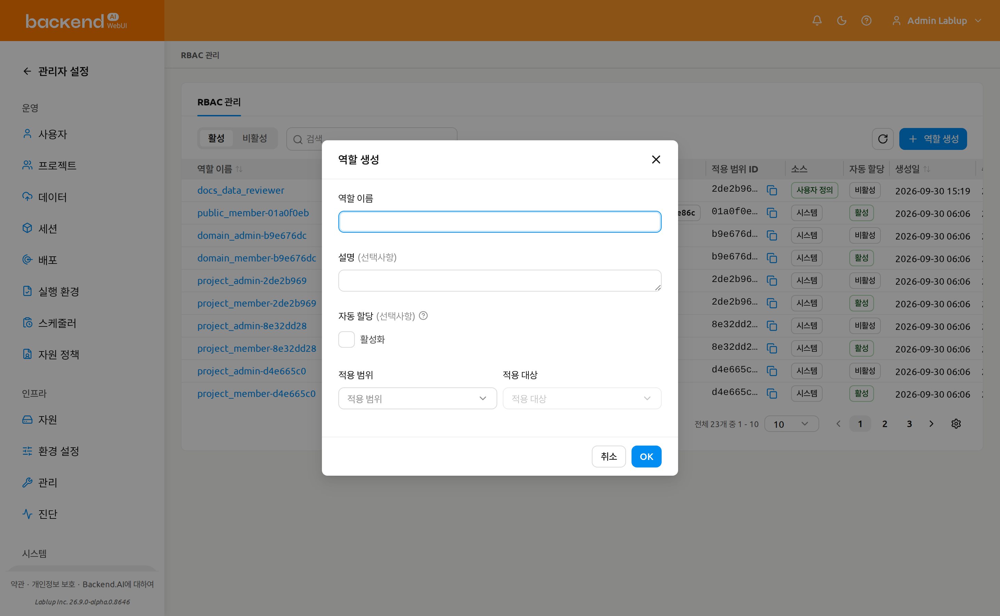

:::info
역할 생성 시점에 설정하는 **적용 범위**와 **적용 대상**은 그 자체로 어떤 권한을 부여하지 않습니다. 대신 이후 이 역할에 [세부 권한](#manage-permissions)을 추가할 때 사용할 수 있는 **적용 범위 / 적용 대상**을 미리 정의하는 역할을 합니다. 즉, 역할 생성 단계에서는 이 역할의 세부 권한이 가질 수 있는 적용 범위와 적용 대상을 미리 한정하는 것이며, 세부 권한은 여기에서 정의한 적용 범위와 적용 대상 안에서만 설정할 수 있습니다.
:::

:::warning
적용 범위는 역할 생성 시점에 정의되며 이후 역할 상세 패널에서 수정할 수 없습니다. 역할을 생성하기 전에 적용 범위를 신중하게 결정하세요.
:::

## 역할 상세 보기

역할에 대한 상세 정보를 확인하려면 테이블에서 역할 이름을 클릭합니다. 페이지 오른쪽에 상세 패널이 열립니다.

패널 헤더에는 역할 이름이 표시되며 사용자 정의 역할의 경우 **편집** 버튼이 제공됩니다. 상세 섹션에는 다음 메타데이터가 표시됩니다:

- **소스**: 시스템 또는 사용자 정의
- **상태**: 활성 또는 비활성
- **적용 범위 / 적용 대상**: 역할이 속한 적용 범위입니다. 역할은 정확히 하나의 적용 범위에 속합니다.
- **자동 할당**: 자동 할당이 활성 또는 비활성 여부를 나타냅니다. 활성 상태이면 역할이 등록된 적용 범위 중 하나에 사용자가 추가될 때 자동으로 역할이 부여됩니다.
- **생성일**: 생성 시간
- **수정일**: 마지막 수정 시간

메타데이터 아래에는 **권한**과 **역할 할당** 두 개의 탭이 있습니다. 기본적으로 **권한** 탭이 선택되어 있습니다.

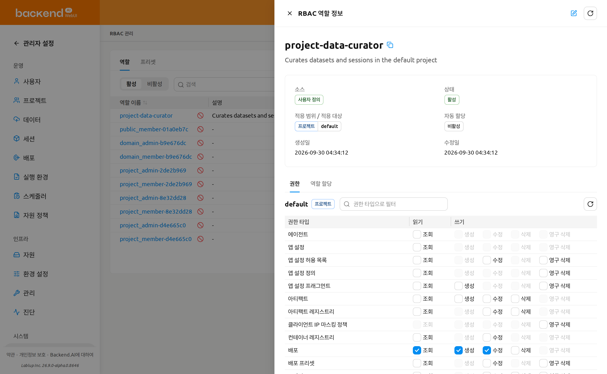

### 역할 편집

사용자 정의 역할의 이름, 설명 또는 자동 할당 설정을 편집하려면:

1. 테이블에서 역할 이름을 클릭하여 상세 패널을 엽니다
2. 패널 헤더의 **편집** 버튼(연필 아이콘)을 클릭합니다
3. 편집 모달에서 다음 필드를 수정합니다:
   - **역할 이름**: 역할의 이름
   - **설명**: 역할의 목적에 대한 설명
   - **자동 할당**: 활성화하면 역할이 등록된 적용 범위에 사용자가 추가될 때 자동으로 역할이 부여됩니다.
4. **확인**을 클릭하여 변경 사항을 저장합니다

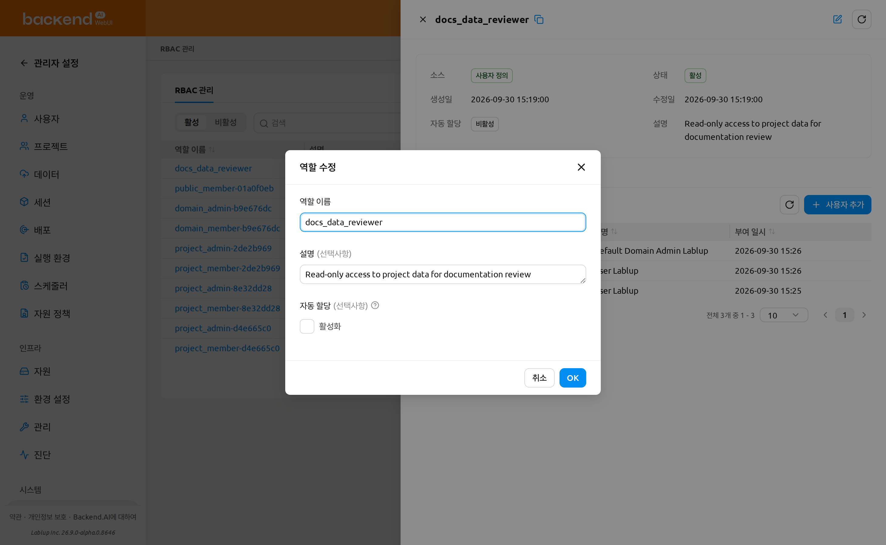

:::note
편집 버튼은 사용자 정의 역할에서만 사용할 수 있습니다. 시스템 역할의 이름이나 설명은 수정할 수 없습니다. 또한 역할 생성 후에는 어느 경우에도 적용 범위를 수정할 수 없습니다.
:::

## 세부 권한 관리

역할 상세 패널의 **권한** 탭에는 역할의 적용 범위에서 사용할 수 있는 권한 타입이 한 행씩 표시됩니다. 각 행의 체크박스는 **읽기**와 **쓰기**로 묶여 있으며, **쓰기**에는 생성, 수정, 삭제, 영구 삭제가 포함됩니다.

역할의 세부 권한을 변경하려면 체크박스를 선택하거나 해제한 뒤 **저장**을 클릭합니다.

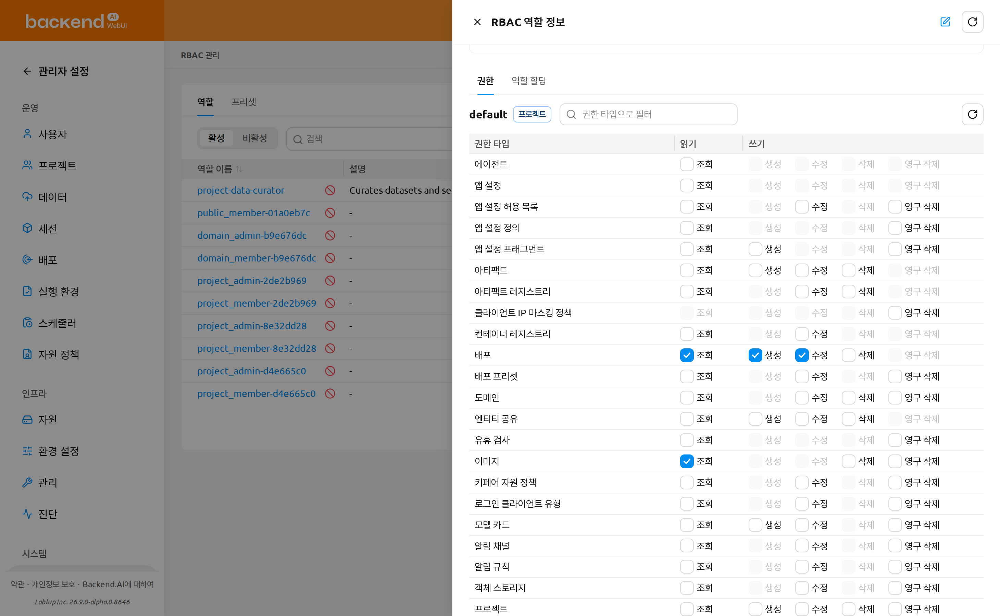

시스템 역할의 세부 권한은 이 탭에서 읽기 전용입니다. 시스템 역할의 세부 권한은 해당 역할이 생성된 [역할 프리셋](#role-presets)을 따르며, **프리셋 확인**을 클릭하면 프리셋을 확인할 수 있습니다.

:::info
각 세부 권한의 **적용 범위 / 적용 대상** 조합은 역할의 적용 범위에서 상속됩니다. 역할 생성 시에 정의된 적용 범위에 대해서만 세부 권한을 부여할 수 있습니다. 역할의 범위를 넓히려면 필요한 적용 범위를 가진 새 역할을 추가로 생성해야 합니다.
:::

### 세부 권한 설정 예시

다음은 일반적인 세부 권한 설정 예시입니다. **적용 범위 / 적용 대상** 열은 세부 권한이 재사용하는 역할 수준의 적용 범위를 나타냅니다.

| 시나리오 | 적용 범위 / 적용 대상 | 권한 타입 | 동작 |
|----------|---------------------|----------|------|
| 특정 프로젝트에서 스토리지 폴더 생성 허용 | 프로젝트 / my-project | 폴더 | 생성 |
| 특정 도메인 내 모든 세션 조회 허용 | 도메인 / default | 세션 | 조회 |
| 특정 도메인 내 배포 관리 허용 | 도메인 / default | 배포 | 생성, 조회, 수정 |
| 특정 도메인 내 컨테이너 이미지 삭제 허용 | 도메인 / default | 이미지 | 삭제 |

## 역할 프리셋

**프리셋** 탭에는 시스템 역할 생성의 기반이 되는 역할 프리셋이 나열됩니다.

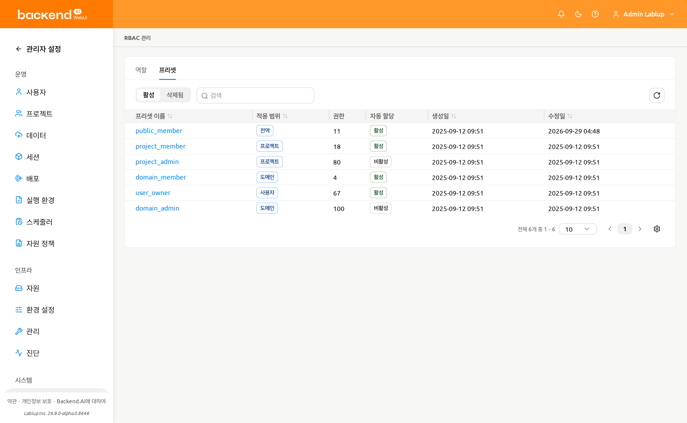

프리셋의 세부 권한을 수정하려면 프리셋 이름을 클릭하여 상세 패널을 열고, **읽기** / **쓰기** 그리드의 체크박스를 선택하거나 해제한 뒤 **저장**을 클릭합니다.

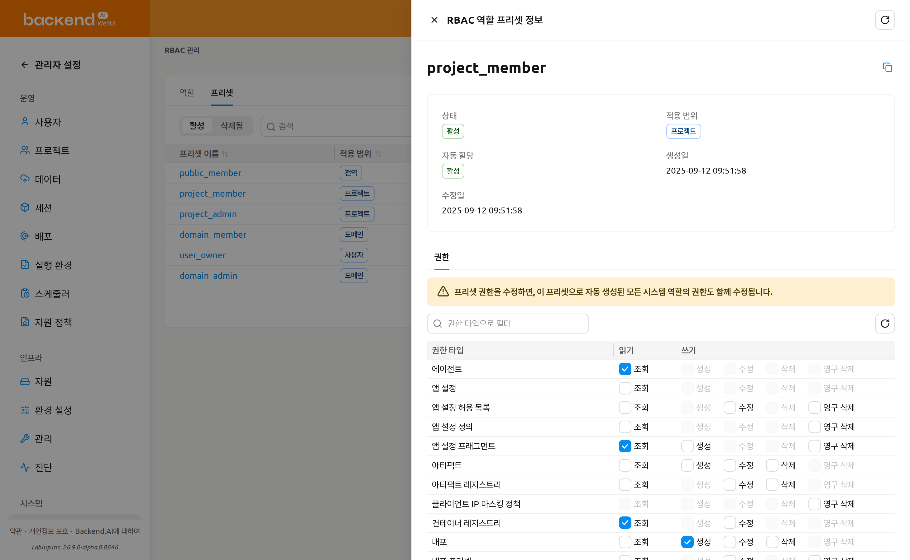

:::warning
프리셋 권한을 수정하면, 이 프리셋으로 자동 생성된 모든 시스템 역할의 권한도 함께 수정됩니다.
:::

## 사용자 할당 관리

상세 패널의 **역할 할당** 탭에서 해당 역할에 할당된 사용자를 확인할 수 있습니다.

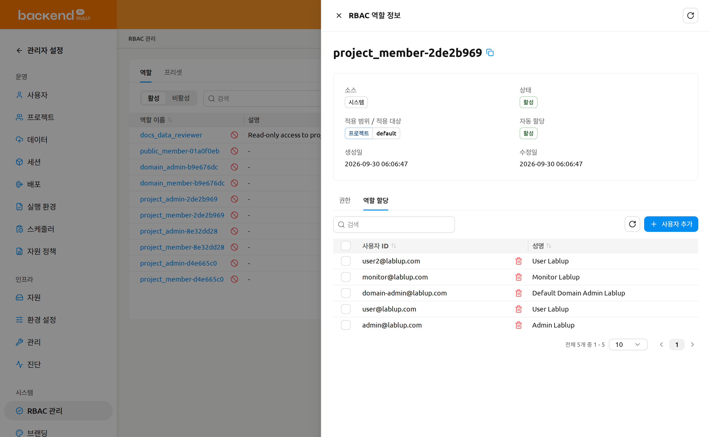

### 역할에 사용자 추가

1. 상세 패널을 열고 **역할 할당** 탭을 선택합니다
2. **사용자 추가** 버튼을 클릭합니다
3. 모달에서 이메일이나 이름으로 사용자를 검색합니다
4. 체크박스를 사용하여 한 명 이상의 사용자를 선택합니다
5. **추가**를 클릭하여 선택한 사용자를 역할에 할당합니다

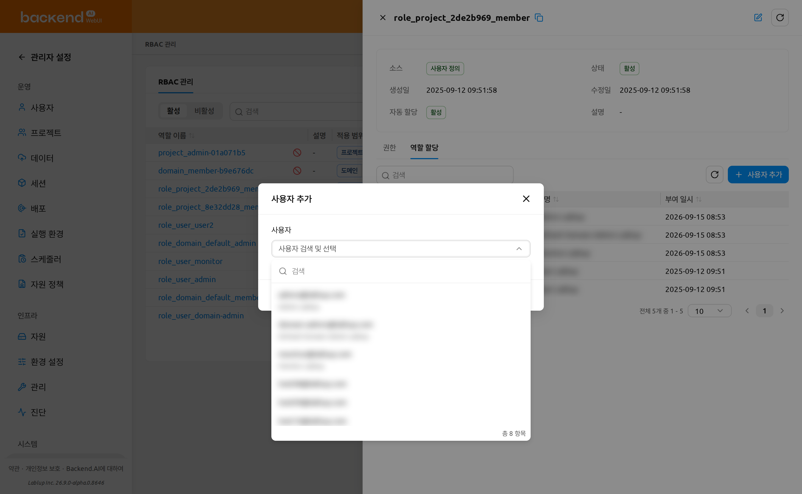

사용자 추가는 일괄 작업입니다. 한 번에 여러 사용자를 선택하여 모두 한꺼번에 할당할 수 있습니다. 일부 할당이 실패하면 모달이 열린 상태로 유지되며 일괄 오류 모달에 실패한 각 사용자와 오류 메시지, 성공 및 실패 개수가 나열됩니다. 성공적으로 할당된 사용자는 선택에서 지워지므로 실패한 사용자만 선택된 상태로 남아 **추가**를 다시 클릭하여 해당 사용자만 재시도할 수 있습니다.

<!--  -->
<!-- TODO: Capture the Add User modal with the bulk-error modal listing failed assignments -->

### 시스템 역할과 할당 제한

시스템이 생성한 프로젝트 관리자 역할(**소스**가 **시스템**인 역할)에는 역할 할당 탭에서 사용자를 직접 할당하거나 해제할 수 없습니다. 이 탭에는 **시스템에 의해 자동으로 생성된 역할은 사용자를 직접 할당하거나 할당 해제할 수 없습니다.** 경고 알림이 표시되며 할당 테이블은 읽기 전용입니다(**사용자 추가** 및 해제 컨트롤이 숨겨집니다).

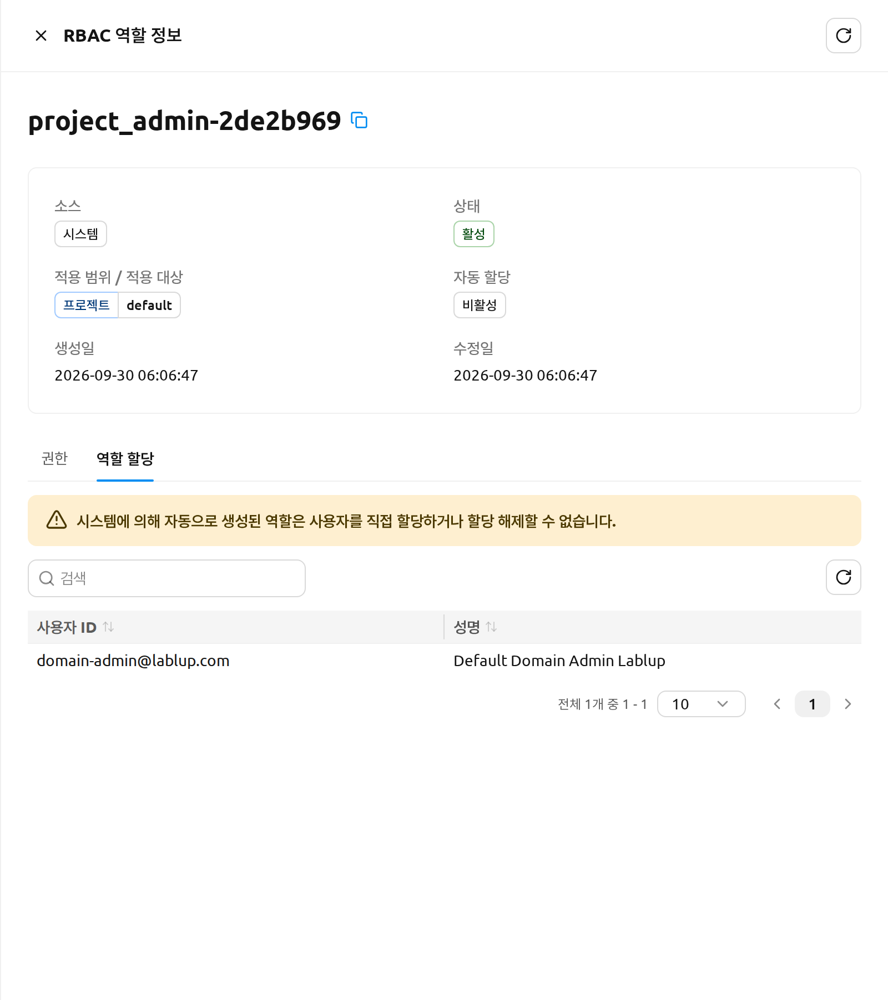

프로젝트를 관리할 사용자를 지정하려면 대신 프로젝트 페이지의 **프로젝트 관리자 권한 설정**을 사용하세요. 프로젝트 관리자 기능 챕터의 [프로젝트 관리자 권한 설정](#set-project-admin)과 아래의 [프로젝트 관리자 권한 부여](#grant-project-admin)를 참고하세요.

### 역할에서 사용자 해제

한 명의 사용자를 해제하거나 여러 명의 사용자를 한 번에 해제할 수 있습니다.

한 명의 사용자를 해제하려면:

1. **역할 할당** 탭에서 사용자 행 위에 마우스를 올린 후 사용자 옆의 해제(휴지통) 아이콘을 클릭합니다.
2. **사용자 해제** 확인 모달이 열립니다. 목록에 표시된 사용자를 확인한 후 **사용자 해제**를 클릭하여 확정하거나 **취소**를 눌러 닫습니다.

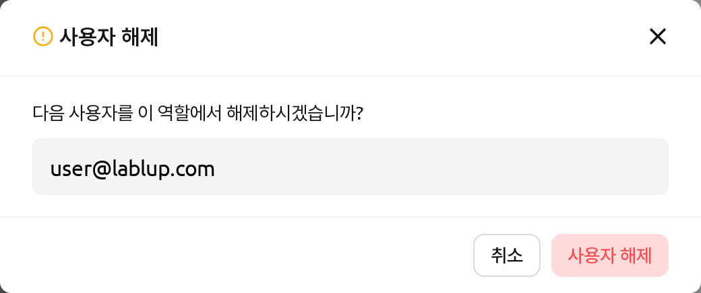

여러 명의 사용자를 한 번에 해제하려면:

1. **역할 할당** 탭에서 체크박스를 사용하여 제거할 사용자를 선택합니다. 해제 컨트롤 옆에 선택된 행 수를 나타내는 선택 개수 라벨이 표시되며, 해당 라벨의 선택 해제 컨트롤을 사용하여 모든 행의 선택을 해제할 수 있습니다.
2. 하나 이상의 행이 선택되면 나타나는 일괄 **사용자 해제** 버튼(휴지통 아이콘)을 클릭합니다.
3. **사용자 해제** 확인 모달에서 목록에 표시된 사용자를 확인한 후 **사용자 해제**를 클릭하여 확정하거나 **취소**를 눌러 닫습니다.

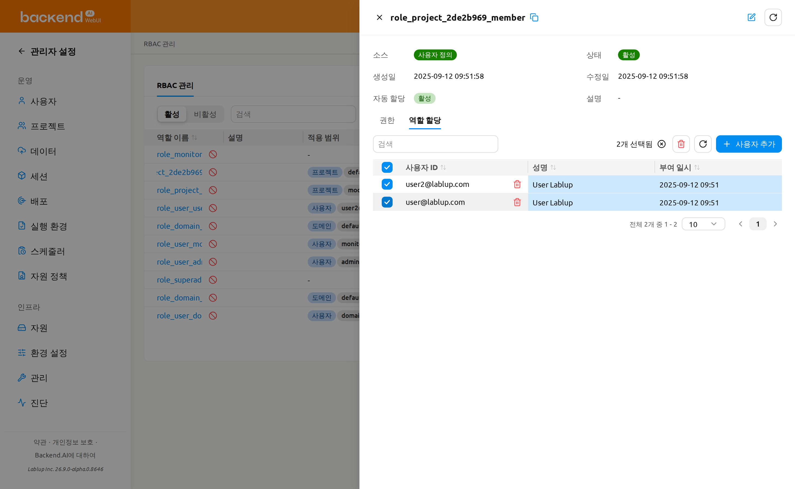

사용자를 해제하면 해당 사용자의 역할 할당만 제거되며 역할 자체와 다른 할당은 그대로 유지됩니다.

:::note
역할 할당 해제는 **역할 할당** 탭에서 사용자를 다시 추가하면 복구할 수 있습니다.
:::

## 프로젝트 관리자 권한 부여

프로젝트를 생성하면 해당 프로젝트에 한정된 전용 프로젝트 관리자 역할이 함께 생성됩니다. 이 역할에 할당된 사용자는 그 프로젝트에 대한 [프로젝트 관리자](#project-admin-features) 권한을 얻습니다. 즉, 시스템 전반의 슈퍼 관리자 권한을 갖지 않고도 해당 프로젝트의 사용자, 세션, 배포, 스토리지 폴더를 관리할 수 있습니다.

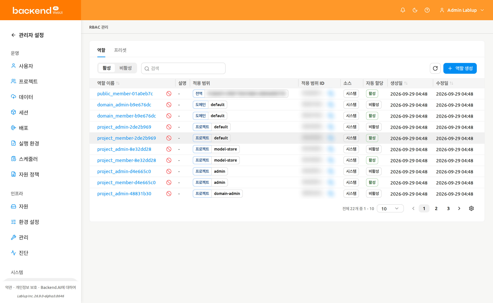

프로젝트 관리자 권한은 프로젝트 관리자 기능 챕터의 [프로젝트 관리자 권한 설정](#set-project-admin)에서 설명하는 **프로젝트** 관리자 페이지의 **프로젝트 관리자 권한 설정** 원클릭 흐름을 통해 부여하고 회수합니다. 프로젝트 관리자 역할은 시스템 역할이므로, 여기의 역할 할당 탭은 **읽기 전용**이며 확인용으로 제공됩니다. 역할을 열어 현재 프로젝트 관리자 권한을 가진 사용자를 검토할 수 있습니다. **프로젝트 관리자 권한 설정** 모달은 RBAC 바로 가기를 통해 이 역할의 상세 패널로 다시 연결됩니다.

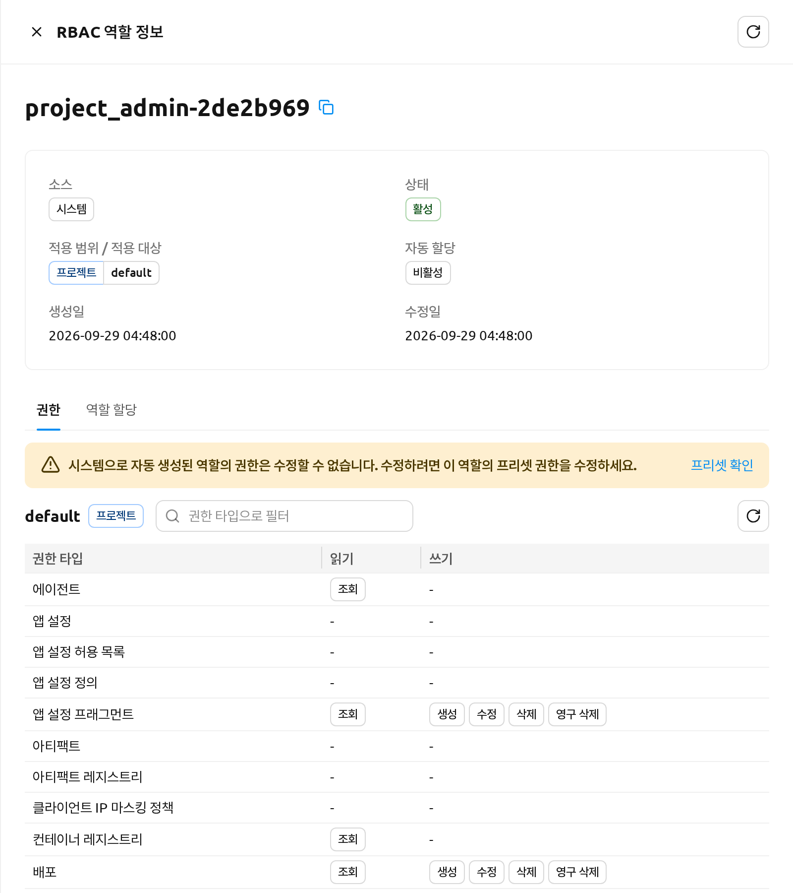

권한이 부여되면 사용자에게는 즉시 프로젝트 관리자 권한이 적용됩니다. 다음에 헤더의 프로젝트 드롭다운을 열면 해당 프로젝트 옆에 프로젝트 관리자 배지가 표시되며 [프로젝트 관리자 기능](#project-admin-features) 챕터에서 설명한 프로젝트 관리자 전용 사이드바 항목도 함께 나타납니다.
