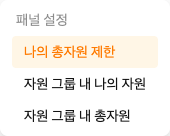
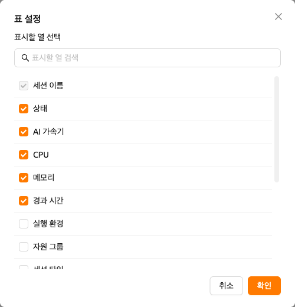

# 세션 페이지

Backend.AI에서 `세션(session)`은 사용자가 할당된 자원을 사용하여 코드를 실행하거나 모델을 학습시키거나 데이터를 분석할 수 있는 격리된 연산 환경을 의미합니다.
각 세션은 런타임 이미지, 자원 크기, 환경 설정 등 사용자가 정의한 구성에 따라 생성됩니다.
세션이 시작되면 대화형 애플리케이션, 터미널, 로그에 접근할 수 있어 작업을 효율적으로 관리하고 모니터링할 수 있습니다.

## 자원 요약 패널

'세션' 페이지 상단에는 CPU, RAM, AI 가속기 등 사용 가능한 컴퓨팅 자원을 표시하는 패널이 있습니다. 필요한 정보에 따라 '나의 총자원 제한', '자원 그룹별 나의 자원', '자원 그룹별 총자원' 등 다양한 패널 뷰를 선택할 수 있습니다. 표시할 패널을 변경하려면 '설정' 버튼을 사용하세요.

자원 패널과 관련 지표에 대한 자세한 내용은 [대시보드](#dashboard) 페이지를 참고하세요.

## 세션 목록

'세션' 섹션에는 모든 활성 및 완료된 연산 세션의 목록이 표시됩니다.
`Interactive`, `Batch`, `Inference`, 또는 `Upload Sessions` 유형별로 세션을 필터링할 수 있으며,
`실행중` 탭과 `종료됨` 탭을 전환하여 세션을 관리할 수 있습니다.

기본적으로 세션 이름, 상태, 할당된 자원(AI 가속기, CPU, 메모리), 경과 시간을 확인할 수 있으며, 슈퍼관리자의 경우 에이전트 및 소유자 이메일도 표시됩니다.
테이블 오른쪽 하단의 '설정' 버튼을 클릭하면 추가 컬럼을 표시하거나 특정 컬럼을 숨겨 뷰를 사용자화할 수 있습니다.

