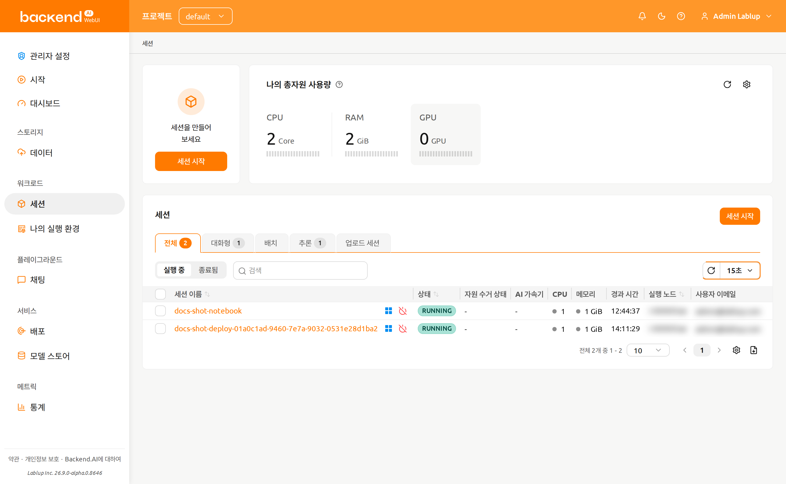
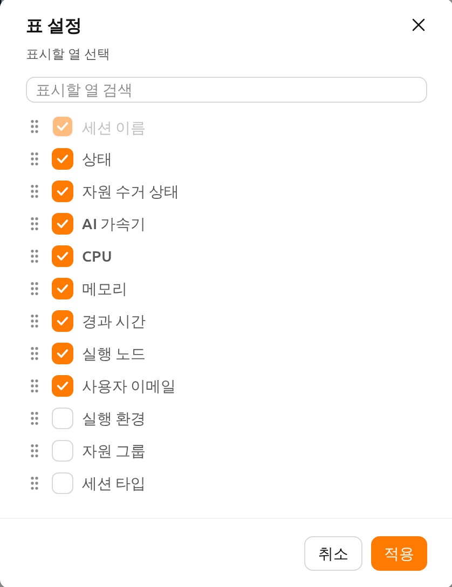
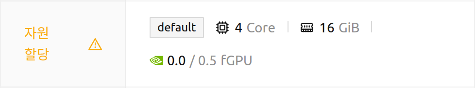

# 세션 페이지

Backend.AI에서 `세션(session)`은 사용자가 할당된 자원을 사용하여 코드를 실행하거나 모델을 학습시키거나 데이터를 분석할 수 있는 격리된 연산 환경을 의미합니다.
각 세션은 런타임 이미지, 자원 크기, 환경 설정 등 사용자가 정의한 구성에 따라 생성됩니다.
세션이 시작되면 대화형 애플리케이션, 터미널, 로그에 접근할 수 있어 작업을 효율적으로 관리하고 모니터링할 수 있습니다.

## 자원 요약 패널

`세션` 페이지 상단에는 CPU, RAM, AI 가속기 등 컴퓨팅 자원을 표시하는 패널이 있습니다. 필요한 정보에 따라 **나의 총자원 사용량**, **자원 그룹 내 나의 자원**, **자원 그룹 내 총자원** 등 다양한 패널 뷰를 선택할 수 있습니다. 표시할 패널을 변경하려면 패널 헤더의 설정(톱니바퀴) 아이콘을 클릭한 뒤 **패널 설정**에서 원하는 뷰를 선택합니다.

**나의 총자원 사용량** 패널은 모든 프로젝트에서 내가 현재 사용 중인 자원량을 보여줍니다. 각 자원에 적용되는 제한을 확인하려면 숫자 아래의 상태바에 마우스 커서를 올립니다. 여러 제한(도메인, 프로젝트, 키페어 등)이 함께 적용될 경우 가장 엄격한 기준이 적용됩니다.

자원 패널과 관련 지표에 대한 자세한 내용은 [대시보드](#dashboard) 페이지를 참고하세요.

## 세션 목록

`세션` 페이지에는 내 활성 및 완료된 연산 세션만 표시됩니다.
`전체`, `Interactive`, `Batch`, `Inference`, 또는 `업로드 세션` 유형별로 세션을 필터링할 수 있으며,
`실행중` 탭과 `종료됨` 탭을 전환하여 세션을 관리할 수 있습니다.

:::note
개인 세션 페이지는 현재 작업 중인 프로젝트 범위로 동작하며, 주소는 `/project/<프로젝트 이름>/session` 형태입니다.
이 페이지는 역할에 관계없이 항상 본인의 세션만 표시합니다.
프로젝트 내 모든 사용자의 세션을 조회하고 관리하려면 사이드바 **관리자 설정**의 **세션** 페이지를 이용하세요.
:::

기본적으로 세션 이름, 상태, 할당된 자원(AI 가속기, CPU, 메모리), 경과 시간을 확인할 수 있습니다.
테이블 오른쪽 하단의 `설정` 버튼을 클릭하면 추가 컬럼을 표시하거나 특정 컬럼을 숨겨 뷰를 사용자화할 수 있습니다.
또한 컬럼 설정 대화창에서 컬럼을 드래그하여 테이블에 표시되는 순서를 변경할 수 있습니다.

:::tip
세션 상세 정보 패널에서 각 세션의 상세 스케줄링 기록을 확인할 수 있습니다. 이를 통해 스케줄링 결정, 지연, 실패 등을 파악할 수 있습니다. 자세한 내용은 [세션 스케줄링 기록](#session-scheduling-history)을 참고하세요.
:::

:::note
세션 런처의 **시작** 버튼은 기본적으로 한 개의 세션을 생성합니다. 동일한 설정으로
여러 세션을 한 번에 시작하려면 시작 버튼의 드롭다운 메뉴를 열고 **복수 세션 동시 시작**
을 선택합니다. 자세한 내용은 [검토 및 시작](#confirm-and-launch) 섹션을 참고하세요.
:::

:::note
세션 목록 도구 모음의 다운로드 버튼을 사용하여 세션 목록을 CSV 파일로 내보낼 수 있습니다.
개인 세션 페이지에서 내보내는 CSV에는 본인의 세션만 포함됩니다.
:::

## 할당 자원과 요청 자원

세션 이름을 클릭하면 세션 상세 정보 패널이 열립니다. 패널의 **자원 할당** 항목에는 요청한 자원이 아니라 세션이 실제로 점유하고 있는 자원이 표시되므로, 세션이 어떤 자원으로 실행되고 있는지 확인할 수 있습니다.

- 할당된 양과 요청한 양이 같으면 각 자원은 하나의 값으로 표시됩니다.
- 두 값이 다르면 할당된 양 뒤에 요청한 양이 흐린 색으로 함께 표시되며 단위는 하나만 표기됩니다(예: `0.0 / 0.5 fGPU`). 숫자 위에 마우스 커서를 올리면 **할당 자원 / 요청 자원** 툴팁이 표시됩니다.
- 요청보다 적게 할당된 자원이 있으면 **자원 할당** 항목 이름 옆에 경고 아이콘이 표시됩니다. 아이콘 위에 마우스 커서를 올리면 *자원이 요청보다 적게 할당되었습니다.* 라는 메시지가 표시됩니다.
- 아직 자원이 할당되지 않은 상태(예: `PENDING`)에서는 요청한 자원이 그대로 표시되며 비교 값은 나타나지 않습니다.

요청한 양을 정확히 할당할 수 없는 경우, 예를 들어 분할 GPU(fGPU) 요청량이 할당 가능한 최소 단위로 내림 처리되는 경우에 이러한 차이가 발생합니다. 세션은 실제로 할당된 양으로 실행됩니다.

패널의 나머지 항목에 대한 내용은 [세션 상세 정보 패널](#session-detail-panel)을 참고하세요.
