# 연산 세션

Backend.AI WebUI 에서 가장 많이 방문하게 될 페이지는 세션 페이지와 데이터 페이지입니다. 세션 페이지에서는 컨테이너 기반의 연산 세션을 조회하거나 생성 및 사용할 수 있고, 데이터 페이지에서는 데이터를 보관하는 저장 폴더를 생성할 수 있습니다. 여기서는 세션 페이지에서 컨테이너 기반의 연산 세션을 생성하고 각종 웹 애플리케이션을 활용하는 방법을 알아봅니다.

## 새로운 세션 시작하기

사용자 계정으로 로그인 후 좌측 메뉴의 '세션'을 클릭하여 세션 페이지로 이동합니다. '세션 페이지'는 새로운 연산 세션을 시작하거나 이미 실행 중인 연산 세션을 관리할 때 사용할 수 있습니다.

새로운 연산 세션을 시작하려면 '시작' 버튼을 클릭하세요.

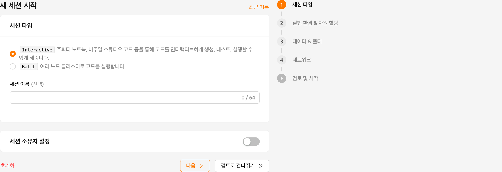

### 세션 타입

첫 번째 페이지에서는 세션의 형태인 interactive 또는 batch를 선택해야 합니다. 그리고 세션 이름을 지정할 수 있습니다. (선택사항)

- 세션 타입: 세션의 형태를 결정합니다. 현재 가능한 세션 형태는 "Interactive" 와 "Batch" 두 가지가 있습니다. 두 형태의 주요한 차이점은 다음과 같습니다:

  - Interactive 형태 연산 세션

    - Backend.AI 초기 버전부터 지원하던 형태입니다.
    - 사용자가 별도의 실행 스크립트를 지정하지 않고 일단 세션을 생성한 후 상호 작용하는 방식으로 세션을 사용하게 됩니다.
    - 사용자가 명시적으로 삭제하지 않는 한 세션은 자동 삭제되지 않습니다. 다만, 관리자가 별도의 세션 자동 수거 설정을 켜둔 경우에는, 그 조건에 따라 자동으로 삭제될 수도 있습니다.

  - Batch 형태 연산 세션

    - 이 형태의 세션은 Backend.AI 22.03 부터 GUI를 통해 지원됩니다 (CLI에서는 22.03 이전부터 배치 형태의 세션을 지원했습니다).
    - 사용자가 연산 세션을 생성할 때 실행할 스크립트를 미리 지정합니다.
    - 자원이 할당되는 즉시 해당 스크립트를 실행하고, 스크립트가 종료되는 그 즉시 연산 세션을 자동으로 삭제합니다. 따라서, 실행할 코드가 사전에 정의되어 있거나 작업을 파이프라이닝 하는 경우에는, 연산 서버 팜(server farm)의 자원을 보다 효율적으로 활용할 수 있는 장점이 있습니다.
    - 연산 세션 시작 시점을 지정할 수 있습니다. 다만, 시작 시점에 반드시 연산 세션이 자원을 할당받을 수 있는 것은 아닙니다(자원 부족 등의 이유로 PENDING 상태에 계속 머물 수 있습니다). 시작 시점 이전에는 자원이 있어도 연산 세션을 스케줄링 하지 않는 개념으로 이해하는 것이 정확합니다.
    - 배치 작업 최대 실행 시간: 배치 작업의 최대 실행 시간을 설정합니다. 지정된 시간이 초과되면 세션이 자동으로 종료됩니다.

    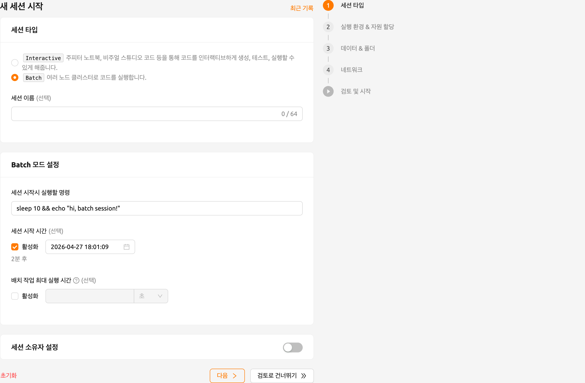

- 세션 이름 (선택사항): 생성할 연산 세션의 이름을 지정할 수 있습니다. 지정하면 세션 정보에 이 이름이 나타나므로 연산 세션의 구분이 용이합니다. 지정하지 않으면 임의의 이름이 자동으로 지정됩니다. 세션 이름은 4-64자 사이의 알파벳 또는 숫자만 받아들이며, 공백은 허용되지 않습니다.

`슈퍼관리자` 또는 `관리자` 계정으로 세션을 생성하는 경우, 세션 소유자를 추가로 지정할 수 있습니다. 토글을 활성화하면 사용자 이메일 필드가 나타납니다.

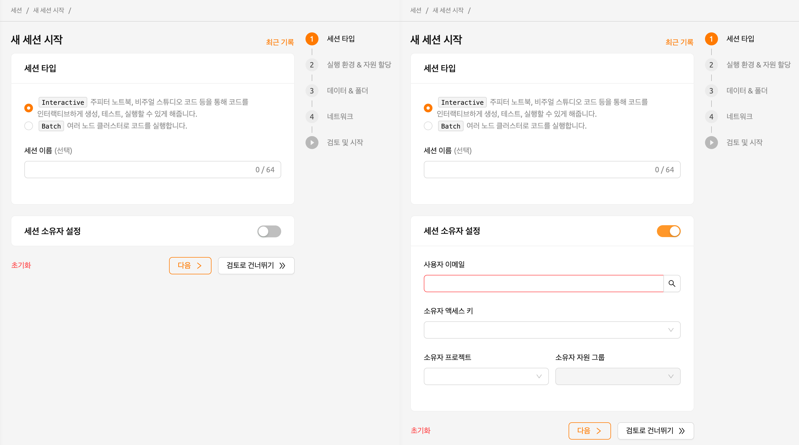

세션 할당을 위한 사용자 이메일을 입력하고 '검색' 버튼을 클릭하면, 해당 사용자의 access key가 자동으로 등록됩니다. 추가적으로 프로젝트와 자원 그룹을 선택해 할당할 수 있습니다.

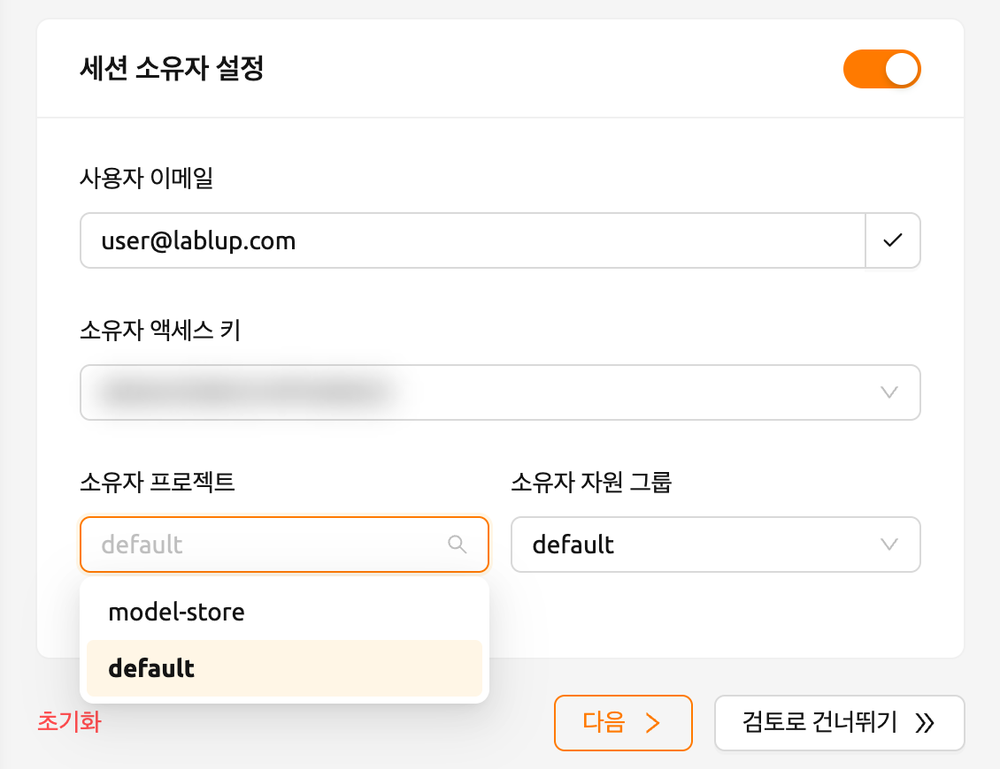

### 실행 환경 및 자원 할당

다음 페이지로 진행하려면 아래쪽의 '다음' 버튼을 클릭하거나, 우측의 '실행 환경 & 자원 할당' 버튼을 클릭하십시오. 추가 설정 없이 세션을 생성하려면 '검토로 건너뛰기' 버튼을 누르십시오. 이 경우, 다른 페이지의 설정은 모두 기본값을 사용하게 됩니다.

### 실행 환경

두 번째 페이지에서 설정할 수 있는 각 항목에 대한 자세한 설명은 다음을 참고하십시오.

- 실행 환경: TensorFlow, PyTorch, C++ 등과 같은 연산 세션의 기본 환경을 지정합니다. TensorFlow를 선택하면 연산 세션에서 TensorFlow 라이브러리를 사용할 수 있습니다. 다른 환경을 선택하면 해당 환경이 기본적으로 설치된 연산 세션을 생성하게 됩니다.
- 버전: 실행 환경의 버전을 지정할 수 있습니다. 하나의 환경에는 여러 버전이 있을 수 있습니다. 예를 들어, TensorFlow에는 1.15, 2.3 등 다양한 버전이 있습니다.
- 환경 이름 (선택사항): 연산 세션에 사용할 이미지의 이름을 지정할 수 있습니다. 환경 설정에 따라 이 설정이 사용 불가능할 수도 있습니다.
- 환경 변수 설정: 사용자에게 보다 편리한 작업 환경을 제공하기 위해, Backend.AI는 세션 생성 시 환경 변수 설정을 지원합니다. 이 기능을 통해 사용자는 환경 변수 설정 대화 상자에서 변수 이름과 값을 입력하여 `PATH` 등의 환경 변수를 추가할 수 있습니다.

  

### 자원 할당

- 자원 그룹: 연산 세션을 생성할 자원 그룹을 지정합니다. 자원 그룹은 각 사용자가 접근할 수 있는 호스트 서버를 묶은 단위이며, 주로 같은 종류의 GPU 자원을 보유하고 있는 서버들을 하나의 자원 그룹으로 설정합니다. 관리자는 서버를 종류별로 구분하여 자원 그룹으로 묶고, 사용자가 사용할 수 있는 자원 그룹의 종류를 지정할 수 있습니다. 사용자는 관리자가 허가한 자원 그룹 서버에만 연산 세션을 생성할 수 있습니다. 자원 그룹이 여러 개인 경우 원하는 그룹을 선택할 수 있지만, 하나만 있는 경우에는 변경할 수 없습니다.
- 자원 프리셋: 이 템플릿은 연산 세션에 할당할 CPU, 메모리, GPU 등의 자원 세트를 미리 정의해 둔 것입니다. 관리자는 미리 자주 사용하는 자원 설정을 정의할 수 있습니다. 숫자 입력을 조정하거나 슬라이더를 움직이면 원하는 자원량을 할당할 수 있습니다.

  

  각 항목의 의미는 다음과 같습니다. '도움 (?)' 버튼을 클릭하면 자세한 정보를 확인할 수 있습니다.

  * CPU: CPU는 명령어로 지정된 기본 산술, 논리, 제어 및 입출력 (I/O) 작업을 수행합니다. 고성능 컴퓨팅 워크로드의 경우 많은 CPU가 도움이 되지만, 여러 CPU를 사용하도록 프로그램 코드를 작성해야 합니다. (그렇지 않으면 대부분의 CPU는 사용되지 않을 것입니다.)
  * 메모리: 컴퓨터 메모리는 임시 저장 영역입니다. 중앙 처리 장치 (CPU)에 필요한 데이터와 명령들을 보관하는 역할을 합니다. 머신 러닝 워크로드를 처리할 때 GPU를 연산 장치로 사용하는 경우, GPU 메모리의 두 배 이상의 메모리를 할당해야 합니다. 그렇지 않으면 GPU의 유휴 시간이 증가하여 성능이 저하됩니다.
  * 공유 메모리: 연산 세션에 할당할 공유 메모리의 용량 (GB). RAM에 설정된 메모리 중 일부를 떼어 공유 메모리로 사용합니다. 따라서, RAM에 지정된 양보다 클 수 없습니다.
  * AI 가속기: AI 가속기 (GPU 및 NPU)는 기계 학습과 관련된 행렬 / 벡터 계산에 적합합니다. AI 가속기는 훈련 및 인퍼런스 알고리즘을 몇 배나 가속화하여 기계 학습 워크로드의 실행 시간을 몇 주에서 며칠로 줄입니다.
  * 세션: 세션은 지정된 환경과 자원에 따라 생성되는 계산 환경 단위입니다. 이 값을 1보다 큰 값으로 설정하면 위의 자원 설정을 이용한 여러 세션이 지정한 값만큼 동시에 생성됩니다. 세션 시작 요청 시 사용 가능한 자원이 충분하지 않은 경우, 생성하지 못한 세션 시작 요청들은 생성 대기열에 추가됩니다.

  

  * 에이전트 선택: 사용자는 할당할 에이전트를 직접 선택할 수 있습니다. 기본적으로는 스케줄러가 에이전트를 자동으로 선택합니다. 에이전트 선택기에서는 각 에이전트의 실제 사용 가능한 자원 양을 확인할 수 있습니다. 현재 이 기능은 단일 노드, 단일 컨테이너 환경에서만 지원됩니다.
  * 클러스터 모드: 클러스터 모드를 사용하면 여러 연산 세션을 한 번에 생성할 수 있습니다. 자세한 내용은 [Backend.AI 클러스터 연산 세션 개요](#backendai-cluster-compute-session)를 참고하세요.

:::note
에이전트 선택 기능은 서버 환경에 따라 표시되지 않을 수 있습니다.
:::

- 고성능 컴퓨팅 최적화: Backend.AI는 HPC 최적화 관련 값을 설정할 수 있습니다.

  Backend.AI는 `nthreads-var` 내부 제어 변수에 대한 설정 UI를 제공합니다. Backend.AI는 기본적으로 이 값을 세션의 CPU 코어 수와 동일하게 설정하며, 이는 일반적인 고성능 컴퓨팅 워크로드를 가속하는 효과가 있습니다. 그러나 일부 멀티 스레드 워크로드에서는 OpenMP를 사용하는 여러 프로세스가 동시에 실행되어 비정상적으로 많은 스레드가 생성되고 성능이 크게 저하될 수 있습니다. 이 문제를 해결하려면 스레드 수를 1 또는 2로 설정하면 됩니다.

### 데이터 및 폴더

다음 페이지로 진행하려면 아래쪽의 '다음' 버튼을 클릭하거나, 우측의 '데이터 & 폴더' 버튼을 클릭하세요.

연산 세션이 삭제되면 내부 데이터도 기본적으로 함께 삭제됩니다. 그러나 마운트된 폴더에 저장된 데이터는 보존됩니다. 마운트된 폴더의 데이터는 다른 연산 세션을 생성할 때 다시 마운트하여 재사용할 수도 있습니다. 폴더를 마운트하고 연산 세션을 실행하는 방법에 대한 자세한 내용은 [연산 세션에 폴더 마운트](#session-mounts)를 참고하세요.

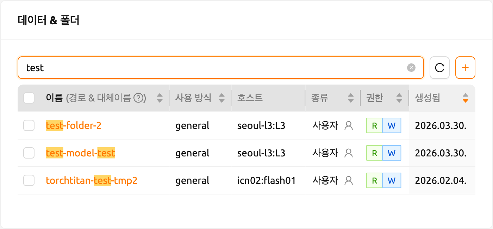

연산 세션에 마운트할 스토리지 폴더를 지정할 수 있습니다. 폴더 이름을 클릭하면 폴더 탐색기를 사용할 수 있습니다. 자세한 내용은 [폴더 탐색](#explore-folder) 섹션을 참고하세요.

검색 상자 옆의 '+' 버튼을 클릭하여 새 폴더를 생성할 수 있습니다. 새 폴더를 생성하면 자동으로 마운트할 폴더로 선택됩니다. 자세한 내용은 [스토리지 폴더 생성](#create-storage-folder) 섹션을 참고하세요.

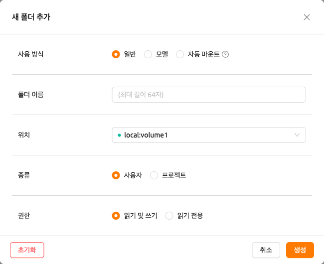

### 네트워크

다음 페이지로 진행하려면 아래쪽의 '다음' 버튼을 클릭하거나, 우측의 '네트워크' 버튼을 클릭하세요. 이 페이지에서는 사전 개방 포트 등의 네트워크 설정을 할 수 있습니다.

- 사전 개방 포트 설정: 연산 세션에서 사전 개방 포트를 설정할 수 있는 인터페이스를 제공합니다. 자세한 내용은 [세션 생성 전 사전 개방 포트 추가 방법](#set-preopen-ports)을 참고하세요.

### 검토 및 시작

네트워크 설정을 완료했다면, 아래쪽의 '다음' 버튼을 클릭하거나, 우측의 '검토 및 시작' 버튼을 클릭하여 마지막 페이지로 이동합니다.

마지막 페이지에서는 이전 페이지에서 설정한 연산 세션 환경, 자원 할당량, 마운트 정보, 설정된 환경 변수, 사전 개방 포트 등의 정보를 확인할 수 있습니다. 설정을 검토한 후 '시작' 버튼을 클릭하여 세션을 실행합니다. 각 카드 우측 상단에 있는 '수정' 버튼을 클릭하면 해당 페이지로 이동하여 설정을 변경할 수 있습니다.

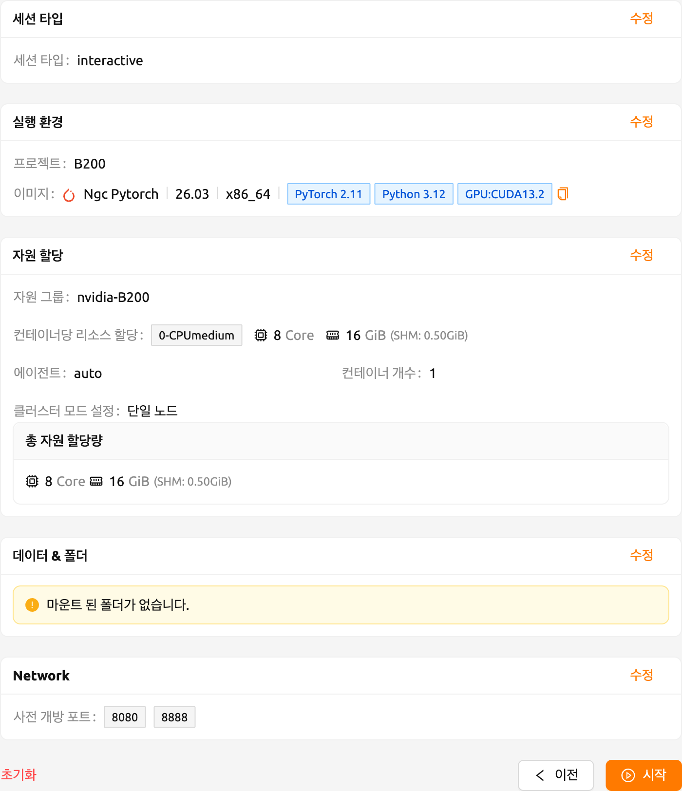

설정에 문제가 있는 경우, 다음과 같이 오류가 표시됩니다. 설정을 수정하려면 '수정' 버튼을 클릭하십시오.

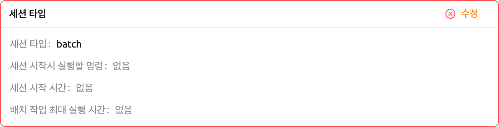

폴더 마운트 없이 시작 버튼을 클릭하면, 아무 폴더를 마운트하지 않았다는 경고 대화 상자가 나타납니다. 폴더를 마운트할 필요가 없는 경우, 경고 대화 상자의 '시작' 버튼을 클릭하여 세션을 생성합니다.

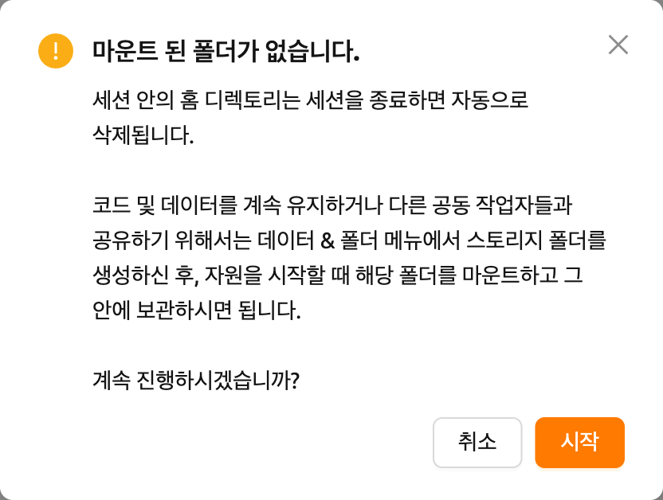

새로운 연산 세션이 **실행 중** 탭에 추가되면, 화면 우측 하단에 알림이 나타납니다. 알림의 좌측 하단 영역에는 세션 상태가 표시되고, 우측 하단 영역에는 앱 대화 상자 열기, 터미널 실행, 컨테이너 로그 보기, 세션 종료 버튼이 포함되어 있습니다. 헤더의 **알림** 을 클릭하여 이 세션 생성 알림을 다시 볼 수도 있습니다.

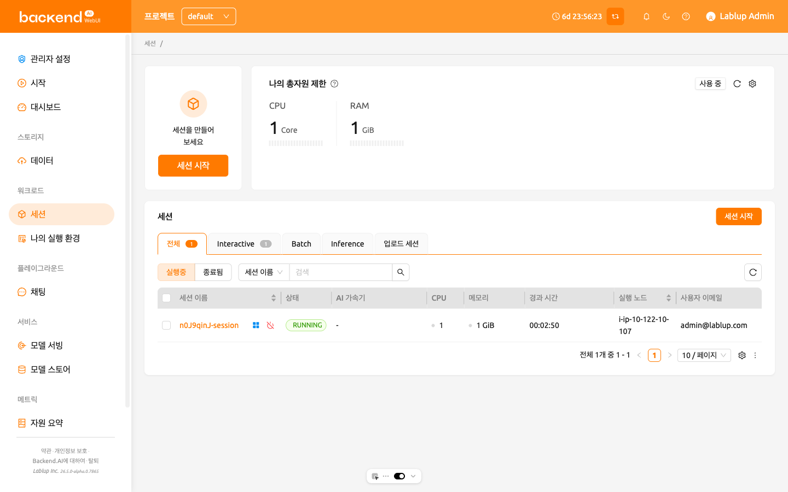

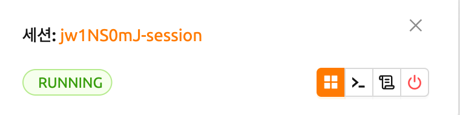

가장 왼쪽에 있는 앱 대화 상자 버튼을 클릭하면, 사용 가능한 앱 서비스를 확인할 수 있습니다.

### 최근 기록

'세션 런처' 페이지는 세션을 생성하기 위한 다양한 옵션을 제공합니다. 24.09 버전부터 이전에 생성한 세션의 정보를 기억하는 `최근 기록` 기능이 추가되었습니다.

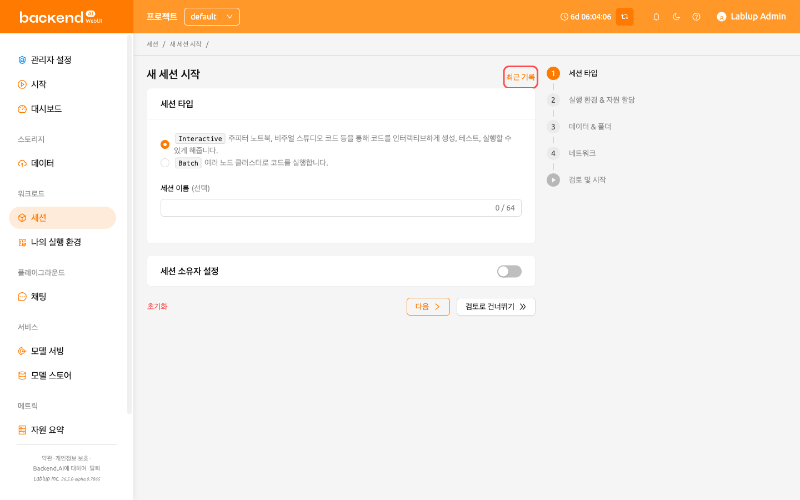

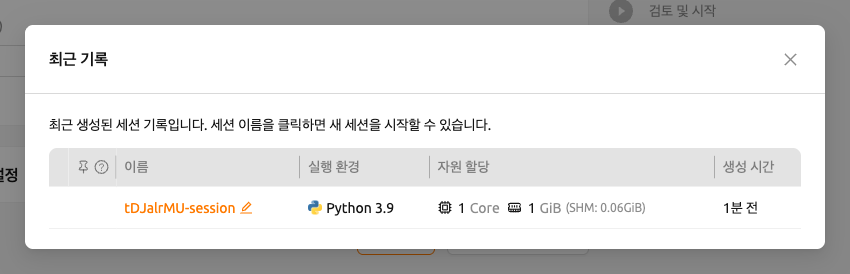

`최근 기록` 모달에는 가장 최근에 생성된 5개의 세션 정보가 저장됩니다. 세션 이름을 클릭하면 세션 생성의 마지막 단계인 '검토 및 시작' 페이지로 이동합니다. 각 항목의 이름을 변경하거나 고정하여 편리하게 접근할 수 있습니다.

:::note
슈퍼관리자의 경우 현재 클러스터에서 실행 중인 (또는 종료된) 모든 세션 정보를 확인할 수 있고, 사용자의 경우에는 자신이 사용한 세션만 조회 가능합니다.
:::

:::note
간헐적인 네트워크 접속 불량 등의 문제로 세션 리스트가 정상적으로 표시되지 않는 경우가 발생할 수 있습니다. 이 때는 브라우저 페이지를 새로고침하면 해결할 수 있습니다.
:::

## 세션 상세 정보 패널

세션에 대한 상세 정보를 확인하려면, 세션 리스트의 세션명을 클릭하십시오. 세션 상세 정보 패널에는 세션 ID, 사용자 ID, 상태, 타입, 실행 환경, 마운트 정보, 자원 할당량, 예약된 시간, 경과 시간, 에이전트, 클러스터 모드, 네트워크 I/O 를 포함한 자원 사용량, 커널 정보 등이 표시됩니다.

'커널' 섹션의 '호스트명' 옆에 있는 '로그' 버튼을 클릭하면 해당 커널의 로그를 직접 확인할 수 있습니다.

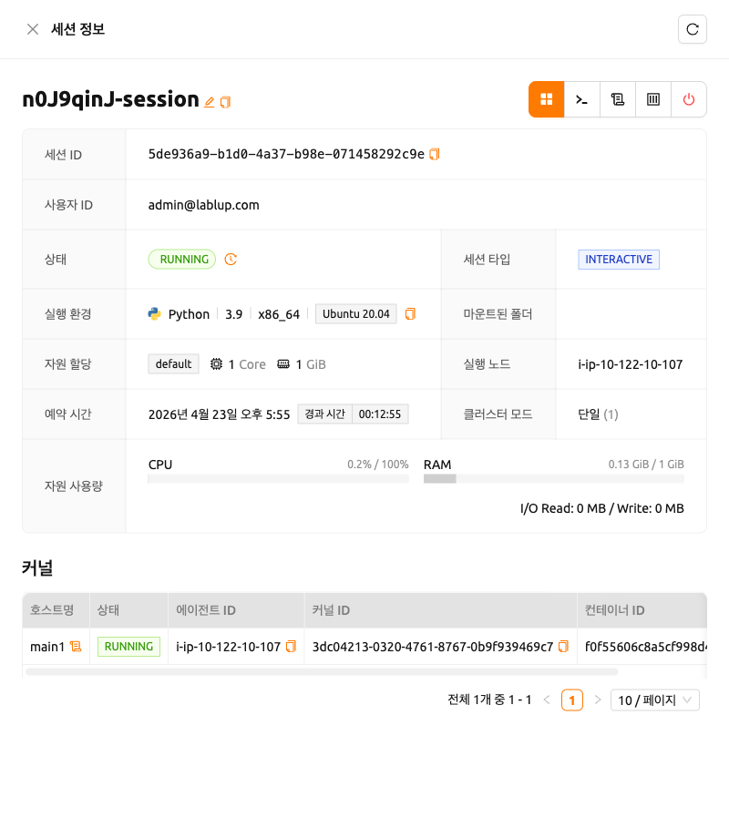

Backend.AI는 `PENDING`, `TERMINATED` 또는 `CANCELLED` 상태의 세션에 대해 추가 정보를 제공합니다. 사용 가능한 경우 '정보' 버튼을 클릭하여 세부 사항을 확인할 수 있습니다.

## Jupyter Notebook 사용하기

이미 실행 중인 연산 세션을 어떻게 사용하고 관리하는지 살펴봅시다. 세션 상세 정보 패널 우측 상단의 첫 번째 아이콘을 클릭하여 앱 런처를 열면 해당 세션에서 사용할 수 있는 앱 서비스가 표시됩니다.

:::note
앱 아이콘 아래에는 두 가지 체크 옵션이 있습니다. 각 항목을 체크하고 앱을 띄우면 다음과 같은 기능이 반영됩니다:

* 앱을 외부에 공개: 앱을 외부에 공개합니다. 기본적으로 터미널 및 Jupyter Notebook 서비스와 같은 웹 서비스는 별도 인증을 거치므로 서비스 URL을 알고 있더라도 다른 사용자가 액세스 할 수 없습니다. 그러나 이 옵션을 선택하면 서비스 URL(및 포트 번호)을 아는 사람이 접근하고 사용할 수 있습니다. 물론 사용자가 서비스에 접근하려면 네트워크 경로가 있어야 합니다.
* 선호 포트: 이 옵션을 선택하지 않으면 Backend.AI에서 미리 준비한 포트 풀에서 웹 서비스의 포트 번호가 무작위로 할당됩니다. 이 항목을 체크하고 특정 포트 번호를 입력하면 입력한 포트 번호를 먼저 시도합니다. 그러나 포트가 포트 풀에 존재하지 않거나 다른 서비스가 이미 포트를 사용 중일 수 있기 때문에 원하는 포트가 항상 할당된다는 보장은 없습니다. 이 경우 포트 번호는 임의로 할당됩니다.

시스템 설정에 따라, 이 옵션들은 보이지 않을 수도 있습니다.
:::

Jupyter Notebook 을 클릭해봅시다.

새로운 창이 뜨면서 Jupyter Notebook 이 실행되는 것을 확인할 수 있습니다. 이 Notebook 은 실행 중인 연산 세션 내부에서 생성된 것으로, 별다른 설정 없이 버튼 클릭만으로 손쉽게 사용할 수 있습니다. 또한, 연산 세션이 기본적으로 제공하는 언어 환경 및 라이브러리를 그대로 활용할 수 있어 별도의 패키지 설치 과정이 필요 없습니다. 자세한 Jupyter Notebook 사용법은 공식 문서 등을 참고하시기 바랍니다.

Notebook 의 파일 탐색기에서 `id_container file` 에는 개인 SSH 키가 포함되어 있습니다. 필요한 경우, 이 파일을 다운로드하여 컨테이너에 대한 SSH / SFTP 접속에 사용할 수 있습니다.

우측 상단의 NEW 버튼을 클릭한 후 Backend.AI 용 Notebook 을 선택하면 새로운 코드를 입력할 수 있는 ipynb 창이 뜹니다.

이 창에서 세션 환경에 맞는 코드를 입력하고 실행해볼 수 있습니다. 코드는 Backend.AI 서버를 구성하는 노드 중 연산 세션이 실제로 생성된 노드에서 실행이 되며, 로컬 머신에는 별도 환경을 구성할 필요가 없습니다.

창을 닫으면 Notebook 파일 탐색기에서 `Untitled.ipynb` 파일을 확인할 수 있습니다. 여기서 생성된 파일은 세션이 종료되면 함께 삭제됩니다. 세션이 종료된 후에도 파일을 보존하는 방법은 데이터 및 폴더 섹션에서 설명합니다.

## 웹 터미널 활용

이 섹션에서는 웹 터미널 사용 방법을 설명합니다. 터미널 아이콘(두 번째 버튼)을 클릭하면 컨테이너의 ttyd 앱을 사용할 수 있습니다. 새 창에 터미널이 나타나며, 다음 그림과 같이 쉘 명령을 실행하여 연산 세션에 접근할 수 있습니다. 명령에 익숙하다면 다양한 Linux 명령을 쉽게 실행할 수 있습니다. Jupyter Notebook 에서 확인한 `Untitled.ipynb` 파일이 `ls` 명령으로도 나열되는 것을 볼 수 있습니다. 이는 두 앱이 동일한 컨테이너 환경에서 실행되고 있음을 보여줍니다.

만약 여기서 파일을 만들면 앞서 띄운 Jupyter Notebook 에서 즉시 그 파일을 확인할 수 있습니다. 반대로, Jupyter Notebook 에서 편집한 파일의 변경 사항도 터미널에서 바로 확인할 수 있습니다. 같은 연산 세션을 사용하고 있기 때문입니다.

이 외에도 연산 세션이 제공하는 서비스의 종류에 따라 TensorBoard, Jupyter Lab 등과 같은 웹 기반 서비스를 이용할 수 있습니다.

## 연산 세션 로그 조회

돌아가고 있는 연산 세션의 Control 열의 마지막 아이콘을 클릭하면 연산 세션의 로그를 조회할 수 있습니다.

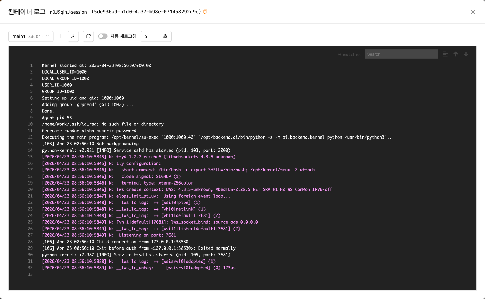

## 실행중인 세션 이름 변경하기

활성 세션의 이름을 변경할 수 있습니다. 세션 상세 정보 패널에서 '수정' 버튼을 클릭하여 세션 이름을 변경하세요. 새 세션 이름도 [세션 이름 작성 규칙](#session-naming-rule)을 따라야 합니다.

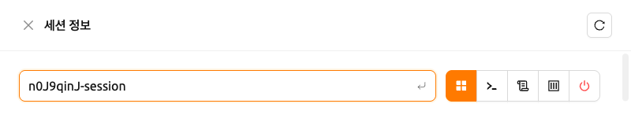

## 연산 세션 삭제하기

특정 세션을 종료하려면 빨간색 전원 버튼을 클릭한 후 대화 상자에서 '종료' 버튼을 클릭하십시오. 연산 세션이 종료되면 연산 세션 내부의 폴더에 있는 데이터가 함께 삭제되므로, 데이터를 마운트된 폴더로 옮기거나 처음부터 마운트된 폴더에 업로드하는 것을 권장합니다.

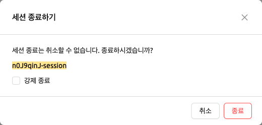

## 유휴 상태 검사

Backend.AI는 최대 세션 수명 시간, 네트워크 트래픽 기반 유휴 시간, 사용량 기반 자원 수거를 기준으로 세션이 자동으로 삭제될 수 있습니다.

세션 종료 기준은 세션 상세 정보 패널의 '유휴 상태 검사' 섹션에서 확인할 수 있습니다.

각 항목의 의미는 다음과 같으며, 우측의 정보(i) 버튼을 클릭해서 자세한 설명을 확인할 수도 있습니다.

- 최대 세션 수명 시간: 세션 생성 후 이 시간이 지나면 세션을 강제 종료합니다. 이는 세션이 무한히 실행되는 것을 방지하기 위한 조치입니다.
- 네트워크 트래픽 기반 유휴 시간: 사용자(브라우저)와 연산 세션 사이에 이 시간 동안 아무런 네트워크 트래픽이 없을 경우 연산 세션을 삭제합니다. 사용자와 연산 세션 사이의 트래픽은 앱 (터미널, Jupyter 등)을 통해 상호작용(키보드 입력, Jupyter 셀 생성 등) 하는 경우 지속적으로 발생합니다. 만약, 연산 세션을 띄운 채 일정 시간 동안 아무런 입력을 하지 않으면 자동 삭제 조건을 만족하게 됩니다. 연산 세션에서 작업을 수행 중인 프로세스가 있더라도, 사용자와의 상호작용이 없는 경우에는 삭제 대상입니다.
- 사용량 기반 자원 수거: 연산 세션에 할당된 자원을 자원의 활용률을 기준으로 회수합니다. 연산 세션의 삭제 여부는 다음 두 가지 요소에 따라 결정됩니다:

  - 유예 기간: 이 기간 동안은 자원 사용량 기반 체커가 작동하지 않습니다. 즉, 유예 기간이 지나기 전까지는 사용량이 기준보다 낮더라도 연산 세션이 삭제되지 않습니다. 하지만 유예 기간이 지나고 나면, 설정된 유휴 시간(idle timeout) 동안의 평균 자원 사용률이 기준에 미치지 못하는 경우 해당 세션이 삭제될 수 있습니다. 유예 기간은 세션 종료가 이루어지지 않는 것을 보장하는 시간일 뿐입니다. 이는 주로 사용률이 낮은 GPU 자원을 효율적으로 관리하기 위한 조치입니다.
  - 자원 사용량 기준: 연산 세션의 자원 사용량이 일정 시간(idle timeout) 동안 설정된 기준값을 넘지 못하면, 해당 세션은 자동으로 삭제됩니다. 예를 들어, 가속 장치 사용률 기준을 1%로 설정했다면 idle timeout 시간 동안 평균 가속 장치 사용률이 1% 미만인 연산 세션은 삭제 대상이 됩니다. 값이 설정되지 않는 자원은 자동 삭제 기준에서 제외됩니다.

:::note
유예 기간이 지난 후에는 사용량이 낮으면 언제든지 삭제될 수 있습니다. 자원을 잠깐 사용했다고 해서 유예 기간이 연장되지 않습니다. 오직 현 시점으로부터 지난 idle timeout 시간 동안의 평균 자원 사용률만이 고려됩니다.
:::

사용량 기반 자원 수거에 마우스를 가져가면, 사용률과 수거 기준값을 보여주는 툴팁이 나타납니다. 현재 사용률이 수거 기준값에 접근할수록(사용량이 저조할수록) 글자 색이 노란색, 빨간색 순으로 변하게 됩니다.

:::note
환경 설정 값에 따라, 유휴 상태 검사 기준과 사용량 기반 자원 수거 툴팁에 나타나는 자원 항목이 다르게 보일 수 있습니다.
:::

## 세션 생성하기 전에 환경 변수를 추가하는 방법

사용자에게 보다 편리한 작업 환경을 제공하기 위해, Backend.AI는 세션 생성 시 환경 변수 설정을 지원합니다. 이 기능을 통해 사용자는 환경 변수 설정 대화 상자에서 변수 이름과 값을 입력하여 `PATH` 등의 환경 변수를 추가할 수 있습니다.

더 많은 환경 변수를 추가하고 싶을 경우, 입력 필드 첫번째 행의 오른쪽에 있는 '+ 환경 변수 추가' 버튼을 클릭하면 됩니다. 또한 환경 변수를 지우고 싶을 경우, 지우고자 하는 행의 '-' 버튼을 클릭하면 됩니다.

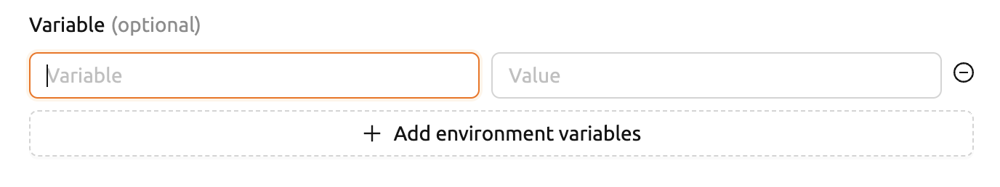

환경 변수 명과 값을 같은 행의 입력 필드에 입력할 수 있습니다.

## 세션 생성하기 전에 사전 개방 포트를 추가하는 방법

Backend.AI는 컨테이너 시작 전 사전 개방 포트를 설정하는 것을 지원합니다. 이 기능을 사용하면, 서빙 포트를 노출하기 위해 별도의 이미지를 추가로 빌드할 필요가 없습니다.

사전 개방 포트를 추가하려면 쉼표(,)나 공백으로 구분하여 여러 값을 입력할 수 있습니다.

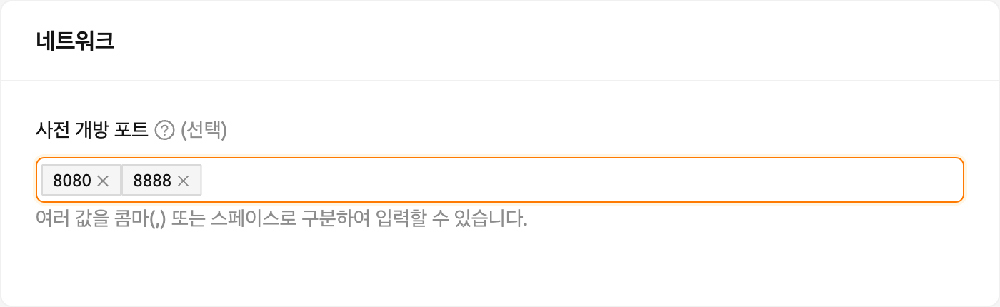

해당 다이얼로그에서 사전 개방 포트를 추가하거나, 작성한 사전 개방 포트를 갱신, 삭제할 수 있습니다. 더욱 자세한 설명이 필요한 경우, 다이얼로그 헤더 부분에 있는 '도움말 (?)' 버튼을 클릭해주세요.

입력란에 1024 ~ 65535 사이의 포트값을 입력한 뒤, 엔터 키를 누르세요. 각 포트는 쉼표(,)로 구분되며, 여러 포트를 설정할 수 있습니다. 설정된 사전 개방 포트값은 세션 앱 런처에서 확인할 수 있습니다.

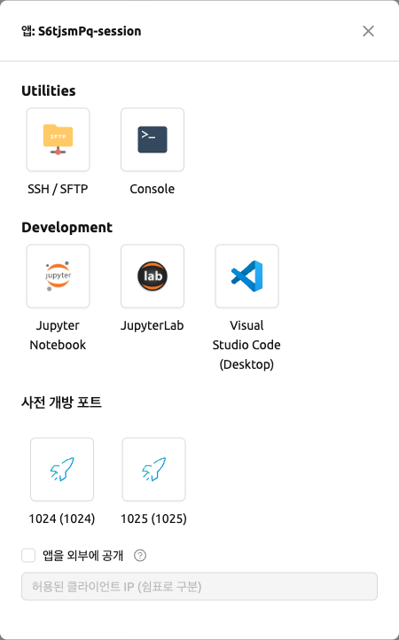

:::note
사전 개방 포트는 **컨테이너 내부 포트** 입니다. 따라서, 다른 앱들과 달리 세션 앱 런처에서 사전 개방 포트를 클릭하면 빈 페이지가 나타납니다. 사용하기 전에 해당 포트에 서버를 바인딩하세요.
:::

## 세션 커밋 저장하기

Backend.AI는 24.03 버전부터 "세션을 이미지로 변환" 기능을 지원합니다. `RUNNING` 상태의 세션을 커밋하면 세션의 현재 상태가 새로운 이미지로 저장됩니다. 세션 상세 정보 패널에서 '커밋' 버튼(네 번째 아이콘)을 클릭하면 세션 정보가 표시된 대화 상자가 열립니다. 세션 이름을 입력한 후 세션을 새 이미지로 변환할 수 있습니다. 세션 이름은 4자에서 32자 사이여야 하며, 영숫자, 하이픈(`-`) 또는 밑줄(`_`)만 포함할 수 있습니다.

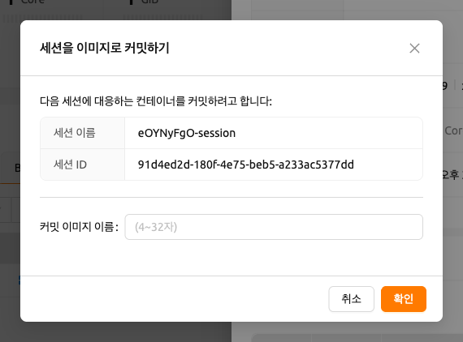

입력 필드에 세션 이름을 입력한 후 'PUSH SESSION TO CUSTOMIZED IMAGE' 버튼을 클릭합니다. 이 방법으로 생성된 커스텀 이미지는 향후 세션 생성 시 사용할 수 있습니다. 그러나 이미지 커밋 시 컨테이너에 마운트된 디렉토리는 외부 자원으로 간주되어 최종 이미지에 포함되지 않습니다. `/home/work`는 마운트 폴더(스크래치 디렉토리)이므로 포함되지 않는다는 점을 기억하세요.

:::note
현재 Backend.AI는 세션이 `INTERACTIVE` 모드일 때만 "세션을 이미지로 변환" 기능을 지원합니다. 예기치 않은 오류를 방지하기 위해, 커밋 진행 중에는 세션을 종료하지 못할 수 있습니다. 진행 중인 프로세스를 중단하려면, 해당 세션을 확인하고 강제 종료하세요.
:::

:::note
"세션을 이미지로 변환" 횟수는 사용자 자원 정책에 의해 제한될 수 있습니다. 이 경우 [기존 커스텀 이미지 삭제](#delete-customized-image) 후 다시 시도하세요. 그래도 문제가 해결되지 않으면, 관리자에게 문의하시기 바랍니다.
:::

## 진행 중인 세션의 변환된 이미지 활용

진행 중인 세션을 이미지로 변환하면, 새 세션을 생성할 때 세션 런처의 실행 환경에서 이 이미지를 선택할 수 있습니다. 이 이미지는 다른 사용자에게 노출되지 않으며, 현재 세션 상태를 그대로 계속 사용하려는 경우에 유용합니다. 변환된 이미지에는 `Customized<세션 이름>` 태그가 지정됩니다.

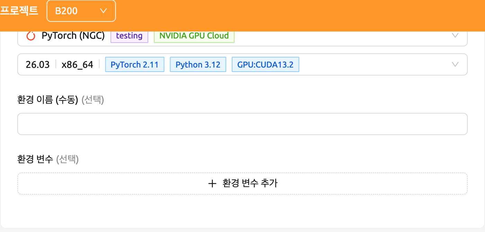

향후 세션 생성을 위해 환경 이름을 수동으로 입력하려면, 복사 아이콘을 누릅니다.

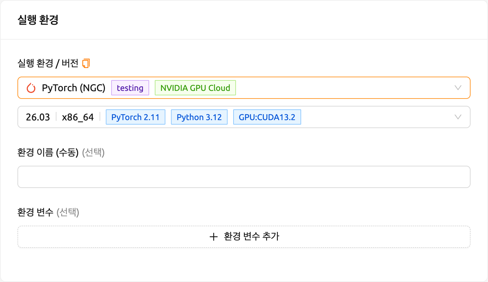

## 웹 터미널 고급 사용법

웹 기반 터미널에는 [tmux](https://github.com/tmux/tmux/wiki)라는 유틸리티가 내장되어 있습니다. tmux는 단일 쉘 내에서 여러 쉘 창을 열 수 있는 터미널 멀티플렉서로, 여러 프로그램을 동시에 포그라운드에서 실행할 수 있도록 합니다. tmux의 보다 강력한 기능을 활용하고 싶다면 공식 tmux 문서와 인터넷의 다양한 사용 예제를 참고하시기 바랍니다.

여기서는 몇 가지 간단하지만 유용한 기능을 소개하겠습니다.

### 터미널 내용 복사하기

tmux는 유용한 기능을 많이 제공하지만, 처음 사용하는 사용자에게는 다소 혼란스러울 수 있습니다. 특히, tmux는 자체 클립보드 버퍼를 가지고 있어 터미널 내용을 복사할 때 기본적으로 tmux 내부에서만 붙여넣기가 가능합니다. 또한, 웹 브라우저 내의 tmux에 사용자 시스템의 클립보드를 노출하기 어려워, 터미널 내용을 사용자 컴퓨터의 다른 프로그램에 복사하여 붙여넣을 수 없습니다. 즉, tmux에서는 일반적인 `Ctrl-C` / `Ctrl-V` 가 작동하지 않습니다.

터미널 내용을 시스템 클립보드로 복사하여 붙여넣기해야 하는 경우, tmux의 마우스 지원을 일시적으로 끌 수 있습니다. 먼저 `Ctrl-B` 키를 눌러 tmux 제어 모드에 진입합니다. 그런 다음 `:set -g mouse off` 를 입력하고 `Enter` 를 누릅니다 (맨 앞의 콜론도 함께 입력해야 합니다). 화면 하단의 상태 표시줄에서 입력 내용을 확인할 수 있습니다. 그런 다음 마우스로 터미널에서 원하는 텍스트를 드래그하고 `Ctrl-C` 또는 `Cmd-C` (Mac의 경우)를 눌러 사용자 컴퓨터의 클립보드에 복사합니다.

마우스 지원이 꺼진 상태에서는 마우스 휠로 터미널의 이전 페이지 내용을 스크롤할 수 없습니다. 이 경우 마우스 지원을 다시 켤 수 있습니다. `Ctrl-B` 를 누르고 `:set -g mouse on` 을 입력합니다. 그러면 마우스 휠로 이전 페이지 내용을 스크롤하여 확인할 수 있습니다.

`Ctrl-B` 이후 `:set -g mouse off` 또는 `:set -g mouse on` 을 기억해 두면 웹 터미널을 보다 편리하게 사용할 수 있습니다.

:::note
`Ctrl-B` 는 tmux의 기본 제어 모드 키입니다. 사용자 홈 디렉토리의 `.tmux.conf` 파일을 수정하여 다른 제어 키를 설정한 경우, `Ctrl-B` 대신 설정한 키 조합을 눌러야 합니다.
:::

:::note
윈도우즈 환경에서는 다음 단축키를 참고하세요.

* 복사: `Shift` 를 누른 채 마우스 오른쪽 버튼을 클릭하고 드래그합니다.
* 붙여넣기: `Ctrl-Shift-V` 를 누릅니다.
:::

### 키보드를 이용한 터미널 기록 확인

터미널 내용을 복사하면서 동시에 이전 터미널 내용을 확인하는 방법도 있습니다. 바로 키보드를 사용하여 이전 내용을 확인하는 것입니다. 먼저 `Ctrl-B` 를 누른 후 `Page Up` 및/또는 `Page Down` 키를 누릅니다. 검색 모드를 종료하려면 `q` 키를 누르면 됩니다. 이 방법을 사용하면 마우스 지원이 꺼져 있을 때에도 터미널 기록의 내용을 확인할 수 있습니다.

### 여러 개의 쉘 띄우기

tmux의 주요 장점은 하나의 터미널 창에서 여러 쉘을 실행하고 사용할 수 있다는 것입니다. `Ctrl-B` 키를 누른 후 `c` 를 누르면 새로운 쉘 환경이 나타납니다. 이전 창은 현재 시점에서는 보이지 않지만 종료된 것은 아닙니다. `Ctrl-B` 를 누른 후 `w` 를 누르면 tmux에서 현재 열려 있는 쉘 목록이 표시됩니다. `0:` 으로 시작하는 쉘이 초기 쉘 환경이고, `1:` 으로 시작하는 쉘이 방금 생성한 쉘입니다. 위/아래 키를 사용하여 쉘 간에 이동할 수 있습니다. 커서를 `0:` 쉘에 놓고 Enter 키를 눌러 선택합니다.

이와 같이 웹 터미널 내에서 여러 쉘 환경을 사용할 수 있습니다. 현재 쉘을 종료하려면 `exit` 명령을 입력하거나 `Ctrl-B x` 키를 누른 후 `y` 를 입력합니다.

정리하면 다음과 같습니다:

- `Ctrl-B c`: 새 tmux 쉘 생성
- `Ctrl-B w`: 현재 tmux 쉘 목록 조회 및 이동
- `exit` 또는 `Ctrl-B x`: 현재 쉘 종료

위 명령을 조합하여 여러 개의 쉘에서 동시에 다양한 작업을 수행할 수 있습니다.
