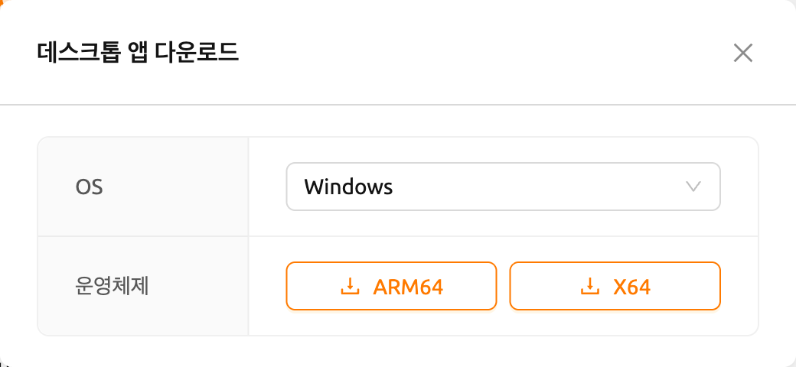
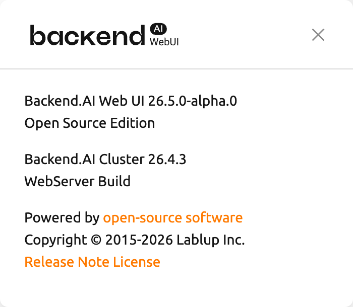

<a id="ssh-sftp-container"></a>

# 연산 세션에 SSH/SFTP 접속하기

Backend.AI는 생성된 연산 세션(컨테이너)에 SSH/SFTP 접속을 지원하고 있습니다. 이번 절에서는 그 방법에 관해 알아봅니다.

:::note
24.03 버전부터 SSH/SFTP 접속 기능은 웹 브라우저와 WebUI 데스크톱 앱 모두에서 사용할 수 있습니다.
23.09 이하 버전에서는 WebUI 데스크톱 앱을 사용해야 합니다. 데스크톱 앱은 요약(Summary) 페이지의 패널에서 다운로드할 수 있습니다. 이 패널을 통해 호환되는 버전이 자동으로 다운로드됩니다.



https://github.com/lablup/backend.ai-webui/releases 에서도 앱을 다운로드할 수 있습니다. 이 경우, 호환되는 버전의 Web-UI를 다운로드해야 합니다. Web-UI 버전은 GUI 우측 상단의 환경설정 메뉴에 있는 "About Backend.AI" 하위 메뉴를 클릭하여 확인할 수 있습니다.
:::


<a id="for-linux-mac"></a>

## Linux / Mac 환경

먼저 연산 세션을 하나 생성한 후 Control의 앱 아이콘(첫 번째 버튼)을 클릭하고 SSH / SFTP 아이콘을 클릭합니다. 그러면 해당 컨테이너 내부에서 SSH/SFTP 접속을 할 수 있도록 해주는 데몬(daemon)이 실행되고, 로컬 proxy를 통해 Web-UI 앱과 컨테이너 내부의 데몬이 연결됩니다.


:::note
이 아이콘을 클릭하기 전에는 해당 세션에 SSH/SFTP 접속을 할 수 없습니다. Web-UI 앱을 껐다가 다시 켜게 되면 로컬 proxy와 Web-UI 앱 사이의 연결이 초기화되므로 SSH/SFTP 아이콘을 다시 한 번 클릭해주어야 합니다.
:::

다음으로, SSH/SFTP 접속 정보가 담긴 대화상자가 팝업됩니다. SFTP URL에 적혀 있는 주소(특히 할당된 포트 번호)를 기억해 두고, 다운로드 링크를 클릭하여 `id_container` 파일을 로컬 머신에 저장합니다. 이 파일은 자동으로 생성된 SSH 개인 키입니다. 링크를 사용하는 대신, 웹 터미널이나 Jupyter Notebook을 통해 `/home/work/` 아래에 위치한 `id_container` 파일을 직접 다운로드할 수도 있습니다. 자동 생성된 SSH 키는 새 세션이 생성되면 변경될 수 있으며, 그 경우 다시 다운로드해야 합니다.


다운로드한 SSH 개인 키를 사용하여 연산 세션에 SSH 접속하려면, 쉘 환경에서 다음 명령을 실행합니다. `-i` 옵션 뒤에 다운로드한 `id_container` 파일의 경로를, `-p` 옵션 뒤에 할당된 포트 번호를 입력합니다. 연산 세션 내부의 사용자 계정은 보통 `work`으로 설정되어 있지만, 세션이 다른 계정을 사용하는 경우 `work@127.0.0.1`에서 `work` 부분을 실제 세션 계정으로 변경해야 합니다. 명령을 올바르게 실행하면, 연산 세션에 SSH 접속이 이루어지고 컨테이너의 쉘 환경이 표시됩니다.

```shell
$ ssh \
    -i ~/.ssh/id_container -p 30722 \
    -o StrictHostKeyChecking=no \
    -o UserKnownHostsFile=/dev/null \
    work@127.0.0.1
Warning: Permanently added '[127.0.0.1]:30722' (RSA) to the list of known hosts.
f310e8dbce83:~$
```

SFTP로 접속하는 방법도 거의 동일합니다. SFTP 클라이언트를 실행한 후 공개 키 기반 접속 방식을 설정하고, SSH 개인 키로 `id_container`를 지정합니다. 각 FTP 클라이언트마다 설정 방법이 다를 수 있으므로, 자세한 내용은 해당 FTP 클라이언트의 매뉴얼을 참고하세요.


:::note
SSH/SFTP 접속 포트 번호는 세션이 생성될 때마다 무작위로 할당됩니다. 특정 SSH/SFTP 포트 번호를 사용하려면, 사용자 설정 메뉴의 "Preferred SSH Port" 필드에 원하는 포트 번호를 입력할 수 있습니다. 연산 세션 내의 다른 서비스와의 충돌을 방지하기 위해 10000-65000 사이의 포트 번호를 지정하는 것이 좋습니다. 단, 두 개 이상의 연산 세션에서 동시에 SSH/SFTP 접속을 하는 경우, 두 번째 SSH/SFTP 접속은 지정된 포트를 사용할 수 없으므로(첫 번째 SSH/SFTP 접속이 이미 해당 포트를 사용 중이므로), 무작위 포트 번호가 할당됩니다.
:::

:::note
`id_container` 대신 자체 SSH 키페어를 사용하려면, `.ssh`라는 이름의 사용자 타입 폴더를 생성합니다. 해당 폴더에 `authorized_keys` 파일을 생성하고 SSH 공개 키의 내용을 추가하면, 연산 세션 생성 후 `id_container`를 다운로드하지 않고도 자체 SSH 개인 키로 SSH/SFTP 접속이 가능합니다.
:::

:::note
다음과 같은 경고 메시지가 표시되면, `id_container`의 퍼미션을 600으로 변경한 후 다시 시도하세요. (`chmod 600 <id_container 경로>`)


:::


<a id="for-windows-filezilla"></a>

## Windows / FileZilla 환경

Backend.AI Web-UI 앱은 OpenSSH 기반 공개 키 접속(RSA2048)을 지원합니다. Windows에서 PuTTY와 같은 클라이언트로 접속하려면, PuTTYgen과 같은 프로그램을 통해 개인 키를 `ppk` 파일로 변환해야 합니다. 변환 방법은 다음 링크를 참고할 수 있습니다: https://wiki.filezilla-project.org/Howto. 이 절에서는 Windows에서 FileZilla 클라이언트를 통해 SFTP에 접속하는 방법을 설명합니다.

Linux/Mac에서의 접속 방법을 참고하여, 연산 세션을 생성하고 접속 포트를 확인한 후 `id_container`를 다운로드합니다. `id_container`는 OpenSSH 기반 키이므로, Windows 전용이거나 ppk 타입 키만 지원하는 클라이언트를 사용하는 경우 변환이 필요합니다. 여기서는 PuTTY와 함께 설치되는 PuTTYgen 프로그램을 통해 변환합니다. PuTTYgen을 실행한 후, Conversions 메뉴에서 import key를 클릭합니다. 파일 열기 대화상자에서 다운로드한 `id_container` 파일을 선택합니다. PuTTYgen의 Save private key 버튼을 클릭하고 파일을 `id_container.ppk`라는 이름으로 저장합니다.


FileZilla 클라이언트를 실행한 후, 설정-연결-SFTP로 이동하여 키 파일 `id_container.ppk`(OpenSSH를 지원하는 클라이언트의 경우 `id_container`)를 등록합니다.


사이트 관리자를 열고, 새 사이트를 생성한 후 다음과 같이 접속 정보를 입력합니다.


컨테이너에 처음 접속할 때 다음과 같은 확인 팝업이 나타날 수 있습니다. OK 버튼을 클릭하여 호스트 키를 저장합니다.


잠시 후, 다음과 같이 접속이 완료된 것을 확인할 수 있습니다. 이 SFTP 접속을 통해 `/home/work/` 또는 마운트된 스토리지 폴더로 대용량 파일을 전송할 수 있습니다.


<a id="for-visual-studio-code"></a>

## Visual Studio Code 환경

Backend.AI는 연산 세션에 대한 SSH/SFTP 접속을 통해 로컬 Visual Studio Code로 개발하는 것을 지원합니다. 접속이 완료되면 연산 세션의 어디에 있는 파일과 폴더든 자유롭게 작업할 수 있습니다. 이 절에서는 그 방법을 알아봅니다.

먼저, Visual Studio Code와 Remote Development 확장 팩을 설치해야 합니다.

링크: https://aka.ms/vscode-remote/download/extension


확장을 설치한 후, 연산 세션에 대한 SSH 접속을 설정합니다. VSCode Remote Connection 대화상자에서 복사 아이콘 버튼을 클릭하여 Visual Studio Code 원격 SSH 비밀번호를 복사합니다. 포트 번호도 기억해 둡니다.


그런 다음, SSH config 파일을 설정합니다. `~/.ssh/config` 파일(Linux/Mac의 경우) 또는 `C:\Users\[사용자 이름]\.ssh\config` 파일(Windows의 경우)을 편집하고 다음 블록을 추가합니다. 편의를 위해 호스트 이름을 `bai-vscode`로 설정합니다. 원하는 별칭으로 변경할 수 있습니다.

```
Host bai-vscode
User work
Hostname 127.0.0.1
# 앞서 기억해 둔 포트 번호를 입력합니다
Port 49335
StrictHostKeyChecking no
UserKnownHostsFile /dev/null
```

이제 Visual Studio Code에서 `View` 메뉴의 `Command Palette...`를 선택합니다.


Visual Studio Code는 접속하려는 호스트 유형을 자동으로 감지합니다. `Remote-SSH: Connect to Host...`를 선택합니다.


`.ssh/config`에 있는 호스트 목록이 표시됩니다. 접속할 호스트를 선택합니다. 여기서는 `vscode`를 선택합니다.


호스트 이름을 선택하면 원격 연산 세션에 접속됩니다. 접속이 완료되면 빈 창이 표시됩니다. 상태 표시줄에서 접속된 호스트를 항상 확인할 수 있습니다.


이제 평소처럼 `File > Open...` 또는 `File > Open Workspace...` 메뉴를 통해 원격 호스트의 폴더나 워크스페이스를 열 수 있습니다.


<a id="establish-ssh-connection-with-backendai-client-package"></a>

## Backend.AI 클라이언트 패키지로 SSH 접속 설정

이 절에서는 그래픽 사용자 인터페이스(GUI)를 사용할 수 없는 환경에서 연산 세션에 SSH 접속을 설정하는 방법을 설명합니다.

일반적으로, 연산 세션(컨테이너)을 실행하는 GPU 노드는 외부에서 직접 접근할 수 없습니다. 따라서 연산 세션에 SSH 또는 SFTP 접속을 하려면, 사용자와 세션 간의 연결을 중계하는 터널을 생성하는 로컬 proxy를 실행해야 합니다. Backend.AI Client 패키지를 사용하면 이 과정을 비교적 간단하게 설정할 수 있습니다.

<a id="prepare-backendai-client-package"></a>

### Backend.AI Client 패키지 준비

<a id="prepare-with-docker-image"></a>

#### Docker 이미지로 준비

Backend.AI Client 패키지는 Docker 이미지로 제공됩니다. 다음 명령으로 Docker Hub에서 이미지를 가져올 수 있습니다.

```bash
$ docker pull lablup/backend.ai-client
$
$ # 특정 버전을 사용하려면 다음 명령으로 이미지를 가져올 수 있습니다:
$ docker pull lablup/backend.ai-client:<version>
```

Backend.AI 서버 버전은 Web UI 우측 상단의 사람 아이콘을 클릭하면 나타나는 "About Backend.AI" 메뉴에서 확인할 수 있습니다.



다음 명령으로 Docker 이미지를 실행합니다.

```bash
$ docker run --rm -it lablup/backend.ai-client bash
```

컨테이너에서 `backend.ai` 명령을 사용할 수 있는지 확인합니다. 사용 가능하면 도움말 메시지가 표시됩니다.

```bash
$ backend.ai
```

<a id="prepare-directly-from-host-with-a-python-virtual-environment"></a>

#### Python 가상 환경으로 호스트에서 직접 준비

Docker를 사용할 수 없거나 사용하지 않으려면, Backend.AI Client 패키지를 호스트 머신에 직접 설치할 수 있습니다. 사전 요구 사항은 다음과 같습니다.

- 필요한 Python 버전은 Backend.AI Client 버전에 따라 다를 수 있습니다. 호환성 매트릭스는 다음에서 확인할 수 있습니다: https://github.com/lablup/backend.ai#python-version-compatibility.
- `clang` 컴파일러가 필요할 수 있습니다.
- `indygreg` Python 바이너리를 사용하는 경우 `zstd` 패키지가 필요할 수 있습니다.

패키지 설치에는 Python 가상 환경을 사용하는 것이 권장됩니다. 한 가지 방법은 `indygreg` 리포지토리의 정적으로 빌드된 Python 바이너리를 사용하는 것입니다. 다음 페이지에서 로컬 머신 아키텍처에 맞는 바이너리를 다운로드하고 압축을 해제합니다.

- https://github.com/indygreg/python-build-standalone/releases
- 일반적인 x86 기반 Ubuntu 환경을 사용하는 경우, 다음과 같이 다운로드하고 압축을 해제할 수 있습니다:

  ```bash
  $ wget https://github.com/indygreg/python-build-standalone/releases/download/20240224/cpython-3.11.8+20240224-x86_64-unknown-linux-gnu-pgo-full.tar.zst
  $ tar -I unzstd -xvf *.tar.zst
  ```

바이너리 압축을 해제하면 현재 디렉토리 아래에 `python` 디렉토리가 생성됩니다. 다음 명령으로 다운로드한 Python 버전을 확인할 수 있습니다.

```bash
$ ./python/install/bin/python3 -V
Python 3.11.8
```

시스템의 다른 Python 환경에 영향을 주지 않기 위해 별도의 Python 가상 환경을 생성하는 것이 권장됩니다. 다음 명령을 실행하면 `.venv` 디렉토리 아래에 Python 가상 환경이 생성됩니다.

```bash
$ ./python/install/bin/python3 -m venv .venv
```

가상 환경을 활성화합니다. 새 가상 환경이 활성화되었으므로, `pip list` 명령을 실행하면 `pip`과 `setuptools` 패키지만 설치되어 있는 것을 확인할 수 있습니다.

```bash
$ source .venv/bin/activate
(.venv) $ pip list
Package    Version
---------- -------
pip        24.0
setuptools 65.5.0
```

이제 Backend.AI Client 패키지를 설치합니다. 서버 버전에 맞는 클라이언트 패키지를 설치합니다. 여기서는 버전이 23.09라고 가정합니다. `netifaces` 패키지와 관련된 설치 오류가 발생하면, `pip`과 `setuptools`의 버전을 낮춰야 할 수 있습니다. `backend.ai` 명령을 사용할 수 있는지 확인합니다.

```bash
(.venv) $ pip install -U pip==24.0 && pip install -U setuptools==65.5.0
(.venv) $ pip install -U backend.ai-client~=23.09
(.venv) $ backend.ai
```

<a id="setting-up-server-connection-for-cli"></a>

### CLI 서버 접속 설정

`.env` 파일을 생성하고 다음 내용을 추가합니다. `webserver-url`에는 브라우저에서 Web UI 서비스에 접속할 때 사용하는 동일한 주소를 입력합니다.

```bash
BACKEND_ENDPOINT_TYPE=session
BACKEND_ENDPOINT=<webserver-url>
```

다음 CLI 명령을 실행하여 서버에 접속합니다. 브라우저에서 로그인할 때 사용하는 이메일과 비밀번호를 입력합니다. 정상적으로 완료되면 `Login succeeded` 메시지가 표시됩니다.

```bash
$ backend.ai login
User ID: myuser@test.com
Password:
✓ Login succeeded.
```

<a id="sshscp-connection-to-computation-session"></a>

### 연산 세션에 SSH/SCP 접속

브라우저에서 데이터를 복사할 폴더를 마운트하여 연산 세션을 생성합니다. CLI로도 세션을 생성할 수 있지만, 편의를 위해 브라우저에서 생성했다고 가정합니다. 생성된 연산 세션의 이름을 기억해 둡니다. 여기서는 `ibnFmWim-session`이라고 가정합니다.

단순히 SSH 접속만 하려면 다음 명령을 실행합니다.

```bash
$ backend.ai ssh ibnFmWim-session
∙ running a temporary sshd proxy at localhost:9922 ...
work@main1[ibnFmWim-session]:~$
```

SSH 키 파일을 다운로드하고 ssh 명령을 직접 실행하려면, 먼저 다음 명령을 실행하여 로컬 머신에서 연산 세션으로의 연결을 중계하는 로컬 proxy 서비스를 시작해야 합니다. `-b` 옵션으로 로컬 머신에서 사용할 포트(9922)를 지정할 수 있습니다.

```bash
$ backend.ai app ibnFmWim-session sshd -b 9922
∙ A local proxy to the application "sshd" provided by the session "ibnFmWim-session" is available at:
tcp://127.0.0.1:9922
```

로컬 머신에서 다른 터미널 창을 엽니다. `.env` 파일이 있는 작업 디렉토리로 이동하고, 연산 세션에서 자동으로 생성된 SSH 키를 다운로드합니다.

```bash
$ source .venv/bin/activate  # 다른 터미널이므로 Python 가상 환경을 다시 활성화합니다
$ backend.ai session download ibnFmWim-session id_container
Downloading files: 3.58kbytes [00:00, 352kbytes/s]
✓ Downloaded to /*/client.
```

다운로드한 키를 사용하여 다음과 같이 SSH 접속할 수 있습니다. 로컬 proxy를 포트 9922에서 실행했으므로, 접속 주소는 127.0.0.1, 포트는 9922로 설정합니다. 접속 사용자 계정은 `work`을 사용합니다.

```bash
$ ssh \
-o StrictHostKeyChecking=no \
-o UserKnownHostsFile=/dev/null \
-i ./id_container \
-p 9922 \
work@127.0.0.1
Warning: Permanently added '[127.0.0.1]:9922' (RSA) to the list of known hosts.
work@
```

마찬가지로, `scp` 명령을 사용하여 파일을 복사할 수 있습니다. 이 경우, 세션이 종료된 후에도 파일을 보존하려면 연산 세션 내의 마운트된 폴더에 파일을 복사해야 합니다.

```bash
$ scp \
-o StrictHostKeyChecking=no \
-o UserKnownHostsFile=/dev/null \
-i ./id_container \
-P 9922 \
test_file.xlsx work@127.0.0.1:/home/work/myfolder/
Warning: Permanently added '[127.0.0.1]:9922' (RSA) to the list of known hosts.
test_file.xlsx
```

모든 작업이 완료되면, 첫 번째 터미널에서 `Ctrl-C`를 눌러 로컬 proxy 서비스를 종료합니다.
