# 스토리지 폴더 공유 및 접근 제어

스토리지 폴더의 내용을 다른 사용자 또는 프로젝트 멤버와 공유하여 공동 작업을 수행할 필요가 있을 수 있습니다. 이를 위해 Backend.AI에서는 유연한 폴더 공유 기능을 제공합니다.

## 개인 스토리지 폴더를 다른 사용자와 공유하기

개인 스토리지 폴더를 다른 사용자와 공유하는 방법을 알아보겠습니다. 먼저 사용자 A의 계정으로 로그인하여 데이터 페이지로 이동합니다. 여러 폴더가 있으며, 그 중 `tests`라는 폴더를 사용자 B에게 공유하려고 합니다.

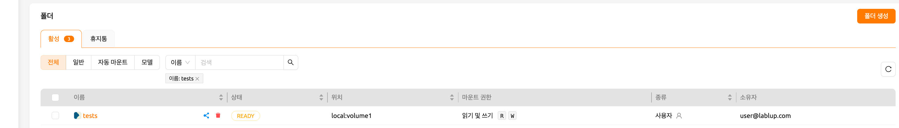

`tests` 폴더 내부에는 `hello.txt`와 `myfolder` 같은 파일과 디렉토리가 있습니다.

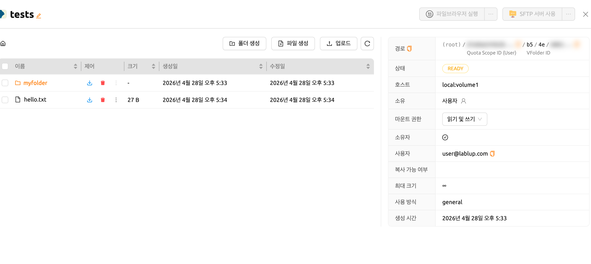

사용자 B의 계정으로 로그인했을 때 `tests` 폴더가 목록에 표시되지 않는 것을 확인합니다.

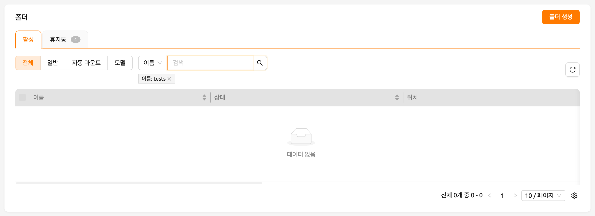

   사용자 B의 계정에 이미 `tests`라는 이름의 폴더가 존재하는 경우, 사용자 A의
   `tests` 폴더를 사용자 B와 공유할 수 없습니다.

사용자 A의 계정으로 돌아가서, 목록에 있는 `tests` 폴더의 제어 열에서 공유 버튼을 클릭합니다.

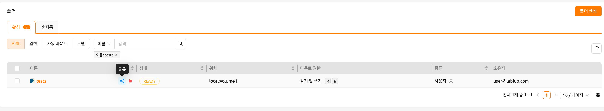

공유 모달의 '사용자 초대' 항목에 사용자 B의 이메일 주소를 입력하고, 원하는 권한 수준을 선택합니다. '읽기 전용'을 선택하면 사용자 B는 폴더를 조회만 할 수 있으며 수정은 할 수 없습니다. '읽기 및 쓰기'를 선택하면 사용자 B는 폴더를 조회하고 수정할 수 있습니다.

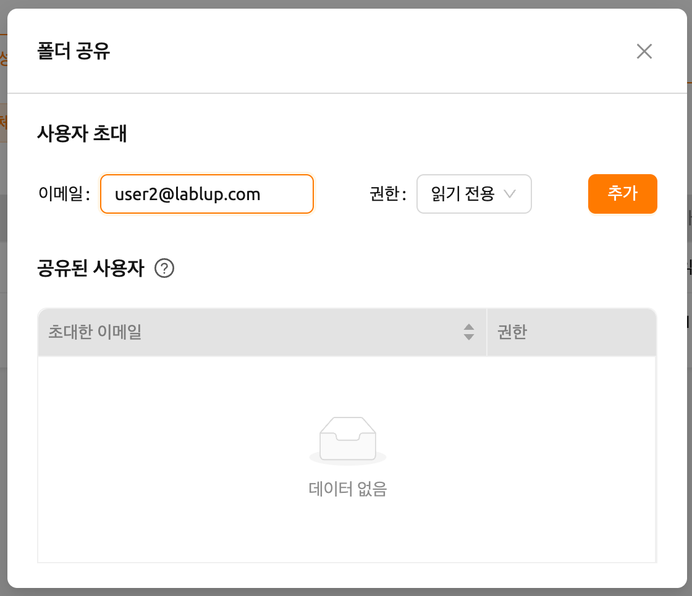

사용자 B의 계정으로 전환한 후 데이터 페이지로 이동합니다. 스토리지 상태 패널에서 초대된 폴더의 개수를 확인할 수 있습니다.

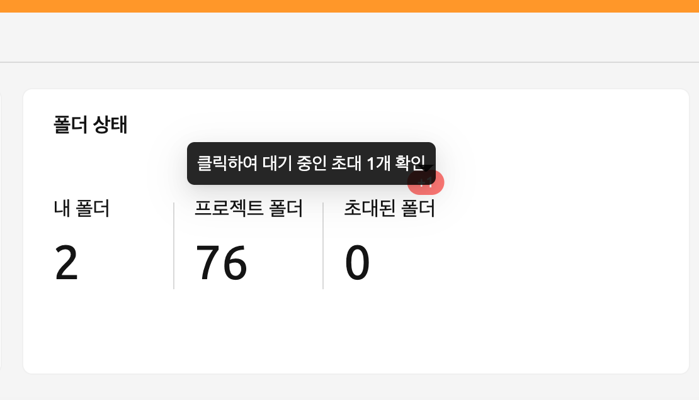

뱃지를 클릭하면 초대 리스트 모달이 열리며, 대기 중인 폴더 초대를 승낙하거나 거절할 수 있습니다.

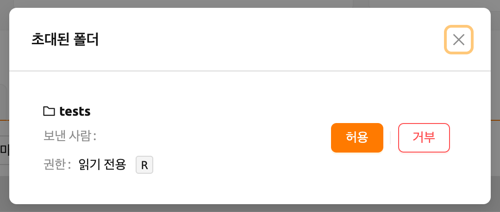

데이터 페이지로 이동하여 `tests` 폴더가 목록에 표시되는지 확인합니다. 목록에 보이지 않으면 브라우저 페이지를 새로고침해 보세요. 초대를 승낙했으므로, 이제 사용자 B의 계정에서 사용자 A의 `tests` 폴더 내용을 확인할 수 있습니다. 사용자 B가 직접 생성한 폴더와 달리, 공유된 폴더는 소유자 열에 체크 아이콘이 표시되지 않습니다. 또한 마운트 권한 열에 '읽기 전용' 표시가 나타나는 것을 확인할 수 있습니다.

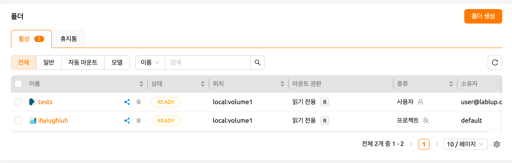

`tests` 폴더의 제어 패널에서 폴더 아이콘을 클릭하여 폴더 내부로 이동해 봅니다. 사용자 A의 계정에서 확인했던 `hello.txt`와 `myfolder`를 다시 확인할 수 있습니다.

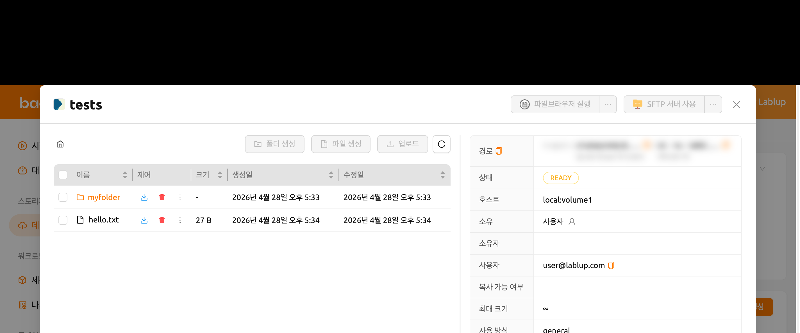

이 스토리지 폴더를 사용자 B의 계정으로 마운트하여 연산 세션을 생성해 보겠습니다.

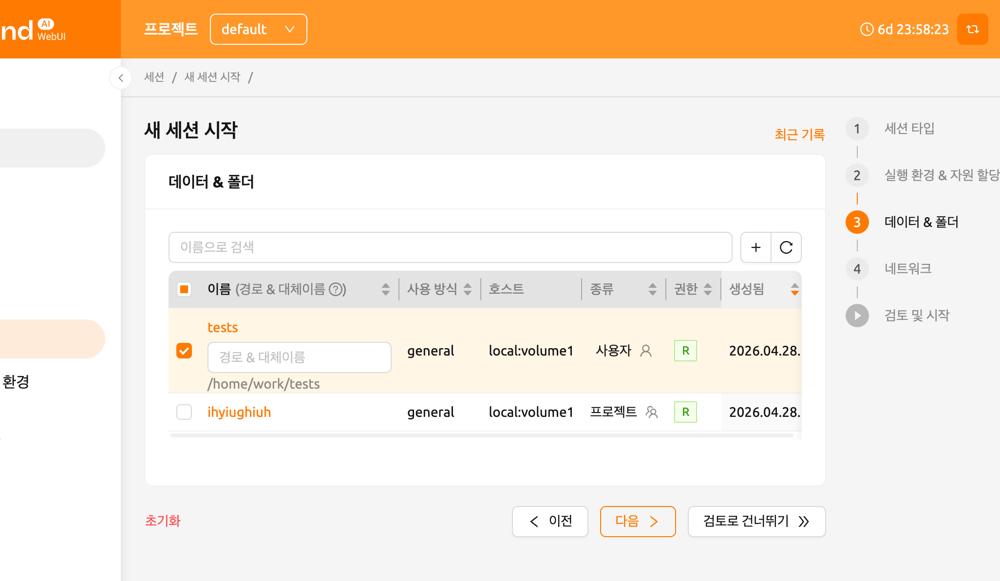

   24.09 버전부터 Backend.AI는 개선된 세션 런처(NEO)를 기본으로 제공합니다.
   이전 세션 런처를 사용하려면 [사용자 설정](#general-tab) 섹션을 참고하세요.
   이전 세션 런처의 사용 방법은 다음 [링크](https://webui.docs.backend.ai/en/23.09_a/sessions_all/sessions_all.html)를 참고하세요.
   NEO 세션 런처에 대해 자세히 알아보려면 [세션 생성](#start-a-new-session) 섹션을 참고하세요.

세션을 생성한 후, 웹 터미널을 열어 `tests` 폴더가 홈 폴더에 마운트되어 있는지 확인합니다. `tests` 폴더의 내용은 표시되지만, 파일을 생성하거나 삭제하려고 하면 허용되지 않습니다. 이는 사용자 A가 읽기 전용으로 공유했기 때문입니다. 쓰기 권한이 포함된 상태로 공유된 경우에는 사용자 B도 `tests` 폴더에 파일을 생성할 수 있습니다.

이렇게 Backend.AI 이메일 계정을 기반으로 개인 스토리지 폴더를 다른 사용자와 공유할 수 있습니다.

   Backend.AI는 프로젝트 멤버에게 프로젝트 폴더를 공유하는 기능도 제공합니다.
   자세한 내용은 [프로젝트 멤버와 프로젝트 스토리지 폴더 공유](#share-project-storage-folders-with-project-members) 섹션을 참고하세요.

## 공유 폴더 권한 조정

폴더 공유 모달에서 공유된 사용자의 권한을 수정할 수 있습니다. 권한 선택란을 클릭하여 공유 권한을 설정합니다.

- 읽기 전용: 초대된 사용자는 폴더에 대한 읽기 전용 접근 권한을 갖습니다.
- 수정: 초대된 사용자는 폴더에 대한 읽기 및 쓰기 권한을 갖습니다. 단, 폴더나 파일을 삭제할 수는 없습니다.

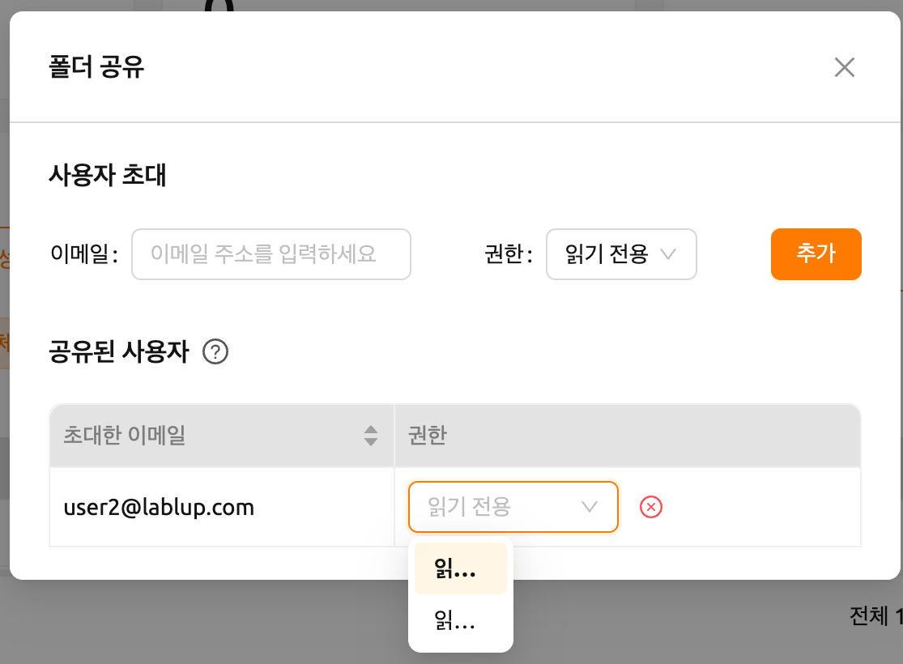

   수정 권한이 부여된 경우에도 폴더 자체의 이름 변경은 소유자만 할 수 있습니다.
   수정 권한에는 폴더 이름 변경 기능이 포함되지 않습니다.

## 공유 중지

초대자가 폴더 공유를 중단하려면, 파일 목록에서 해당 폴더의 제어 열에 있는 '공유' 버튼을 클릭합니다. 권한 설정 모달에서 권한 선택기 옆의 '공유 중지' 버튼을 클릭합니다.

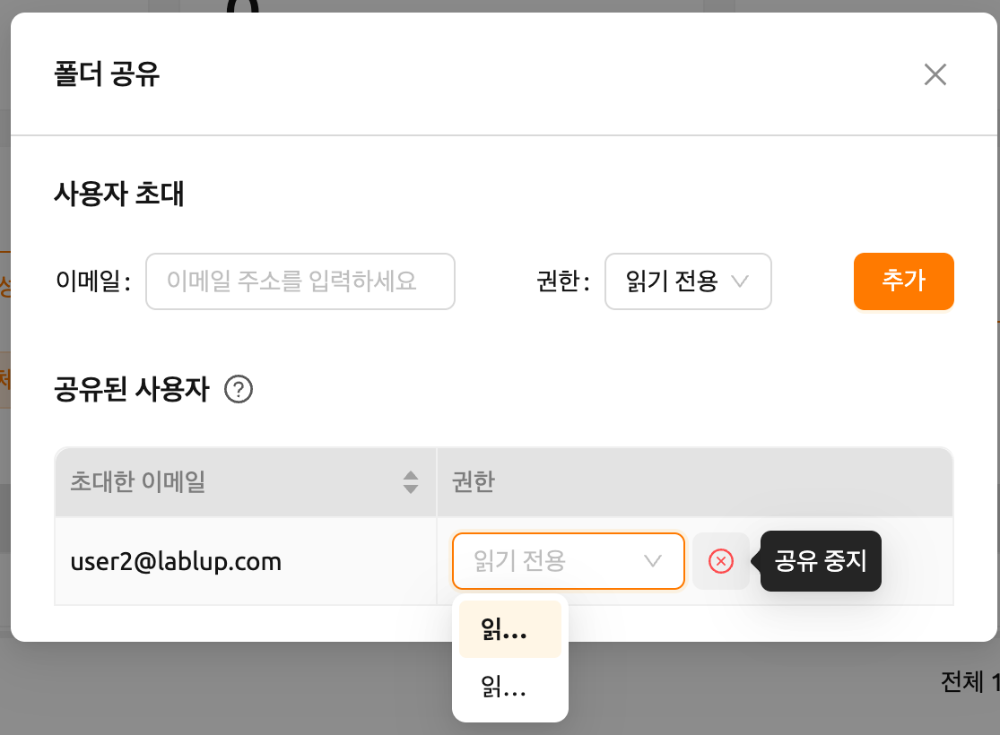

초대받은 사용자가 더 이상 공유 폴더에 대한 접근이 필요하지 않은 경우, 폴더 목록에서 해당 폴더의 '공유' 버튼을 선택한 후 '공유 폴더 나가기'를 클릭하여 접근을 해제할 수 있습니다.

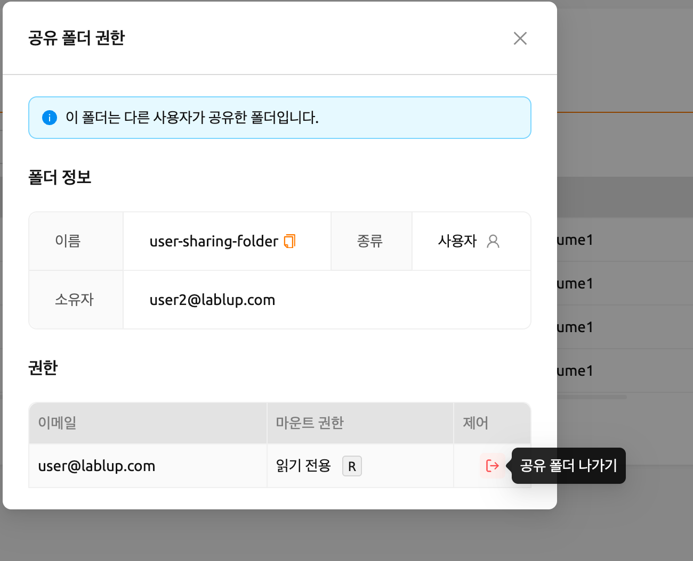
