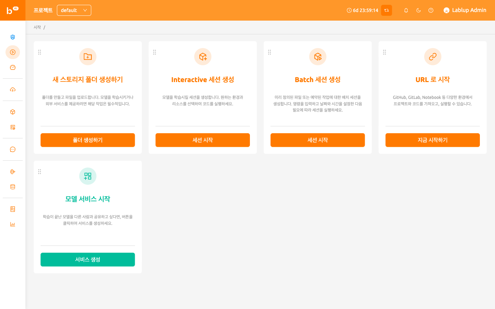

# 시작 페이지

시작 페이지에서는 자주 사용하는 WebUI 기능에 빠르게 접근할 수 있습니다.
현재 [스토리지 폴더 생성](../vfolder/vfolder.md#create-storage-folder), [대화형 또는 배치 세션 실행](../sessions_all/sessions_all.md#create_session),
[모델 서비스 생성](../model_serving/model_serving.md)에 대한 바로가기가 제공됩니다. 각 카드의 좌측 상단 버튼을 사용하여 위치를 조정할 수 있습니다.

   서버 설치 및 설정 환경에 따라, 모델 서비스 기능이 비활성화되어 있을 수 있습니다. 모델 서비스 사용을 원하시는 경우, 시스템 관리자에게 문의하십시오.