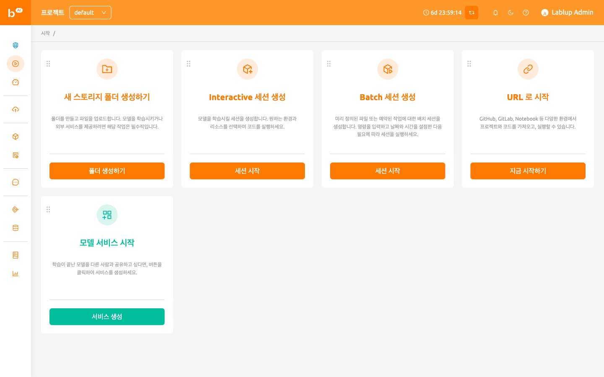

# 시작 페이지

시작 페이지에서는 자주 사용하는 WebUI 기능에 액션 카드를 통해 빠르게 접근할 수
있습니다. 각 카드는 스토리지 폴더 생성, 세션 실행, 모델 서비스 시작, 외부 URL에서
프로젝트 가져오기 등 주요 워크플로를 나타냅니다.

## 공지사항 배너

시스템 관리자가 공지사항을 게시한 경우, 시작 페이지 상단에 배너가 표시됩니다.
닫기 아이콘을 클릭하여 배너를 닫을 수 있습니다. 공지사항은 Markdown 형식을
지원하며, 시스템 유지보수, 업데이트, 사용 가이드라인 등 중요한 안내를 포함할 수
있습니다.

## 액션 카드

시작 페이지에는 기본적으로 다음 액션 카드가 표시됩니다:

- **새 스토리지 폴더 생성**: 스토리지 폴더를 생성하고 파일을 업로드합니다. 모델을
  학습시키거나 외부 서비스를 제공하기 위한 필수적인 첫 단계입니다. 버튼을 클릭하면
  폴더 생성 대화상자가 열립니다.
- **Interactive 세션 생성**: 모델을 학습시킬 대화형 세션을 생성합니다. 원하는
  환경과 리소스를 선택하여 코드를 실행할 수 있습니다.
- **Batch 세션 생성**: 미리 정의된 파일 또는 예약된 작업을 위한 배치 세션을
  생성합니다. 명령을 입력하고 날짜와 시간을 설정한 다음 필요에 따라 세션을
  실행합니다.
- **모델 서비스 시작**: 학습이 끝난 모델을 다른 사람과 공유하기 위해 모델 서비스
  엔드포인트를 생성합니다.
- **URL로 시작**: GitHub, GitLab, Jupyter Notebook 등 다양한 환경에서 URL을 통해
  프로젝트와 코드를 가져올 수 있습니다.

:::note
서버 설치 및 설정 환경에 따라, 모델 서비스 카드 등 일부 카드가 비활성화되어 있을
수 있습니다. 해당 기능의 사용을 원하시는 경우, 시스템 관리자에게 문의하십시오.
:::

## URL로 시작

**URL로 시작** 카드를 사용하면 외부 소스에서 프로젝트를 가져와 바로 실행할 수
있습니다. 카드를 클릭하면 세 개의 탭이 있는 대화상자가 열립니다.

### 노트북 가져오기

1. **가져올 노트북 URL** 필드에 Jupyter Notebook URL(`.ipynb`으로 끝나는)을
   입력합니다
2. **가져와서 실행** 버튼을 클릭하면 자동으로 세션이 생성되고 Jupyter에서
   노트북이 열립니다

   버튼 옆의 드롭다운 화살표를 클릭하고 **설정 후 실행**을 선택하면 실행
   전에 세션 환경을 커스터마이즈할 수 있습니다.

탭 하단에서 "Run on Backend.AI" 뱃지 코드를 생성할 수 있습니다. HTML 또는
Markdown 뱃지 코드를 복사하여 프로젝트 문서에 바로 실행 링크를 삽입할 수
있습니다.

### GitHub 저장소 가져오기

1. **GitHub URL** 필드에 유효한 GitHub 저장소 URL을 입력합니다
2. 저장소가 저장될 **스토리지 호스트**를 선택합니다
3. 필요한 경우 **폴더 사용 모드**(일반 또는 모델)를 설정합니다
4. **가져오기** 버튼을 클릭하여 저장소를 새 스토리지 폴더로 복제합니다

가져온 저장소는 스토리지 폴더로 변환되며, 세션 시작 시 마운트할 수 있습니다.

### GitLab 저장소 가져오기

1. **GitLab URL** 필드에 유효한 GitLab 저장소 URL을 입력합니다
2. 필요한 경우 **GitLab 브랜치 이름**을 지정합니다 (기본값: `master`)
3. 저장소가 저장될 **스토리지 호스트**를 선택합니다
4. 필요한 경우 **폴더 사용 모드**(일반 또는 모델)를 설정합니다
5. **가져오기** 버튼을 클릭하여 저장소를 새 스토리지 폴더로 복제합니다

## 카드 레이아웃 커스터마이즈

시작 페이지의 액션 카드는 드래그 앤 드롭으로 재배치할 수 있습니다. 각 카드의
좌측 상단에 있는 드래그 핸들을 잡고 원하는 위치로 이동할 수 있습니다.

커스터마이즈된 카드 배치는 자동으로 저장되어 브라우저 세션 간에 유지됩니다.
레이아웃은 사용자별로 저장되므로, 각 사용자가 자신만의 배치를 설정할 수 있습니다.
