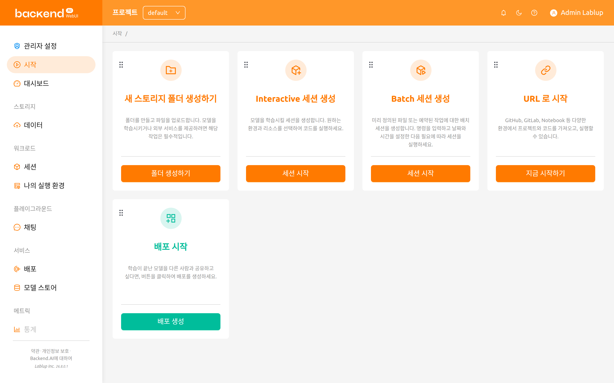
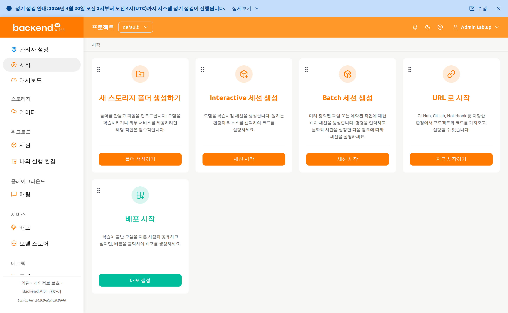
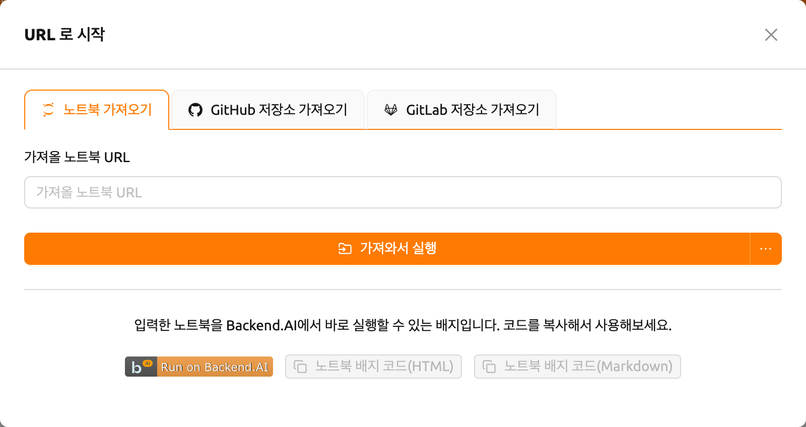
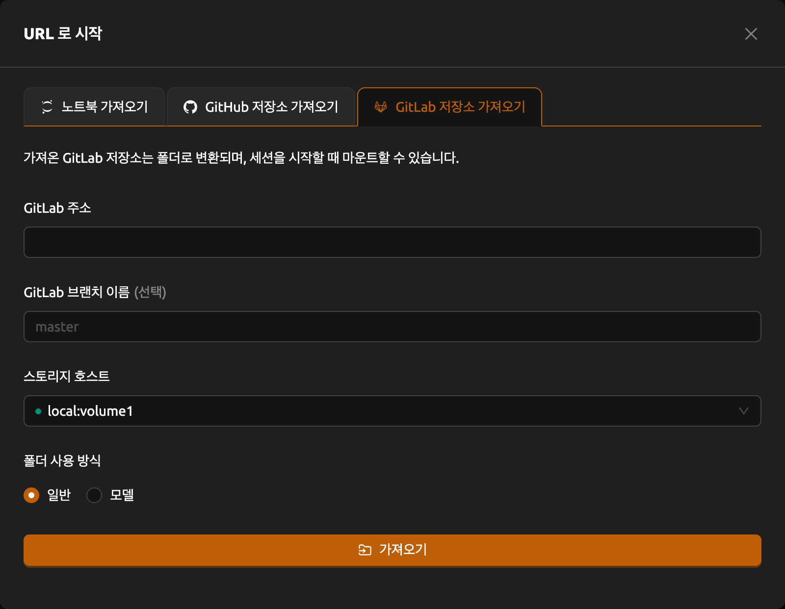
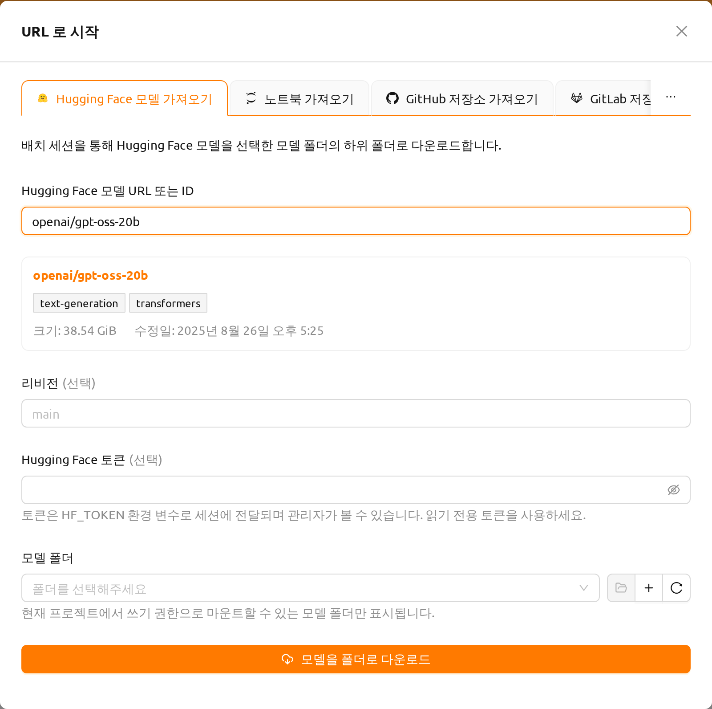

# 시작 페이지

시작 페이지에서는 자주 사용하는 WebUI 기능에 액션 카드를 통해 빠르게 접근할 수
있습니다. 각 카드는 스토리지 폴더 생성, 세션 실행, 모델 배포, 외부 URL에서
프로젝트 가져오기 등 주요 워크플로를 나타냅니다.

## 공지사항 배너

시스템 관리자가 공지사항을 게시한 경우, 시작 페이지뿐만 아니라 모든 페이지
상단에 배너가 표시됩니다. 공지사항은 Markdown 형식을 지원하며, 시스템 유지보수,
업데이트, 사용 가이드라인 등 중요한 안내를 포함할 수 있습니다.

내용이 긴 공지사항은 첫 줄을 한 줄로 요약한 형태로 접혀서 표시됩니다. 배너의
**상세보기**를 클릭하면 공지사항 전문이 표시되고, **접기**를 클릭하면 다시
접을 수 있습니다.

닫기 아이콘을 클릭하면 배너가 닫힙니다. 닫은 배너는 현재 브라우저 세션 동안
계속 숨겨지며, 관리자가 새로운 공지사항을 게시하거나 기존 공지사항을 변경하면
다시 표시됩니다.

슈퍼 관리자의 경우 배너에 **수정** 버튼이 함께 표시되며, 이 버튼을 클릭하면
공지사항 수정 대화상자가 열려 어느 페이지에서든 공지사항을 수정할 수 있습니다.
자세한 내용은 [시스템 공지사항](#system-announcement) 섹션을 참고하세요.

## 액션 카드

시작 페이지에는 기본적으로 다음 액션 카드가 표시됩니다:

- **새 스토리지 폴더 생성하기**: 스토리지 폴더를 생성하고 파일을 업로드합니다.
  모델을 학습시키거나 외부 서비스를 제공하기 위한 필수적인 첫 단계입니다. 버튼을
  클릭하면 폴더 생성 대화상자가 열립니다.
- **Interactive 세션 생성**: 모델을 학습시킬 세션을 생성합니다. 원하는 환경과
  리소스를 선택하여 코드를 실행할 수 있습니다.
- **Batch 세션 생성**: 미리 정의된 파일 또는 예약된 작업을 위한 배치 세션을
  생성합니다. 명령을 입력하고 날짜와 시간을 설정한 다음 필요에 따라 세션을
  실행합니다.
- **배포 시작**: 학습이 끝난 모델을 다른 사람과 공유하기 위해 배포를 생성합니다.
- **URL 로 시작**: GitHub, GitLab, Jupyter Notebook 등 다양한 환경에서 URL을 통해
  프로젝트와 코드를 가져올 수 있습니다.

:::note
서버 설치 및 설정 환경에 따라, 배포 카드 등 일부 카드가 비활성화되어 있을
수 있습니다. 해당 기능의 사용을 원하시는 경우, 시스템 관리자에게 문의하십시오.
:::

## URL 로 시작

**URL 로 시작** 카드를 사용하면 외부 소스에서 프로젝트를 가져와 바로 실행할 수
있습니다. 카드를 클릭하면 가져오기 원본별로 **노트북 가져오기**,
**GitHub 저장소 가져오기**, **GitLab 저장소 가져오기** 탭이 있는 대화상자가
열립니다. 실험적 기능인 Hugging Face 가져오기를 활성화하면
**Hugging Face 모델 가져오기** 탭이 추가로 표시됩니다.

### 노트북 가져오기

1. **가져올 노트북 URL** 필드에 Jupyter Notebook URL(`.ipynb`으로 끝나는)을
   입력합니다
2. **가져와서 실행** 버튼을 클릭하면 자동으로 세션이 생성되고 Jupyter에서
   노트북이 열립니다

   버튼 옆의 드롭다운 화살표를 클릭하고 **설정 후 실행**을 선택하면 실행
   전에 세션 환경을 사용자화할 수 있습니다.

:::note
노트북은 연산 세션 내부에서 다운로드되므로(부트스트랩 스크립트가 `curl -O <url>`을
실행합니다), 입력한 URL은 연산 세션에서 접근할 수 있어야 합니다. `localhost`나
`127.0.0.1` 같은 로컬 주소는 사용자의 컴퓨터가 아니라 세션 컨테이너 자신을 가리키므로
동작하지 않습니다. 연산 세션에서 접근 가능한 URL을 입력하세요.
:::

:::note
팝업 차단기를 해제해야 실행 중인 노트북 창을 바로 확인할 수 있습니다. 또한,
세션을 실행할 자원이 충분하지 않은 경우 가져온 노트북이 실행되지 않습니다.
:::

탭 하단에서 "Run on Backend.AI" 뱃지 코드를 생성할 수 있습니다. HTML 또는
Markdown 뱃지 코드를 복사하여 프로젝트 문서에 바로 실행 링크를 삽입할 수
있습니다.

:::note
뱃지 코드를 생성하기 전에 로그인되어 있어야 합니다. 그렇지 않으면 먼저
로그인한 후 다시 시도해 주십시오.
:::

### GitHub 저장소 가져오기

1. **GitHub 주소** 필드에 유효한 GitHub 저장소 URL을 입력합니다
2. 저장소가 저장될 **스토리지 호스트**를 선택합니다
3. 필요한 경우 **폴더 사용 방식**(일반 또는 모델)을 설정합니다
4. **가져오기** 버튼을 클릭하여 저장소를 새 스토리지 폴더로 복제합니다

가져온 저장소는 스토리지 폴더로 변환되며, 세션 시작 시 마운트할 수 있습니다.

### GitLab 저장소 가져오기

1. **GitLab 주소** 필드에 유효한 GitLab 저장소 URL을 입력합니다
2. 필요한 경우 **GitLab 브랜치 이름**을 지정합니다 (기본값: `master`)
3. 저장소가 저장될 **스토리지 호스트**를 선택합니다
4. 필요한 경우 **폴더 사용 방식**(일반 또는 모델)을 설정합니다
5. **가져오기** 버튼을 클릭하여 저장소를 새 스토리지 폴더로 복제합니다

### Hugging Face 모델 가져오기

**Hugging Face 모델 가져오기** 탭에서는 Hugging Face의 모델을 모델 폴더로
다운로드할 수 있습니다. 다운로드한 모델은 이후 연산 세션에 마운트하거나 배포로
서비스할 수 있습니다.

:::warning[실험적 기능]
이 탭은 [사용자 설정](#user-settings) 페이지의 **실험적 기능** 항목에서
**Hugging Face에서 가져오기**를 활성화해야 표시됩니다. 실험적 기능은 향후
업데이트에서 변경되거나 제거될 수 있습니다.
:::

1. **Hugging Face 모델 URL 또는 ID** 필드에 모델을 입력합니다.
   `https://huggingface.co/openai/gpt-oss-20b`와 같은 모델 페이지 URL과
   `openai/gpt-oss-20b`와 같은 모델 ID를 모두 사용할 수 있습니다. 데이터셋,
   스페이스 등 모델이 아닌 페이지의 주소는 허용되지 않습니다.

   필드에 유효한 모델을 입력하면 잠시 후 대화상자가 Hugging Face에서 모델을
   조회합니다. 확인하는 동안 로딩 표시가 나타나며, 가져오기를 시작하기 전에
   필드 아래에 미리보기 카드를 표시합니다. 카드에는 Hugging Face 페이지로
   연결되는 모델 ID 링크, 모델의 작업 및 라이브러리 태그, 크기,
   수정일이 표시됩니다.

2. 필요한 경우 **리비전**에 다운로드할 모델 저장소의 브랜치, 태그 또는 커밋을
   입력합니다. 비워 두면 기본 리비전을 다운로드하며, 입력한 주소에 리비전이
   포함되어 있으면 해당 리비전을 사용합니다.
3. 필요한 경우 **Hugging Face 토큰**을 입력합니다. 접근이 제한되었거나 비공개인
   모델에는 토큰이 필요합니다.
4. 다운로드할 **모델 폴더**를 선택합니다. 필드 아래의 안내 문구처럼 현재
   프로젝트에서 쓰기 권한으로 마운트할 수 있는 모델 폴더만 표시됩니다.
   다운로드 세션이 폴더에 파일을 쓰기 때문에 읽기 전용으로만 마운트할 수 있는
   폴더는 제외됩니다. 선택기 옆의 버튼으로 선택한 폴더 열기, 새 모델 폴더 생성,
   목록 새로고침을 수행할 수 있습니다. 새 폴더를 만들 때는 마운트 권한을 읽기 및
   쓰기로 설정하십시오. 읽기 전용 마운트 권한으로 만든 폴더는 다운로드 대상으로
   사용할 수 없으며, 읽기 및 쓰기 마운트 권한으로 폴더를 만들라는 경고가
   표시됩니다.
5. **모델을 폴더로 다운로드** 버튼을 클릭합니다.

대화상자가 닫히고 다운로드를 수행하는 배치 세션이 시작됩니다. 다운로드는 해당
세션 내부에서 진행되므로 세션 페이지에서 진행 상황을 확인할 수 있으며, 세션이
성공적으로 종료되면 모델을 사용할 수 있습니다. 세션이 실패하면 다운로드가
완료되지 않은 것이므로 모델을 사용할 수 없습니다.

모델은 선택한 폴더 안에 모델 이름으로 만들어진 하위 폴더에 저장됩니다. 예를 들어
`openai/gpt-oss-20b`는 `gpt-oss-20b/`에 다운로드됩니다. 따라서 하나의 모델 폴더에
여러 모델을 함께 보관할 수 있습니다.

:::warning
토큰은 다운로드 세션에 `HF_TOKEN` 환경 변수로 전달되며 관리자가 확인할 수
있습니다. 읽기 전용 토큰을 사용하십시오.
:::

:::note
이 탭은 모델 폴더로 다운로드하므로, 배포 기능이 활성화된 계정에서만 사용할 수
있습니다. 크기가 큰 모델은 다운로드에 오랜 시간이 걸리며 대상 폴더의 저장 용량을
소모합니다.
:::

## 카드 레이아웃 사용자화

시작 페이지의 액션 카드는 드래그 앤 드롭으로 재배치할 수 있습니다. 각 카드의
좌측 상단에 있는 드래그 핸들을 잡고 원하는 위치로 이동할 수 있습니다.

사용자화된 카드 배치는 자동으로 저장되어 브라우저 세션 간에 유지됩니다.
레이아웃은 사용자별로 저장되므로, 각 사용자가 자신만의 배치를 설정할 수 있습니다.
