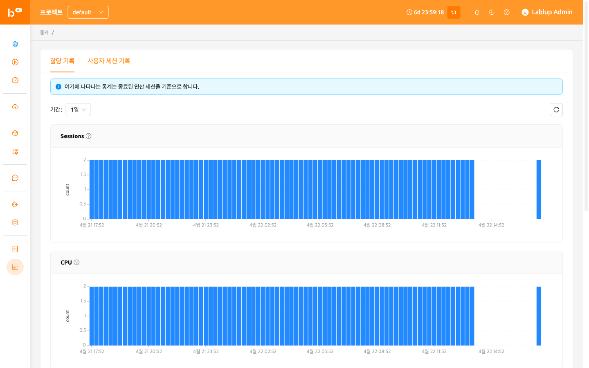
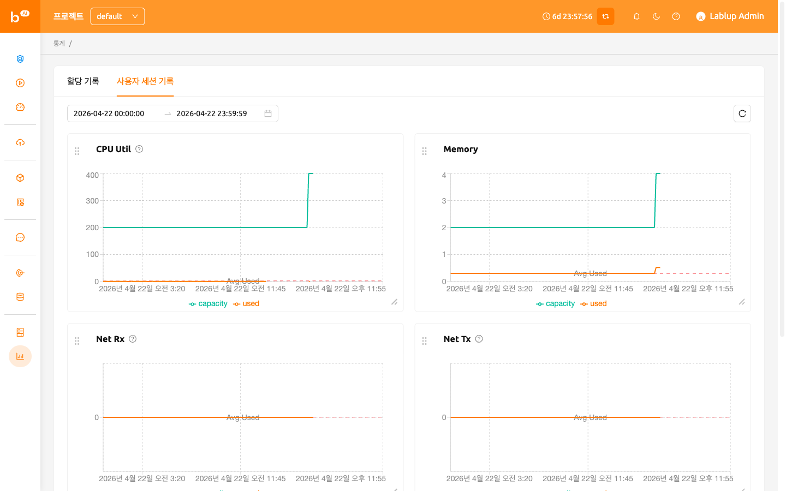

# 통계 (Statistics) 페이지

## 할당 기록

통계 페이지의 할당 기록 탭에서는 연산 세션 사용과 관련된 간단한 통계를 그래프로 확인할 수 있습니다. 좌측 상단의 기간 선택 메뉴에서 이용 기간을 선택하여 하루 또는 일주일 동안의 통계를 확인할 수 있습니다. 표시되는 항목은 다음과 같습니다.

- 세션 (Sessions): 생성된 연산 세션의 수입니다.
- CPU: 연산 세션이 생성되면서 할당한 CPU 코어의 수입니다.
- Memory: 연산 세션이 생성되면서 할당한 메모리의 양입니다.
- GPU: 연산 세션이 생성되면서 할당한 GPU 단위의 수입니다. Fractional GPU 기능이 작동하고 있을 경우, 물리 GPU 와 일치하지 않을 수 있습니다.
- IO-Read: 스토리지로부터 읽은 데이터의 양입니다.
- IO-Write: 스토리지에 기록된 데이터의 양입니다.

여기에 나타나는 통계는 종료된 연산 세션을 기준으로 합니다. 또한, 가입 일주일 미만의 사용자에게는 주간 통계 조회 메뉴가 출력되지 않을 수 있습니다.

## 사용자 세션 기록

통계페이지의 사용자 세션 기록 탭에서는 세션이 사용한 다양한 자원에 대한 통계를 그래프로 확인할 수 있습니다.좌측 상단의 기간 선택 메뉴를 통해 선택한 기간 동안의 통계를 확인할 수 있습니다. 표시되는 항목은 다음과 같습니다.

- CPU Util: 세션이 사용한 CPU 시간입니다.
- Memory: 세션이 사용한 메모리의 양입니다.
- Net Rx: 컨테이너가 수신하고 있는 네트워크 데이터의 속도입니다.
- Net Tx: 컨테이너가 전송하고 있는 네트워크 데이터의 속도입니다.
- IO Read: 세션에 의해 스토리지로부터 읽은 데이터의 양입니다.
- IO Write: 세션에 의해 스토리지로부터 기록된 데이터의 양입니다.

사용가능한 자원에 따라 CUDA-capable GPU Util, CUDA-capable GPU Mem 와 같은 값들도 보여집니다.

보다 자세한 통계 기능은 관리자 전용 Control-Panel에서 제공합니다.

