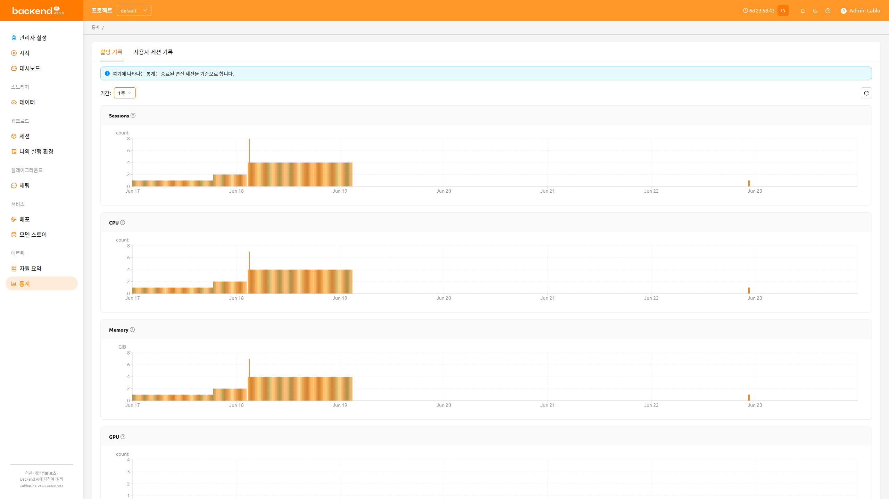
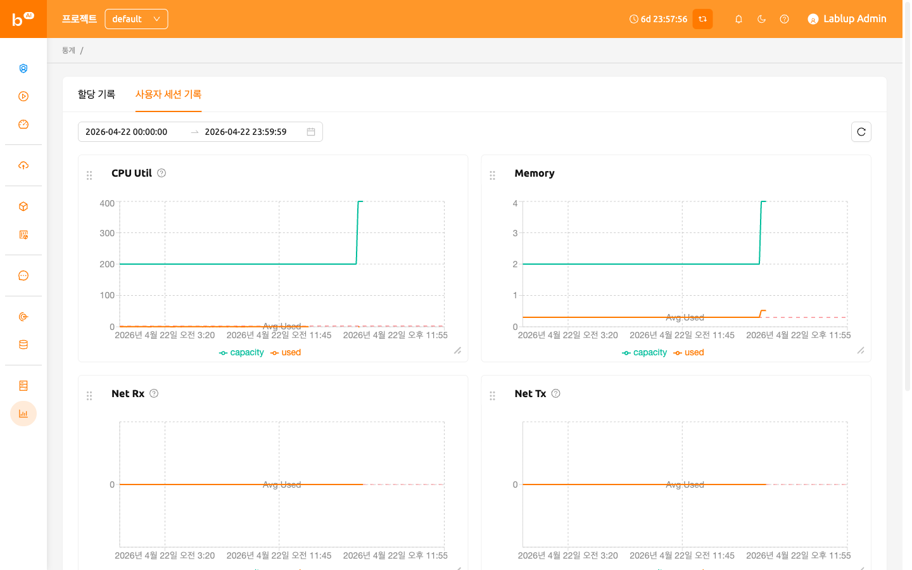

# 통계 (Statistics) 페이지

## 할당 기록

통계 페이지의 할당 기록 탭에서는 연산 세션 사용과 관련된 간단한 통계를 그래프로 확인할 수 있습니다.
좌측 상단의 **기간** 드롭다운을 사용하여 표시 기간을 선택할 수 있습니다. 사용 가능한 옵션은
**1일**과 **1주**입니다. 드롭다운 옆의 새로고침 버튼을 클릭하여 통계 데이터를 다시 불러올 수도
있습니다. 표시되는 항목은 다음과 같습니다.

- 세션 (Sessions): 생성된 연산 세션의 수입니다.
- CPU: 연산 세션이 생성되면서 할당한 CPU 코어의 수입니다.
- Memory: 연산 세션이 생성되면서 할당한 메모리의 양입니다.
- GPU: 연산 세션이 생성되면서 할당한 GPU 단위의 수입니다. 분할 GPU(fGPU) 기능이 작동하고
  있을 경우, 물리 GPU와 일치하지 않을 수 있습니다.
- IO-Read: 스토리지로부터 읽은 데이터의 양입니다.
- IO-Write: 스토리지에 기록된 데이터의 양입니다.

:::note
여기에 나타나는 통계는 종료된 연산 세션을 기준으로 합니다.
또한, 가입 일주일 미만의 사용자에게는 주간 통계가 표시되지 않을 수 있습니다.
:::

:::info
IO-Read 및 IO-Write 그래프는 백엔드 구성에 따라 표시되지 않을 수 있습니다.
:::

## 사용자 세션 기록

:::note
사용자 세션 기록 탭은 백엔드에서 사용자 메트릭 기능을 지원하는 경우에만 사용할 수 있습니다.
이 탭이 표시되지 않는 경우, 관리자에게 문의하세요.
:::

통계 페이지의 사용자 세션 기록 탭에서는 세션이 사용한 다양한 자원에 대한 통계를 그래프로
확인할 수 있습니다. 좌측 상단의 날짜 범위 선택기를 사용하여 원하는 날짜 및 시간 범위를
직접 지정할 수 있습니다. 날짜 범위 선택기에는 빠른 선택을 위한 다음과 같은 프리셋 옵션도
제공됩니다:

- **오늘**
- **최근 1시간**
- **최근 3시간**
- **최근 12시간**
- **최근 1일**
- **최근 7일**

날짜 범위 선택기 옆의 새로고침 버튼을 클릭하여 통계 데이터를 다시 불러올 수도 있습니다.

:::warning
선택한 날짜 범위가 30일을 초과하면, 누적 사용량이 많지 않은 경우 일부 날짜의 데이터가
표시되지 않을 수 있습니다. 데이터가 누락되는 경우 더 짧은 기간으로 다시 시도해 주세요.
:::

표시되는 메트릭 그래프는 사용 환경에서 제공되는 자원에 따라 백엔드에서 동적으로 결정됩니다.
일반적으로 표시되는 메트릭은 다음과 같습니다:

- CPU Util: 세션이 사용한 CPU 시간입니다.
- Memory: 세션이 사용한 메모리의 양입니다.
- Net Rx: 컨테이너가 수신하고 있는 네트워크 데이터의 속도입니다.
- Net Tx: 컨테이너가 전송하고 있는 네트워크 데이터의 속도입니다.

사용 가능한 자원에 따라 GPU Util, GPU Mem 등의 추가 메트릭이 표시될 수도 있습니다.

메트릭 그래프 카드는 드래그하여 재배치하거나 크기를 조절할 수 있어, 원하는 레이아웃으로
커스터마이즈할 수 있습니다.

보다 자세한 통계 기능은 관리자 전용 Control-Panel에서 제공합니다.

