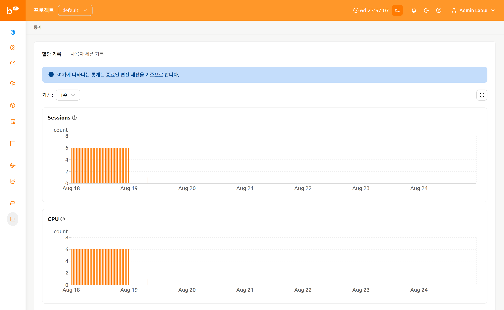
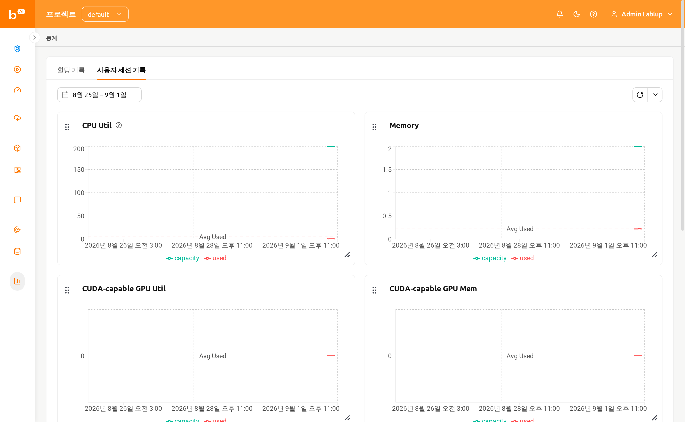

# 통계 (Statistics) 페이지

## 할당 기록

통계 페이지의 할당 기록 탭에서는 연산 세션 사용과 관련된 간단한 통계를 그래프로 확인할 수 있습니다.
좌측 상단의 **기간** 드롭다운을 사용하여 표시 기간을 선택할 수 있습니다. 사용 가능한
옵션은 **1일**과 **1주**입니다. 드롭다운 옆의 새로고침 버튼을 클릭하여 통계 데이터를 다시 불러올
수도 있습니다. 표시되는 항목은 다음과 같습니다.

- 세션 (Sessions): 생성된 연산 세션의 수입니다.
- CPU: 연산 세션이 생성되면서 할당한 CPU 코어의 수입니다.
- Memory: 연산 세션이 생성되면서 할당한 메모리의 양입니다.
- GPU: 연산 세션이 생성되면서 할당한 GPU 단위의 수입니다. 분할 GPU(fGPU) 기능이 작동하고
  있을 경우, 물리 GPU와 일치하지 않을 수 있습니다.

각 메트릭 카드의 제목 옆에는 물음표 아이콘이 표시됩니다. 이 아이콘에 마우스를 올리면 해당 메트릭이
무엇을 측정하는지에 대한 간단한 설명을 확인할 수 있습니다.

:::note
여기에 나타나는 통계는 종료된 연산 세션을 기준으로 합니다.
또한, 가입 일주일 미만의 사용자에게는 주간 통계가 표시되지 않을 수 있습니다.
:::

## 사용자 세션 기록

:::note
사용자 세션 기록 탭은 백엔드에서 사용자 메트릭 기능을 지원하는 경우에만 사용할 수 있습니다.
이 탭이 표시되지 않는 경우, 관리자에게 문의하세요.
:::

통계 페이지의 사용자 세션 기록 탭에서는 세션이 사용한 다양한 자원에 대한 통계를 그래프로
확인할 수 있습니다. 좌측 상단의 날짜 범위 선택기를 사용하여 원하는 날짜 및 시간 범위를
직접 지정할 수 있습니다. 날짜 범위 선택기에는 빠른 선택을 위한 다음과 같은 프리셋 옵션도
제공됩니다:

- **오늘**
- **최근 1시간**
- **최근 3시간**
- **최근 12시간**
- **최근 1일**
- **최근 7일**

날짜 범위 선택기 옆의 새로고침 버튼을 클릭하여 통계 데이터를 다시 불러올 수도 있습니다.

:::warning
선택한 날짜 범위가 30일을 초과하면, 누적 사용량이 많지 않은 경우 일부 날짜의 데이터가
표시되지 않을 수 있습니다. 데이터가 누락되는 경우 더 짧은 기간으로 다시 시도해 주세요.
:::

표시되는 메트릭 그래프는 사용 환경에서 제공되는 자원에 따라 백엔드에서 동적으로 결정됩니다.
일반적으로 표시되는 메트릭은 다음과 같습니다:

- CPU Util: 세션이 사용한 CPU 시간입니다.
- Memory: 세션이 사용한 메모리의 양입니다.
- Net Rx: 컨테이너가 수신하고 있는 네트워크 데이터의 속도입니다.
- Net Tx: 컨테이너가 전송하고 있는 네트워크 데이터의 속도입니다.

사용 가능한 자원에 따라 GPU Util, GPU Mem 등의 추가 메트릭이 표시될 수도 있습니다.

각 메트릭 카드는 선택한 기간 동안 두 개의 선을 그래프로 표시하며, 차트 범례에서 각 선을 구분할 수
있습니다:

- **Capacity**: 선택한 기간 동안 해당 메트릭에 할당된 총량입니다.
- **Used**: 선택한 기간 동안 세션이 실제로 사용한 양입니다.

**Avg Used** 라벨이 붙은 빨간색 점선 기준선은 선택한 범위의 평균 사용량을 나타내므로, 현재 사용량을
기간 평균과 빠르게 비교할 수 있습니다. 할당 기록 탭과 마찬가지로, 메트릭 제목 옆의 물음표 아이콘에
마우스를 올리면 해당 메트릭이 무엇을 측정하는지에 대한 설명을 확인할 수 있습니다.

메트릭 그래프 카드는 드래그하여 재배치하거나 크기를 조절할 수 있어, 원하는 레이아웃으로
사용자화할 수 있습니다.

보다 자세한 통계 기능은 관리자 전용 Control-Panel에서 제공합니다.

## 사용량 리포트

사용량을 하나의 리포트 문서로 만들어 내보낼 수 있습니다. 통계 페이지 우측 상단의
**리포트 내보내기** 버튼을 누르거나, 대시보드의 **사용량 리포트** 항목을 통해 리포트
페이지를 열 수 있습니다.

리포트는 달력 기준의 주 또는 월 단위를 다룹니다:

- **기간 단위**: 컨트롤 바의 토글로 **주간**과 **월간**을 전환합니다.
- **기간**: 화살표 버튼으로 이전 또는 다음 기간으로 이동합니다. 리포트는 마지막으로
  완결된 주 또는 월을 기본으로 엽니다.

문서에는 GPU-시간, CPU-시간, 세션 총계와 일별 사용률·할당 차트, 산출 방식 각주가
표시됩니다. 데이터가 없는 섹션은 사라지지 않고 "해당 기간에 데이터가 없습니다"
플레이스홀더로 자리를 유지하며, 사용률 지표가 기간의 일부만 포함할 때는 안내 배너가
표시됩니다.

컨트롤 바 우측 상단의 버튼으로 리포트를 내보낼 수 있습니다:

- **PDF**: 브라우저 인쇄 대화 상자가 열립니다("PDF로 저장" 선택). 데스크톱 앱에서는
  PDF 파일로 바로 저장됩니다.
- **PNG**: 리포트를 이미지로 저장합니다.
- **CSV**: 일별 시계열과 총계를 CSV 파일로 내려받습니다.

:::note
관리자(superadmin)는 리포트의 **범위**를 **전체 클러스터**로 전환할 수 있습니다(예:
관리자 대시보드의 사용량 리포트 항목). 이 경우 GPU-시간 상위 사용자 표가 추가됩니다.
:::
