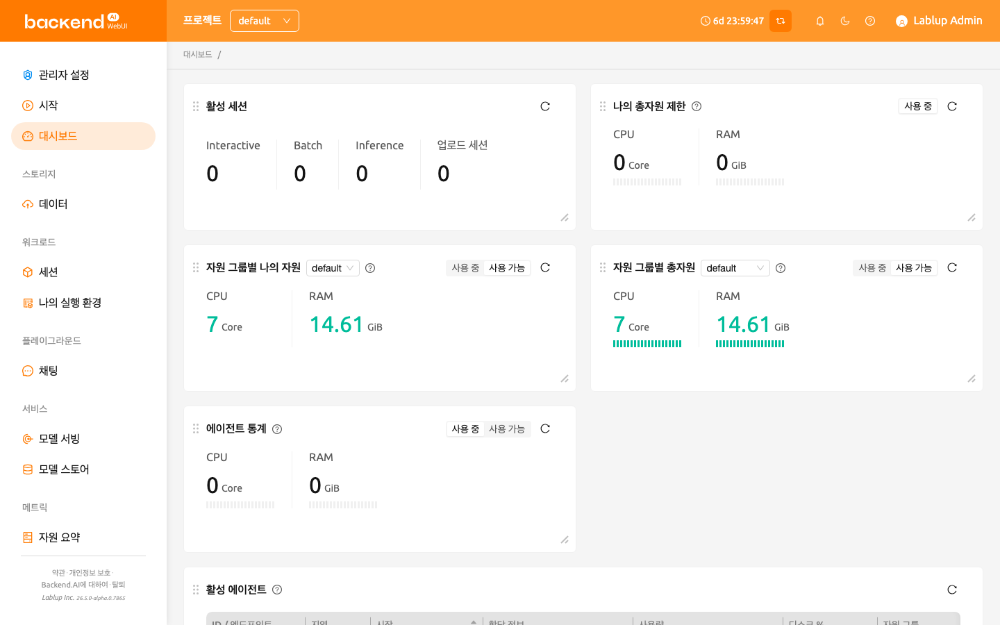

:::warning
이 기능은 더 이상 사용되지 않으므로, 앞으로는 [대시보드](../dashboard/dashboard.md) 페이지를 이용해 주십시오. 또한, 이 기능에 대한 기술 지원 및 버그 수정이 더 이상 제공되지 않습니다. 관련 문제가 해결되지 않을 수 있는 점 양해 부탁드립니다.
:::

# 요약 페이지

요약 페이지에서는 사용자의 자원 사용 상태 및 연산 세션 사용량을 확인할 수 있습니다.

### 자원 사용량

사용자가 할당 가능한 총 자원의 양과 현재 할당받아 점유 중인 자원의 양을 보여 줍니다. 사용자의 CPU, 메모리, GPU 자원 점유량 및 할당량을 각각 확인할 수 있습니다. 또한, 세션 (Sessions) 슬라이더에서 사용자가 동시에 생성 가능한 연산 세션의 수 및 현재 작동 중인 연산 세션의 수를 확인할 수 있습니다.

상단의 자원 그룹 필드를 클릭하여 자원 그룹을 변경할 수 있습니다. 자원 그룹은 다수의 에이전트 노드가 있을 때, 에이전트의 일부를 묶어 하나의 자원 단위로 설정할 수 있는 기능입니다. 다양한 에이전트 노드를 보유하고 있는 경우, 각 자원 그룹별로 특정 프로젝트에 할당하는 등의 설정이 가능합니다. 에이전트 노드가 한 대인 경우에는 하나의 자원 그룹만 보이는 것이 보통입니다. 자원 그룹을 변경하면, 해당 자원 그룹이 보유한 자원량에 따라 할당 가능한 자원량이 변할 수 있습니다.

### 시스템 자원

Backend.AI 시스템에 연결된 에이전트 워커 노드의 수와 현재 생성되어 있는 전체 연산 세션의 수를 보여 줍니다. 에이전트 노드의 CPU, 메모리, GPU 실제 사용량도 확인할 수 있습니다. 일반 사용자로 로그인한 경우에는 자신이 생성한 연산 세션의 숫자만 표시됩니다.

### 초대

다른 사용자가 스토리지 폴더를 공유한 경우 여기에 표시됩니다. 공유 요청을 수락하면 데이터 및 스토리지 폴더에서 공유받은 폴더를 조회하고 접근할 수 있습니다. 접근 권한은 공유를 보낸 사용자가 지정한 설정에 따릅니다. 물론, 공유 요청을 거절할 수도 있습니다.

### Backend.AI WebUI 앱 다운로드

Backend.AI WebUI는 데스크톱 애플리케이션을 지원합니다.
데스크톱 앱을 사용하면 [연산 세션에 대한 SSH/SFTP 연결](../sftp_to_container/sftp_to_container.md#ssh-sftp-container) 등 데스크톱 앱 전용 기능을 이용할 수 있습니다.
현재 Backend.AI WebUI는 다음 운영체제에서 데스크톱 애플리케이션을 제공합니다.

- Windows
- Linux
- Mac

:::note
사용자의 로컬 환경(운영체제, 아키텍처 등)에 맞는 버튼을 클릭하면, 현재 WebUI 버전과 동일한 버전의 데스크톱 앱이 자동으로 다운로드됩니다.
이전 또는 이후 버전의 WebUI 데스크톱 앱을 다운로드하려면, [여기](https://github.com/lablup/backend.ai-webui/releases?page=1)를 방문하여 원하는 버전을 다운로드하십시오.
:::