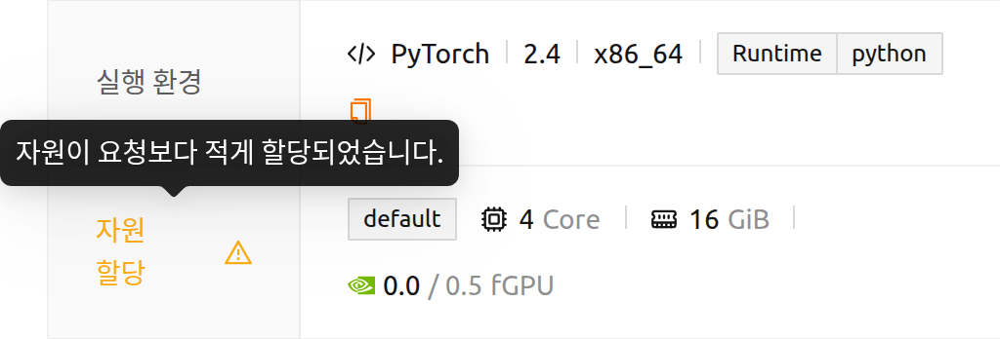

# FAQ 및 문제 해결

## 사용자 문제 해결 가이드

### 연산 세션 리스트가 나타나지 않습니다

간헐적인 네트워크 문제나 기타 다양한 원인으로 인해 연산 세션 리스트가 정상적으로 표시되지 않을 수 있습니다. 대부분의 경우, 브라우저를 갱신하면 연산 세션이 정상적으로 보입니다.

- 웹 기반 WebUI: 브라우저 페이지를 갱신합니다(Ctrl-R 등 브라우저 별 제공하는 페이지 갱신 단축키 사용). 브라우저의 캐시가 쌓여 오동작하는 경우도 있으므로 캐시를 사용하지 않고 페이지 갱신을 해보는 것도 좋습니다(Shift-Ctrl-R 등 브라우저 별 상이).
- 앱 기반 설치형 WebUI: Ctrl-R 단축키를 클릭하여 앱 페이지를 갱신할 수 있습니다.

### 갑자기 로그인이 안 됩니다

간혹 브라우저의 쿠키 문제 및 캐시된 데이터로 인해 로그인이 되지 않는 경우가 있습니다. 브라우저의 시크릿 모드에서 로그인을 시도해 보십시오. 만약 로그인이 된다면, 브라우저의 쿠키 및 애플리케이션 데이터를 삭제한 후 다시 로그인 해 보시기 바랍니다.

<a id="offline-banner"></a>

### 오프라인 상태라는 배너가 표시됩니다

페이지 상단에 빨간색 **오프라인: 네트워크에 연결되어 있지 않습니다.** 배너가 표시되면 Backend.AI 서버에 접근할 수 없다는 뜻입니다. WebUI는 브라우저가 알려주는 네트워크 상태만으로 판단하지 않습니다. 브라우저가 연결이 끊겼다고 보고하면 WebUI는 먼저 서버가 응답하는지 확인하고, 이 확인까지 실패한 경우에만 배너를 표시합니다. 따라서 VPN, 캡티브 포털, 가상 네트워크 어댑터를 사용하는 환경에서 발생하던 잘못된 오프라인 표시는 더 이상 나타나지 않습니다.

네트워크 연결 상태를 확인하고, Backend.AI 서버가 정상적으로 동작 중인지 관리자에게 문의하세요. 배너가 표시되는 동안 WebUI가 계속 재확인하므로, 서버에 다시 접근할 수 있게 되면 몇 초 안에 배너가 자동으로 사라집니다.

노란색 **서버 응답이 지연되고 있습니다. 잠시만 기다려 주세요.** 배너는 이와 다른 의미입니다. 서버에는 접근할 수 있지만 응답이 느린 상태이며, 배너를 닫고 작업을 계속할 수 있습니다.

<a id="route-error-pages"></a>

### 링크를 열었더니 원하는 페이지 대신 오류 페이지가 나타납니다

주소를 열 수 없는 경우에도 WebUI는 빈 페이지를 남기지 않고, 애플리케이션 안에서 그 이유를 안내합니다. 오류 페이지에는 열려고 한 주소와 함께, 사용자가 이용할 수 있는 첫 번째 페이지로 이동하는 버튼(**... 페이지로 돌아가기**)이 표시됩니다. 메시지를 보면 다음 중 어떤 상황인지 알 수 있습니다.

- **요청하신 페이지를 찾을 수 없습니다.** — 주소가 WebUI의 어떤 페이지와도 일치하지 않는 경우입니다. 주소를 잘못 입력했거나, 오래된 링크 또는 페이지 이름이 바뀌기 전에 저장한 즐겨찾기인 경우가 대부분입니다.
- **프로젝트 '...'를 찾을 수 없거나 접근 권한이 없습니다.** — 주소에 지정된 프로젝트가 존재하지 않거나, 사용자가 해당 프로젝트의 구성원이 아닌 경우입니다. 주소에서 프로젝트에 해당하는 부분이 표시되므로 어떤 이름이 잘못되었는지 바로 확인할 수 있습니다. 페이지 상단의 프로젝트 선택기에서 사용할 수 있는 프로젝트를 선택하면 같은 기능이 해당 프로젝트에서 열립니다.
- **선택 가능한 프로젝트가 없습니다.** — 계정이 아직 어떤 프로젝트에도 속해 있지 않은 경우입니다. 메시지의 안내대로 관리자에게 프로젝트 접근 권한을 요청하세요.
- **허가되지 않은 접근입니다.** — 주소 자체는 유효하지만 사용자의 권한으로는 열 수 없는 경우입니다. 로그인 장의 [열 수 없는 페이지](#pages-you-cannot-open) 절을 참고하세요.


<a id="installing_apt_pkg"></a>

### apt 패키지는 어떻게 설치하나요?

연산 세션 내에서 사용자는 보안상의 이유로 `root` 계정에 접근하거나 `sudo` 권한이 필요한 작업을 수행할 수 없습니다. 따라서 `sudo` 권한이 필요한 `apt` 또는 `yum`을 이용한 패키지 설치는 허용되지 않습니다. 꼭 필요한 경우에는 관리자에게 `sudo` 권한 허용을 요청할 수 있습니다.

또는 Homebrew를 이용하여 OS 패키지를 설치할 수 있습니다. 자세한 내용은 [자동 마운트 폴더에서 Homebrew 사용 가이드](#using-linuxbrew-with-automountfolder)를 참고하십시오.


<a id="install_pip_pkg"></a>

### pip 패키지를 설치하고 싶어요

pip 패키지를 설치하면 기본적으로 `~/.local` 경로에 설치됩니다. 따라서, `.local`이라는 이름의 자동 마운트 스토리지 폴더를 생성하면, 연산 세션이 종료된 후에도 설치된 패키지를 보존하여 다음 연산 세션에서 재사용할 수 있습니다. 다음과 같이 pip를 사용하여 패키지를 설치하면 됩니다.

```bash
pip install aiohttp
```
자세한 내용은 [자동 마운트 폴더에서 Python 패키지 설치 가이드](#using-pip-with-automountfolder)를 참고하십시오.

### 연산 세션을 생성했지만 Jupyter Notebook을 실행할 수 없습니다

pip를 통해 Jupyter 패키지를 직접 설치한 경우, 연산 세션이 기본으로 제공하는 Jupyter 패키지와 충돌할 수 있습니다. 특히, `~/.local` 디렉터리를 생성한 경우, 직접 설치한 Jupyter 패키지가 모든 연산 세션에서 유지됩니다. 이 경우에는 `.local` 자동 마운트 폴더를 삭제한 후 Jupyter Notebook을 다시 실행해 보십시오.

### 페이지가 이상하게 표시됩니다

Backend.AI WebUI는 최신 JavaScript 와 브라우저의 기능을 적극 활용하고 있습니다. 가급적 최신 브라우저를 사용하십시오. 특히 Chrome 에서 가장 안정적인 레이아웃을 보입니다.

<a id="sftp-disconnection"></a>

### SFTP 연결이 끊기는 경우

이 항목은 접속이 완료된 후 전송이 중단되는 경우를 다룹니다. 접속 대화상자가 아예 열리지 않고 오류 알림만 표시된다면 접속 정보를 확인하지 못한 것이므로, SFTP 접속 장의 [접속 오류](#connection-errors) 절을 참고하세요.

WebUI 앱을 통한 SFTP 연결은 WebUI 앱이 내장하고 있는 로컬 proxy 서버를 사용합니다. SFTP 연결 후 파일 전송하는 과정에서 콘솔 앱을 종료하면 로컬 proxy 서버로 같이 종료되므로 파일 전송이 중간에 실패하게 됩니다. 따라서, 세션을 사용하지 않는다고 해도 SFTP 사용 중에는 콘솔 앱을 종료하면 안 됩니다. 만약 페이지 갱신이 필요한 상황이면 Ctrl-R 단축키를 이용하는 것을 권합니다.

또한, WebUI 앱을 종료한 후 다시 시작한 경우 기존에 존재하던 컨테이너에서 SFTP 서비스를 자동으로 시작하지 않습니다. 명시적으로 원하는 컨테이너에서 SSH / SFTP 서비스를 시작해줘야 SFTP 연결을 맺을 수 있습니다.


## 관리자 문제 해결 가이드

### 사용자가 Jupyter Notebook 등의 앱을 띄울 수 없는 경우

App Proxy 서비스 연결에 문제가 있을 수 있습니다. App Proxy 서비스 시작/중지/재시작 가이드를 참고하여 서비스를 중지한 후 다시 시작해 보십시오.

웹 기반 앱이 아니라 SSH/SFTP를 열 수 없다는 문의를 받은 경우에는 알림에 표시된 메시지를 그대로 확인하십시오. 메시지마다 App Proxy 경로의 서로 다른 단계를 가리키며, 자세한 내용은 [접속 오류](#connection-errors) 절에 정리되어 있습니다.

### 표시되는 자원 양이 실제 할당된 양과 다릅니다

세션 상세 페이지가 이 상황을 직접 알려주므로 다른 조치를 취하기 전에 먼저 확인하십시오. 이 페이지에는 세션이 **실제로 점유하고 있는** 자원이 표시됩니다. 할당된 양이 요청한 양과 다를 경우, 각 자원은 하나의 항목 안에 *할당 자원 / 요청 자원* 형태(예: `0.0 / 0.5 fGPU`)로 두 값이 함께 표시되고, **자원 할당** 항목 이름에는 경고 아이콘이 나타납니다. 아이콘의 툴팁에는 *자원이 요청보다 적게 할당되었습니다.* 라는 설명이 표시됩니다.



여기에 표시된 차이는 표시 오류가 아니라 실제 할당 결과입니다. 대부분 세션이 할당될 때 요청이 조정된 경우로, 예를 들어 소수점 단위의 GPU 요청량이 자원 그룹의 할당 단위에 맞춰 내림 처리된 경우입니다. 아직 할당되지 않은 세션에는 요청한 양만 표시되고 비교 값은 나타나지 않습니다.

이 페이지에 표시된 값마저 컨테이너가 실제로 사용하는 양과 다른 경우에만(네트워크 연결이 불안정했거나 Docker 데몬의 컨테이너 관리에 문제가 있었던 경우 발생할 수 있습니다) 점유량을 다시 계산하십시오.

1. 관리자 계정으로 로그인합니다.
2. **관리** 페이지로 이동합니다.
3. **사용량 재계산** 버튼을 클릭합니다.

### 도커 레지스트리에 이미지 등록 후 세션 생성 환경에 이미지가 보이지 않을 때


:::note
이 기능은 슈퍼 관리자만 사용할 수 있습니다.
:::

사설 도커 레지스트리에 이미지가 새로 등록된 경우 Backend.AI에서 레지스트리 별 이미지 메타 데이터를 업데이트 해야 세션 생성할 때 이용할 수 있습니다. 메타 데이터 업데이트는 **관리** 페이지의 **이미지 리스캔** 버튼을 클릭하여 수행할 수 있습니다. 만약 연결된 도커 레지스트리가 여러 개일 경우, **이미지 리스캔** 버튼을 클릭하면 모든 레지스트리에서 메타 정보를 받아 옵니다.

특정한 도커 레지스트리의 메타 정보만 업데이트 하고자 할 경우 **실행 환경** 페이지의 **레지스트리** 탭으로 이동합니다. 각 레지스트리는 행(row)으로 표시되며 작업 메뉴를 포함합니다. 원하는 레지스트리 행의 **이미지 리스캔** 작업을 클릭하면 해당 레지스트리의 이미지 메타 정보만 갱신할 수 있습니다.

:::warning
같은 행에는 **삭제** 작업(휴지통 아이콘)도 있습니다. 레지스트리를 삭제하면 Backend.AI에서 영구적으로 제거되므로, **이미지 리스캔** 작업과 혼동하지 않도록 주의하십시오.
:::
