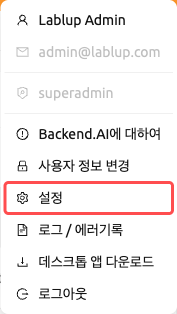
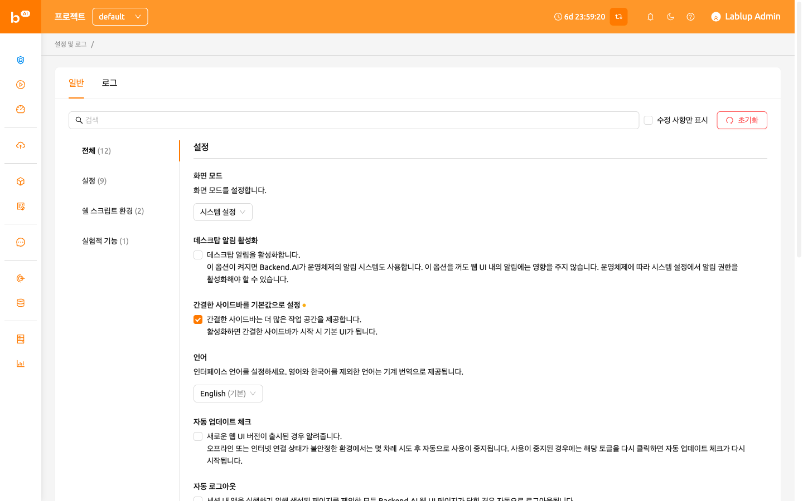
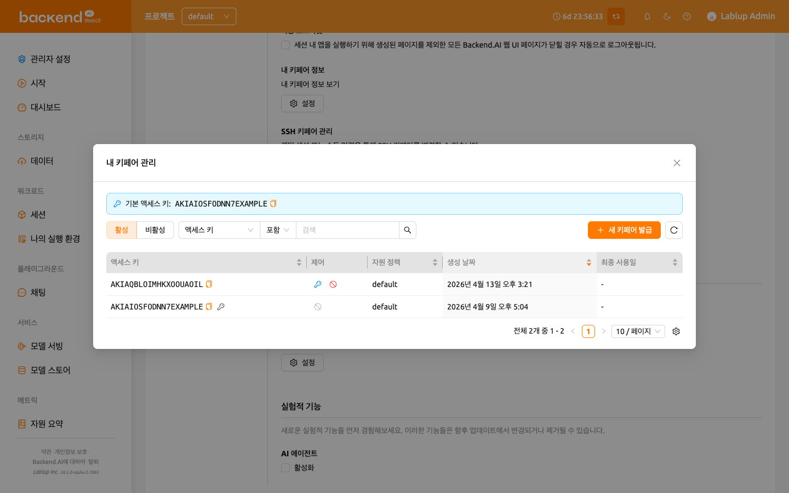
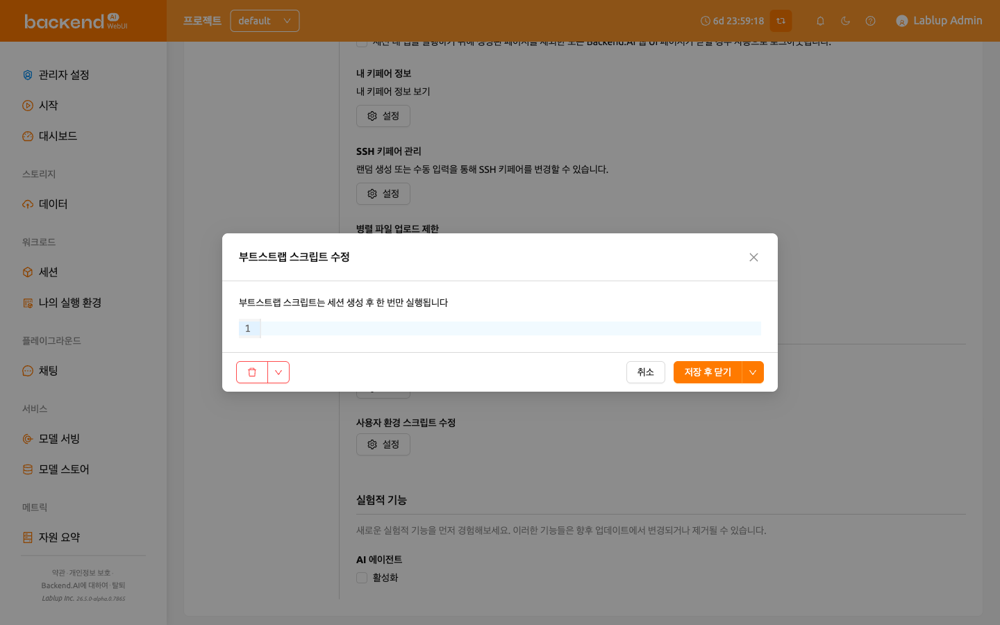
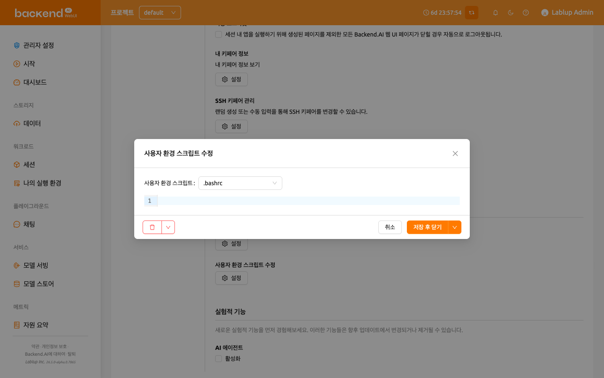
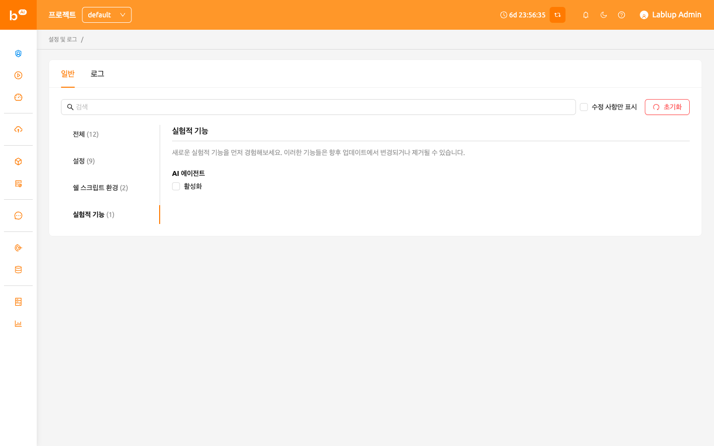
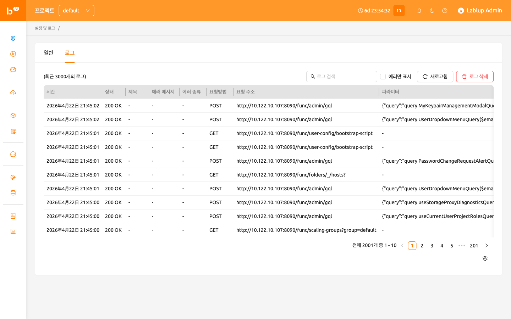
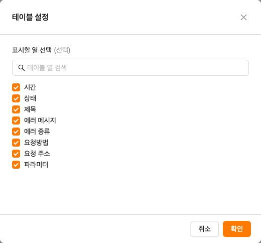

# 사용자 설정 페이지

사용자 설정 페이지에서는 Backend.AI WebUI 환경을 사용자 정의할 수 있습니다.
우측 상단의 사람 아이콘을 클릭한 후 설정 메뉴를 선택하여 접근할 수 있습니다.
여기에서 화면 모드, 언어, 데스크탑 알림, SSH 키페어 관리, 쉘 스크립트,
실험적 기능 등의 환경 설정을 구성할 수 있습니다.

## 일반 탭

일반 탭에는 **설정**, **쉘 스크립트 환경**, **실험적 기능** 그룹으로 구성된
모든 환경 설정 항목이 포함되어 있습니다.

### 설정 검색 및 필터링

설정 영역 상단의 **검색 바**를 사용하여 설정 이름으로 빠르게 검색할 수 있습니다.
키워드를 입력하면 일치하는 설정만 표시됩니다.

**수정 사항만 표시** 체크박스를 선택하면 기본값에서 변경된 설정만 필터링하여
표시할 수 있습니다. 이 기능은 변경한 모든 사용자 정의 항목을 한눈에 확인할 때
유용합니다.

### 설정 초기화

모든 설정을 기본값으로 복원하려면 설정 영역 상단의 **기본값으로 초기화** 버튼을
클릭합니다. 초기화 적용 전에 확인 대화 상자가 나타납니다.

각 개별 설정에도 자체 초기화 버튼이 있으며 (값이 기본값과 다를 때 표시됨),
다른 설정에 영향을 주지 않고 단일 설정만 초기화할 수 있습니다.

### 화면 모드

WebUI의 화면 모드를 설정합니다. 다음 중에서 선택할 수 있습니다:

- **시스템 설정**: 운영체제의 라이트/다크 모드 설정을 자동으로 따릅니다.
- **라이트 모드**: 항상 라이트 테마를 사용합니다.
- **다크 모드**: 항상 다크 테마를 사용합니다.

### 데스크탑 알림 활성화

데스크탑 알림 기능의 사용 여부를 설정합니다. 활성화하면 Backend.AI는 앱 내부
알림 외에 운영체제의 알림 시스템도 함께 사용합니다. 이 옵션을 비활성화해도
WebUI 내부의 알림 기능에는 영향을 주지 않습니다. 운영체제에 따라 시스템 설정에서
알림 권한을 활성화해야 할 수 있습니다.

### 간결한 사이드바를 기본값으로 설정

이 옵션이 켜져 있으면 좌측 사이드바가 콤팩트 형태 (너비가 줄어든 형태)로
표시됩니다. 옵션 변경은 브라우저를 갱신할 때 적용됩니다. 페이지 갱신 없이
사이드바 형태를 즉시 변경하고 싶다면, 헤더 상단부의 가장 좌측 아이콘을
클릭하십시오.

### 언어

UI에 출력되는 언어를 설정합니다. 언어 선택기는 검색 가능한 드롭다운으로,
English, 한국어, brasileiro, 简体中文, 繁體中文, Français, Suomalainen, Deutsch,
Ελληνική, Bahasa Indonesia, Italiano, 日本語, Монгол, Polski, Português,
русский, Español, ภาษาไทย, Türkçe, Tiếng Việt 등 20개 언어를 지원합니다.
드롭다운에 입력하여 원하는 언어를 빠르게 찾을 수 있습니다.

브라우저의 기본 언어와 일치하는 항목에는 "(Default)" 라벨이 표시됩니다. 영어와
한국어 이외의 언어는 기계 번역을 통해 제공됩니다. 페이지 갱신 전에는 언어가
바뀌지 않는 UI 항목이 있을 수 있습니다.

:::note
일부 번역 항목은 `__NOT_TRANSLATED__`로 표시될 수 있으며, 이는 해당 언어에 대한
번역이 아직 완료되지 않았음을 나타냅니다. Backend.AI WebUI는 오픈 소스이므로,
번역 개선에 기여하고자 하는 분은 누구나 참여할 수 있습니다:
https://github.com/lablup/backend.ai-webui.
:::

### 로그아웃 후 로그인 정보 유지

:::note
이 설정은 Electron (데스크탑) 앱에서만 사용할 수 있습니다.
:::

활성화하면 WebUI 앱이 다음 앱 사용 시까지 현재 로그인 세션 정보를 저장합니다.
이 옵션이 꺼져 있으면 매 로그아웃 시마다 로그인 정보가 자동으로 삭제됩니다.

### 자동 업데이트 체크

WebUI의 새 버전이 검색될 경우 알림 창을 띄웁니다. 이 기능은 인터넷 접속이 가능한
환경에서만 동작합니다. 기능이 자동으로 비활성화된 경우, 토글을 다시 클릭하면
업데이트 확인이 재개됩니다.

### 자동 로그아웃

세션 내 앱을 실행하기 위해 생성된 페이지를 제외한 모든 Backend.AI WebUI 페이지가
닫힐 경우, 자동으로 로그아웃됩니다. (Jupyter Notebook, Web Terminal 등의 앱을
접속하는 경우에는 로그아웃이 되지 않습니다.)

### 내 키페어 정보

모든 사용자는 하나 이상의 키페어를 가지고 있습니다. Config 버튼을 클릭하면
액세스 키와 비밀 키를 확인할 수 있습니다. 기본 액세스 키페어는 하나만 존재합니다.

:::note
서버 버전에 따라 키페어 정보 대화 상자에 새로운 키페어 발급, 비활성화, 폐기 등
추가 관리 옵션이 포함된 테이블 형태로 표시될 수 있습니다.
:::

:::note[재로그인 필요]
기본 액세스 키가 변경되면(예: 새 키페어를 발급하여 기본 키페어로 지정한
경우), WebUI에 **재로그인 필요** 알림과 함께 *"기본 액세스 키가 변경되었습니다.
변경 사항을 적용하려면 다시 로그인해 주세요."* 메시지가 표시됩니다. 변경된
기본 액세스 키를 세션에 적용하려면 로그아웃 후 다시 로그인하세요.
:::

### SSH 키페어 관리

연산 세션에 직접 SSH/SFTP로 접속할 때 필요한 SSH 키페어를 조회하고 생성하는
기능입니다. SSH 키페어 관리 섹션의 우측 버튼을 클릭하면 다음과 같은 다이얼로그가
나타납니다. 우측의 복사 버튼을 클릭하면 현재 존재하는 SSH 공개 키를 복사할 수
있습니다. 다이얼로그 하단의 `GENERATE` 버튼을 클릭하면 SSH 키페어를 갱신할 수
있습니다. SSH 공개/비밀 키는 랜덤으로 생성되어 사용자 정보로 저장됩니다. 비밀
키는 생성 직후 따로 저장해 두지 않으면 다시 확인할 수 없음에 주의하십시오.

:::note
Backend.AI는 OpenSSH에 기반한 SSH keypair를 사용합니다. Windows에서는 PPK 기반
키로 변환해야 할 수 있습니다.
:::

22.09 버전부터, Backend.AI WebUI는 사설 저장소 접근 등 유연성을 제공하기 위해
사용자 자신의 SSH 키페어를 직접 등록하는 기능을 지원합니다. 자신의 SSH 키페어를
추가하려면 `ENTER MANUALLY` 버튼을 클릭하십시오. 그러면 "public" 키와 "private"
키에 해당하는 두 개의 텍스트 영역이 표시됩니다.

키를 입력한 후 `SAVE` 버튼을 클릭하십시오. 이제 자신의 키를 사용하여 Backend.AI
세션에 접속할 수 있습니다.

### 병렬 파일 업로드 제한

파일 익스플로러를 통해 동시에 업로드할 수 있는 파일의 개수를 제한합니다. 2에서
5 사이의 값을 선택할 수 있습니다. 기본값은 2입니다.

### 부트스트랩 스크립트 수정

연산 세션 시작 후 한 번만 스크립트를 실행하고자 할 경우, 여기에 그 내용을
작성해 주십시오.

:::note
부트스트랩 스크립트의 실행이 완료될 때까지 연산 세션은 `PREPARING` 상태를
유지합니다. 세션이 `RUNNING` 상태가 되어야 사용할 수 있으므로, 스크립트에 오래
걸리는 작업이 포함되어 있다면 부트스트랩 스크립트에서 제거하고 터미널 앱에서
직접 실행하는 것이 좋습니다.
:::

### 사용자 환경 스크립트 수정

연산 세션의 기본 설정 스크립트를 대체하는 사용자 환경 스크립트를 작성할 수
있습니다. `.bashrc`, `.tmux.conf.local`, `.vimrc` 등의 파일을 사용자 정의할 수
있습니다. 스크립트는 사용자별로 저장되며, 특정 자동화 작업이 필요할 때 활용할 수
있습니다. 예를 들어, `.bashrc` 스크립트를 수정하여 명령어 별칭을 등록하거나
특정 파일이 항상 지정된 위치에 다운로드되도록 설정할 수 있습니다.

상단의 드롭다운 메뉴를 활용해서 작성할 스크립트의 종류를 선택한 후 내용을
작성하십시오. 작성이 완료되면 SAVE 또는 SAVE AND CLOSE 버튼을 클릭해서
스크립트를 저장할 수 있습니다. DELETE 버튼을 클릭하면 해당 스크립트를 삭제할 수
있습니다.

### 실험적 기능

새로운 실험적 기능을 먼저 경험해보세요. 이러한 기능들은 향후 업데이트에서
변경되거나 제거될 수 있습니다.

- **AI 에이전트**: AI 에이전트 기능을 활성화합니다. 이 기능은 WebUI 내에서
  에이전트 기반 AI 기능을 제공합니다. 활성화하면 세션에서 AI 에이전트 기능을
  사용할 수 있습니다.

## 로그 탭

클라이언트 측에서 기록된 각종 로그의 상세 정보를 출력합니다. 요청 오류가
발생했을 때 자세한 내용을 확인하고 싶을 때 이 페이지를 방문할 수 있습니다. 우측
상단의 버튼을 이용해서 로그를 검색하거나 에러 메시지를 필터링하고, 로그를
새로고침하거나 지울 수 있습니다.

:::note
로그인된 페이지가 하나만 존재할 경우, REFRESH 버튼을 클릭하면 제대로 작동하지
않는 것처럼 보일 수 있습니다. 로그 페이지는 서버에 대한 요청과 서버의 응답을
모아둔 것이며, 현재 페이지가 로그 페이지인 경우 명시적으로 페이지를 새로 고침하는
것 외에는 서버에 요청을 보내지 않습니다. 로그가 제대로 쌓이는지 확인하려면 다른
페이지를 열고 REFRESH 버튼을 클릭하십시오.
:::

특정 열을 숨기거나 보이게 하려면, 테이블 우측 하단의 기어 아이콘을 클릭하십시오.
그러면 아래와 같은 다이얼로그가 나타나며, 보고 싶은 열을 선택할 수 있습니다.

