

# 사용자 설정 페이지

사용자 설정 페이지에서는 Backend.AI WebUI 환경을 사용자 정의할 수 있습니다.
우측 상단의 사람 아이콘을 클릭한 후 설정 메뉴를 선택하여 접근할 수 있습니다.
여기에서 화면 모드, 언어, 데스크탑 알림, SSH 키페어 관리, 쉘 스크립트,
실험적 기능 등의 환경 설정을 구성할 수 있습니다. 또한 클라이언트 측 로그와
현재 계정에 로그인되어 있는 로그인 세션, 로그인 기록도 확인할 수 있습니다.

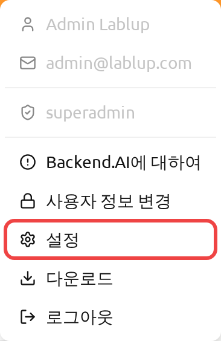

이 페이지는 **일반**, **로그**, **로그인 세션**, **로그인 기록** 네 개의 탭으로
구성되어 있습니다.

## 일반 탭

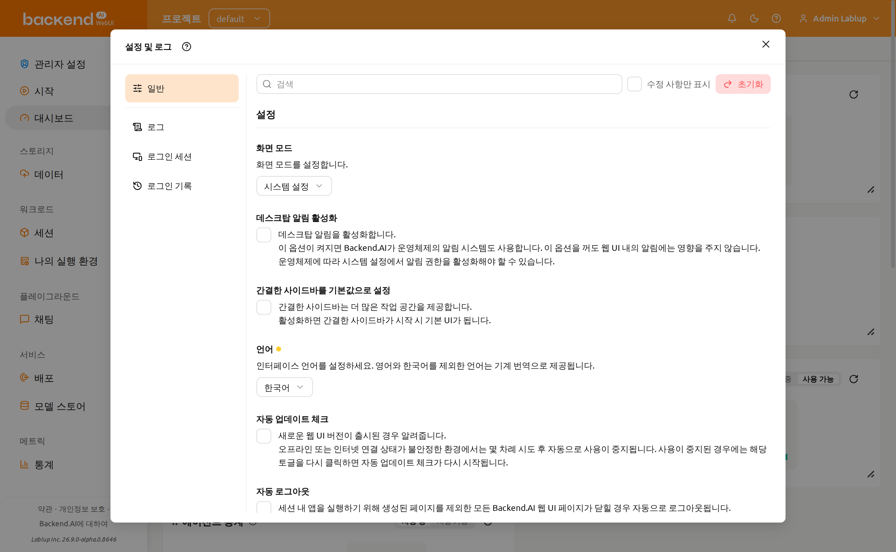

일반 탭에는 **설정**, **쉘 스크립트 환경**, **실험적 기능** 그룹으로 구성된
모든 환경 설정 항목이 포함되어 있습니다. 좌측 목록에서 특정 그룹으로 바로
이동할 수 있으며, **전체**를 선택하면 모든 설정 항목을 한 번에 볼 수 있습니다.

### 설정 검색 및 필터링

설정 영역 상단의 **검색 바**를 사용하여 설정 이름으로 빠르게 검색할 수 있습니다.
키워드를 입력하면 일치하는 설정만 표시됩니다.

**수정 사항만 표시** 체크박스를 선택하면 기본값에서 변경된 설정만 필터링하여
표시할 수 있습니다. 이 기능은 변경한 모든 사용자 정의 항목을 한눈에 확인할 때
유용합니다.

### 설정 초기화

모든 설정을 기본값으로 복원하려면 설정 영역 상단의 **초기화** 버튼을
클릭합니다. 초기화 적용 전에 이 동작을 취소할 수 없다는 경고와 함께 확인 대화
상자가 나타납니다.

각 개별 설정에도 자체 초기화 버튼이 있으며 (값이 기본값과 다를 때 표시됨),
다른 설정에 영향을 주지 않고 단일 설정만 초기화할 수 있습니다.

### 화면 모드

WebUI의 화면 모드를 설정합니다. 다음 중에서 선택할 수 있습니다:

- **시스템 설정**: 운영체제의 라이트/다크 모드 설정을 자동으로 따릅니다.
- **라이트 모드**: 항상 라이트 테마를 사용합니다.
- **다크 모드**: 항상 다크 테마를 사용합니다.

### 테마

테마는 라이트 모드와 다크 모드 모두에서 WebUI 전체에 적용되는 색상 계열입니다.
테마 선택 기능을 사용할 수 있는 경우, **테마** 설정에서 제품에 기본 제공되는
다음 테마 중 하나를 선택할 수 있습니다:

- **Default**: 해당 설치 환경에 설정된 색상으로 구성된 기본 화면입니다.
- **Stained**
- **Glass**
- **Reverie**
- **Bliss**

선택한 테마는 즉시 적용되며, 선택 내용은 계정에 저장됩니다. 설정의 초기화
버튼을 클릭하면 **Default** 테마로 되돌아갑니다.

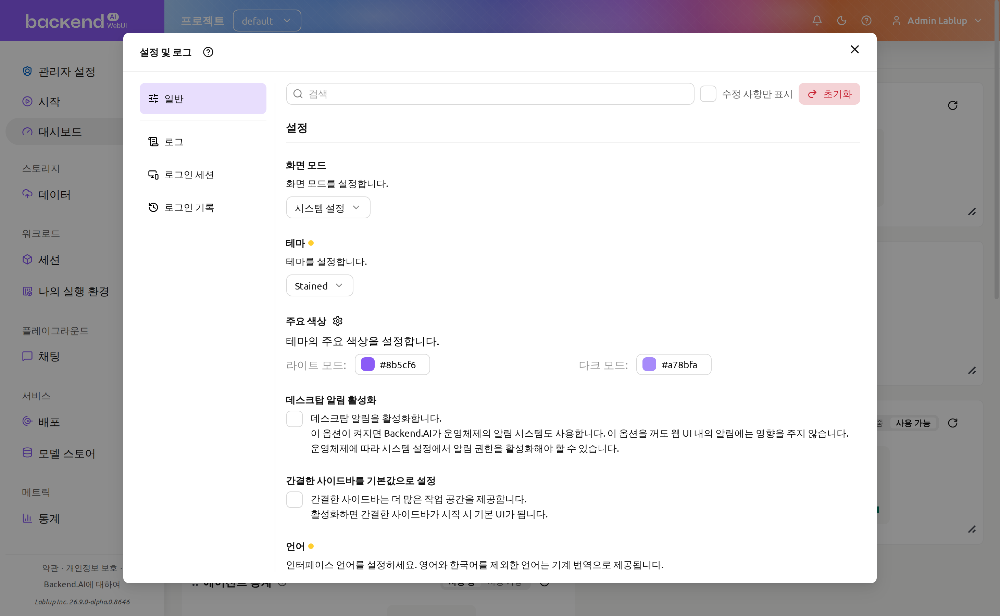

:::note
**테마** 설정은 관리자가 테마 사용자 정의 기능을 활성화하고 설치 환경에 둘 이상의
테마가 제공되는 경우에만 표시됩니다. 따라서 제공되는 테마 목록은 위 목록과 다를
수 있습니다.
:::

### 주요 색상

**주요 색상**은 선택한 테마의 대표 강조 색상을 재정의합니다. **라이트 모드**와
**다크 모드**에 각각 하나씩 두 개의 색상 선택기가 제공되므로, 화면 모드별로 다른
강조 색상을 사용할 수 있습니다.

1. 변경하려는 모드의 색상 견본을 클릭합니다
2. 색상 선택기에서 색상을 고르거나 16진수 값을 입력합니다
3. 새 강조 색상이 WebUI에 즉시 적용됩니다

색상 선택기를 비우면 해당 모드에서 선택한 테마가 제공하는 색상을 그대로
사용합니다. 설정의 초기화 버튼을 클릭하면 두 모드의 설정이 모두 지워지고 테마
고유의 색상으로 복원됩니다.

:::note
**테마** 설정과 마찬가지로 **주요 색상**도 관리자가 테마 사용자 정의 기능을
활성화한 경우에만 표시됩니다.
:::

### 데스크탑 알림 활성화

데스크탑 알림 기능의 사용 여부를 설정합니다. 활성화하면 Backend.AI는 앱 내부
알림 외에 운영체제의 알림 시스템도 함께 사용합니다. 이 옵션을 비활성화해도
WebUI 내부의 알림 기능에는 영향을 주지 않습니다. 운영체제에 따라 시스템 설정에서
알림 권한을 활성화해야 할 수 있습니다.

### 간결한 사이드바를 기본값으로 설정

이 옵션이 켜져 있으면 좌측 사이드바가 콤팩트 형태 (너비가 줄어든 형태)로
표시됩니다. 옵션 변경은 브라우저를 갱신할 때 적용됩니다. 페이지 갱신 없이
사이드바 형태를 즉시 변경하고 싶다면, 헤더 상단부의 가장 좌측 아이콘을
클릭하십시오.

### 언어

UI에 출력되는 언어를 설정합니다. 언어 선택기는 검색 가능한 드롭다운으로,
English, 한국어, brasileiro, 简体中文, 繁體中文, Français, Suomalainen, Deutsch,
Ελληνική, Bahasa Indonesia, Italiano, 日本語, Монгол, Polski, Português,
русский, Español, ภาษาไทย, Türkçe, Tiếng Việt 등 20개 언어를 지원합니다.
드롭다운에 입력하여 원하는 언어를 빠르게 찾을 수 있습니다.

브라우저의 기본 언어와 일치하는 항목에는 "(Default)" 라벨이 표시됩니다. 영어와
한국어 이외의 언어는 기계 번역을 통해 제공됩니다. 페이지 갱신 전에는 언어가
바뀌지 않는 UI 항목이 있을 수 있습니다.

:::note
일부 번역 항목은 `__NOT_TRANSLATED__`로 표시될 수 있으며, 이는 해당 언어에 대한
번역이 아직 완료되지 않았음을 나타냅니다. Backend.AI WebUI는 오픈 소스이므로,
번역 개선에 기여하고자 하는 분은 누구나 참여할 수 있습니다:
https://github.com/lablup/backend.ai-webui.
:::

### 로그아웃 후 로그인 정보 유지

:::note
이 설정은 Electron (데스크탑) 앱에서만 사용할 수 있습니다.
:::

활성화하면 WebUI 앱이 다음 앱 사용 시까지 현재 로그인 세션 정보를 저장합니다.
이 옵션이 꺼져 있으면 매 로그아웃 시마다 로그인 정보가 자동으로 삭제됩니다.

### 자동 업데이트 체크

WebUI의 새 버전이 검색될 경우 알림 창을 띄웁니다. 이 기능은 인터넷 접속이 가능한
환경에서만 동작합니다. 기능이 자동으로 비활성화된 경우, 토글을 다시 클릭하면
업데이트 확인이 재개됩니다.

### 자동 로그아웃

세션 내 앱을 실행하기 위해 생성된 페이지를 제외한 모든 Backend.AI WebUI 페이지가
닫힐 경우, 자동으로 로그아웃됩니다. (Jupyter Notebook, Web Terminal 등의 앱을
접속하는 경우에는 로그아웃이 되지 않습니다.)

### 내 키페어 정보

모든 사용자는 하나 이상의 키페어를 가지고 있습니다. `설정` 버튼을 클릭하면
액세스 키와 비밀 키를 확인할 수 있습니다. 기본 액세스 키페어는 하나만 존재합니다.

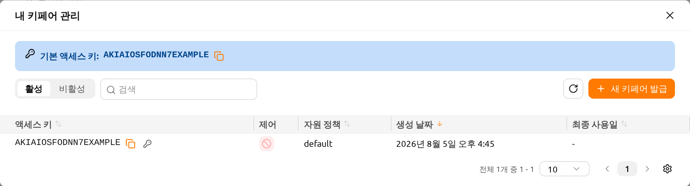

대화 상자 상단의 **기본 액세스 키** 배너에는 현재 기본 액세스 키가 표시됩니다.
옆의 복사 아이콘을 클릭하면 키를 클립보드에 복사할 수 있습니다.

#### 키페어 살펴보기

대화 상자에는 키페어가 테이블 형태로 나열됩니다. 테이블 위의 컨트롤을 사용하여
표시 항목을 좁힐 수 있습니다:

- **활성** / **비활성** 토글: 활성 키페어와 비활성화된 키페어 보기를 전환합니다.
- **필터**: **액세스 키** 또는 **자원 정책**으로 목록을 필터링합니다.
- **열 정렬**: 열 머리글을 클릭하여 **액세스 키**, **자원 정책**, **생성 날짜**
  또는 **최종 사용일** 기준으로 테이블을 정렬합니다.
- **페이지네이션**: 한 페이지에 표시할 수 있는 것보다 키페어가 많을 때 페이지를
  이동합니다.

테이블에는 다음 열이 포함됩니다:

- **액세스 키**: 키페어의 액세스 키입니다. 기본 액세스 키에는 키 아이콘이
  표시됩니다. 복사 아이콘을 클릭하면 액세스 키를 복사할 수 있습니다.
- **제어**: 각 키페어에 사용할 수 있는 작업입니다 (아래 참고).
- **자원 정책**: 키페어에 적용된 자원 정책입니다.
- **생성 날짜**: 키페어가 생성된 시점입니다.
- **최종 사용일**: 키페어가 마지막으로 사용된 시점입니다.
- **수정일**: 키페어가 마지막으로 수정된 시점입니다. 이 열은 기본적으로
  숨겨져 있으며, 테이블 열 설정에서 표시할 수 있습니다.

#### 새 키페어 발급

**새 키페어 발급** 버튼을 클릭하면 새 키페어를 생성할 수 있습니다. 키페어가
발급되면 **키페어 자격증명 정보** 대화 상자가 나타나며, 새 자격증명을 단 한
번만 표시합니다.

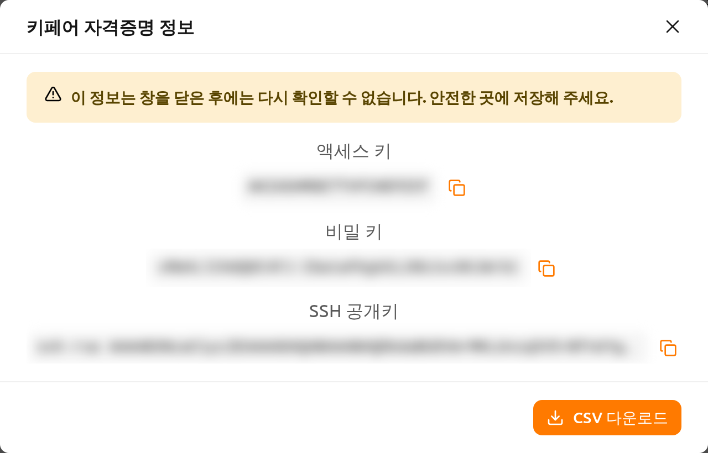

대화 상자에는 다음 값이 각각 복사 버튼과 함께 표시됩니다:

- **액세스 키**
- **비밀 키**
- **SSH 공개키**

**CSV 다운로드**를 클릭하면 자격증명을 파일로 저장할 수 있습니다.

:::warning
*"이 정보는 창을 닫은 후에는 다시 확인할 수 없습니다. 안전한 곳에 저장해
주세요."* 비밀 키는 단 한 번만 표시됩니다. 대화 상자를 닫기 전에 복사하거나 CSV를
다운로드하십시오. 이후에는 비밀 키를 다시 확인할 방법이 없습니다.
:::

#### 활성 키페어 관리

각 활성 키페어의 **제어** 열에서는 다음 작업을 사용할 수 있습니다:

- **기본으로 설정**: 이 키페어를 기본 액세스 키로 지정합니다. 변경이 적용되기
  전에 확인 창이 나타납니다. 현재 사용 중인 기본 액세스 키에는 이 작업이 표시되지
  않습니다.

  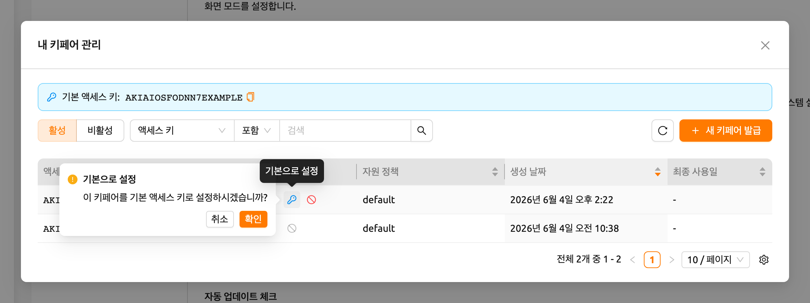

- **비활성화**: 키페어를 비활성화하여 더 이상 사용할 수 없게 합니다. 키페어가
  비활성화되기 전에 확인 창이 나타납니다. 기본 액세스 키는 비활성화할 수 없으므로
  먼저 다른 키로 전환해야 합니다 (*"기본 액세스 키는 비활성화할 수 없습니다.
  다른 키로 먼저 전환해 주세요."*).

:::note[재로그인 필요]
기본 액세스 키가 변경되면(예: 새 키페어를 발급하여 기본 키로 설정한 경우),
WebUI에 **재로그인 필요** 알림과 함께 *"기본 액세스 키가 변경되었습니다. 변경
사항을 적용하려면 다시 로그인해 주세요."* 메시지가 표시됩니다. 변경된 기본 액세스
키를 세션에 적용하려면 로그아웃 후 다시 로그인하십시오.
:::

#### 비활성 키페어 관리

**비활성** 보기로 전환하면 비활성화된 키페어를 관리할 수 있습니다. 각 비활성
키페어에서는 다음 작업을 사용할 수 있습니다:

- **복구**: 키페어를 다시 활성화하여 사용할 수 있도록 합니다. 키페어가 복구되기
  전에 확인 창이 나타납니다.
- **키페어 삭제**: 키페어를 영구적으로 삭제합니다.

:::danger
키페어 삭제는 **되돌릴 수 없습니다**. 한 번 삭제된 키페어는 복구할 수 없습니다.
실수로 삭제하는 것을 방지하기 위해, 삭제가 허용되기 전에 확인 입력란에
**영구 삭제**를 입력해야 합니다.
:::

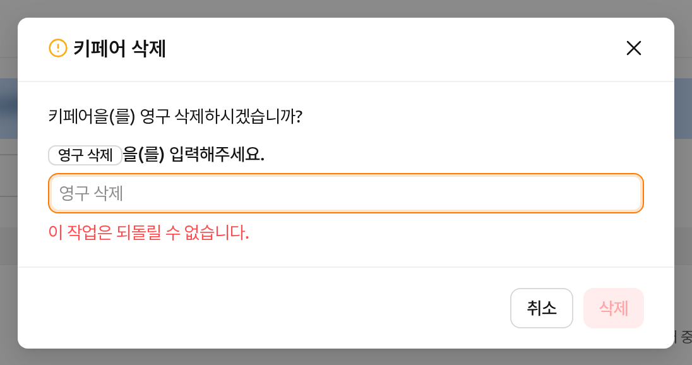

### SSH 키페어 관리

연산 세션에 직접 SSH/SFTP로 접속할 때 필요한 SSH 키페어를 조회하고 생성하는
기능입니다. SSH 키페어 관리 섹션의 우측 버튼을 클릭하면 다음과 같은 다이얼로그가
나타납니다. 우측의 복사 버튼을 클릭하면 현재 존재하는 SSH 공개 키를 복사할 수
있습니다. 다이얼로그 하단의 `생성하기` 버튼을 클릭하면 SSH 키페어를 갱신할 수
있습니다. SSH 공개/비밀 키는 랜덤으로 생성되어 사용자 정보로 저장됩니다. 비밀
키는 생성 직후 따로 저장해 두지 않으면 다시 확인할 수 없음에 주의하십시오.

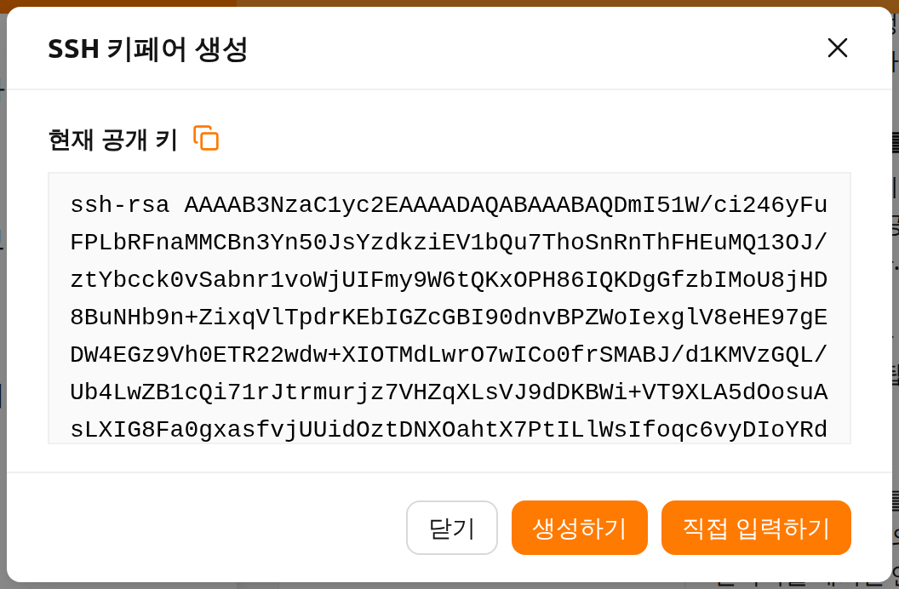

:::note
Backend.AI는 OpenSSH에 기반한 SSH keypair를 사용합니다. Windows에서는 PPK 기반
키로 변환해야 할 수 있습니다.
:::

Backend.AI WebUI는 사설 저장소 접근 등 유연성을 제공하기 위해 사용자 자신의 SSH
키페어를 직접 등록하는 기능을 지원합니다. 자신의 SSH 키페어를 추가하려면
`직접 입력하기` 버튼을 클릭하십시오. 그러면 **공개 키**와 **비밀 키** 두 개의
텍스트 영역이 표시됩니다.

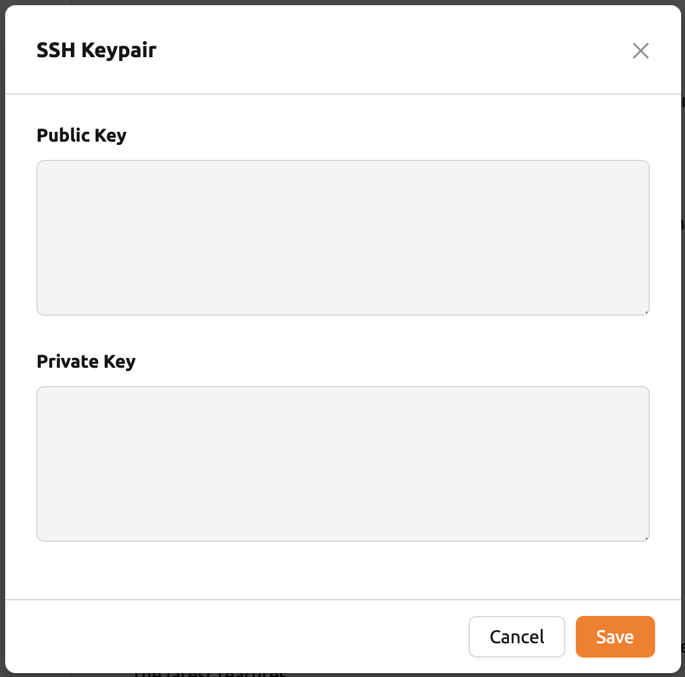

키를 입력한 후 `저장` 버튼을 클릭하십시오. 이제 자신의 키를 사용하여 Backend.AI
세션에 접속할 수 있습니다.

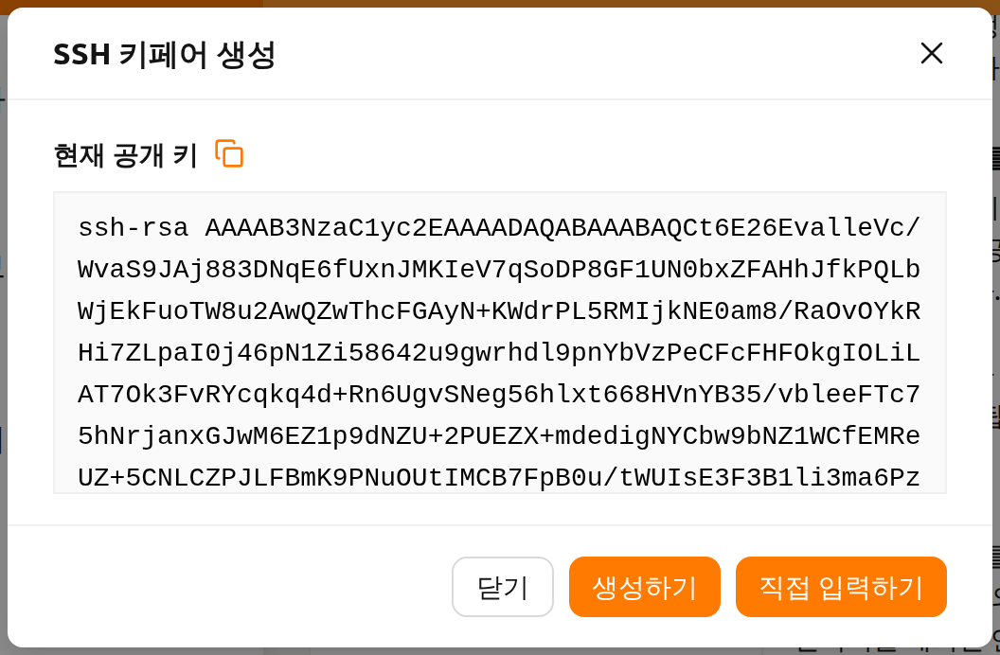

### 병렬 파일 업로드 제한

파일 익스플로러를 통해 동시에 업로드할 수 있는 파일의 개수를 제한합니다. 2에서
5 사이의 값을 선택할 수 있습니다. 기본값은 2입니다.

### 부트스트랩 스크립트 수정

연산 세션 시작 후 한 번만 스크립트를 실행하고자 할 경우, 여기에 그 내용을
작성해 주십시오.

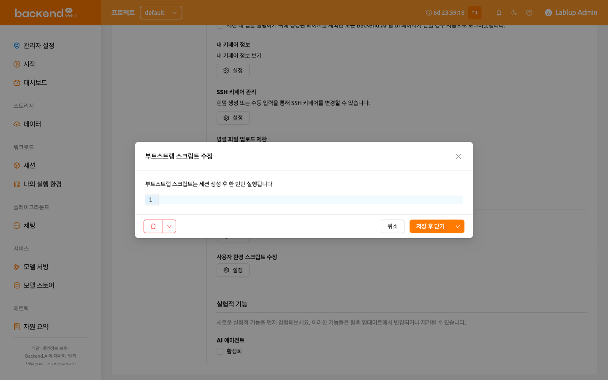

:::note
부트스트랩 스크립트의 실행이 완료될 때까지 연산 세션은 `PREPARING` 상태를
유지합니다. 세션이 `RUNNING` 상태가 되어야 사용할 수 있으므로, 스크립트에 오래
걸리는 작업이 포함되어 있다면 부트스트랩 스크립트에서 제거하고 터미널 앱에서
직접 실행하는 것이 좋습니다.
:::

### 사용자 환경 스크립트 수정

연산 세션의 기본 설정 스크립트를 대체하는 사용자 환경 스크립트를 작성할 수
있습니다. `.bashrc`, `.tmux.conf.local`, `.vimrc` 등의 파일을 사용자 정의할 수
있습니다. 스크립트는 사용자별로 저장되며, 특정 자동화 작업이 필요할 때 활용할 수
있습니다. 예를 들어, `.bashrc` 스크립트를 수정하여 명령어 별칭을 등록하거나
특정 파일이 항상 지정된 위치에 다운로드되도록 설정할 수 있습니다.

상단의 드롭다운 메뉴를 활용해서 작성할 스크립트의 종류 (`.bashrc`, `.zshrc`,
`.tmux.conf.local`, `.vimrc`, `.Renviron`) 를 선택한 후 내용을 작성하십시오.
`저장 후 닫기` 버튼을 클릭하면 스크립트를 저장하고 다이얼로그를 닫으며, 옆의
화살표를 열어 `저장 후 유지`를 선택하면 다이얼로그를 열어 둔 채로 저장할 수
있습니다. 다이얼로그 좌측의 버튼으로는 스크립트를 삭제하거나 저장하지 않은
변경사항을 초기화할 수 있습니다.

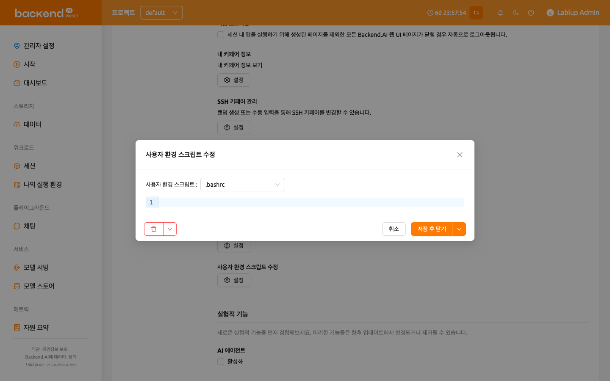

### 실험적 기능

새로운 실험적 기능을 먼저 경험해보세요. 이러한 기능들은 향후 업데이트에서
변경되거나 제거될 수 있습니다. 각 기능은 **활성화** 체크박스로 켤 수 있습니다.

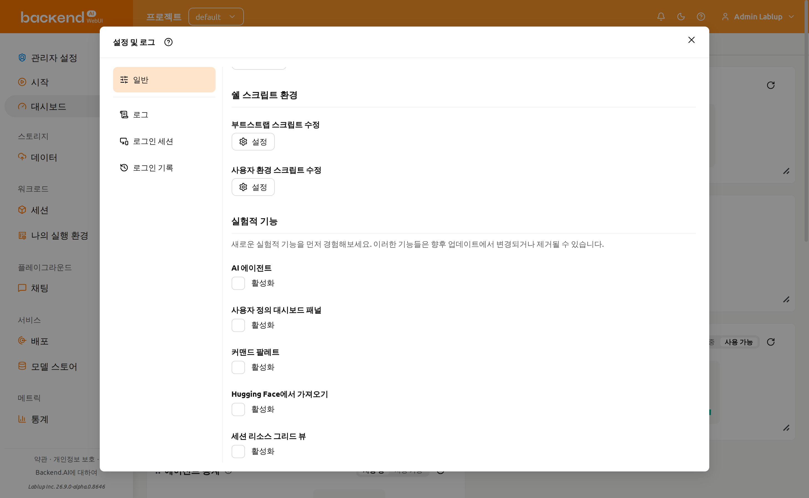

- **AI 에이전트**: AI 에이전트 기능을 활성화합니다. 이 기능은 WebUI 내에서
  에이전트 기반 AI 기능을 제공합니다. 활성화하면 세션에서 AI 에이전트 기능을
  사용할 수 있습니다.
- **Hugging Face에서 가져오기**: 시작 페이지의 **URL 로 시작** 대화 상자에
  **Hugging Face 모델 가져오기** 탭을 추가하여, Hugging Face의 모델을 모델
  폴더로 바로 가져올 수 있습니다. 이 탭은 설치 환경에서 모델 배포 기능을 함께
  사용할 수 있는 경우에만 표시됩니다.

## 로그 탭

클라이언트 측에서 기록된 각종 로그의 상세 정보를 출력합니다. 요청 오류가
발생했을 때 자세한 내용을 확인하고 싶을 때 이 페이지를 방문할 수 있습니다. 로그를
검색하거나 에러 메시지를 필터링하고, 로그를 새로고침하거나 우측 상단의
**로그 삭제** 버튼을 클릭해서 모든 로그를 지울 수 있습니다.

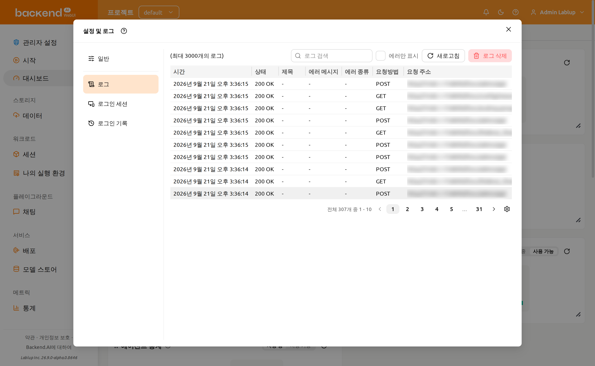

:::note
로그인된 페이지가 하나만 존재할 경우, **새로고침** 버튼을 클릭하면 제대로
작동하지 않는 것처럼 보일 수 있습니다. 로그 페이지는 서버에 대한 요청과 서버의
응답을 모아둔 것이며, 현재 페이지가 로그 페이지인 경우 명시적으로 페이지를 새로
고침하는 것 외에는 서버에 요청을 보내지 않습니다. 로그가 제대로 쌓이는지
확인하려면 다른 페이지를 열고 **새로고침** 버튼을 클릭하십시오.
:::

특정 열을 숨기거나 보이게 하려면, 테이블 우측 하단의 기어 아이콘을 클릭하십시오.
그러면 아래와 같은 다이얼로그가 나타나며, 보고 싶은 열을 선택할 수 있습니다.

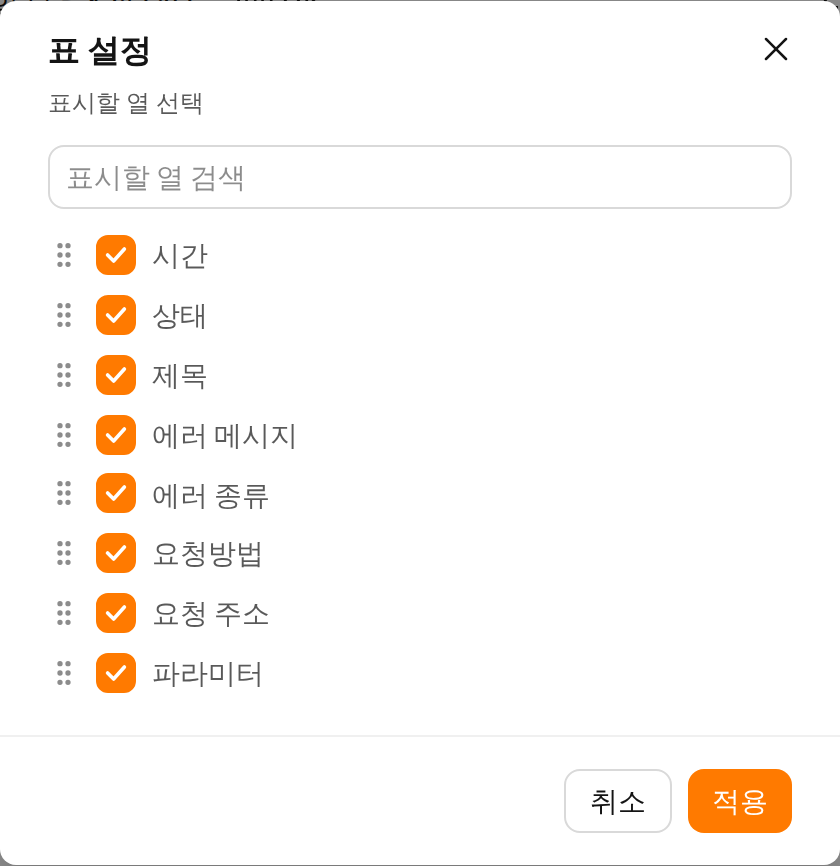

## 로그인 세션 탭

로그인 세션 탭에는 현재 내 계정에 연결된 로그인 세션이 표시됩니다. Backend.AI에
로그인되어 있는 각 위치마다 하나의 항목이 표시되므로, 내 계정이 어디에서
사용되고 있는지 확인하고 더 이상 필요하지 않은 세션을 로그아웃시킬 수 있습니다.

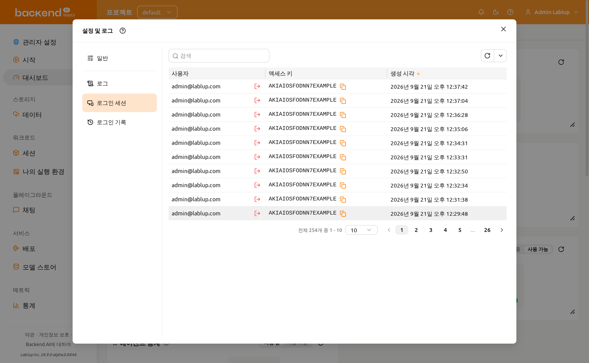

테이블에는 다음 열이 포함됩니다:

- **사용자**: 해당 로그인 세션을 소유한 계정의 이메일 주소입니다.
- **액세스 키**: 로그인 세션이 인증에 사용하는 액세스 키입니다. 복사 아이콘을
  클릭하면 액세스 키를 복사할 수 있습니다.
- **생성 시각**: 로그인 세션이 생성된 시점입니다. 열 머리글을 클릭하면 이 열을
  기준으로 정렬할 수 있습니다.

### 로그인 세션 필터링

테이블 위의 필터를 사용하여 목록을 좁힐 수 있습니다:

- **액세스 키**: 입력한 문자열이 액세스 키에 포함된 로그인 세션만 표시합니다.
- **생성 시각**: 선택한 날짜와 시간 이후 (또는 이전) 에 생성된 로그인 세션만
  표시합니다.

테이블 아래의 페이지네이션 컨트롤을 사용하여 페이지를 이동하거나 한 페이지에
표시할 행 수를 변경할 수 있습니다.

### 로그인 세션 해지

각 행에는 **사용자** 열의 이메일 주소 옆에 **세션 해지** 작업이 제공됩니다.

1. 종료하려는 행의 **세션 해지**를 클릭합니다
2. 해당 로그인 세션의 액세스 키가 표시된 확인 창의 내용을 확인합니다
3. **해지**를 클릭합니다

목록이 새로 고쳐지고 *"로그인 세션을 해지했습니다."* 메시지가 표시됩니다. 로그인
세션을 해지할 수 없는 경우에는 *"로그인 세션 해지에 실패했습니다."* 메시지가
표시됩니다.

:::warning
로그인 세션을 해지하면 해당 세션은 즉시 로그아웃됩니다. 현재 사용 중인 로그인
세션을 해지한 경우에는 다시 로그인해야 합니다.
:::

### 목록 새로고침

테이블 위의 새로고침 버튼을 클릭하면 목록을 즉시 다시 불러옵니다. 옆의 화살표를
클릭하면 **자동 새로고침** 메뉴가 열리며, 목록이 자동으로 갱신되는 주기를 선택할
수 있습니다:

- **끄기** (초기 설정)
- **5초**, **10초**, **15초**, **30초**, **60초**

자동 새로고침이 켜져 있으면 선택한 주기가 버튼에 표시되고, 다음 갱신 시점이
가까워질수록 버튼 테두리가 채워집니다. 선택한 주기는 이 목록에 대해 저장되어
다음에 탭을 열 때도 그대로 적용됩니다. WebUI의 각 목록은 저마다 별도의 주기를
유지하므로, 여기에서 자동 새로고침을 켜도 다른 페이지에는 영향을 주지 않습니다.

## 로그인 기록 탭

로그인 기록 탭에는 내 계정에 대해 기록된 로그인 시도가 표시됩니다. 로그인 성공,
로그인 실패는 물론 로그아웃이나 만료와 같은 로그인 세션 관련 이벤트도 함께
표시됩니다. 이 탭은 조회 전용이며 행에 대한 별도의 작업은 없습니다.

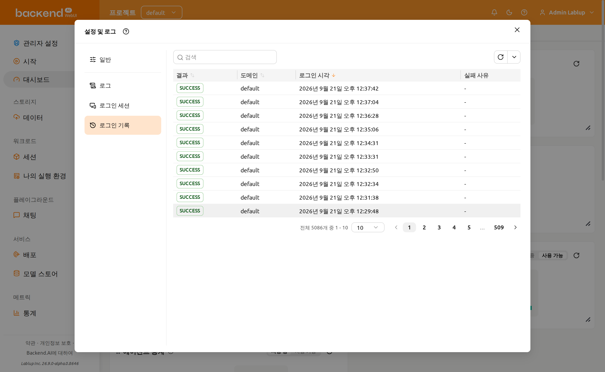

테이블에는 다음 열이 포함됩니다:

- **결과**: 로그인 시도의 결과로, 색상으로 구분된 태그로 표시됩니다. 이 열을
  기준으로 정렬할 수 있습니다.
- **도메인**: 로그인을 시도한 도메인입니다. 이 열을 기준으로 정렬할 수 있습니다.
- **로그인 시각**: 로그인 시도가 기록된 시점입니다. 이 열을 기준으로 정렬할 수
  있습니다.
- **실패 사유**: 실패한 시도에 대해 추가로 보고된 상세 내용입니다. 해당 내용이
  없으면 `-` 로 표시됩니다.

:::note
결과 값은 서버가 보고한 그대로 (예: `SUCCESS`, `FAILED_INVALID_CREDENTIALS`)
표시되며 번역되지 않습니다.
:::

### 결과 값

| 결과 | 색상 | 의미 |
|--------|-------|---------|
| SUCCESS | 초록색 | 로그인에 성공했습니다 |
| FAILED_INVALID_CREDENTIALS | 빨간색 | 이메일 주소 또는 비밀번호가 올바르지 않습니다 |
| FAILED_USER_INACTIVE | 빨간색 | 계정이 활성 상태가 아닙니다 |
| FAILED_BLOCKED | 빨간색 | 로그인이 차단되었습니다 |
| FAILED_PASSWORD_EXPIRED | 빨간색 | 계정 비밀번호가 만료되었습니다 |
| FAILED_REJECTED_BY_HOOK | 빨간색 | 서버 측 훅에 의해 로그인이 거부되었습니다 |
| FAILED_SESSION_ALREADY_EXISTS | 빨간색 | 해당 계정의 로그인 세션이 이미 존재합니다 |
| LOGOUT | 회색 | 로그아웃하여 로그인 세션이 종료되었습니다 |
| REVOKED_BY_ADMIN | 노란색 | 관리자가 로그인 세션을 해지했습니다 |
| REVOKED_BY_USER | 회색 | 사용자가 직접 로그인 세션을 해지했습니다 |
| EVICTED | 노란색 | 서버가 로그인 세션을 정리했습니다 |
| EXPIRED | 회색 | 로그인 세션이 만료되었습니다 |

### 로그인 기록 필터링

테이블 위의 필터를 사용하여 목록을 좁힐 수 있습니다:

- **결과**: 위 결과 값 목록에서 선택한 결과의 항목만 표시합니다.
- **도메인**: 입력한 문자열이 도메인에 포함된 항목만 표시합니다.
- **로그인 시각**: 선택한 날짜와 시간 이후 (또는 이전) 에 기록된 항목만
  표시합니다.

테이블 아래의 페이지네이션 컨트롤을 사용하여 페이지를 이동하거나 한 페이지에
표시할 행 수를 변경할 수 있습니다.

새로고침 버튼과 자동 새로고침 주기 메뉴는 로그인 세션 탭과 동일하게 동작합니다.
자세한 내용은 [목록 새로고침](#auto-refresh-interval) 섹션을 참고하세요. 이
목록은 로그인 세션 목록과 별개로 자체 주기를 유지합니다.
