# 데이터 & 폴더 활용하기


Backend.AI는 사용자의 파일을 안전하게 보관할 수 있도록 전용 저장소를 제공합니다. 연산 세션이 종료되면 세션 내에서 생성된 모든 파일과 디렉터리가 삭제되기 때문에, 중요한 데이터는 반드시 스토리지 폴더에 저장하는 것이 좋습니다. 스토리지 폴더 목록은 사이드바의 데이터 페이지에서 확인할 수 있습니다. 이 목록에서는 폴더 이름과 ID, 폴더가 위치한 NFS 호스트(위치), 폴더의 접근 권한(권한) 등 주요 정보를 확인할 수 있습니다.


스토리지 폴더에는 `사용자`와 `프로젝트` 두 가지 유형이 있습니다. '종류' 열에서 구분할 수 있습니다.

사용자 폴더는 일반 사용자가 직접 생성하여 개인적으로 사용하는 폴더입니다. 프로젝트 폴더는 도메인 관리자가 프로젝트별로 생성하는 폴더입니다. 일반 사용자는 프로젝트 폴더를 직접 생성할 수 없으며, 관리자가 생성한 프로젝트 폴더만 사용할 수 있습니다.

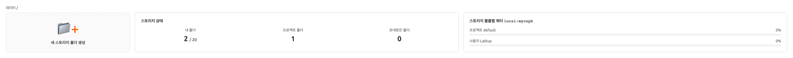

저장소 상태와 스토리지 볼륨별 가용량은 아래의 정보를 표시합니다.

- 저장소 상태
    - 생성된 폴더: 사용자가 생성한 폴더 개수.

         - 생성 제한: 사용자가 현재 만들 수 있는 최대 폴더 수. 이 값은 사용자에게 적용된 자원 정책에 따라 다르며 자원 정책을 변경하지 않고는 변경할 수 없음. 사용자가 생성하지 않은 폴더(예: 공유하도록 초대된 폴더 또는 프로젝트 폴더)는 계산에 포함되지 않음.

    * 프로젝트 폴더: 사용자가 생성한 프로젝트 폴더 수.
    * 초대된 폴더: 다른 사용자가 초대를 통해 공유한 폴더 수.
- 저장소 볼륨별 가용량
    * 호스트: 스토리지 호스트의 이름.
    * 프로젝트: 현재 프로젝트의 폴더 사용량 / 현재 프로젝트의 폴더 가용량.
    * 사용자: 현재 사용자의 폴더 사용량 / 현재 사용자의 폴더 가용량.


:::info
쿼터는 쿼터 설정을 제공하는 스토리지에서만 사용할 수 있습니다
(예: XFS, CephFS, NetApp, Purestorage 등). 쿼터 설정에 대한 자세한 내용은
[쿼터 설정 패널](#quota-setting-panel) 섹션을 참고하세요.
:::

<a id="create-storage-folder"></a>
<a id="create_storage_folder"></a>

## 스토리지 폴더 생성


새 폴더를 만들려면 데이터 페이지에서 '폴더 생성'을 클릭합니다. 생성 대화 상자의 필드를 다음과 같이 채웁니다.

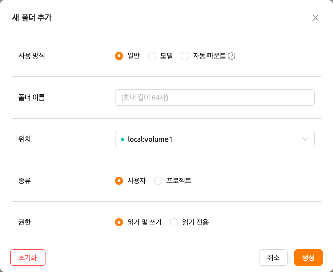

생성 대화 상자의 각 필드 의미는 다음과 같습니다.

- 사용 방식: 폴더의 용도를 설정합니다.

   * 일반: 다양한 데이터를 범용 목적으로 저장하는 폴더입니다.
   * 모델: 모델 서빙 및 관리에 특화된 폴더입니다. 이 모드를 선택하면 폴더 복제 가능 여부를 설정할 수 있습니다.
   * 자동 마운트(Auto Mount): 연산 세션을 만들 때 자동으로 마운트되는 폴더입니다. 이름은 반드시 점('.')으로 시작해야 합니다.

- 폴더 이름: 폴더명을 입력합니다 (최대 64자).
- 위치: 폴더를 생성할 NFS 호스트를 선택합니다. 여러 호스트가 있을 경우 각각의 사용 가능 용량을 확인한 후 적절한 호스트를 선택하세요.
- 종류: 생성할 폴더 유형을 결정합니다. 사용자(User) 또는 프로젝트(Project)로 설정할 수 있습니다. 사용자 폴더는 사용자가 단독으로 생성하여 사용할 수 있는 폴더이며, 프로젝트 폴더는 관리자가 생성하고 프로젝트의 사용자가 공유하는 폴더입니다.
- 프로젝트: 프로젝트 타입을 선택한 경우에만 표시됩니다. 새 프로젝트 폴더를 만들 때 폴더가 속한 프로젝트를 지정할 수 있습니다. 프로젝트 폴더는 반드시 프로젝트에 속해야 하지만, 사용자 폴더를 생성할 때에는 별도의 역할을 수행하지 않습니다.
- 권한: 프로젝트 멤버에 대한 프로젝트 폴더의 권한을 설정합니다. "Read-Only"로 설정된 경우, 프로젝트 멤버가 연산 세션 내에서 이 폴더에 쓰기 작업을 수행할 수 없습니다.
- 복제 가능 여부: 사용 방식이 "모델"로 설정된 경우에만 표시됩니다. 생성하는 가상 폴더(vfolder)가 복제 가능한지 여부를 선택합니다.

여기서 생성한 폴더는 연산 세션 생성 시 [마운트](../mount_vfolder/mount_vfolder.md#session-mounts)할 수 있습니다. 폴더는 사용자의 기본 작업 디렉토리인 `/home/work/` 아래에 마운트되며, 마운트된 디렉토리에 저장된 파일은 연산 세션이 종료되어도 삭제되지 않습니다.
(폴더를 삭제하면 파일도 함께 삭제됩니다.)

<a id="explore-folder"></a>

## 폴더 내용 조회하기


폴더 이름을 클릭하여 해당 폴더의 내용을 조회할 수 있는 파일 탐색기를 띄울 수 있습니다.


내부에 디렉토리와 파일이 존재하는 것을 확인할 수 있습니다. Name 열에 있는 디렉토리 이름을 클릭하면 해당 디렉토리로 이동할 수 있습니다. Actions 열의 다운로드 버튼이나 삭제 버튼을 클릭하여 파일을 다운로드하거나 디렉토리에서 완전히 삭제할 수 있습니다. 파일이나 디렉토리의 이름을 변경하는 것도 가능합니다. 보다 세밀한 파일 작업이 필요하다면, 이 폴더를 연산 세션 생성 시 마운트한 뒤 터미널이나 Jupyter Notebook 등과 같은 서비스를 활용하여 수행할 수 있습니다.

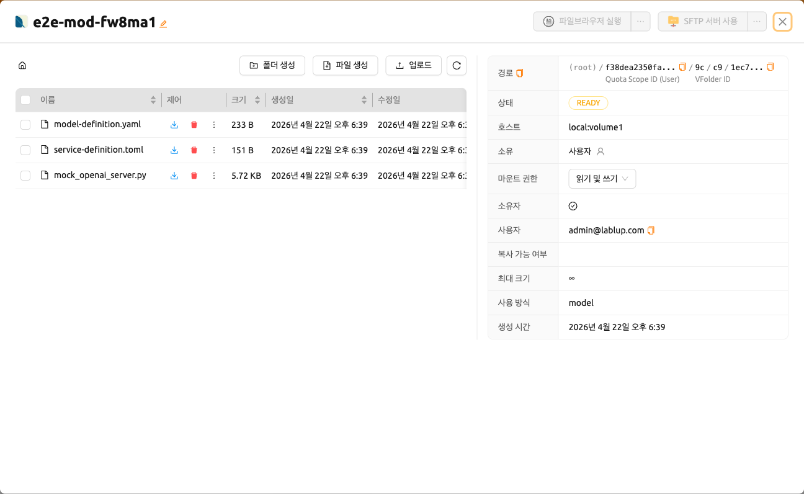

'만들기' 버튼으로 현재 경로에 새로운 폴더를 생성할 수 있으며, '업로드' 버튼으로 현재 경로에 로컬 파일 혹은 폴더를 업로드할 수도 있습니다. 이러한 파일 작업은 앞서 설명한 연산 세션 마운트 방식으로도 모두 수행 가능합니다.

폴더 내 파일 또는 디렉토리의 최대 이름 길이는 호스트 파일 시스템에 따라 달라질 수 있습니다. 일반적으로 255자를 초과할 수 없습니다.


:::info
원활한 성능 유지를 위해, 너무 많은 파일이 포함된 디렉토리에서는 화면에 표시되는 파일 수에 제한이 있습니다. 파일이 많은 폴더의 경우, 일부 파일이 화면에 보이지 않을 수 있습니다. 이 경우 터미널이나 기타 앱을 이용해 해당 디렉토리의 모든 파일을 확인해 주세요.
:::

### 텍스트 파일 편집

폴더 탐색기에서 텍스트 파일을 직접 편집할 수 있습니다. 폴더 이름을 클릭하여 파일 탐색기를 연 다음, 텍스트 파일의 제어 열에서 '파일 편집' 버튼을 클릭합니다.

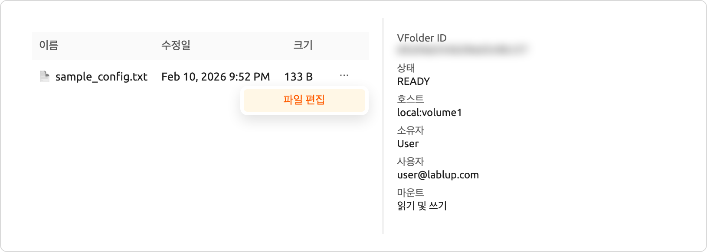

텍스트 파일 편집기가 코드 편집기 인터페이스와 함께 모달로 열립니다. 편집기는 파일 확장자를 기반으로 파일 유형을 자동으로 감지하고 적절한 구문 강조를 적용합니다(예: Python, JavaScript, Markdown). 모달 제목에는 파일 이름과 크기가 표시됩니다.

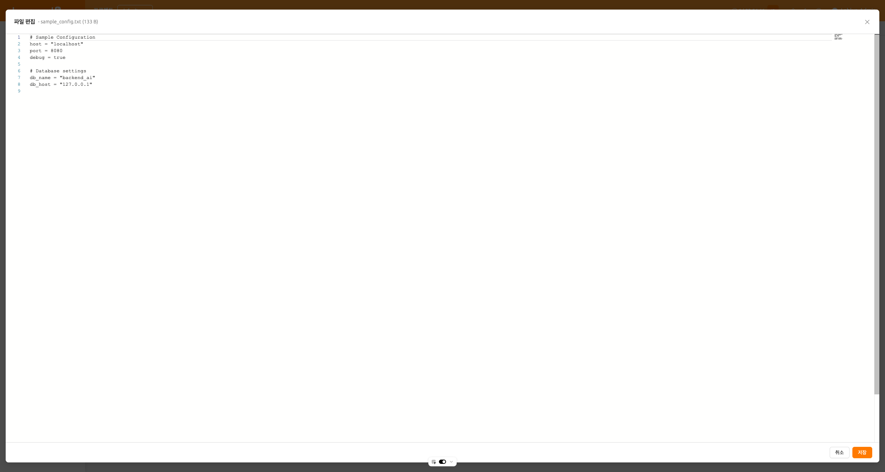

편집기는 UI 환경 설정과 일치하는 라이트 및 다크 테마를 모두 지원합니다. 파일 내용을 편집한 후 '저장'을 클릭하여 수정된 파일을 업로드하거나, '취소'를 클릭하여 변경 사항을 취소할 수 있습니다.

:::info
파일 편집 버튼은 스토리지 폴더에 대한 write_content 권한이 있는 경우에만 사용할 수 있습니다. 파일 로드에 실패하면 오류 메시지가 표시됩니다.
:::

## 폴더 이름 변경


스토리지 폴더의 이름을 변경할 수 있는 권한을 가지고 있는 경우, 폴더 이름 옆의 수정 버튼을 클릭하여 이름 변경 작업을 수행할 수 있습니다.

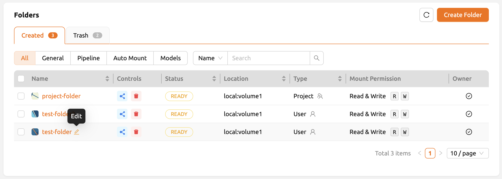


## 폴더 삭제하기


스토리지 폴더를 삭제할 수 있는 권한을 가지고 있는 경우, 제어 열의 '휴지통' 아이콘을 클릭하여 폴더를 '휴지통' 탭으로 이동시킬 수 있습니다. 휴지통 탭으로 이동된 폴더는 삭제 대기(delete-pending) 상태로 표시됩니다.

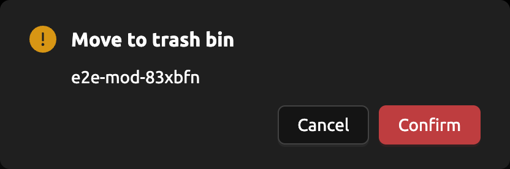

이 상태에서 제어 열의 복원 버튼을 클릭하면 폴더를 복원할 수 있습니다. 폴더를 영구적으로 삭제하려면 같은 열의 '휴지통' 버튼을 클릭합니다.

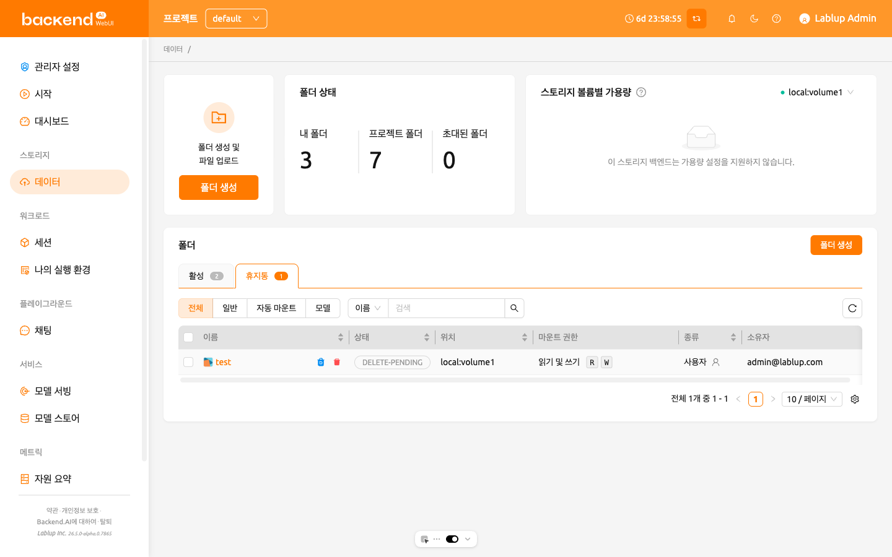

`삭제할 폴더 이름을 입력하세요`라는 입력 필드를 포함한 확인 모달이 나타납니다. 삭제하려는 폴더 이름을 정확하게 입력한 후, 빨간색 '영구 삭제' 버튼을 클릭하여 폴더를 완전히 삭제할 수 있습니다.

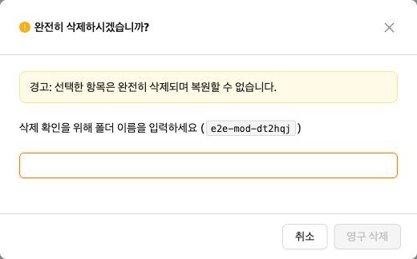

## 파일 브라우저 사용하기


Backend.AI는 20.09 버전부터 [FileBrowser](https://filebrowser.org)를 지원합니다. FileBrowser는 웹 브라우저를 통해 원격 서버의 파일을 관리할 수 있도록 도와주는 프로그램입니다. 특히 사용자의 로컬 머신에서 디렉토리를 업로드할 때 유용합니다.

현재 Backend.AI에서는 FileBrowser를 연산 세션 내에서 실행되는 애플리케이션 형태로 제공합니다. 따라서, 다음과 같은 최소 조건이 필요합니다.

- 최소 1개 이상의 연산 세션을 생성할 수 있어야 합니다.
- 최소 CPU 1 core, 메모리 512 MB 이상의 여유 자원이 있어야 합니다.
- FileBrowser를 지원하는 이미지가 설치되어 있어야 합니다.

FileBrowser는 두 가지 방법으로 사용할 수 있습니다.

- 데이터 폴더의 파일 탐색기 대화 상자에서 FileBrowser를 실행합니다.
- 세션 페이지에서 FileBrowser 이미지로 연산 세션을 직접 생성합니다.


### 폴더 탐색기에서 FileBrowser 실행

데이터 페이지로 이동한 후 원하는 데이터 폴더의 탐색기 대화 상자를 엽니다. 폴더 이름을 클릭하여 파일 탐색기를 엽니다.


탐색기 우측 상단의 '파일브라우저 실행' 버튼을 클릭합니다.


FileBrowser가 새 창에서 열린 것을 확인할 수 있습니다. 탐색기를 열었던 데이터 폴더가 FileBrowser의 루트 디렉토리가 됩니다. FileBrowser 창에서 디렉토리와 파일을 자유롭게 업로드하고, 수정하고, 삭제할 수 있습니다.


사용자가 '파일브라우저 실행' 버튼을 클릭하면, Backend.AI는 자동으로 FileBrowser 전용 연산 세션을 하나 생성합니다. 따라서 세션 페이지에서 FileBrowser 연산 세션이 조회되는 것을 확인할 수 있습니다. 이 연산 세션을 삭제하는 것은 사용자의 몫입니다.

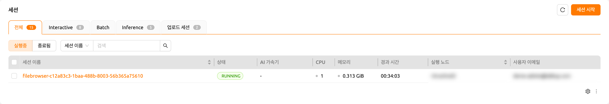

:::info
FileBrowser 창을 실수로 종료하여 다시 열고자 한다면, 세션 페이지로 가서 해당
FileBrowser 연산 세션의 애플리케이션 버튼을 클릭하면 됩니다.

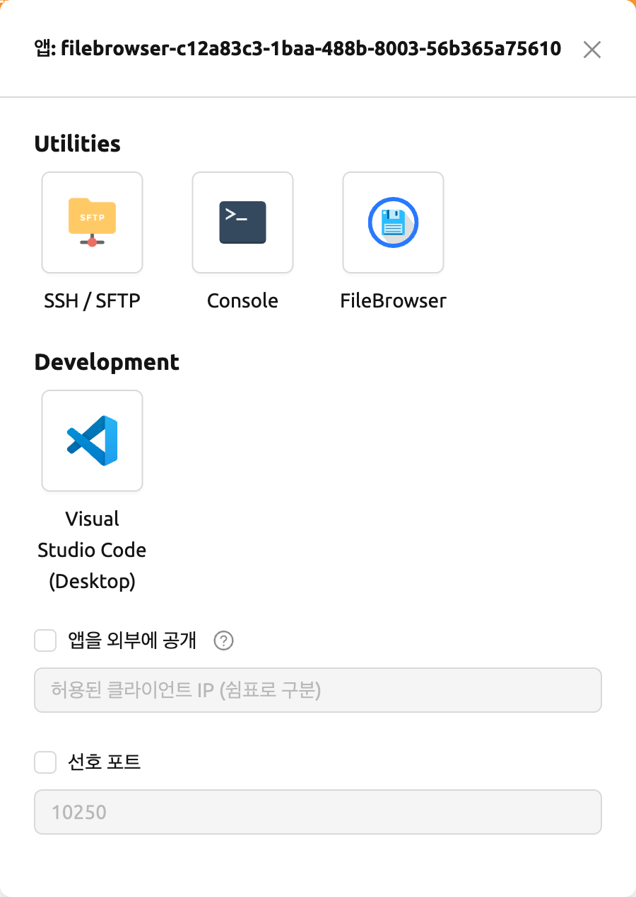

탐색기에서 '파일브라우저 실행' 버튼을 다시 클릭하면 새로운 연산 세션이 생성되어
총 두 개의 FileBrowser 세션이 나타나게 됩니다.
:::

### FileBrowser 이미지로 연산 세션 생성하기

FileBrowser를 지원하는 이미지를 선택하여 연산 세션을 직접 생성할 수도 있습니다. 데이터 폴더에 접근하려면 최소 하나 이상의 데이터 폴더를 마운트해야 합니다. 아무 데이터 폴더를 마운트하지 않아도 FileBrowser 사용에는 문제가 없지만, 연산 세션이 종료되면 업로드하거나 수정한 모든 파일이 삭제됩니다.


:::info
FileBrowser의 루트 디렉토리는 `/home/work`입니다. 따라서 해당 연산 세션에
마운트된 모든 데이터 폴더에 접근할 수 있습니다.
:::

### FileBrowser 기본 사용법

여기에서는 Backend.AI에서의 FileBrowser 기본 사용법을 소개합니다. FileBrowser의 대부분의 조작은 직관적이지만, 보다 자세한 안내가 필요하다면 [FileBrowser 공식 문서](https://filebrowser.org)를 참고하세요.

**FileBrowser로 로컬 디렉토리 업로드하기**

FileBrowser는 로컬 디렉토리의 트리 구조를 그대로 유지하면서 업로드하는 기능을 지원합니다. FileBrowser 창 우측 상단의 업로드 버튼을 클릭한 후 Folder 버튼을 클릭합니다. 로컬 파일 탐색 대화 상자가 나타나면 업로드하려는 디렉토리를 선택합니다.


:::info
읽기 전용 폴더에 파일을 업로드하는 경우, FileBrowser가 서버 에러를 표시합니다.
:::


다음과 같은 구조를 가진 폴더를 업로드해 보겠습니다.

```shell
foo
+-- test
|   +-- test2.txt
+-- test.txt
```

`foo` 디렉토리를 선택하면 디렉토리가 정상적으로 업로드된 것을 확인할 수 있습니다.


드래그 앤 드롭으로 로컬 파일과 디렉토리를 업로드할 수도 있습니다.

**파일 또는 디렉토리를 다른 디렉토리로 이동하기**

FileBrowser에서 스토리지 폴더 내의 파일이나 디렉토리를 이동하는 것도 가능합니다. 다음 단계를 따라 파일이나 디렉토리를 이동할 수 있습니다.

1. FileBrowser에서 이동할 디렉토리 또는 파일을 선택합니다.


2. FileBrowser 우측 상단의 '화살표' 버튼을 클릭합니다.


3. 이동할 대상 위치를 선택합니다.

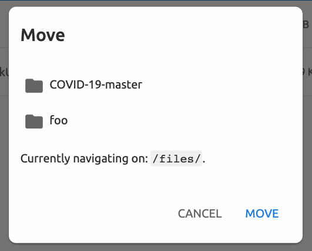

4. 'MOVE' 버튼을 클릭합니다.

이동 작업이 정상적으로 완료된 것을 확인할 수 있습니다.


:::info
현재 FileBrowser는 연산 세션 내의 애플리케이션으로 제공됩니다.
세션을 생성하지 않고 독립적으로 실행할 수 있도록 업데이트할 계획입니다.
:::

## SFTP 서버 사용하기


22.09 버전부터 Backend.AI는 데스크톱 앱과 웹 기반 WebUI 모두에서 SSH / SFTP 파일 업로드를 지원합니다. SFTP 서버를 사용하면 안정적인 데이터 스트림을 통해 파일을 빠르게 업로드할 수 있습니다.


:::info
시스템 설정에 따라, 파일 대화 상자에서 SFTP 서버를 실행하는 것이 허용되지
않을 수 있습니다.
:::

### 데이터 페이지의 폴더 탐색기에서 SFTP 서버 실행

데이터 페이지로 이동한 후 원하는 데이터 폴더의 파일 탐색기 대화 상자를 엽니다. 폴더 버튼 또는 폴더 이름을 클릭하여 파일 탐색기를 엽니다.

탐색기 우측 상단의 'SFTP 서버 사용' 버튼을 클릭합니다.


SSH / SFTP 연결 대화 상자가 나타납니다. 새로운 SFTP 세션이 자동으로 생성됩니다. (이 세션은 자원 점유에 영향을 주지 않습니다.)


연결을 위해 'SSH 키 다운로드' 버튼을 클릭하여 SSH 개인 키(`id_container`)를 다운로드합니다. 또한 호스트와 포트 번호를 기억해 두세요. 이후 대화 상자에 표시된 연결 예시 코드를 사용하여 세션에 파일을 복사하거나, 다음 가이드를 참고할 수 있습니다: [SFTP 연결 가이드](../sftp_to_container/sftp_to_container.md#for-linux-mac). 파일을 보존하려면 스토리지 폴더로 파일을 전송해야 합니다. 또한 일정 시간 동안 전송이 없으면 세션이 자동으로 종료됩니다.


:::info
SSH 키페어를 업로드하면 `id_container`가 사용자의 SSH 개인 키로 설정됩니다.
따라서 SSH를 통해 컨테이너에 연결할 때마다 키를 다운로드할 필요가 없습니다.
자세한 내용은 [사용자 SSH 키페어 관리](#user-ssh-keypair-management) 섹션을 참고하세요.
:::

## 폴더 카테고리


## 파이프라인 폴더

이 탭에는 FastTrack에서 파이프라인을 실행할 때 자동으로 생성되는 폴더 목록이 표시됩니다. 파이프라인이 생성되면 각 작업 인스턴스(연산 세션)에 대해 새로운 폴더가 생성되어 `/pipeline` 아래에 마운트됩니다.

<a id="automount-folder"></a>

## 자동 마운트 폴더


데이터 페이지에는 자동 마운트 폴더 탭이 있습니다. 이 탭을 클릭하면 이름이 점(`.`)으로 시작하는 폴더 목록을 확인할 수 있습니다. 폴더를 생성할 때 이름을 점(`.`)으로 시작하도록 지정하면, 폴더 탭이 아닌 자동 마운트 폴더 탭에 추가됩니다. 자동 마운트 폴더는 연산 세션 생성 시 수동으로 마운트하지 않아도 홈 디렉토리에 자동으로 마운트되는 특별한 폴더입니다. 이 기능을 활용하여 `.local`, `.linuxbrew`, `.pyenv` 등의 스토리지 폴더를 생성하고 사용하면, 연산 세션의 종류가 달라져도 변하지 않는 사용자 패키지나 환경을 구성할 수 있습니다.

자동 마운트 폴더의 사용법에 대한 자세한 내용은 [자동 마운트 폴더 사용 예시](#using-automount-folder) 섹션을 참고하세요.

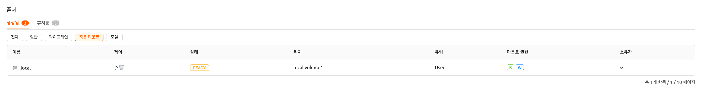

<a id="models"></a>

## 모델 폴더


모델 탭은 간편한 모델 서빙을 지원합니다. [모델 서빙](#model-serving)에 필요한 입력 데이터와 학습 데이터를 포함한 필요한 데이터를 모델 폴더에 저장할 수 있습니다.

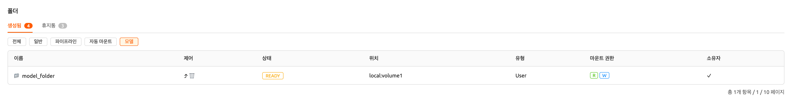
