<a id="admin-menus"></a>

# เมนูผู้ดูแลระบบ

Logging in with an ผู้ดูแลระบบ account will reveal an extra Administration menu on the bottom left of the sidebar.
User information registered in Backend.AI is listed in the Users tab.
super-ผู้ดูแลระบบ role ผู้ใช้ can see all ผู้ใช้s' information, create and deactivate a ผู้ใช้.

User ID (email), Name (ผู้ใช้name), Role and Description(User Description) can be filtered by typing text in the
search box on each column header.

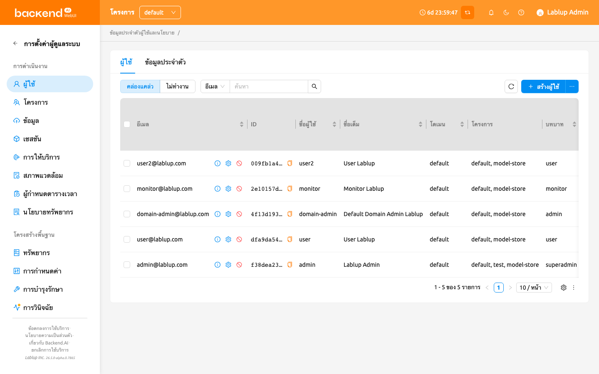

<a id="create-and-update-users"></a>

## สร้างและปรับปรุงผู้ใช้

A ผู้ใช้ can be created by clicking the '+Create User' button. Note that the password
must be longer or equal to 8 characters and at least 1 alphabet/special
character/ number should be included. The maximum length allowed for E-Mail and Username is 64.

หากผู้ใช้ที่มีอีเมลหรือชื่อผู้ใช้งานเดียวกันมีอยู่แล้ว จะไม่สามารถสร้างบัญชีผู้ใช้ได้ กรุณาลองใช้อีเมลและชื่อผู้ใช้งานอื่น

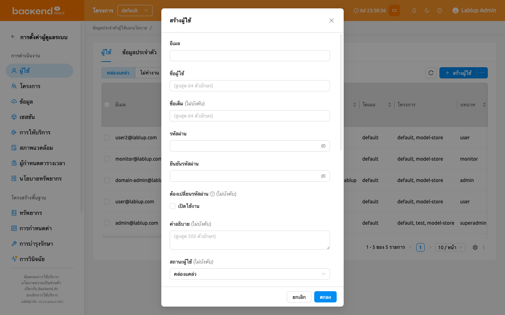

Check if the user is created.

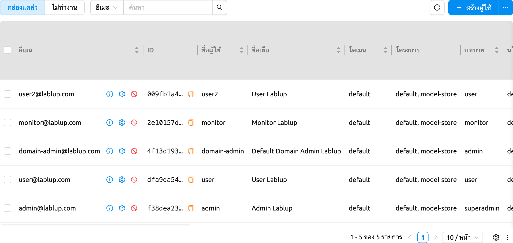

Click the green button in the Controls panel for more detailed user
information. You can also check the domain and project information where the
user belongs.

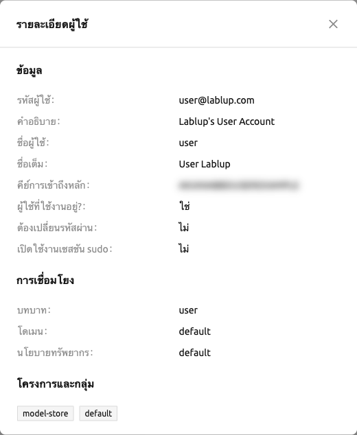

Click the 'Setting (Gear)' in the Controls panel to update information of a user who
already exists. User's name, password, activation state, etc. can be changed. User ID cannot be changed.

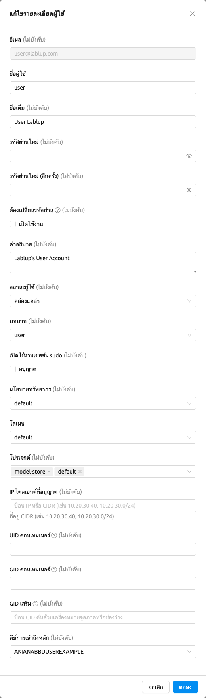

Each of the five items at the bottom of the dialog has the following functions.

- User Status: Indicates the user's status. Inactive users cannot log
  in. Before Verification is a status indicates that a user needs an additional
  step to activate the account such as email verification or an approval from an
  admin. Note that the inactive users are listed in the Inactive tab separately.

  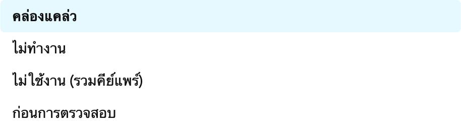

- Require password change?: If the admin has chosen random passwords while
  creating users in batches, this field can be set to ON to indicate that
  password change is required. The users will see the top bar that notify user
  to update their password, but this is a kind of descriptive flag which has no
  effect on actual use.
- Enable sudo session: Allow the user to use sudo in the compute session.
  This is useful when the user needs to install packages or run commands that
  require root privileges. However, it is not recommended to enable this option
  for all users, as it may cause security issues.
- 2FA Enabled: A flag indicating whether the user uses two-factor authentication.
  When using two-factor authentication, users are additionally required to enter an
  OTP code when logging in. Administrators can only disable two-factor authentication
  for other users.
- Resource Policy: From Backend.AI version 24.09, you can select the user resource policy
  to which the user belongs. For more information about user resource policies, please
  refer [user resource policy](#user-resource-policy) section.

<a id="inactivate-user-account"></a>

## Inactivate user account

Deleting user accounts is not allowed even for superadmins, to track usage
statistics per user, metric retention, and accidental account loss. Instead,
admins can inactivate user accounts to keep users from logging in. Click the
delete icon in the Controls panel. A popover asking confirmation appears, and
you can deactivate the user by clicking the Deactivate button.

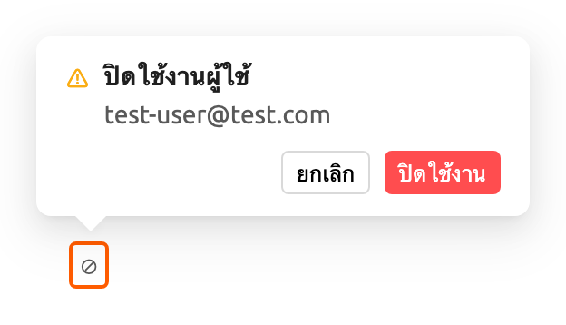

To re-activate users, go to Users - Inactive tab, and select the status of
the target user to `Active`.

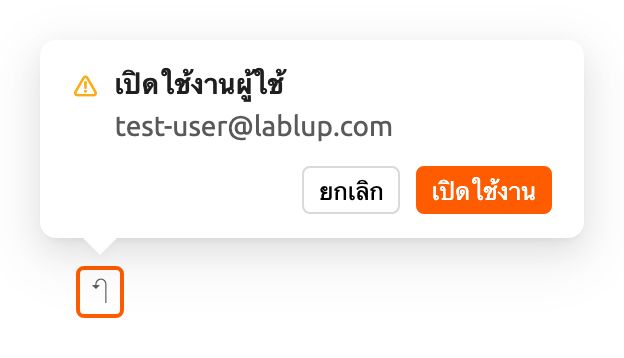

:::note
Please note that deactivating or reactivating the user does not change the user's credentials, since the user
account can have multiple keypairs, which brings it hard to decide which credential
should be reactivated.
:::

<a id="manage-users-keypairs"></a>

## Manage User's Keypairs

Each user account usually have one or more keypairs. A keypair is used for API
authentication to the Backend.AI server, after user logs in. Login requires
authentication via user email and password, but every request the user sends to
the server is authenticated based on the keypair.

A user can have multiple keypairs, but to reduce the user's burden of managing
keypairs, we are currently using only one of the user's keypairs to send requests.
Also, when you create a new user, a keypair is automatically created, so you do
not need to create and assign a keypair manually in most cases.

Keypairs can be listed on the Credentials tab of in the Users page. Active
keypairs are shown immediately, and to see the inactive keypairs, click the
Inactive panel at the bottom.

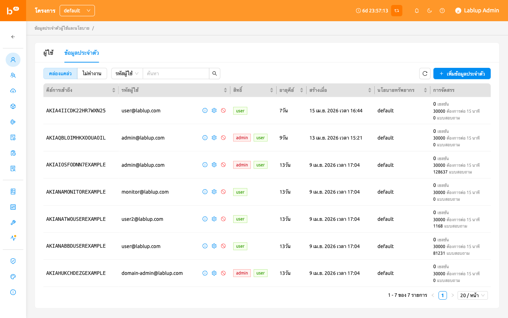

Like in Users tab, you can use the buttons in the Controls panel to view or
update keypair details. Click the green info icon button to see specific details of the keypair.
If necessary, you can copy the secret key by clicking the copy button.

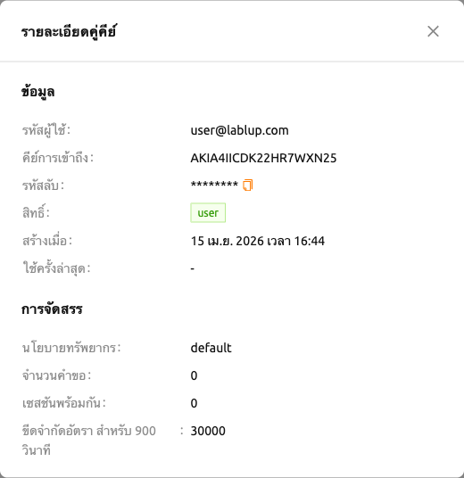

You can modify the resource policy and rate limit of the keypair by clicking the blue 'Setting (Gear)' button.
Please keep in mind that if the 'Rate Limit' value is small, API operations such as login may be blocked.

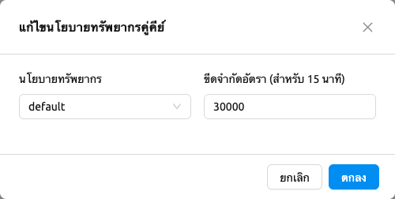

You can also deactivate or reactivate the keypair by clicking red 'Deactivate' button or black 'Activate' button in control column.
Unlike the User tab, the Inactive tab allows permanent deletion of key pairs.
However, you cannot permanently delete a key pair if it is currently being used as a user's main access key.

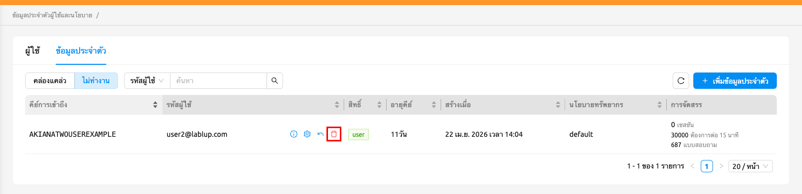

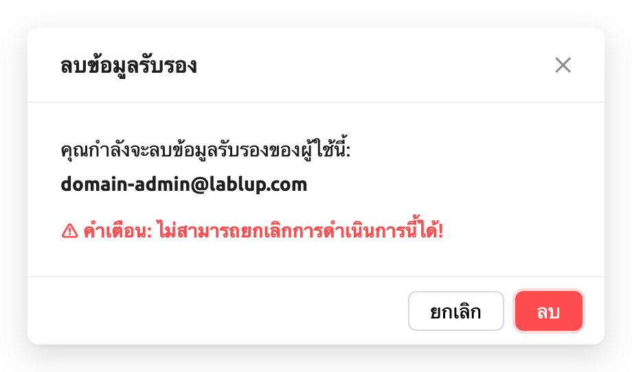

If you
accidentally deleted a keypair, you can re-create keypair for the user by
clicking the '+ ADD CREDENTIAL' button at the upper right corner.

The Rate Limit field is where you specify the maximum number of requests that
can be sent to the Backend.AI server in 15 minutes. For example, if set to 1000,
and the keypair sends more than 1000 API requests in 15 minutes, and the server
throws an error and does not accept the request. It is recommended to use the
default value and increase it when the API request frequency goes up high
according to the user's pattern.

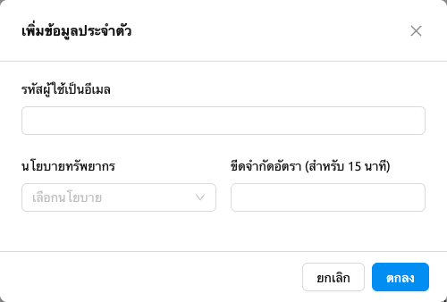

<a id="share-project-storage-folders-with-project-members"></a>

## Share project storage folders with project members

Backend.AI provides storage folders for projects, in addition to user's own
storage folder. A project storage folder is a folder belonging to a specific
project, not a specific user, and can be accessed by all users in that project.

:::note
Project folders can be created only by administrators. Normal users can only
access the contents of the project folder created by the administrator.
Depending on the system settings, project folders may not be allowed.
:::

First, log in with an admin account and create a project folder. After moving to
the Data page, click 'Create Folder' to open the folder creation dialog.
Enter the folder name, set the Type to Project. When the type is set to Project,
it will be automatically assigned to the project selected in the project selector in the header.
Permission is set to Read-Only.

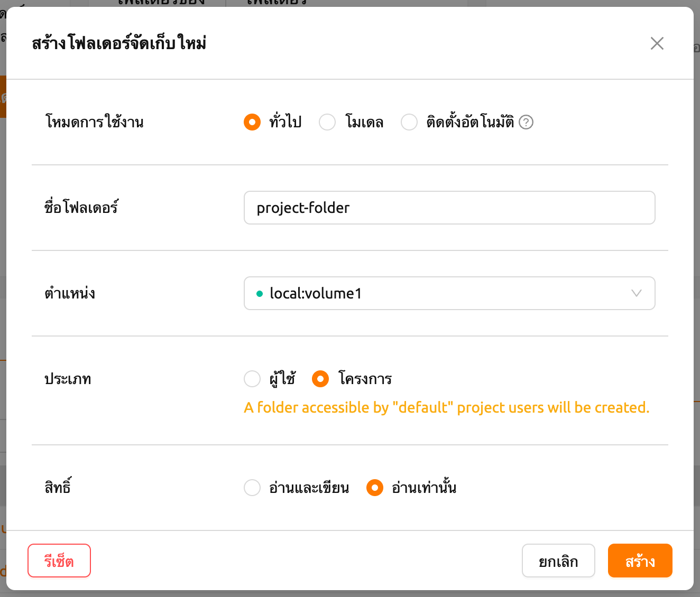

After confirming that the folder has been created, log in with the User B's
account and check that the project folder just created on the Data & Storage page
is displayed without any invitation procedure. You can see that R (Read Only) is
also displayed in the Permission panel.

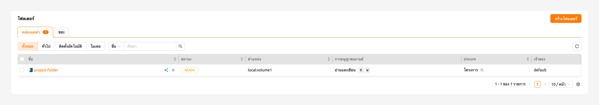

<a id="manage-models-cards"></a>

## จัดการการ์ดโมเดล

การ์ดโมเดลทั้งหมดในคลังโมเดลได้รับการจัดการโดยผู้ดูแลโปรเจกต์
หลังจากอัปโหลดคลังโมเดลพร้อมไฟล์ model-definition แล้ว
ผู้ใช้ทุกคนในโปรเจกต์สามารถเข้าถึงการ์ดโมเดลและโคลนได้หากจำเป็น

วิธีการดังต่อไปนี้คือการเพิ่มการ์ดโมเดลจาก Hugging Face

:::note
ก่อนที่จะสร้างการ์ดโมเดล จำเป็นต้องได้รับสิทธิ์การเข้าถึงโมเดลเฉพาะบน Hugging Face
สำหรับข้อมูลเพิ่มเติม โปรดดูที่ [Gated models](https://huggingface.co/docs/hub/models-gated)
:::

ขั้นแรก ตั้งค่าโปรเจกต์เป็น 'model-store'


ไปที่หน้าข้อมูลและคลิกปุ่ม 'สร้างโฟลเดอร์' ทางด้านขวา ใส่ชื่อโฟลเดอร์
และตั้งค่าการกำหนดค่าโฟลเดอร์ที่เหลือดังต่อไปนี้:

- โหมดการใช้งาน: Model
- ประเภท: project
- สิทธิ์: Read-Write
- โคลนได้: True

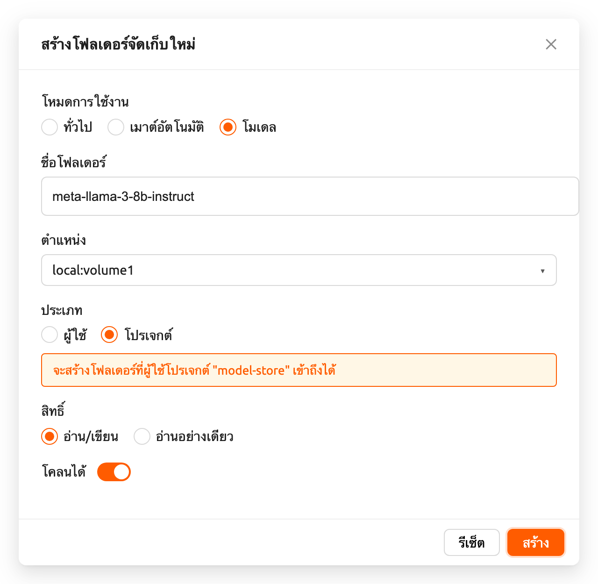

หลังจากสร้างโฟลเดอร์แล้ว คุณจะต้องตั้งค่าและอัปโหลดไฟล์ model-definition.yaml
ไปยังโฟลเดอร์ที่คุณเพิ่งสร้างขึ้น ต่อไปนี้คือตัวอย่างไฟล์ model-definition
หากคุณต้องการทราบวิธีการเขียนไฟล์ model-definition
โปรดดูที่ส่วน [คู่มือการกำหนดโมเดล](#model-definition-guide)

```yaml
models:
  - name: "Llama-3.1-8B-Instruct"
    model_path: "/models/Llama-3.1-8B-Instruct"
    service:
      pre_start_actions:
        - action: run_command
          args:
            command:
              - huggingface-cli
              - download
              - --local-dir
              - /models/Llama-3.1-8B-Instruct
              - --token
              - hf_****
              - meta-llama/Llama-3.1-8B-Instruct
          start_command:
            - /usr/bin/python
            - -m
            - vllm.entrypoints.openai.api_server
            - --model
            - /models/Llama-3.1-8B-Instruct
            - --served-model-name
            - Llama-3.1-8B-Instruct
            - --tensor-parallel-size
            - "1"
            - --host
            - "0.0.0.0"
            - --port
            - "8000"
            - --max-model-len
            - "4096"
      port: 8000
      health_check:
        path: /v1/models
        max_retries: 500
```

เมื่ออัปโหลดไฟล์ model-definition แล้ว การ์ดโมเดลจะปรากฏในหน้าคลังโมเดล


:::note
คุณจะต้องดาวน์โหลดโมเดลด้วยตนเองหลังจากตั้งค่าไฟล์ model-definition
สำหรับการดาวน์โหลดไฟล์โมเดลไปยังโฟลเดอร์
คุณสามารถเมาท์โฟลเดอร์โมเดลเมื่อสร้างเซสชันและดาวน์โหลดไฟล์ไปยังตำแหน่งนั้นโดยดูที่
[Downloading models](https://huggingface.co/docs/hub/models-downloading)
:::

การคลิกที่การ์ดโมเดลที่คุณเพิ่งสร้างจะแสดงรายละเอียดของไฟล์ model-definition ที่คุณอัปโหลด
ตอนนี้สมาชิกทุกคนในโปรเจกต์สามารถเข้าถึงการ์ดโมเดลและโคลนได้

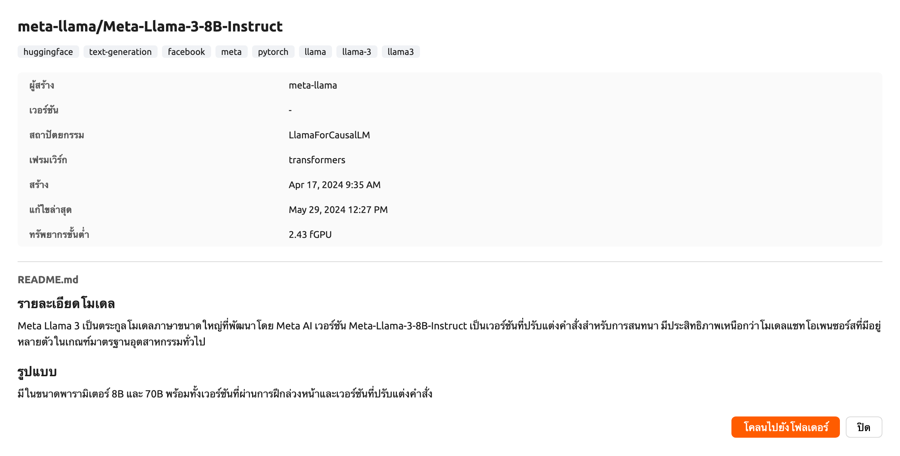

:::note
เพื่อเปิดใช้งานปุ่ม "เรียกใช้รุ่นนี้" บนโมเดลการ์ด ต้องมีทั้งไฟล์
`model-definition.yaml` และ `service-definition.toml` ในโฟลเดอร์ หากไฟล์
ใดไฟล์หนึ่งหายไป ปุ่มจะถูกปิดใช้งาน สำหรับรายละเอียดเกี่ยวกับการสร้าง
ไฟล์กำหนดบริการ โปรดดูที่หัวข้อ
[ไฟล์กำหนดบริการ](#service-definition-file)
ในเอกสาร การให้บริการโมเดล
:::

<a id="model-store-page"></a>

## หน้า Model Store

หน้า Model Store เป็นหน้าที่ผู้ใช้สามารถเรียกดูและใช้งานโมเดลที่ผู้ดูแลระบบได้กำหนดค่าไว้ล่วงหน้า เมื่อไปที่หน้า Model Store จากแถบด้านข้าง คุณจะเห็นโมเดลการ์ดทั้งหมดที่ลงทะเบียนในโปรเจกต์ Model Store

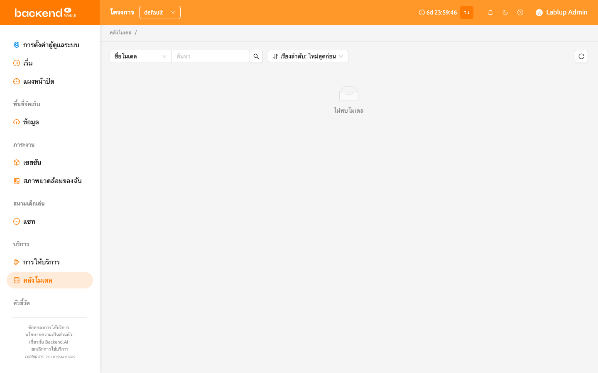

<!-- TODO: Capture screenshot of Model Store page showing model cards with buttons visible -->

โมเดลการ์ดแต่ละใบจะแสดงข้อมูลหลักดังนี้:

- ชื่อโมเดล (ชื่อโฟลเดอร์)
- เนื้อหา README (หากมีไฟล์ README ในโฟลเดอร์)
- เมตาดาต้าจากไฟล์ model-definition.yaml
- ปุ่มการดำเนินการสำหรับโต้ตอบกับโมเดล

คลิกที่โมเดลการ์ดเพื่อเปิดมุมมองรายละเอียดที่แสดงเนื้อหา README ทั้งหมดและการดำเนินการที่สามารถใช้ได้


<!-- TODO: Capture screenshot of model card detail view showing README content and buttons -->

<a id="clone-to-folder"></a>

### โคลนไปยังโฟลเดอร์

ปุ่ม "โคลนไปยังโฟลเดอร์" ช่วยให้คุณสร้างสำเนาส่วนตัวของโฟลเดอร์ Model Store เนื่องจากโฟลเดอร์ Model Store เป็นแบบอ่านอย่างเดียวและแชร์กันทั้งโปรเจกต์ คุณจึงต้องโคลนไปยังพื้นที่จัดเก็บของคุณเองเพื่อแก้ไขไฟล์หรือใช้ในเวิร์กโฟลว์ที่กำหนดเอง

ในการโคลนโฟลเดอร์โมเดล:

1. คลิกปุ่ม "โคลนไปยังโฟลเดอร์" บนโมเดลการ์ด
2. กำหนดค่าการตั้งค่าต่อไปนี้ในกล่องโต้ตอบการโคลน:
   - **ชื่อโฟลเดอร์**: ชื่อสำหรับโฟลเดอร์ที่โคลน (ค่าเริ่มต้นจะเพิ่มคำต่อท้ายแบบสุ่มต่อชื่อเดิม)
   - **สิทธิ์**: ตั้งค่าสิทธิ์การเข้าถึงสำหรับโฟลเดอร์ที่โคลน (อ่านอย่างเดียว หรือ อ่าน-เขียน)
   - **โหมดการใช้งาน**: เลือกประเภทโฟลเดอร์ (ทั่วไป, โมเดล หรือ ต่อเชื่อมอัตโนมัติ)
3. คลิกปุ่ม "โคลน" เพื่อเริ่มกระบวนการโคลน


<!-- TODO: Capture screenshot of clone folder dialog with field settings -->

:::note
ปัจจุบันการโคลนโฟลเดอร์รองรับเฉพาะภายในโฮสต์จัดเก็บเดียวกันเท่านั้น
:::

เมื่อการโคลนเสร็จสิ้น โฟลเดอร์ใหม่จะปรากฏในแท็บที่เกี่ยวข้องบนหน้าข้อมูล ตามโหมดการใช้งานที่เลือก

<a id="create-service-from-this-model"></a>

### สร้างบริการจากโมเดลนี้

ปุ่ม "เรียกใช้รุ่นนี้" ช่วยให้คุณสร้างบริการโมเดลได้โดยตรงจากโมเดลการ์ดด้วยการคลิกเพียงครั้งเดียว ฟีเจอร์นี้จะทำให้กระบวนการโคลนโฟลเดอร์โมเดลและสร้างเอ็นด์พอยท์ของบริการโมเดลเป็นไปโดยอัตโนมัติ

:::note
เพื่อเปิดใช้งานปุ่มนี้ ต้องเป็นไปตามเงื่อนไขต่อไปนี้:

- ต้องมีทั้งไฟล์ `model-definition.yaml` และ `service-definition.toml` ในโฟลเดอร์โมเดล หากไฟล์ใดไฟล์หนึ่งหายไป ปุ่มจะถูกปิดใช้งานและจะแสดงคำแนะนำเครื่องมือระบุว่าต้องการไฟล์ใด
- มีโควตาทรัพยากรเพียงพอสำหรับสร้างบริการโมเดล
- กลุ่มทรัพยากรอนุญาตประเภทเซสชันการอนุมาน
  :::

<a id="service-creation-workflow"></a>

#### เวิร์กโฟลว์การสร้างบริการ

เมื่อคุณคลิกปุ่ม "เรียกใช้รุ่นนี้" Backend.AI จะดำเนินตามเวิร์กโฟลว์ต่อไปนี้:

1. **ตรวจสอบไฟล์ที่จำเป็น**: ระบบจะตรวจสอบว่ามีทั้ง model-definition.yaml และ service-definition.toml อยู่ในโฟลเดอร์

2. **โคลนโฟลเดอร์ (หากจำเป็น)**: หากยังไม่มีสำเนาโคลนของโฟลเดอร์โมเดล:
   - จะมีกล่องโต้ตอบยืนยันถามว่าต้องการโคลนโฟลเดอร์หรือไม่
   - โฟลเดอร์จะถูกโคลนด้วยชื่อในรูปแบบ `{ชื่อเดิม}-{อักขระสุ่ม 4 ตัว}`
   - การแจ้งเตือนจะแสดงความคืบหน้าของการโคลน


<!-- TODO: Capture screenshot of clone confirmation dialog before service creation -->

3. **สร้างบริการ**: เมื่อโฟลเดอร์พร้อมแล้ว (จากการโคลนก่อนหน้าหรือการโคลนใหม่):
   - บริการจะถูกสร้างโดยอัตโนมัติโดยใช้การตั้งค่าจาก service-definition.toml
   - การแจ้งเตือนจะแสดงความคืบหน้าของการสร้างบริการ
   - คลิกการแจ้งเตือนเพื่อไปยังหน้าการให้บริการโมเดล


<!-- TODO: Capture screenshot of service creation progress notification -->

4. **ตรวจสอบรายละเอียดบริการ**: เมื่อสร้างเสร็จแล้ว ไปที่หน้าการให้บริการโมเดลเพื่อตรวจสอบรายละเอียดเอ็นด์พอยท์ ตรวจสอบสถานะบริการ และจัดการบริการ


<!-- TODO: Capture screenshot of completed service in Model Serving page -->

:::note
หากมีโฟลเดอร์ที่โคลนจากการดำเนินการก่อนหน้าอยู่แล้ว ระบบจะใช้โฟลเดอร์นั้น
โดยอัตโนมัติเพื่อสร้างบริการ ในรุ่นอนาคตจะสามารถเลือกได้ว่าจะใช้โฟลเดอร์
โคลนใดเมื่อมีสำเนาหลายรายการ
:::

<a id="troubleshooting"></a>

#### การแก้ไขปัญหา

หากการสร้างบริการล้มเหลว:

- ตรวจสอบว่ารูปแบบของ model-definition.yaml และ service-definition.toml ถูกต้อง
- ตรวจสอบว่าโควตาทรัพยากรอนุญาตให้สร้างบริการโมเดลใหม่
- ตรวจสอบข้อความข้อผิดพลาดในสถานะบริการบนหน้าการให้บริการโมเดล
- สำหรับขั้นตอนการแก้ไขปัญหาโดยละเอียด โปรดดูเอกสาร [การให้บริการโมเดล](#model-serving)

สำหรับข้อมูลเพิ่มเติมเกี่ยวกับบริการโมเดล การกำหนดค่าบริการ และการจัดการเอ็นด์พอยท์ โปรดดูเอกสาร [การให้บริการโมเดล](#model-serving)

<a id="manage-resource-policy"></a>

## Manage Resource Policies

<a id="keypair-resource-policy"></a>

#### Keypair Resource Policy

In Backend.AI, administrators have the ability to set limits on the total resources available for each keypair, user, and project.
Resource policies enable you to define the maximum allowed resources and other compute session-related settings.
Additionally, it is possible to create multiple resource policies for different needs,
such as user or research requirements, and apply them on an individual basis.

The Resource Policies page allows administrators to view a list of all registered resource policies.
Administrators can review the resource policies established for keypairs, users, and projects directly on this page.
Let's begin by examining the resource policies for keypairs. In the figure below, there are
three policies in total (gardener, student, default). The infinity symbol (∞)
indicates that no resource restrictions have been applied to those resources.

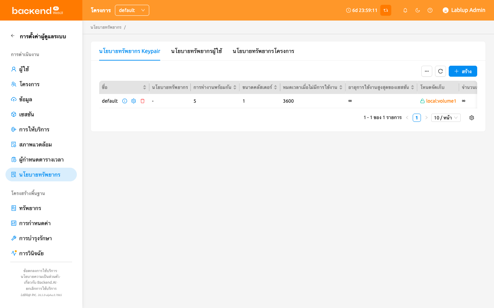

The user account being used in this guide is currently assigned to the default
resource policy. This can be verified in the Credentials tab on the Users page.
You can also confirm that all resource policies are set to default in the Resource Policies panel.

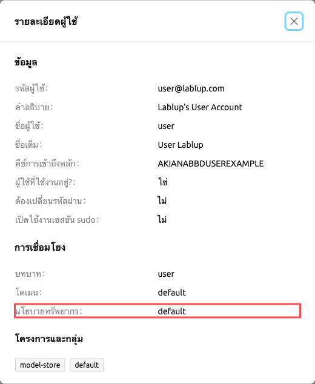

To modify resource policies, click the 'Setting (Gear)' in the Control column of the
default policy group. In the Update Resource Policy dialog, every option is
editable except for Policy Name, which serves as the primary key for
distinguishing resource policies in the list. Uncheck the Unlimited checkbox
at the bottom of CPU, RAM, and fGPU, and set the resource limits to the desired
values. Ensure that the allocated resources are less than the total hardware
capacity. In this case, set CPU, RAM, and fGPU to 2, 4, and 1 respectively.
Click the OK button to apply the updated resource policy.


About details of each option in resource policy dialog, see the description below.

- Resource Policy
  - CPU: Specify the maximum amount of CPU cores. (max value: 512)
  - Memory: Specify the maximum amount of memory in GB. It would be good practice
    to set memory twice as large as the maximum value of GPU memory. (max value: 1024)
  - CUDA-capable GPU: Specify the maximum amount of physical GPUs. If fractional GPU
    is enabled by the server, this setting has no effect. (max value: 64)
  - CUDA-capable GPU (fractional): Fractional GPU (fGPU) is literally split a single
    GPU to multiple partitions in order to use GPU efficiently. Notice that the minimum
    amount of fGPU required is differed by each image. If fractional GPU is not enabled
    by the server, this settings has no effect. (max value: 256)

- Sessions
  - Cluster Size: Set the maximum limit for the number of multi-containers or
    multi-nodes that can be configured when creating a session.
  - Session Lifetime (sec.): Limits the maximum lifetime of a compute session
    from the reservation in the active status, including `PENDING` and
    `RUNNING` statuses. After this time, the session will be force-terminated
    even if it is fully utilized. This will be useful to prevent the session
    from running indefinitely.
  - Max Pending Session Count: Maximum number of compute sessions that can be in
    the `PENDING` status simultaneously.
  - Concurrent Jobs: Maximum number of concurrent compute session per keypair.
    If this value is set to 3, for example, users bound to this resource policy
    cannot create more than 3 compute sessions simultaneously. (max value: 100)
  - Idle timeout (sec.): Configurable period of time during which the user can
    leave their session untouched. If there is no activity at all on a
    compute session for idle timeout, the session will be garbage collected
    and destroyed automatically. The criteria of the "idleness" can be
    various and set by the administrators. (max value: 15552000 (approx. 180 days))
  - Max Concurrent SFTP Sessions: Maximum number of concurrent SFTP sessions.

- Folders
  - Allowed hosts: Backend.AI supports many NFS mountpoint. This field limits
    the accessibility to them. Even if a NFS named "data-1" is mounted on
    Backend.AI, users cannot access it unless it is allowed by resource policy.
  - (Deprecated since 23.09.4) Max. #: the maximum number of storage folders that
    can be created/invited. (max value: 100).

In the keypair resource policy list, check that the Resources value of the default
policy has been updated.

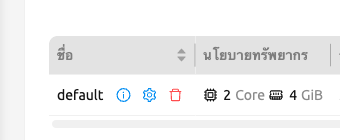

You can create a new resource policy by clicking the '+ Create' button. Each setting
value is the same as described above.

To create a resource policy and associate it with a keypair, go to the
Credentials tab of the Users page, click the gear button located in the
Controls column of the desired keypair, and click the Select Policy field to
choose it.

You can also delete each of resource keypairs by clicking trash can icon
in the Control column. When you click the icon, the confirmation popup will appears.
Click 'Delete' button to erase."

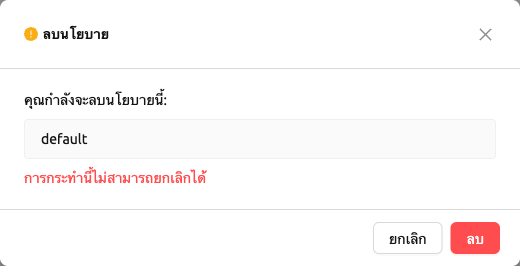

:::note
If there's any users (including inactive users) following a resource policy to be deleted,
deletion may not be done. Before deleting a resource policy, please make sure that
no users remain under the resource policy.
:::

If you want to hide or show specific columns, click the 'Setting (Gear)' at the bottom right of the
table. This will bring up a dialog where you can select the columns you want to display.

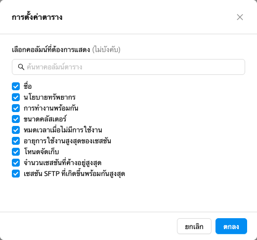

<a id="user-resource-policy"></a>

#### User Resource Policy

Starting from version 24.03, Backend.AI supports user resource policy management. While each
user can have multiple keypairs, a user can only have one user resource policy. In the user
resource policy page, users can set restrictions on various settings related to folders such as
Max Folder Count and Max Folder Size, as well as individual resource limits like Max Session
Count Per Model Session and Max Customized Image Count.

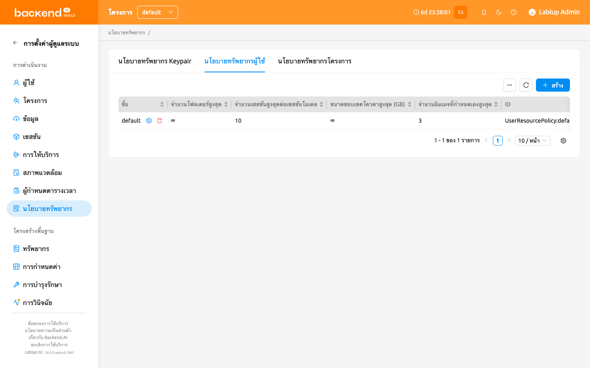

To create a new user resource policy, click the Create button.

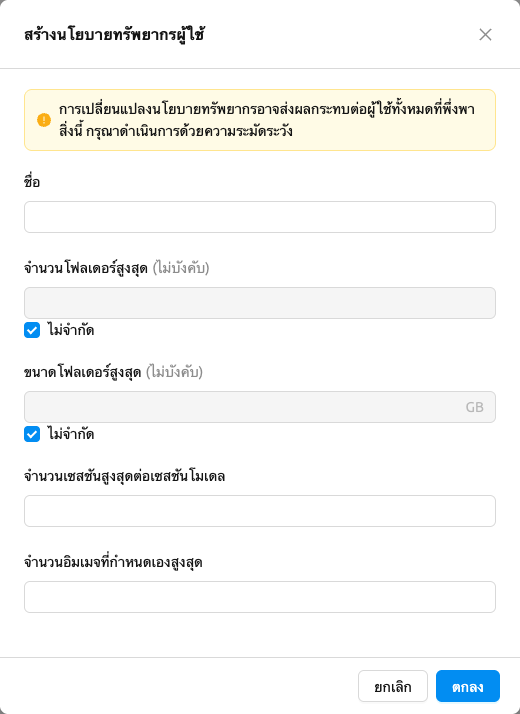

- Name: The name of the user resource policy.
- Max Folder Count: The maximum number of folders that the user can create.
  If the user's folder count exceeds this value, user cannot create a new folder.
  If set to Unlimited, it is displayed as "∞".
- Max Folder Size: The maximum size of the user's storage space. If
  user's storage space exceeds this value, user cannot create a new data
  folder. If set to Unlimited, it is displayed as "∞".
- Max Session Count Per Model Session: The maximum number of available sessions per model
  service created by a user. Increasing this value can put a heavy load on the session
  scheduler and potentially lead to system downtime, so please caution when
  adjusting this setting.
- Max Customized Image Count: The maximum number of customized images that
  user can create. If user's customized image count exceeds this value,
  user cannot create a new customized image. If you want to know more about customized
  images, please refer to the [My Environments](#my-environments) section.

To update, click the 'Setting (Gear)' button in the control column. To delete, click the trash can
button.

:::note
Changing a resource policy may affect all users who use that policy, so use
it with caution.
:::

Similar to keypair resource policy, users can select and display only columns users want by
clicking the 'Setting (Gear)' button at the bottom right of the table.

<a id="project-resource-policy"></a>

#### Project Resource Policy

Starting from version 24.03, Backend.AI supports project resource policy management. Project
resource policies manage storage space (quota) and folder-related limitations for projects.

When clicking the Project tab of the Resource Policies page, you can see the list of project
resource policy.

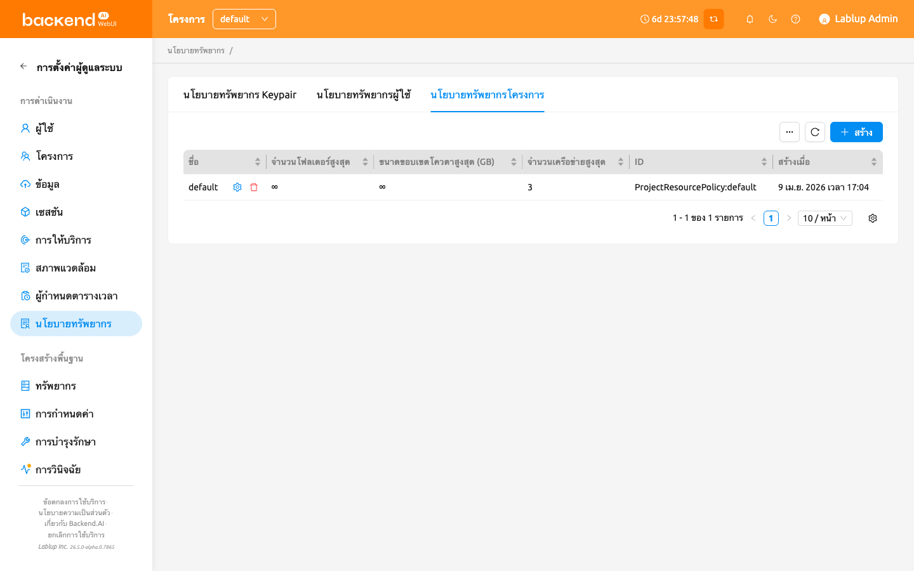

To create a new project resource policy, click the '+ Create' button at the top right of the table.

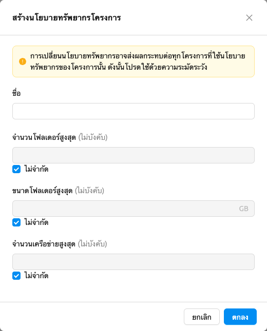

- Name: The name of the project resource policy.
- Max Folder Count: The maximum number of project folders that an administrator can create.
  If the project folder count exceeds this value, the administrator will not be able to create
  a new project folder. If set to Unlimited, it will be displayed as "∞".
- Max Folder Size: The maximum size of the project's storage space. If the project's storage
  space exceeds this value, the administrator cannot create a new project folder. If set to
  Unlimited, it is displayed as "∞".
- Max Network Count: The maximum number of networks that can be created for the project since Backend.AI version 24.12. If set to Unlimited, it is displayed as "∞".

The meaning of each field is similar to the user resource policy. The difference is that the
project resource policy is applied to the project folders, while the user resource policy is
applied to the user folders.

If you want to make changes, click the 'Setting (Gear)' button in the control column. Resource policy
names cannot be edited. Deletion can be done by clicking the trash can icon button.

:::note
Changing a resource policy may affect all users who use that policy,
so use it with caution.
:::

You can select and display only the columns you want by clicking the 'Setting (Gear)' button at the
bottom right of the table.

To save the current resource policy as a file, click on the 'Tools' menu located at the top left of each tab. Once you click the menu, download dialog will appear.

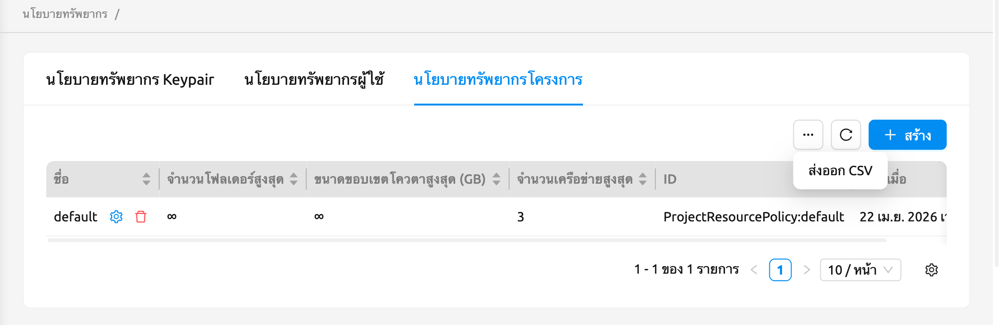

## มุมมองรวมสำหรับเซสชันที่รอดำเนินการ

ตั้งแต่ Backend.AI เวอร์ชัน 25.13.0 เป็นต้นไป มุมมองรวมสำหรับเซสชันที่รอดำเนินการจะพร้อมใช้งานในเมนูผู้ดูแลระบบ
หน้า Admin Session จะแสดงมุมมองรวมของเซสชันที่รอดำเนินการทั้งหมดภายใน
กลุ่มทรัพยากรที่เลือก หมายเลขดัชนีที่แสดงถัดจากสถานะจะระบุตำแหน่งในคิว
ที่เซสชันจะถูกสร้างเมื่อมีทรัพยากรเพียงพอ

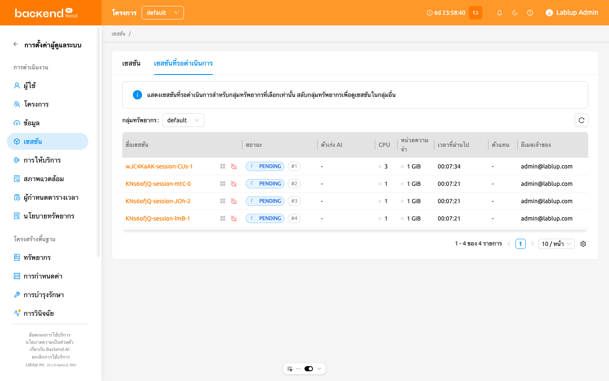

เช่นเดียวกับหน้า Session คุณสามารถคลิกชื่อเซสชันเพื่อเปิด drawer ที่แสดง
ข้อมูลรายละเอียดเกี่ยวกับเซสชันได้

<a id="manage-images"></a>

## ตัวจัดตาราง Fair Share

ตั้งแต่ Backend.AI core เวอร์ชัน 26.2.0 เป็นต้นไป หน้า Fair Share Scheduler จะพร้อมใช้งาน
ในเมนู Administration ฟีเจอร์นี้ช่วยให้ผู้ดูแลระบบสามารถจัดการน้ำหนักการจัดตาราง
Fair Share ตามโครงสร้างลำดับชั้นของกลุ่มทรัพยากร โดเมน โปรเจกต์ และผู้ใช้

การจัดตาราง Fair Share จะจัดสรรทรัพยากรการคำนวณโดยอิงจากรูปแบบการใช้งานในอดีต
เพื่อให้มั่นใจว่าทรัพยากรจะถูกกระจายอย่างเป็นธรรมในหมู่ผู้ใช้ ผู้ใช้ที่ใช้
ทรัพยากรน้อยในอดีตจะได้รับลำดับความสำคัญในการจัดตารางสูงกว่า ในขณะที่ผู้ใช้
ที่ใช้มากกว่าจะได้รับลำดับความสำคัญต่ำกว่า ผู้ดูแลระบบสามารถปรับแต่งพฤติกรรมนี้
ได้โดยการปรับน้ำหนักในแต่ละระดับของลำดับชั้น

:::note
Fair Share Scheduler จะพร้อมใช้งานเฉพาะเมื่อประเภทตัวจัดตารางของกลุ่มทรัพยากร
ถูกตั้งค่าเป็น `FAIR_SHARE` เท่านั้น สำหรับการกำหนดค่าประเภทตัวจัดตารางของ
กลุ่มทรัพยากร โปรดดูที่ส่วนจัดการกลุ่มทรัพยากร
:::

หากต้องการเข้าถึงฟีเจอร์นี้ ให้คลิกเมนู Scheduler ในส่วน Administration ของแถบด้านข้าง
หน้าจะแสดงแท็บการตั้งค่า Fair Share พร้อมอินเทอร์เฟซ drill-down 4 ขั้นตอน

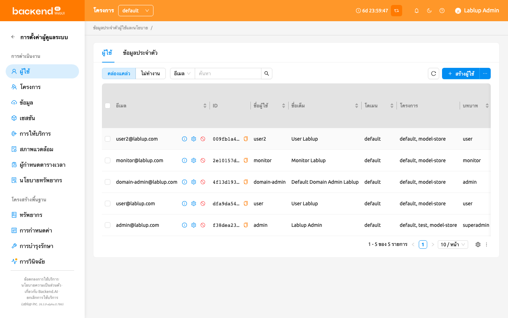

หน้าถูกจัดระเบียบเป็น 4 ขั้นตอนตามลำดับชั้น:

1. **กลุ่มทรัพยากร**: กำหนดค่าพารามิเตอร์หลักของ Fair Share สำหรับแต่ละกลุ่มทรัพยากร
2. **โดเมน**: ตั้งค่าน้ำหนักสำหรับโดเมนภายในกลุ่มทรัพยากร
3. **โปรเจกต์**: ตั้งค่าน้ำหนักสำหรับโปรเจกต์ภายในโดเมน
4. **ผู้ใช้**: ตั้งค่าน้ำหนักสำหรับผู้ใช้แต่ละคนภายในโปรเจกต์

แถบตัวบ่งชี้ขั้นตอนที่ด้านบนของหน้าจะแสดงตำแหน่งปัจจุบันในลำดับชั้น
ขั้นตอนที่เสร็จสิ้นจะแสดงชื่อของรายการที่เลือก คุณสามารถคลิกที่ขั้นตอนที่
เสร็จสิ้นเพื่อย้อนกลับไปยังระดับนั้นได้


หากกลุ่มทรัพยากรที่เลือกไม่ได้ตั้งค่าประเภทตัวจัดตารางเป็น `FAIR_SHARE`
จะมีการแจ้งเตือนเป็นคำเตือนว่า Fair Share Scheduler ไม่ได้เปิดใช้งานสำหรับ
กลุ่มทรัพยากรนั้น


ในแต่ละขั้นตอน ฟีเจอร์ทั่วไปต่อไปนี้พร้อมใช้งาน:

- **การกรอง**: ใช้ตัวกรองค้นหาตามคุณสมบัติเพื่อจำกัดผลลัพธ์ตามชื่อ ในขั้นตอนผู้ใช้ จะมีตัวกรองเพิ่มเติมสำหรับอีเมลและสถานะการใช้งาน
- **การเรียงลำดับ**: คลิกส่วนหัวคอลัมน์เพื่อเรียงลำดับตารางตามคอลัมน์นั้น
- **การแบ่งหน้า**: นำทางผ่านผลลัพธ์พร้อมขนาดหน้าที่กำหนดค่าได้
- **รีเฟรชอัตโนมัติ**: ข้อมูลจะรีเฟรชอัตโนมัติทุก 7 วินาที ปุ่มรีเฟรชด้วยตนเองก็พร้อมใช้งานเช่นกัน

### กลุ่มทรัพยากร

ขั้นตอนกลุ่มทรัพยากรจะแสดงตารางของกลุ่มทรัพยากรทั้งหมดพร้อมการกำหนดค่า
Fair Share


ตารางประกอบด้วยคอลัมน์ต่อไปนี้:

- **ชื่อ**: ชื่อกลุ่มทรัพยากร คลิกชื่อเพื่อ drill down ไปยังการตั้งค่าระดับโดเมนของกลุ่มทรัพยากรนั้น
- **ตัวควบคุม**: ปุ่มตั้งค่า (เฟือง) ที่เปิด modal การตั้งค่า Fair Share ของกลุ่มทรัพยากร
- **การจัดสรร**: การใช้ทรัพยากรแสดงการใช้งาน/ความจุสำหรับแต่ละประเภททรัพยากรที่จัดสรรให้กลุ่มทรัพยากร (เช่น CPU, Memory, CUDA GPU)
- **น้ำหนักทรัพยากร**: น้ำหนักตามประเภททรัพยากร แสดง "ค่าเริ่มต้น" หากใช้น้ำหนักเริ่มต้น
- **น้ำหนักเริ่มต้น**: ค่าน้ำหนักสำรองสำหรับโดเมน โปรเจกต์ และผู้ใช้ที่ไม่ได้กำหนดน้ำหนัก
- **หน่วยการลดทอน**: ช่วงเวลา (เป็นวัน) สำหรับรวบรวมการใช้งาน
- **ครึ่งชีวิต**: ช่วงเวลา (เป็นวัน) ที่อัตราการสะท้อนการใช้งานลดลงครึ่งหนึ่ง
- **ช่วงเวลาย้อนหลัง**: ช่วง (เป็นวัน) ของประวัติการใช้งานที่สะท้อนในการคำนวณ

### การตั้งค่า Fair Share ของกลุ่มทรัพยากร

คลิกปุ่มตั้งค่า (เฟือง) ในคอลัมน์ตัวควบคุมของกลุ่มทรัพยากรเพื่อเปิด modal
การตั้งค่า Fair Share

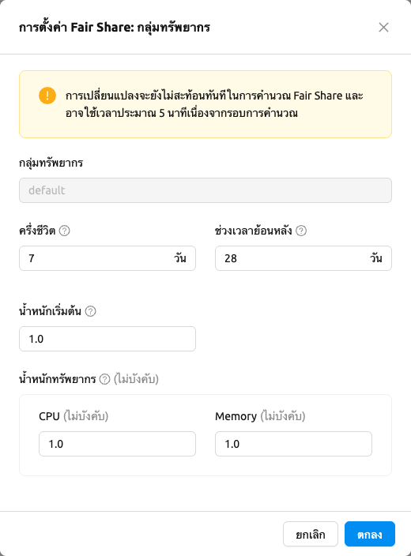

:::warning
การเปลี่ยนแปลงจะยังไม่สะท้อนทันทีในการคำนวณ Fair Share และอาจใช้เวลา
ประมาณ 5 นาทีเนื่องจากรอบการคำนวณ
:::

modal ประกอบด้วยฟิลด์ต่อไปนี้:

- **กลุ่มทรัพยากร**: ฟิลด์อ่านอย่างเดียวที่แสดงชื่อกลุ่มทรัพยากร
- **ครึ่งชีวิต**: ช่วงเวลาที่อัตราการสะท้อนการใช้งานลดลงครึ่งหนึ่ง ระบุเป็นวัน (ขั้นต่ำ 1) ตัวอย่างเช่น หากตั้งเป็น 7 วัน การใช้งานเมื่อ 7 วันก่อนจะคำนวณที่ 50% และการใช้งานเมื่อ 14 วันก่อนที่ 25% แนะนำให้ตั้งค่าเป็นพหุคูณของหน่วยการลดทอน
- **ช่วงเวลาย้อนหลัง**: ช่วงของประวัติการใช้งานที่สะท้อนในการคำนวณ Fair Share ระบุเป็นวัน (ขั้นต่ำ 1) การใช้งานก่อนช่วงเวลานี้จะถูกยกเว้นจากการคำนวณ แนะนำให้ตั้งค่าเป็นพหุคูณของครึ่งชีวิต
- **น้ำหนักเริ่มต้น**: ค่าเริ่มต้นที่ใช้กับโดเมน โปรเจกต์ และผู้ใช้ที่ไม่ได้กำหนดน้ำหนัก (ขั้นต่ำ 1, ขั้น 0.1)
- **น้ำหนักทรัพยากร**: น้ำหนักตามประเภททรัพยากร (เช่น CPU, Memory, GPU) แต่ละรายการมีค่าขั้นต่ำ 1 และขั้น 0.1 ส่วนนี้จะแสดงเฉพาะเมื่อกลุ่มทรัพยากรมีน้ำหนักทรัพยากรเท่านั้น

### โดเมน

หลังจากเลือกกลุ่มทรัพยากร ขั้นตอนโดเมนจะแสดงตารางของโดเมนพร้อมน้ำหนัก
Fair Share และการใช้งานภายในกลุ่มทรัพยากรนั้น

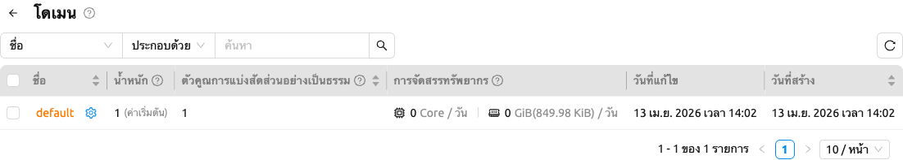

ตารางประกอบด้วยคอลัมน์ต่อไปนี้:

- **ชื่อ**: ชื่อโดเมน คลิกชื่อเพื่อ drill down ไปยังการตั้งค่าระดับโปรเจกต์ของโดเมนนั้น
- **ตัวควบคุม**: ปุ่มตั้งค่า (เฟือง) ที่เปิด modal การตั้งค่าน้ำหนักของโดเมนนี้
- **น้ำหนัก**: ค่าน้ำหนักปัจจุบัน แสดง "ค่าเริ่มต้น" หากใช้น้ำหนักเริ่มต้น
- **ตัวคูณการแบ่งสัดส่วนอย่างเป็นธรรม**: ลำดับความสำคัญในการจัดตารางที่คำนวณโดยตัวจัดตาราง ค่าที่สูงกว่าหมายถึงลำดับความสำคัญที่สูงกว่า
- **การจัดสรรทรัพยากร**: การใช้ทรัพยากรเฉลี่ยต่อวันที่ถูกลดทอนตามประเภททรัพยากร (CPU, Memory, GPU / Day)
- **แก้ไขเมื่อ**: timestamp การแก้ไขครั้งล่าสุด
- **สร้างเมื่อ**: timestamp การสร้าง

คุณสามารถเลือกหลายแถวโดยใช้ช่องทำเครื่องหมายทางด้านซ้ายของตาราง เมื่อเลือก
แถวแล้ว จะมีปุ่มเพิ่มเติม 2 ปุ่มปรากฏขึ้น:

- **กราฟการใช้งาน** (ไอคอนแผนภูมิ): เปิด modal ประวัติการใช้งานสำหรับรายการที่เลือก
- **แก้ไขเป็นกลุ่ม** (ไอคอนเฟือง): เปิด modal การตั้งค่าน้ำหนักเพื่อแก้ไขน้ำหนักของรายการที่เลือกทั้งหมดพร้อมกัน

### โปรเจกต์

หลังจากเลือกโดเมน ขั้นตอนโปรเจกต์จะแสดงตารางของโปรเจกต์ที่มีโครงสร้าง
คอลัมน์เดียวกันกับขั้นตอนโดเมน คลิกชื่อโปรเจกต์เพื่อ drill down ไปยัง
ขั้นตอนผู้ใช้

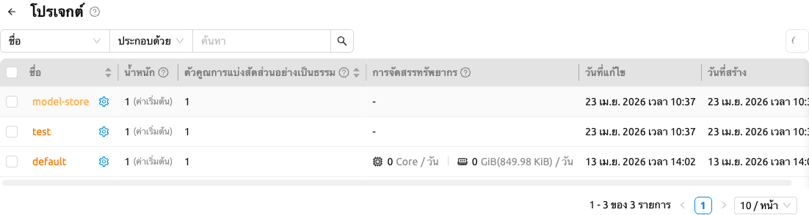

การดำเนินการเป็นกลุ่มเดียวกัน (กราฟการใช้งานและแก้ไขเป็นกลุ่ม) จะพร้อมใช้งานเมื่อเลือกแถว

### ผู้ใช้

หลังจากเลือกโปรเจกต์ ขั้นตอนผู้ใช้จะแสดงตารางของผู้ใช้แต่ละคนพร้อมน้ำหนัก
Fair Share และการใช้งาน

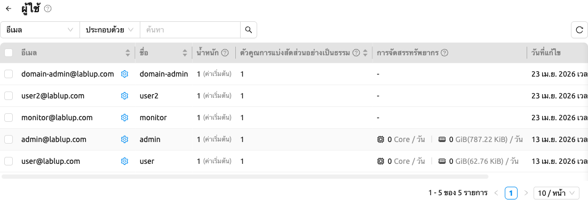

ตารางประกอบด้วยคอลัมน์ต่อไปนี้:

- **อีเมล**: ที่อยู่อีเมลของผู้ใช้
- **ชื่อ**: ชื่อของผู้ใช้
- **ตัวควบคุม**: ปุ่มตั้งค่า (เฟือง) ที่เปิด modal การตั้งค่าน้ำหนักของผู้ใช้นี้
- **น้ำหนัก**: ค่าน้ำหนักปัจจุบัน แสดง "ค่าเริ่มต้น" หากใช้น้ำหนักเริ่มต้น
- **ตัวคูณการแบ่งสัดส่วนอย่างเป็นธรรม**: ลำดับความสำคัญในการจัดตารางที่คำนวณโดยตัวจัดตาราง
- **การจัดสรรทรัพยากร**: การใช้ทรัพยากรเฉลี่ยต่อวันที่ถูกลดทอนตามประเภททรัพยากร
- **แก้ไขเมื่อ**: timestamp การแก้ไขครั้งล่าสุด
- **สร้างเมื่อ**: timestamp การสร้าง

:::note
ในขั้นตอนผู้ใช้ จะมีคุณสมบัติตัวกรองเพิ่มเติม: อีเมล ชื่อ และสถานะการใช้งาน
:::

การดำเนินการเป็นกลุ่มเดียวกัน (กราฟการใช้งานและแก้ไขเป็นกลุ่ม) จะพร้อมใช้งานเมื่อเลือกแถว

### การแก้ไขน้ำหนัก Fair Share

หากต้องการแก้ไขน้ำหนัก Fair Share สำหรับโดเมน โปรเจกต์ หรือผู้ใช้ ให้คลิกปุ่ม
ตั้งค่า (เฟือง) ในคอลัมน์ตัวควบคุมของแถวที่ต้องการ modal การตั้งค่าน้ำหนักจะเปิดขึ้น

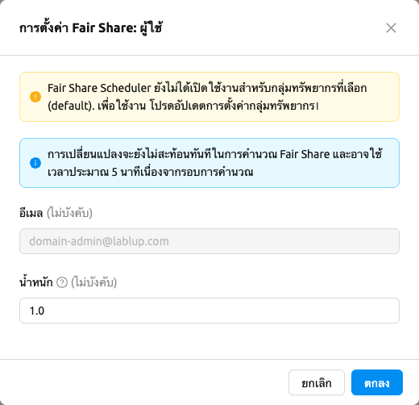

:::warning
การเปลี่ยนแปลงจะยังไม่สะท้อนทันทีในการคำนวณ Fair Share และอาจใช้เวลา
ประมาณ 5 นาทีเนื่องจากรอบการคำนวณ
:::

ในโหมดแก้ไขเดี่ยว modal จะแสดงชื่อรายการ (อ่านอย่างเดียว) และฟิลด์ป้อนน้ำหนัก

- **น้ำหนัก**: ตัวคูณฐานที่กำหนดลำดับความสำคัญสำหรับการจัดตารางแบบ Fair Share ยิ่งค่าสูง จะมีลำดับความสำคัญสูงขึ้น ค่าเริ่มต้นคือ "1.0" น้ำหนัก "2.0" จะมีลำดับความสำคัญเป็นสองเท่าของ "1.0" ค่าขั้นต่ำคือ 1 และขั้นคือ 0.1

หากต้องการแก้ไขน้ำหนักของหลายรายการพร้อมกัน ให้เลือกแถวที่ต้องการโดยใช้ช่อง
ทำเครื่องหมายในตาราง จากนั้นคลิกปุ่มแก้ไขเป็นกลุ่ม (ไอคอนเฟือง) ในโหมด
แก้ไขเป็นกลุ่ม modal จะแสดงรายการแท็กของรายการที่เลือกทั้งหมดและฟิลด์ป้อน
น้ำหนักเดียวที่จะใช้กับทุกรายการ

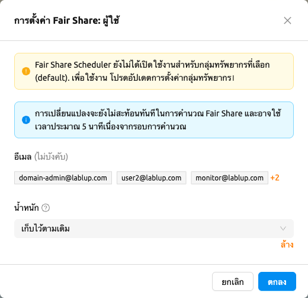

:::note
หากกลุ่มทรัพยากรที่เลือกไม่ได้ตั้งค่าประเภทตัวจัดตารางเป็น `FAIR_SHARE`
จะมีการแจ้งเตือนเป็นคำเตือนแสดงใน modal
:::

### การดูประวัติการใช้งาน

หากต้องการดูประวัติการใช้งานของโดเมน โปรเจกต์ หรือผู้ใช้ ให้เลือกแถวที่ต้องการ
โดยใช้ช่องทำเครื่องหมายในตาราง จากนั้นคลิกปุ่มกราฟการใช้งาน (ไอคอนแผนภูมิ)
modal ประวัติการใช้งานจะเปิดขึ้น

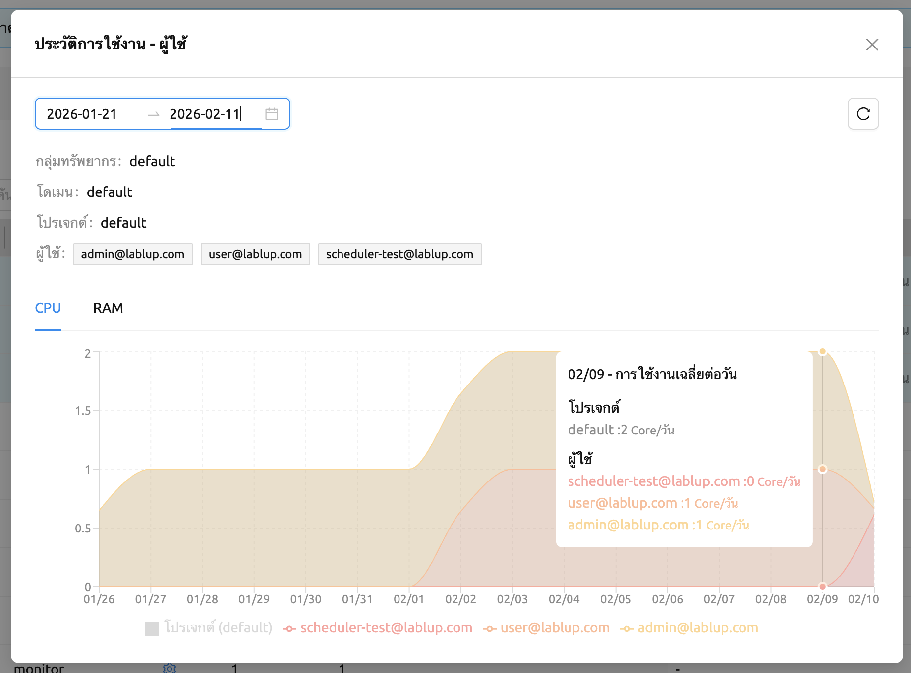

modal จะแสดงข้อมูลต่อไปนี้:

- **ตัวเลือกช่วงวันที่**: เลือกช่วงวันที่สำหรับประวัติการใช้งาน มีพรีเซ็ตสำหรับ 7 วันที่ผ่านมา, 30 วันที่ผ่านมา และ 90 วันที่ผ่านมา
- **ปุ่มรีเฟรช**: รีเฟรชข้อมูลการใช้งานด้วยตนเอง
- **ข้อมูลบริบท**: แสดงกลุ่มทรัพยากร โดเมน และโปรเจกต์ (ขึ้นอยู่กับขั้นตอนปัจจุบัน)
- **รายการที่เลือก**: แสดงเป็นแท็กที่แสดงชื่อของรายการที่เลือก
- **แผนภูมิการใช้งาน**: แผนภูมิแสดงการใช้ทรัพยากรเฉลี่ยต่อวันในช่วงเวลาที่เลือก

<a id="manage-images"></a>

## Manage Images

Admins can manage images, which are used in creating a compute session, in the
Images tab of the Environments page. In the tab, meta information of all images
currently in the Backend.AI server is displayed. You can check information such
as registry, namespace, image name, image's based OS, digest, and minimum
resources required for each image. For images downloaded to one or more agent
nodes, there will be a `installed` tag in each Status column.

:::note
The feature to install images by selecting specific agents is currently
under development.
:::


You can change the minimum resource requirements for each image by clicking the
'Setting (Gear)' in the Controls panel. Each image has hardware and resource
requirements for minimal operation. (For example, for GPU-only images, there
must be a minimum allocated GPU.) The default value for the minimum resource
amount is provided as embedded in the image's metadata. If an attempt is made to
create a compute session with a resource that is less than the amount of
resources specified in each image, the request is automatically adjusted to the
minimum resource requirements for the image and then generated, not cancelled.

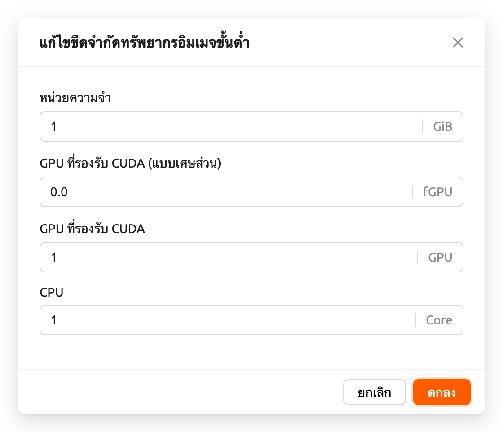

:::note
Don't change the minimum resource requirements to an amount less than the
predefined value! The minimum resource requirements included in the image
metadata are values that have been tested and determined. If you are not
really sure about the minimum amount of resources you want to change, leave
it in the default.
:::

Additionally, you can add or modify the supported apps for each image by clicking the 'Apps' icon located in the Controls column.
Once you click the icon, the name of the app and its corresponding port number will be displayed accordingly.

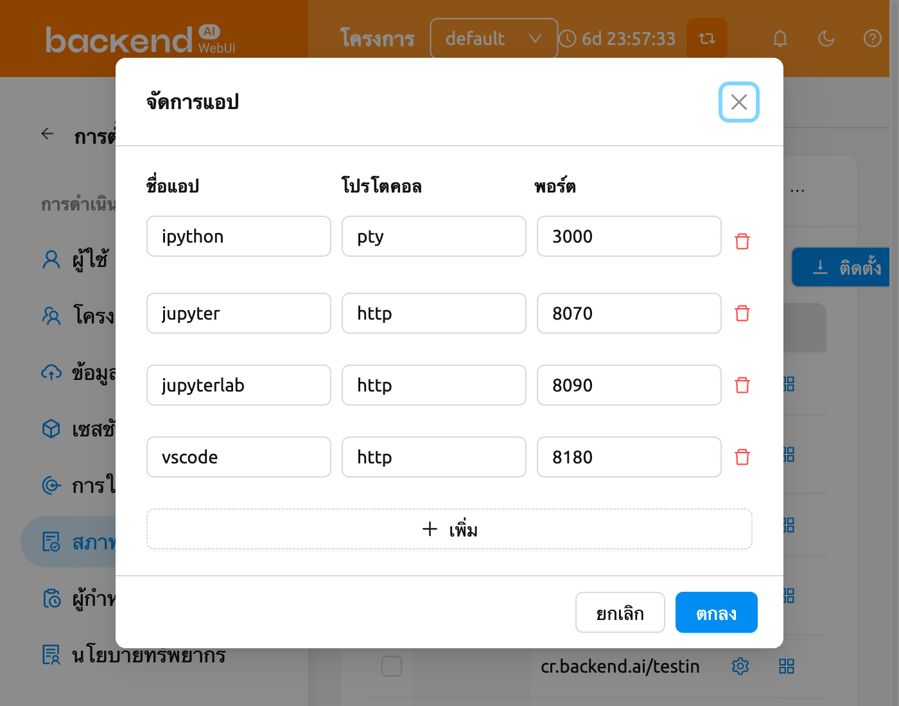

In this interface, you can add supported custom applications by clicking the '+ Add' button below. To delete an application, simply click the 'red trash can' button on the right side of each row.

:::note
You need to reinstall the image after changing the managed app.

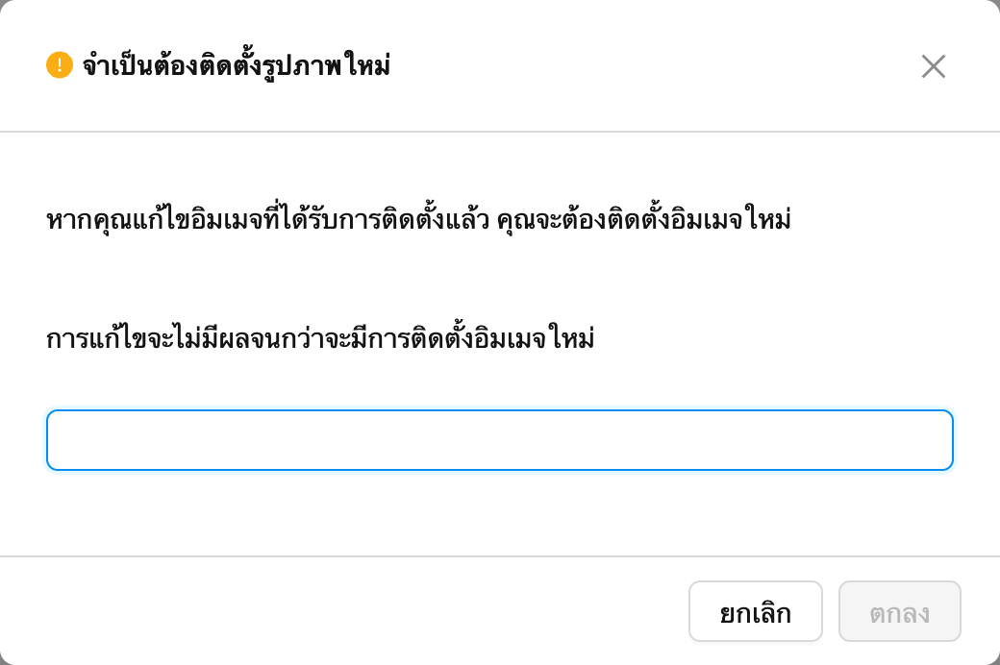
:::

<a id="manage-docker-registry"></a>

## Manage docker registry

You can click on the Registries tab in Environments page to see the information
of the docker registry that are currently connected. `cr.backend.ai` is
registered by default, and it is a registry provided by Harbor.

:::note
In the offline environment, the default registry is not accessible, so
click the trash icon on the right to delete it.
:::

Click the refresh icon in Controls to update image metadata for Backend.AI from
the connected registry. Image information which does not have labels for
Backend.AI among the images stored in the registry is not updated.

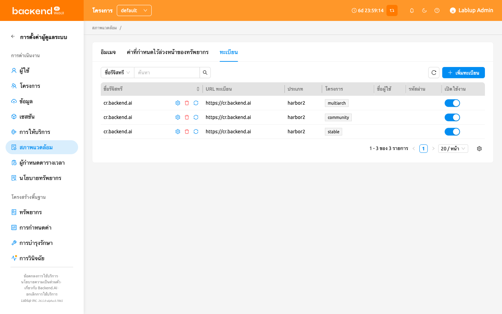

You can add your own private docker registry by clicking the '+ Add Registry'
button. Note that Registry Name and Registry URL address must be set
identically, and in the case of Registry URL, a scheme such as `http://__PROTECTED_10__https://__PROTECTED_11__api_endpoint__PROTECTED_12__https://registry.gitlab.com__PROTECTED_13__{"api_endpoint": "https://gitlab.com"}__PROTECTED_14__https://registry.example.com__PROTECTED_15__{"api_endpoint": "https://gitlab.example.com"}__PROTECTED_16__api_endpoint__PROTECTED_17__namespace/project-name__PROTECTED_18__read_registry__PROTECTED_19__read_api__PROTECTED_20__read_api__PROTECTED_21__FIFO__PROTECTED_22__LIFO__PROTECTED_23__DRF__PROTECTED_24__FIFO__PROTECTED_25__LIFO__PROTECTED_26__DRF__PROTECTED_27__PENDING__PROTECTED_28__num
  retries to skip`, default three times).

<a id="scheduling-methods"></a>

You can create a new resource policy by clicking the '+ Create' button.
Likewise other creating options, you cannot create a resource policy with the name
that already exists, since name is the key value.

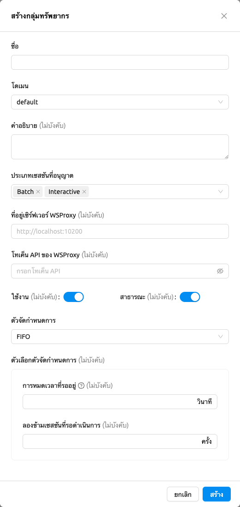

<a id="storages"></a>

## Storages

On STORAGES tab, you can see what kind of mount volumes (usually NFS) exist.
From 23.03 version, We provide per-user/per-project quota setting on storage that supports quota management.
By using this feature, admin can easily manage and monitor the exact amount of storage usage for each user and project based folder.

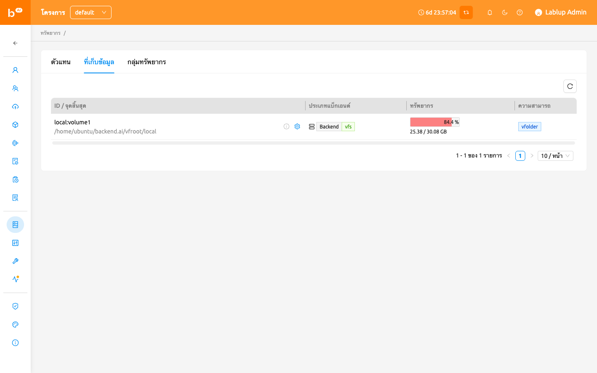

In order to set quota, you need to first access to storages tab in resource page.
And then, click 'Setting (Gear)' in control column.

:::note
Please remind that quota setting is only available in storage that provides quota setting
(e.g. XFS, CephFS, NetApp, Purestorage, etc.). Although you can see the usage of storage
in quota setting page regardless of storage, you cannot configure the quota which doesn't
support quota configuration internally.

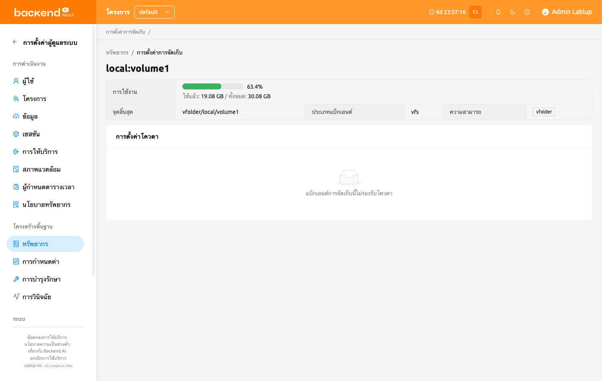
:::

<a id="quota-setting-panel"></a>

#### Quota Setting Panel

In Quota setting page, there are two panels.


- Overview panel
  - Usage: Shows the actual amount usage of the selected storage.
  - Endpoint: Represents the mount point of the selected storage.
  - Backend Type: The type of storage.
  - Capabilities: The supported feature of the selected storage.

- Quota Settings
  - For User: Configure per-user quota setting here.
  - For Project: Configure per-project quota(project-folder) setting here.
  - ID: Corresponds to user or project id.
  - Hard Limit (GB): Currently set hard limit quota for selected quota.
  - Control: Provides editing the hard limit or even deleting the quota setting.

<a id="set-user-quota"></a>

#### Set User Quota

In Backend.AI, there are two types of vfolders created by user and admin(project). In this section,
we would like to show how to check current quota setting per-user and how to configure it.
First, make sure the active tab of quota settings panel is `For User`. Then, select user you desire to
check and edit the quota. You can see the quota id that corresponds to user's id and the configuration already set
in the table, if you already set the quota.

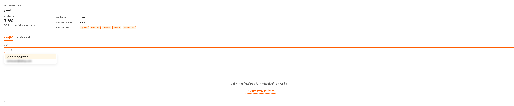

Of course, if you want to edit the quota, you can simply click the Edit button in the control column. After Clicking `Edit` button, you may see the small modal that enables configuring quota setting.
After input the exact amount, don't forget to Click `OK` button, unless the changes will not be applied.

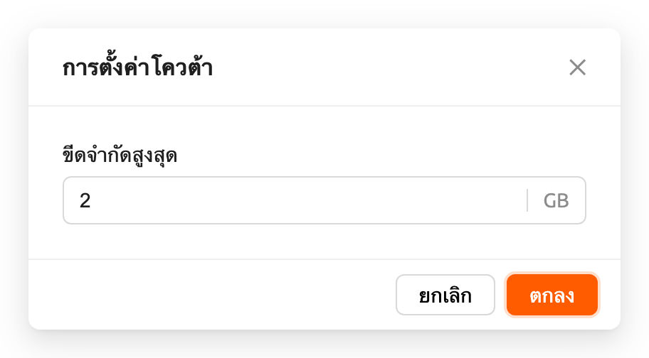

<a id="set-project-quota"></a>

#### Set Project Quota

Setting a quota on project-folder is similar to setting a user quota. The difference between setting
project quota and user quota is to confirm setting the project quota requires one more procedure,
which is selecting the domain that the project is dependent on. The rest are the same.
As in the picture below, you need to first select the domain, and then select the project.

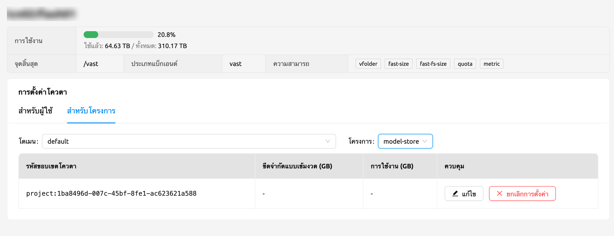

<a id="unset-quota"></a>

#### Unset Quota

We also provides the feature to unset the quota. Please remind that after removing the quota setting, quota will automatically follows
user or project default quota, which cannot be set in WebUI. If you want to change the default quota setting, you may need to access to admin-only page.
By Clicking `Unset` button in control column, the small snackbar message will show up and confirm whether you really want to delete the current quota setting.
If you click `OK` button in the snackbar message, then it will delete the quota setting and automatically reset the quota follows to corresponding quota,
which depends on the quota type(user / project).

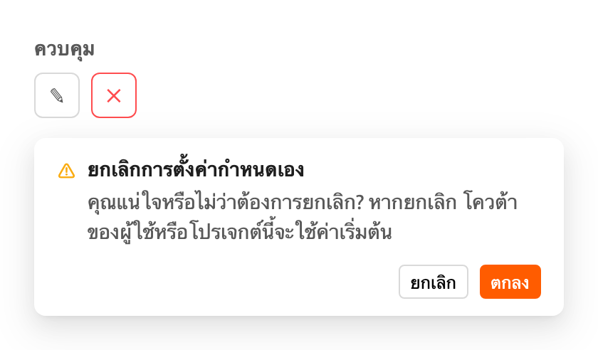

:::note
If there's no config per user/project, then corresponding values in the user/project resource policy will be set as
a default value. For example, If no hard limit value for quota is set, `max_vfolder_size` value in the resource policy
is used as the default value.
:::

<a id="download-session-lists"></a>

## Download session lists

:::note
This feature is currently not available on the default Session page.
To use this feature, please enable 'Classic Session list page' option in the 'Switch back to the Classic UI' section
on the User Setting page. For more details, please refer to [Backend.AI User Settings](#user-settings) section.
:::

There's additional feature in Session page for admin.
On the right side of the FINISHED tab there is a menu marked with `...`.
When you click this menu, a sub-menu export CSV appears.

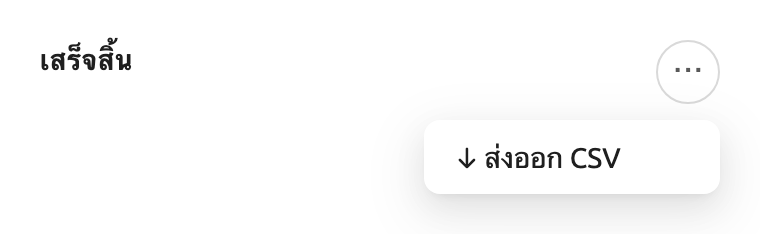

If you click this menu, you can download the information of the comcpute sessions
created so far in CSV format. After the following dialog opens, enter an appropriate
file name (if necessary), click the EXPORT button and you will get the CSV file.
Please note that a file name can have up to 255 characters.

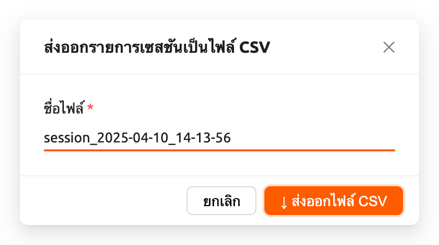

<a id="system-settings"></a>

## System settings

In the Configuration page, you can see main settings of Backend.AI server.
Currently, it provides several controls which can change and list settings.

You can change image auto install and update rule by selecting one option from
`Digest`, `Tag`, `None`. `Digest` is kind of checksum for the image which
verifies integrity of the image and also enhances efficiency in downloading images
by reusing duplicated layers. `Tag` is only for developing option since it does not
guarantee the Integrity of the image.

:::note
Don't change rule selection unless you completely understand the meaning of each rule.
:::

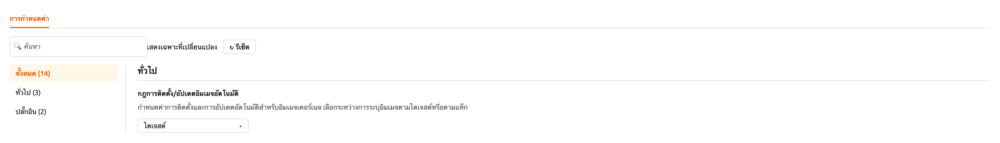

You can also change settings for scaling, plugins and enterprise features.

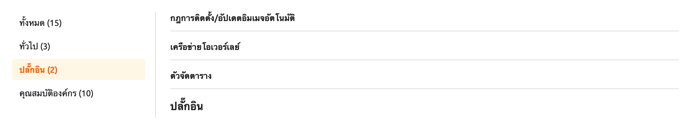

When a user launches a multi-node cluster session, which is introduced at
version 20.09, Backend.AI will dynamically create an overlay network to support
private inter-node communication. Admins can set the value of the Maximum
Transmission Unit (MTU) for the overlay network, if it is certain that the value
will enhance the network speed.

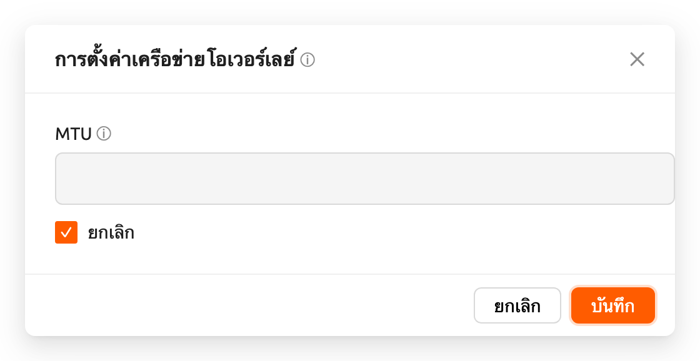

:::note
For more information about Backend.AI Cluster session, please refer to
[Backend.AI Cluster Compute Session](#backendai-cluster-compute-session) section.
:::

You can edit the configuration per job scheduler by clicking the Scheduler's config button.
The values in the scheduler setting are the defaults to use when there is no scheduler
setting in each [resource group](#scheduling-methods). If there is a resource
group-specific setting, this value will be ignored.

Currently supported scheduling methods include `FIFO`, `LIFO`, and `DRF`.
Each method of scheduling is exactly the same as the [scheduling methods](#scheduling-methods) above.
Scheduler options include session creation retries. Session creation retries refers to the number
of retries to create a session if it fails. If the session cannot be created within the trials,
the request will be ignored and Backend.AI will process the next request. Currently, changes are
only possible when the scheduler is FIFO.

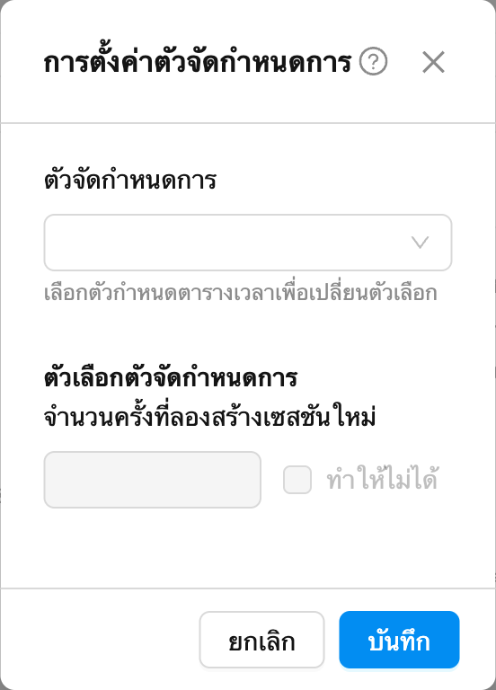

:::note
We will continue to add broader range of setting controls.
:::

:::note
System settings are default settings. If resource group has certain value,
then it overrides configured value in system settings.
:::

<a id="server-management"></a>

## Server management

Go to the Maintenance page and you will see some buttons to manage the server.

- RECALCULATE USAGE: Occasionally, due to unstable network connections or
  container management problem of Docker daemon, there may be a case where the
  resource occupied by Backend.AI does not match the resource actually used by
  the container. In this case, click the RECALCULATE USAGE button to manually
  correct the resource occupancy.
- RESCAN IMAGES: Update image meta information from all registered Docker
  registries. It can be used when a new image is pushed to a
  Backend.AI-connected docker registry.

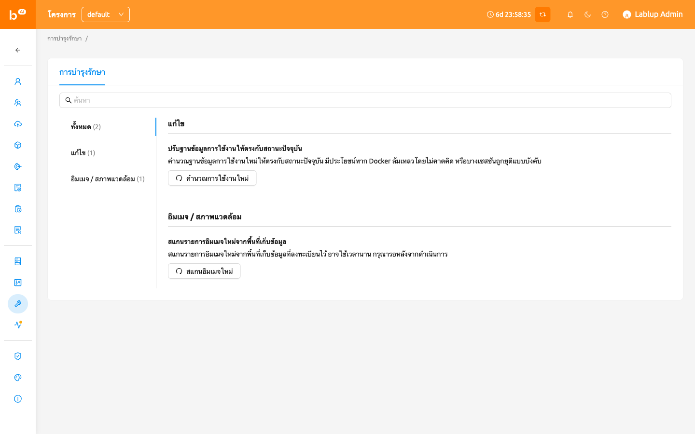

:::note
We will continue to add other settings needed for management, such as
removing unused images or registering periodic maintenance schedules.
:::

<a id="detailed-information"></a>

## Detailed Information

In Information page, you can see several detailed information and status of each feature.
To see Manager version and API version, check the Core panel. To see whether each component
for Backend.AI is compatible or not, check the Component panel.

:::note
This page is only for showing current information.
:::

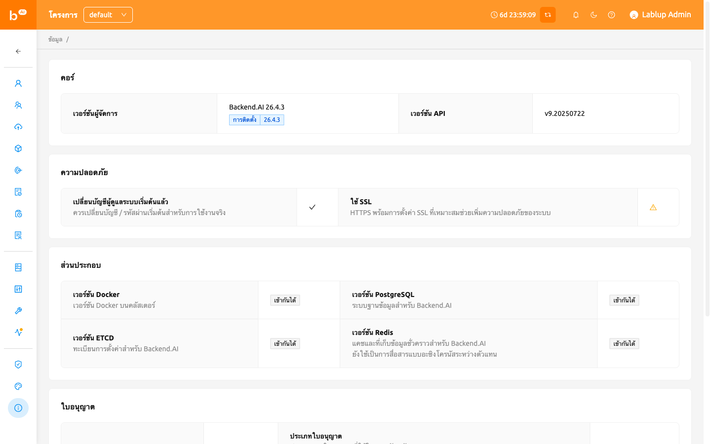
