

# ฟีเจอร์ผู้ดูแลระบบ

การเข้าสู่ระบบด้วยบัญชีผู้ดูแลระบบจะเพิ่มเมนู **การตั้งค่าผู้ดูแลระบบ** ที่ด้านบนของแถบด้านข้าง เมื่อเลือกเมนูนี้ แถบด้านข้างจะสลับไปแสดงเฉพาะเมนูของผู้ดูแลระบบเท่านั้น ข้อมูลผู้ใช้ที่ลงทะเบียนใน Backend.AI จะแสดงในเมนู**ผู้ใช้** ผู้ใช้ที่มีบทบาท super-admin สามารถดูข้อมูลของผู้ใช้ทั้งหมด รวมถึงสร้างหรือปิดใช้งานผู้ใช้ได้

<!-- TODO: Re-capture admin_user_page.png to show the Admin Settings sidebar and the Users list. -->

## การดูและจัดการรายชื่อผู้ใช้

สามารถสร้างผู้ใช้ได้โดยคลิกปุ่ม '+ สร้างผู้ใช้' โปรดทราบว่ารหัสผ่านต้องมีความยาว 8 ตัวอักษรขึ้นไป และต้องมีตัวอักษร ตัวอักขระพิเศษ และตัวเลขอย่างน้อยอย่างละ 1 ตัว ความยาวสูงสุดที่อนุญาตสำหรับ E-Mail, Username และชื่อเต็ม คือ 64 ตัวอักษร

หากผู้ใช้ที่มีอีเมลหรือชื่อผู้ใช้งานเดียวกันมีอยู่แล้ว จะไม่สามารถสร้างบัญชีผู้ใช้ได้ กรุณาลองใช้อีเมลและชื่อผู้ใช้งานอื่น

ตรวจสอบว่าผู้ใช้ถูกสร้างแล้ว

<!-- TODO: Re-capture check_if_user_created.png framed to the card (currently has no padding). -->

คลิกไอคอนข้อมูลในแถวคอลัมน์ **อีเมล** ของผู้ใช้นั้น เพื่อดูข้อมูลผู้ใช้โดยละเอียด คุณยังสามารถตรวจสอบข้อมูลโดเมนและโปรเจกต์ที่ผู้ใช้สังกัดอยู่ได้

คลิกไอคอน 'การตั้งค่า' ในแถวคอลัมน์ **อีเมล** ของผู้ใช้นั้น เพื่ออัปเดตข้อมูลของผู้ใช้ที่มีอยู่แล้ว สามารถเปลี่ยนชื่อผู้ใช้ รหัสผ่าน สถานะการเปิดใช้งาน เป็นต้น User ID (อีเมล) ไม่สามารถเปลี่ยนแปลงได้

กล่องโต้ตอบสร้าง/อัปเดตผู้ใช้ประกอบด้วยฟิลด์ต่อไปนี้:

- **อีเมล**: ที่อยู่อีเมลของผู้ใช้ ใช้เป็น ID สำหรับเข้าสู่ระบบ ไม่สามารถเปลี่ยนแปลงได้หลังจากสร้างแล้ว
- **ชื่อผู้ใช้**: ตัวระบุเฉพาะของผู้ใช้ (สูงสุด 64 ตัวอักษร)
- **ชื่อเต็ม**: ชื่อที่แสดงของผู้ใช้ (สูงสุด 64 ตัวอักษร)
- **รหัสผ่าน**: ต้องมีอย่างน้อย 8 ตัวอักษร และมีตัวอักษร ตัวอักขระพิเศษ และตัวเลขอย่างน้อยอย่างละ 1 ตัว
- **ต้องเปลี่ยนรหัสผ่าน**: หากผู้ดูแลระบบเลือกรหัสผ่านแบบสุ่มขณะสร้างผู้ใช้เป็นกลุ่ม ฟิลด์นี้สามารถตั้งค่าเป็น ON เพื่อบ่งบอกว่าจำเป็นต้องเปลี่ยนรหัสผ่าน ผู้ใช้จะเห็นแถบด้านบนที่แจ้งให้อัปเดตรหัสผ่าน แต่นี่เป็นเพียงแฟล็กอธิบายซึ่งไม่มีผลต่อการใช้งานจริง
- **คำอธิบาย**: คำอธิบายเพิ่มเติมสำหรับผู้ใช้ (สูงสุด 500 ตัวอักษร)
- **สถานะผู้ใช้**: แสดงสถานะของผู้ใช้ ผู้ใช้ไม่ทำงานไม่สามารถเข้าสู่ระบบได้ ก่อนการตรวจสอบเป็นสถานะที่บ่งบอกว่าผู้ใช้ต้องดำเนินการเพิ่มเติมเพื่อเปิดใช้งานบัญชี เช่น การยืนยันอีเมลหรือการอนุมัติจากผู้ดูแลระบบ ผู้ใช้ไม่ทำงานจะแสดงแยกในแท็บไม่ทำงาน

  

- **บทบาท**: บทบาทของผู้ใช้ (user, admin, superadmin) ตัวเลือกที่มีจะขึ้นอยู่กับสิทธิ์ของผู้ใช้ปัจจุบัน
- **เปิดใช้งานเซสชัน sudo**: อนุญาตให้ผู้ใช้ใช้ sudo ในเซสชันการคำนวณ สิ่งนี้มีประโยชน์เมื่อผู้ใช้ต้องติดตั้งแพ็กเกจหรือรันคำสั่งที่ต้องใช้สิทธิ์ root อย่างไรก็ตาม ไม่แนะนำให้เปิดใช้ตัวเลือกนี้สำหรับผู้ใช้ทุกคน เนื่องจากอาจทำให้เกิดปัญหาด้านความปลอดภัย
- **2FA Enabled**: แฟล็กที่บ่งบอกว่าผู้ใช้ใช้การยืนยันตัวตนแบบสองปัจจัยหรือไม่ เมื่อใช้การยืนยันตัวตนแบบสองปัจจัย ผู้ใช้จะต้องกรอกรหัส OTP เพิ่มเติมเมื่อเข้าสู่ระบบ ผู้ดูแลระบบสามารถปิดการยืนยันตัวตนแบบสองปัจจัยของผู้ใช้อื่นได้เท่านั้น
- **นโยบายทรัพยากร**: เลือกนโยบายทรัพยากรผู้ใช้ที่ผู้ใช้สังกัดได้ สำหรับข้อมูลเพิ่มเติมเกี่ยวกับนโยบายทรัพยากรผู้ใช้ โปรดดูที่ส่วน [นโยบายทรัพยากรผู้ใช้](#user-resource-policy)
- **โดเมน**: โดเมนที่ผู้ใช้สังกัด สามารถกำหนดหรือแก้ไขได้ทั้งขณะสร้างผู้ใช้ใหม่และแก้ไขผู้ใช้
- **โปรเจกต์**: เลือกโปรเจกต์หนึ่งรายการขึ้นไปที่ผู้ใช้จะสังกัด โปรเจกต์ที่มีจะขึ้นอยู่กับโดเมนที่เลือก
- **IP ไคลเอนต์ที่อนุญาต**: จำกัดที่อยู่ IP ที่สามารถเข้าถึงระบบโดยใช้บัญชีผู้ใช้นี้ ป้อนที่อยู่ IP หรือ CIDR (เช่น `10.20.30.40`, `10.20.30.0/24`) หากเว้นว่างไว้ อนุญาตให้เข้าถึงจาก IP ใดก็ได้
- **UID คอนเทนเนอร์**: User ID ตัวเลขที่กำหนดให้กับกระบวนการภายในคอนเทนเนอร์ มีประโยชน์เมื่อคอนเทนเนอร์ต้องตรงกับ UID เฉพาะสำหรับวัตถุประสงค์ด้านสิทธิ์ไฟล์
- **GID คอนเทนเนอร์**: Group ID ตัวเลขเริ่มต้นที่กำหนดให้กับกระบวนการภายในคอนเทนเนอร์
- **GID เสริม**: Group ID ตัวเลขเพิ่มเติมที่กำหนดให้กับกระบวนการคอนเทนเนอร์ ป้อน GID หลายตัวโดยคั่นด้วยเครื่องหมายจุลภาค
- **คีย์การเข้าถึงหลัก**: (แก้ไขเท่านั้น) เลือกคีย์การเข้าถึงหลักที่ใช้สำหรับการยืนยันตัวตน API จากคีย์แพร์ของผู้ใช้

### สร้างผู้ใช้แบบกลุ่ม

เมื่อคุณต้องการสร้างบัญชีผู้ใช้หลายบัญชีพร้อมกัน คุณสามารถใช้ฟีเจอร์สร้างผู้ใช้
แบบกลุ่มได้ ปุ่มดรอปดาวน์จุดไข่ปลา (`...`) จะปรากฏ
ข้างปุ่ม **สร้างผู้ใช้** ในหน้าผู้ใช้ คลิกปุ่มดรอปดาวน์นี้แล้วเลือก
**สร้างผู้ใช้แบบกลุ่ม** เพื่อเปิดไดอะล็อกการสร้างแบบกลุ่ม

ไดอะล็อกการสร้างแบบกลุ่มประกอบด้วยฟิลด์ต่อไปนี้ แบนเนอร์แจ้งเตือนที่ด้านบนของ
ไดอะล็อกจะอธิบายว่าอีเมลและชื่อผู้ใช้จะถูกสร้างโดยอัตโนมัติโดยเติมเลขลำดับแบบ
zero-padded ต่อท้ายส่วนนำหน้า

- **ส่วนที่อยู่ก่อน @ ของอีเมล**: ส่วนนำหน้าของที่อยู่อีเมลที่สร้างโดยอัตโนมัติ
  ใช้ได้เฉพาะตัวอักษร ตัวเลข จุด ยัติภังค์ หรือขีดล่างเท่านั้น (สูงสุด 30 ตัวอักษร)
- **ส่วนต่อท้ายอีเมล (หลัง @)**: ส่วนโดเมนของที่อยู่อีเมลที่สร้างโดยอัตโนมัติ
  ฟิลด์นี้จะแสดงเครื่องหมาย `@` นำหน้าโดยอัตโนมัติ (สูงสุด 30 ตัวอักษร)
- **จำนวนผู้ใช้**: จำนวนบัญชีผู้ใช้ที่ต้องการสร้าง (1 ถึง 100) ด้านล่างฟิลด์นี้จะ
  แสดงตัวอย่างอีเมลที่จะสร้างแบบเรียลไทม์ หากมี 4 คนหรือน้อยกว่าจะแสดงอีเมล
  ทั้งหมด หากมากกว่า 4 คนจะแสดง 2 รายการแรก จุดไข่ปลา และรายการสุดท้าย
  (เช่น `student01@example.com, student02@example.com ... student10@example.com`)
- **รหัสผ่าน**: รหัสผ่านเริ่มต้นที่ใช้ร่วมกันสำหรับผู้ใช้ทั้งหมดที่สร้าง กฎรหัสผ่าน
  เดียวกันกับการสร้างผู้ใช้แบบเดี่ยวจะถูกนำมาใช้ (อย่างน้อย 8 ตัวอักษร ประกอบด้วย
  ตัวอักษร อักขระพิเศษ และตัวเลขอย่างน้อยอย่างละ 1 ตัว)
- **ต้องเปลี่ยนรหัสผ่าน**: ตั้งค่าเริ่มต้นเป็น ON สำหรับการสร้างแบบกลุ่ม
  เมื่อเปิดใช้งาน ผู้ใช้แต่ละคนจะได้รับแจ้งให้เปลี่ยนรหัสผ่านเมื่อเข้าสู่ระบบครั้งแรก
- ฟิลด์ที่เหลือ (**สถานะ**, **บทบาท**, **เปิดใช้งานเซสชัน sudo**, **นโยบายทรัพยากร**, **โดเมน**, **โปรเจกต์**, **IP ไคลเอนต์ที่อนุญาต** ฯลฯ) จะเหมือนกับการสร้างผู้ใช้แบบเดี่ยว ดูที่ส่วน [การดูและจัดการรายชื่อผู้ใช้](#create-and-update-users)

ชื่อผู้ใช้และที่อยู่อีเมลจะถูกสร้างโดยอัตโนมัติตามส่วนนำหน้าและส่วนต่อท้ายที่คุณระบุ
เช่น หากคุณตั้งส่วนนำหน้าอีเมลเป็น `student` ส่วนต่อท้ายอีเมลเป็น `example.com`
และจำนวนผู้ใช้เป็น 10 บัญชีต่อไปนี้จะถูกสร้างขึ้น:

| ชื่อผู้ใช้ | อีเมล |
|-----------|-------|
| `student01` | `student01@example.com` |
| `student02` | `student02@example.com` |
| ... | ... |
| `student10` | `student10@example.com` |

:::note
เลขลำดับจะถูกเติม zero-padding ตามจำนวนผู้ใช้ทั้งหมด เช่น 3 คนจะได้
`student1` ถึง `student3`, 10 คนจะได้ `student01` ถึง `student10`, 100 คนจะได้
`student001` ถึง `student100`
:::

:::warning
หากชื่อผู้ใช้หรือที่อยู่อีเมลที่สร้างขึ้นบางส่วนมีอยู่แล้ว การดำเนินการจะสำเร็จ
บางส่วน ข้อความเตือนจะแสดงจำนวนผู้ใช้ที่สร้างสำเร็จและจำนวนที่ล้มเหลว
:::

### สร้างผู้ใช้แบบกลุ่มจาก CSV

นอกจากการสร้างผู้ใช้แบบกลุ่มโดยตรงแล้ว คุณยังสามารถสร้างผู้ใช้ได้โดยการอัปโหลดไฟล์ CSV คลิกปุ่มดรอปดาวน์จุดไข่ปลา (`...`) ถัดจากปุ่ม **สร้างผู้ใช้** และเลือก **สร้างผู้ใช้แบบกลุ่มจาก CSV** เพื่อเปิดไดอะล็อกอัปโหลด CSV

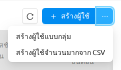

#### การเตรียมไฟล์ CSV

ไฟล์ CSV ต้องใช้การเข้ารหัส UTF-8 แถวแรกต้องเป็นแถวหัวตาราง ชื่อหัวตารางจะถูกจับคู่โดยไม่คำนึงถึงตัวพิมพ์เล็กหรือใหญ่ คุณสามารถดาวน์โหลดเทมเพลตพร้อมใช้งานได้โดยคลิก **ดาวน์โหลดเทมเพลต CSV** ภายในไดอะล็อก

**คอลัมน์ที่จำเป็น:**

- **email**: ที่อยู่อีเมลของผู้ใช้ ใช้เป็น ID สำหรับเข้าสู่ระบบ
- **username**: ชื่อผู้ใช้เฉพาะสำหรับผู้ใช้
- **password**: รหัสผ่านเริ่มต้น กฎรหัสผ่านเดียวกันกับการสร้างผู้ใช้แบบเดี่ยวจะถูกนำมาใช้ (อย่างน้อย 8 ตัวอักษร ประกอบด้วยตัวอักษร อักขระพิเศษ และตัวเลขอย่างน้อยอย่างละ 1 ตัว)

**คอลัมน์ที่เลือกได้:**

- **full_name**: ชื่อที่แสดงของผู้ใช้
- **role**: บทบาทของผู้ใช้ (`user`, `admin` หรือ `superadmin`) ค่าเริ่มต้นคือ `user` หากไม่ระบุ
- **status**: สถานะเริ่มต้นของผู้ใช้ (`active` หรือ `inactive`) ค่าเริ่มต้นคือ `active` หากไม่ระบุ
- **domain_name**: โดเมนที่จะกำหนดให้ผู้ใช้ ค่าเริ่มต้นคือโดเมนปัจจุบันหากไม่ระบุ
- **description**: คำอธิบายเพิ่มเติมสำหรับผู้ใช้
- **need_password_change**: ผู้ใช้ต้องเปลี่ยนรหัสผ่านเมื่อเข้าสู่ระบบครั้งแรกหรือไม่ (`true` หรือ `false`) ค่าเริ่มต้นคือ `true` หากไม่ระบุ
- **resource_policy**: ชื่อนโยบายทรัพยากรที่จะกำหนด
- **project**: ชื่อโปรเจกต์ที่จะเพิ่มผู้ใช้เข้าร่วม

#### การอัปโหลดและตรวจสอบ

หลังจากเลือกไฟล์ CSV ไดอะล็อกจะแสดงตารางตัวอย่างที่แสดงรายการแถวทั้งหมดพร้อมตัวบ่งชี้ดังนี้:

- แถวที่มีข้อมูลถูกต้องจะแสดงตามปกติ
- แถวที่มีข้อผิดพลาดด้านรูปแบบหรือการตรวจสอบความถูกต้องจะถูกไฮไลต์พร้อมข้อความข้อผิดพลาดในตำแหน่งของฟิลด์ เพื่อให้คุณสามารถแก้ไขไฟล์ต้นฉบับก่อนลองใหม่
- สรุปที่ด้านบนของตัวอย่างจะแสดงจำนวนแถวที่ถูกต้องและไม่ถูกต้องทั้งหมด

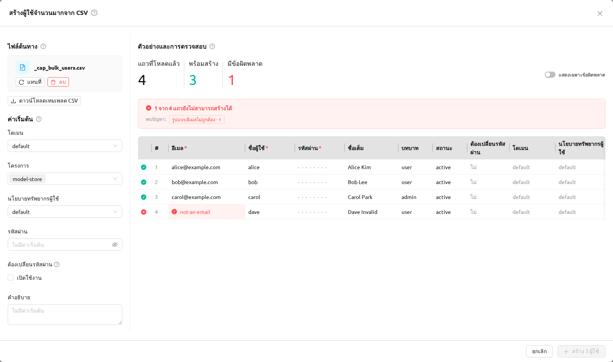

#### การสร้างผู้ใช้

เมื่อตรวจสอบตัวอย่างแล้วและยืนยันว่าทุกแถวถูกต้อง ให้คลิก **สร้าง** เพื่อส่ง หากบางแถวล้มเหลวฝั่งเซิร์ฟเวอร์ (เช่น เนื่องจากอีเมลหรือชื่อผู้ใช้มีอยู่แล้ว) ไดอะล็อกจะยังคงเปิดอยู่และแสดงรายการข้อผิดพลาดแต่ละแถวเพื่อให้คุณระบุและแก้ไขข้อขัดแย้งได้

:::warning
หากบางแถวล้มเหลว เฉพาะแถวที่สำเร็จเท่านั้นที่จะส่งผลให้มีบัญชีใหม่ แถวที่ล้มเหลวจะถูกรายงานแยกกัน แก้ไข CSV ต้นฉบับและอัปโหลดใหม่เพื่อสร้างบัญชีที่เหลือ
:::

## ปิดใช้งานบัญชีผู้ใช้

เพื่อติดตามสถิติการใช้งานต่อผู้ใช้ เก็บรักษาเมตริก และป้องกันการสูญเสียบัญชีโดยไม่ตั้งใจ
วิธีที่แนะนำในการหยุดไม่ให้ผู้ใช้เข้าสู่ระบบคือการ **ปิดใช้งาน** บัญชีแทนการลบ
การปิดใช้งานจะเก็บรักษาเรกคอร์ดของผู้ใช้ไว้ครบถ้วนในขณะที่บล็อกการลงชื่อเข้าใช้
หากต้องการปิดใช้งานผู้ใช้ ให้คลิกไอคอนปิดใช้งานในแถวของผู้ใช้ในคอลัมน์ **อีเมล**
ป๊อปโอเวอร์สำหรับยืนยันจะปรากฏขึ้น คลิกปุ่ม **Deactivate** เพื่อปิดใช้งานผู้ใช้

<!-- TODO: Re-capture user_deactivate_confirmation.png in this locale's UI language, reflecting the new flow: the deactivate icon in the user's Email column row and the confirmation popover. -->

หากต้องการเปิดใช้งานผู้ใช้อีกครั้ง ให้ไปที่แท็บ **ไม่ทำงาน** ในหน้าผู้ใช้ และคลิก
ไอคอนเปิดใช้งาน (กู้คืน) ในแถวของผู้ใช้ในคอลัมน์ **อีเมล** ป๊อปโอเวอร์สำหรับยืนยัน
จะปรากฏขึ้น คลิกปุ่ม **Activate** เพื่อเปิดใช้งานผู้ใช้อีกครั้ง

<!-- TODO: Re-capture user_inactivate_confirmation.png in this locale's UI language, reflecting the new flow: the reactivate (restore) icon in the Email column row on the Inactive tab and the activate popover. -->

:::note
โปรดทราบว่าการปิดใช้งานหรือเปิดใช้งานผู้ใช้อีกครั้งไม่ได้เปลี่ยนข้อมูลรับรองของผู้ใช้
เนื่องจากบัญชีผู้ใช้อาจมีคีย์แพร์หลายรายการ ซึ่งทำให้ยากที่จะตัดสินใจว่าควรเปิดใช้งาน
ข้อมูลรับรองใดอีกครั้ง
:::

แม้ว่าการจัดการบัญชีในชีวิตประจำวันจะอาศัยการปิดใช้งาน แต่ superadmin **สามารถ**
ลบบัญชีที่ถูกปิดใช้งานไปแล้วออกอย่างถาวรได้ โดยใช้ฟีเจอร์ลบถาวร (Purge) ที่อธิบายไว้ด้านล่าง

### ลบผู้ใช้ที่ไม่ใช้งานอย่างถาวร

superadmin สามารถลบบัญชีผู้ใช้ที่ถูกปิดใช้งานไปแล้วออกอย่างถาวร (purge) ได้
การลบถาวรใช้ได้ **เฉพาะ** กับผู้ใช้ในแท็บ **ไม่ทำงาน** เท่านั้น ผู้ใช้ที่ใช้งานอยู่
ต้องถูกปิดใช้งานก่อน ต่างจากการปิดใช้งาน การลบถาวรไม่สามารถยกเลิกได้
และจะลบข้อมูลที่เกี่ยวข้องของผู้ใช้ออกด้วย

ในหน้าผู้ใช้ ให้สลับไปที่แท็บ **ไม่ทำงาน** (ตัวเลือกสถานะจะแสดงเป็น
**ไม่ใช้งาน (รวมคีย์แพร์)** เพื่อระบุว่าการลบถาวรจะส่งผลต่อคีย์แพร์ของผู้ใช้ด้วย)
คุณสามารถลบผู้ใช้อย่างถาวรได้สองวิธี:

- **ลบถาวรทีละผู้ใช้**: คลิกไอคอนถังขยะ (ลบถาวร) ในแถวของผู้ใช้ที่ไม่ใช้งานหนึ่งราย
  ในคอลัมน์ **อีเมล**
- **ลบถาวรแบบกลุ่ม**: เลือกผู้ใช้ที่ไม่ใช้งานหนึ่งรายหรือมากกว่าด้วยช่องทำเครื่องหมายของแถว
  จากนั้นคลิกปุ่ม **ลบผู้ใช้อย่างถาวร** (ปุ่มถังขยะที่ปรากฏถัดจากจำนวนที่เลือก)

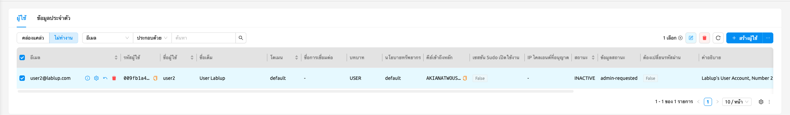
<!-- TODO: Capture screenshot of user_purge_inactive_tab.png — Inactive Users tab showing the per-row purge (trash) icon and the bulk Permanently Delete Users button -->

ทั้งสองการกระทำจะเปิดโมดัลยืนยัน **ลบผู้ใช้อย่างถาวร** เนื่องจากการดำเนินการนี้
ไม่สามารถยกเลิกได้ คุณต้องพิมพ์วลียืนยันที่แสดงในโมดัลก่อนที่ปุ่มลบจะเปิดใช้งาน
โมดัลยังมีตัวเลือกสองอย่าง:

- **ต้องการลบโฟลเดอร์เสมือนที่แชร์ด้วยหรือไม่?**: เมื่อเลือก โฟลเดอร์เสมือนที่ผู้ใช้
  ที่ถูกลบถาวรแชร์ไว้จะถูกลบด้วย เมื่อไม่เลือก โฟลเดอร์เหล่านั้นจะยังคงอยู่
- **ต้องการลบบริการโมเดลที่สร้างไว้ด้วยหรือไม่?**: เมื่อเลือก บริการโมเดลที่ผู้ใช้
  ที่ถูกลบถาวรสร้างไว้จะถูกลบด้วย เมื่อไม่เลือก บริการเหล่านั้นจะไม่ถูกลบ
  แต่จะมอบหมายความเป็นเจ้าของแทน

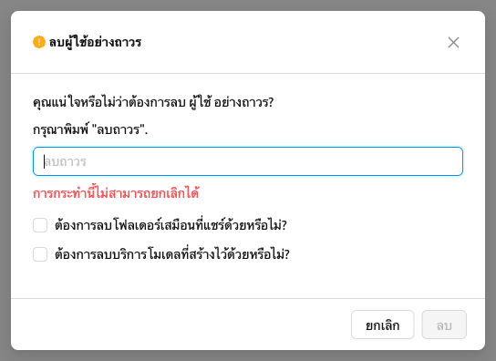
<!-- TODO: Capture screenshot of purge_users_modal.png — Permanently Delete Users confirmation modal with the two option checkboxes and the irreversibility alert -->

:::danger
การลบผู้ใช้อย่างถาวร **ไม่สามารถยกเลิกได้** โฟลเดอร์เสมือน ประวัติการใช้งานเคอร์เนล
และคีย์แพร์ที่เกี่ยวข้องของผู้ใช้จะถูกลบด้วย โปรดตรวจสอบให้แน่ใจว่าคุณเลือกผู้ใช้
ที่ถูกต้องก่อนยืนยัน
:::

## จัดการคีย์แพร์ของผู้ใช้

โดยปกติบัญชีผู้ใช้แต่ละบัญชีจะมีคีย์แพร์หนึ่งรายการหรือมากกว่า คีย์แพร์ใช้สำหรับ
ยืนยันตัวตนผ่าน API ไปยังเซิร์ฟเวอร์ Backend.AI หลังจากที่ผู้ใช้เข้าสู่ระบบ การเข้าสู่ระบบ
ต้องมีการยืนยันตัวตนผ่านอีเมลและรหัสผ่านของผู้ใช้ แต่ทุกคำขอที่ผู้ใช้ส่งไปยัง
เซิร์ฟเวอร์จะได้รับการยืนยันตัวตนตามคีย์แพร์

ผู้ใช้สามารถมีคีย์แพร์หลายรายการได้ แต่เพื่อลดภาระของผู้ใช้ในการจัดการคีย์แพร์
ปัจจุบันเราใช้คีย์แพร์เพียงหนึ่งรายการของผู้ใช้ในการส่งคำขอเท่านั้น
นอกจากนี้ เมื่อคุณสร้างผู้ใช้ใหม่ คีย์แพร์จะถูกสร้างโดยอัตโนมัติ ดังนั้นคุณจึง
ไม่จำเป็นต้องสร้างและกำหนดคีย์แพร์ด้วยตนเองในกรณีส่วนใหญ่

คีย์แพร์สามารถแสดงในแท็บข้อมูลประจำตัวของหน้าผู้ใช้ คีย์แพร์ที่ใช้งานอยู่จะแสดง
ทันที และหากต้องการดูคีย์แพร์ที่ไม่ได้ใช้งาน ให้คลิกแผงไม่ทำงานที่ด้านล่าง

<!-- TODO: Re-capture credential_list_tab.png with the sidebar menu expanded (currently collapsed). -->

เช่นเดียวกับในแท็บผู้ใช้ คุณสามารถใช้ปุ่มอินไลน์ในแถวของคีย์แพร์เพื่อดูหรือ
อัปเดตรายละเอียดคีย์แพร์ คลิกปุ่มไอคอนข้อมูลเพื่อดูรายละเอียดเฉพาะของคีย์แพร์
หากจำเป็น คุณสามารถคัดลอก secret key ได้โดยคลิกปุ่มคัดลอก

คุณสามารถแก้ไขนโยบายทรัพยากรและ rate limit ของคีย์แพร์ได้โดยคลิกปุ่ม 'การตั้งค่า'
โปรดทราบว่าหากค่า 'Rate Limit' น้อยเกินไป การดำเนินการ API เช่น การเข้าสู่ระบบอาจถูกบล็อก

คุณสามารถปิดใช้งานหรือเปิดใช้งานคีย์แพร์ได้โดยคลิกปุ่ม 'Deactivate' หรือปุ่ม 'Activate' ในแถวของคีย์แพร์
ต่างจากแท็บผู้ใช้ แท็บไม่ทำงานอนุญาตให้ลบคีย์แพร์อย่างถาวรได้
อย่างไรก็ตาม คุณไม่สามารถลบคีย์แพร์อย่างถาวรได้หากคีย์แพร์นั้นกำลังถูกใช้เป็นคีย์การเข้าถึงหลักของผู้ใช้

<!-- TODO: Re-capture keypair_delete_confirmation.png — shows the old UI. -->

หากคุณลบคีย์แพร์โดยไม่ได้ตั้งใจ คุณสามารถสร้างคีย์แพร์ใหม่สำหรับผู้ใช้ได้โดย
คลิกปุ่ม '+ ADD CREDENTIAL' ที่มุมบนขวา

ฟิลด์ Rate Limit เป็นฟิลด์สำหรับระบุจำนวนคำขอสูงสุดที่สามารถส่งไปยังเซิร์ฟเวอร์
Backend.AI ได้ใน 15 นาที ตัวอย่างเช่น หากตั้งค่าเป็น 1000 และคีย์แพร์ส่งคำขอ API
มากกว่า 1000 ครั้งใน 15 นาที เซิร์ฟเวอร์จะส่งข้อผิดพลาดและไม่ยอมรับคำขอ
แนะนำให้ใช้ค่าเริ่มต้นและเพิ่มขึ้นเมื่อความถี่ของคำขอ API สูงขึ้น
ตามรูปแบบของผู้ใช้

## แชร์โฟลเดอร์จัดเก็บของโปรเจกต์กับสมาชิกในโปรเจกต์

Backend.AI ให้บริการโฟลเดอร์จัดเก็บสำหรับโปรเจกต์ นอกเหนือจากโฟลเดอร์จัดเก็บ
ส่วนตัวของผู้ใช้ โฟลเดอร์จัดเก็บของโปรเจกต์คือโฟลเดอร์ที่เป็นของโปรเจกต์เฉพาะ
ไม่ใช่ของผู้ใช้เฉพาะ และผู้ใช้ทั้งหมดในโปรเจกต์นั้นสามารถเข้าถึงได้

:::note
โฟลเดอร์โปรเจกต์สามารถสร้างได้เฉพาะผู้ดูแลระบบเท่านั้น ผู้ใช้ทั่วไปสามารถเข้าถึง
เนื้อหาของโฟลเดอร์โปรเจกต์ที่สร้างโดยผู้ดูแลระบบเท่านั้น
ขึ้นอยู่กับการตั้งค่าระบบ โฟลเดอร์โปรเจกต์อาจไม่ได้รับอนุญาต
:::

ขั้นแรก เข้าสู่ระบบด้วยบัญชีผู้ดูแลระบบและสร้างโฟลเดอร์โปรเจกต์ หลังจากย้ายไปยัง
หน้าข้อมูล ให้คลิก 'สร้างโฟลเดอร์' เพื่อเปิดกล่องโต้ตอบการสร้างโฟลเดอร์
ป้อนชื่อโฟลเดอร์และตั้งค่าประเภทเป็น Project เมื่อตั้งค่าประเภทเป็น Project
โฟลเดอร์จะถูกกำหนดให้โปรเจกต์ที่เลือกในตัวเลือกโปรเจกต์ในส่วนหัวโดยอัตโนมัติ
สิทธิ์จะถูกตั้งค่าเป็นอ่านเท่านั้น

<!-- TODO: Re-capture group_folder_creation.png — shows the old UI. -->

หลังจากยืนยันว่าโฟลเดอร์ถูกสร้างขึ้นแล้ว ให้เข้าสู่ระบบด้วยบัญชีของ User B และ
ตรวจสอบว่าโฟลเดอร์โปรเจกต์ที่เพิ่งสร้างในหน้าข้อมูลแสดงขึ้นโดย
ไม่ต้องมีขั้นตอนการเชิญ คุณจะเห็นว่า R (อ่านเท่านั้น) ยังแสดงในแผงสิทธิ์

<!-- TODO: Re-capture group_folder_listed_in_B.png — shows the old UI. -->

## การปรับใช้โมเดล

### หน้า Admin Deployments

ผู้ดูแลระบบและผู้ดูแลระบบขั้นสูงสามารถเข้าถึงหน้า Admin Deployments ที่ `/admin-deployments` ซึ่งให้มุมมองข้ามโปรเจกต์ของการปรับใช้ทั้งหมดในคลัสเตอร์ คอลัมน์ **โปรเจกต์** มีอยู่ในรายการการปรับใช้แต่ถูกซ่อนไว้โดยค่าเริ่มต้น คุณสามารถเปิดใช้งานได้โดยใช้การตั้งค่าคอลัมน์

หน้า Admin Deployments มีได้สูงสุดสี่แท็บ:

- **การปรับใช้**: แสดงรายการการปรับใช้ข้ามทุกโปรเจกต์ พร้อมตัวกรองวงจรชีวิตและคุณสมบัติเดียวกับหน้าการปรับใช้สำหรับผู้ใช้
- **การจัดการร้านค้าโมเดล**: ดูส่วน[การจัดการคลังโมเดลสำหรับผู้ดูแลระบบ](#admin-model-store-management)ด้านล่าง
- **Prometheus Preset**: ให้ผู้ดูแลระบบจัดการพรีเซ็ตคิวรี Prometheus ที่ใช้ซ้ำได้ ดูรายละเอียดที่ส่วน[พรีเซ็ตคิวรี Prometheus](#prometheus-query-presets)ด้านล่าง
- **ค่าตั้งล่วงหน้าการปรับใช้**: ให้ผู้ดูแลระบบจัดการพรีเซ็ตการดีพลอยที่ใช้ซ้ำได้ ซึ่งผู้ใช้ปลายทางสามารถนำไปใช้ตอนดีพลอยโมเดล ดูรายละเอียดที่ส่วน[พรีเซ็ตการดีพลอย](#deployment-presets)ด้านล่าง

:::note
การปรับใช้สำหรับผู้ดูแลระบบแต่ละรายการมีเส้นทางเฉพาะของตัวเองที่ `/admin-deployments/:id` เมื่อคุณเปิดการปรับใช้จากหน้า Admin Deployments URL จะเปลี่ยนเป็นเส้นทางนี้ จึงสามารถเชื่อมโยงไปยังหน้ารายละเอียดการปรับใช้โดยตรงหรือบันทึกเป็นบุ๊กมาร์กได้
:::

#### การ์ด Revision บนหน้ารายละเอียดการปรับใช้

เมื่อคุณเปิดการปรับใช้รายการใดรายการหนึ่ง การ์ด **Revision** บนหน้ารายละเอียดการปรับใช้จะมีสามแท็บ:

- **Revision ปัจจุบัน (Current Revision)**: แสดงการกำหนดค่าของ revision ที่กำลังให้บริการอยู่ในขณะนี้ รวมถึง image, runtime variant, ทรัพยากร, cluster mode และค่าการกำหนดค่าอื่น ๆ
- **ประวัติ Revision (Revision History)**: แสดงรายการ revision ก่อนหน้าทั้งหมด คลิกแถวใด ๆ เพื่อเปิด drawer รายละเอียดที่แสดงการกำหนดค่าทั้งหมดของ revision นั้น และคุณสามารถย้อนกลับไปยังเวอร์ชันก่อนหน้าได้
- **บันทึกการตรวจสอบ (Audit Log)**: แสดงประวัติการดำเนินการที่เกิดขึ้นกับการปรับใช้นี้

ในแท็บ **Revision ปัจจุบัน** จะมีแถว **พารามิเตอร์ Runtime (Runtime Parameters)** เพิ่มเติมที่แสดงพารามิเตอร์ runtime ที่กำหนดค่าไว้สำหรับ revision นั้น drawer รายละเอียดในแท็บ **ประวัติ Revision** ก็แสดงแถว **พารามิเตอร์ Runtime** เช่นเดียวกัน

แท็บ **บันทึกการตรวจสอบ (Audit Log)** ติดตามประวัติการดำเนินการทั้งหมดสำหรับการปรับใช้ แต่ละรายการประกอบด้วย:

- **เวลา (Time)**: การประทับเวลาเมื่อดำเนินการ
- **การดำเนินการ (Operation)**: ประเภทของการดำเนินการที่เกิดขึ้น
- **สถานะ (Status)**: ผลลัพธ์ของการดำเนินการ
- **คำอธิบาย (Description)**: รายละเอียดเพิ่มเติมเกี่ยวกับการดำเนินการ
- **ระยะเวลา (Duration)**: เวลาที่ใช้ในการดำเนินการ
- **ผู้ดำเนินการ (Triggered By)**: ผู้ใช้ที่เริ่มต้นการดำเนินการ

คุณสามารถกรองรายการตาม **สถานะ (Status)**, **การดำเนินการ (Operation)**, **ผู้ดำเนินการ (Triggered By)** และตัวเลือกช่วงวันที่ **เวลา (Time)**

### การจัดการคลังโมเดลสำหรับผู้ดูแลระบบ

ผู้ดูแลระบบขั้นสูงสามารถจัดการการ์ดโมเดลผ่านแท็บ Model Store Management ในหน้า Admin Deployments

รายการมีคอลัมน์ต่อไปนี้:

- **ชื่อ (Name)**: ตัวระบุเฉพาะของการ์ดโมเดล
- **ชื่อเรื่อง (Title)**: ชื่อที่แสดงผลซึ่งมนุษย์อ่านได้
- **หมวดหมู่ (Category)**: หมวดหมู่โมเดล (เช่น LLM)
- **งาน (Task)**: ประเภทงาน inference (เช่น text-generation)
- **ระดับการเข้าถึง (Access Level)**: แสดงแท็ก `Public` สีเขียวเมื่อการ์ดโมเดลเข้าถึงได้แบบสาธารณะ หรือแท็ก `Private` แบบเริ่มต้นเมื่อเป็นแบบส่วนตัว
- **โดเมน (Domain)**: โดเมนที่เป็นเจ้าของการ์ดโมเดล
- **โปรเจกต์ (Project)**: โปรเจกต์ที่เป็นเจ้าของการ์ดโมเดล
- **สร้างเวลา (Created At)**: เวลาที่สร้างการ์ดโมเดล

คุณสามารถจำกัดรายการให้แคบลงได้โดยใช้แถบตัวกรองคุณสมบัติที่ด้านบน ซึ่งรองรับการกรองตามคุณสมบัติต่อไปนี้:

- **ชื่อ (Name)**: กรองตามชื่อของการ์ดโมเดล (จับคู่สตริง)
- **โปรเจกต์ (Project)**: กรองตาม UUID ของโปรเจกต์ที่เป็นเจ้าของ
- **Storage Host**: กรองตาม storage host ของโฟลเดอร์ที่เชื่อมโยง โดยใช้ตัวดำเนินการเท่ากับหรือไม่เท่ากับพร้อมค่าที่ป้อนเอง

ไอคอนแก้ไขและลบจะแสดงอยู่ในเซลล์ชื่อของแต่ละแถวโดยตรง

หากต้องการลบการ์ดโมเดลหลายรายการในคราวเดียว ให้เลือกแถวที่ต้องการลบโดยใช้ช่องทำเครื่องหมาย จากนั้นคลิกปุ่มถังขยะสีแดงถัดจากจำนวนที่เลือก กล่องโต้ตอบยืนยันจะปรากฏขึ้นก่อนที่การ์ดจะถูกลบ

#### การสร้างการ์ดโมเดล

คลิกปุ่ม `Create Model Card` เพื่อเปิดโมดอลการสร้าง กรอกฟิลด์ต่อไปนี้:

- **ชื่อ (Name)** (จำเป็น): ตัวระบุเฉพาะสำหรับการ์ดโมเดล
- **ชื่อเรื่อง (Title)**: ชื่อที่แสดงที่มนุษย์อ่านได้
- **คำอธิบาย (Description)**: คำอธิบายรายละเอียดของโมเดล
- **ผู้เขียน (Author)**: ผู้สร้างโมเดลหรือองค์กร
- **เวอร์ชันโมเดล (Model Version)**: เวอร์ชันของโมเดล
- **งาน (Task)**: ประเภท task inference (เช่น text-generation)
- **หมวดหมู่ (Category)**: หมวดหมู่โมเดล (เช่น LLM)
- **เฟรมเวิร์ก (Framework)**: ML framework ที่ใช้ (เช่น PyTorch, TensorFlow)
- **ป้ายกำกับ (Label)**: แท็กสำหรับการจัดหมวดหมู่และการกรอง ป้อนหลายแท็กโดยคั่นด้วย **เครื่องหมายจุลภาค (comma)**
- **สัญญาอนุญาต (License)**: สัญญาอนุญาตที่โมเดลถูกเผยแพร่
- **สถาปัตยกรรม (Architecture)**: สถาปัตยกรรมโมเดล (เช่น Transformer)
- **README**: README มาร์กดาวน์สำหรับโมเดล
- **โดเมน (Domain)**: โดเมนที่จะเชื่อมโยงการ์ดโมเดล ฟิลด์นี้จะถูกเติมไว้ล่วงหน้าเป็นโดเมนของผู้ใช้ปัจจุบันโดยอัตโนมัติ
- **Project ID** (จำเป็น): โปรเจกต์ที่เป็นเจ้าของการ์ดโมเดล
- **VFolder** (จำเป็น): โฟลเดอร์จัดเก็บที่มีไฟล์โมเดล
- **ระดับการเข้าถึง (Access Level)**: ควบคุมว่าใครสามารถเห็นการ์ดโมเดลใน Model Store สำหรับผู้ใช้

   * `Internal`: มองเห็นได้เฉพาะผู้ดูแลระบบของโดเมนและโปรเจกต์ที่เป็นเจ้าของเท่านั้น ผู้ใช้ทั่วไปจะไม่เห็นการ์ด Internal ใน Model Store ของตน
   * `Public`: มองเห็นได้โดยผู้ใช้ทุกคนที่มีสิทธิ์เข้าถึงโปรเจกต์ที่เป็นเจ้าของ

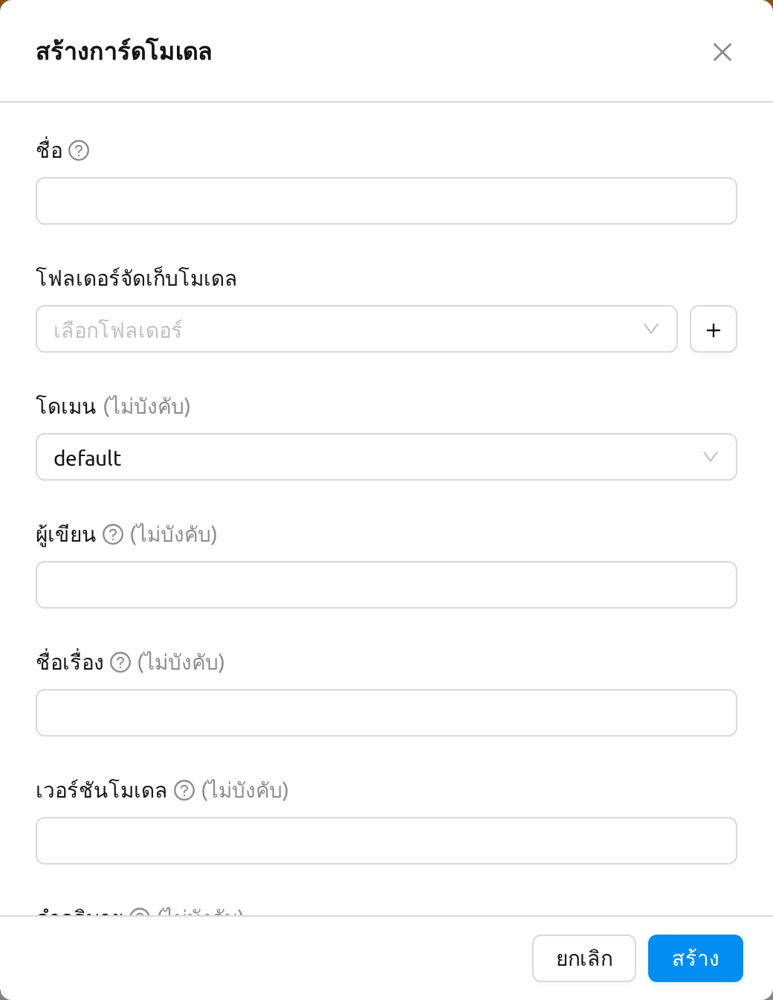

#### การแก้ไขการ์ดโมเดล

คลิกไอคอนแก้ไขถัดจากชื่อการ์ดโมเดลเพื่อแก้ไขการ์ดโมเดลที่มีอยู่ โมดอลแก้ไขจะเปิดขึ้นพร้อมฟิลด์ที่ป้อนไว้ก่อนหน้านี้ เช่นเดียวกับโมดอลการสร้าง ฟิลด์ **ป้ายกำกับ (Label)** จะรับหลายแท็กโดยคั่นด้วย **เครื่องหมายจุลภาค (comma)** และฟิลด์ **โดเมน (Domain)** จะถูกเติมไว้ล่วงหน้าตามโดเมนปัจจุบัน

#### การลบการ์ดโมเดล

คุณสามารถลบการ์ดโมเดลแต่ละรายการโดยคลิกไอคอนลบถัดจากชื่อการ์ด หรือทำการลบจำนวนมากโดยเลือกการ์ดโมเดลหลายรายการด้วยช่องทำเครื่องหมาย จากนั้นคลิกปุ่มถังขยะสีแดงถัดจากจำนวนที่เลือก

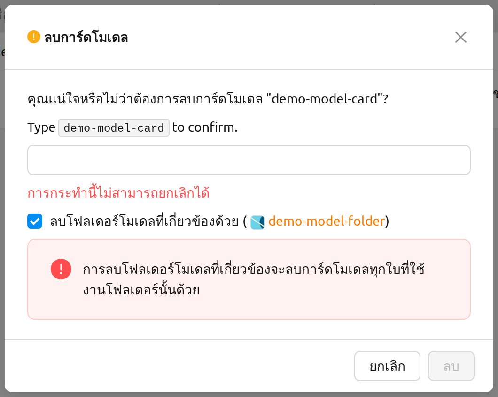

กล่องโต้ตอบยืนยันการลบมีตัวเลือก **ลบโฟลเดอร์โมเดลที่เกี่ยวข้องด้วย** ด้วย:

- เมื่อเลือกตัวเลือกนี้ ระบบจะย้ายโฟลเดอร์จัดเก็บ (vfolder) ที่เชื่อมโยงกับการ์ดโมเดลไปยังถังขยะพร้อมกับการลบการ์ดโมเดล การแจ้งเตือนของถังขยะจะปรากฏขึ้นเพื่อให้ผู้ดูแลระบบขั้นสูงยืนยันว่าโฟลเดอร์ที่เชื่อมโยงถูกส่งไปยังถังขยะแล้ว และสามารถกู้คืนโฟลเดอร์ได้จาก **Data > ขยะ** หากจำเป็น โปรดทราบว่าการลบโฟลเดอร์ที่เชื่อมโยงจะลบการ์ดโมเดลทุกใบที่ใช้งานโฟลเดอร์เดียวกันนั้นด้วย
- เมื่อไม่เลือกตัวเลือกนี้ ระบบจะลบเฉพาะข้อมูลการ์ดโมเดลเท่านั้น โดยโฟลเดอร์จัดเก็บที่เชื่อมโยงจะยังคงอยู่และสามารถนำไปใช้กับการ์ดโมเดลอื่นได้

พฤติกรรมเดียวกันนี้ใช้กับ **การลบจำนวนมาก** ด้วย (ป้ายตัวเลือกจะเปลี่ยนเป็น **ลบโฟลเดอร์โมเดลที่เกี่ยวข้องทั้งหมดด้วย**) เมื่อเลือกตัวเลือกนี้ โฟลเดอร์จัดเก็บที่เชื่อมโยงกับการ์ดโมเดลแต่ละรายการที่เลือกจะถูกย้ายไปยังถังขยะ และจะมีการแจ้งเตือนของถังขยะแสดงขึ้นสำหรับโฟลเดอร์แต่ละโฟลเดอร์ที่ถูกย้าย

## Prometheus Query Preset

Backend.AI ช่วยให้ผู้ดูแลระบบสามารถกำหนด **พรีเซตคำสั่ง Prometheus** ที่นำกลับมาใช้ใหม่ได้ ซึ่งกฎ Auto Scaling และฟีเจอร์การมอนิเตอร์อื่น ๆ สามารถอ้างอิงด้วยชื่อพรีเซตได้ พรีเซตหนึ่ง ๆ จะรวมชื่อเมตริก เทมเพลตคำสั่ง PromQL ช่วงเวลาที่เลือกได้ และป้ายกำกับตัวกรอง / ป้ายกำกับกลุ่มที่เลือกได้เข้าไว้ด้วยกัน เพื่อให้ผู้ปฏิบัติงานไม่ต้องพิมพ์คำสั่งเดิมซ้ำสำหรับแต่ละกฎ

พรีเซตเหล่านี้จัดการได้จากแท็บ **Prometheus Preset** บนหน้า การปรับใช้ของผู้ดูแลระบบ (`/admin-deployments?tab=prometheus-preset`)

:::note[เฉพาะ Superadmin: ตัวอย่างสดในตัวแก้ไขกฎ Auto Scaling]
เมื่อ Superadmin เปิดตัวแก้ไขกฎ Auto Scaling สำหรับการปรับใช้ ตั้งค่า **แหล่งที่มาของเมตริก** เป็น `Prometheus` และเลือกพรีเซ็ต จะมีตัวอย่างสด **ค่าปัจจุบัน (Current value)** แสดงด้านล่างตัวเลือกพรีเซ็ต แสดงค่าเมตริกล่าสุดจาก Prometheus ตัวอย่างนี้มองเห็นได้เฉพาะบัญชี Superadmin เท่านั้น — ผู้ใช้ทั่วไปและผู้ดูแลระบบโดเมนจะไม่เห็น
:::

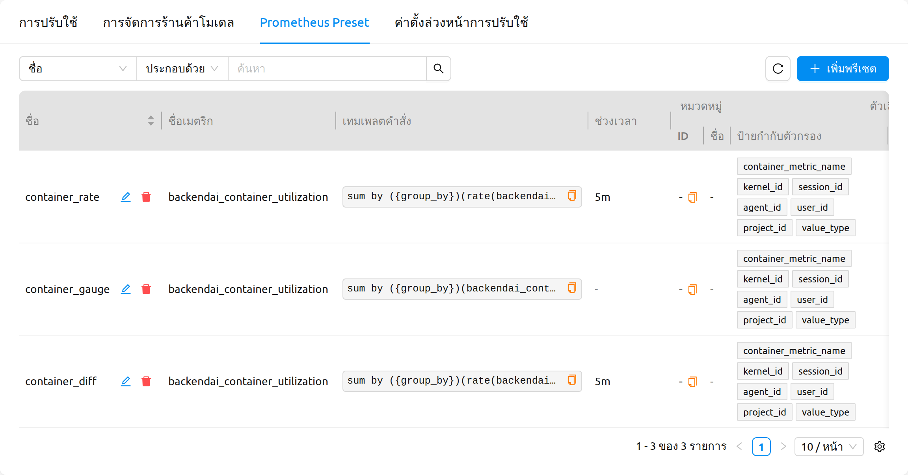

### รายการและตัวกรอง

ตารางพรีเซตจะแสดงพรีเซตคำสั่ง Prometheus ทั้งหมดในคลัสเตอร์ แต่ละแถวจะแสดงข้อมูลต่อไปนี้

- **ชื่อ**: ตัวระบุพรีเซตที่ไม่ซ้ำกันและอ่านง่ายสำหรับมนุษย์ เซลล์นี้ยังมีการกระทำแบบอินไลน์ **แก้ไข** และ **ลบ** ด้วย
- **ID**: ตัวระบุภายในของพรีเซต
- **ชื่อเมตริก**: เมตริกที่พรีเซตนี้รายงาน (ใช้เป็นป้ายแสดงผลโดยผู้บริโภค เช่น กฎ Auto Scaling)
- **เทมเพลตคำสั่ง**: นิพจน์ PromQL ที่จะถูกเรียกใช้ เซลล์นี้ **คัดลอกได้** โดยวางเมาส์เหนือค่าแล้วคลิกไอคอนคัดลอกเพื่อคัดลอกเทมเพลตทั้งหมดไปยังคลิปบอร์ด มีประโยชน์เมื่อต้องการวางเทมเพลตในหน้า Prometheus UI เพื่อตรวจสอบผลลัพธ์
- **ช่วงเวลา**: ช่วงเวลามองย้อนกลับเริ่มต้น (เช่น `5m`) ที่ใช้เมื่อคำสั่งอ้างอิง range vector
- **หมวดหมู่**: หมวดหมู่ที่เลือกได้ที่พรีเซตอยู่ (พร้อมชื่อหมวดหมู่ที่แก้ค่าแล้วและรหัสหมวดหมู่)
- **ตัวเลือก**: **ป้ายกำกับตัวกรอง** และ **ป้ายกำกับกลุ่ม** ที่เลือกได้ ซึ่งผู้บริโภคสามารถนำมาใช้บนพรีเซตได้
- **สร้างเมื่อ** / **อัปเดตเมื่อ**: ตราเวลาที่เซิร์ฟเวอร์ดูแลให้โดยอัตโนมัติ

คุณสามารถค้นหาและจำกัดรายการได้ด้วยตัวกรองคุณสมบัติด้านบนของตาราง และคลิกหัวคอลัมน์ใด ๆ เพื่อเปลี่ยนลำดับการเรียง

### การจดจำการตั้งค่าคอลัมน์

ตารางมีตัวควบคุมการตั้งค่าคอลัมน์ที่ให้คุณซ่อนคอลัมน์ที่ไม่ต้องการและจัดลำดับคอลัมน์ที่แสดงใหม่ได้ ตัวเลือกของคุณจะ **คงอยู่ข้ามเซสชัน** ต่อเบราว์เซอร์ ดังนั้นตารางจะเปิดขึ้นด้วยเลย์เอาต์ที่คุณต้องการในครั้งถัดไปที่คุณเยี่ยมชมแท็บนี้ การรีเซ็ตการตั้งค่าคอลัมน์จะคืนค่ากลับเป็นเลย์เอาต์เริ่มต้นของ Backend.AI

### สร้างพรีเซต

คลิก **เพิ่มพรีเซต** ที่ด้านบนขวาของตารางเพื่อเปิดโมดอล **สร้างพรีเซต**

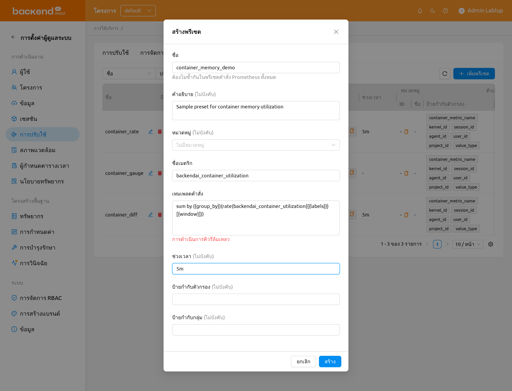

โมดอลประกอบด้วยฟิลด์ต่อไปนี้

- **ชื่อ**: ชื่อที่ไม่ซ้ำกันของพรีเซต ต้องไม่ซ้ำกันในพรีเซตคำสั่ง Prometheus ทั้งหมด
- **คำอธิบาย**: คำอธิบายแบบอิสระที่แสดงควบคู่กับพรีเซตในตัวเลือก
- **หมวดหมู่**: หมวดหมู่ที่เลือกได้สำหรับจัดกลุ่มพรีเซตที่เกี่ยวข้อง ปล่อยว่างเพื่อให้เป็น **ไม่มีหมวดหมู่**
- **ชื่อเมตริก**: ป้ายเมตริกที่ผู้บริโภค (เช่น กฎ Auto Scaling) จะแสดง
- **เทมเพลตคำสั่ง**: นิพจน์ PromQL ที่จะถูกเรียกใช้ ขณะที่คุณพิมพ์ พื้นที่ **ตัวอย่างแบบสด** ใต้ฟิลด์จะแสดงค่าที่เทมเพลตที่คุณกำลังเขียนตอบกลับจากอินสแตนซ์ Prometheus เพื่อให้คุณตรวจสอบได้ว่าเทมเพลตทำงานก่อนบันทึก ตัวอย่างถูก debounce และอัปเดตอัตโนมัติเมื่อคุณแก้ไข
- **ช่วงเวลา**: หน้าต่าง range vector เริ่มต้น เช่น `5m` ปล่อยว่างหากคำสั่งไม่ใช้ range vector
- **ป้ายกำกับตัวกรอง**: รายการตัวเลือกป้ายกำกับที่เลือกได้ ซึ่งผู้บริโภคสามารถนำมาใช้บนพรีเซตได้
- **ป้ายกำกับกลุ่ม**: รายการป้ายกำกับที่เลือกได้สำหรับจัดกลุ่มผลลัพธ์ของคำสั่ง

คลิก **สร้าง** เพื่อบันทึกพรีเซต เมื่อสำเร็จ พรีเซตจะปรากฏในรายการและจะแสดงทอสต์ยืนยัน

### แก้ไขพรีเซต

คลิกการกระทำ **แก้ไข** ในเซลล์ **ชื่อ** ของแถวพรีเซตเพื่อเปิดโมดอล **แก้ไขพรีเซต** โมดอลจะถูกเติมล่วงหน้าด้วยค่าปัจจุบันของพรีเซตและมีฟิลด์เดียวกันกับไดอะล็อกสร้าง รวมถึงพื้นที่ตัวอย่างแบบสดสำหรับเทมเพลตคำสั่ง

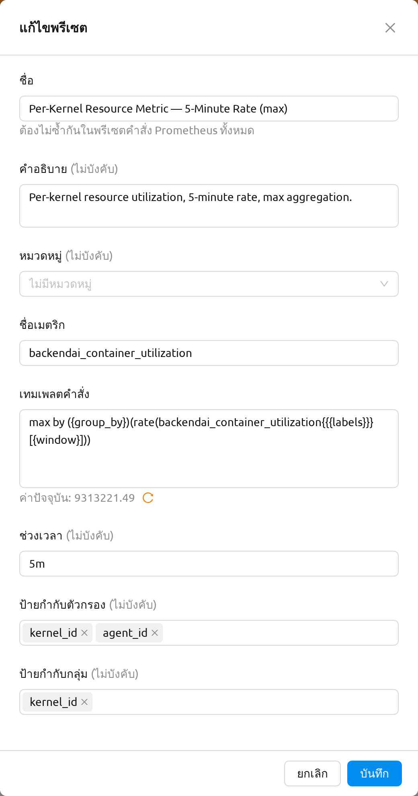

คลิก **บันทึก** เพื่อใช้การเปลี่ยนแปลงของคุณ ผู้บริโภคของพรีเซต (เช่น กฎ Auto Scaling ที่อ้างอิงพรีเซต) จะรับเทมเพลตคำสั่งใหม่โดยอัตโนมัติในครั้งถัดไปที่ประเมินเมตริก

### ลบพรีเซต

คลิกการกระทำ **ลบ** ในเซลล์ **ชื่อ** ของแถวพรีเซตเพื่อเปิดโมดอลยืนยันการลบ

:::danger
การลบพรีเซตคำสั่ง Prometheus เป็นการกระทำ **ถาวรและไม่สามารถยกเลิกได้** กฎ Auto Scaling และฟีเจอร์อื่น ๆ ที่อ้างอิงพรีเซตที่ลบจะสูญเสียเทมเพลตคำสั่งและอาจหยุดทำงานจนกว่าจะถูกกำหนดค่าใหม่ให้ชี้ไปยังพรีเซตอื่น
:::

เนื่องจากการลบไม่สามารถย้อนกลับได้ ไดอะล็อกจึงกำหนดให้คุณ **พิมพ์ชื่อพรีเซต** ลงในช่องป้อนยืนยันก่อนที่ปุ่ม **ลบ** จะถูกเปิดใช้งาน พิมพ์ชื่อพรีเซตที่แสดงในชื่อไดอะล็อกให้ตรงและคลิก **ลบ** เพื่อยืนยัน

## พรีเซ็ตการดีพลอย

**พรีเซ็ตการดีพลอย (Deployment Preset)** คือชุดค่าตั้งต้นที่ใช้ซ้ำได้สำหรับการดีพลอยโมเดล โดยรวมถึง image, runtime, resource slots, cluster mode, environment variables, startup command, จำนวน replica, ระดับการเผยแพร่ และค่าเริ่มต้นอื่น ๆ ผู้ดูแลระบบเป็นผู้กำหนดพรีเซ็ตเหล่านี้ไว้ล่วงหน้า เพื่อให้ผู้ใช้ทั่วไปนำไปใช้ได้ตอนสร้าง deployment ของโมเดลจากโฟลเดอร์จัดเก็บ ผู้ดูแลระบบสามารถเผยแพร่ชุดรูปแบบการดีพลอยที่ผ่านการตรวจสอบแล้ว เช่น *vLLM-GPU-Large* หรือ *SGLang-CPU-Small* เพื่อให้ผู้ใช้สามารถดีพลอยโมเดลได้โดยไม่ต้องเลือกฟิลด์ขั้นสูงทุกตัวเอง

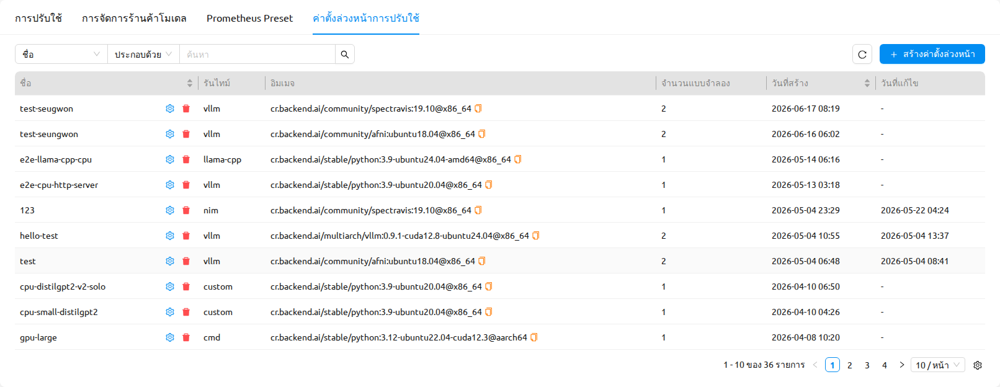

### พรีเซ็ตการดีพลอยคืออะไร

พรีเซ็ตการดีพลอยเก็บค่าเริ่มต้นของการดีพลอยโมเดลไว้เพื่อให้:

- **ผู้ดูแลระบบ** สามารถจัดเตรียมแคตาล็อกของรูปแบบการดีพลอยที่ผ่านการตรวจสอบและสอดคล้องกับฮาร์ดแวร์และนโยบายขององค์กรให้กับผู้ใช้
- **ผู้ใช้ทั่วไป** เลือกพรีเซ็ตได้ขณะดีพลอยโมเดลจากหน้า Data ผ่านขั้นตอน *สร้าง Deployment ใหม่ด้วย Preset* โดยไม่ต้องกรอกฟิลด์ขั้นสูงด้วยตนเอง
- **ผู้ดูแลการใช้งาน** มั่นใจได้ว่า deployment ที่ใช้ในงานจริงทั่วทั้งองค์กรใช้การจัดสรรทรัพยากร, runtime และค่าเริ่มต้นด้านการเผยแพร่ที่สอดคล้องกัน

เมื่อสร้าง deployment จากพรีเซ็ต ค่าของพรีเซ็ตจะถูกเติมในฟอร์ม deployment launcher โดยอัตโนมัติ ผู้ใช้สามารถตรวจสอบและแก้ไขค่าเหล่านี้ก่อนยืนยันการดีพลอย

แต่ละพรีเซ็ตจะเก็บข้อมูลต่อไปนี้:

- **ข้อมูลพื้นฐาน (Basic Info)**: ชื่อ คำอธิบาย runtime, runtime parameters (สำหรับ runtime ที่ไม่ใช่ Custom) และอิมเมจ
- **ทรัพยากร (Resources)**: resource slots (CPU, memory, GPU), หน่วยความจำที่แชร์ (SHM) และตัวเลือกทรัพยากร
- **คลัสเตอร์ (Cluster)**: cluster mode (Single-Node หรือ Multi-Node) และขนาดคลัสเตอร์
- **การเรียกใช้งาน (Execution)**: startup command, environment variables และ bootstrap script
- **ค่าเริ่มต้นของการดีพลอย (Deployment Defaults)**: จำนวน replica, จำนวน revision ที่เก็บไว้ และค่าเริ่มต้นของ *Open to Public*
- **คำจำกัดความโมเดล (Model Definition)** (ตัวเลือกเสริม): ชื่อโมเดล, path ของโมเดล, การตั้งค่าบริการ (พอร์ต, startup command, pre-start actions), การตั้งค่า health check และ metadata

### การจัดการพรีเซ็ตการดีพลอย

เฉพาะผู้ดูแลระบบเท่านั้นที่สามารถสร้าง แก้ไข หรือลบพรีเซ็ตการดีพลอยได้ ผู้ดูแลระบบจัดการพรีเซ็ตเหล่านี้ได้จากแท็บ **พรีเซ็ตการดีพลอย** ในหน้า การปรับใช้ของผู้ดูแลระบบ

มุมมองรายการจะแสดงแต่ละพรีเซ็ตพร้อมชื่อ, runtime, image, จำนวน replica, คอลัมน์ **สร้างเมื่อ (Created At)** และ **แก้ไขเมื่อ (Modified At)** ผู้ดูแลระบบสามารถทำสิ่งต่อไปนี้จากรายการนี้ได้:

- กรองพรีเซ็ตด้วยชื่อหรือ runtime
- เปิดหน้ารายละเอียดของพรีเซ็ตเพื่อดูการตั้งค่าทั้งหมด
- สร้าง แก้ไข หรือลบพรีเซ็ต

คอลัมน์เริ่มต้นที่แสดง ได้แก่ **ชื่อ (Name)**, **Runtime**, **อิมเมจ (Image)**, **จำนวน Replica (Replicas)**, **สร้างเมื่อ (Created At)** และ **แก้ไขเมื่อ (Modified At)** คอลัมน์เพิ่มเติม ได้แก่ **คำอธิบาย (Description)**, **คำสั่งเริ่มต้น (Startup Command)**, **คลัสเตอร์ (Cluster)**, **กลยุทธ์การดีพลอย (Strategy)**, **เปิดให้สาธารณะ (Open to Public)** และ **จำนวน Revision ที่เก็บไว้ (Revision History Limit)** จะถูกซ่อนไว้โดยค่าเริ่มต้น คุณสามารถแสดงหรือซ่อนคอลัมน์เหล่านี้ได้โดยคลิกไอคอนรูปเฟือง (gear) ที่ส่วนหัวของตารางเพื่อเปิดตัวจัดการคอลัมน์

#### สร้างพรีเซ็ตการดีพลอย

คลิกปุ่ม **สร้างค่าตั้งล่วงหน้า** ที่มุมขวาบนของรายการพรีเซ็ตเพื่อเปิดไดอะล็อก *สร้างค่าตั้งล่วงหน้า* ฟอร์มจะถูกจัดเป็นการ์ดหลายใบ ดังนี้:

- **ข้อมูลพื้นฐาน (Basic Info)**:
   * **ชื่อ (Name)** (จำเป็น): ชื่อพรีเซ็ตที่ไม่ซ้ำกัน (เช่น `vLLM-GPU-Large`)
   * **คำอธิบาย (Description)**: สรุปสั้น ๆ เกี่ยวกับการใช้งานพรีเซ็ตนี้
   * **Runtime** (จำเป็น): runtime variant (เช่น vLLM, SGLang หรือ Custom)
   * **พารามิเตอร์ Runtime (Runtime Parameters)**: ส่วนนี้จะปรากฏเมื่อเลือก runtime variant ที่ไม่ใช่ Custom พารามิเตอร์จะถูกจัดเป็นหลายแท็บ ได้แก่ **Model Loading**, **Resource Memory** และ **Serving Performance** เพื่อให้กำหนดค่าได้ง่ายขึ้น พารามิเตอร์ที่จำเป็นจะมีเครื่องหมายดอกจันสีแดง (`*`) กำกับ และฟอร์มจะไม่อนุญาตให้ส่งหากฟิลด์ที่จำเป็นเหล่านั้นว่างเปล่า
   * **อิมเมจ (Image)** (จำเป็น): คอนเทนเนอร์อิมเมจที่จะใช้ดีพลอย
- **ทรัพยากร (Resources)**: resource slots (CPU, memory, GPU), หน่วยความจำที่แชร์ (shared memory) และตัวเลือกทรัพยากร (คู่ key/value)
- **คลัสเตอร์ (Cluster)**: cluster mode (Single-Node หรือ Multi-Node) และขนาดคลัสเตอร์
- **โมเดลและการเรียกใช้งาน (Model & Execution)**: startup command, bootstrap script และ environment variables ฟิลด์ **คำสั่งเริ่มต้น (Startup Command)** จะแสดงคำใบ้ไวยากรณ์เชลล์ คำสั่งจะถูกเรียกใช้งานในรูปแบบ `/bin/bash -c <command>` คุณจึงสามารถใช้ไวยากรณ์ของเชลล์ เช่น การคั่นคำสั่งหลายคำสั่งด้วย `;` ได้
- **คำจำกัดความโมเดล (Model Definition)** (toggle): เปิดใช้งานด้วย toggle เพื่อกำหนดค่า model definition แบบมีโครงสร้าง เมื่อเปิดใช้งานจะสามารถตั้งค่าได้ดังนี้:
   * **ชื่อโมเดล** และ **Path ของโมเดล**: ตัวระบุโมเดลและตำแหน่งของโมเดลในคอนเทนเนอร์
   * **การตั้งค่าบริการ (Service Configuration)**: พอร์ต, shell, startup command และ pre-start actions
   * **การตรวจสอบสุขภาพ (Health Check)**: ส่วนนี้มี toggle **เปิดใช้การตรวจสอบสุขภาพ (Enable Health Check)** ซึ่งตั้งค่าเริ่มต้นเป็น **ปิด (OFF)** เมื่อปิดอยู่ ฟิลด์การตรวจสอบสุขภาพจะถูกซ่อนไว้ เมื่อเปิด toggle นี้ ฟิลด์ทั้งหมดจะปรากฏขึ้น ได้แก่ path, interval, จำนวนครั้งสูงสุดที่ลองใหม่, เวลารอสูงสุด, status code ที่คาดหวัง และ startup grace period
   * **Metadata**: ผู้แต่ง, ชื่อ, เวอร์ชัน, task, หมวดหมู่ และข้อมูลอื่น ๆ
- **การดีพลอย (Deployment)**:
   * **จำนวน Replica (Replica Count)** (จำเป็น): จำนวน replica เริ่มต้นสำหรับ deployment ที่สร้างจากพรีเซ็ตนี้
   * **จำนวน Revision ที่เก็บไว้ (Revision History Limit)**: จำนวน revision ก่อนหน้าที่ถูกเก็บไว้สำหรับแต่ละ deployment ที่สร้างจากพรีเซ็ตนี้
   * **Open to Public**: ช่องทำเครื่องหมายที่กำหนดค่าเริ่มต้นว่า endpoint ของ deployment ที่สร้างจากพรีเซ็ตนี้สามารถเข้าถึงได้โดยไม่ต้องใช้ access token หรือไม่

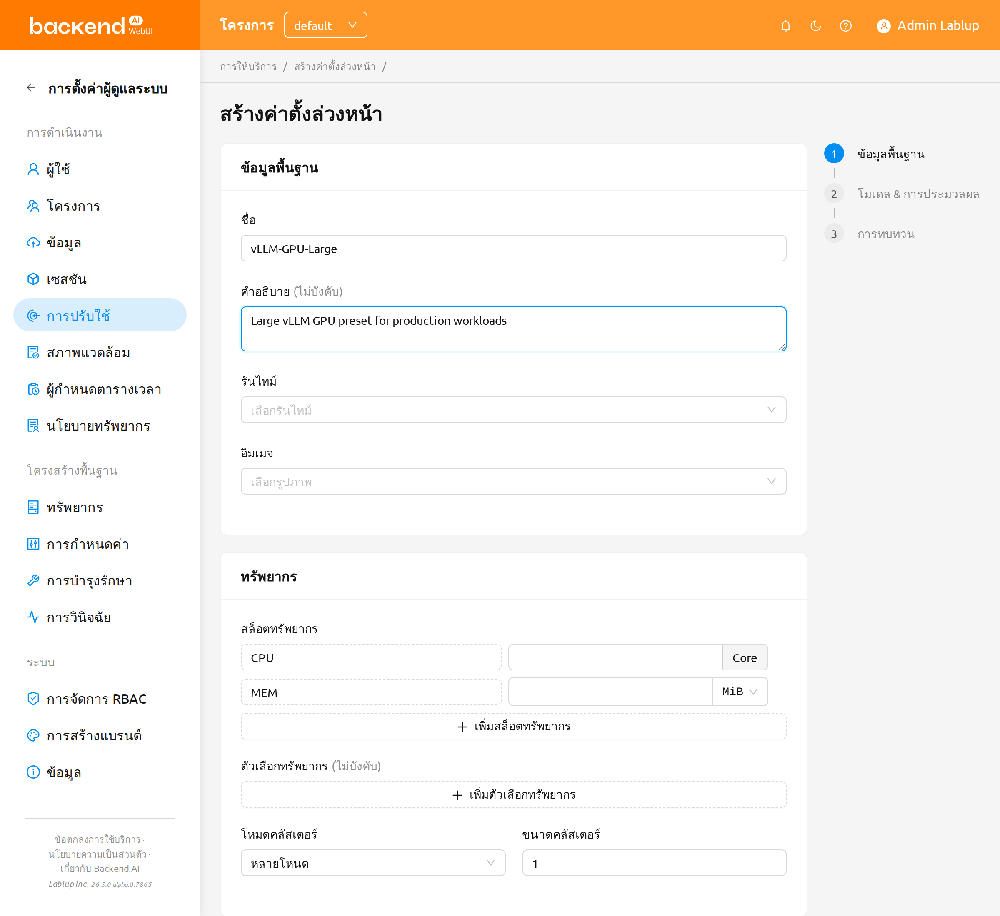

เมื่อกรอกฟิลด์ครบแล้ว ให้คลิก **สร้างค่าตั้งล่วงหน้า** เพื่อบันทึก ระบบจะแสดงการแจ้งเตือนเมื่อสร้างพรีเซ็ตสำเร็จ

:::tip
หากฟิลด์ที่จำเป็นว่างเปล่าหรือมีค่าที่ไม่ถูกต้อง ปุ่ม **สร้างค่าตั้งล่วงหน้า** จะยังคงถูกปิดใช้งานจนกว่าจะแก้ไขข้อผิดพลาด ฟิลด์ที่จำเป็นจะแสดงข้อความตรวจสอบความถูกต้องในตำแหน่งของฟิลด์ขณะที่คุณพิมพ์
:::

#### แก้ไขพรีเซ็ตการดีพลอย

1. จากรายการพรีเซ็ต ให้เปิดเมนูการกระทำของแถวพรีเซ็ต (หรือเปิดหน้ารายละเอียดของพรีเซ็ต) แล้วเลือก **แก้ไขค่าตั้งล่วงหน้า**
2. ไดอะล็อก *แก้ไขค่าตั้งล่วงหน้า* จะเปิดขึ้นพร้อมเติมค่าปัจจุบันของพรีเซ็ตไว้ล่วงหน้า ส่วนต่าง ๆ ที่ใช้ได้จะเหมือนกับไดอะล็อก *สร้างค่าตั้งล่วงหน้า*
3. ปรับค่าตามต้องการ แล้วคลิก **แก้ไขค่าตั้งล่วงหน้า** เพื่อบันทึก

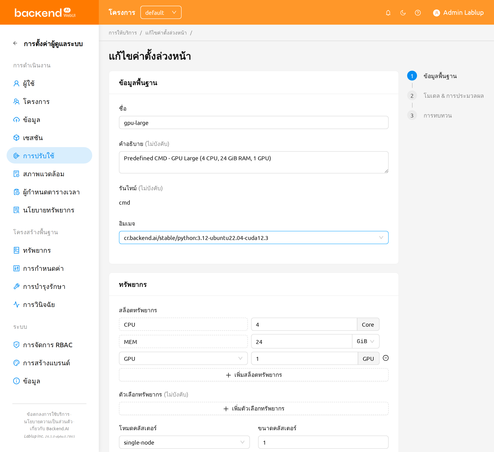

การแก้ไขพรีเซ็ตจะเปลี่ยนเฉพาะค่าเริ่มต้นของ deployment ที่จะสร้าง **ในอนาคต** เท่านั้น deployment ที่สร้างจากพรีเซ็ตนี้อยู่แล้วจะไม่ถูกแก้ไข

#### ลบพรีเซ็ตการดีพลอย

1. จากรายการพรีเซ็ต (หรือหน้ารายละเอียดของพรีเซ็ต) ให้เปิดเมนูการกระทำของพรีเซ็ต แล้วเลือก **ลบค่าตั้งล่วงหน้า**
2. ไดอะล็อกยืนยันแบบพิมพ์ชื่อจะปรากฏขึ้นและขอให้คุณพิมพ์ชื่อพรีเซ็ตเพื่อยืนยัน ปุ่ม **OK** จะถูกปิดใช้งานจนกว่าค่าที่พิมพ์จะตรงกับชื่อพรีเซ็ตอย่างถูกต้องทุกประการ
3. พิมพ์ชื่อพรีเซ็ต แล้วคลิก **OK** เพื่อยืนยัน

:::danger
การลบพรีเซ็ตการดีพลอย **ไม่สามารถย้อนกลับได้** ตัวพรีเซ็ตจะถูกลบออก แต่ deployment ที่ถูกสร้างจากพรีเซ็ตไปแล้วจะยังคงทำงานต่อโดยไม่ได้รับผลกระทบ การดีพลอยในอนาคตจะไม่สามารถอ้างอิงพรีเซ็ตนี้ได้อีก
:::

### การใช้พรีเซ็ตเมื่อดีพลอยโมเดล

ผู้ใช้ทั่วไปจะใช้พรีเซ็ตการดีพลอยผ่านโมดอล **สร้าง Deployment ใหม่ด้วย Preset** ซึ่งจะเปิดขึ้นเมื่อคุณดีพลอยโมเดลจากโฟลเดอร์จัดเก็บในหน้า Data

1. ในหน้า Data ค้นหาโฟลเดอร์โมเดลที่ต้องการดีพลอย
2. คลิกปุ่ม **ปรับใช้ (Deploy)** ในแถวของโฟลเดอร์
3. โมดอล **สร้าง Deployment ใหม่ด้วย Preset** จะเปิดขึ้น เลือกพรีเซ็ตการดีพลอยที่จะนำไปใช้และกลุ่มทรัพยากรเป้าหมาย
4. หากต้องการตรวจสอบการกำหนดค่าของพรีเซ็ตก่อนดีพลอย ให้คลิกปุ่ม **ⓘ** (Info) ถัดจากตัวเลือกพรีเซ็ตเพื่อเปิดมุมมอง **รายละเอียดพรีเซ็ตการปรับใช้**

   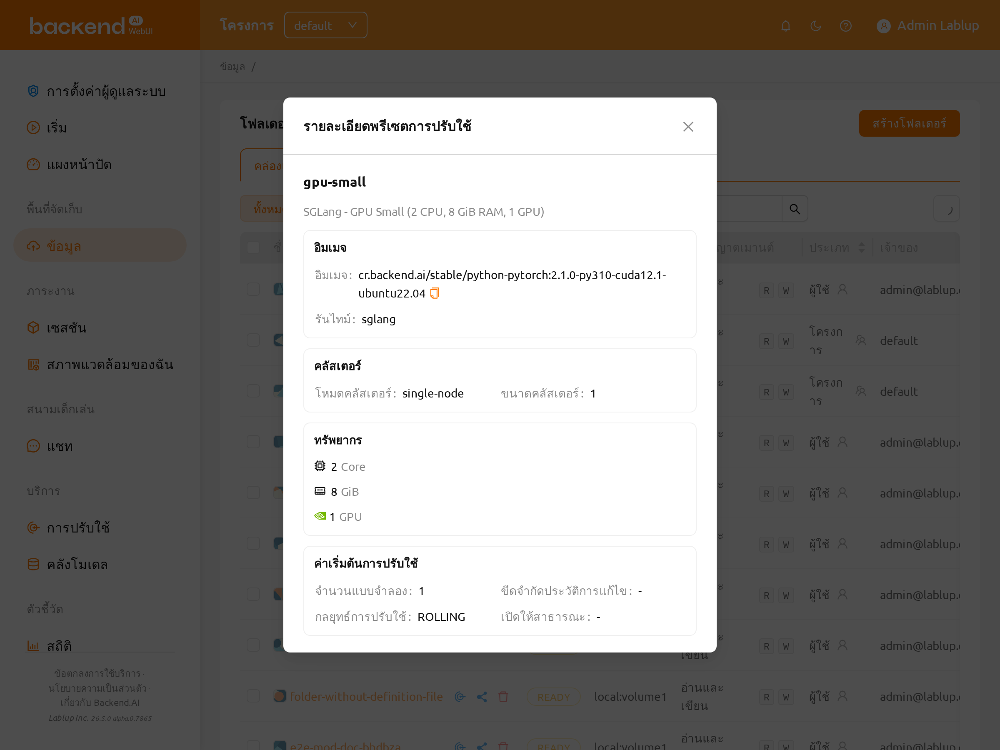

5. คลิก **OK** เพื่อสร้าง deployment โดยใช้ค่าของพรีเซ็ตที่เลือก

หากต้องการกำหนดค่าขั้นสูง ให้ไปที่หน้า Deployments แล้วสร้าง deployment ใหม่ด้วยตนเอง โมดอลการเพิ่ม revision มีสองโหมด ได้แก่ **Preset Mode** (นำพรีเซ็ตไปใช้โดยตรง) และ **Advanced Mode** ซึ่งจะเปิด deployment launcher โดยเติมค่าของพรีเซ็ตไว้ล่วงหน้า ทำให้คุณสามารถตรวจสอบและปรับแต่งทุกฟิลด์ก่อนยืนยันได้ การแก้ไขฟิลด์ใน **Advanced Mode** **จะไม่** เปลี่ยนพรีเซ็ตต้นทาง แต่จะเปลี่ยนเฉพาะค่าที่ใช้สำหรับ deployment ครั้งนี้เท่านั้น

## จัดการนโยบายทรัพยากร

#### นโยบายทรัพยากรคีย์แพร์

ใน Backend.AI ผู้ดูแลระบบมีความสามารถในการกำหนดขีดจำกัดของทรัพยากรทั้งหมดที่พร้อมใช้งานสำหรับแต่ละคีย์แพร์ ผู้ใช้ และโปรเจกต์
นโยบายทรัพยากรช่วยให้คุณกำหนดทรัพยากรสูงสุดที่อนุญาตและการตั้งค่าอื่นๆ ที่เกี่ยวข้องกับเซสชันการคำนวณได้
นอกจากนี้ ยังสามารถสร้างนโยบายทรัพยากรหลายรายการสำหรับความต้องการที่แตกต่างกัน
เช่น ข้อกำหนดของผู้ใช้หรือการวิจัย และนำไปใช้เป็นรายบุคคลได้

หน้านโยบายทรัพยากรช่วยให้ผู้ดูแลระบบสามารถดูรายการของนโยบายทรัพยากรที่ลงทะเบียนทั้งหมด
ผู้ดูแลระบบสามารถตรวจสอบนโยบายทรัพยากรที่กำหนดไว้สำหรับคีย์แพร์ ผู้ใช้ และโปรเจกต์ได้โดยตรงในหน้านี้
มาเริ่มกันด้วยการตรวจสอบนโยบายทรัพยากรสำหรับคีย์แพร์ สัญลักษณ์อินฟินิตี้ (∞)
บ่งบอกว่าไม่มีข้อจำกัดทรัพยากรที่ใช้กับทรัพยากรเหล่านั้น

<!-- TODO: Re-capture resource_policy_page.png — needs update. -->

บัญชีผู้ใช้ที่ใช้ในคู่มือนี้ได้รับการกำหนดให้ใช้นโยบายทรัพยากร default ในปัจจุบัน
ซึ่งสามารถตรวจสอบได้ในแท็บข้อมูลประจำตัวของหน้าผู้ใช้
คุณยังสามารถยืนยันได้ว่านโยบายทรัพยากรทั้งหมดถูกตั้งค่าเป็น default ในแผงนโยบายทรัพยากร

หากต้องการแก้ไขนโยบายทรัพยากร ให้คลิก 'การตั้งค่า' ในคอลัมน์ชื่อ ของ
กลุ่มนโยบาย default ในกล่องโต้ตอบ Update Resource Policy ทุกตัวเลือก
สามารถแก้ไขได้ยกเว้นชื่อนโยบาย (Policy Name) ซึ่งทำหน้าที่เป็นคีย์หลักสำหรับ
แยกแยะนโยบายทรัพยากรในรายการ ยกเลิกการเลือกช่องทำเครื่องหมาย Unlimited
ที่ด้านล่างของ CPU, RAM และ fGPU และตั้งค่าขีดจำกัดทรัพยากรตามค่าที่ต้องการ
ตรวจสอบให้แน่ใจว่าทรัพยากรที่จัดสรรน้อยกว่าความจุฮาร์ดแวร์ทั้งหมด
ในกรณีนี้ ตั้งค่า CPU, RAM และ fGPU เป็น 2, 4 และ 1 ตามลำดับ
คลิกปุ่ม OK เพื่อนำนโยบายทรัพยากรที่อัปเดตไปใช้

สำหรับรายละเอียดของแต่ละตัวเลือกในกล่องโต้ตอบนโยบายทรัพยากร โปรดดูคำอธิบายด้านล่าง

- นโยบายทรัพยากร
  - CPU: ระบุจำนวนคอร์ CPU สูงสุด (ค่าสูงสุด: 512)
  - Memory: ระบุปริมาณหน่วยความจำสูงสุดเป็น GB ควรตั้งค่าหน่วยความจำให้ใหญ่เป็น
    สองเท่าของค่าสูงสุดของหน่วยความจำ GPU (ค่าสูงสุด: 1024)
  - CUDA-capable GPU: ระบุจำนวน GPU จริงสูงสุด หาก fractional GPU ถูกเปิดใช้งาน
    โดยเซิร์ฟเวอร์ การตั้งค่านี้จะไม่มีผล (ค่าสูงสุด: 64)
  - CUDA-capable GPU (fractional): Fractional GPU (fGPU) คือการแบ่ง GPU เดียวเป็น
    หลายพาร์ติชันเพื่อใช้ GPU ได้อย่างมีประสิทธิภาพ โปรดสังเกตว่าปริมาณ fGPU
    ขั้นต่ำที่ต้องการจะแตกต่างกันไปตามแต่ละอิมเมจ หาก fractional GPU ไม่ได้เปิดใช้งาน
    โดยเซิร์ฟเวอร์ การตั้งค่านี้จะไม่มีผล (ค่าสูงสุด: 256)

- Sessions
  - Cluster Size: ตั้งค่าขีดจำกัดสูงสุดของจำนวน multi-container หรือ
    multi-node ที่สามารถกำหนดค่าได้เมื่อสร้างเซสชัน
  - Session Lifetime (วินาที): จำกัดอายุการใช้งานสูงสุดของเซสชันการคำนวณ
    ตั้งแต่การจองในสถานะใช้งาน รวมถึงสถานะ `PENDING` และ
    `RUNNING` หลังจากเวลานี้ เซสชันจะถูกบังคับยุติ
    แม้ว่าจะใช้งานเต็มที่ สิ่งนี้มีประโยชน์ในการป้องกันเซสชัน
    จากการทำงานอย่างไม่มีกำหนด
  - Max Pending Session Count: จำนวนเซสชันการคำนวณสูงสุดที่สามารถอยู่ใน
    สถานะ `PENDING` พร้อมกันได้
  - Concurrent Jobs: จำนวนเซสชันการคำนวณพร้อมกันสูงสุดต่อคีย์แพร์
    ตัวอย่างเช่น หากตั้งค่าเป็น 3 ผู้ใช้ที่ผูกกับนโยบายทรัพยากรนี้
    ไม่สามารถสร้างเซสชันการคำนวณพร้อมกันเกิน 3 เซสชัน (ค่าสูงสุด: 100)
  - Idle timeout (วินาที): ช่วงเวลาที่สามารถกำหนดค่าได้ที่ผู้ใช้สามารถ
    ปล่อยเซสชันของตนไว้โดยไม่ได้แตะต้อง หากไม่มีกิจกรรมใดๆ บนเซสชัน
    การคำนวณเป็นเวลานานถึง idle timeout เซสชันจะถูก garbage collect
    และถูกทำลายโดยอัตโนมัติ เกณฑ์ของ "ความไม่ใช้งาน" สามารถเป็น
    ได้หลากหลายและกำหนดโดยผู้ดูแลระบบ (ค่าสูงสุด: 15552000 (ประมาณ 180 วัน))
  - Max Concurrent SFTP Sessions: จำนวนเซสชัน SFTP พร้อมกันสูงสุด

- โฟลเดอร์
  - Allowed hosts: Backend.AI รองรับ NFS mountpoint หลายตัว ฟิลด์นี้จำกัด
    ความสามารถในการเข้าถึง แม้ว่าจะมี NFS ชื่อ "data-1" ที่เมาท์อยู่
    บน Backend.AI ผู้ใช้ก็ไม่สามารถเข้าถึงได้เว้นแต่จะได้รับอนุญาตโดยนโยบายทรัพยากร
  - (เลิกใช้แล้ว) Max. #: จำนวนโฟลเดอร์จัดเก็บสูงสุดที่
    สามารถสร้าง/เชิญได้ (ค่าสูงสุด: 100)

ในรายการนโยบายทรัพยากรคีย์แพร์ ตรวจสอบว่าค่า Resources ของนโยบาย default
ถูกอัปเดตแล้ว

คุณสามารถสร้างนโยบายทรัพยากรใหม่ได้โดยคลิกปุ่ม '+ Create' ค่าการตั้งค่าแต่ละค่า
เหมือนกับที่อธิบายไว้ข้างต้น

หากต้องการสร้างนโยบายทรัพยากรและเชื่อมโยงกับคีย์แพร์ ให้ไปที่แท็บ
ข้อมูลประจำตัวของหน้าผู้ใช้ คลิกปุ่มเฟืองที่อยู่ใน
คอลัมน์ชื่อ ของคีย์แพร์ที่ต้องการ และคลิกฟิลด์ Select Policy เพื่อ
เลือกนโยบาย

เมื่อเลือกนโยบายทรัพยากรคีย์แพร์สำหรับผู้ใช้รายใดรายหนึ่ง ตารางการเลือกจะมีคอลัมน์
**คีย์แพร์ ที่กำหนด** ซึ่งแสดงว่าคีย์แพร์ใดของผู้ใช้ที่กำลังผูกกับแต่ละนโยบายในขณะนี้
เพื่อให้คุณสามารถยืนยันการกำหนดที่มีอยู่ของผู้ใช้ก่อนเลือกนโยบายได้

คุณยังสามารถลบคีย์แพร์ทรัพยากรแต่ละรายการได้โดยคลิกไอคอนถังขยะ
ในคอลัมน์ชื่อ เมื่อคุณคลิกไอคอน ป๊อปอัปยืนยันจะปรากฏขึ้น
คลิกปุ่ม 'Delete' เพื่อลบ

<!-- TODO: Re-capture resource_policy_delete_dialog.png — needs update. -->

:::note
หากมีผู้ใช้ (รวมถึงผู้ใช้ที่ไม่ได้ใช้งาน) ที่ใช้นโยบายทรัพยากรที่ต้องการลบ
การลบอาจไม่สำเร็จ ก่อนลบนโยบายทรัพยากร โปรดตรวจสอบให้แน่ใจว่า
ไม่มีผู้ใช้เหลืออยู่ภายใต้นโยบายทรัพยากรนั้น
:::

หากคุณต้องการซ่อนหรือแสดงคอลัมน์เฉพาะ ให้คลิก 'การตั้งค่า' ที่มุมล่างขวาของ
ตาราง สิ่งนี้จะแสดงกล่องโต้ตอบที่คุณสามารถเลือกคอลัมน์ที่ต้องการแสดงได้

<!-- TODO: Re-capture keypair_resource_policy_table_setting.png — needs update. -->

#### นโยบายทรัพยากรผู้ใช้

Backend.AI รองรับการจัดการนโยบายทรัพยากรผู้ใช้ แม้ว่าผู้ใช้แต่ละคน
สามารถมีคีย์แพร์หลายรายการได้ แต่ผู้ใช้สามารถมีนโยบายทรัพยากรผู้ใช้ได้เพียงนโยบายเดียว
ในหน้านโยบายทรัพยากรผู้ใช้ ผู้ใช้สามารถตั้งข้อจำกัดในการตั้งค่าต่างๆ ที่เกี่ยวข้องกับโฟลเดอร์ เช่น
Max Folder Count และ Max Folder Size รวมถึงขีดจำกัดทรัพยากรแต่ละรายการเช่น Max Session
Count Per Model Session และ Max Customized Image Count

หากต้องการสร้างนโยบายทรัพยากรผู้ใช้ใหม่ ให้คลิกปุ่ม Create

- Name: ชื่อของนโยบายทรัพยากรผู้ใช้
- Max Folder Count: จำนวนโฟลเดอร์สูงสุดที่ผู้ใช้สามารถสร้างได้
  หากจำนวนโฟลเดอร์ของผู้ใช้เกินค่านี้ ผู้ใช้จะไม่สามารถสร้างโฟลเดอร์ใหม่ได้
  หากตั้งค่าเป็น Unlimited จะแสดงเป็น "∞"
- Max Folder Size: ขนาดสูงสุดของพื้นที่จัดเก็บของผู้ใช้ หาก
  พื้นที่จัดเก็บของผู้ใช้เกินค่านี้ ผู้ใช้จะไม่สามารถสร้างโฟลเดอร์
  จัดเก็บใหม่ได้ หากตั้งค่าเป็น Unlimited จะแสดงเป็น "∞"
- Max Session Count Per Model Session: จำนวนเซสชันสูงสุดที่พร้อมใช้งานต่อ model
  service ที่สร้างโดยผู้ใช้ การเพิ่มค่านี้อาจทำให้ session scheduler
  มีภาระงานหนักและอาจทำให้ระบบหยุดทำงาน ดังนั้นโปรดระมัดระวังเมื่อ
  ปรับการตั้งค่านี้
- Max Customized Image Count: จำนวนอิมเมจที่ปรับแต่งสูงสุดที่
  ผู้ใช้สามารถสร้างได้ หากจำนวนอิมเมจที่ปรับแต่งของผู้ใช้เกินค่านี้
  ผู้ใช้จะไม่สามารถสร้างอิมเมจที่ปรับแต่งใหม่ได้ หากคุณต้องการทราบข้อมูลเพิ่มเติมเกี่ยวกับ
  อิมเมจที่ปรับแต่ง โปรดดูที่ส่วน [My Environments](#my-environments)

หากต้องการอัปเดต ให้คลิกปุ่ม 'การตั้งค่า' ในคอลัมน์ชื่อ หากต้องการลบ ให้คลิกปุ่ม
ถังขยะ

:::note
การเปลี่ยนแปลงนโยบายทรัพยากรอาจส่งผลกระทบต่อผู้ใช้ทั้งหมดที่ใช้นโยบายนั้น ดังนั้นโปรดใช้
ด้วยความระมัดระวัง
:::

เช่นเดียวกับนโยบายทรัพยากรคีย์แพร์ ผู้ใช้สามารถเลือกและแสดงเฉพาะคอลัมน์ที่ต้องการโดย
คลิกปุ่ม 'การตั้งค่า' ที่มุมล่างขวาของตาราง

#### นโยบายทรัพยากรโปรเจกต์

Backend.AI รองรับการจัดการนโยบายทรัพยากรโปรเจกต์ นโยบายทรัพยากรโปรเจกต์จัดการพื้นที่จัดเก็บ (โควตา) และข้อจำกัดที่เกี่ยวข้องกับโฟลเดอร์สำหรับโปรเจกต์

เมื่อคลิกแท็บ 'โปรเจกต์' ของหน้า 'นโยบายทรัพยากร' คุณจะเห็นรายการนโยบายทรัพยากรโปรเจกต์

<!-- TODO: Re-capture project_resource_policy_list.png — needs update. -->

หากต้องการสร้างนโยบายทรัพยากรโปรเจกต์ใหม่ ให้คลิกปุ่ม '+ สร้าง' ที่มุมบนขวาของตาราง

- **ชื่อ**: ชื่อของนโยบายทรัพยากรโปรเจกต์
- **จำนวนโฟลเดอร์สูงสุด**: จำนวนโฟลเดอร์โปรเจกต์สูงสุดที่ผู้ดูแลระบบสามารถสร้างได้ หากจำนวนโฟลเดอร์โปรเจกต์เกินค่านี้ ผู้ดูแลระบบจะไม่สามารถสร้างโฟลเดอร์โปรเจกต์ใหม่ได้ หากตั้งค่าเป็น Unlimited จะแสดงเป็น "∞"
- **ขนาดโฟลเดอร์สูงสุด**: ขนาดสูงสุดของพื้นที่จัดเก็บโปรเจกต์ หากพื้นที่จัดเก็บเกินค่านี้ ผู้ดูแลระบบจะไม่สามารถสร้างโฟลเดอร์โปรเจกต์ใหม่ได้ หากตั้งค่าเป็น Unlimited จะแสดงเป็น "∞"
- **จำนวนเครือข่ายสูงสุด**: จำนวนเครือข่ายสูงสุดที่สามารถสร้างสำหรับโปรเจกต์ได้ หากตั้งค่าเป็น Unlimited จะแสดงเป็น "∞"

ความหมายของแต่ละฟิลด์คล้ายกับนโยบายทรัพยากรผู้ใช้ ความแตกต่างคือนโยบายทรัพยากรโปรเจกต์จะใช้กับโฟลเดอร์โปรเจกต์ ในขณะที่นโยบายทรัพยากรผู้ใช้จะใช้กับโฟลเดอร์ผู้ใช้

หากต้องการเปลี่ยนแปลง ให้คลิกปุ่ม 'การตั้งค่า' ในคอลัมน์ชื่อ ชื่อนโยบายทรัพยากรไม่สามารถแก้ไขได้ การลบสามารถทำได้โดยคลิกปุ่มไอคอนถังขยะ

:::note
การเปลี่ยนนโยบายทรัพยากรอาจส่งผลกระทบต่อผู้ใช้ทั้งหมดที่ใช้นโยบายนั้น ดังนั้นควรใช้ด้วยความระมัดระวัง
:::

คุณสามารถเลือกและแสดงเฉพาะคอลัมน์ที่ต้องการโดยคลิกปุ่ม 'การตั้งค่า' ที่มุมล่างขวาของตาราง

หากต้องการบันทึกรายการนโยบายทรัพยากรปัจจุบันเป็นไฟล์ CSV ให้ใช้การดำเนินการ **ส่งออก CSV (Export CSV)** ที่ **มุมล่างขวาของตาราง** ซึ่งใช้ได้กับแท็บนโยบายทรัพยากร คีย์แพร์, User และ Project เหมือนกัน ตัวควบคุมการส่งออก CSV ถูกย้ายจากบริเวณส่วนหัวไปยังแถบเครื่องมือที่มุมล่างขวาของตาราง เพื่อให้สอดคล้องกับรายการอื่น ๆ ของผู้ดูแลระบบ

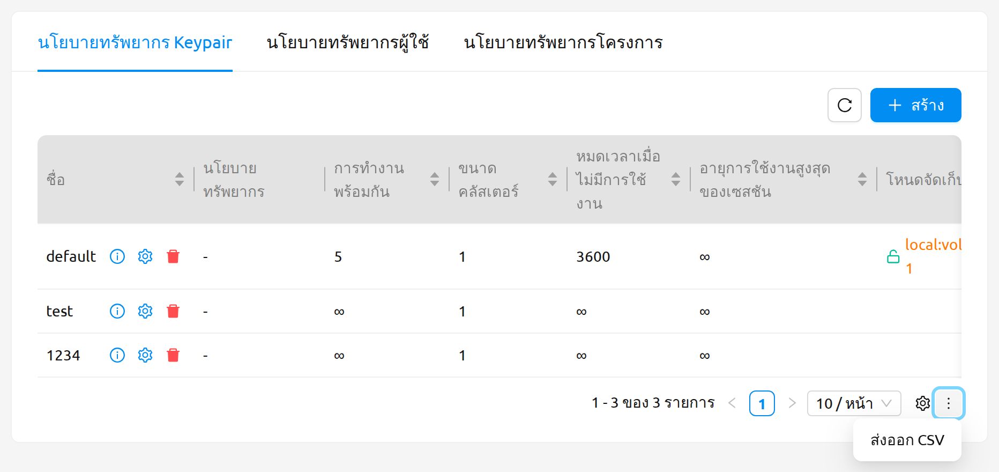

:::tip
ไฟล์ CSV ที่ส่งออกจาก Backend.AI ทุกไฟล์จะมี UTF-8 BOM (Byte Order Mark) ที่ต้นไฟล์ เพื่อให้ Microsoft Excel บนระบบที่ไม่ใช่ UTF-8 (เช่น Windows ภาษาเกาหลีที่ใช้ CP949) รู้จักการเข้ารหัสได้อย่างถูกต้องและแสดงอักขระหลายไบต์ เช่น ภาษาเกาหลี ญี่ปุ่น หรือจีนโดยไม่เกิดการแสดงผลที่ผิดพลาด
:::

## มุมมองรวมสำหรับเซสชันที่รอดำเนินการ

หน้า Admin Session จะแสดงมุมมองรวมของเซสชันที่รอดำเนินการทั้งหมดภายใน
กลุ่มทรัพยากรที่เลือก หมายเลขดัชนีที่แสดงถัดจากสถานะจะระบุตำแหน่งในคิว
ที่เซสชันจะถูกสร้างเมื่อมีทรัพยากรเพียงพอ

เช่นเดียวกับหน้าเซสชัน คุณสามารถคลิกชื่อเซสชันเพื่อเปิด drawer ที่แสดง
ข้อมูลรายละเอียดเกี่ยวกับเซสชันได้

## ตัวจัดตาราง Fair Share

หน้า Fair Share Scheduler จะพร้อมใช้งาน
ในเมนู **การตั้งค่าผู้ดูแลระบบ** ฟีเจอร์นี้ช่วยให้ผู้ดูแลระบบสามารถจัดการน้ำหนักการจัดตาราง
Fair Share ตามโครงสร้างลำดับชั้นของกลุ่มทรัพยากร โดเมน โปรเจกต์ และผู้ใช้

การจัดตาราง Fair Share จะจัดสรรทรัพยากรการคำนวณโดยอิงจากรูปแบบการใช้งานในอดีต
เพื่อให้มั่นใจว่าทรัพยากรจะถูกกระจายอย่างเป็นธรรมในหมู่ผู้ใช้ ผู้ใช้ที่ใช้
ทรัพยากรน้อยในอดีตจะได้รับลำดับความสำคัญในการจัดตารางสูงกว่า ในขณะที่ผู้ใช้
ที่ใช้มากกว่าจะได้รับลำดับความสำคัญต่ำกว่า ผู้ดูแลระบบสามารถปรับแต่งพฤติกรรมนี้
ได้โดยการปรับน้ำหนักในแต่ละระดับของลำดับชั้น

:::note
Fair Share Scheduler จะพร้อมใช้งานเฉพาะเมื่อประเภทตัวจัดตารางของกลุ่มทรัพยากร
ถูกตั้งค่าเป็น `FAIR_SHARE` เท่านั้น สำหรับการกำหนดค่าประเภทตัวจัดตารางของ
กลุ่มทรัพยากร โปรดดูที่ส่วนจัดการกลุ่มทรัพยากร
:::

หากต้องการเข้าถึงฟีเจอร์นี้ ให้คลิกเมนู **Scheduler** ภายใต้ **การตั้งค่าผู้ดูแลระบบ** ในแถบด้านข้าง
หน้าจะแสดงแท็บการตั้งค่า Fair Share พร้อมอินเทอร์เฟซ drill-down 4 ขั้นตอน

หน้าถูกจัดระเบียบเป็น 4 ขั้นตอนตามลำดับชั้น:

1. **กลุ่มทรัพยากร**: กำหนดค่าพารามิเตอร์หลักของ Fair Share สำหรับแต่ละกลุ่มทรัพยากร
2. **โดเมน**: ตั้งค่าน้ำหนักสำหรับโดเมนภายในกลุ่มทรัพยากร
3. **โปรเจกต์**: ตั้งค่าน้ำหนักสำหรับโปรเจกต์ภายในโดเมน
4. **ผู้ใช้**: ตั้งค่าน้ำหนักสำหรับผู้ใช้แต่ละคนภายในโปรเจกต์

แถบตัวบ่งชี้ขั้นตอนที่ด้านบนของหน้าจะแสดงตำแหน่งปัจจุบันในลำดับชั้น
ขั้นตอนที่เสร็จสิ้นจะแสดงชื่อของรายการที่เลือก คุณสามารถคลิกที่ขั้นตอนที่
เสร็จสิ้นเพื่อย้อนกลับไปยังระดับนั้นได้

หากกลุ่มทรัพยากรที่เลือกไม่ได้ตั้งค่าประเภทตัวจัดตารางเป็น `FAIR_SHARE`
จะมีการแจ้งเตือนเป็นคำเตือนว่า Fair Share Scheduler ไม่ได้เปิดใช้งานสำหรับ
กลุ่มทรัพยากรนั้น

ในแต่ละขั้นตอน ฟีเจอร์ทั่วไปต่อไปนี้พร้อมใช้งาน:

- **การแบ่งหน้า**: นำทางผ่านผลลัพธ์พร้อมขนาดหน้าที่กำหนดค่าได้
- **รีเฟรชอัตโนมัติ**: ข้อมูลจะรีเฟรชอัตโนมัติทุก 7 วินาที ปุ่มรีเฟรชด้วยตนเองก็พร้อมใช้งานเช่นกัน

### กลุ่มทรัพยากร

ขั้นตอนกลุ่มทรัพยากรจะแสดงตารางของกลุ่มทรัพยากรทั้งหมดพร้อมการกำหนดค่า
Fair Share

ตารางประกอบด้วยคอลัมน์ต่อไปนี้:

- **ชื่อ**: ชื่อกลุ่มทรัพยากร คลิกชื่อเพื่อ drill down ไปยังการตั้งค่าระดับโดเมนของกลุ่มทรัพยากรนั้น
- **ตัวควบคุม**: ปุ่มตั้งค่า (เฟือง) ที่เปิด modal การตั้งค่า Fair Share ของกลุ่มทรัพยากร
- **การจัดสรร**: การใช้ทรัพยากรแสดงการใช้งาน/ความจุสำหรับแต่ละประเภททรัพยากรที่จัดสรรให้กลุ่มทรัพยากร (เช่น CPU, Memory, CUDA GPU)
- **น้ำหนักทรัพยากร**: น้ำหนักตามประเภททรัพยากร แสดง "ค่าเริ่มต้น" หากใช้น้ำหนักเริ่มต้น
- **น้ำหนักเริ่มต้น**: ค่าน้ำหนักสำรองสำหรับโดเมน โปรเจกต์ และผู้ใช้ที่ไม่ได้กำหนดน้ำหนัก
- **หน่วยการลดทอน**: ช่วงเวลา (เป็นวัน) สำหรับรวบรวมการใช้งาน
- **ครึ่งชีวิต**: ช่วงเวลา (เป็นวัน) ที่อัตราการสะท้อนการใช้งานลดลงครึ่งหนึ่ง
- **ช่วงเวลาย้อนหลัง**: ช่วง (เป็นวัน) ของประวัติการใช้งานที่สะท้อนในการคำนวณ

### การตั้งค่า Fair Share ของกลุ่มทรัพยากร

คลิกปุ่มตั้งค่า (เฟือง) ในคอลัมน์ตัวควบคุมของกลุ่มทรัพยากรเพื่อเปิด modal
การตั้งค่า Fair Share

:::warning
การเปลี่ยนแปลงจะยังไม่สะท้อนทันทีในการคำนวณ Fair Share และอาจใช้เวลา
ประมาณ 5 นาทีเนื่องจากรอบการคำนวณ
:::

modal ประกอบด้วยฟิลด์ต่อไปนี้:

- **กลุ่มทรัพยากร**: ฟิลด์อ่านอย่างเดียวที่แสดงชื่อกลุ่มทรัพยากร
- **ครึ่งชีวิต**: ช่วงเวลาที่อัตราการสะท้อนการใช้งานลดลงครึ่งหนึ่ง ระบุเป็นวัน (ขั้นต่ำ 1) ตัวอย่างเช่น หากตั้งเป็น 7 วัน การใช้งานเมื่อ 7 วันก่อนจะคำนวณที่ 50% และการใช้งานเมื่อ 14 วันก่อนที่ 25% แนะนำให้ตั้งค่าเป็นพหุคูณของหน่วยการลดทอน
- **ช่วงเวลาย้อนหลัง**: ช่วงของประวัติการใช้งานที่สะท้อนในการคำนวณ Fair Share ระบุเป็นวัน (ขั้นต่ำ 1) การใช้งานก่อนช่วงเวลานี้จะถูกยกเว้นจากการคำนวณ แนะนำให้ตั้งค่าเป็นพหุคูณของครึ่งชีวิต
- **น้ำหนักเริ่มต้น**: ค่าเริ่มต้นที่ใช้กับโดเมน โปรเจกต์ และผู้ใช้ที่ไม่ได้กำหนดน้ำหนัก (ขั้นต่ำ 1, ขั้น 0.1)
- **น้ำหนักทรัพยากร**: น้ำหนักตามประเภททรัพยากร (เช่น CPU, Memory, GPU) แต่ละรายการมีค่าขั้นต่ำ 1 และขั้น 0.1 ส่วนนี้จะแสดงเฉพาะเมื่อกลุ่มทรัพยากรมีน้ำหนักทรัพยากรเท่านั้น

### โดเมน

หลังจากเลือกกลุ่มทรัพยากร ขั้นตอนโดเมนจะแสดงตารางของโดเมนพร้อมน้ำหนัก
Fair Share และการใช้งานภายในกลุ่มทรัพยากรนั้น

ตารางประกอบด้วยคอลัมน์ต่อไปนี้:

- **ชื่อ**: ชื่อโดเมน คลิกชื่อเพื่อ drill down ไปยังการตั้งค่าระดับโปรเจกต์ของโดเมนนั้น
- **ตัวควบคุม**: ปุ่มตั้งค่า (เฟือง) ที่เปิด modal การตั้งค่าน้ำหนักของโดเมนนี้
- **น้ำหนัก**: ค่าน้ำหนักปัจจุบัน แสดง "ค่าเริ่มต้น" หากใช้น้ำหนักเริ่มต้น
- **ตัวคูณการแบ่งสัดส่วนอย่างเป็นธรรม**: ลำดับความสำคัญในการจัดตารางที่คำนวณโดยตัวจัดตาราง ค่าที่สูงกว่าหมายถึงลำดับความสำคัญที่สูงกว่า
- **การจัดสรรทรัพยากร**: การใช้ทรัพยากรเฉลี่ยต่อวันที่ถูกลดทอนตามประเภททรัพยากร (CPU, Memory, GPU / Day)
- **แก้ไขเมื่อ**: timestamp การแก้ไขครั้งล่าสุด
- **สร้างเมื่อ**: timestamp การสร้าง

คุณสามารถเลือกหลายแถวโดยใช้ช่องทำเครื่องหมายทางด้านซ้ายของตาราง เมื่อเลือก
แถวแล้ว จะมีปุ่มเพิ่มเติม 2 ปุ่มปรากฏขึ้น:

- **กราฟการใช้งาน** (ไอคอนแผนภูมิ): เปิด modal ประวัติการใช้งานสำหรับรายการที่เลือก
- **แก้ไขเป็นกลุ่ม** (ไอคอนเฟือง): เปิด modal การตั้งค่าน้ำหนักเพื่อแก้ไขน้ำหนักของรายการที่เลือกทั้งหมดพร้อมกัน

### โปรเจกต์

หลังจากเลือกโดเมน ขั้นตอนโปรเจกต์จะแสดงตารางของโปรเจกต์ที่มีโครงสร้าง
คอลัมน์เดียวกันกับขั้นตอนโดเมน คลิกชื่อโปรเจกต์เพื่อ drill down ไปยัง
ขั้นตอนผู้ใช้

การดำเนินการเป็นกลุ่มเดียวกัน (กราฟการใช้งานและแก้ไขเป็นกลุ่ม) จะพร้อมใช้งานเมื่อเลือกแถว

### ผู้ใช้

หลังจากเลือกโปรเจกต์ ขั้นตอนผู้ใช้จะแสดงตารางของผู้ใช้แต่ละคนพร้อมน้ำหนัก
Fair Share และการใช้งาน

ตารางประกอบด้วยคอลัมน์ต่อไปนี้:

- **อีเมล**: ที่อยู่อีเมลของผู้ใช้
- **ชื่อ**: ชื่อของผู้ใช้
- **ตัวควบคุม**: ปุ่มตั้งค่า (เฟือง) ที่เปิด modal การตั้งค่าน้ำหนักของผู้ใช้นี้
- **น้ำหนัก**: ค่าน้ำหนักปัจจุบัน แสดง "ค่าเริ่มต้น" หากใช้น้ำหนักเริ่มต้น
- **ตัวคูณการแบ่งสัดส่วนอย่างเป็นธรรม**: ลำดับความสำคัญในการจัดตารางที่คำนวณโดยตัวจัดตาราง
- **การจัดสรรทรัพยากร**: การใช้ทรัพยากรเฉลี่ยต่อวันที่ถูกลดทอนตามประเภททรัพยากร
- **แก้ไขเมื่อ**: timestamp การแก้ไขครั้งล่าสุด
- **สร้างเมื่อ**: timestamp การสร้าง

การดำเนินการเป็นกลุ่มเดียวกัน (กราฟการใช้งานและแก้ไขเป็นกลุ่ม) จะพร้อมใช้งานเมื่อเลือกแถว

### การแก้ไขน้ำหนัก Fair Share

หากต้องการแก้ไขน้ำหนัก Fair Share สำหรับโดเมน โปรเจกต์ หรือผู้ใช้ ให้คลิกปุ่ม
ตั้งค่า (เฟือง) ในคอลัมน์ตัวควบคุมของแถวที่ต้องการ modal การตั้งค่าน้ำหนักจะเปิดขึ้น

:::warning
การเปลี่ยนแปลงจะยังไม่สะท้อนทันทีในการคำนวณ Fair Share และอาจใช้เวลา
ประมาณ 5 นาทีเนื่องจากรอบการคำนวณ
:::

ในโหมดแก้ไขเดี่ยว modal จะแสดงชื่อรายการ (อ่านอย่างเดียว) และฟิลด์ป้อนน้ำหนัก

- **น้ำหนัก**: ตัวคูณฐานที่กำหนดลำดับความสำคัญสำหรับการจัดตารางแบบ Fair Share ยิ่งค่าสูง จะมีลำดับความสำคัญสูงขึ้น ค่าเริ่มต้นคือ "1.0" น้ำหนัก "2.0" จะมีลำดับความสำคัญเป็นสองเท่าของ "1.0" ค่าขั้นต่ำคือ 1 และขั้นคือ 0.1

หากต้องการแก้ไขน้ำหนักของหลายรายการพร้อมกัน ให้เลือกแถวที่ต้องการโดยใช้ช่อง
ทำเครื่องหมายในตาราง จากนั้นคลิกปุ่มแก้ไขเป็นกลุ่ม (ไอคอนเฟือง) ในโหมด
แก้ไขเป็นกลุ่ม modal จะแสดงรายการแท็กของรายการที่เลือกทั้งหมดและฟิลด์ป้อน
น้ำหนักเดียวที่จะใช้กับทุกรายการ

:::note
หากกลุ่มทรัพยากรที่เลือกไม่ได้ตั้งค่าประเภทตัวจัดตารางเป็น `FAIR_SHARE`
จะมีการแจ้งเตือนเป็นคำเตือนแสดงใน modal
:::

### การดูประวัติการใช้งาน

หากต้องการดูประวัติการใช้งานของโดเมน โปรเจกต์ หรือผู้ใช้ ให้เลือกแถวที่ต้องการ
โดยใช้ช่องทำเครื่องหมายในตาราง จากนั้นคลิกปุ่มกราฟการใช้งาน (ไอคอนแผนภูมิ)
modal ประวัติการใช้งานจะเปิดขึ้น

modal จะแสดงข้อมูลต่อไปนี้:

- **ตัวเลือกช่วงวันที่**: เลือกช่วงวันที่สำหรับประวัติการใช้งาน มีพรีเซ็ตสำหรับ 7 วันที่ผ่านมา, 30 วันที่ผ่านมา และ 90 วันที่ผ่านมา
- **ปุ่มรีเฟรช**: รีเฟรชข้อมูลการใช้งานด้วยตนเอง
- **ข้อมูลบริบท**: แสดงกลุ่มทรัพยากร โดเมน และโปรเจกต์ (ขึ้นอยู่กับขั้นตอนปัจจุบัน)
- **รายการที่เลือก**: แสดงเป็นแท็กที่แสดงชื่อของรายการที่เลือก
- **แผนภูมิการใช้งาน**: แผนภูมิแสดงการใช้ทรัพยากรเฉลี่ยต่อวันในช่วงเวลาที่เลือก

## การจัดการอิมเมจ

ผู้ดูแลระบบสามารถจัดการอิมเมจที่ใช้ในการสร้างเซสชันการคำนวณได้ในแท็บอิมเมจของหน้าสภาพแวดล้อม ในแท็บนี้จะแสดงข้อมูลเมตาของอิมเมจทั้งหมดที่อยู่ในเซิร์ฟเวอร์ Backend.AI ในปัจจุบัน คุณสามารถตรวจสอบข้อมูลต่างๆ เช่น registry, สถาปัตยกรรม, namespace, ชื่ออิมเมจ, digest และทรัพยากรขั้นต่ำที่จำเป็นสำหรับแต่ละอิมเมจ สำหรับอิมเมจที่ดาวน์โหลดไปยังโหนดเอเจนต์หนึ่งรายการขึ้นไป จะมีแท็ก `installed` ในคอลัมน์สถานะ

:::note
ฟีเจอร์การติดตั้งอิมเมจโดยเลือกเอเจนต์เฉพาะกำลังอยู่ระหว่างการพัฒนา
:::

รายการอิมเมจจะแสดงคอลัมน์เพิ่มเติมสำหรับข้อมูลอิมเมจที่ละเอียดยิ่งขึ้น:

- **สถาปัตยกรรม**: สถาปัตยกรรม CPU ของอิมเมจ (เช่น x86_64, aarch64)
- **เนมสเปซ**: เนมสเปซของอิมเมจภายในรีจิสทรี
- **ชื่อภาพฐาน**: ชื่อพื้นฐานของอิมเมจ พร้อมแท็กนามแฝงเพื่อให้ระบุตัวตนได้ง่ายขึ้น
- **เวอร์ชัน**: แท็กเวอร์ชันของอิมเมจ
- **แท็ก**: แท็กรายละเอียดที่เกี่ยวข้องกับอิมเมจ แสดงเป็นแท็กคู่พร้อมนามแฝง

คุณสามารถเลือกอิมเมจที่ยังไม่ได้ติดตั้งหลายรายการ แล้วคลิกปุ่ม `ติดตั้ง` เพื่อติดตั้งบนโหนดเอเจนต์ที่มีอยู่พร้อมกัน

คุณสามารถเปลี่ยนข้อกำหนดทรัพยากรขั้นต่ำสำหรับแต่ละอิมเมจได้โดยคลิก
'การตั้งค่า' ในคอลัมน์ 'การควบคุม' แต่ละอิมเมจมีข้อกำหนดฮาร์ดแวร์และทรัพยากร
สำหรับการดำเนินการขั้นต่ำ (เช่น สำหรับอิมเมจที่ใช้เฉพาะ GPU
จะต้องมีการจัดสรร GPU ขั้นต่ำ) ค่าเริ่มต้นสำหรับปริมาณทรัพยากรขั้นต่ำ
จะถูกจัดเตรียมไว้เป็นส่วนหนึ่งของข้อมูลเมตาของอิมเมจ หากมีความพยายามที่จะ
สร้างเซสชันการคำนวณด้วยทรัพยากรที่น้อยกว่าปริมาณ
ทรัพยากรที่ระบุในแต่ละอิมเมจ คำขอจะถูกปรับเป็น
ข้อกำหนดทรัพยากรขั้นต่ำสำหรับอิมเมจโดยอัตโนมัติและสร้างขึ้น ไม่ได้ถูกยกเลิก

:::note
ข้อกำหนดทรัพยากรขั้นต่ำที่รวมอยู่ในข้อมูลเมตาของอิมเมจเป็นค่าที่ได้รับการทดสอบและกำหนดไว้แล้ว ดังนั้นหากคุณไม่มีเหตุผลที่ชัดเจนในการเปลี่ยน ขอแนะนำให้ใช้ค่าเริ่มต้น
:::

นอกจากนี้ คุณยังสามารถเพิ่มหรือแก้ไขแอปที่รองรับสำหรับแต่ละอิมเมจได้โดยคลิกไอคอน 'Apps' ที่อยู่ในคอลัมน์ 'การควบคุม'
เมื่อคุณคลิกไอคอน ชื่อของแอปและหมายเลขพอร์ตที่สอดคล้องกันจะถูกแสดงขึ้น

ในอินเทอร์เฟซนี้ คุณสามารถเพิ่มแอปพลิเคชันที่กำหนดเองที่รองรับได้โดยคลิกปุ่ม '+ Add' ด้านล่าง หากต้องการลบแอปพลิเคชัน ให้คลิกปุ่ม 'ถังขยะ' ทางด้านขวาของแต่ละแถว

:::note
คุณต้องติดตั้งอิมเมจใหม่หลังจากเปลี่ยนแอปที่จัดการ

:::

## การจัดการ Docker Registry

คุณสามารถคลิกแท็บทะเบียนในหน้าสภาพแวดล้อม เพื่อดูข้อมูลของ Docker registry ที่เชื่อมต่ออยู่ในปัจจุบัน `cr.backend.ai` ถูกลงทะเบียนเป็นค่าเริ่มต้น ซึ่งเป็น registry ที่ให้บริการโดย Harbor

:::note
ในสภาพแวดล้อมแบบออฟไลน์ ไม่สามารถเข้าถึง registry เริ่มต้นได้ ให้คลิกไอคอนถังขยะทางขวาเพื่อลบออก
:::

คลิกไอคอนรีเฟรชในคอลัมน์ 'การควบคุม' เพื่ออัปเดตข้อมูลเมตาอิมเมจสำหรับ Backend.AI จาก registry ที่เชื่อมต่อ ข้อมูลอิมเมจที่ไม่มีเลเบลสำหรับ Backend.AI จะไม่ถูกอัปเดต

คลิกปุ่ม '+ Add Registry' เพื่อเพิ่ม Docker registry ส่วนตัวของคุณ กล่องโต้ตอบสร้าง registry มีฟิลด์ต่อไปนี้:

- **ชื่อรีจิสทรี**: ชื่อเฉพาะของ registry (สูงสุด 50 ตัวอักษร) ต้องตรงกับคำนำหน้าที่ใช้ในชื่ออิมเมจที่จัดเก็บใน registry
- **URL ทะเบียน**: URL ของ registry ต้องมี scheme เช่น `http://` หรือ `https://` อย่างชัดเจน
- **ชื่อผู้ใช้**: ตัวเลือก กรอกหากมีการตั้งค่าการยืนยันตัวตนแยกต่างหากใน registry
- **รหัสผ่าน**: ตัวเลือก เมื่อแก้ไข registry ที่มีอยู่ ให้เลือกช่องทำเครื่องหมาย `Change Password` เพื่อเปลี่ยน
- **ประเภททะเบียน**: เลือกประเภทของ registry ประเภทที่รองรับ: `docker`, `harbor`, `harbor2`, `github`, `gitlab`, `ecr`, `ecr-public`
- **ชื่อโครงการ**: โปรเจกต์หรือ namespace ใน registry (จำเป็น) สำหรับ GitLab registry ให้ใช้เส้นทางเต็มรวม namespace และชื่อโปรเจกต์
- **ข้อมูลเพิ่มเติม**: สตริง JSON สำหรับการกำหนดค่าเพิ่มเติมที่จำเป็นสำหรับแต่ละประเภท registry
- **การตรวจสอบ SSL (SSL Verification)**: เปิดหรือปิดการตรวจสอบใบรับรอง SSL ของ registry เมื่อ Backend.AI เชื่อมต่อ **เปิดใช้งานเป็นค่าเริ่มต้น** และแนะนำให้คงสถานะนี้ไว้สำหรับ registry ทุกแห่งที่เข้าถึงได้ผ่านอินเทอร์เน็ตสาธารณะ ปิดการใช้งานเฉพาะกรณีที่ registry ใช้ใบรับรองแบบลงนามด้วยตนเอง (self-signed) ภายในสภาพแวดล้อมภายในที่เชื่อถือได้และคุณได้ตรวจสอบเส้นทางเครือข่ายแล้วเท่านั้น การปิดการตรวจสอบจะทำให้การเชื่อมต่อเสี่ยงต่อการโจมตีแบบคนกลาง (man-in-the-middle)
- **ตั้งเป็นรีจิสทรีระดับระบบ (Set as Global Registry)**: ปุ่มสลับที่เมื่อเปิดใช้งานจะอนุญาตให้เข้าถึง registry จากทุกโครงการ
- **โปรเจกต์ที่ได้รับอนุญาต (Allowed Projects)**: เมื่อปิดปุ่มสลับ **ตั้งเป็นรีจิสทรีระดับระบบ** ให้ใช้ฟิลด์นี้เพื่อเลือกโครงการเฉพาะที่ได้รับอนุญาตให้ใช้ registry

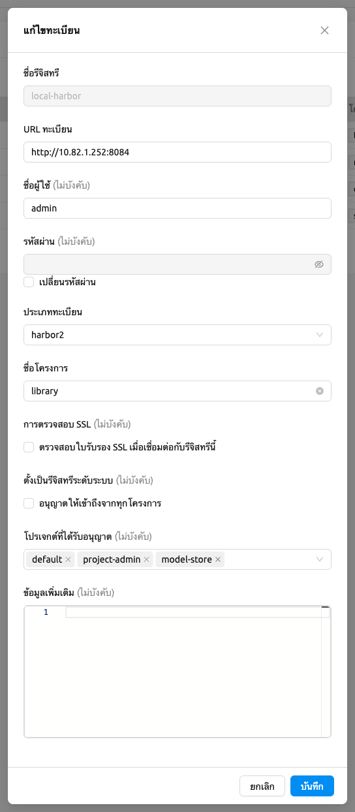
<!-- TODO: Re-capture container_registry_editor_modal.png to show the Set as Global Registry toggle and the Allowed Projects field -->

### การกำหนดค่า GitLab Container Registry

เมื่อเพิ่ม GitLab container registry คุณต้องระบุ `api_endpoint` ในฟิลด์ Extra Information เนื่องจาก GitLab ใช้ endpoint แยกสำหรับ container registry และ GitLab API

สำหรับ **GitLab.com (public instance)**:

- Registry URL: `https://registry.gitlab.com`
- Extra Information: `{"api_endpoint": "https://gitlab.com"}`

สำหรับ **self-hosted (on-premise) GitLab**:

- Registry URL: URL ของ GitLab registry ของคุณ (เช่น `https://registry.example.com`)
- Extra Information: `{"api_endpoint": "https://gitlab.example.com"}`

:::note
`api_endpoint` ควรชี้ไปที่ URL ของ GitLab instance ของคุณ ไม่ใช่ URL ของ registry
:::

หมายเหตุการกำหนดค่าเพิ่มเติม:

- **รูปแบบเส้นทางโปรเจกต์**: เมื่อระบุโปรเจกต์ ให้ใช้เส้นทางเต็มรวม namespace และชื่อโปรเจกต์ (เช่น `namespace/project-name`) ทั้งสองส่วนจำเป็นสำหรับให้ registry ทำงานได้อย่างถูกต้อง

- **สิทธิ์ของ access token**: access token ที่ใช้สำหรับ registry ต้องมีทั้ง scope `read_registry` และ `read_api` scope `read_api` จำเป็นสำหรับ Backend.AI เพื่อสอบถาม GitLab API สำหรับข้อมูลเมตาอิมเมจระหว่างการ rescan

คุณยังสามารถอัปเดตข้อมูลของ registry ที่มีอยู่ได้ ยกเว้นชื่อรีจิสทรี

หลังจากสร้าง registry และอัปเดตข้อมูลเมตาอิมเมจแล้ว ผู้ใช้ยังไม่สามารถใช้อิมเมจได้ทันที คุณต้องเปิดใช้งาน registry โดยสลับสวิตช์ Enabled ในรายการ registry เพื่ออนุญาตให้ผู้ใช้เข้าถึงอิมเมจจาก registry

## การจัดการ Resource Preset

Resource preset ที่กำหนดไว้ล่วงหน้าจะแสดงในแผง Resource allocation เมื่อสร้างเซสชันการคำนวณ Superadmin สามารถจัดการ resource preset เหล่านี้ได้

ไปที่แท็บค่าที่กำหนดไว้ล่วงหน้าของทรัพยากรในหน้าสภาพแวดล้อม คุณสามารถตรวจสอบรายการ resource preset ที่กำหนดไว้ในปัจจุบัน

คุณสามารถตั้งค่าทรัพยากรเช่น CPU, RAM, fGPU เป็นต้น ที่จะให้บริการโดย resource preset ได้โดยคลิกปุ่ม 'การตั้งค่า' ในคอลัมน์ชื่อ โมดัลสร้างหรือแก้ไข Resource Preset จะแสดงฟิลด์ของทรัพยากรที่มีอยู่ในปัจจุบัน ขึ้นอยู่กับการตั้งค่าเซิร์ฟเวอร์ ทรัพยากรบางอย่างอาจไม่แสดง หลังจากตั้งค่าทรัพยากรตามต้องการ ให้บันทึกและตรวจสอบว่า preset ที่สอดคล้องกันจะแสดงเมื่อสร้างเซสชันการคำนวณ หากทรัพยากรที่มีน้อยกว่าปริมาณทรัพยากรที่กำหนดใน preset ที่สอดคล้องกัน preset จะไม่แสดง

ไดอะล็อกค่าที่กำหนดไว้ล่วงหน้าของทรัพยากรประกอบด้วย:

- **ชื่อค่าที่กำหนดไว้ล่วงหน้า**: ชื่อเฉพาะสำหรับค่าที่กำหนดไว้ล่วงหน้า (อนุญาตเฉพาะตัวอักษรและตัวเลข, จุด, ขีดกลาง และขีดล่าง)
- **กลุ่มทรัพยากร**: (แบบมีเงื่อนไข) เชื่อมโยง preset กับกลุ่มทรัพยากรเฉพาะ
- **ค่าที่กำหนดไว้ล่วงหน้าของทรัพยากร**: ฟิลด์แบบไดนามิกสำหรับทรัพยากรแต่ละประเภทที่มี (CPU, หน่วยความจำ, GPU เป็นต้น) ฟิลด์หน่วยความจำรองรับการป้อนหน่วยแบบไดนามิก (MiB, GiB, TiB, PiB)
- **หน่วยความจำที่ใช้ร่วมกัน**: ปริมาณหน่วยความจำที่ใช้ร่วมกันที่จัดสรรให้กับค่าที่กำหนดไว้ล่วงหน้า ค่านี้ต้องน้อยกว่าค่า**หน่วยความจำ**

คุณยังสามารถสร้าง resource preset ได้โดยคลิกปุ่ม '+ สร้างค่าที่กำหนดไว้ล่วงหน้า' ที่มุมบนขวาของแท็บค่าที่กำหนดไว้ล่วงหน้าของทรัพยากร คุณไม่สามารถสร้าง resource preset ที่มีชื่อเดียวกันกับที่มีอยู่แล้วได้ เนื่องจากเป็นค่าคีย์สำหรับแยกแยะแต่ละ resource preset

<!-- TODO: Re-capture create_resource_preset_dialog.png — needs update. -->

## การจัดการโหนดเอเจนต์

Superadmin สามารถดูรายการโหนดเอเจนต์ที่เชื่อมต่อกับ Backend.AI อยู่ในปัจจุบันได้โดยไปที่หน้าทรัพยากร คุณสามารถตรวจสอบ IP ของโหนดเอเจนต์ เวลาที่เชื่อมต่อ ทรัพยากรที่ใช้งานจริงอยู่ในปัจจุบัน เป็นต้น WebUI ไม่มีฟังก์ชันในการจัดการโหนดเอเจนต์

#### สอบถามโหนดเอเจนต์

คุณยังสามารถดูการใช้ทรัพยากรที่แน่นอนในโหนดเอเจนต์ได้โดยคลิกไอคอนโน้ตในคอลัมน์ 'การควบคุม'

ในแท็บยุติแล้ว คุณสามารถตรวจสอบข้อมูลของเอเจนต์ที่เคยเชื่อมต่อแล้วถูกยกเลิกหรือตัดการเชื่อมต่อ สามารถใช้เป็นข้อมูลอ้างอิงสำหรับการจัดการโหนด หากรายการว่างเปล่า หมายความว่าไม่มีการตัดการเชื่อมต่อหรือการยกเลิกเกิดขึ้น

#### ตั้งค่าสถานะ Schedulable ของโหนดเอเจนต์

คุณอาจต้องการป้องกันไม่ให้เซสชันการคำนวณใหม่ถูกจัดตารางไปยังบริการ Agent โดยไม่ต้องหยุดบริการ ในกรณีนี้ คุณสามารถปิดใช้งานสถานะ Schedulable ของ Agent จากนั้นคุณสามารถบล็อกการสร้างเซสชันใหม่ในขณะที่รักษาเซสชันที่มีอยู่บน Agent

## การจัดการกลุ่มทรัพยากร

เอเจนต์สามารถจัดกลุ่มเป็นหน่วยที่เรียกว่ากลุ่มทรัพยากร ตัวอย่างเช่น สมมติว่ามีเอเจนต์ 3 ตัวที่มี GPU V100 และเอเจนต์ 2 ตัวที่มี GPU P100 หากคุณต้องการแยก GPU สองประเภทให้ผู้ใช้เห็นแยกกัน คุณสามารถจัดกลุ่มเอเจนต์ V100 สามตัวเป็นกลุ่มทรัพยากรหนึ่ง และเอเจนต์ P100 สองตัวที่เหลือเป็นอีกกลุ่มทรัพยากรหนึ่ง

การเพิ่มเอเจนต์เฉพาะเข้ากลุ่มทรัพยากรเฉพาะยังไม่ได้จัดการใน WebUI ในปัจจุบัน สามารถทำได้โดยแก้ไขไฟล์ config ของเอเจนต์จากตำแหน่งที่ติดตั้งและรีสตาร์ท agent daemon การจัดการกลุ่มทรัพยากรสามารถทำได้ในแท็บกลุ่มทรัพยากรของหน้าทรัพยากร

คุณสามารถแก้ไขกลุ่มทรัพยากรได้โดยคลิกปุ่ม 'การตั้งค่า' ในคอลัมน์ 'การควบคุม' ในฟิลด์ 'ตัวจัดกำหนดการ' คุณสามารถเลือกวิธีการจัดตารางสำหรับการสร้างเซสชันการคำนวณ ปัจจุบันมีสี่ประเภท: `FIFO`, `LIFO`, `DRF` และ `FAIR_SHARE` `FIFO` และ `LIFO` เป็นวิธีการจัดตารางที่สร้างเซสชันที่เข้าคิวเป็นลำดับแรกหรือลำดับสุดท้ายในคิวงาน `DRF` ย่อมาจาก Dominant Resource Fairness มีเป้าหมายเพื่อจัดสรรทรัพยากรอย่างเท่าเทียมที่สุดสำหรับแต่ละผู้ใช้ `FAIR_SHARE` จัดสรรทรัพยากรตามรูปแบบการใช้งานในอดีต สำหรับรายละเอียดเพิ่มเติม โปรดดูที่ส่วน [Fair Share Scheduler](#fair-share-scheduler) คุณสามารถปิดใช้งานนโยบายทรัพยากรได้โดยปิดสถานะ 'ใช้งาน'

กลุ่มทรัพยากรมีตัวเลือกเพิ่มเติมดังนี้:

- **ประเภทเซสชันที่อนุญาต**: ผู้ใช้สามารถเลือกประเภทของเซสชันได้ กลุ่มทรัพยากรสามารถอนุญาตประเภทเซสชันบางประเภท ประเภทเซสชันที่อนุญาต ได้แก่ Interactive, Batch, Inference และ System
- **ที่อยู่เซิร์ฟเวอร์ App Proxy**: ตั้งค่าที่อยู่ App Proxy สำหรับเอเจนต์ของกลุ่มทรัพยากร
- **โทเค็น API ของ App Proxy**: โทเค็น API สำหรับการยืนยันตัวตนกับ App Proxy
- **ใช้งาน**: เปิด/ปิดสถานะการใช้งานของกลุ่มทรัพยากร
- **สาธารณะ**: เปิดเผยกลุ่มทรัพยากรให้ผู้ใช้ทุกคนเห็น
- **การหมดเวลาที่รออยู่**: เซสชันการคำนวณจะถูกยกเลิกหากอยู่ในสถานะ `PENDING` นานกว่าการหมดเวลาที่รออยู่ ตั้งค่าเป็นศูนย์ (0) หากไม่ต้องการใช้ฟีเจอร์นี้
- **จำนวนครั้งที่พยายามข้ามเซสชันที่รออยู่**: จำนวนครั้งที่ scheduler พยายามก่อนข้ามเซสชัน PENDING

คุณสามารถสร้างกลุ่มทรัพยากรใหม่ได้โดยคลิกปุ่ม '+ สร้าง' เช่นเดียวกับตัวเลือกการสร้างอื่นๆ คุณไม่สามารถสร้างกลุ่มทรัพยากรที่มีชื่อเดียวกันกับที่มีอยู่แล้วได้ เนื่องจากชื่อเป็นค่าคีย์

## การจัดเก็บข้อมูล

ในแท็บ STORAGES คุณสามารถเห็นประเภทของ mount volume (โดยปกติคือ NFS) ที่มีอยู่
Backend.AI ให้บริการการตั้งค่าโควตาต่อผู้ใช้/ต่อโปรเจกต์บนพื้นที่จัดเก็บที่รองรับการจัดการโควตา
โดยใช้ฟีเจอร์นี้ ผู้ดูแลระบบสามารถจัดการและตรวจสอบปริมาณการใช้พื้นที่จัดเก็บที่แน่นอนสำหรับแต่ละผู้ใช้และโฟลเดอร์ที่อิงกับโปรเจกต์ได้อย่างง่ายดาย

<!-- TODO: Re-capture storage_list.png — needs update (name-click opens the Storage Host Detail Drawer). -->

ในการจัดการ storage host ให้คลิกชื่อ storage host
ในรายการ Storages การกระทำนี้จะเปิด **Storage Host Detail Drawer**
ซึ่งเป็นที่กำหนดค่าความจุ (โควตา) และสิทธิ์ของโฟลเดอร์

#### Storage Host Detail Drawer

Storage Host Detail Drawer เป็นที่เดียวสำหรับตรวจสอบและจัดการ storage host
คุณสามารถเปิดได้โดยคลิกชื่อโฮสต์ในรายการ Storages ส่วนบนจะแสดงข้อมูลพื้นฐาน
เกี่ยวกับโฮสต์ ในขณะที่ส่วนล่างจะมีแท็บสำหรับกำหนดค่าสิทธิ์ของโฟลเดอร์และ
ความจุ (โควตา)

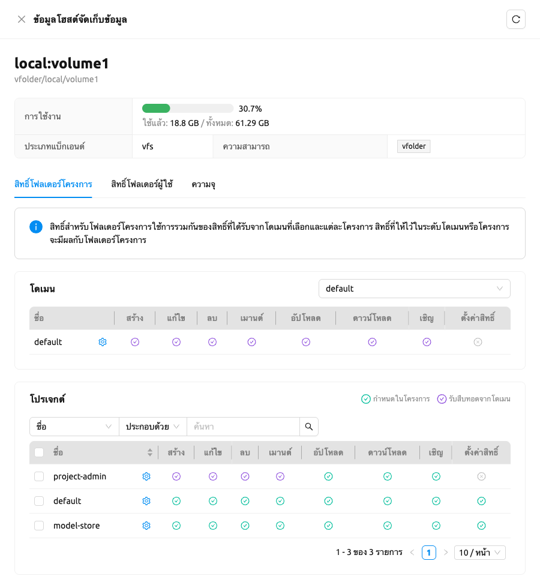
<!-- TODO: Capture screenshot of storage_host_detail_drawer.png — Storage Host detail drawer showing the tab strip (Project Folder Permissions / User Folder Permissions / Capacity) -->

Drawer มีแท็บต่อไปนี้:

- **สิทธิ์โฟลเดอร์โครงการ (Project Folder Permissions)**: ดูและจัดการว่าโดเมนและโครงการใด
  สามารถเข้าถึงโฟลเดอร์โครงการของโฮสต์ได้ ดูส่วน
  [สิทธิ์โฟลเดอร์โครงการ](#project-folder-permission) ด้านล่าง
- **สิทธิ์โฟลเดอร์ผู้ใช้ (User Folder Permissions)**: ดูและจัดการสิทธิ์ที่ใช้กับ
  โฟลเดอร์ผู้ใช้บนโฮสต์ สิทธิ์ของโฟลเดอร์ผู้ใช้ถูกกำหนดโดยนโยบายทรัพยากรคีย์แพร์
  ที่เชื่อมโยงกับคีย์การเข้าถึงหลักของผู้ใช้
- **ความจุ (Capacity)**: กำหนดค่าโควตาพื้นที่จัดเก็บต่อผู้ใช้และต่อโครงการ และดูการใช้งานกับ
  ความสามารถของโฮสต์
  แท็บนี้ไม่สามารถใช้ได้สำหรับ storage host ที่ไม่รองรับการกำหนดค่าโควตา

#### สิทธิ์โฟลเดอร์โครงการ

แท็บ **สิทธิ์โฟลเดอร์โครงการ** ของ [Storage Host Detail Drawer](#storage-host-detail-drawer) ช่วยให้ผู้ดูแลระบบดูและจัดการสิทธิ์ของโฟลเดอร์โปรเจกต์ที่สร้างบน storage host ที่เลือก

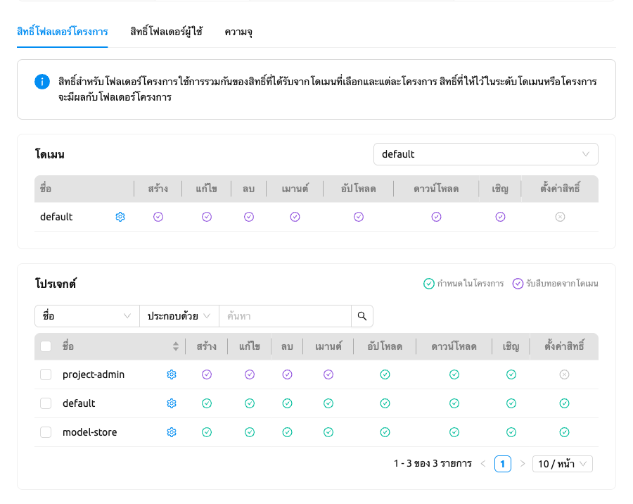
<!-- TODO: Capture screenshot of project_folder_permission_tab.png — Project Folder Permissions tab with the domain selector and the tri-state effective-permission indicators -->

สิทธิ์ของโฟลเดอร์โปรเจกต์ประกอบด้วยสิทธิ์สำหรับโดเมนที่เลือกและสิทธิ์สำหรับโปรเจกต์ที่อยู่ภายใต้โดเมนนั้น

ในโครงสร้างของ Backend.AI โปรเจกต์จะอยู่ภายใต้โดเมนที่เฉพาะเจาะจง ดังนั้นสิทธิ์ของพื้นที่จัดเก็บที่กำหนดให้กับโปรเจกต์จะสืบทอดสิทธิ์ของโดเมนโดยค่าเริ่มต้น

คุณสามารถเลือกหลายแถว (โดยใช้ช่องทำเครื่องหมายของแถว) ในตารางโดเมน, โปรเจกต์ หรือสิทธิ์โฟลเดอร์ผู้ใช้ เพื่อเปรียบเทียบชุดสิทธิ์เคียงข้างกันได้ เมื่อเลือกแถวแล้ว ให้คลิก **แก้ไขสิทธิ์** เพื่อเปิดโมดัลแก้ไขแบบกลุ่ม ซึ่งจะนำชุดสิทธิ์ที่เลือกไปใช้กับเป้าหมายที่เลือกทั้งหมดพร้อมกัน โมดัลจะเปิดขึ้นโดยมีสิทธิ์ทั้งหมดถูกเลือกไว้เป็นค่าเริ่มต้น และเมื่อบันทึก จะเขียนทับสิทธิ์ของเป้าหมายที่เลือกด้วยชุดที่คุณเลือกไว้อย่างถูกต้อง

#### สิทธิ์โฟลเดอร์ผู้ใช้

สิทธิ์โฟลเดอร์ผู้ใช้คือสิทธิ์ที่กำหนดไว้ในนโยบายทรัพยากรคีย์แพร์ เมื่อคุณเลือกผู้ใช้ด้วยตัวเลือกผู้ใช้ทางด้านขวา ระบบจะกรองและแสดงเฉพาะนโยบายทรัพยากรคีย์แพร์ที่กำหนดให้กับคีย์แพร์ของผู้ใช้นั้น คุณสามารถดูคีย์การเข้าถึงหลักของผู้ใช้ได้จากคอลัมน์ **คีย์แพร์ ที่กำหนด**

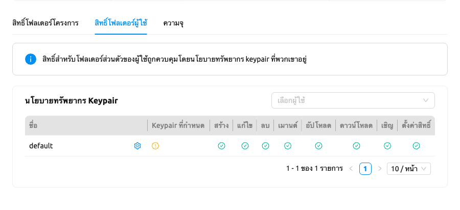
<!-- TODO: Capture screenshot of user_folder_permission_tab.png — User Folder Permissions tab with the user selector and the Assigned Keypair column. -->

#### การตั้งค่าโควตา

โปรดทราบว่าการตั้งค่าโควตามีให้ใช้งานเฉพาะในพื้นที่จัดเก็บที่รองรับการตั้งค่าโควตาเท่านั้น
(เช่น XFS, CephFS, NetApp, Purestorage เป็นต้น) แม้ว่าคุณจะสามารถดูการใช้พื้นที่จัดเก็บ
ในแท็บความจุได้โดยไม่คำนึงถึงประเภทของพื้นที่จัดเก็บ แต่คุณไม่สามารถกำหนดค่าโควตา
สำหรับพื้นที่จัดเก็บที่ไม่รองรับการกำหนดค่าโควตาภายในได้

#### ตั้งค่าโควตาผู้ใช้

ใน Backend.AI มีโฟลเดอร์เสมือนสองประเภทที่สร้างโดยผู้ใช้และผู้ดูแลระบบ (โปรเจกต์) ในส่วนนี้
เราต้องการแสดงวิธีตรวจสอบการตั้งค่าโควตาปัจจุบันต่อผู้ใช้และวิธีการกำหนดค่า
ก่อนอื่น ในแท็บความจุ ให้ตรวจสอบให้แน่ใจว่าแท็บย่อยที่ใช้งานของแผงการตั้งค่าโควตาคือ `For User` จากนั้น ให้เลือกผู้ใช้ที่คุณต้องการ
ตรวจสอบและแก้ไขโควตา คุณจะเห็น quota id ที่สอดคล้องกับ id ของผู้ใช้และการกำหนดค่าที่ตั้งไว้แล้ว
ในตาราง หากคุณได้ตั้งค่าโควตาไว้แล้ว

<!-- TODO: Re-capture per_user_quota.png — needs update. -->

คลิกปุ่ม Edit ในคอลัมน์รหัสขอบเขตโควตา เพื่อเปิดโมดอลสำหรับกำหนดค่าโควตา

<!-- TODO: Re-capture quota_settings_panel.png — needs update. -->

#### ตั้งค่าโควตาโปรเจกต์

การตั้งค่าโควตาบนโฟลเดอร์โปรเจกต์นั้นคล้ายกับการตั้งค่าโควตาผู้ใช้ ความแตกต่างระหว่างการตั้งค่า
โควตาโปรเจกต์และโควตาผู้ใช้คือการยืนยันการตั้งค่าโควตาโปรเจกต์ต้องมีขั้นตอนเพิ่มเติมอีกหนึ่งขั้นตอน
ซึ่งก็คือการเลือกโดเมนที่โปรเจกต์ขึ้นอยู่กับ ส่วนที่เหลือเหมือนกัน
ดังภาพด้านล่าง คุณต้องเลือกโดเมนก่อน จากนั้นจึงเลือกโปรเจกต์

<!-- TODO: Re-capture per_project_quota.png — needs update. -->

#### ยกเลิกโควตา

เรายังมีฟีเจอร์ในการยกเลิกการตั้งค่าโควตาด้วย โปรดทราบว่าหลังจากลบการตั้งค่าโควตาแล้ว โควตาจะตามโควตาเริ่มต้นของผู้ใช้หรือโปรเจกต์โดยอัตโนมัติ
ซึ่งไม่สามารถตั้งค่าได้ใน WebUI หากคุณต้องการเปลี่ยนการตั้งค่าโควตาเริ่มต้น คุณอาจต้องเข้าถึงหน้าเฉพาะผู้ดูแลระบบ
โดยคลิกปุ่ม `Unset` ในคอลัมน์รหัสขอบเขตโควตา ข้อความ snackbar ขนาดเล็กจะปรากฏขึ้นและยืนยันว่าคุณต้องการลบการตั้งค่าโควตาปัจจุบันจริงหรือไม่
หากคุณคลิกปุ่ม `OK` ในข้อความ snackbar ระบบจะลบการตั้งค่าโควตาและตั้งค่าใหม่ให้ตามโควตาที่สอดคล้อง
ซึ่งขึ้นอยู่กับประเภทของโควตา (ผู้ใช้/โปรเจกต์) โดยอัตโนมัติ

<!-- TODO: Re-capture unset_quota.png — needs update. -->

:::note
หากไม่มีการกำหนดค่าต่อผู้ใช้/โปรเจกต์ ค่าที่สอดคล้องกันในนโยบายทรัพยากรของผู้ใช้/โปรเจกต์จะถูกตั้งเป็น
ค่าเริ่มต้น ตัวอย่างเช่น หากไม่ได้ตั้งค่าขีดจำกัดสูงสุดสำหรับโควตา ค่า `max_vfolder_size` ในนโยบายทรัพยากร
จะถูกใช้เป็นค่าเริ่มต้น
:::

## การตั้งค่าระบบ

ในหน้าการกำหนดค่า คุณสามารถดูการตั้งค่าหลักของเซิร์ฟเวอร์ Backend.AI ได้
ในปัจจุบันมีการควบคุมหลายอย่างที่สามารถเปลี่ยนแปลงและแสดงการตั้งค่าได้

คุณสามารถเปลี่ยนกฎการติดตั้งและอัปเดตอิมเมจอัตโนมัติได้โดยเลือกตัวเลือกหนึ่ง
จาก `Digest`, `Tag`, `None` โดย `Digest` เป็นเหมือน checksum สำหรับอิมเมจซึ่ง
ตรวจสอบความสมบูรณ์ของอิมเมจและยังเพิ่มประสิทธิภาพในการดาวน์โหลดอิมเมจ
โดยใช้เลเยอร์ที่ซ้ำกันซ้ำ `Tag` เป็นตัวเลือกสำหรับการพัฒนาเท่านั้นเนื่องจากไม่
รับประกันความสมบูรณ์ของอิมเมจ

:::note
อย่าเปลี่ยนการเลือกกฎเว้นแต่คุณจะเข้าใจความหมายของแต่ละกฎอย่างสมบูรณ์
:::

หน้าการกำหนดค่ายังแสดงสถานะของปลั๊กอินและฟีเจอร์ระดับองค์กร:

**ปลั๊กอิน:**

- **การรองรับ Open-source CUDA GPU**: สถานะการรองรับ CUDA GPU
- **การรองรับ ROCm GPU**: สถานะการรองรับ ROCm GPU

**ฟีเจอร์ระดับองค์กร:**

- **Fractional GPU**: การจำลอง Fractional GPU (fGPU) สำหรับแชร์ GPU ระหว่างเซสชัน

Backend.AI รองรับตัวเร่งความเร็ว AI ที่หลากหลายจากผู้ผลิตหลายราย:

- **NVIDIA**
  - Spark (GB10)
  - Blackwell (B300, B200, RTX Pro 6000 เป็นต้น)
  - Hopper (H200, H100 NVL เป็นต้น)
  - Grace Superchip (GB300, GB200, GH200 เป็นต้น)
  - Turing (Titan RTX, RTX 8000, T4)
  - Ampere (A100, A40, A10 เป็นต้น)
  - Ada Lovelace (L40S, L4)
  - Jetson (TX, Xavier, Orin, Thor เป็นต้น)
- **Intel**
  - Gaudi 3
  - Gaudi 2
  - Gaudi 1
  - Arc
- **AMD**
  - Instinct MI Series (รวมถึง MI300X)
  - MI300A
  - MI250
- **Rebellions**
  - ATOM Max
  - ATOM+
  - REBEL
- **FuriosaAI**
  - RNGD
- **Tenstorrent**
  - Wormhole n150s
  - Wormhole n300s
- **Google**
  - TPU v7 (Ironwood)
  - Coral TPU v5p
  - Coral TPU v5e
  - TPU v4
- **Graphcore**
  - C600 IPU
  - Bow IPU
- **HyperAccel**
  - LPU
- **Groq**
  - LPU
- **Cerebras**
  - WSE-3
- **SambaNova**
  - SN40L

เมื่อผู้ใช้เริ่มเซสชัน multi-node cluster Backend.AI จะสร้างเครือข่าย overlay แบบไดนามิกเพื่อสนับสนุน
การสื่อสารระหว่างโหนดแบบส่วนตัว ผู้ดูแลระบบสามารถตั้งค่า Maximum
Transmission Unit (MTU) สำหรับเครือข่าย overlay ได้ หากแน่ใจว่าค่าดังกล่าว
จะเพิ่มความเร็วของเครือข่าย

:::note
สำหรับข้อมูลเพิ่มเติมเกี่ยวกับเซสชัน Backend.AI Cluster โปรดดูที่
ส่วน [เซสชันการคำนวณคลัสเตอร์ Backend.AI](#backendai-cluster-compute-session)
:::

คุณสามารถแก้ไขการกำหนดค่าต่อ job scheduler ได้โดยคลิกปุ่ม config ของ Scheduler
ค่าในการตั้งค่า scheduler เป็นค่าเริ่มต้นที่จะใช้เมื่อไม่มีการตั้งค่า scheduler
ในแต่ละ [กลุ่มทรัพยากร](#scheduling-methods) หากมีการตั้งค่าเฉพาะของกลุ่ม
ทรัพยากร ค่านี้จะถูกละเว้น

วิธีการจัดตารางที่รองรับในปัจจุบันรวมถึง `FIFO`, `LIFO` และ `DRF`
วิธีการจัดตารางแต่ละวิธีเหมือนกันกับ [วิธีการจัดตาราง](#scheduling-methods) ด้านบน
ตัวเลือก Scheduler รวมถึงการพยายามสร้างเซสชันซ้ำ การพยายามสร้างเซสชันซ้ำหมายถึงจำนวน
ครั้งที่พยายามสร้างเซสชันหากล้มเหลว หากเซสชันไม่สามารถสร้างได้ภายในจำนวนครั้ง
ที่ลอง คำขอจะถูกละเว้นและ Backend.AI จะดำเนินการคำขอถัดไป ปัจจุบันการเปลี่ยนแปลง
สามารถทำได้เฉพาะเมื่อ scheduler เป็น FIFO เท่านั้น

:::note
เราจะยังคงเพิ่มการควบคุมการตั้งค่าที่หลากหลายยิ่งขึ้นต่อไป
:::

:::note
การตั้งค่าระบบเป็นการตั้งค่าเริ่มต้น หากกลุ่มทรัพยากรมีค่าที่แน่นอน
จะแทนที่ค่าที่กำหนดค่าในการตั้งค่าระบบ
:::

## การจัดการเซิร์ฟเวอร์

ไปที่หน้าการบำรุงรักษาและคุณจะเห็นปุ่มต่างๆ สำหรับจัดการเซิร์ฟเวอร์

- RECALCULATE USAGE: บางครั้ง เนื่องจากการเชื่อมต่อเครือข่ายที่ไม่เสถียรหรือ
  ปัญหาในการจัดการคอนเทนเนอร์ของ Docker daemon อาจมีกรณีที่
  ทรัพยากรที่ Backend.AI ครอบครองไม่ตรงกับทรัพยากรที่คอนเทนเนอร์ใช้จริง
  ในกรณีนี้ ให้คลิกปุ่ม RECALCULATE USAGE เพื่อแก้ไข
  การครอบครองทรัพยากรด้วยตนเอง
- RESCAN IMAGES: อัปเดตข้อมูลเมตาของอิมเมจจาก Docker registry ที่ลงทะเบียน
  ทั้งหมด สามารถใช้ได้เมื่อมีการ push อิมเมจใหม่ไปยัง
  docker registry ที่เชื่อมต่อกับ Backend.AI

:::note
เราจะยังคงเพิ่มการตั้งค่าอื่นๆ ที่จำเป็นสำหรับการจัดการ เช่น
การลบอิมเมจที่ไม่ได้ใช้งานหรือการลงทะเบียนกำหนดการบำรุงรักษาตามระยะ
:::

## ข้อมูลโดยละเอียด

ในหน้าข้อมูล คุณสามารถดูข้อมูลรายละเอียดและสถานะของแต่ละฟีเจอร์ได้
หากต้องการดูเวอร์ชันของ Manager และเวอร์ชัน API ให้ตรวจสอบที่แผง Core หากต้องการดูว่า
ส่วนประกอบของ Backend.AI แต่ละรายการเข้ากันได้หรือไม่ ให้ตรวจสอบที่แผง Component

:::note
หน้านี้มีไว้สำหรับแสดงข้อมูลปัจจุบันเท่านั้น
:::

## การจัดการ RBAC

การจัดการ RBAC (Role-Based Access Control) ช่วยให้ผู้ดูแลระบบระดับสูงสามารถกำหนดบทบาทที่มีสิทธิ์แบบละเอียดและมอบหมายให้กับผู้ใช้ได้ คุณสามารถควบคุมการดำเนินการที่ผู้ใช้เฉพาะสามารถทำได้กับทรัพยากรต่าง ๆ ในระบบ Backend.AI

สำหรับข้อมูลรายละเอียดเกี่ยวกับการจัดการบทบาท สิทธิ์ และการมอบหมายผู้ใช้ โปรดดูที่หน้า[การจัดการ RBAC](#rbac-management)
