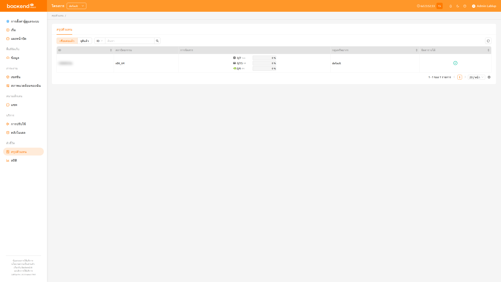

# สรุปตัวแทน

ในขณะนี้ เฉพาะผู้ใช้ที่มีสิทธิ์ผู้ดูแลระบบเท่านั้นที่สามารถดูข้อมูลเอเจนต์ผ่านเมนูการจัดการได้
ตั้งแต่เวอร์ชัน 22.09 เป็นต้นไป Backend.AI WebUI รองรับการแสดงข้อมูลบางส่วนของโหนดเอเจนต์ให้กับผู้ใช้ทั่วไปเมื่อมีการกำหนดค่า
ในเมนูสรุปเอเจนต์ คุณสามารถดูรายการข้อมูลเอเจนต์ รวมถึงที่อยู่ endpoint, สถาปัตยกรรม CPU, การจัดสรรทรัพยากร,
และเอเจนต์สามารถจัดตารางเวลาได้หรือไม่ เมนูนี้มีประโยชน์สำหรับการตรวจสอบการจัดสรรทรัพยากรเมื่อสร้างเซสชัน

:::note
ขึ้นอยู่กับการกำหนดค่าเซิร์ฟเวอร์ คุณสมบัติบริการสรุปเอเจนต์อาจไม่พร้อมใช้งาน
ในกรณีนี้ โปรดติดต่อผู้ดูแลระบบของคุณ
:::