# ภาคผนวก

<a id="gpu-virtualization-and-fractional-gpu-allocation"></a>

## การใช้ GPU เสมือนและการจัดสรร GPU แบบเศษส่วน

Backend.AI supports GPU virtualization technology which allows single physical
GPU can be divided and shared by multiple ผู้ใช้s simultaneously. Therefore, if
you want to execute a task that does not require much GPU computation
capability, you can create a compute session by allocating a portion of the GPU.
The amount of GPU resources that 1 fGPU actually allocates may vary from system
to system depending on ผู้ดูแลระบบistrator settings. For example, if the ผู้ดูแลระบบistrator
has set one physical GPU to be divided into five pieces, 5 fGPU means 1 physical
GPU, or 1 fGPU means 0.2 physical GPU. If you set 1 fGPU when creating a compute
session, the session can utilize the streaming multiprocessor (SM) and GPU
memory equivalent to 0.2 physical GPU.

ในส่วนนี้ เราจะสร้างเซสชันการคำนวณโดยการจัดสรรส่วนหนึ่งของ GPU แล้วตรวจสอบว่า GPU ที่ถูกตรวจพบภายในคอนเทนเนอร์การคำนวณนั้นตรงกับ GPU ฟิสิกส์บางส่วนจริงหรือไม่

First, let's check the type of physical GPU installed in the
host node and the amount of memory. The GPU node used in this guide is equipped
with a GPU with 8 GB of memory as in the following figure. And through the
ผู้ดูแลระบบistrator settings, 1 fGPU is set to an amount equivalent to 0.5 physical
GPU (or 1 physical GPU is 2 fGPU).


Now let's go to the เซสชัน page and create a compute session by allocating 0.5
fGPU as follows:

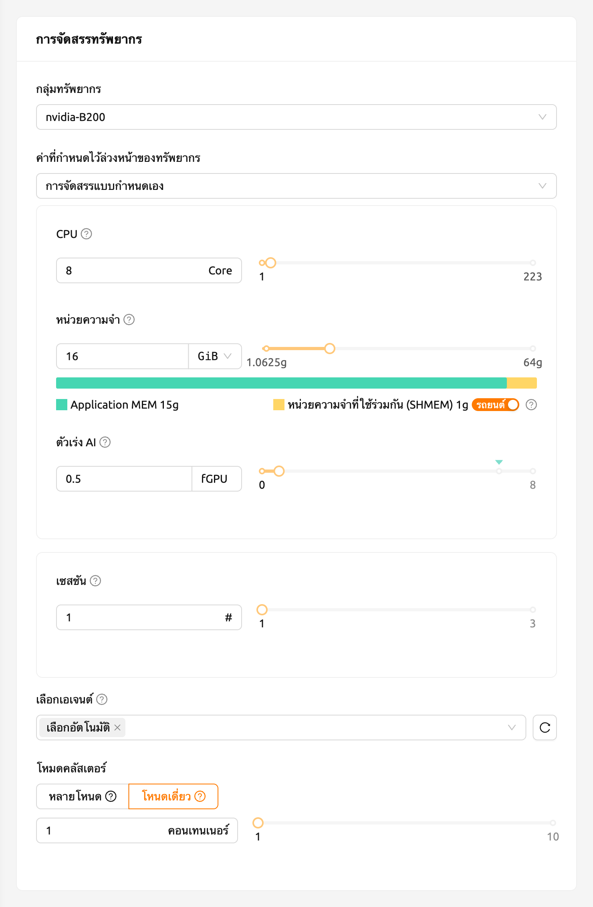

In the AI Accelerator panel of the session list, you can see that
0.5 fGPU is allocated.

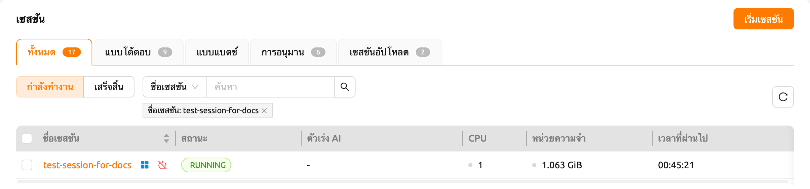

Now, let's connect directly to the container and check if the allocated GPU
memory is really equivalent to 0.5 units (~2 GB). Let's bring up a web
terminal. When the terminal comes up, run the `nvidia-smi` command. As you can
see in the following figure, you can see that about 2 GB of GPU memory is
allocated. This shows that the physical GPU is actually divided into quarters and allocated inside the
container for this compute session, which is not possible by a way like PCI passthrough.


มาเปิด Jupyter Notebook และรันโค้ดการฝึก ML ง่ายๆ กันเถอะ

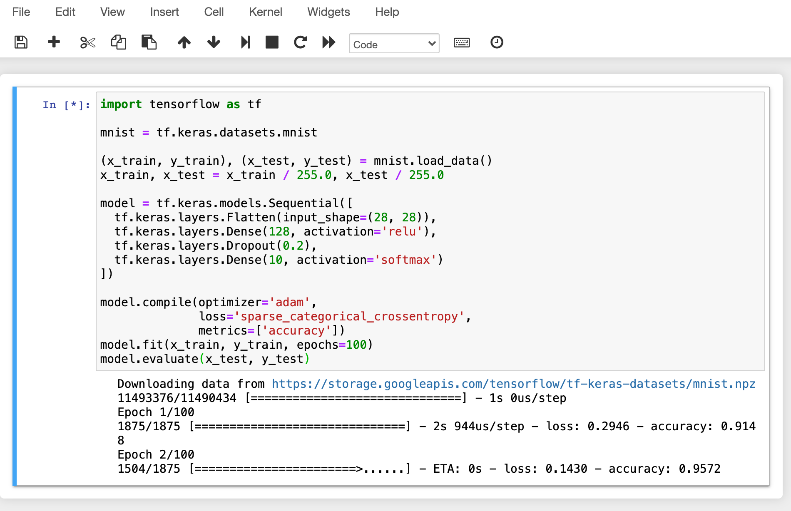

While training is in progress, connect to the shell of the GPU host node and
execute the `nvidia-smi` command. You can see that there is one GPU attached
to the process and this process is occupying about 25% of the resources of the
physical GPU. (GPU occupancy can vary greatly depending on training code and GPU
model.)


Alternatively, you can run the `nvidia-smi` command from the web terminal to query the GPU usage history inside the container.


<a id="automated-job-scheduling"></a>

## การกำหนดตารางงานอัตโนมัติ

เซิร์ฟเวอร์ Backend.AI มีตัวจัดตารางงานที่พัฒนาขึ้นเองในตัว มันจะตรวจสอบทรัพยากรที่มีอยู่ของโหนดผู้ทำงานทั้งหมดโดยอัตโนมัติและมอบหมายคำขอในการสร้างเซสชันการคอมพิวเตอร์ไปยังผู้ทำงานที่ตรงตามคำขอทรัพยากรของผู้ใช้ นอกจากนี้ เมื่อทรัพยากรไม่เพียงพอ คำขอของผู้ใช้ในการสร้างเซสชันการคอมพิวเตอร์จะถูกลงทะเบียนในสถานะ PENDING ในคิวงาน ภายหลัง เมื่อทรัพยากรมีให้ใช้งานอีกครั้ง คำขอที่ถูกระงับจะถูกดำเนินการต่อเพื่อสร้างเซสชันการคอมพิวเตอร์

คุณสามารถตรวจสอบการทำงานของตัวจัดกำหนดงานได้ในลักษณะง่าย ๆ จากผู้ใช้ Web-UI เมื่อโฮสต์ GPU สามารถจัดสรร fGPU ได้สูงสุด 2 ตัว ให้เราสร้างเซสชันการคำนวณ 3 เซสชันพร้อมกันโดยขอจัดสรร fGPU 1 ตัวตามลำดับ ในส่วนการจัดสรรแบบกำหนดเองของกล่องโต้ตอบการเปิดเซสชัน จะมีตัวเลื่อนสำหรับ GPU และเซสชัน หากคุณระบุค่าที่มากกว่า 1 ในเซสชันและคลิกปุ่ม LAUNCH จำนวนเซสชันจะถูกขอพร้อมกัน ให้เราตั้งค่า GPU และเซสชันเป็น 1 และ 3 ตามลำดับ นี่คือสถานการณ์ที่มีเซสชัน 3 เซสชันที่ขอ fGPU ทั้งหมด 3 ตัว ในขณะที่มี fGPU เพียง 2 ตัวเท่านั้น

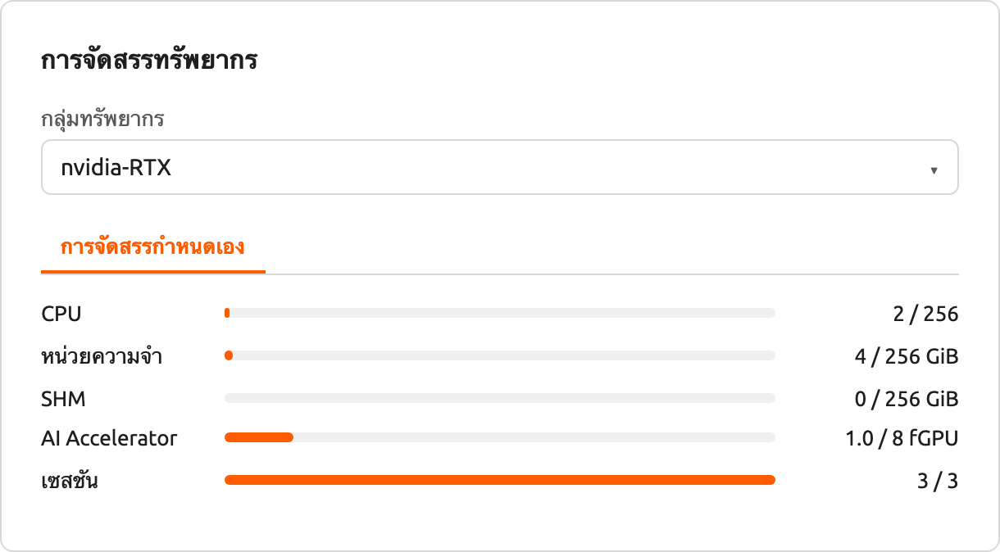

รอครู่หนึ่งแล้วคุณจะเห็นการเซสชันการคอมพิวเตอร์สามรายการถูกแสดงอยู่ ถ้าคุณสังเกตอย่างใกล้ชิดที่แผงสถานะ คุณจะเห็นว่าการเซสชันการคอมพิวเตอร์สองจากสามรายการอยู่ในสถานะ RUNNING แต่การเซสชันการคอมพิวเตอร์อีกหนึ่งรายการยังคงอยู่ในสถานะ PENDING การเซสชัน PENDING นี้ถูกลงทะเบียนในคิวงานเท่านั้นและยังไม่ได้ถูกจัดสรรคอนเทนเนอร์จริงเนื่องจากทรัพยากร GPU ไม่เพียงพอ

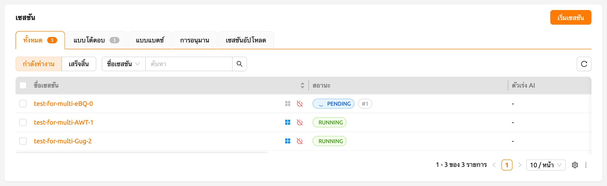

ตอนนี้เราจะทำลายหนึ่งในสองเซสชันที่อยู่ในสถานะ RUNNING จากนั้นคุณจะเห็นว่าเซสชันการคอมพิวเตอร์ในสถานะ PENDING จะถูกจัดสรรทรัพยากรโดยตัวจัดกำหนดงานและเปลี่ยนเป็นสถานะ RUNNING ในไม่ช้า ในลักษณะนี้ ตัวจัดกำหนดงานจะใช้คิวงานเพื่อเก็บคำขอเซสชันการคอมพิวเตอร์ของผู้ใช้และประมวลผลคำขอโดยอัตโนมัติเมื่อมีทรัพยากรพร้อมใช้งาน

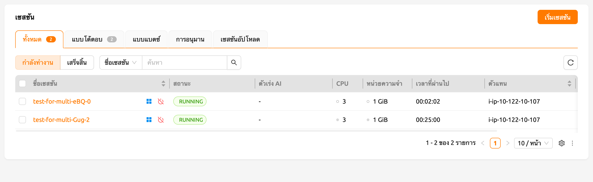


<a id="multi-version-machine-learning-container-support"></a>

## การสนับสนุนคอนเทนเนอร์การเรียนรู้ของเครื่องหลายเวอร์ชัน

Backend.AI มีภาพเคอร์เนล ML และ HPC ที่สร้างไว้ล่วงหน้าหลายแบบ ผู้ใช้จึงสามารถใช้ห้องสมุดและแพ็คเกจหลักได้ทันทีโดยไม่ต้องติดตั้งแพ็คเกจด้วยตนเอง ที่นี่เราจะแสดงตัวอย่างที่ใช้ประโยชน์จากหลายเวอร์ชันของห้องสมุด ML หลายตัวทันที

ไปที่หน้า เซสชัน และเปิดกล่องสนทนาเริ่มต้นเซสชัน อาจมีภาพเคอร์เนลหลายประเภทขึ้นอยู่กับการตั้งค่าการติดตั้ง

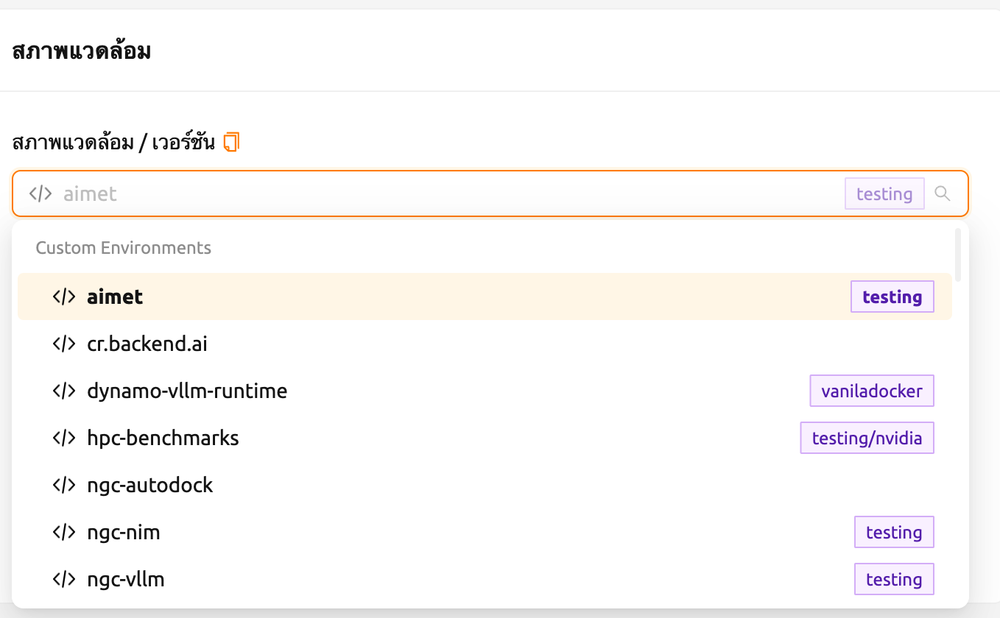

Here, let's select the TensorFlow 2.3 environment and created a session.

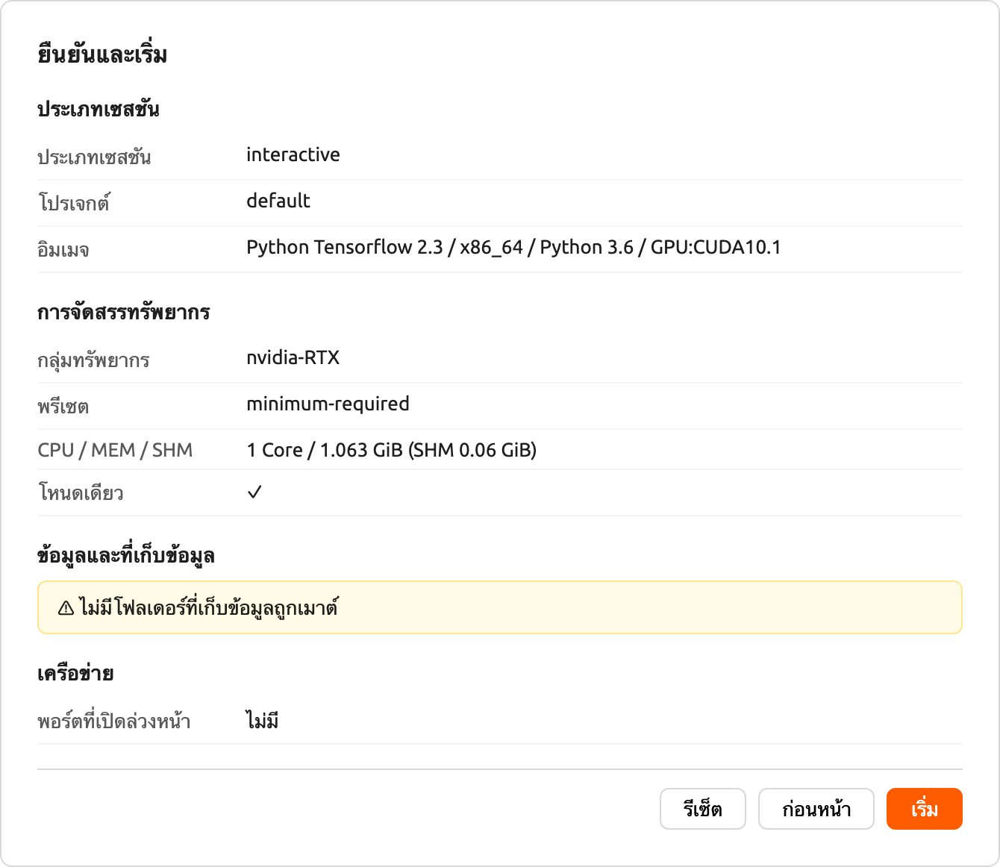

Open the web terminal of the created session and run the following Python
command. You can see that TensorFlow 2.3 version is installed.


This time, let's select the TensorFlow 1.15 environment to create a compute
session. If resources are insufficient, delete the previous session.

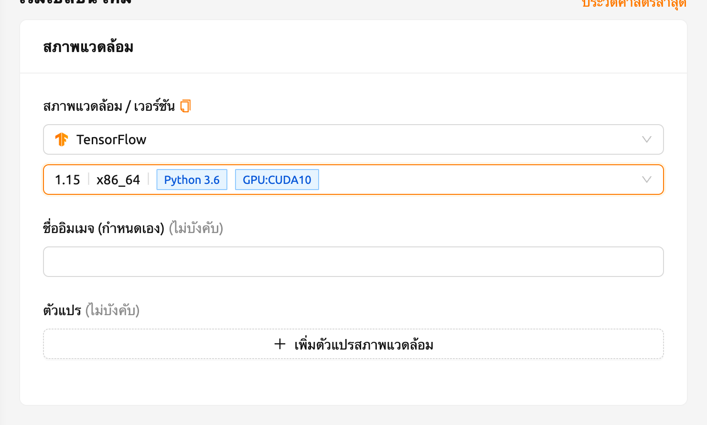

Open the web terminal of the created session and run the same Python command as
before. You can see that TensorFlow 1.15(.4) version is installed.


Finally, create a compute session using PyTorch version 1.7.

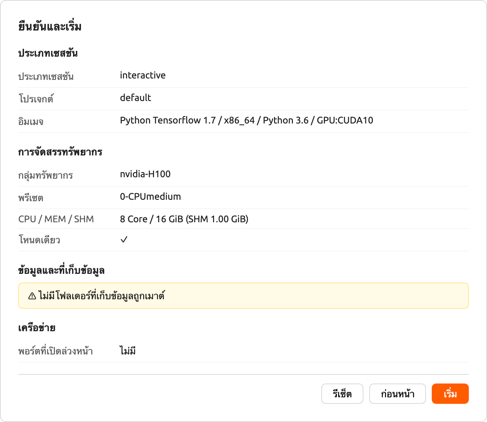

Open the web terminal of the created session and run the following Python
command. You can see that PyTorch 1.8 version is installed.


เช่นนี้ คุณสามารถใช้เวอร์ชันต่าง ๆ ของไลบรารีหลัก เช่น TensorFlow และ PyTorch ผ่าน Backend.AI โดยไม่ต้องพยายามติดตั้งโดยไม่จำเป็น


<a id="convert-a-compute-session-to-a-new-private-docker-image"></a>

## แปลงเซสชันการคอมพิวเตอร์เป็นภาพ Docker ส่วนตัวใหม่

หากคุณต้องการแปลงเซสชันการประมวลผลที่กำลังทำงาน (คอนเทนเนอร์) เป็นภาพ Docker ใหม่ที่คุณสามารถใช้ในภายหลังเพื่อสร้างเซสชันการประมวลผลใหม่ คุณต้องเตรียมสภาพแวดล้อมของเซสชันการประมวลผลของคุณและขอให้ผู้ดูแลระบบทำการแปลงมัน

- ก่อนอื่น ให้เตรียมเซสชันการคอมพิวเตอร์ของคุณโดยการติดตั้งแพ็คเกจที่คุณต้องการและปรับแต่งการตั้งค่าตามที่คุณต้องการ

:::note
หากคุณต้องการติดตั้งแพ็คเกจ OS เช่น ผ่านคำสั่ง `apt` โดยปกติจะต้องมีสิทธิ์ `sudo` ขึ้นอยู่กับนโยบายความปลอดภัยขององค์กร คุณอาจไม่ได้รับอนุญาตให้ใช้ `sudo` ภายในคอนเทนเนอร์

แนะนำให้ใช้ [โฟลเดอร์ออโต้เมาท์](#using-automount-folder) เพื่อ[ติดตั้งแพ็คเกจ Python ผ่าน pip](#install_pip_pkg) อย่างไรก็ตาม หากคุณต้องการเพิ่มแพ็คเกจ Python ในอิมเมจใหม่ คุณควรติดตั้งด้วย `sudo pip install <ชื่อแพ็คเกจ>` เพื่อบันทึกไว้ในไดเรกทอรีระบบแทนที่จะเป็นโฮมไดเรกทอรี เนื้อหาในโฮมไดเรกทอรีของคุณ ซึ่งปกติคือ `/home/work/` จะไม่ถูกบันทึกเมื่อแปลงเซสชันการคอมพิวเตอร์เป็นอิมเมจ Docker ใหม่
:::

- เมื่อเซสชันการคอมพิวเตอร์ของคุณเตรียมพร้อมแล้ว กรุณาขอให้ผู้ดูแลระบบแปลงเป็นอิมเมจ Docker ใหม่ คุณต้องแจ้งชื่อเซสชันหรือ ID และที่อยู่อีเมลของคุณในแพลตฟอร์ม
- ผู้ดูแลระบบจะแปลงเซสชันการคอมพิวเตอร์ของคุณเป็นอิมเมจ Docker ใหม่และส่งชื่ออิมเมจเต็มและแท็กให้คุณ
- คุณสามารถป้อนชื่ออิมเมจในกล่องโต้ตอบเปิดเซสชันด้วยตนเอง อิมเมจนี้เป็นส่วนตัวและจะไม่แสดงให้ผู้ใช้อื่นเห็น

  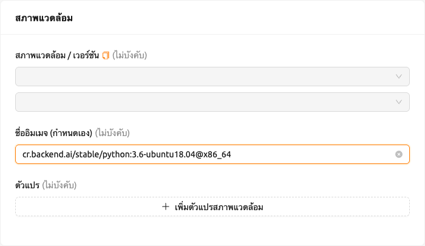

- เซสชันการคอมพิวเตอร์ใหม่จะถูกสร้างขึ้นโดยใช้อิมเมจ Docker ใหม่


<a id="backend-ai-server-installation-guide"></a>

## คู่มือการติดตั้งเซิร์ฟเวอร์ Backend.AI

สำหรับ Backend.AI Server daemons/services จำเป็นต้องมีฮาร์ดแวร์ตามข้อกำหนดต่อไปนี้ เพื่อประสิทธิภาพสูงสุด ให้เพิ่มจำนวนทรัพยากรแต่ละรายการเป็นสองเท่า

- Manager: 2 คอร์, 4 GiB หน่วยความจำ
- Agent: 4 คอร์, 32 GiB หน่วยความจำ, NVIDIA GPU (สำหรับ GPU workload), > 512 GiB SSD
- Webserver: 2 คอร์, 4 GiB หน่วยความจำ
- WSProxy: 2 คอร์, 4 GiB หน่วยความจำ
- PostgreSQL DB: 2 คอร์, 4 GiB หน่วยความจำ
- Redis: 1 คอร์, 2 GiB หน่วยความจำ
- Etcd: 1 คอร์, 2 GiB หน่วยความจำ

แพ็คเกจที่ต้องติดตั้งล่วงหน้าบนโฮสต์ก่อนติดตั้งแต่ละบริการ:

- Web-UI: ระบบปฏิบัติการที่สามารถรันเบราว์เซอร์ล่าสุดได้ (Windows, Mac OS, Ubuntu เป็นต้น)
- Manager: Python (≥3.8), pyenv/pyenv-virtualenv (≥1.2)
- Agent: docker (≥19.03), CUDA/CUDA Toolkit (≥8, แนะนำ 11), nvidia-docker v2, Python (≥3.8), pyenv/pyenv-virtualenv (≥1.2)
- Webserver: Python (≥3.8), pyenv/pyenv-virtualenv (≥1.2)
- WSProxy: docker (≥19.03), docker-compose (≥1.24)
- PostgreSQL DB: docker (≥19.03), docker-compose (≥1.24)
- Redis: docker (≥19.03), docker-compose (≥1.24)
- Etcd: docker (≥19.03), docker-compose (≥1.24)

สำหรับเวอร์ชัน Enterprise, Backend.AI server daemons จะถูกติดตั้งโดยทีมสนับสนุนของ Lablup และมีการจัดส่งเอกสาร/บริการต่อไปนี้หลังจากการติดตั้งครั้งแรก:

- DVD 1 แผ่น (รวมแพ็คเกจ Backend.AI)
- คู่มือ GUI สำหรับผู้ใช้
- คู่มือ GUI สำหรับผู้ดูแลระบบ
- รายงานการติดตั้ง
- บทเรียนสำหรับผู้ใช้/ผู้ดูแลระบบครั้งแรก (3-5 ชั่วโมง)

ข้อมูลการบำรุงรักษาและสนับสนุนผลิตภัณฑ์: สัญญาการค้ารวมค่าสมัครสมาชิกรายเดือน/รายปีสำหรับเวอร์ชัน Enterprise เป็นค่าเริ่มต้น การฝึกอบรมผู้ใช้/ผู้ดูแลระบบครั้งแรก (1-2 ครั้ง) และบริการสนับสนุนลูกค้าแบบมีสาย/ไร้สายจะให้บริการประมาณ 2 สัปดาห์หลังการติดตั้งครั้งแรก การสนับสนุนการอัปเดตรุ่นย่อยและบริการสนับสนุนลูกค้าผ่านช่องทางออนไลน์จะให้บริการเป็นเวลา 3-6 เดือน บริการบำรุงรักษาและสนับสนุนที่ให้บริการหลังจากนั้นอาจมีรายละเอียดที่แตกต่างกันขึ้นอยู่กับเงื่อนไขของสัญญา


<a id="integration-examples"></a>

## ตัวอย่างการผสานรวม

ในส่วนนี้ เราขอแนะนำตัวอย่างทั่วไปของแอปพลิเคชัน ชุดเครื่องมือ และเครื่องมือแมชชีนเลิร์นนิงที่สามารถใช้บนแพลตฟอร์ม Backend.AI ที่นี่ เราจะอธิบายการใช้งานพื้นฐานของแต่ละเครื่องมือและวิธีการตั้งค่าในสภาพแวดล้อม Backend.AI พร้อมตัวอย่างง่ายๆ เราหวังว่าสิ่งนี้จะช่วยให้คุณเลือกและใช้เครื่องมือที่จำเป็นสำหรับโปรเจกต์ของคุณ

โปรดทราบว่าเนื้อหาในคู่มือนี้อิงตามเวอร์ชันเฉพาะของโปรแกรม ดังนั้นการใช้งานอาจแตกต่างกันในอัปเดตในอนาคต ดังนั้น โปรดใช้เอกสารนี้เป็นข้อมูลอ้างอิงและตรวจสอบเอกสารอย่างเป็นทางการล่าสุดสำหรับการเปลี่ยนแปลงใดๆ ตอนนี้ มาดูเครื่องมือที่มีประสิทธิภาพที่มีให้ใช้บน Backend.AI ทีละตัว เราหวังว่าส่วนนี้จะเป็นคู่มือที่มีประโยชน์สำหรับการวิจัยและพัฒนาของคุณ

#### การใช้ MLFlow

มีอิมเมจที่รันได้หลายตัวใน Backend.AI ที่สนับสนุน MLFlow และ MLFlow UI เป็นแอปในตัว แต่เพื่อที่จะรันได้ คุณอาจต้องมีขั้นตอนเพิ่มเติม โดยทำตามคำแนะนำด้านล่าง คุณจะสามารถติดตามพารามิเตอร์และผลลัพธ์ใน Backend.AI ได้เหมือนกับที่คุณใช้ในสภาพแวดล้อมท้องถิ่น

:::note
ในส่วนนี้ เราถือว่าคุณได้สร้างเซสชันแล้วและกำลังจะรันแอปในเซสชัน หากคุณไม่มีประสบการณ์ในการสร้างเซสชันและรันแอปภายใน กรุณาดู[วิธีสร้างเซสชัน](#start-a-new-session)
:::

ก่อนอื่น เปิดแอปเทอร์มินัล "console" และรันคำสั่งด้านล่าง ซึ่งจะเริ่มเซิร์ฟเวอร์ MLFlow tracking UI

```shell
$ mlflow ui --host 0.0.0.0
```

จากนั้น คลิกแอป "MLFlow UI" ในกล่องโต้ตอบตัวเปิดแอป


หลังจากสักครู่ คุณจะเห็นหน้าใหม่สำหรับ MLFlow UI


การใช้ MLFlow ช่วยให้คุณติดตามการทดลอง เช่น เมตริกและพารามิเตอร์ทุกครั้งที่คุณรัน มาเริ่มติดตามการทดลองจากตัวอย่างง่ายๆ

```shell
$ wget https://raw.githubusercontent.com/mlflow/mlflow/master/examples/sklearn_elasticnet_diabetes/linux/train_diabetes.py
$ python train_diabetes.py
```

หลังจากรันโค้ด Python คุณจะเห็นผลลัพธ์การทดลองใน MLFlow

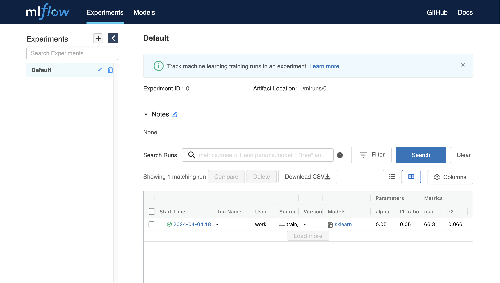

คุณยังสามารถตั้งค่าไฮเปอร์พารามิเตอร์โดยส่งอาร์กิวเมนต์กับการรันโค้ด

```shell
$ python train_diabetes.py 0.2 0.05
```

หลังจากการฝึกอบรมไม่กี่ครั้ง คุณสามารถเปรียบเทียบโมเดลที่ฝึกอบรมแล้วกับผลลัพธ์ได้

