# ภาคผนวก

<a id="gpu-virtualization-and-fractional-gpu-allocation"></a>

## การใช้ GPU เสมือนและการจัดสรร GPU แบบเศษส่วน

Backend.AI รองรับเทคโนโลยีการจำลอง GPU (GPU virtualization) ซึ่งช่วยให้ GPU ทางกายภาพเพียงตัวเดียวสามารถถูกแบ่งและแชร์ให้ผู้ใช้หลายคนใช้งานพร้อมกันได้ ดังนั้น หากคุณต้องการดำเนินงานที่ไม่ต้องใช้กำลังการประมวลผล GPU มากนัก คุณสามารถสร้างเซสชันการคำนวณโดยการจัดสรร GPU เพียงบางส่วนได้ ปริมาณทรัพยากร GPU ที่ 1 fGPU จัดสรรให้จริงอาจแตกต่างกันไปในแต่ละระบบ ขึ้นอยู่กับการตั้งค่าของผู้ดูแลระบบ ตัวอย่างเช่น หากผู้ดูแลระบบตั้งค่าให้หนึ่ง GPU ทางกายภาพถูกแบ่งออกเป็นห้าส่วน 5 fGPU จะหมายถึง 1 GPU ทางกายภาพ หรือ 1 fGPU จะเท่ากับ 0.2 GPU ทางกายภาพ หากคุณตั้งค่า 1 fGPU เมื่อสร้างเซสชันการคำนวณ เซสชันนั้นจะสามารถใช้งานสตรีมมิงมัลติโปรเซสเซอร์ (SM) และหน่วยความจำ GPU เทียบเท่ากับ 0.2 GPU ทางกายภาพได้

ในส่วนนี้ เราจะสร้างเซสชันการคำนวณโดยการจัดสรรส่วนหนึ่งของ GPU แล้วตรวจสอบว่า GPU ที่ถูกตรวจพบภายในคอนเทนเนอร์การคำนวณนั้นตรงกับ GPU ฟิสิกส์บางส่วนจริงหรือไม่

ก่อนอื่น ให้ตรวจสอบประเภทของ GPU ทางกายภาพที่ติดตั้งอยู่บนโหนดโฮสต์ รวมถึงปริมาณหน่วยความจำ โหนด GPU ที่ใช้ในคู่มือนี้มี GPU ที่มีหน่วยความจำ 8 GB ติดตั้งอยู่ ดังที่แสดงในภาพต่อไปนี้ และด้วยการตั้งค่าของผู้ดูแลระบบ 1 fGPU ถูกกำหนดให้เท่ากับ 0.5 GPU ทางกายภาพ (หรือ 1 GPU ทางกายภาพเท่ากับ 2 fGPU)

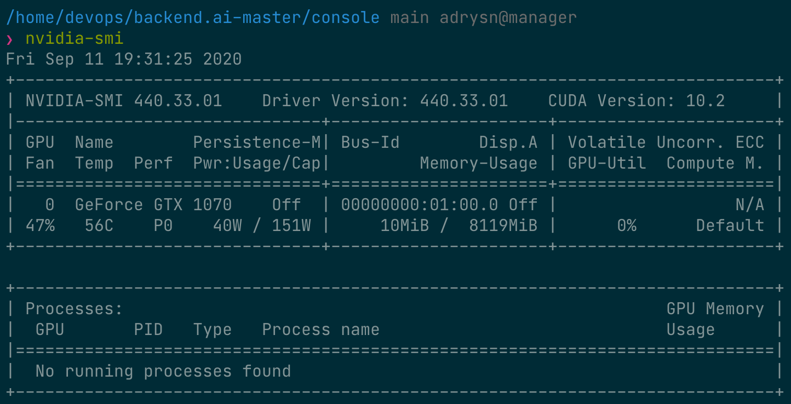

ตอนนี้ ให้ไปที่หน้าเซสชันและสร้างเซสชันการคำนวณโดยจัดสรร 0.5 fGPU ดังนี้:

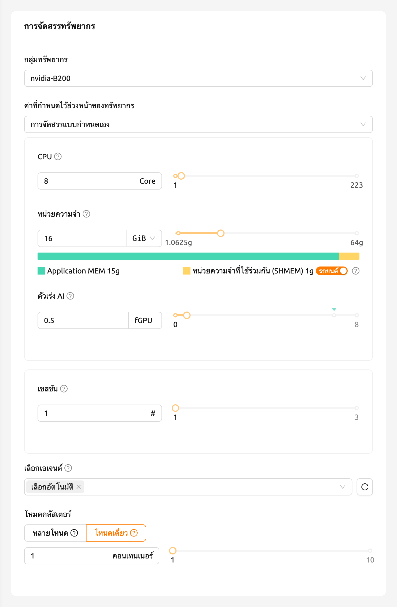

ในแผง AI Accelerator ของรายการเซสชัน คุณจะเห็นว่ามีการจัดสรร 0.5 fGPU

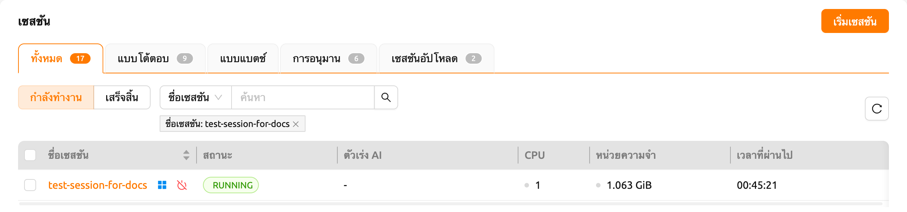

ตอนนี้ ให้เชื่อมต่อไปยังคอนเทนเนอร์โดยตรง และตรวจสอบว่าหน่วยความจำ GPU ที่ถูกจัดสรรนั้นเทียบเท่ากับ 0.5 หน่วยจริง (~2 GB) หรือไม่ ให้เปิดเว็บเทอร์มินัล เมื่อเทอร์มินัลเปิดขึ้น ให้รันคำสั่ง `nvidia-smi` ดังที่คุณเห็นในภาพต่อไปนี้ คุณจะเห็นว่ามีการจัดสรรหน่วยความจำ GPU ประมาณ 2 GB ซึ่งแสดงให้เห็นว่า GPU ทางกายภาพถูกแบ่งออกและจัดสรรเข้าไปในคอนเทนเนอร์สำหรับเซสชันการคำนวณนี้จริง ซึ่งไม่สามารถทำได้ด้วยวิธีการอย่าง PCI passthrough


มาเปิด Jupyter Notebook และรันโค้ดการฝึก ML ง่ายๆ กันเถอะ

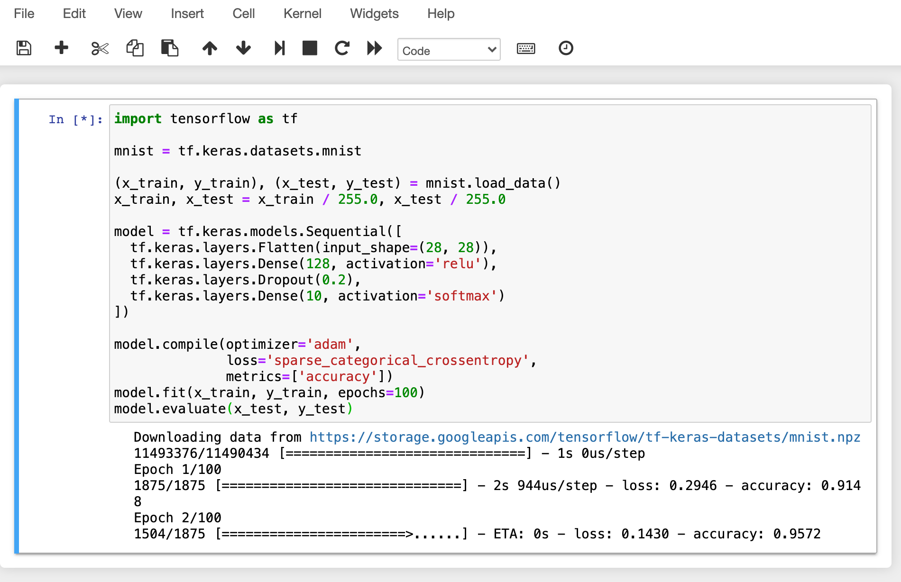

ในระหว่างที่กำลังฝึกสอน ให้เชื่อมต่อเข้ากับเชลล์ของโหนดโฮสต์ GPU และรันคำสั่ง `nvidia-smi` คุณจะเห็นว่ามี GPU หนึ่งตัวเชื่อมต่ออยู่กับโปรเซส และโปรเซสนี้กำลังใช้ทรัพยากรประมาณ 25% ของ GPU ทางกายภาพ (อัตราการใช้งาน GPU อาจแตกต่างกันมากขึ้นอยู่กับโค้ดการฝึกสอนและรุ่นของ GPU)


อีกวิธีหนึ่ง คุณสามารถรันคำสั่ง `nvidia-smi` จากเว็บเทอร์มินัลเพื่อเรียกดูประวัติการใช้งาน GPU ภายในคอนเทนเนอร์ได้


<a id="automated-job-scheduling"></a>

## การกำหนดตารางงานอัตโนมัติ

เซิร์ฟเวอร์ Backend.AI มีตัวจัดตารางงานที่พัฒนาขึ้นเองในตัว มันจะตรวจสอบทรัพยากรที่มีอยู่ของโหนดผู้ทำงานทั้งหมดโดยอัตโนมัติและมอบหมายคำขอในการสร้างเซสชันการคอมพิวเตอร์ไปยังผู้ทำงานที่ตรงตามคำขอทรัพยากรของผู้ใช้ นอกจากนี้ เมื่อทรัพยากรไม่เพียงพอ คำขอของผู้ใช้ในการสร้างเซสชันการคอมพิวเตอร์จะถูกลงทะเบียนในสถานะ PENDING ในคิวงาน ภายหลัง เมื่อทรัพยากรมีให้ใช้งานอีกครั้ง คำขอที่ถูกระงับจะถูกดำเนินการต่อเพื่อสร้างเซสชันการคอมพิวเตอร์

คุณสามารถตรวจสอบการทำงานของตัวจัดกำหนดงานได้ในลักษณะง่าย ๆ จากผู้ใช้ Web-UI เมื่อโฮสต์ GPU สามารถจัดสรร fGPU ได้สูงสุด 2 ตัว ให้เราสร้างเซสชันการคำนวณ 3 เซสชันพร้อมกันโดยขอจัดสรร fGPU 1 ตัวตามลำดับ ในส่วนการจัดสรรแบบกำหนดเองของกล่องโต้ตอบการเปิดเซสชัน จะมีตัวเลื่อนสำหรับ GPU และเซสชัน หากคุณระบุค่าที่มากกว่า 1 ในเซสชันและคลิกปุ่ม LAUNCH จำนวนเซสชันจะถูกขอพร้อมกัน ให้เราตั้งค่า GPU และเซสชันเป็น 1 และ 3 ตามลำดับ นี่คือสถานการณ์ที่มีเซสชัน 3 เซสชันที่ขอ fGPU ทั้งหมด 3 ตัว ในขณะที่มี fGPU เพียง 2 ตัวเท่านั้น

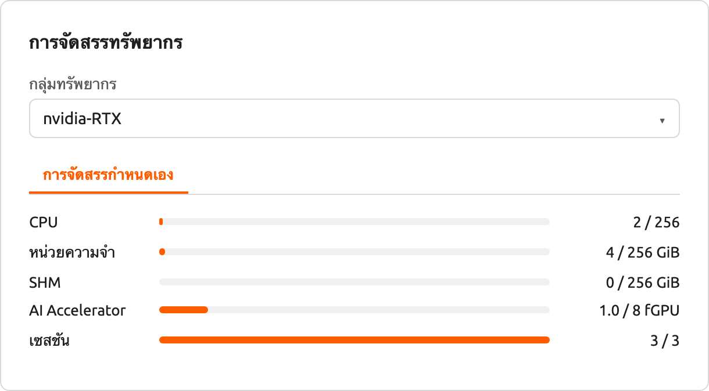

รอครู่หนึ่งแล้วคุณจะเห็นการเซสชันการคอมพิวเตอร์สามรายการถูกแสดงอยู่ ถ้าคุณสังเกตอย่างใกล้ชิดที่แผงสถานะ คุณจะเห็นว่าการเซสชันการคอมพิวเตอร์สองจากสามรายการอยู่ในสถานะ RUNNING แต่การเซสชันการคอมพิวเตอร์อีกหนึ่งรายการยังคงอยู่ในสถานะ PENDING การเซสชัน PENDING นี้ถูกลงทะเบียนในคิวงานเท่านั้นและยังไม่ได้ถูกจัดสรรคอนเทนเนอร์จริงเนื่องจากทรัพยากร GPU ไม่เพียงพอ

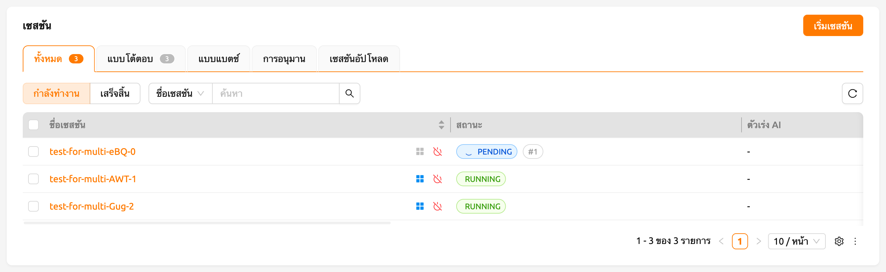

ตอนนี้เราจะทำลายหนึ่งในสองเซสชันที่อยู่ในสถานะ RUNNING จากนั้นคุณจะเห็นว่าเซสชันการคอมพิวเตอร์ในสถานะ PENDING จะถูกจัดสรรทรัพยากรโดยตัวจัดกำหนดงานและเปลี่ยนเป็นสถานะ RUNNING ในไม่ช้า ในลักษณะนี้ ตัวจัดกำหนดงานจะใช้คิวงานเพื่อเก็บคำขอเซสชันการคอมพิวเตอร์ของผู้ใช้และประมวลผลคำขอโดยอัตโนมัติเมื่อมีทรัพยากรพร้อมใช้งาน

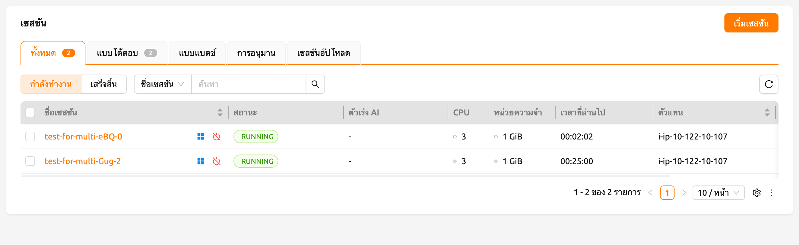


<a id="multi-version-machine-learning-container-support"></a>

## การสนับสนุนคอนเทนเนอร์การเรียนรู้ของเครื่องหลายเวอร์ชัน

Backend.AI มีภาพเคอร์เนล ML และ HPC ที่สร้างไว้ล่วงหน้าหลายแบบ ผู้ใช้จึงสามารถใช้ห้องสมุดและแพ็คเกจหลักได้ทันทีโดยไม่ต้องติดตั้งแพ็คเกจด้วยตนเอง ที่นี่เราจะแสดงตัวอย่างที่ใช้ประโยชน์จากหลายเวอร์ชันของห้องสมุด ML หลายตัวทันที

ไปที่หน้า เซสชัน และเปิดกล่องสนทนาเริ่มต้นเซสชัน อาจมีภาพเคอร์เนลหลายประเภทขึ้นอยู่กับการตั้งค่าการติดตั้ง

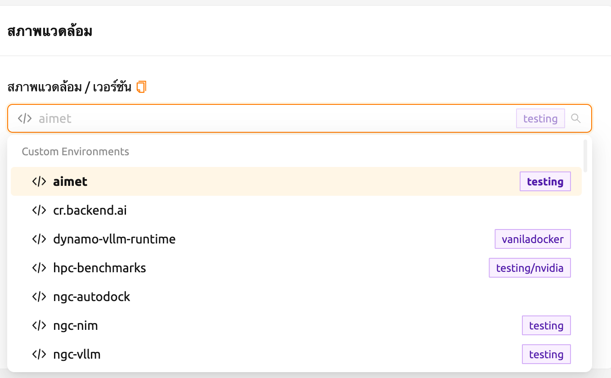

ที่นี่ ให้เลือกสภาพแวดล้อม TensorFlow 2.3 และสร้างเซสชัน

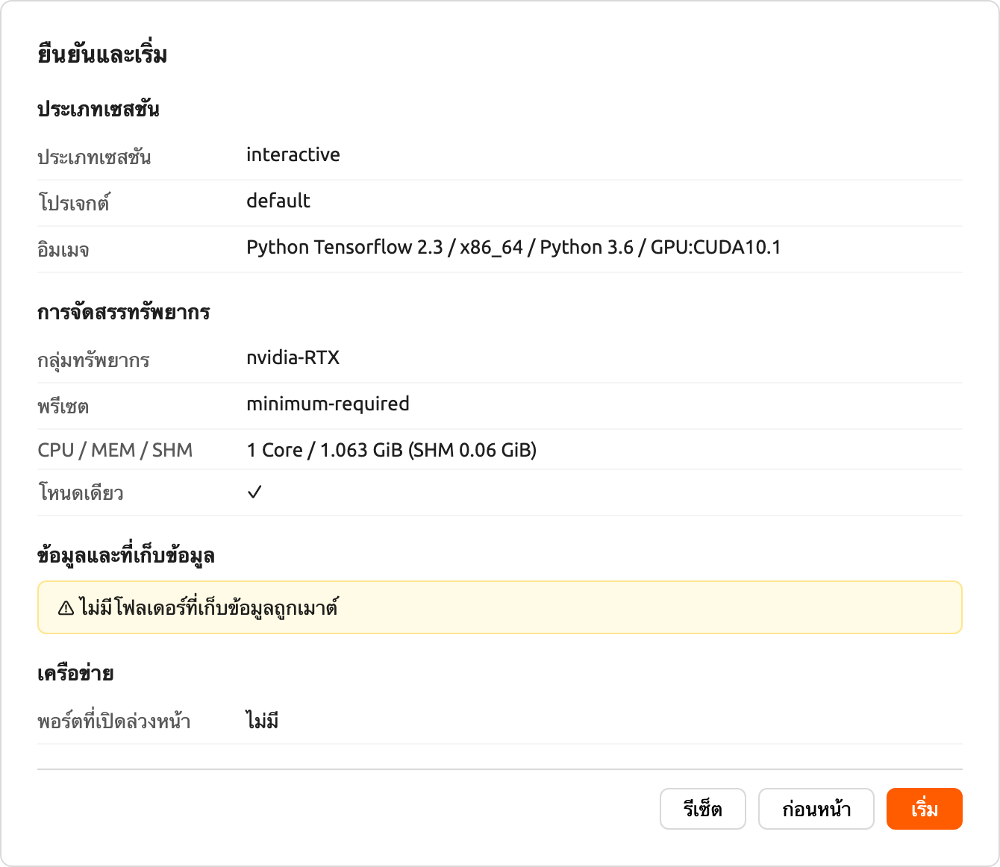

เปิดเว็บเทอร์มินัลของเซสชันที่สร้างขึ้น และรันคำสั่ง Python ต่อไปนี้ คุณจะเห็นว่ามีการติดตั้ง TensorFlow เวอร์ชัน 2.3 อยู่


คราวนี้ ให้เลือกสภาพแวดล้อม TensorFlow 1.15 เพื่อสร้างเซสชันการคำนวณ หากทรัพยากรไม่เพียงพอ ให้ลบเซสชันก่อนหน้าออก

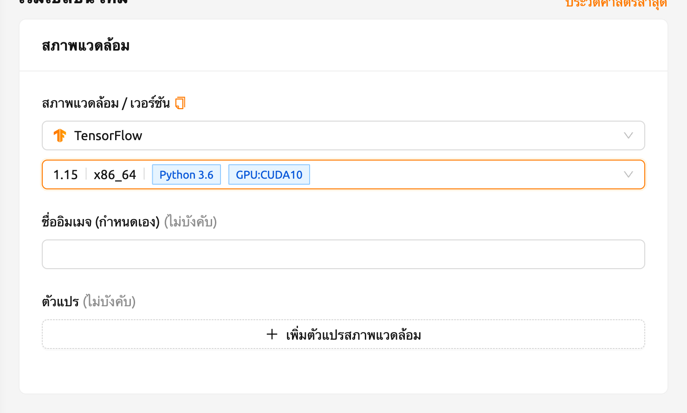

เปิดเว็บเทอร์มินัลของเซสชันที่สร้างขึ้นแล้วรันคำสั่ง Python เดียวกันกับที่ทำก่อนหน้านี้ คุณจะเห็นว่ามีการติดตั้ง TensorFlow เวอร์ชัน 1.15(.4) อยู่

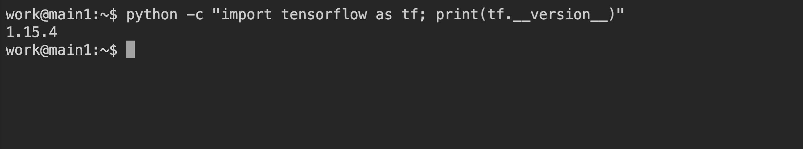

สุดท้าย ให้สร้างเซสชันการคำนวณโดยใช้ PyTorch เวอร์ชัน 1.7

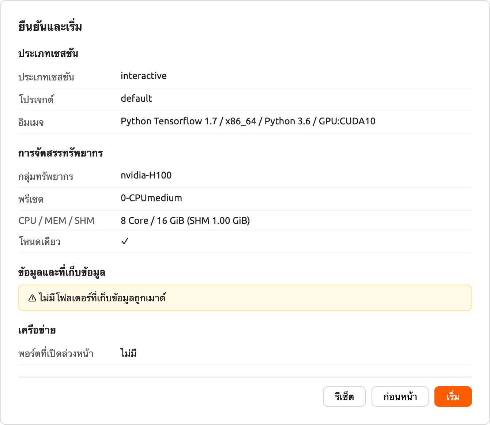

เปิดเว็บเทอร์มินัลของเซสชันที่สร้างขึ้น และรันคำสั่ง Python ต่อไปนี้ คุณจะเห็นว่ามีการติดตั้ง PyTorch เวอร์ชัน 1.8 อยู่

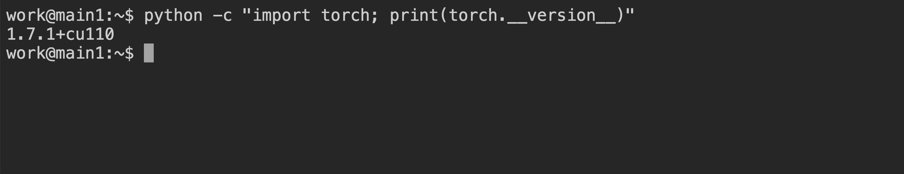

เช่นนี้ คุณสามารถใช้เวอร์ชันต่าง ๆ ของไลบรารีหลัก เช่น TensorFlow และ PyTorch ผ่าน Backend.AI โดยไม่ต้องพยายามติดตั้งโดยไม่จำเป็น


<a id="convert-a-compute-session-to-a-new-private-docker-image"></a>

## แปลงเซสชันการคอมพิวเตอร์เป็นภาพ Docker ส่วนตัวใหม่

หากคุณต้องการแปลงเซสชันการประมวลผลที่กำลังทำงาน (คอนเทนเนอร์) เป็นภาพ Docker ใหม่ที่คุณสามารถใช้ในภายหลังเพื่อสร้างเซสชันการประมวลผลใหม่ คุณต้องเตรียมสภาพแวดล้อมของเซสชันการประมวลผลของคุณและขอให้ผู้ดูแลระบบทำการแปลงมัน

- ก่อนอื่น ให้เตรียมเซสชันการคอมพิวเตอร์ของคุณโดยการติดตั้งแพ็คเกจที่คุณต้องการและปรับแต่งการตั้งค่าตามที่คุณต้องการ

:::note
หากคุณต้องการติดตั้งแพ็คเกจ OS เช่น ผ่านคำสั่ง `apt` โดยปกติจะต้องมีสิทธิ์ `sudo` ขึ้นอยู่กับนโยบายความปลอดภัยขององค์กร คุณอาจไม่ได้รับอนุญาตให้ใช้ `sudo` ภายในคอนเทนเนอร์

แนะนำให้ใช้ [โฟลเดอร์ออโต้เมาท์](#using-automount-folder) เพื่อ[ติดตั้งแพ็คเกจ Python ผ่าน pip](#install_pip_pkg) อย่างไรก็ตาม หากคุณต้องการเพิ่มแพ็คเกจ Python ในอิมเมจใหม่ คุณควรติดตั้งด้วย `sudo pip install <ชื่อแพ็คเกจ>` เพื่อบันทึกไว้ในไดเรกทอรีระบบแทนที่จะเป็นโฮมไดเรกทอรี เนื้อหาในโฮมไดเรกทอรีของคุณ ซึ่งปกติคือ `/home/work/` จะไม่ถูกบันทึกเมื่อแปลงเซสชันการคอมพิวเตอร์เป็นอิมเมจ Docker ใหม่
:::

- เมื่อเซสชันการคอมพิวเตอร์ของคุณเตรียมพร้อมแล้ว กรุณาขอให้ผู้ดูแลระบบแปลงเป็นอิมเมจ Docker ใหม่ คุณต้องแจ้งชื่อเซสชันหรือ ID และที่อยู่อีเมลของคุณในแพลตฟอร์ม
- ผู้ดูแลระบบจะแปลงเซสชันการคอมพิวเตอร์ของคุณเป็นอิมเมจ Docker ใหม่และส่งชื่ออิมเมจเต็มและแท็กให้คุณ
- คุณสามารถป้อนชื่ออิมเมจในกล่องโต้ตอบเปิดเซสชันด้วยตนเอง อิมเมจนี้เป็นส่วนตัวและจะไม่แสดงให้ผู้ใช้อื่นเห็น

  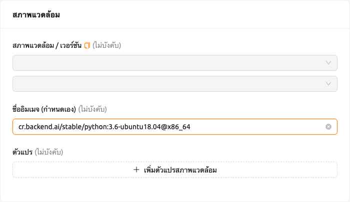

- เซสชันการคอมพิวเตอร์ใหม่จะถูกสร้างขึ้นโดยใช้อิมเมจ Docker ใหม่


<a id="backend-ai-server-installation-guide"></a>

## คู่มือการติดตั้งเซิร์ฟเวอร์ Backend.AI

สำหรับ Backend.AI Server daemons/services จำเป็นต้องมีฮาร์ดแวร์ตามข้อกำหนดต่อไปนี้ เพื่อประสิทธิภาพสูงสุด ให้เพิ่มจำนวนทรัพยากรแต่ละรายการเป็นสองเท่า

- Manager: 2 คอร์, 4 GiB หน่วยความจำ
- Agent: 4 คอร์, 32 GiB หน่วยความจำ, NVIDIA GPU (สำหรับ GPU workload), > 512 GiB SSD
- Webserver: 2 คอร์, 4 GiB หน่วยความจำ
- WSProxy: 2 คอร์, 4 GiB หน่วยความจำ
- PostgreSQL DB: 2 คอร์, 4 GiB หน่วยความจำ
- Redis: 1 คอร์, 2 GiB หน่วยความจำ
- Etcd: 1 คอร์, 2 GiB หน่วยความจำ

แพ็คเกจที่ต้องติดตั้งล่วงหน้าบนโฮสต์ก่อนติดตั้งแต่ละบริการ:

- Web-UI: ระบบปฏิบัติการที่สามารถรันเบราว์เซอร์ล่าสุดได้ (Windows, Mac OS, Ubuntu เป็นต้น)
- Manager: Python (≥3.8), pyenv/pyenv-virtualenv (≥1.2)
- Agent: docker (≥19.03), CUDA/CUDA Toolkit (≥8, แนะนำ 11), nvidia-docker v2, Python (≥3.8), pyenv/pyenv-virtualenv (≥1.2)
- Webserver: Python (≥3.8), pyenv/pyenv-virtualenv (≥1.2)
- WSProxy: docker (≥19.03), docker-compose (≥1.24)
- PostgreSQL DB: docker (≥19.03), docker-compose (≥1.24)
- Redis: docker (≥19.03), docker-compose (≥1.24)
- Etcd: docker (≥19.03), docker-compose (≥1.24)

สำหรับเวอร์ชัน Enterprise, Backend.AI server daemons จะถูกติดตั้งโดยทีมสนับสนุนของ Lablup และมีการจัดส่งเอกสาร/บริการต่อไปนี้หลังจากการติดตั้งครั้งแรก:

- DVD 1 แผ่น (รวมแพ็คเกจ Backend.AI)
- คู่มือ GUI สำหรับผู้ใช้
- คู่มือ GUI สำหรับผู้ดูแลระบบ
- รายงานการติดตั้ง
- บทเรียนสำหรับผู้ใช้/ผู้ดูแลระบบครั้งแรก (3-5 ชั่วโมง)

ข้อมูลการบำรุงรักษาและสนับสนุนผลิตภัณฑ์: สัญญาการค้ารวมค่าสมัครสมาชิกรายเดือน/รายปีสำหรับเวอร์ชัน Enterprise เป็นค่าเริ่มต้น การฝึกอบรมผู้ใช้/ผู้ดูแลระบบครั้งแรก (1-2 ครั้ง) และบริการสนับสนุนลูกค้าแบบมีสาย/ไร้สายจะให้บริการประมาณ 2 สัปดาห์หลังการติดตั้งครั้งแรก การสนับสนุนการอัปเดตรุ่นย่อยและบริการสนับสนุนลูกค้าผ่านช่องทางออนไลน์จะให้บริการเป็นเวลา 3-6 เดือน บริการบำรุงรักษาและสนับสนุนที่ให้บริการหลังจากนั้นอาจมีรายละเอียดที่แตกต่างกันขึ้นอยู่กับเงื่อนไขของสัญญา


<a id="integration-examples"></a>

## ตัวอย่างการผสานรวม

ในส่วนนี้ เราขอแนะนำตัวอย่างทั่วไปของแอปพลิเคชัน ชุดเครื่องมือ และเครื่องมือแมชชีนเลิร์นนิงที่สามารถใช้บนแพลตฟอร์ม Backend.AI ที่นี่ เราจะอธิบายการใช้งานพื้นฐานของแต่ละเครื่องมือและวิธีการตั้งค่าในสภาพแวดล้อม Backend.AI พร้อมตัวอย่างง่ายๆ เราหวังว่าสิ่งนี้จะช่วยให้คุณเลือกและใช้เครื่องมือที่จำเป็นสำหรับโปรเจกต์ของคุณ

โปรดทราบว่าเนื้อหาในคู่มือนี้อิงตามเวอร์ชันเฉพาะของโปรแกรม ดังนั้นการใช้งานอาจแตกต่างกันในอัปเดตในอนาคต ดังนั้น โปรดใช้เอกสารนี้เป็นข้อมูลอ้างอิงและตรวจสอบเอกสารอย่างเป็นทางการล่าสุดสำหรับการเปลี่ยนแปลงใดๆ ตอนนี้ มาดูเครื่องมือที่มีประสิทธิภาพที่มีให้ใช้บน Backend.AI ทีละตัว เราหวังว่าส่วนนี้จะเป็นคู่มือที่มีประโยชน์สำหรับการวิจัยและพัฒนาของคุณ

#### การใช้ MLFlow

มีอิมเมจที่รันได้หลายตัวใน Backend.AI ที่สนับสนุน MLFlow และ MLFlow UI เป็นแอปในตัว แต่เพื่อที่จะรันได้ คุณอาจต้องมีขั้นตอนเพิ่มเติม โดยทำตามคำแนะนำด้านล่าง คุณจะสามารถติดตามพารามิเตอร์และผลลัพธ์ใน Backend.AI ได้เหมือนกับที่คุณใช้ในสภาพแวดล้อมท้องถิ่น

:::note
ในส่วนนี้ เราถือว่าคุณได้สร้างเซสชันแล้วและกำลังจะรันแอปในเซสชัน หากคุณไม่มีประสบการณ์ในการสร้างเซสชันและรันแอปภายใน กรุณาดู[วิธีสร้างเซสชัน](#start-a-new-session)
:::

ก่อนอื่น เปิดแอปเทอร์มินัล "console" และรันคำสั่งด้านล่าง ซึ่งจะเริ่มเซิร์ฟเวอร์ MLFlow tracking UI

```bash
mlflow ui --host 0.0.0.0
```

จากนั้น คลิกแอป "MLFlow UI" ในกล่องโต้ตอบตัวเปิดแอป


หลังจากสักครู่ คุณจะเห็นหน้าใหม่สำหรับ MLFlow UI

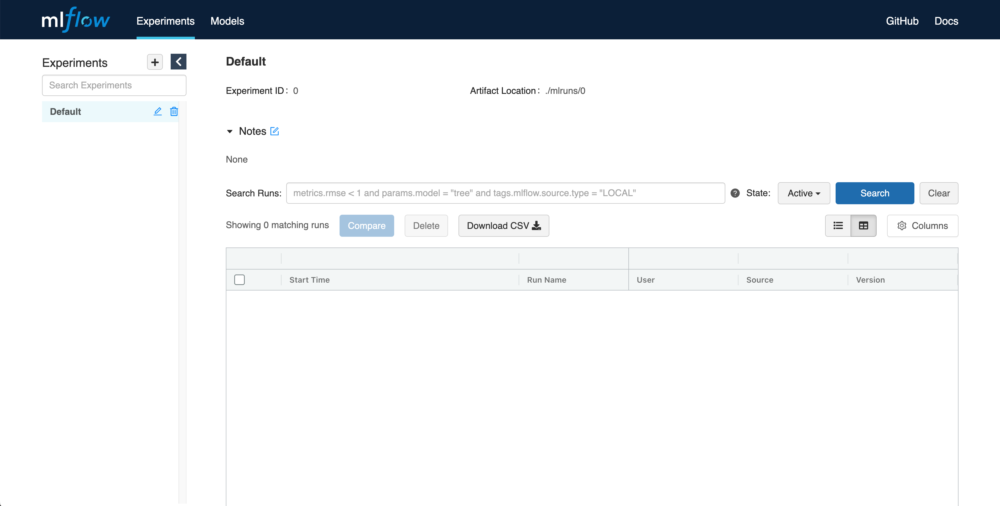

การใช้ MLFlow ช่วยให้คุณติดตามการทดลอง เช่น เมตริกและพารามิเตอร์ทุกครั้งที่คุณรัน มาเริ่มติดตามการทดลองจากตัวอย่างง่ายๆ

```bash
wget https://raw.githubusercontent.com/mlflow/mlflow/master/examples/sklearn_elasticnet_diabetes/linux/train_diabetes.py
python train_diabetes.py
```

หลังจากรันโค้ด Python คุณจะเห็นผลลัพธ์การทดลองใน MLFlow

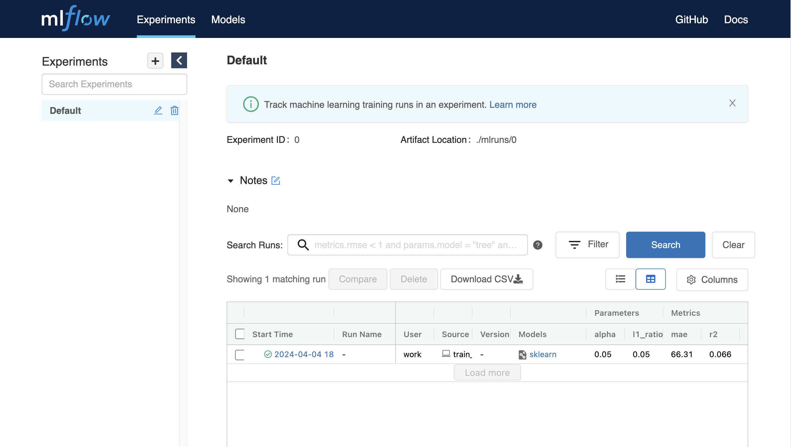

คุณยังสามารถตั้งค่าไฮเปอร์พารามิเตอร์โดยส่งอาร์กิวเมนต์กับการรันโค้ด

```bash
python train_diabetes.py 0.2 0.05
```

หลังจากการฝึกอบรมไม่กี่ครั้ง คุณสามารถเปรียบเทียบโมเดลที่ฝึกอบรมแล้วกับผลลัพธ์ได้

