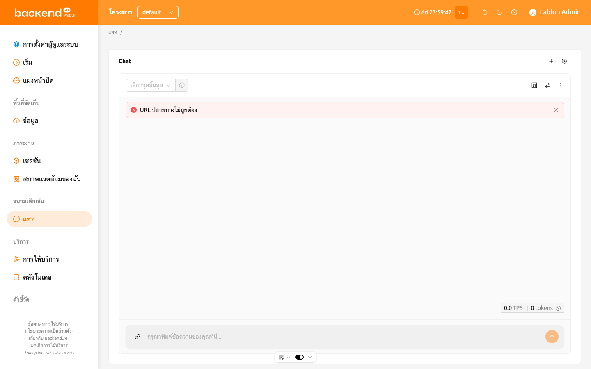
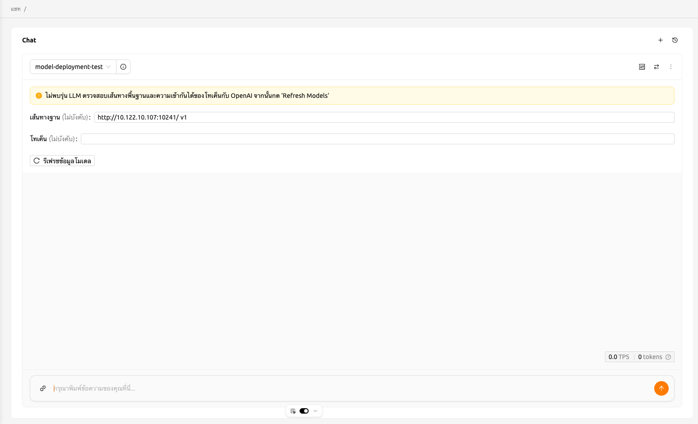
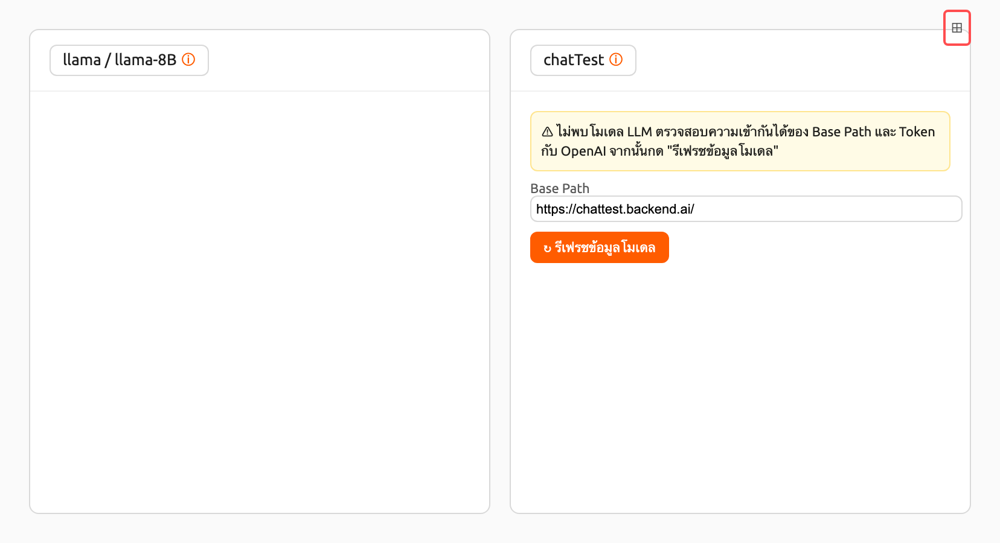
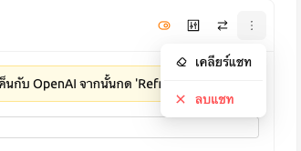
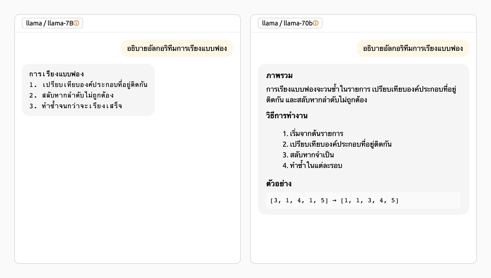
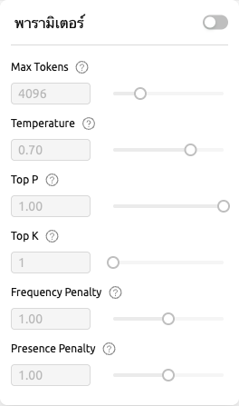
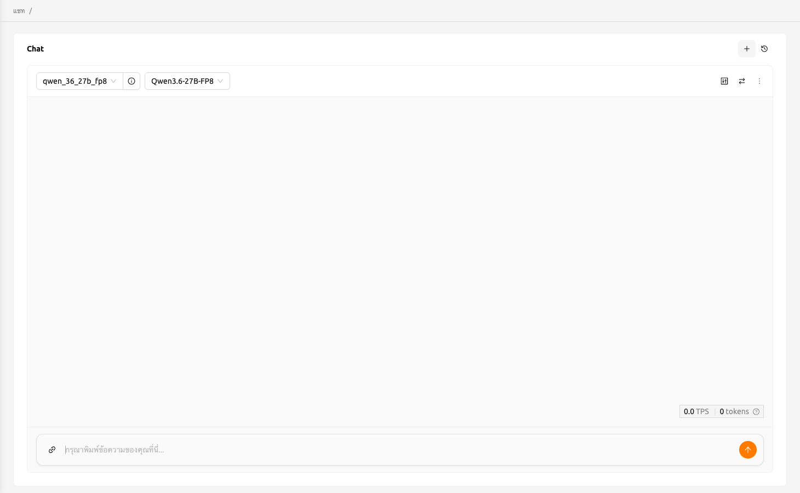
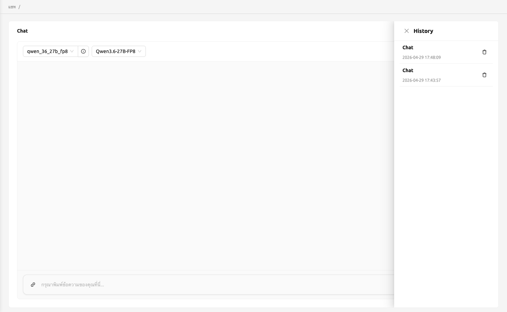
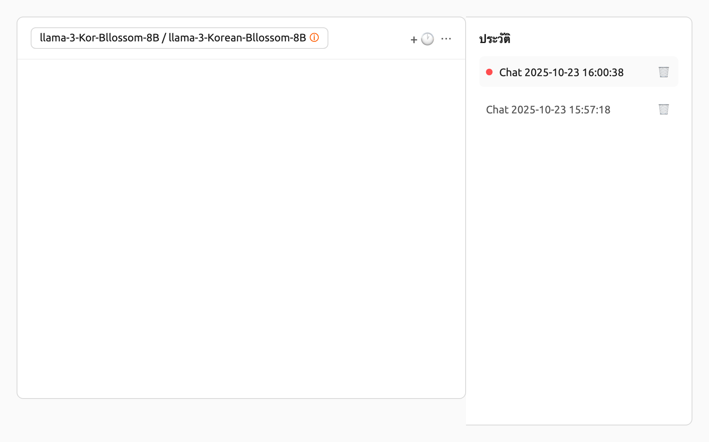

# Chat Page

Starting from version 25.05, the 'LLM Playground' feature has been separated into its own page and renamed to Chat.
Chat page enables ผู้ใช้s to conveniently compare and interact with different LLM models all in one location.
This allows ผู้ใช้s to experience the services offered by Backend.AI as well as a variety of large language models (LLMs).

## Selecting models

Users can select the endpoint and model from the top left corner of each chat card on the Chat page.
Clicking the endpoint field allows ผู้ใช้s to search for or choose from available endpoints, and the model can be selected in the same way.
If no model is associated with the selected endpoint, verify the base path and token compatibility with OpenAI, then click the 'Refresh model info' button.

Refer to the description below for the necessary inputs to configure custom modal settings:

- baseURL (optional): Base URL of the server where the model is located.
  Make sure to include the version information.
  For instance, when utilizing the OpenAI API, ผู้ใช้s should enter https://api.openai.com/v1.
- Token (optional): An authentication key to access the model service. Tokens can be
  generated from various services, not just Backend.AI. The format and generation process
  may vary depending on the service. Always refer to the specific service's guide for details.
  For instance, when using the service generated by Backend.AI, please refer to the
  [Generating Tokens](#generating-tokens) section for instructions on how to generate tokens.

## Add or remove comparison chat cards

To add new comparison chat cards, click the comparison icon button located in the top right corner.

To remove a chat session, click on the 'more' button located in the upper right corner of the chat card.
Then a dropdown menu will appear, and ผู้ใช้s can select 'Delete Chat' to remove a chat session.
Please be cautious as this will delete all entered content.

## Clear chat history

Clicking the 'more' button will reveal the 'Clear chat' option.
By selecting this, ผู้ใช้s will erase all chat history associated with the card,
although the card session itself will remain active.

## Synchronize input

The 'Sync Input' button, located at the top right, enables the synchronization of input across chat cards where the option is enabled.
Enabling 'Sync input' means that pressing 'Enter' or clicking the 'Send' button on
any card will submit the input from the card ผู้ใช้s are currently working on.
This functionality is beneficial for comparing the outputs of various models using identical input data.

## Parameter adjustment

Click the parameter button in the top-right corner to adjust the parameters for each model. Users can set various values such as Max Tokens, Temperature, Top P, and Top K.
Using the synchronize feature, ผู้ใช้s can apply different parameters to the same model and then compare the results.

## Chat history

To start new chat, click the '+' button located in the top right corner.

All chat history is stored in local storage, and ผู้ใช้s can access previous chats by clicking the history button in the top-right corner.

