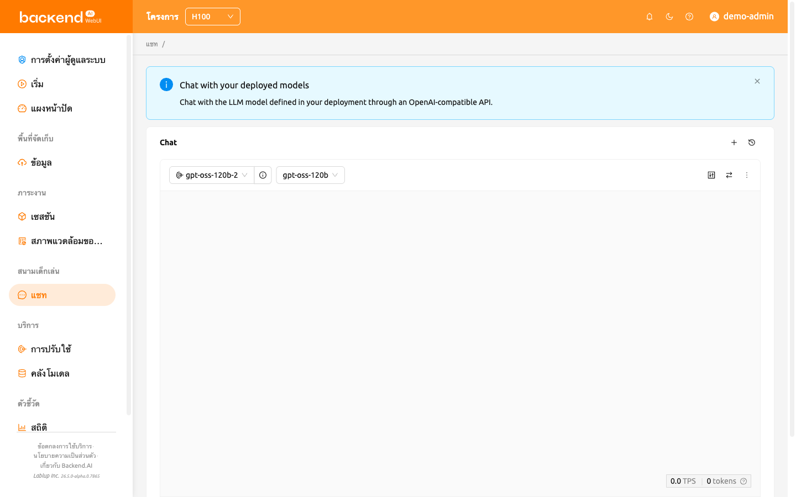
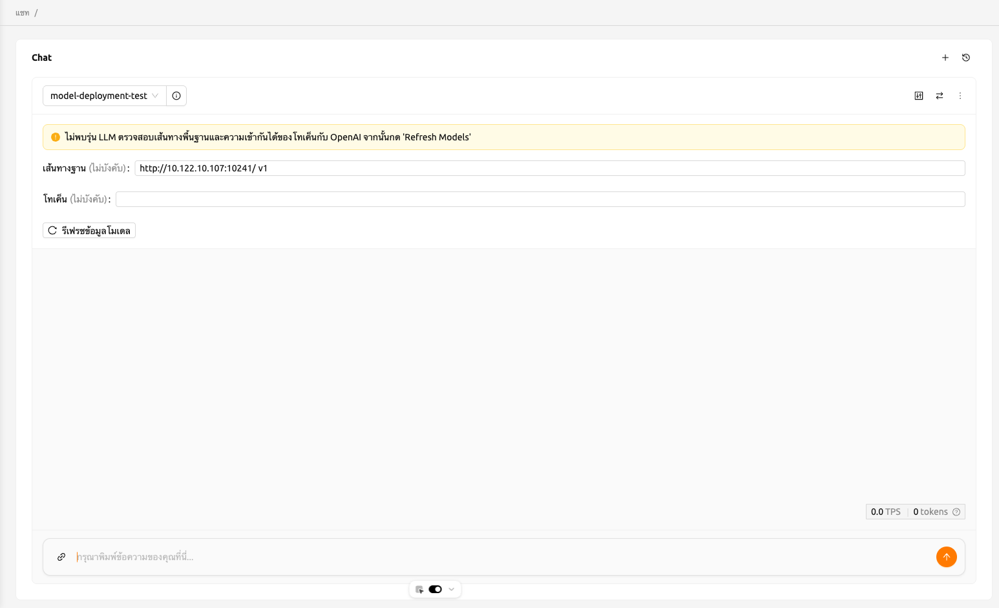
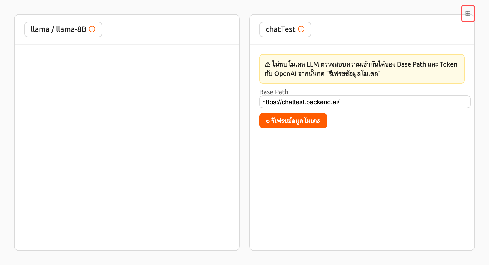
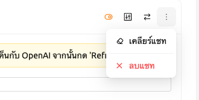
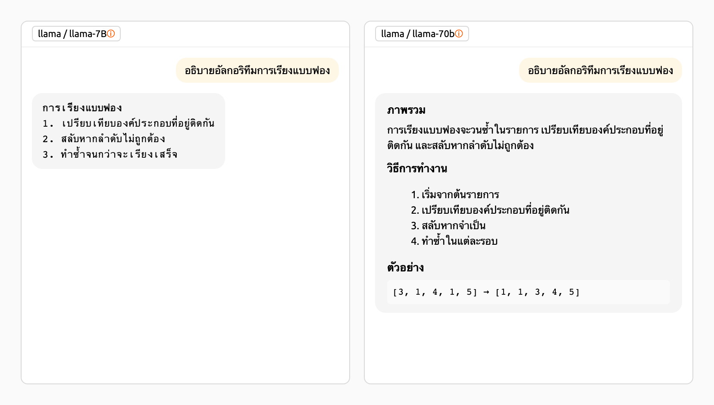
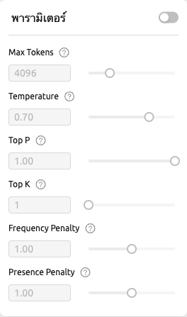
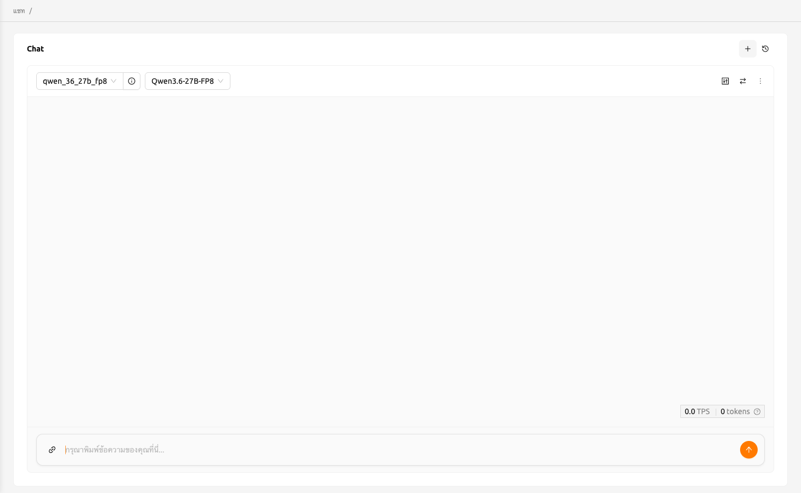
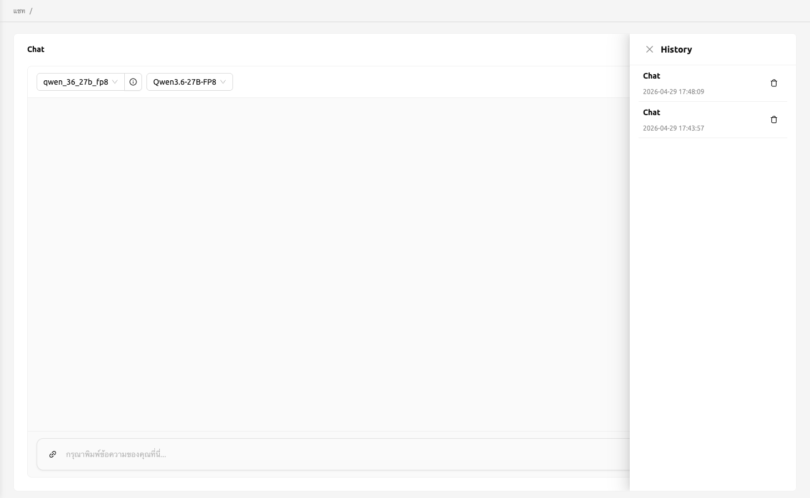

# หน้าแชท

ตั้งแต่เวอร์ชัน 25.05 เป็นต้นไป คุณสมบัติ 'LLM Playground' ได้ถูกแยกออกเป็นหน้าของตัวเองและเปลี่ยนชื่อเป็น Chat
หน้า Chat ช่วยให้ผู้ใช้สามารถเปรียบเทียบและโต้ตอบกับโมเดล LLM ที่แตกต่างกันได้อย่างสะดวกในที่เดียว
ซึ่งช่วยให้ผู้ใช้สามารถสัมผัสประสบการณ์บริการที่ Backend.AI นำเสนอ รวมถึงโมเดลภาษาขนาดใหญ่ (LLMs) ที่หลากหลาย

## การเลือกโมเดล

ผู้ใช้สามารถเลือก endpoint และโมเดลได้จากมุมซ้ายบนของการ์ดแชทแต่ละใบในหน้า Chat
การคลิกที่ช่อง endpoint จะทำให้ผู้ใช้สามารถค้นหาหรือเลือกจาก endpoint ที่มีอยู่ได้ และสามารถเลือกโมเดลได้ในลักษณะเดียวกัน
หากไม่มีโมเดลที่เชื่อมโยงกับ endpoint ที่เลือกไว้ ให้ตรวจสอบ base path และความเข้ากันได้ของโทเค็นกับ OpenAI จากนั้นคลิกปุ่ม 'Refresh model info'

โปรดดูคำอธิบายด้านล่างสำหรับข้อมูลอินพุตที่จำเป็นในการกำหนดค่าโมเดลแบบกำหนดเอง:

- baseURL (ไม่บังคับ): Base URL ของเซิร์ฟเวอร์ที่โมเดลตั้งอยู่
  โปรดระบุข้อมูลเวอร์ชันด้วย
  ตัวอย่างเช่น เมื่อใช้ OpenAI API ผู้ใช้ควรป้อน https://api.openai.com/v1
- Token (ไม่บังคับ): คีย์การพิสูจน์ตัวตนเพื่อเข้าถึงบริการโมเดล โทเค็นสามารถ
  สร้างได้จากบริการต่าง ๆ ไม่เพียงแต่ Backend.AI เท่านั้น รูปแบบและกระบวนการสร้าง
  อาจแตกต่างกันไปขึ้นอยู่กับบริการ โปรดดูคู่มือของบริการนั้น ๆ สำหรับรายละเอียด
  ตัวอย่างเช่น เมื่อใช้บริการที่สร้างโดย Backend.AI โปรดดูส่วน
  [การสร้างโทเค็น](#generating-tokens) สำหรับคำแนะนำในการสร้างโทเค็น

## เพิ่มหรือลบการ์ดแชทเปรียบเทียบ

หากต้องการเพิ่มการ์ดแชทเปรียบเทียบใหม่ ให้คลิกปุ่มไอคอนเปรียบเทียบที่อยู่มุมขวาบน

หากต้องการลบเซสชันแชท ให้คลิกปุ่ม 'more' ที่อยู่มุมขวาบนของการ์ดแชท
จากนั้นเมนูแบบดร็อปดาวน์จะปรากฏขึ้น และผู้ใช้สามารถเลือก 'Delete Chat' เพื่อลบเซสชันแชทได้
โปรดระมัดระวังเนื่องจากการกระทำนี้จะลบเนื้อหาทั้งหมดที่ป้อนไว้

## ล้างประวัติการแชท

การคลิกปุ่ม 'more' จะแสดงตัวเลือก 'Clear chat'
เมื่อเลือกตัวเลือกนี้ ผู้ใช้จะลบประวัติการแชททั้งหมดที่เชื่อมโยงกับการ์ด
แต่เซสชันของการ์ดเองจะยังคงทำงานอยู่

## ซิงโครไนซ์อินพุต

ปุ่ม 'Sync Input' ที่อยู่มุมขวาบน ช่วยให้สามารถซิงโครไนซ์อินพุตระหว่างการ์ดแชทที่เปิดใช้งานตัวเลือกนี้ได้
การเปิดใช้งาน 'Sync input' หมายความว่า เมื่อกด 'Enter' หรือคลิกปุ่ม 'Send'
บนการ์ดใดก็ตาม อินพุตจากการ์ดที่ผู้ใช้กำลังใช้งานอยู่จะถูกส่งไปยังการ์ดอื่น ๆ ด้วย
ฟังก์ชันนี้มีประโยชน์สำหรับการเปรียบเทียบผลลัพธ์ของโมเดลต่าง ๆ โดยใช้ข้อมูลอินพุตเดียวกัน

## การปรับพารามิเตอร์

คลิกปุ่มพารามิเตอร์ที่มุมขวาบนเพื่อปรับพารามิเตอร์สำหรับแต่ละโมเดล ผู้ใช้สามารถตั้งค่าต่าง ๆ เช่น Max Tokens, Temperature, Top P และ Top K ได้
เมื่อใช้คุณสมบัติการซิงโครไนซ์ ผู้ใช้สามารถนำพารามิเตอร์ที่แตกต่างกันไปใช้กับโมเดลเดียวกัน แล้วเปรียบเทียบผลลัพธ์ได้

## ประวัติการแชท

หากต้องการเริ่มแชทใหม่ ให้คลิกปุ่ม '+' ที่อยู่มุมขวาบน

ประวัติการแชททั้งหมดจะถูกจัดเก็บไว้ใน local storage และผู้ใช้สามารถเข้าถึงการแชทก่อนหน้าได้โดยการคลิกปุ่มประวัติที่มุมขวาบน

