

# หน้าแชท

หน้า Chat ช่วยให้ผู้ใช้สามารถเปรียบเทียบและโต้ตอบกับโมเดล LLM ที่แตกต่างกันได้อย่างสะดวกในที่เดียว
ซึ่งช่วยให้ผู้ใช้สามารถสัมผัสประสบการณ์บริการที่ Backend.AI นำเสนอ รวมถึงโมเดลภาษาขนาดใหญ่ (LLMs) ที่หลากหลาย

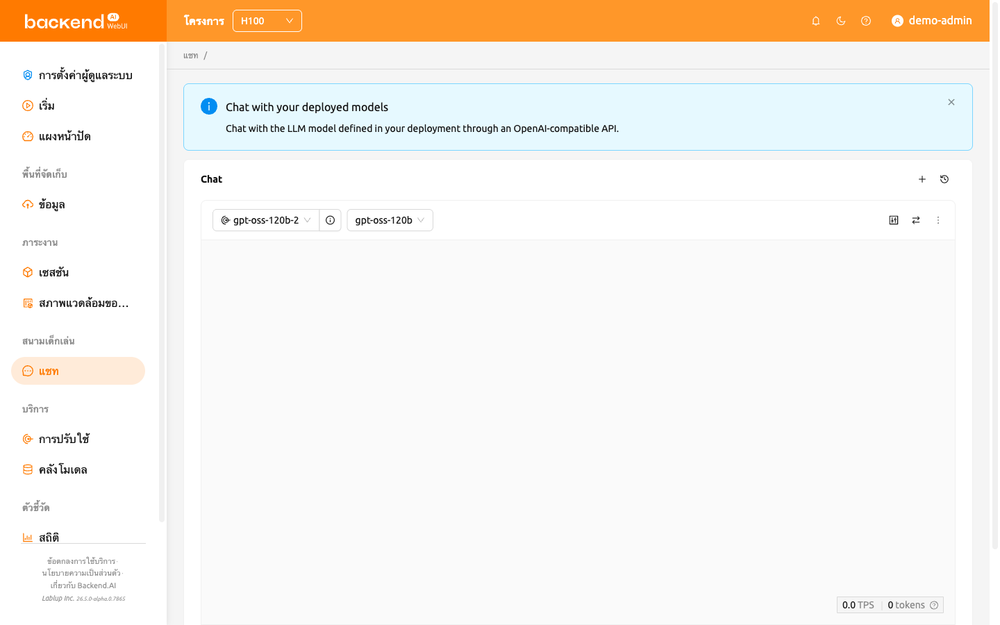

:::note
เมื่อคุณเยี่ยมชมหน้า Chat เป็นครั้งแรก แบนเนอร์แนะนำจะปรากฏที่ด้านบนของหน้า:
"แชทกับโมเดลที่ปรับใช้ของคุณ — แชทกับโมเดล LLM ที่กำหนดไว้ในการปรับใช้ของคุณผ่าน API ที่เข้ากันได้กับ OpenAI"
คุณสามารถปิดแบนเนอร์นี้ได้โดยคลิกปุ่มปิด และแบนเนอร์จะไม่ปรากฏอีกหลังจากที่ปิดไปแล้ว
:::

## การเลือกโมเดล

ผู้ใช้สามารถเลือก deployment และโมเดลได้จากมุมซ้ายบนของการ์ดแชทแต่ละใบในหน้า Chat
การคลิกที่ช่อง **Deployment** จะเปิดเมนูแบบดร็อปดาวน์ที่แสดงรายการ deployment ที่มีอยู่พร้อมจำนวน deployment ทั้งหมด
เมื่อเลือก deployment แล้ว หัวข้อของเมนูดร็อปดาวน์โมเดลจะอัปเดตเป็น "โมเดลของ {ชื่อ deployment}" ซึ่งจะแสดงรายการโมเดลที่เชื่อมโยงกับ deployment นั้น

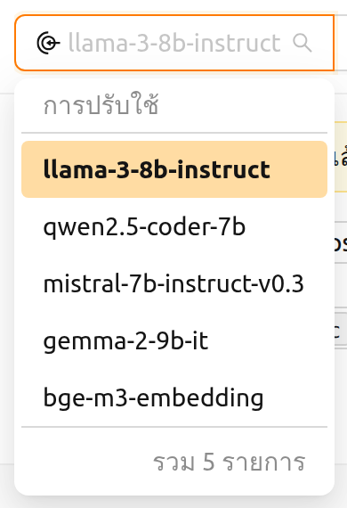

ปุ่มไอคอนข้อมูลข้างช่อง **Deployment** (**ดูรายละเอียดการปรับใช้**) ใช้เปิดหน้ารายละเอียดของ deployment ที่เลือก ปุ่มนี้จะถูกปิดใช้งานเมื่อยังไม่ได้เลือก deployment
หาก deployment ที่เลือกเป็นของโปรเจกต์อื่นที่ไม่ใช่โปรเจกต์ที่ใช้งานอยู่ในปัจจุบัน กล่องโต้ตอบยืนยันชื่อ **ต้องการสลับไปยังโปรเจกต์อื่นหรือไม่** จะปรากฏขึ้นก่อนเปิดหน้ารายละเอียด

### deployment ที่แสดงในรายการ

เมนูดร็อปดาวน์ **Deployment** จะไม่แสดง deployment ทั้งหมดในโปรเจกต์ แต่จะแสดงเฉพาะรายการที่สามารถตอบข้อความได้ในขณะนี้เท่านั้น deployment จะปรากฏในรายการเมื่อมีเรพลิกาอย่างน้อยหนึ่งตัวที่กำลังให้บริการทราฟฟิกอยู่ นั่นคือเรพลิกาที่มี **สถานะ Lifecycle** เป็น *กำลังทำงาน* และ **สถานะ Traffic** เป็น *ใช้งานอยู่* ต้องเป็นไปตามทั้งสองเงื่อนไข เนื่องจากสถานะทั้งสองเป็นมิติที่เป็นอิสระต่อกัน เรพลิกาที่ *กำลังทำงาน* อาจถูกนำออกจากการรับทราฟฟิกไปแล้ว และเรพลิกาที่ระบุว่า *ใช้งานอยู่* อาจไม่ได้ทำงานอยู่แล้วก็ได้ รายละเอียดของมิติสถานะเรพลิกาอธิบายไว้ในบท [การปรับใช้](#model-serving)

เนื่องจากการพิจารณาทำในระดับเรพลิกาแทนที่จะเป็นระดับ deployment ทำให้ deployment ยังคงเลือกได้ในระหว่างที่กำลังทยอยปรับใช้รีวิชันใหม่ หลังจากคุณใช้รีวิชันใหม่ เซสชัน inference ของรีวิชันนั้นอาจอยู่ในสถานะรอเป็นระยะเวลาหนึ่ง เช่น ระหว่างรอทรัพยากร แต่ในระหว่างนั้นเรพลิกาของรีวิชันก่อนหน้ายังคงให้บริการอยู่ deployment จึงยังคงอยู่ในเมนูดร็อปดาวน์ และคุณสามารถแชทกับเรพลิกาที่ยังทำงานอยู่ต่อไปได้

deployment ที่ไม่ได้ให้บริการอะไรอยู่จะไม่แสดงในรายการ เช่น deployment ที่ถูกหยุดไปแล้ว หรือที่มีจำนวนเรพลิกาที่ต้องการเป็น 0 ส่วน deployment ที่การ์ดแชทเลือกไว้อยู่แล้วจะยังคงถูกเลือกและแสดงชื่อไว้ในช่องเดิม แม้จะไม่อยู่ในรายการแล้วก็ตาม คุณจึงเห็นได้เสมอว่าการ์ดนั้นชี้ไปยัง deployment ใด และอ่านคำเตือนที่อธิบายด้านล่างได้

### การตั้งค่าการเชื่อมต่อโมเดล

เมื่อการ์ดแชทยังไม่มีรายการโมเดล แผงการตั้งค่าจะปรากฏเหนือพื้นที่ข้อความ ซึ่งเกิดขึ้นทั้งในระหว่างที่กำลังดึงรายการโมเดลจาก deployment และหลังจากการดึงข้อมูลล้มเหลว

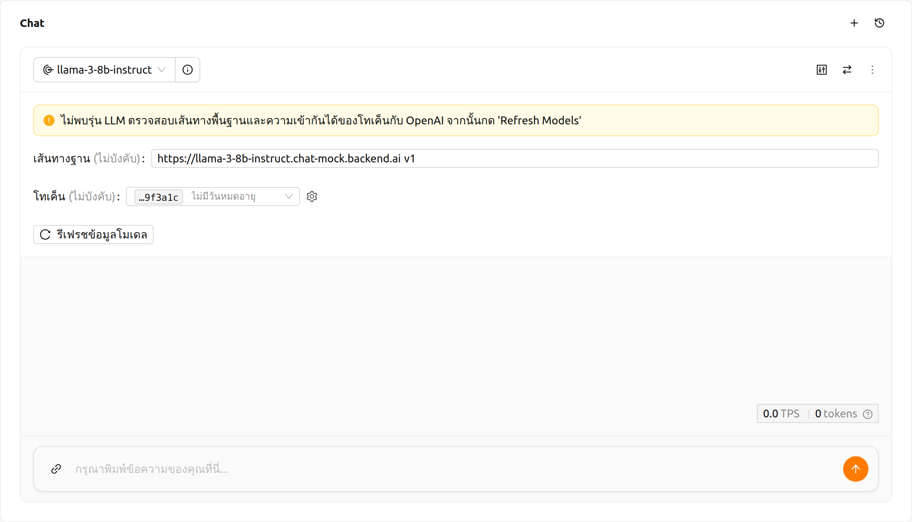

ส่วนหัวของการ์ดแชท ซึ่งประกอบด้วยตัวเลือก deployment, โมเดล และการซิงค์ จะแสดงขึ้นทันทีโดยไม่รอรายการโมเดล คุณจึงเข้าถึงแผงนี้ได้แม้ในขณะที่ยังดึงข้อมูลอยู่ ระหว่างการดึงข้อมูล ปุ่ม **รีเฟรชข้อมูลโมเดล** จะแสดงตัวบ่งชี้การโหลด และช่อง **Base Path** กับ **Token** รวมถึงช่องพิมพ์ข้อความที่ด้านล่างของการ์ดจะถูกปิดใช้งาน ทั้งหมดจะกลับมาใช้งานได้อีกครั้งเมื่อการดึงข้อมูลเสร็จสิ้น deployment ที่ไม่ตอบสนองจะหมดเวลาในที่สุดและถูกรายงานว่าดึงข้อมูลล้มเหลว คุณจึงแก้ไขการตั้งค่าและลองใหม่ได้โดยไม่ต้องรออย่างไม่มีกำหนด

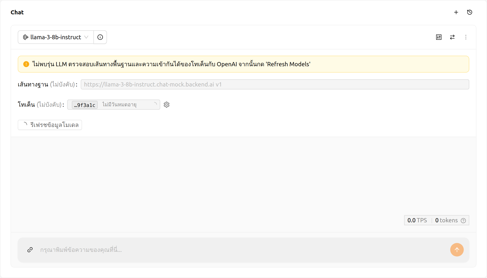

แผงนี้อาจแสดงคำเตือนต่อไปนี้:

- **ไม่พบโมเดล LLM** (คำเตือน): ไม่สามารถดึงรายการโมเดลจาก endpoint ของ deployment ได้ ตรวจสอบ base path หรือโทเค็นในแผงนี้ แล้วคลิก **รีเฟรชข้อมูลโมเดล** เพื่อลองใหม่ คำเตือนนี้เป็นส่วนหนึ่งของแผง จึงแสดงอยู่ในระหว่างการดึงข้อมูลครั้งแรกด้วย โปรดรอจนกว่าปุ่ม **รีเฟรชข้อมูลโมเดล** จะโหลดเสร็จก่อนดำเนินการ
- **จำนวนเรพลิกาที่ต้องการเป็น 0** (คำเตือน): deployment ที่เลือกมีจำนวนเรพลิกาที่ต้องการตั้งค่าเป็น 0 จึงไม่สามารถตอบสนองได้ ตั้งค่าจำนวนเรพลิกาที่ต้องการเป็น 1 หรือมากกว่าในการตั้งค่า Deployment

การแจ้งเตือนต่อไปนี้อาจปรากฏในการ์ดแชทด้วย:

- **URL ของ Endpoint ไม่ถูกต้อง** (ข้อผิดพลาด): ไม่สามารถระบุ URL ของ endpoint สำหรับ deployment ที่เลือกได้ ตรวจสอบว่า deployment ได้รับการกำหนดค่าอย่างถูกต้อง
- **ข้อผิดพลาดในการสตรีม** (ข้อผิดพลาด): เกิดข้อผิดพลาดขณะสื่อสารกับโมเดล ตรวจสอบข้อความเพื่อทราบสาเหตุ ปิดการแจ้งเตือนแล้วลองส่งข้อความใหม่อีกครั้ง

โปรดดูคำอธิบายด้านล่างสำหรับข้อมูลอินพุตที่จำเป็นในการกำหนดค่าโมเดลแบบกำหนดเอง:

- **Base Path** (ไม่บังคับ): เส้นทางที่เพิ่มต่อท้าย URL ของ endpoint ของ deployment เมื่อส่งคำขอ
  โปรดระบุข้อมูลเวอร์ชันด้วย
  ตัวอย่างเช่น เมื่อใช้ OpenAI API ให้ป้อน `v1`
- **Token** (ไม่บังคับ): คีย์การพิสูจน์ตัวตนเพื่อเข้าถึงบริการโมเดล เมื่อเลือก deployment ไว้ ช่องนี้จะเป็นเมนูดร็อปดาวน์ **เลือกโทเค็น** ที่แสดงรายการโทเค็นการเข้าถึงของ deployment นั้น หากยังไม่ได้เลือก deployment ช่องนี้จะเป็นช่องข้อความธรรมดาที่คุณวางโทเค็นลงไปได้ โทเค็นสามารถสร้างได้จากบริการต่าง ๆ ไม่เพียงแต่ Backend.AI เท่านั้น และรูปแบบกับกระบวนการสร้างอาจแตกต่างกันไปตามบริการ โปรดดูคู่มือของบริการนั้น ๆ สำหรับรายละเอียด
   * แต่ละตัวเลือกจะแสดงอักขระหกตัวสุดท้ายของโทเค็นพร้อมวันหมดอายุ เนื่องจากโทเค็นทุกตัวขึ้นต้นด้วยข้อความส่วนหัวเดียวกันและถูกตัดให้พอดีกับความกว้างของช่อง ส่วนท้ายนี้จึงเป็นสิ่งที่ช่วยแยกแยะตัวเลือกที่ดูเหมือนกันได้ โทเค็นที่ไม่มีวันหมดอายุจะแสดงเป็น **ไม่มีวันหมดอายุ** แทนวันที่
   * ชี้เมาส์ที่ตัวเลือกเพื่อดูเวลาที่ออกโทเค็นและเวลาหมดอายุแบบเต็ม
   * โทเค็นที่หมดอายุแล้วจะไม่แสดงในรายการ และเมื่อช่องนี้ว่าง ระบบจะเลือกโทเค็นที่ยังใช้ได้ซึ่งสร้างล่าสุดให้โดยอัตโนมัติ
   * ไอคอนรูปเฟืองข้างช่องนี้ (**การตั้งค่าโทเค็นการเข้าถึง**) จะเปิดส่วนโทเค็นการเข้าถึงในหน้ารายละเอียดของ deployment ซึ่งคุณสามารถออกโทเค็นใหม่ได้ เมื่อกลับมา ระบบจะอ่านรายการใหม่อีกครั้ง โทเค็นที่เพิ่งสร้างจึงเลือกใช้ได้ทันที ดูคำแนะนำได้ที่ส่วน [การสร้างโทเค็น](#generating-tokens)

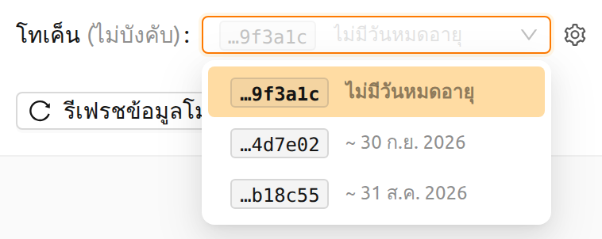

## เพิ่มหรือลบการ์ดแชทเปรียบเทียบ

หากต้องการเพิ่มการ์ดแชทเปรียบเทียบใหม่ ให้คลิกปุ่มไอคอนเปรียบเทียบที่อยู่มุมขวาบน

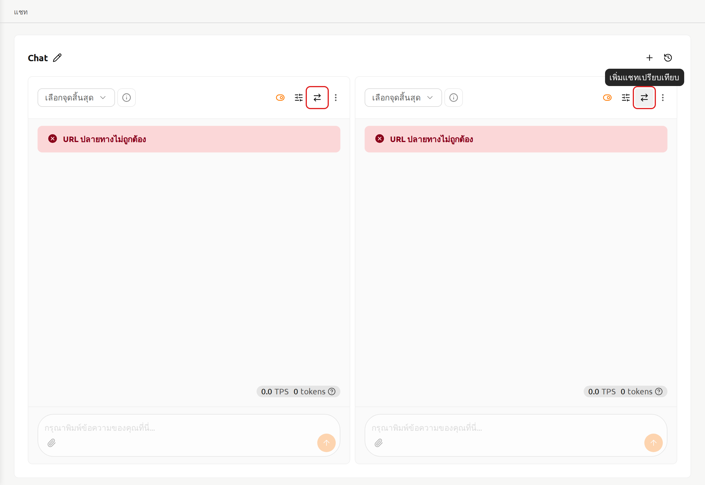

หากต้องการลบเซสชันแชท ให้คลิกปุ่ม 'more' ที่อยู่มุมขวาบนของการ์ดแชท
จากนั้นเมนูแบบดร็อปดาวน์จะปรากฏขึ้น และผู้ใช้สามารถเลือก 'Delete Chat' เพื่อลบเซสชันแชทได้
โปรดระมัดระวังเนื่องจากการกระทำนี้จะลบเนื้อหาทั้งหมดที่ป้อนไว้

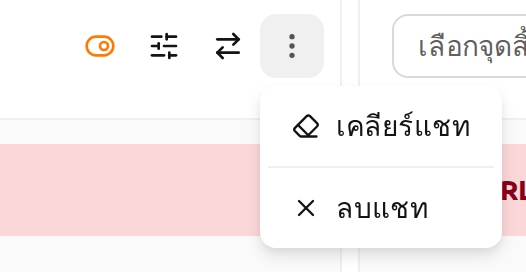

## ล้างประวัติการแชท

การคลิกปุ่ม 'more' จะแสดงตัวเลือก 'เคลียร์แชท'
เมื่อเลือกตัวเลือกนี้ ผู้ใช้จะลบประวัติการแชททั้งหมดที่เชื่อมโยงกับการ์ด
แต่เซสชันของการ์ดเองจะยังคงทำงานอยู่

## ซิงโครไนซ์อินพุต

ปุ่ม 'การซิงโครไนซ์ข้อมูลการแชท' ที่อยู่มุมขวาบน ช่วยให้สามารถซิงโครไนซ์อินพุตระหว่างการ์ดแชทที่เปิดใช้งานตัวเลือกนี้ได้
การเปิดใช้งาน 'การซิงโครไนซ์ข้อมูลการแชท' หมายความว่า เมื่อกด 'Enter' หรือคลิกปุ่ม 'Send'
บนการ์ดใดก็ตาม อินพุตจากการ์ดที่ผู้ใช้กำลังใช้งานอยู่จะถูกส่งไปยังการ์ดอื่น ๆ ด้วย
ฟังก์ชันนี้มีประโยชน์สำหรับการเปรียบเทียบผลลัพธ์ของโมเดลต่าง ๆ โดยใช้ข้อมูลอินพุตเดียวกัน

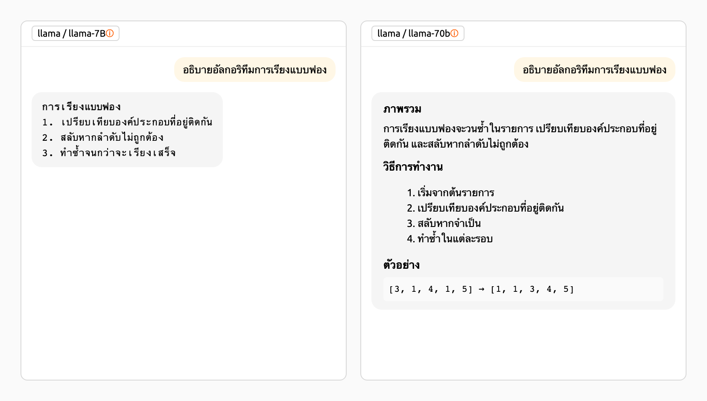

## การปรับพารามิเตอร์

คลิกปุ่มพารามิเตอร์ที่มุมขวาบนเพื่อปรับพารามิเตอร์สำหรับแต่ละโมเดล ผู้ใช้สามารถตั้งค่าต่าง ๆ เช่น Max Tokens, Temperature, Top P และ Top K ได้
เมื่อใช้คุณสมบัติการซิงโครไนซ์ ผู้ใช้สามารถนำพารามิเตอร์ที่แตกต่างกันไปใช้กับโมเดลเดียวกัน แล้วเปรียบเทียบผลลัพธ์ได้

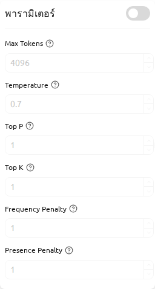

## ประวัติการแชท

หากต้องการเริ่มแชทใหม่ ให้คลิกปุ่ม '+' ที่อยู่มุมขวาบน

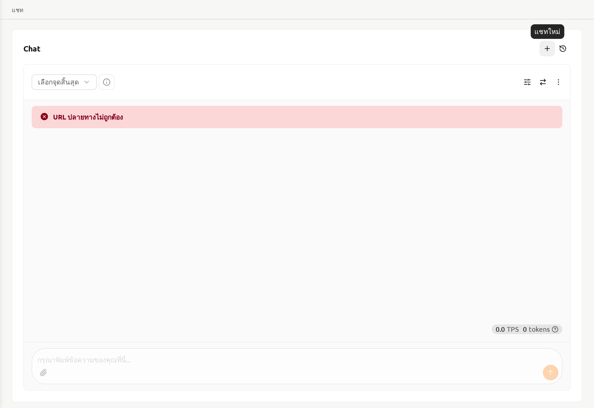

ประวัติการแชททั้งหมดจะถูกจัดเก็บไว้ใน local storage และผู้ใช้สามารถเข้าถึงการแชทก่อนหน้าได้โดยการคลิกปุ่มประวัติที่มุมขวาบน

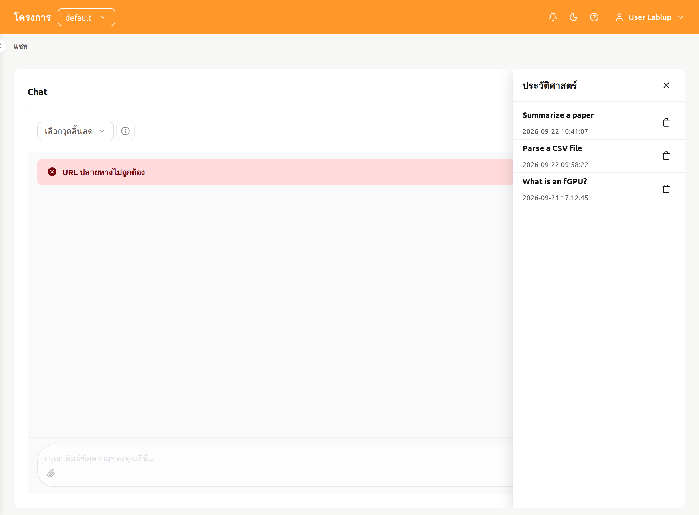
