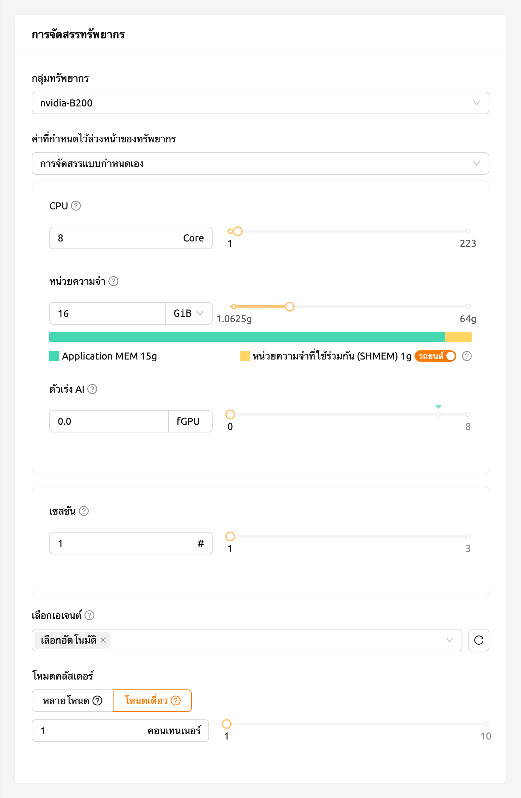
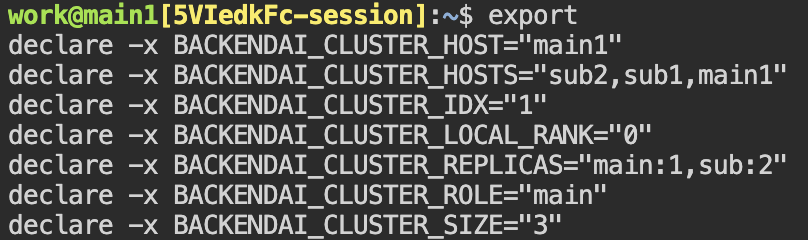
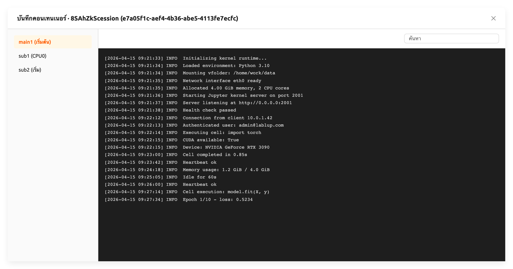

# เซสชันการคอมพิวเตอร์คลัสเตอร์ Backend.AI

   Cluster compute session feature is supported from Backend.AI server 20.09 or
   higher.

### ภาพรวมของเซสชันการคำนวณคลัสเตอร์ Backend.AI

Backend.AI supports cluster compute session to support distributed computing /
training tasks. A cluster session consists of multiple containers, each of which
is created across multiple Agent nodes. Containers under a cluster session are
automatically connected each other through a dynamically-created private
network. Temporary domain names (`main1`, `sub1`, `sub2`, etc.) are also
given, making it simple to execute networking tasks such as เชื่อมต่อ SSHion. All
the necessary secret keys and various settings for เชื่อมต่อ SSHion between
containers are automatically generated.

สำหรับรายละเอียดเกี่ยวกับเซสชันของคลัสเตอร์ Backend.AI โปรดดูที่ด้านล่างนี้

- คอนเทนเนอร์ภายใต้เซสชันคลัสเตอร์จะถูกสร้างขึ้นข้ามโหนดตัวแทนหนึ่งหรือมากกว่าซึ่งเป็นของกลุ่มทรัพยากร
- A cluster session consists of one main container (`main1`) and one or more
  sub containers (`subX`).
- ทุกคอนเทนเนอร์ภายใต้เซสชันคลัสเตอร์ถูกสร้างขึ้นโดยการจัดสรรทรัพยากรในปริมาณที่เท่ากัน ในรูปภาพข้างต้น คอนเทนเนอร์ทั้งสี่ของเซสชัน X ถูกสร้างขึ้นด้วยทรัพยากรในปริมาณที่เท่ากัน
- ทุกคอนเทนเนอร์ภายใต้เซสชันคลัสเตอร์จะทำการจัดเก็บข้อมูลในโฟลเดอร์เดียวกันที่กำหนดไว้เมื่อสร้างเซสชันการคำนวณ
- คอนเทนเนอร์ทั้งหมดภายใต้เซสชันคลัสเตอร์เชื่อมโยงกับเครือข่ายส่วนบุคคล

   * The name of the main container is `main1`.
   * Sub-containers are named as `sub1`, `sub2`, ... in the increasing
     order.
   * ไม่มีไฟร์วอลล์ระหว่างคอนเทนเนอร์ที่ประกอบเป็นเซสชันคลัสเตอร์
   * ผู้ใช้สามารถเชื่อมต่อกับคอนเทนเนอร์หลักได้โดยตรง และคอนเทนเนอร์ย่อยสามารถเชื่อมต่อได้เฉพาะจากคอนเทนเนอร์หลักเท่านั้น

- มีสองโหมด/ประเภทของเซสชันคลัสเตอร์

   * เซสชันคลัสเตอร์แบบโหนดเดียว: เซสชันคลัสเตอร์ที่ประกอบด้วยสองหรือมากกว่าคอนเทนเนอร์บนโหนดเอเจนต์เดียวกัน ในภาพด้านบน นี่คือเซสชัน Z ซึ่งถูกผูกกับเครือข่ายสะพานท้องถิ่น
   * เซสชันคลัสเตอร์หลายโหนด: เซสชันคลัสเตอร์ที่ประกอบด้วยสองหรือมากกว่าคอนเทนเนอร์ต่างโหนดเอเจนต์ ในภาพด้านบน นี่คือเซสชัน X ซึ่งผูกติดกับเครือข่ายแบบโอเวอร์เลย์
   * เซสชันการคอมพิวเตอร์ที่มีเพียงหนึ่งคอนเทนเนอร์จะถูกจำแนกเป็นเซสชันคอมพิวเตอร์ปกติ ไม่ใช่เซสชันคลัสเตอร์ ในรูปด้านบน เซสชันนี้คือเซสชัน Y.

- เซสชันคลัสเตอร์โหนดเดียวจะสร้างขึ้นในกรณีต่อไปนี้

   * When "Single Node" is selected for Cluster mode field when creating a
     compute session. If there is no single agent with enough resources to
     create all containers at the same time, the session will stay in a pending
     (`PENDING`) state.
   * “โหมดคลัสเตอร์” ถูกเลือกเป็น “หลายโหนด” แต่มีเอเจนต์เดียวที่มีทรัพยากรเพียงพอที่สามารถสร้างคอนเทนเนอร์ทั้งหมดได้พร้อมกัน ดังนั้น คอนเทนเนอร์ทั้งหมดจะถูกปรับใช้ในเอเจนต์นั้น เพื่อที่จะลดความหน่วงของเครือข่ายให้มากที่สุดโดยการไม่ให้เข้าถึงเครือข่ายภายนอก

แต่ละคอนเทนเนอร์ในเซสชันคลัสเตอร์มีตัวแปรสภาพแวดล้อมดังต่อไปนี้ คุณสามารถอ้างถึงมันเพื่อตรวจสอบการกำหนดค่าคลัสเตอร์และข้อมูลคอนเทนเนอร์ที่เชื่อมต่ออยู่ในปัจจุบัน

- `BACKENDAI_CLUSTER_HOST`: the name of the current container (ex. `main1`)
- `BACKENDAI_CLUSTER_HOSTS`: Names of all containers belonging to the current
  cluster session (ex. `main1,sub1,sub2`)
- `BACKENDAI_CLUSTER_IDX`: numeric index of the current container (ex. `1`)
- `BACKENDAI_CLUSTER_MODE`: Cluster session mode/type (ex. `single-node`)
- `BACKENDAI_CLUSTER_ROLE`: Type of current container (ex. `main`)
- `BACKENDAI_CLUSTER_SIZE`: Total number of containers belonging to the
  current cluster session (ex. `4`)
- `BACKENDAI_KERNEL_ID`: ID of the current container
  (ex. `3614fdf3-0e04-...`)
- `BACKENDAI_SESSION_ID`: ID of the cluster session to which the current
  container belongs (ex. `3614fdf3-0e04-...`). The main container's
  `BACKENDAI_KERNEL_ID` is the same as `BACKENDAI_SESSION_ID`.

### การใช้เซสชันการคอมพิวเตอร์ของคลัสเตอร์ Backend.AI

ในส่วนนี้ เราจะดูว่าจริง ๆ แล้วจะสร้างและใช้เซสชันการคำนวณคลัสเตอร์ผ่าน GUI ของผู้ใช้ได้อย่างไร

ในหน้าสมาชิก ให้เปิดกล่องสร้างเซสชันและตั้งค่าในลักษณะเดียวกับการสร้างเซสชันการคอมพิวเตอร์ปกติ จำนวนทรัพยากรที่ตั้งค่าในครั้งนี้คือจำนวนที่จัดสรรให้กับ **หนึ่งคอนเทนเนอร์** ตัวอย่างเช่น หากคุณตั้งค่า 4 CPUs จะมีการจัดสรร 4 คอร์ให้กับแต่ละคอนเทนเนอร์ภายใต้เซสชันคลัสเตอร์ โปรดทราบว่านี่ไม่ใช่จำนวนทรัพยากรที่จัดสรรให้กับเซสชันการคอมพิวเตอร์คลัสเตอร์ทั้งหมด สำหรับการสร้างเซสชันการคอมพิวเตอร์คลัสเตอร์ ต้องการทรัพยากรเซิร์ฟเวอร์เท่ากับ N เท่าของจำนวนทรัพยากรที่ตั้งค่าไว้ที่นี่ (N คือขนาดของคลัสเตอร์) นอกจากนี้ยังอย่าลืมเชื่อมต่อโฟลเดอร์ข้อมูลสำหรับการเก็บรักษาข้อมูลอีกด้วย

ในฟิลด์ "โหมดคลัสเตอร์" ที่ด้านล่าง คุณสามารถเลือกประเภทของคลัสเตอร์ที่คุณต้องการสร้างได้

- โหนดเดียว: ทุกคอนเทนเนอร์จะถูกสร้างขึ้นบนโหนดเอเยนต์เดียว
- Multi Node: คอนเทนเนอร์จะถูกสร้างขึ้นทั่วทั้งหลายโหนดของเอเจนต์ภายในกลุ่มทรัพยากร อย่างไรก็ตาม หากคอนเทนเนอร์ทั้งหมดสามารถสร้างขึ้นในโหนดเอเจนต์เดียวได้ คอนเทนเนอร์ทั้งหมดจะถูกสร้างในโหนดนั้น เพื่อช่วยลดเวลาล่าช้าของเครือข่ายระหว่างคอนเทนเนอร์

ตั้งค่า "ขนาดคลัสเตอร์" ด้านล่าง หากตั้งค่าเป็น 3 จะมีการสร้างคอนเทนเนอร์ทั้งหมดสามตัวรวมถึงคอนเทนเนอร์หลัก คอนเทนเนอร์ทั้งสามนี้จะถูกผูกไว้ภายใต้เครือข่ายส่วนตัวเพื่อสร้างเซสชันการคำนวณหนึ่งเซสชัน

Click the LAUNCH button to send a request to create a compute session, and wait
for a while to get a cluster session. After the session is created, you can view
the created containers on the session details page.

Let's open the terminal app in the compute session we just have created. If you
look up the environment variables, you can see that the `BACKENDAI_CLUSTER_*`
variables described in the above section are set. Compare the meaning and value
of each environment variable with the description above.

You can also SSH into the `sub1` container. No separate SSH setting is
required, just issue the command `ssh sub1` and you are done. You can see the
hostname after `work@` has changed, which indicated the sub container's shell
is displayed.

ด้วยวิธีนี้ Backend.AI ทำให้การสร้างเซสชันการคอมพิวเตอร์แบบคลัสเตอร์เป็นเรื่องง่าย เพื่อให้สามารถดำเนินการเรียนรู้และการคำนวณแบบกระจายผ่านเซสชันการคำนวณแบบคลัสเตอร์ จำเป็นต้องใช้โมดูลการเรียนรู้แบบกระจายที่จัดเตรียมโดยไลบรารี ML เช่น TensorFlow/PyTorch หรือซอฟต์แวร์สนับสนุนเพิ่มเติม เช่น Horovod, NNI, MLFlow เป็นต้น และต้องเขียนโค้ดในลักษณะที่สามารถใช้ซอฟต์แวร์ได้อย่างระมัดระวัง Backend.AI มีภาพเคอร์เนลที่มีซอฟต์แวร์ที่จำเป็นสำหรับการเรียนรู้แบบกระจาย ดังนั้นคุณจึงสามารถใช้ภาพนั้นในการสร้างอัลกอริธึมการเรียนรู้แบบกระจายที่ดีได้

### ดูบันทึกต่อคอนเทนเนอร์

From 24.03, You can check each log of container in logs modal. It will help you
to understand what's going on not only in `main` container but also `sub` containers.

