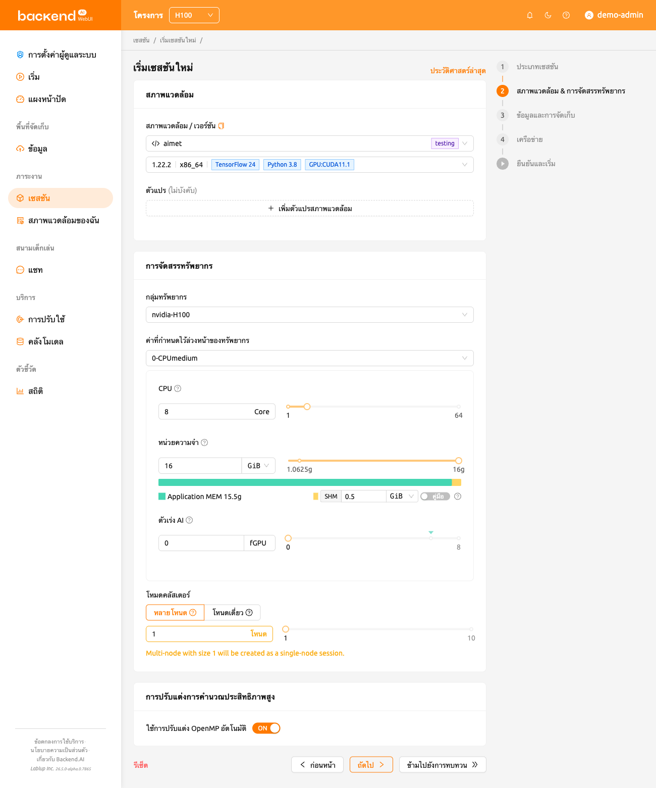
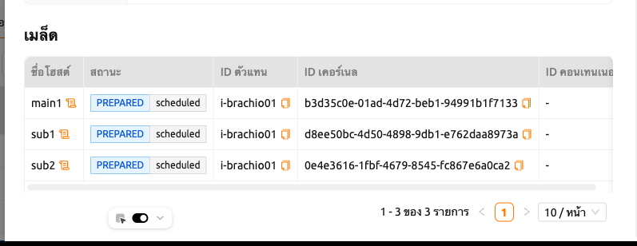
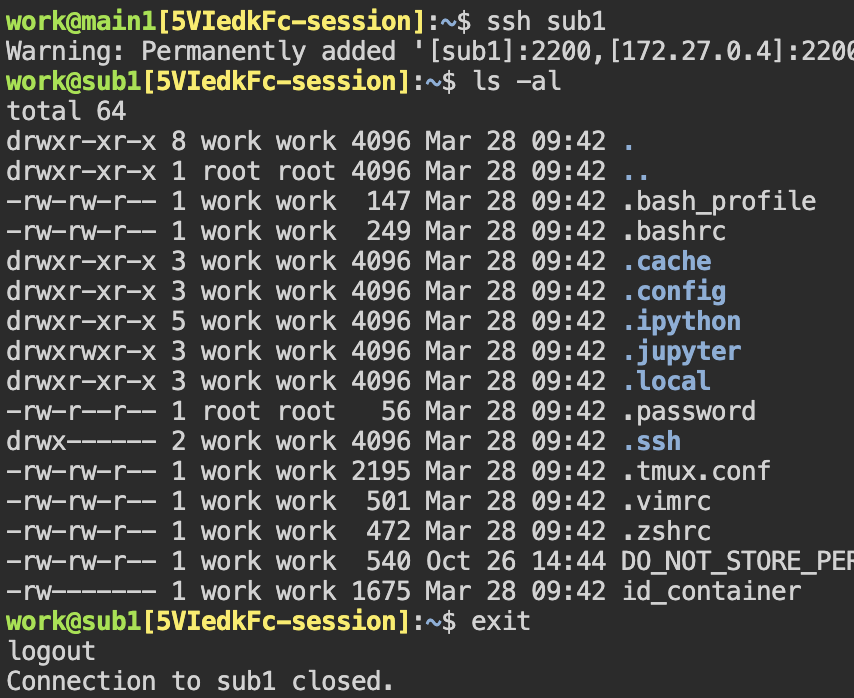
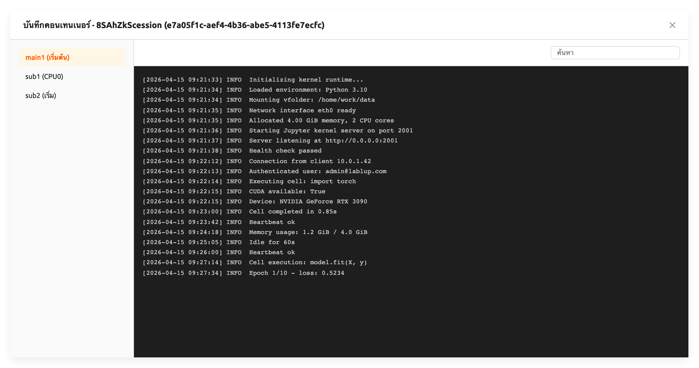

# เซสชันการคอมพิวเตอร์คลัสเตอร์ Backend.AI

:::note
ฟีเจอร์เซสชันการคำนวณคลัสเตอร์รองรับจาก Backend.AI server เวอร์ชัน 20.09
ขึ้นไป
:::

### ภาพรวมของเซสชันการคำนวณคลัสเตอร์ Backend.AI

Backend.AI รองรับเซสชันการคำนวณคลัสเตอร์เพื่อสนับสนุนงานคำนวณ/การฝึกสอนแบบกระจาย เซสชันคลัสเตอร์ประกอบด้วยคอนเทนเนอร์หลายรายการ ซึ่งแต่ละรายการจะถูกสร้างข้ามโหนดเอเจนต์หลายโหนด คอนเทนเนอร์ภายใต้เซสชันคลัสเตอร์จะเชื่อมต่อกันโดยอัตโนมัติผ่านเครือข่ายส่วนตัวที่ถูกสร้างขึ้นแบบไดนามิก นอกจากนี้ยังมีการกำหนดชื่อโดเมนชั่วคราว (`main1`, `sub1`, `sub2` ฯลฯ) ให้ด้วย ทำให้การทำงานด้านเครือข่าย เช่น การเชื่อมต่อ SSH เป็นเรื่องง่าย คีย์ลับและการตั้งค่าต่าง ๆ ที่จำเป็นสำหรับการเชื่อมต่อ SSH ระหว่างคอนเทนเนอร์จะถูกสร้างขึ้นโดยอัตโนมัติ

สำหรับรายละเอียดเกี่ยวกับเซสชันของคลัสเตอร์ Backend.AI โปรดดูที่ด้านล่างนี้

- คอนเทนเนอร์ภายใต้เซสชันคลัสเตอร์จะถูกสร้างขึ้นข้ามโหนดเอเจนต์หนึ่งหรือหลายโหนดที่สังกัดอยู่ในกลุ่มทรัพยากร
- เซสชันคลัสเตอร์ประกอบด้วยคอนเทนเนอร์หลักหนึ่งตัว (`main1`) และคอนเทนเนอร์ย่อย (`subX`) อีกหนึ่งหรือหลายตัว
- ทุกคอนเทนเนอร์ภายใต้เซสชันคลัสเตอร์ถูกสร้างขึ้นโดยการจัดสรรทรัพยากรในปริมาณที่เท่ากัน ในรูปภาพข้างต้น คอนเทนเนอร์ทั้งสี่ของเซสชัน X ถูกสร้างขึ้นด้วยทรัพยากรในปริมาณที่เท่ากัน
- ทุกคอนเทนเนอร์ภายใต้เซสชันคลัสเตอร์จะทำการจัดเก็บข้อมูลในโฟลเดอร์เดียวกันที่กำหนดไว้เมื่อสร้างเซสชันการคำนวณ
- คอนเทนเนอร์ทั้งหมดภายใต้เซสชันคลัสเตอร์เชื่อมโยงกับเครือข่ายส่วนบุคคล

   * ชื่อของคอนเทนเนอร์หลักคือ `main1`
   * คอนเทนเนอร์ย่อยจะถูกตั้งชื่อเป็น `sub1`, `sub2`, ... ตามลำดับเพิ่มขึ้น
   * ไม่มีไฟร์วอลล์ระหว่างคอนเทนเนอร์ที่ประกอบเป็นเซสชันคลัสเตอร์
   * ผู้ใช้สามารถเชื่อมต่อกับคอนเทนเนอร์หลักได้โดยตรง และคอนเทนเนอร์ย่อยสามารถเชื่อมต่อได้เฉพาะจากคอนเทนเนอร์หลักเท่านั้น

- มีสองโหมด/ประเภทของเซสชันคลัสเตอร์

   * เซสชันคลัสเตอร์แบบโหนดเดียว: เซสชันคลัสเตอร์ที่ประกอบด้วยสองหรือมากกว่าคอนเทนเนอร์บนโหนดเอเจนต์เดียวกัน ในภาพด้านบน นี่คือเซสชัน Z ซึ่งถูกผูกกับเครือข่ายสะพานท้องถิ่น
   * เซสชันคลัสเตอร์หลายโหนด: เซสชันคลัสเตอร์ที่ประกอบด้วยสองหรือมากกว่าคอนเทนเนอร์ต่างโหนดเอเจนต์ ในภาพด้านบน นี่คือเซสชัน X ซึ่งผูกติดกับเครือข่ายแบบโอเวอร์เลย์
   * เซสชันการคอมพิวเตอร์ที่มีเพียงหนึ่งคอนเทนเนอร์จะถูกจำแนกเป็นเซสชันคอมพิวเตอร์ปกติ ไม่ใช่เซสชันคลัสเตอร์ ในรูปด้านบน เซสชันนี้คือเซสชัน Y.

- เซสชันคลัสเตอร์โหนดเดียวจะสร้างขึ้นในกรณีต่อไปนี้

   * เมื่อเลือก "โหนดเดียว" (Single Node) ในช่องโหมดคลัสเตอร์ในขณะสร้างเซสชันการคำนวณ หากไม่มีเอเจนต์ใดเลยที่มีทรัพยากรเพียงพอต่อการสร้างคอนเทนเนอร์ทั้งหมดในเวลาเดียวกัน เซสชันจะยังคงอยู่ในสถานะรอดำเนินการ (`PENDING`)
   * เมื่อเลือก "หลายโหนด" (Multi Node) เป็นโหมดคลัสเตอร์ แต่มีเอเจนต์เดียวที่มีทรัพยากรเพียงพอที่สามารถสร้างคอนเทนเนอร์ทั้งหมดได้พร้อมกัน ในกรณีนี้คอนเทนเนอร์ทั้งหมดจะถูกปรับใช้บนเอเจนต์นั้น เพื่อลดความหน่วงของเครือข่ายให้มากที่สุดโดยการหลีกเลี่ยงการเข้าถึงเครือข่ายภายนอก

แต่ละคอนเทนเนอร์ในเซสชันคลัสเตอร์มีตัวแปรสภาพแวดล้อมดังต่อไปนี้ คุณสามารถอ้างถึงมันเพื่อตรวจสอบการกำหนดค่าคลัสเตอร์และข้อมูลคอนเทนเนอร์ที่เชื่อมต่ออยู่ในปัจจุบัน

- `BACKENDAI_CLUSTER_HOST`: ชื่อของคอนเทนเนอร์ปัจจุบัน (เช่น `main1`)
- `BACKENDAI_CLUSTER_HOSTS`: ชื่อของคอนเทนเนอร์ทั้งหมดที่สังกัดอยู่ในเซสชันคลัสเตอร์
  ปัจจุบัน (เช่น `main1,sub1,sub2`)
- `BACKENDAI_CLUSTER_IDX`: ดัชนีตัวเลขของคอนเทนเนอร์ปัจจุบัน (เช่น `1`)
- `BACKENDAI_CLUSTER_MODE`: โหมด/ประเภทของเซสชันคลัสเตอร์ (เช่น `single-node`)
- `BACKENDAI_CLUSTER_ROLE`: ประเภทของคอนเทนเนอร์ปัจจุบัน (เช่น `main`)
- `BACKENDAI_CLUSTER_SIZE`: จำนวนคอนเทนเนอร์ทั้งหมดที่สังกัดอยู่ใน
  เซสชันคลัสเตอร์ปัจจุบัน (เช่น `4`)
- `BACKENDAI_KERNEL_ID`: ID ของคอนเทนเนอร์ปัจจุบัน
  (เช่น `3614fdf3-0e04-...`)
- `BACKENDAI_SESSION_ID`: ID ของเซสชันคลัสเตอร์ที่คอนเทนเนอร์ปัจจุบัน
  สังกัดอยู่ (เช่น `3614fdf3-0e04-...`) โดย `BACKENDAI_KERNEL_ID` ของ
  คอนเทนเนอร์หลักจะเหมือนกับ `BACKENDAI_SESSION_ID`

### การใช้เซสชันการคอมพิวเตอร์ของคลัสเตอร์ Backend.AI

ในส่วนนี้ เราจะดูว่าจริง ๆ แล้วจะสร้างและใช้เซสชันการคำนวณคลัสเตอร์ผ่าน GUI ของผู้ใช้ได้อย่างไร

ในหน้าสมาชิก ให้เปิดกล่องสร้างเซสชันและตั้งค่าในลักษณะเดียวกับการสร้างเซสชันการคอมพิวเตอร์ปกติ จำนวนทรัพยากรที่ตั้งค่าในครั้งนี้คือจำนวนที่จัดสรรให้กับ **หนึ่งคอนเทนเนอร์** ตัวอย่างเช่น หากคุณตั้งค่า 4 CPUs จะมีการจัดสรร 4 คอร์ให้กับแต่ละคอนเทนเนอร์ภายใต้เซสชันคลัสเตอร์ โปรดทราบว่านี่ไม่ใช่จำนวนทรัพยากรที่จัดสรรให้กับเซสชันการคอมพิวเตอร์คลัสเตอร์ทั้งหมด สำหรับการสร้างเซสชันการคอมพิวเตอร์คลัสเตอร์ ต้องการทรัพยากรเซิร์ฟเวอร์เท่ากับ N เท่าของจำนวนทรัพยากรที่ตั้งค่าไว้ที่นี่ (N คือขนาดของคลัสเตอร์) นอกจากนี้ยังอย่าลืมเชื่อมต่อโฟลเดอร์ข้อมูลสำหรับการเก็บรักษาข้อมูลอีกด้วย

ในฟิลด์ "โหมดคลัสเตอร์" ที่ด้านล่าง คุณสามารถเลือกประเภทของคลัสเตอร์ที่คุณต้องการสร้างได้

- โหนดเดียว (Single Node): คอนเทนเนอร์ทั้งหมดจะถูกสร้างขึ้นบนโหนดเอเจนต์เดียว
- หลายโหนด (Multi Node): คอนเทนเนอร์จะถูกสร้างขึ้นกระจายไปทั่วโหนดเอเจนต์หลายโหนดภายในกลุ่มทรัพยากร อย่างไรก็ตาม หากคอนเทนเนอร์ทั้งหมดสามารถสร้างขึ้นในโหนดเอเจนต์เดียวได้ คอนเทนเนอร์ทั้งหมดจะถูกสร้างในโหนดนั้น ทั้งนี้เพื่อลดความหน่วงของเครือข่ายระหว่างคอนเทนเนอร์ให้น้อยที่สุด

ตั้งค่า "ขนาดคลัสเตอร์" ด้านล่าง หากตั้งค่าเป็น 3 จะมีการสร้างคอนเทนเนอร์ทั้งหมดสามตัวรวมถึงคอนเทนเนอร์หลัก คอนเทนเนอร์ทั้งสามนี้จะถูกผูกไว้ภายใต้เครือข่ายส่วนตัวเพื่อสร้างเซสชันการคำนวณหนึ่งเซสชัน

คลิกปุ่ม LAUNCH เพื่อส่งคำขอสร้างเซสชันการคำนวณ และรอสักครู่เพื่อให้ได้เซสชันคลัสเตอร์ หลังจากเซสชันถูกสร้างขึ้นแล้ว คุณสามารถดูคอนเทนเนอร์ที่ถูกสร้างขึ้นได้ในหน้ารายละเอียดเซสชัน

ให้เราเปิดแอปเทอร์มินัลในเซสชันการคำนวณที่เพิ่งสร้างขึ้น หากคุณตรวจสอบตัวแปรสภาพแวดล้อม คุณจะเห็นว่าตัวแปร `BACKENDAI_CLUSTER_*` ที่ระบุไว้ในหัวข้อด้านบนถูกตั้งค่าไว้ ลองเปรียบเทียบความหมายและค่าของตัวแปรสภาพแวดล้อมแต่ละตัวกับคำอธิบายข้างต้น

คุณยังสามารถ SSH เข้าไปยังคอนเทนเนอร์ `sub1` ได้ โดยไม่ต้องตั้งค่า SSH แยกต่างหาก เพียงแค่รันคำสั่ง `ssh sub1` ก็เสร็จเรียบร้อย คุณจะเห็นว่าชื่อโฮสต์หลัง `work@` เปลี่ยนไป ซึ่งบ่งชี้ว่าเชลล์ของคอนเทนเนอร์ย่อยกำลังแสดงอยู่

ด้วยวิธีนี้ Backend.AI ทำให้การสร้างเซสชันการคอมพิวเตอร์แบบคลัสเตอร์เป็นเรื่องง่าย เพื่อให้สามารถดำเนินการเรียนรู้และการคำนวณแบบกระจายผ่านเซสชันการคำนวณแบบคลัสเตอร์ จำเป็นต้องใช้โมดูลการเรียนรู้แบบกระจายที่จัดเตรียมโดยไลบรารี ML เช่น TensorFlow/PyTorch หรือซอฟต์แวร์สนับสนุนเพิ่มเติม เช่น Horovod, NNI, MLFlow เป็นต้น และต้องเขียนโค้ดในลักษณะที่สามารถใช้ซอฟต์แวร์ได้อย่างระมัดระวัง Backend.AI มีภาพเคอร์เนลที่มีซอฟต์แวร์ที่จำเป็นสำหรับการเรียนรู้แบบกระจาย ดังนั้นคุณจึงสามารถใช้ภาพนั้นในการสร้างอัลกอริธึมการเรียนรู้แบบกระจายที่ดีได้

### ดูบันทึกต่อคอนเทนเนอร์

ตั้งแต่เวอร์ชัน 24.03 เป็นต้นไป คุณสามารถตรวจสอบบันทึก (log) ของแต่ละคอนเทนเนอร์ได้ในโมดัลบันทึก ซึ่งจะช่วยให้คุณเข้าใจว่ากำลังเกิดอะไรขึ้น ไม่เฉพาะในคอนเทนเนอร์ `main` เท่านั้น แต่รวมถึงคอนเทนเนอร์ `sub` ด้วย

