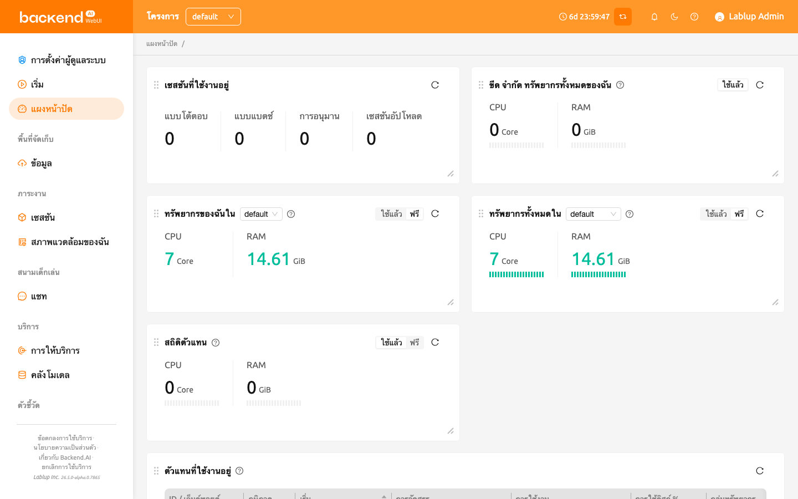

# แดชบอร์ด

**แดชบอร์ด** แสดงภาพรวมการใช้ทรัพยากรปัจจุบัน ขีดจำกัดที่ใช้งานได้ และข้อมูลเซสชันในทุกโปรเจกต์และกลุ่มทรัพยากรของคุณ ช่วยให้คุณเข้าใจสถานะการใช้ทรัพยากรการคำนวณได้อย่างรวดเร็ว และติดตามกิจกรรมล่าสุดในระบบ

หน้านี้ประกอบด้วยแผงหลักดังต่อไปนี้:

- **เซสชันของฉัน:**
    แสดงจำนวนเซสชันที่ใช้งานอยู่ตามประเภท เช่น *Interactive*, *Batch*, *Inference* และ *Upload* คุณสามารถดูจำนวนเซสชันแต่ละประเภทที่กำลังทำงานอยู่ได้อย่างรวดเร็ว

- **ขีดจำกัดทรัพยากรรวมของฉัน:**
    แสดงทรัพยากรที่ใช้แล้วและว่างทั้งหมดในทุกโปรเจกต์และกลุ่มทรัพยากร เมื่อมีขีดจำกัดหลายรายการ (โดเมน โปรเจกต์ หรือคีย์แพร์) ระบบจะใช้ขีดจำกัด**ที่จำกัดมากที่สุด**ในการคำนวณทรัพยากรที่เหลือ

- **ทรัพยากรของฉันในกลุ่มทรัพยากร:**
    แสดงการใช้ทรัพยากรปัจจุบันและความจุที่เหลือภายในกลุ่มทรัพยากรที่เลือกของโปรเจกต์ปัจจุบัน คุณสามารถสลับกลุ่มได้โดยใช้เมนูดรอปดาวน์

- **ทรัพยากรรวมในกลุ่มทรัพยากร:**
    สรุปทรัพยากรที่ใช้แล้วและว่างโดยรวมในกลุ่มทรัพยากรที่เลือก ข้อมูลรวบรวมจากตัวแทนทั้งหมดที่อยู่ในกลุ่ม

- **เซสชันที่สร้างล่าสุด:**
    แสดงรายการเซสชันที่ใช้งานอยู่ที่สร้างล่าสุดภายในโปรเจกต์ปัจจุบัน แสดงรายละเอียดเซสชัน เช่น ชื่อ สถานะ การใช้ CPU/หน่วยความจำ สภาพแวดล้อม กลุ่มทรัพยากร ประเภทเซสชัน และเวลาที่สร้าง โดยค่าเริ่มต้นจะแสดงเซสชันที่ใช้งานอยู่ล่าสุด 5 รายการ

## การรีเฟรชอัตโนมัติ

แดชบอร์ดจะรีเฟรชข้อมูลทุกแผงอัตโนมัติทุก 15 วินาที เพื่อให้ข้อมูลที่แสดงเป็นปัจจุบันอยู่เสมอโดยไม่ต้องดำเนินการด้วยตนเอง

## การปรับแต่งเลย์เอาท์แดชบอร์ด

คุณสามารถปรับแต่งเลย์เอาท์แดชบอร์ดได้โดยการจัดเรียงและปรับขนาดแผงตามความต้องการ

- **ย้ายแผง**: ลากส่วนหัวของแผงเพื่อเปลี่ยนตำแหน่งบนบอร์ด
- **ปรับขนาดแผง**: ลากมุมขวาล่างของแผงเพื่อปรับขนาด แต่ละแผงมีขนาดขั้นต่ำเพื่อให้เนื้อหาอ่านได้ง่าย

เลย์เอาท์ที่ปรับแต่งแล้วจะถูกบันทึกอัตโนมัติและคงอยู่ระหว่างเซสชันของเบราว์เซอร์ เลย์เอาท์จะถูกจัดเก็บตามผู้ใช้ ดังนั้นผู้ใช้แต่ละคนสามารถมีการจัดเรียงที่ต้องการของตนเองได้

## แดชบอร์ดสำหรับผู้ดูแลระบบระดับสูง

สำหรับผู้ดูแลระบบระดับสูง จะมีแผงเพิ่มเติมให้ใช้งาน

ยกเว้น **เซสชันที่ใช้งานอยู่**, **สถิติตัวแทน** และ **ตัวแทนที่ใช้งานอยู่** แผงที่เหลือจะแสดงข้อมูลเดียวกันกับแดชบอร์ดของผู้ใช้ทั่วไป

- **เซสชันที่ใช้งานอยู่:**
    แสดงจำนวนเซสชันที่ใช้งานอยู่ทั้งหมดในโปรเจกต์ปัจจุบัน จำแนกตามประเภทเซสชัน

- **สถิติตัวแทน:**
    แสดงทรัพยากรที่ใช้แล้วทั้งหมดในตัวแทนทุกตัวของระบบ ค่าที่แสดงแสดงถึงทรัพยากรรวมที่ใช้โดยเซสชันที่ใช้งานอยู่ทั้งหมด

- **ตัวแทนที่ใช้งานอยู่:**
    แสดงรายการตัวแทนทั้งหมดที่ใช้งานอยู่ในระบบปัจจุบัน
