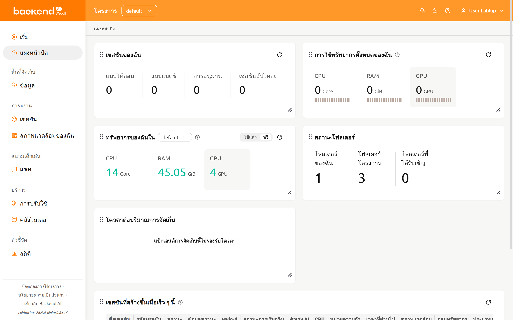
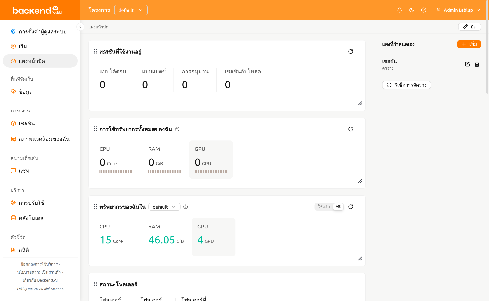
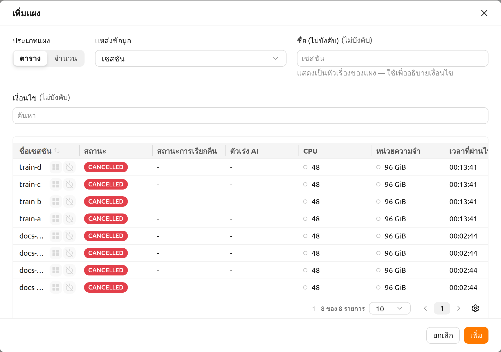

# แดชบอร์ด

**แดชบอร์ด** แสดงภาพรวมการใช้ทรัพยากรปัจจุบัน ขีดจำกัดที่ใช้งานได้ และข้อมูลเซสชันในทุกโปรเจกต์และกลุ่มทรัพยากรของคุณ ช่วยให้คุณเข้าใจสถานะการใช้ทรัพยากรการคำนวณได้อย่างรวดเร็ว และติดตามกิจกรรมล่าสุดในระบบ

หน้านี้ประกอบด้วยแผงหลักดังต่อไปนี้:

- **เซสชันของฉัน:**
    แสดงจำนวนเซสชันที่ใช้งานอยู่ตามประเภท เช่น *Interactive*, *Batch*, *Inference* และ *Upload* คุณสามารถดูจำนวนเซสชันแต่ละประเภทที่กำลังทำงานอยู่ได้อย่างรวดเร็ว

- **การใช้ทรัพยากรทั้งหมดของฉัน:**
    แสดงทรัพยากรที่คุณกำลังใช้อยู่ในทุกโปรเจกต์ ใต้ตัวเลขของทรัพยากรแต่ละรายการจะมีแถบแสดงการใช้งาน เมื่อวางเมาส์เหนือแถบดังกล่าวจะเห็นสัดส่วนการใช้งานเทียบกับขีดจำกัดทรัพยากรทั้งหมดของคุณ เมื่อมีขีดจำกัดหลายรายการ (โดเมน โปรเจกต์ หรือคีย์แพร์) ระบบจะใช้ขีดจำกัด**ที่เข้มงวดที่สุด**

- **ทรัพยากรของฉันในกลุ่มทรัพยากร:**
    แสดงการใช้ทรัพยากรปัจจุบันและความจุที่เหลือภายในกลุ่มทรัพยากรที่เลือกของโปรเจกต์ปัจจุบัน คุณสามารถสลับกลุ่มได้โดยใช้เมนูดรอปดาวน์

- **ทรัพยากรรวมในกลุ่มทรัพยากร:**
    สรุปทรัพยากรที่ใช้แล้วและว่างโดยรวมในกลุ่มทรัพยากรที่เลือก ข้อมูลรวบรวมจากเอเจนต์ทั้งหมดที่อยู่ในกลุ่ม

:::note
แผง**ทรัพยากรรวมในกลุ่มทรัพยากร**อาจไม่แสดงขึ้นอยู่กับการกำหนดค่าระบบ
:::

- **เซสชันที่สร้างล่าสุด:**
    แสดงรายการเซสชันที่ใช้งานอยู่ที่สร้างล่าสุดภายในโปรเจกต์ปัจจุบัน แสดงรายละเอียดเซสชัน เช่น ชื่อ สถานะ การใช้ CPU/หน่วยความจำ สภาพแวดล้อม กลุ่มทรัพยากร ประเภทเซสชัน และเวลาที่สร้าง โดยค่าเริ่มต้นจะแสดงเซสชันที่ใช้งานอยู่ล่าสุด 5 รายการ

เมื่อเข้าสู่ระบบในฐานะผู้ดูแลระบบระดับสูง หน้าแดชบอร์ดจะแสดงแผง**สถิติเอเจนต์**และ**เอเจนต์ที่ใช้งานอยู่**เพิ่มเติมจากแผงมาตรฐานของผู้ใช้ทั่วไป แผงเหล่านี้แสดงสถานะของเอเจนต์และการใช้ทรัพยากรในระดับคลัสเตอร์ทั้งหมด

## การปรับแต่งเลย์เอาท์แดชบอร์ด

โดยค่าเริ่มต้น เลย์เอาท์ของแดชบอร์ดจะถูกล็อกไว้ แผงจึงไม่ขยับระหว่างการใช้งานทั่วไป หากต้องการจัดเรียงบอร์ดใหม่ ให้คลิกปุ่ม **แก้ไข** ที่มุมขวาบนของหน้า ในโหมดแก้ไขคุณสามารถ:

- **ย้ายแผง**: ลากส่วนหัวของแผงเพื่อเปลี่ยนตำแหน่งบนบอร์ด
- **ปรับขนาดแผง**: ลากมุมขวาล่างของแผงเพื่อปรับขนาด แต่ละแผงมีขนาดขั้นต่ำเพื่อให้เนื้อหาอ่านได้ง่าย

เมื่อเสร็จแล้ว ให้คลิกปุ่ม **ปิด** ที่มุมขวาบนของหน้าเพื่อล็อกบอร์ดอีกครั้ง

<!-- TODO: Capture screenshot of the dashboard in edit mode (board + edit sidebar) -->

เลย์เอาท์ที่ปรับแต่งแล้วจะถูกบันทึกอัตโนมัติและคงอยู่ระหว่างเซสชันของเบราว์เซอร์ เลย์เอาท์จะถูกจัดเก็บตามผู้ใช้ ดังนั้นผู้ใช้แต่ละคนสามารถมีการจัดเรียงที่ต้องการของตนเองได้ หากต้องการกลับไปใช้การจัดเรียงเริ่มต้น ให้คลิกปุ่ม **รีเซ็ตการจัดวาง** ที่ด้านล่างของแถบด้านข้างในโหมดแก้ไข แล้วยืนยัน การรีเซ็ตการจัดวางจะไม่ลบแผงที่กำหนดเองของคุณ

:::tip
เมื่อ WebUI ได้รับการอัปเดตพร้อมแผงแดชบอร์ดใหม่ แผงเหล่านั้นจะปรากฏบนแดชบอร์ด
ของคุณโดยอัตโนมัติ แม้ว่าคุณจะมีเลย์เอาท์ที่บันทึกไว้แล้วก็ตาม
:::

### แผงที่กำหนดเอง

:::note[ฟีเจอร์ทดลอง]
ฟีเจอร์แผงที่กำหนดเองทั้งหมดจะถูกซ่อนไว้จนกว่าคุณจะเปิดใช้งาน **แผงแดชบอร์ด
ที่กำหนดเอง** ในส่วน [คุณสมบัติการทดลอง](#experimental-features) ของหน้า
การตั้งค่าผู้ใช้ หากปิดใช้งานฟีเจอร์นี้ในภายหลัง แผงที่กำหนดเองที่มีอยู่จะถูก
ซ่อนไว้ ไม่ถูกลบ และจะกลับมาปรากฏในตำแหน่งบอร์ดที่บันทึกไว้เมื่อคุณเปิดใช้งาน
อีกครั้ง
:::

ในโหมดแก้ไข แถบด้านข้างทางขวาของบอร์ดจะแสดงรายการแผงที่กำหนดเองของคุณ แผงที่กำหนดเองคือตารางของทรัพยากรที่คุณเลือก ซึ่งถูกกรองด้วยเงื่อนไขที่คุณกำหนด ตัวแผงจะแสดงเฉพาะชื่อและตารางเท่านั้น จึงควรตั้งชื่อแผงให้สื่อถึงเงื่อนไขที่ใช้

หากต้องการเพิ่มแผง ให้คลิกปุ่ม **เพิ่ม** ในแถบด้านข้าง กล่องโต้ตอบของแผงประกอบด้วยฟิลด์ต่อไปนี้:

- **ทรัพยากร**: ทรัพยากรที่จะแสดงในแผง เลือกได้จาก **เซสชัน**, **ผู้ใช้** หรือ **ข้อมูลและการจัดเก็บ**
- **ชื่อ**: ชื่อของแผง (ไม่บังคับ) หากไม่ระบุ ระบบจะใช้ชื่อทรัพยากรแทน
- **เงื่อนไข**: ตัวกรองคุณสมบัติที่ใช้จำกัดแถวที่แสดงในตาราง

ตัวอย่างแบบเรียลไทม์ด้านล่างฟิลด์จะแสดงแถวที่ตรงกับเงื่อนไขปัจจุบัน การเรียงลำดับคอลัมน์ในตัวอย่างจะกำหนดลำดับการเรียงของแผง คลิก **เพิ่ม** เพื่อวางแผงบนบอร์ด

<!-- TODO: Capture screenshot of the add-panel dialog with the live preview -->

หากต้องการเปลี่ยนทรัพยากร เงื่อนไข หรือชื่อของแผงในภายหลัง ให้คลิกไอคอนดินสอ (**แก้ไข**) ข้างแผงในแถบด้านข้าง หรือที่ส่วนหัวของแผงบนบอร์ด แล้วบันทึกการเปลี่ยนแปลง หากต้องการลบแผง ให้คลิกไอคอนถังขยะ (**ลบ**) แล้วยืนยันในป๊อปอัป

:::note
แผง**เซสชัน**แสดงเซสชันของโปรเจกต์ปัจจุบันและใช้งานได้กับผู้ใช้ทุกคน แผง**ผู้ใช้**และ**ข้อมูลและการจัดเก็บ**ใช้งานได้เฉพาะผู้ดูแลระบบระดับสูงเท่านั้น แผงของทรัพยากรที่สิทธิ์ปัจจุบันของคุณไม่สามารถเข้าถึงได้จะยังคงอยู่ในรายการของแถบด้านข้าง แต่จะไม่แสดงบนบอร์ด
:::

## การรีเฟรชอัตโนมัติ

ข้อมูลของแดชบอร์ดจะรีเฟรชอัตโนมัติทุก 15 วินาที แผงต่าง ๆ จึงแสดงกิจกรรมล่าสุดอยู่เสมอโดยไม่ต้องโหลดหน้าใหม่ แผงที่กำหนดเองจะรีเฟรชตามรอบเดียวกันกับแผงมาตรฐาน
