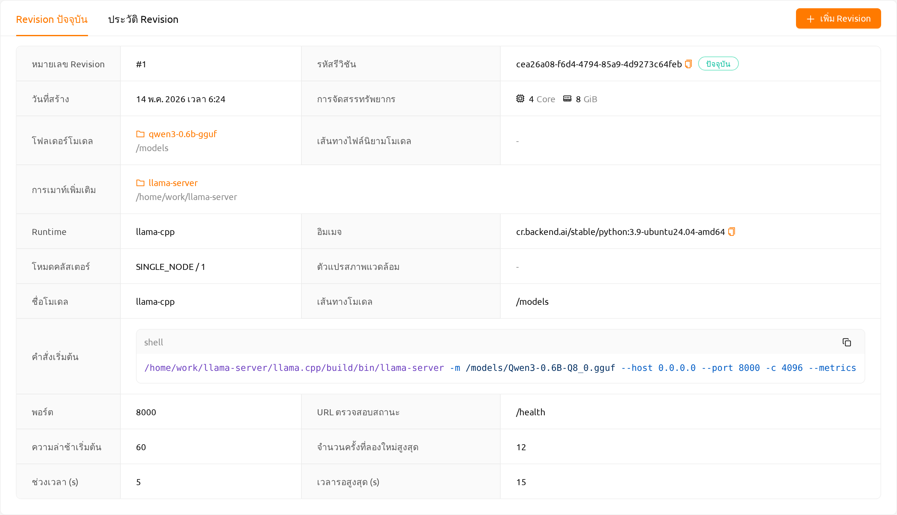

<a id="model-serving"></a>

# การปรับใช้

## ภาพรวมการปรับใช้

Backend.AI ให้คุณปรับใช้โมเดล AI เป็นบริการ inference ผ่านฟีเจอร์ **การปรับใช้ (Deployments)** การปรับใช้แต่ละรายการจะเปิดให้โมเดลเข้าถึงได้ผ่าน URL ของ endpoint ที่เสถียร ซึ่งแอปพลิเคชันของผู้ใช้ปลายทาง (เช่น แอปมือถือ, backend ของเว็บเซอร์วิส, เครื่องมือภายในองค์กร) สามารถเรียกใช้งานเพื่อทำ inference ได้


การปรับใช้ขยายความสามารถของเซสชันการคำนวณทั่วไปด้วยการบำรุงรักษาแบบอัตโนมัติ การปรับขนาดของ replica และที่อยู่ endpoint ถาวรซึ่งไม่เปลี่ยนแปลงไม่ว่ามีการเพิ่มหรือลด replica อย่างไรก็ตาม คุณเพียงระบุพารามิเตอร์การปรับขนาดที่ต้องการเท่านั้น Backend.AI จะสร้าง ตรวจสอบ และยุติเซสชัน inference เบื้องหลังให้โดยอัตโนมัติ คุณจึงไม่ต้องจัดการเซสชันเหล่านั้นด้วยตนเอง

## วิธีสร้างและใช้งานการปรับใช้

ตั้งแต่เวอร์ชัน 26.4.0 เป็นต้นไป คุณสามารถสร้างการปรับใช้ได้อย่างง่ายดายโดยไม่ต้องใช้ไฟล์กำหนดค่าแยกต่างหาก

**Quick Deploy (แนะนำ)**: เรียกดูโมเดลที่กำหนดค่าไว้ล่วงหน้าใน [Model Store](#model-store) และคลิกปุ่ม `Deploy` เพื่อ deploy ได้ทันที

**Deploy ด้วยตนเอง**: คลิกปุ่ม `สร้างการปรับใช้` ในหน้าการปรับใช้เพื่อเปิดหน้าต่าง **สร้างการปรับใช้** หลังจากสร้างการปรับใช้แล้ว ให้คลิก `เพิ่ม Revision` ในหน้าข้อมูลรายละเอียดการปรับใช้ และเลือกตัวแปร runtime เช่น `vLLM` หรือ `SGLang`

ขั้นตอนการทำงานทั่วไปมีดังนี้:

1. สร้างการปรับใช้ (ชื่อ, การมองเห็น, และกลุ่มทรัพยากร)
2. เพิ่ม Revision (ตัวแปร runtime, image, ทรัพยากร, และ model storage)
3. (ถ้าการปรับใช้ไม่เป็นสาธารณะ) สร้างโทเค็น
4. (สำหรับผู้ใช้ปลายทาง) เข้าถึง service endpoint เพื่อตรวจสอบบริการ
5. (ถ้าจำเป็น) เพิ่ม Revision ใหม่หรือนำ Revision ก่อนหน้ามาใช้
6. (ถ้าจำเป็น) ยุติการปรับใช้

<details>
<summary>ขั้นสูง: การใช้ไฟล์กำหนดโมเดลและไฟล์กำหนดบริการ (Custom Runtime)</summary>

หากคุณใช้ตัวแปร runtime `Custom` หรือต้องการการควบคุมที่ละเอียดกว่า คุณสามารถสร้างและใช้ไฟล์กำหนดโมเดลและไฟล์กำหนดบริการได้:

1. สร้างไฟล์กำหนดโมเดล
2. สร้างไฟล์กำหนดบริการ
3. อัปโหลดไฟล์กำหนดไปยังโฟลเดอร์ประเภทโมเดล
4. เมื่อเพิ่ม Revision ให้เลือกตัวแปร runtime `Custom` และเลือกโหมด **ใช้ Config ไฟล์**

สำหรับรายละเอียด โปรดดูส่วน [การสร้างไฟล์กำหนดโมเดล](#model-definition-guide) และ [การสร้างไฟล์กำหนดบริการ](#service-definition-file)

</details>

<details>
<summary>อ้างอิง: คู่มือไฟล์การกำหนดค่าสำหรับ Custom Runtime</summary>

<a id="model-definition-guide"></a>

### การสร้างไฟล์กำหนดโมเดล

:::note
ตั้งแต่เวอร์ชัน 24.03 คุณสามารถกำหนดชื่อไฟล์กำหนดโมเดลได้ หากคุณไม่ได้
ป้อนฟิลด์อื่นใดในเส้นทางไฟล์กำหนดโมเดล ระบบจะถือว่าเป็น `model-definition.yml`
หรือ `model-definition.yaml`
:::

ไฟล์กำหนดโมเดลประกอบด้วยข้อมูลการกำหนดค่าที่ระบบ Backend.AI ต้องการเพื่อเริ่มต้น เตรียมการ และปรับขนาดเซสชัน inference โดยอัตโนมัติ ไฟล์นี้ถูกจัดเก็บในโฟลเดอร์ประเภทโมเดลแยกต่างหากจากอิมเมจคอนเทนเนอร์ที่มีเอนจิน inference ซึ่งช่วยให้เอนจินสามารถให้บริการโมเดลที่แตกต่างกันตามความต้องการเฉพาะ และไม่จำเป็นต้องสร้างและ deploy อิมเมจคอนเทนเนอร์ใหม่ทุกครั้งที่โมเดลเปลี่ยน โดยการโหลดการกำหนดโมเดลและข้อมูลโมเดลจากที่จัดเก็บบนเครือข่าย กระบวนการ deploy สามารถทำได้ง่ายและเหมาะสมยิ่งขึ้นระหว่างการปรับขนาดอัตโนมัติ

ไฟล์กำหนดโมเดลมีรูปแบบดังนี้:

```yaml
models:
  - name: "simple-http-server"
    model_path: "/models"
    service:
      start_command:
        - python
        - -m
        - http.server
        - --directory
        - /home/work
        - "8000"
      port: 8000
      health_check:
        path: /
        interval: 10.0
        max_retries: 10
        max_wait_time: 15.0
        expected_status_code: 200
        initial_delay: 60.0
```

**คำอธิบายคู่คีย์-ค่า สำหรับไฟล์กำหนดโมเดล**

:::note
ฟิลด์ที่ไม่มีเครื่องหมาย "(จำเป็น)" เป็นตัวเลือก
:::

- `name` (จำเป็น): กำหนดชื่อของโมเดล
- `model_path` (จำเป็น): ระบุเส้นทางที่โมเดลถูกกำหนด
- `service`: รายการสำหรับจัดระเบียบข้อมูลเกี่ยวกับไฟล์ที่จะให้บริการ
  (รวมถึงสคริปต์คำสั่งและโค้ด)

   - `pre_start_actions`: การดำเนินการที่จะดำเนินการก่อน `start_command` การดำเนินการเหล่านี้
     เตรียมสภาพแวดล้อมโดยการสร้างไฟล์การกำหนดค่า การตั้งค่าไดเรกทอรี หรือ
     การรันสคริปต์เริ่มต้น การดำเนินการจะถูกดำเนินการตามลำดับที่กำหนด

      - `action`: ประเภทของการดำเนินการที่จะดำเนินการ ดูข้อมูลประเภทการดำเนินการที่มีและพารามิเตอร์ได้ที่
        [การดำเนินการก่อนเริ่ม](#prestart-actions)
      - `args`: พารามิเตอร์เฉพาะการดำเนินการ แต่ละประเภทการดำเนินการมีอาร์กิวเมนต์ที่จำเป็นต่างกัน

   - `start_command` (จำเป็น): ระบุคำสั่งที่จะดำเนินการในการให้บริการโมเดล
     สามารถเป็นสตริงหรือรายการสตริง
   - `port` (จำเป็น): พอร์ตคอนเทนเนอร์สำหรับบริการโมเดล (เช่น `8000`, `8080`)
   - `health_check`: การกำหนดค่าสำหรับการตรวจสอบสุขภาพของบริการโมเดลเป็นระยะ
     เมื่อได้รับการกำหนดค่าแล้ว ระบบจะตรวจสอบโดยอัตโนมัติว่าบริการตอบสนองอย่างถูกต้อง
     และลบอินสแตนซ์ที่ไม่สมบูรณ์ออกจากการเส้นทางการรับส่งข้อมูล

      - `path` (จำเป็น): เส้นทาง HTTP endpoint สำหรับคำขอตรวจสอบสุขภาพ (เช่น `/health`, `/v1/health`)
      - `interval` (ค่าเริ่มต้น: `10.0`): เวลาเป็นวินาทีระหว่างการตรวจสอบสุขภาพต่อเนื่อง
      - `max_retries` (ค่าเริ่มต้น: `10`): จำนวนความล้มเหลวต่อเนื่องที่อนุญาตก่อนที่จะทำเครื่องหมาย
        บริการเป็น `UNHEALTHY` บริการจะยังคงรับการรับส่งข้อมูลจนกว่าจะเกินเกณฑ์นี้
      - `max_wait_time` (ค่าเริ่มต้น: `15.0`): เวลาหมดเวลาเป็นวินาทีสำหรับแต่ละคำขอ HTTP ตรวจสอบสุขภาพ
        หากไม่ได้รับการตอบกลับภายในเวลานี้ การตรวจสอบจะถือว่าล้มเหลว
      - `expected_status_code` (ค่าเริ่มต้น: `200`): รหัสสถานะ HTTP ที่บ่งชี้ว่าการตอบกลับมีสุขภาพดี
        ค่าทั่วไป: `200` (OK), `204` (No Content)
      - `initial_delay` (ค่าเริ่มต้น: `60.0`): เวลาเป็นวินาทีที่รอหลังจากสร้างคอนเทนเนอร์
        ก่อนที่จะเริ่มการตรวจสอบสุขภาพ สิ่งนี้ให้เวลาสำหรับการโหลดโมเดล การเตรียม GPU
        และการอุ่นเครื่องบริการ ตั้งค่าที่สูงขึ้นสำหรับโมเดลขนาดใหญ่ (เช่น `300.0` สำหรับ LLMs 70B+)


**ความเข้าใจพฤติกรรมการตรวจสอบสุขภาพ**

ระบบการตรวจสอบสุขภาพจะตรวจสอบคอนเทนเนอร์บริการโมเดลแต่ละตัวและจัดการการเส้นทางการรับส่งข้อมูลโดยอัตโนมัติตามสถานะสุขภาพ

**① AppProxy: การควบคุมการกำหนดเส้นทาง Traffic**


**② Manager: การจัดการสถานะสุขภาพและ Eviction**


:::note
สถานะสุขภาพภายใน (ใช้สำหรับการเส้นทางการรับส่งข้อมูล) อาจไม่ถูก
ซิงโครไนซ์ทันทีกับสถานะที่แสดงในส่วนติดต่อผู้ใช้
:::

**เวลาจนถึง UNHEALTHY**:

- การเริ่มต้นครั้งแรก: `initial_delay + interval × (max_retries + 1)`

  ตัวอย่างกับค่าเริ่มต้น: 60 + 10 × 11 = **170 วินาที** (ประมาณ 3 นาที)

- ระหว่างการทำงาน (หลังจากสุขภาพดีแล้ว): `interval × (max_retries + 1)`

  ตัวอย่างกับค่าเริ่มต้น: 10 × 11 = **110 วินาที** (ประมาณ 2 นาที)


<a id="prestart-actions"></a>

**คำอธิบายการดำเนินการบริการที่รองรับใน Backend.AI การให้บริการโมเดล**


- `write_file`: การดำเนินการเพื่อสร้างไฟล์ด้วยชื่อไฟล์ที่กำหนดและเพิ่มเนื้อหา
  สิทธิ์การเข้าถึงเริ่มต้นคือ `644`

   - `arg/filename`: ระบุชื่อไฟล์
   - `body`: ระบุเนื้อหาที่จะเพิ่มลงในไฟล์
   - `mode`: ระบุสิทธิ์การเข้าถึงไฟล์
   - `append`: ตั้งค่าว่าจะเขียนทับหรือผนวกเนื้อหาลงในไฟล์เป็น `True` หรือ `False`

- `write_tempfile`: การดำเนินการเพื่อสร้างไฟล์ด้วยชื่อไฟล์ชั่วคราว (`.py`) และผนวกเนื้อหา
  หากไม่ได้ระบุค่าสำหรับ mode สิทธิ์การเข้าถึงเริ่มต้นจะเป็น `644`

   - `body`: ระบุเนื้อหาที่จะเพิ่มลงในไฟล์
   - `mode`: ระบุสิทธิ์การเข้าถึงไฟล์

- `run_command`: ผลลัพธ์จากการดำเนินการคำสั่ง รวมถึงข้อผิดพลาดใดๆ จะถูกส่งกลับในรูปแบบต่อไปนี้
  (`out`: ผลลัพธ์จากการดำเนินการคำสั่ง, `err`: ข้อความแสดงข้อผิดพลาดหากเกิดข้อผิดพลาดระหว่างการดำเนินการ)

   - `args/command`: ระบุคำสั่งที่จะดำเนินการเป็นอาร์เรย์ (เช่น คำสั่ง `python3 -m http.server 8080` กลายเป็น ["python3", "-m", "http.server", "8080"])

- `mkdir`: การดำเนินการเพื่อสร้างไดเรกทอรีตามเส้นทางที่ระบุ

   - `args/path`: ระบุเส้นทางเพื่อสร้างไดเรกทอรี

- `log`: การดำเนินการเพื่อพิมพ์ล็อกตามข้อความที่ระบุ

   - `args/message`: ระบุข้อความที่จะแสดงในล็อก
   - `debug`: ตั้งค่าเป็น `True` หากอยู่ในโหมดดีบัก มิฉะนั้นตั้งค่าเป็น `False`

### การอัปโหลดไฟล์กำหนดโมเดลไปยังโฟลเดอร์ประเภทโมเดล

เพื่ออัปโหลดไฟล์กำหนดโมเดล (`model-definition.yml`) ไปยังโฟลเดอร์ประเภทโมเดล คุณต้องสร้างโฟลเดอร์เสมือน เมื่อสร้างโฟลเดอร์เสมือน ให้เลือกประเภท `model` แทนประเภท `general` เริ่มต้น โปรดดูส่วน [การสร้างโฟลเดอร์จัดเก็บ](#create-storage-folder) ในหน้า Data สำหรับคำแนะนำเกี่ยวกับวิธีสร้างโฟลเดอร์


หลังจากสร้างโฟลเดอร์แล้ว ให้เลือกแท็บ 'MODELS' ในหน้า Data คลิกไอคอนโฟลเดอร์ประเภทโมเดลที่สร้างขึ้นล่าสุดเพื่อเปิดตัวสำรวจโฟลเดอร์ และอัปโหลดไฟล์กำหนดโมเดล สำหรับข้อมูลเพิ่มเติมเกี่ยวกับวิธีใช้ตัวสำรวจโฟลเดอร์ โปรดดูส่วน [สำรวจโฟลเดอร์](#explore-folder)


<a id="service-definition-file"></a>

### การสร้างไฟล์กำหนดบริการ

ไฟล์กำหนดบริการ (`service-definition.toml`) ช่วยให้ผู้ดูแลระบบสามารถกำหนดค่าทรัพยากร สภาพแวดล้อม และการตั้งค่า runtime ที่จำเป็นสำหรับบริการโมเดลล่วงหน้า เมื่อไฟล์นี้อยู่ในโฟลเดอร์โมเดล ระบบจะใช้การตั้งค่าเหล่านี้เป็นค่าเริ่มต้นเมื่อสร้างบริการ

ทั้ง `model-definition.yaml` และ `service-definition.toml` ต้องอยู่ในโฟลเดอร์โมเดลเพื่อเปิดใช้งานปุ่ม `Deploy` ในหน้า Model Store ไฟล์ทั้งสองทำงานร่วมกัน: ไฟล์กำหนดโมเดลระบุการกำหนดค่าโมเดลและเซิร์ฟเวอร์ inference ในขณะที่ไฟล์กำหนดบริการระบุสภาพแวดล้อม runtime การจัดสรรทรัพยากร และตัวแปรสภาพแวดล้อม

ไฟล์กำหนดบริการใช้รูปแบบ TOML โดยมีส่วนต่างๆ จัดตามตัวแปร runtime แต่ละส่วนกำหนดลักษณะเฉพาะของบริการ:

```toml
[vllm.environment]
image        = "example.com/model-server:latest"
architecture = "x86_64"

[vllm.resource_slots]
cpu = 1
mem = "8gb"
"cuda.shares" = "0.5"

[vllm.environ]
MODEL_NAME = "example-model-name"
```

**คำอธิบายคู่คีย์-ค่า สำหรับไฟล์กำหนดบริการ**

- `[{runtime}.environment]`: ระบุอิมเมจคอนเทนเนอร์และสถาปัตยกรรมสำหรับบริการโมเดล

   - `image` (จำเป็น): เส้นทางเต็มของอิมเมจคอนเทนเนอร์ที่ใช้สำหรับบริการ inference (เช่น `example.com/model-server:latest`)
   - `architecture` (จำเป็น): สถาปัตยกรรม CPU ของอิมเมจคอนเทนเนอร์ (เช่น `x86_64`, `aarch64`)

- `[{runtime}.resource_slots]`: กำหนดทรัพยากรการคำนวณที่จัดสรรให้กับบริการโมเดล

   - `cpu`: จำนวนคอร์ CPU ที่จะจัดสรร (เช่น `1`, `2`, `4`)
   - `mem`: จำนวนหน่วยความจำที่จะจัดสรร รองรับคำต่อท้ายหน่วย (เช่น `"8gb"`, `"16gb"`)
   - `"cuda.shares"`: ส่วนแบ่ง GPU เศษส่วน (fGPU) ที่จะจัดสรร (เช่น `"0.5"`, `"1.0"`) ค่านี้ใส่เครื่องหมายคำพูดเนื่องจากคีย์มีจุด

- `[{runtime}.environ]`: ตั้งค่าตัวแปรสภาพแวดล้อมที่จะส่งผ่านไปยังคอนเทนเนอร์บริการ inference

   - คุณสามารถกำหนดตัวแปรสภาพแวดล้อมใดๆ ที่จำเป็นสำหรับ runtime เช่น `MODEL_NAME` มักใช้เพื่อระบุโมเดลที่จะโหลด

:::note
คำนำหน้า `{runtime}` ในแต่ละส่วนหัวสอดคล้องกับชื่อตัวแปร runtime (เช่น `vllm`, `nim`, `custom`) ระบบจะจับคู่คำนำหน้านี้กับตัวแปร runtime ที่เลือกเมื่อสร้างบริการ
:::

:::note
เมื่อบริการถูกสร้างขึ้นจาก Model Store โดยใช้ปุ่ม `Deploy` การตั้งค่าจาก `service-definition.toml` จะถูกนำไปใช้โดยอัตโนมัติ หากคุณต้องการปรับการจัดสรรทรัพยากรในภายหลัง คุณสามารถแก้ไขบริการผ่านหน้าการปรับใช้ได้
:::

</details>

## ภาพรวมหน้าการปรับใช้

หน้าการปรับใช้แสดงรายการการปรับใช้ทั้งหมดในโปรเจกต์ปัจจุบัน คุณสามารถเข้าถึงได้โดยคลิก **การปรับใช้** ในเมนูด้านข้าง


ที่ด้านบนของหน้า คุณสามารถกรองการปรับใช้ตามขั้นตอนวงจรชีวิต:

- **คล่องแคล่ว**: แสดงการปรับใช้ที่กำลังทำงานหรือกำลังสร้าง นี่คือมุมมองเริ่มต้น
- **ถูกทำลาย**: แสดงการปรับใช้ที่ถูกยุติแล้ว

คุณยังสามารถใช้แถบตัวกรองคุณสมบัติเพื่อค้นหาการปรับใช้ตาม **ชื่อการปรับใช้ (Deployment Name)**, **URL ของ Service Endpoint** หรือ **เจ้าของ** (มีให้สำหรับผู้ดูแลระบบ)

คลิกปุ่ม `สร้างการปรับใช้` เพื่อเปิดหน้าต่าง **สร้างการปรับใช้**

## การสร้างการปรับใช้

การสร้างการปรับใช้แบ่งเป็นสองขั้นตอน

1. **สร้างการปรับใช้ (deployment)** — คอนเทนเนอร์น้ำหนักเบาที่กำหนดเฉพาะข้อมูลระบุตัวตนของการปรับใช้ (ชื่อ การมองเห็น เมตาดาตาของการปรับใช้ และ resource group)
2. **เพิ่ม Revision** — snapshot ของการกำหนดค่าที่ระบุสิ่งที่จะรันจริง (start command, environment variables, runtime variant, image, ทรัพยากร และ model storage)

แต่ละการปรับใช้สามารถมี Revision ได้หลายรายการ แต่ในแต่ละช่วงเวลาจะมี Revision *ปัจจุบัน* (Revision ที่ให้บริการ traffic) เพียงรายการเดียว และคุณสามารถสลับระหว่าง Revision ได้จากแท็บ Revisions ในหน้าข้อมูลรายละเอียดการปรับใช้

### หน้าต่างสร้างการปรับใช้

คลิกปุ่ม `สร้างการปรับใช้` ในหน้าการปรับใช้เพื่อเปิดหน้าต่าง **สร้างการปรับใช้** หน้าต่างนี้รับเฉพาะเมตาดาตาระดับการปรับใช้เท่านั้น และจะยังไม่มีการสร้าง Revision ในขั้นตอนนี้


หน้าต่างประกอบด้วยฟิลด์ต่อไปนี้

- **ชื่อการปรับใช้ (Deployment Name)**: ชื่อที่ไม่ซ้ำกันที่ใช้ระบุการปรับใช้ทั้งใน dashboard, API และ URL ของ endpoint
- **กลุ่มทรัพยากร (Resource Group)**: กลุ่มทรัพยากรที่การปรับใช้จะทำงาน หากโปรเจกต์ของคุณมี resource group เพียงกลุ่มเดียว ระบบจะเลือกให้โดยอัตโนมัติและสามารถดำเนินการต่อได้โดยไม่ต้องเลือกเอง
- **จำนวนเรพลิกาที่ต้องการ (Desired Replicas)**: จำนวนเรพลิกาที่ต้องคงไว้ให้ทำงานสำหรับการปรับใช้นี้ ระบบจะปรับขนาดพูลที่ใช้งานอยู่ไปยังเป้าหมายนี้
- **แท็ก (Tags)**: ป้ายกำกับที่ไม่บังคับสำหรับจัดระเบียบและกรองการปรับใช้ กด Enter หรือจุลภาคเพื่อเพิ่ม
- **เปิดสาธารณะ (Open To Public)**: เมื่อเปิดใช้งาน endpoint จะสามารถเข้าถึงได้โดยไม่ต้องใช้ access token เมื่อปิดใช้งาน ทุกคำขอจะต้องแนบ token ดูรายละเอียดที่ [การสร้างโทเค็น](#generating-tokens)

คลิก `สร้างการปรับใช้` เพื่อสร้างการปรับใช้ จากนั้นคุณจะถูกพาไปยังหน้าข้อมูลรายละเอียดการปรับใช้ และจะเห็นคำเตือน **ไม่มีการปรับใช้รุ่นแก้ไข** จนกว่าคุณจะเพิ่ม Revision แรก หากต้องการอัปเดตการตั้งค่าระดับการปรับใช้ (ชื่อ, การมองเห็น, จำนวนเรพลิกาที่ต้องการ, หรือแท็ก) หลังจากสร้างแล้ว ให้คลิกปุ่ม **แก้ไข** บนการ์ดข้อมูลบริการ

### การเพิ่ม Revision

Revision รวบรวมการตั้งค่าที่จำเป็นทั้งหมดสำหรับการรัน inference server ได้แก่ image, start command, ทรัพยากร, การ mount โมเดล และ environment variables จากหน้าข้อมูลรายละเอียดการปรับใช้ ให้คลิก `เพิ่ม Revision` เพื่อเปิดหน้าต่าง


ใช้ตัวสลับ **โหมดพรีเซต** / **โหมดขั้นสูง** ในส่วนหัวของหน้าต่างเพื่อเลือกวิธีกำหนดค่า Revision

#### โหมดพรีเซต

เพิ่ม Revision อย่างรวดเร็วโดยใช้ deployment preset ที่กำหนดไว้ล่วงหน้า

- **พรีเซ็ต**: deployment preset ที่เข้ากันได้กับ resource group ของการปรับใช้ คลิกปุ่ม ⓘ ข้างตัวเลือกเพื่อดูรายละเอียดของ preset
- **โฟลเดอร์โมเดล**: โฟลเดอร์จัดเก็บที่จะเมาต์ในแต่ละ replica

หากไม่มี preset ที่ใช้ได้กับ resource group ของการปรับใช้ ระบบจะแสดงข้อความแนะนำแทน ให้สลับไปยังโหมดขั้นสูงเพื่อกำหนดค่า Revision ด้วยตนเอง

#### โหมดขั้นสูง

กำหนดค่าทุกการตั้งค่าของ Revision โดยตรง ปุ่ม **โหลด Revision ปัจจุบัน** ช่วยให้คุณกรอกข้อมูลในฟอร์มล่วงหน้าจาก Revision ที่ใช้งานอยู่ในปัจจุบัน

ฟอร์มประกอบด้วยส่วนต่อไปนี้

- **โมเดลและ Runtime**: เลือกโฟลเดอร์โมเดลและ runtime variant สำหรับ variant `vLLM` / `SGLang` จะแสดงแผง Runtime Parameters ส่วน variant `Custom` จะแสดงตัวควบคุมโหมดกำหนดโมเดล ดูรายละเอียดฟิลด์เฉพาะ runtime ได้ที่ส่วนด้านล่าง
- **สภาพแวดล้อม**: เลือก container image (สภาพแวดล้อม / เวอร์ชัน) และเพิ่ม environment variables
- **คลัสเตอร์และทรัพยากร**: จัดสรรทรัพยากร CPU, memory และ accelerator
- **การตั้งค่าขั้นสูง** *(ย่อ/ขยายได้)*: เมาต์โฟลเดอร์จัดเก็บเพิ่มเติมนอกเหนือจากโฟลเดอร์โมเดล

ที่ด้านล่างของหน้าต่าง ให้เลือก **เปิดใช้งานอัตโนมัติหลังจากเพิ่ม** เพื่อเปิดใช้งาน Revision ทันทีหลังจากสร้าง หากไม่ได้เลือก Revision จะถูกบันทึกในสถานะไม่ได้ใช้งาน และคุณสามารถนำมาใช้ภายหลังได้จากแท็บ Revisions

### ฟิลด์การกำหนดค่า Revision: โหมด Custom

เมื่อคุณเลือก runtime variant **Custom** ในหน้าต่าง Add Revision ตัวควบคุม **โหมดกำหนดโมเดล** จะปรากฏที่ด้านบนของฟอร์ม ซึ่งช่วยให้คุณเลือกวิธีกำหนดการเริ่มต้น inference server ได้ 2 วิธี

#### โหมดป้อนคำสั่ง

เลือก **ป้อนคำสั่ง** เพื่อกำหนดการเริ่มต้น inference server โดยตรงในรูปแบบคำสั่ง CLI ฟิลด์ที่ใช้ได้มีดังนี้

- **คำสั่งเริ่มต้น (Start Command)**: คำสั่ง shell หรือรายการอาร์กิวเมนต์สำหรับเปิดใช้งาน inference server เช่น `python -m http.server 8000`
- **ปลายทางเมาต์โมเดล**: เส้นทางภายในคอนเทนเนอร์ที่โฟลเดอร์จัดเก็บโมเดลถูกเมาต์ (ค่าเริ่มต้น: `/models`)
- **พอร์ต (Port)**: พอร์ตคอนเทนเนอร์ที่ inference server รับฟัง (ค่าเริ่มต้น: `8000`)
- **URL ตรวจสอบสุขภาพ**: เส้นทาง HTTP endpoint ที่ใช้ตรวจสอบสุขภาพของบริการ (ค่าเริ่มต้น: `/health`)
- **ระยะผ่อนผันการเริ่มต้น**: ระยะผ่อนผัน (เป็นวินาที) หลังจากคอนเทนเนอร์เริ่มทำงาน ซึ่งการตรวจสอบสุขภาพที่ล้มเหลวจะได้รับการยอมรับ และเรพลิกาจะเปิดใช้งานเมื่อการตรวจสอบสุขภาพสำเร็จครั้งแรก (ค่าเริ่มต้น: `60.0`) ให้ตั้งค่าสูงขึ้นสำหรับโมเดลขนาดใหญ่ที่ต้องใช้เวลาโหลดนาน
- **จำนวนครั้งสูงสุดที่ลองใหม่**: จำนวนครั้งสูงสุดที่การตรวจสอบสุขภาพล้มเหลวติดต่อกันก่อนที่เรพลิกาจะถูกทำเครื่องหมายว่า `UNHEALTHY` (ค่าเริ่มต้น: `10`)
- **ช่วงเวลา**: เวลาระหว่างการตรวจสอบสุขภาพที่ต่อเนื่องกัน (วินาที) (ค่าเริ่มต้น: `10.0`)
- **เวลารอสูงสุด**: เวลาหมดอายุ (วินาที) สำหรับคำขอ HTTP ตรวจสอบสุขภาพแต่ละครั้ง (ค่าเริ่มต้น: `15.0`)

#### โหมดใช้ไฟล์การตั้งค่า

เลือก **ใช้ไฟล์การตั้งค่า** เพื่อโหลดการกำหนดค่าของ inference server จากไฟล์ `model-definition.yaml` ที่จัดเก็บในโฟลเดอร์จัดเก็บโมเดล ฟิลด์ที่ใช้ได้มีดังนี้

- **ปลายทางเมาต์**: เส้นทางภายในคอนเทนเนอร์ที่โฟลเดอร์จัดเก็บโมเดลถูกเมาต์ (ค่าเริ่มต้น: `/models`)
- **เส้นทางไฟล์กำหนดโมเดล**: เส้นทางไปยังไฟล์กำหนดโมเดลภายในโฟลเดอร์จัดเก็บโมเดล (ค่าเริ่มต้น: `model-definition.yaml`)

สำหรับคำแนะนำในการสร้างไฟล์กำหนดโมเดล ดูที่ [การสร้างไฟล์กำหนดโมเดล](#model-definition-guide)

#### พารามิเตอร์ Runtime (vLLM / SGLang)

เมื่อคุณเลือก runtime variant `vLLM` หรือ `SGLang` ส่วน **พารามิเตอร์ Runtime** จะปรากฏขึ้นแทนตัวเลือกโหมดกำหนดโมเดล ส่วนนี้ช่วยให้คุณกำหนดค่า serving framework โดยไม่ต้องแก้ไขไฟล์การกำหนดค่าด้วยตนเอง

พารามิเตอร์ถูกจัดเป็นหมวดหมู่ที่แยกตามแท็บ รายการแท็บที่มีจะแตกต่างกันตาม runtime variant

:::note
พารามิเตอร์ที่ไม่เปลี่ยนแปลงจะใช้ค่าเริ่มต้นของ runtime
:::

**พารามิเตอร์ Runtime ของ vLLM**


vLLM มีแท็บพารามิเตอร์ดังต่อไปนี้: **Model Loading**, **Resource Memory**, **Serving Performance**, **Multimodal**, **Tool Reasoning** และอื่น ๆ

ฟิลด์หลักในแท็บ **Model Loading**:

- **Model**: ชื่อหรือเส้นทางของโมเดลที่จะใช้
- **DType**: ประเภทข้อมูลสำหรับน้ำหนักโมเดลและการคำนวณ (เช่น `Auto`, `float16`, `bfloat16`)
- **Quantization**: วิธีการ quantization ของโมเดล (เช่น `awq`, `gptq`, `fp8`)
- **Max Model Length**: ความยาวบริบทสูงสุด (จำนวน token) ที่โมเดลสามารถประมวลผลได้
- **Served Model Name**: ชื่อโมเดลที่เปิดเผยบน API endpoint
- **Trust Remote Code**: อนุญาตให้รันโค้ดโมเดลที่กำหนดเองจากคลังโมเดล

**พารามิเตอร์ Runtime ของ SGLang**


SGLang มีแท็บพารามิเตอร์ดังต่อไปนี้: **Model Loading**, **Resource Memory**, **Serving Performance**, **Tool Reasoning** และอื่น ๆ

ฟิลด์หลักในแท็บ **Model Loading**:

- **Model**: ชื่อหรือเส้นทางของโมเดลที่จะใช้
- **DType**: ประเภทข้อมูลสำหรับน้ำหนักโมเดลและการคำนวณ (เช่น `Auto`, `float16`, `bfloat16`)
- **Quantization**: วิธีการ quantization ของโมเดล (เช่น `awq`, `gptq`, `fp8`)
- **Context Length**: ความยาวบริบทสูงสุดที่โมเดลสามารถประมวลผลได้
- **Served Model Name**: ชื่อโมเดลที่เปิดเผยบน API endpoint
- **Trust Remote Code**: อนุญาตให้รันโค้ดโมเดลที่กำหนดเองจากคลังโมเดล

runtime variant `vLLM` และ `SGLang` จะกรอกตัวแปรสภาพแวดล้อมต่อไปนี้ล่วงหน้าในส่วน **สภาพแวดล้อม**:

- **vLLM**: `BACKEND_MODEL_NAME`, `VLLM_QUANTIZATION`, `VLLM_TP_SIZE` (tensor parallelism), `VLLM_PP_SIZE` (pipeline parallelism), `VLLM_EXTRA_ARGS` (อาร์กิวเมนต์ CLI เพิ่มเติม)
- **SGLang**: `BACKEND_MODEL_NAME`, `SGLANG_QUANTIZATION`, `SGLANG_TP_SIZE` (tensor parallelism), `SGLANG_PP_SIZE` (pipeline parallelism), `SGLANG_EXTRA_ARGS` (อาร์กิวเมนต์ CLI เพิ่มเติม)

#### สภาพแวดล้อม

ส่วน **สภาพแวดล้อม** มีอยู่สำหรับ runtime variant ทั้งหมด

- **สภาพแวดล้อม / เวอร์ชัน**: container image ที่ใช้สำหรับ inference server เมื่อเลือก runtime variant รายการจะถูกกรองให้เหลือเฉพาะ image ที่เข้ากันได้กับ runtime นั้น
- **ตัวแปรสภาพแวดล้อม**: คู่ key/value ที่จะถูกส่งให้คอนเทนเนอร์ของ inference server สำหรับ `vLLM` และ `SGLang` ตัวแปรเฉพาะ runtime ที่ระบุไว้ข้างต้นจะถูกกรอกไว้ล่วงหน้า คุณสามารถเพิ่ม แก้ไข หรือลบรายการได้อย่างอิสระ

#### คลัสเตอร์และทรัพยากร

ส่วน **คลัสเตอร์และทรัพยากร** ช่วยให้คุณระบุทรัพยากรการประมวลผลที่จะจัดสรรให้แต่ละเรพลิกา

- **Resource Preset**: ชุดการจัดสรร CPU, หน่วยความจำ และ accelerator ที่กำหนดไว้ล่วงหน้า รายการ preset ที่มีจะถูกกรองตาม resource group ของการปรับใช้ คุณยังสามารถกำหนดค่าทรัพยากร (CPU, หน่วยความจำ, GPU) ด้วยตนเองโดยไม่ต้องเลือก preset

#### การตั้งค่าขั้นสูง

ขยายแผง **การตั้งค่าขั้นสูง** เพื่อเมาต์โฟลเดอร์จัดเก็บเพิ่มเติมควบคู่กับโฟลเดอร์จัดเก็บโมเดล

- **เมาต์เพิ่มเติม**: รายการโฟลเดอร์จัดเก็บที่จะเมาต์ลงในคอนเทนเนอร์ inference server สามารถเลือกได้เฉพาะโฟลเดอร์ทั่วไป (ไม่ใช่โมเดล) ที่อยู่ในสถานะพร้อมใช้งาน (`ready`) โฟลเดอร์ที่ซ่อนอยู่ (ชื่อขึ้นต้นด้วย `.`) และโฟลเดอร์จัดเก็บโมเดลหลักจะถูกยกเว้น

<a id="deployment-detail-page"></a>

## หน้าข้อมูลรายละเอียดการปรับใช้

คลิกชื่อการปรับใช้ในรายการการปรับใช้เพื่อดูข้อมูลรายละเอียดเกี่ยวกับการปรับใช้

### การแจ้งเตือนของการปรับใช้

หน้าข้อมูลรายละเอียดการปรับใช้แสดงแบนเนอร์แจ้งเตือนตามบริบทที่ด้านบนของหน้า ขึ้นอยู่กับสถานะปัจจุบันของการปรับใช้

- **การปรับใช้พร้อมแล้ว**: แสดงเมื่อการปรับใช้มีสถานะ `HEALTHY` แบนเนอร์นี้มีปุ่ม **ทดสอบในแชท** เป็นทางลัดไปยังอินเทอร์เฟซ LLM Chat Test เพื่อให้คุณทดสอบโมเดลได้โดยไม่ต้องออกจากหน้า


- **การปรับใช้แบบส่วนตัว — ใช้โทเค็นการเข้าถึงเพื่อเข้าถึงปลายทาง**: แสดงเมื่อ **เปิดให้สาธารณะ** ถูกปิดใช้งาน แบนเนอร์นี้มีทางลัดไปยัง **จัดการโทเค็นการเข้าถึง** เพื่อให้คุณออกหรือคัดลอกโทเค็นได้ ดูรายละเอียดที่ [การสร้างโทเค็น](#generating-tokens)


- **ไม่มีการปรับใช้รุ่นแก้ไข — เพิ่มรุ่นแก้ไขเพื่อเปิดใช้งานบริการนี้**: แสดงเมื่อการปรับใช้ยังไม่มี Revision ปัจจุบัน คลิก `เพิ่ม Revision` เพื่อสร้าง Revision แรกและเปิดใช้งานบริการ

- **กำลังเตรียมบริการของคุณ**: แสดงเมื่อการปรับใช้กำลังถูกสร้างหรืออยู่ระหว่างการเปลี่ยนสถานะ บ่งบอกว่าบริการยังไม่พร้อมรับคำขอ


- **บริการโมเดลนี้อยู่ในโปรเจกต์อื่น**: แสดงเมื่อการปรับใช้เป็นของโปรเจกต์อื่นที่ไม่ใช่โปรเจกต์ที่เลือกในปัจจุบัน ปุ่ม Edit จะถูกปิดใช้งานขณะที่การแจ้งเตือนนี้แสดงอยู่ คลิกปุ่ม **สลับโปรเจกต์** ในการแจ้งเตือนเพื่อสลับไปยังโปรเจกต์ที่ถูกต้อง

### ข้อมูลบริการ

การ์ดข้อมูลบริการแสดงรายละเอียดต่อไปนี้:

- **ชื่อการปรับใช้** และ **สถานะ**
- **ID การปรับใช้** และ **เจ้าของเซสชัน**
- **การมองเห็น (Visibility)**: แสดงเป็นแท็ก สาธารณะ / ส่วนตัว โดย **สาธารณะ** หมายความว่าสามารถเข้าถึง endpoint ได้โดยไม่ต้องใช้ access token และ **ส่วนตัว** หมายความว่าผู้เรียกต้องส่ง access token ที่ถูกต้องมาด้วย
- **จำนวนเรพลิกา**
- **Service Endpoint**: URL สำหรับเข้าถึงการปรับใช้ สำหรับการปรับใช้ LLM จะมีปุ่ม `ทดสอบในแชท` ให้ใช้งาน
- **Resource Group**: resource group ที่การปรับใช้ทำงานอยู่ ปัจจุบัน resource group เป็นส่วนหนึ่งของเมตาดาตาในระดับการปรับใช้ (ตั้งครั้งเดียวเมื่อสร้างการปรับใช้) ไม่ใช่ระดับ Revision อีกต่อไป
- **ทรัพยากร**: CPU, หน่วยความจำ, accelerator และ **หน่วยความจำที่ใช้ร่วมกัน (SHM)** ที่จัดสรร ค่าหน่วยความจำที่ใช้ร่วมกันมาจาก Revision ปัจจุบัน และแสดงขนาดของ `/dev/shm` ที่ inference server สามารถใช้ได้ ซึ่งสำคัญสำหรับ workload การอนุมานแบบ multi-GPU และ multi-process
- **Model Storage**: โฟลเดอร์จัดเก็บโมเดลที่เมาต์และปลายทางเมาต์
- **เมาต์เพิ่มเติม**: โฟลเดอร์จัดเก็บเพิ่มเติมที่เมาต์
- **ตัวแปรสภาพแวดล้อม**: แสดงเป็นบล็อกโค้ด
- **อิมเมจ**: อิมเมจคอนเทนเนอร์ที่ใช้สำหรับบริการ


#### เมนูเพิ่มเติม (แก้ไขและลบ)

ส่วนหัวของการ์ดข้อมูลบริการมีปุ่ม **แก้ไข** ควบคู่ไปกับเมนู **เพิ่มเติม** ปัจจุบันเมนูเพิ่มเติมมีการกระทำ **ลบการปรับใช้**


### เรพลิกา

แท็บเรพลิกาแสดง routing node ที่ประกอบกันเป็นการปรับใช้ รายการเรพลิกาจะถูกกรองด้วยตัวควบคุมแบบ radio **กำลังทำงาน / สิ้นสุดแล้ว** ที่ด้านบนของแท็บ ซึ่งแทนที่ตัวกรองสถานะแบบ enum เดิม


- **กำลังทำงาน**: แสดงเรพลิกาที่กำลังเตรียม กำลังทำงาน หรืออยู่ในสถานะใช้งานอื่น ๆ
- **สิ้นสุดแล้ว**: แสดงเรพลิกาที่สิ้นสุด lifecycle แล้ว

แต่ละแถวของเรพลิกามีฟิลด์สถานะที่**เป็นอิสระต่อกัน**สามฟิลด์ ฟิลด์เหล่านี้แสดงมิติที่แตกต่างกันและควรอ่านร่วมกัน ตัวอย่างเช่น เรพลิกาอาจอยู่ในสถานะ Lifecycle *กำลังทำงาน* ในขณะที่สถานะสุขภาพยัง *ยังไม่ตรวจสอบ* อยู่

- **สถานะ Lifecycle**: ตำแหน่งของเรพลิกาใน lifecycle (เช่น *กำลังจัดเตรียม*, *กำลังอุ่นเครื่อง*, *กำลังทำงาน*, *กำลังสิ้นสุด*, *สิ้นสุดแล้ว*) ในระหว่าง **กำลังอุ่นเครื่อง** เรพลิกาจะอยู่ภายในระยะผ่อนผันการเริ่มต้น นั่นคือกำลังเริ่มต้นและรอการตรวจสอบสุขภาพครั้งแรกที่สำเร็จ ในช่วงนี้การตรวจสอบสุขภาพที่ล้มเหลวจะได้รับการยอมรับ เรพลิกาจะเปลี่ยนเป็น *กำลังทำงาน* เมื่อสำเร็จครั้งแรก และจะถูกสิ้นสุดหากไม่สำเร็จเลยจนกว่าช่วงเวลาจะสิ้นสุด หัวคอลัมน์จะแสดงเป็น **วงจรชีวิต**
- **สถานะสุขภาพ**: สถานะสุขภาพปัจจุบันของกระบวนการเรพลิกา (*ปกติ*, *ผิดปกติ*, *เสื่อมสภาพ*, *ยังไม่ตรวจสอบ*)
   * **ยังไม่ตรวจสอบ** หมายความว่าการตรวจสอบสุขภาพครั้งแรกยังไม่เสร็จสมบูรณ์ โดยปกติเรพลิกายังอยู่ในช่วงผ่อนผัน **กำลังอุ่นเครื่อง** โดยตัวมันเองไม่ใช่ข้อผิดพลาด ให้ดู **สถานะ Lifecycle** เพื่อดูว่าเรพลิกาอยู่ในขั้นตอนใด
- **สถานะ Traffic**: เรพลิกากำลังให้บริการคำขออยู่หรือไม่ เรพลิกาสามารถถูกนำออกจาก traffic โดยไม่ขึ้นกับสถานะสุขภาพ (เช่น เมื่อถูกปิดใช้งานด้วยตนเอง) จึงแสดง traffic เป็นสถานะแยกต่างหากแทนที่จะรวมเข้ากับสถานะสุขภาพ

:::note
สถานะทั้งสามเป็นมิติที่เป็นอิสระต่อกัน ในระหว่างขั้นตอน Lifecycle **กำลังอุ่นเครื่อง** เรพลิกาจะอยู่ภายในระยะผ่อนผันการเริ่มต้น และ **สถานะสุขภาพ** มักจะแสดงเป็น *ยังไม่ตรวจสอบ* จนกว่าการตรวจสอบครั้งแรกจะเสร็จสมบูรณ์ ซึ่งไม่ได้บ่งชี้ถึงปัญหาด้วยตัวมันเอง
:::

คลิก node ของเรพลิกาเพื่อเปิด drawer รายละเอียดเซสชันสำหรับดูข้อมูลเซสชันแต่ละรายการ

หากเรพลิกาพบข้อผิดพลาด คลิกที่ตัวบ่งชี้ข้อผิดพลาดในแถวเพื่อเปิดหน้าต่าง JSON viewer ที่แสดงข้อมูลข้อผิดพลาดดิบ ซึ่งมีประโยชน์ในการวินิจฉัยปัญหาของเรพลิกาแต่ละตัว


<a id="revisions-tab"></a>

### แท็บ Revisions

การ์ด **Revisions** บนหน้ารายละเอียดการปรับใช้มีสองแท็บ ได้แก่ **Revision ปัจจุบัน** และ **ประวัติ Revision** ปุ่ม `เพิ่ม Revision` ที่ด้านบนของการ์ดใช้งานได้จากทั้งสองแท็บ และเปิดหน้าต่างเพิ่ม Revision (ดู [การเพิ่ม Revision](#การเพิ่ม-revision))

#### แท็บ Revision ปัจจุบัน

แท็บ **Revision ปัจจุบัน** แสดงการกำหนดค่าทั้งหมดของ Revision ที่ใช้งานอยู่และกำลังให้บริการทราฟฟิก



ฟิลด์ที่แสดงมีดังต่อไปนี้:

- **หมายเลข Revision**: หมายเลขลำดับที่กำหนดโดยอัตโนมัติ (เช่น *#3*)
- **ID Revision**: UUID ของ Revision นี้
- **สร้างเมื่อ**
- **ทรัพยากร**: การจัดสรรทรัพยากร (CPU, หน่วยความจำ, และตัวเร่งความเร็ว) สำหรับแต่ละเรพลิกา
- **โฟลเดอร์โมเดล**: โฟลเดอร์โมเดลที่ติดตั้งในแต่ละเรพลิกา แสดงเป็นลิงก์พร้อม **ปลายทางการเมาท์สำหรับโฟลเดอร์โมเดล**
- **เส้นทางไฟล์นิยามโมเดล**: เส้นทางของไฟล์นิยามโมเดลภายในโฟลเดอร์โมเดล
- **การเมาท์เพิ่มเติม**: โฟลเดอร์จัดเก็บเพิ่มเติมที่ติดตั้งในแต่ละเรพลิกา
- **Runtime**: รันไทม์การให้บริการ (เช่น `vLLM`, `SGLang`, หรือ `Custom`)
- **อิมเมจ**: คอนเทนเนอร์อิมเมจที่ใช้รันเรพลิกา
- **โหมดคลัสเตอร์**: รูปแบบการจัดกลุ่มของเซสชันการประมวลผลของแต่ละเรพลิกา (โหมด / ขนาด)
- **ตัวแปรสภาพแวดล้อม**: คู่คีย์-ค่าที่ถูกฉีดเข้าไปในคอนเทนเนอร์ แสดงเป็นบล็อก shell script

เมื่อไฟล์นิยามโมเดลมีการกำหนดโมเดล จะแสดงฟิลด์เพิ่มเติมดังนี้:

- **ชื่อโมเดล**, **เส้นทางโมเดล**, **คำสั่งเริ่มต้น**, **พอร์ต**, **URL ตรวจสอบสถานะ**, **ระยะผ่อนผันการเริ่มต้น**, **จำนวนครั้งที่ลองใหม่สูงสุด**, **ช่วงเวลา (s)**, **เวลารอสูงสุด (s)**

**สถานะกำลังปรับใช้**

ขณะที่ Revision อื่นกำลังถูกปรับใช้ แท็บ **Revision ปัจจุบัน** จะแสดงการแจ้งเตือน: *"กำลังปรับใช้ Revision N"* ปุ่ม **ดู Revision** ในการแจ้งเตือนจะเปิด drawer รายละเอียดของ Revision ที่กำลังถูกปรับใช้ แท็บจะรีเฟรชอัตโนมัติทุก 5 วินาทีจนกว่าการปรับใช้จะเสร็จสิ้น

**สถานะว่างเปล่า**

หากยังไม่มี Revision ที่ถูกปรับใช้ แท็บจะแสดง: *"ไม่มีการปรับใช้รุ่นแก้ไข — เพิ่มรุ่นแก้ไขเพื่อเปิดใช้งานบริการนี้"*

#### แท็บประวัติ Revision

แท็บ **ประวัติ Revision** แสดงรายการ Revision ทั้งหมดที่เพิ่มในการปรับใช้ เรียงจากใหม่ไปเก่าตามค่าเริ่มต้น


ตารางประกอบด้วยคอลัมน์ต่อไปนี้:

- **Revision (ID)**: หมายเลข Revision และ UUID ของมัน หมายเลข Revision เป็นจำนวนเต็มที่เพิ่มขึ้น ตัวเลขที่น้อยกว่าคือ Revision ที่เก่ากว่า คลิกหมายเลข Revision เพื่อเปิด drawer รายละเอียด Revision
- **สร้างเมื่อ**
- **โหมดคลัสเตอร์**: รูปแบบการจัดกลุ่มในรูปแบบ "โหมด / ขนาด" วางเมาส์เหนือส่วนหัวคอลัมน์เพื่อดูคำอธิบาย

คอลัมน์ที่ซ่อนตามค่าเริ่มต้น แต่สามารถเปิดใช้งานได้จากการตั้งค่าคอลัมน์:

- **ชื่อโมเดล**, **Runtime**, **อิมเมจ**, **โฟลเดอร์โมเดล**

**ตัวกรอง**

แถบตัวกรองด้านบนตารางช่วยให้คุณกรองรายการตามหมายเลข Revision, ช่วงวันที่สร้าง, โหมดคลัสเตอร์, อิมเมจ และโฟลเดอร์โมเดล

**การปรับใช้ Revision**

แต่ละแถวมีปุ่ม **ปรับใช้** คลิกเพื่อเปิดกล่องโต้ตอบยืนยัน เมื่อยืนยัน Revision ที่เลือกจะกลายเป็น Revision ปัจจุบันและการปรับใช้จะเริ่มให้บริการทราฟฟิกด้วยการกำหนดค่าใหม่ Revision ก่อนหน้าจะถูกเก็บไว้ในประวัติ

- แท็กสีเขียว **ปัจจุบัน** ทำเครื่องหมาย Revision ที่ใช้งานอยู่ในปัจจุบัน
- แท็กสีเหลือง **กำลังปรับใช้** (พร้อมตัวหมุนโหลด) ทำเครื่องหมาย Revision ที่กำลังถูกปรับใช้
- ปุ่ม **ปรับใช้** ถูกปิดใช้งานสำหรับ Revision ที่ใช้งานอยู่และ Revision ที่กำลังถูกปรับใช้

การคลิกหมายเลข Revision ในแถวใด ๆ จะเปิด drawer รายละเอียด Revision ที่แสดงการกำหนดค่าทั้งหมดของ Revision นั้น Drawer ยังมีปุ่ม **ปรับใช้** ด้วย (ปิดใช้งานสำหรับ Revision ปัจจุบันและกำลังปรับใช้)

### กฎการปรับขนาดอัตโนมัติ

กฎการปรับขนาดอัตโนมัติ (Auto Scaling Rules) จะเพิ่มหรือลดจำนวนเรพลิกาของบริการโมเดลโดยอัตโนมัติตามเมตริกสด ช่วยประหยัดทรัพยากรในช่วงการใช้งานต่ำ และป้องกันความล่าช้าหรือความล้มเหลวของคำขอในช่วงการใช้งานสูง


รายการกฎให้บริการดังนี้:

- แถบตัวกรองคุณสมบัติสำหรับกรองกฎตามช่วงวันเวลาของ สร้างเวลา (Created At) และ ทริกเกอร์ครั้งสุดท้าย (Last Triggered)
- การแบ่งหน้าที่ฝั่งเซิร์ฟเวอร์
- คอลัมน์ต่อไปนี้: แหล่งวัด (Metric Source), เงื่อนไข (Condition), ระยะ Cooldown (Cooldown Sec.), ขนาดขั้นตอน (Step Size), เรพลิกาขั้นต่ำ / สูงสุด (Min / Max Replicas), สร้างเวลา (Created At), ทริกเกอร์ครั้งสุดท้าย (Last Triggered) คอลัมน์ขนาดขั้นตอนจะแสดง `+`, `−`, หรือ `±` โดยอัตโนมัติตามทิศทางที่ได้จากเกณฑ์ที่คุณตั้งไว้ ดังนั้นคุณจึงไม่ต้องเลือก `Scale Out` หรือ `Scale In` โดยตรงอีกต่อไป
- ไอคอนแก้ไขและลบต่อแถว แสดงถัดจากสรุปเงื่อนไขในแต่ละแถว

คลิกปุ่ม `เพิ่มกฎ` เพื่อเปิดตัวแก้ไข **เพิ่มกฎการปรับขนาดอัตโนมัติ** หากต้องการแก้ไขกฎที่มีอยู่ ให้คลิกไอคอนแก้ไขในแถวนั้น ตัวแก้ไข **แก้ไขกฎการปรับขนาดอัตโนมัติ** จะเปิดขึ้นโดยมีค่าของกฎที่กรอกไว้ล่วงหน้า ตัวแก้ไขประกอบด้วยฟิลด์ต่อไปนี้ตามลำดับ:

- **แหล่งวัด (Metric Source)**: เลือก `Kernel`, `Inference Framework` หรือ `Prometheus`
- **ชื่อเมตริก (Metric Name)**: สำหรับ `Kernel` และ `Inference Framework` ให้ใส่ชื่อเมตริก สำหรับ `Kernel` จะมีเมตริกทั่วไป เช่น `cpu_util`, `mem`, `net_rx` และ `net_tx` เป็นคำแนะนำให้เติมอัตโนมัติ และคุณยังสามารถพิมพ์ชื่อที่กำหนดเองได้อย่างอิสระ
- **ชื่อเมตริกแบบ Preset (Metric Name (Prometheus Preset))**: แสดงเฉพาะเมื่อแหล่งวัดเป็น `Prometheus` เลือก preset จากดรอปดาวน์ ชื่อเมตริก เทมเพลตคิวรี และ (เมื่อกำหนดไว้) ระยะ Cooldown (Cooldown Sec.) ของ preset จะถูกกรอกโดยอัตโนมัติ ด้านล่างตัวเลือก การแสดงตัวอย่างค่าปัจจุบัน (Current value) จะแสดงค่าล่าสุดที่ preset ส่งกลับพร้อมปุ่มรีเฟรช เมื่อมีชุดข้อมูลหลายชุดถูกส่งกลับ การแสดงตัวอย่างจะแสดงจำนวนชุดข้อมูลและค่าล่าสุด หากไม่มีข้อมูลให้ใช้งาน จะแสดงเป็น ไม่มีข้อมูล (No data available)
- **เงื่อนไข (Condition)**: ตัวควบคุมแบบแบ่งส่วนสำหรับเลือกทิศทางการปรับขนาด มีสามตัวเลือก

   * **ย่อขนาด**: ลดจำนวนเรพลิกาเมื่อเมตริกต่ำกว่าเกณฑ์ กำหนดเงื่อนไข `Metric < [เกณฑ์]`
   * **ขยายแนวนอน**: เพิ่มจำนวนเรพลิกาเมื่อเมตริกสูงกว่าเกณฑ์ กำหนดเงื่อนไข `Metric > [เกณฑ์]`
   * **ขยายและย่อขนาด**: ปรับขยายหรือลดขนาดโดยอัตโนมัติตามด้านที่เมตริกข้ามออกจากช่วงที่กำหนด กำหนดเงื่อนไข `Metric < Min Threshold` หรือ `Metric > Max Threshold`


- **ขนาดขั้นตอน (Step Size)**: จำนวนเต็มบวกที่ระบุจำนวนเรพลิกาที่จะเพิ่มหรือลบต่อเหตุการณ์การปรับขนาด เครื่องหมาย `-`, `+`, หรือ `±` จะแสดงโดยอัตโนมัติตามเงื่อนไขที่เลือก (ย่อขนาด / ขยายแนวนอน / ขยายและย่อขนาด)

   * ตั้งเฉพาะเกณฑ์ต่ำสุด: `[metric] < [minThreshold]` จะทริกเกอร์ **ย่อขนาด** (เรพลิกาลดลงเมื่อเมตริกต่ำกว่าเกณฑ์)
   * ตั้งเฉพาะเกณฑ์สูงสุด: `[metric] > [maxThreshold]` จะทริกเกอร์ **ขยายแนวนอน** (เรพลิกาเพิ่มขึ้นเมื่อเมตริกสูงกว่าเกณฑ์)
   * ตั้งทั้งสองเกณฑ์: เรพลิกาจะถูกเพิ่มหรือลดตามขอบเขตที่เมตริกข้ามผ่าน (`[minThreshold] < [metric] < [maxThreshold]` คือช่วงการทำงานปกติ)

- **ระยะ Cooldown (Cooldown Sec.)**: เวลาเป็นวินาทีที่รอหลังจากเหตุการณ์การปรับขนาดก่อนการประเมินครั้งถัดไป
- **เรพลิกาขั้นต่ำ (Min Replicas) และเรพลิกาสูงสุด (Max Replicas)**: ขอบเขตล่างและบนที่การปรับขนาดอัตโนมัติบังคับใช้กับจำนวนเรพลิกา การปรับขนาดอัตโนมัติจะไม่ลดจำนวนเรพลิกาต่ำกว่าเรพลิกาขั้นต่ำ หรือเพิ่มให้มากกว่าเรพลิกาสูงสุด


เมื่อแหล่งวัด (Metric Source) ถูกตั้งเป็น `Prometheus` ตัวแก้ไขจะแสดงตัวเลือก preset และการแสดงตัวอย่างค่าปัจจุบัน (Current value) แบบสด


<a id="generating-tokens"></a>

### การสร้างโทเค็น

เมื่อสถานะการปรับใช้เป็น `HEALTHY` ให้คลิกชื่อการปรับใช้ในรายการการปรับใช้เพื่อเปิดหน้าข้อมูลรายละเอียดการปรับใช้ คุณสามารถตรวจสอบ URL **Service Endpoint** ได้ในการ์ดข้อมูลบริการ หาก **Open To Public** เปิดใช้งาน ผู้ใช้ปลายทางสามารถเข้าถึงการปรับใช้ได้โดยไม่ต้องใช้โทเค็น หากปิดใช้งาน ให้ออกโทเค็นตามคำอธิบายด้านล่าง


คลิกปุ่ม `สร้างโทเคน` ที่อยู่ทางขวาของรายการโทเค็นที่สร้างขึ้น
ในโมดอลที่ปรากฏขึ้น ให้ใส่วันที่หมดอายุ


โทเค็นที่ออกจะถูกเพิ่มลงในรายการโทเค็นที่สร้างขึ้น แต่ละโทเค็นจะแสดง **สถานะ** (ใช้ได้หรือหมดอายุ), **วันที่หมดอายุ** และ **วันที่สร้าง** คลิกปุ่ม `copy` ในรายการโทเค็น
เพื่อคัดลอกโทเค็น และเพิ่มเป็นค่าของคีย์ต่อไปนี้


| Key           | Value            |
|---------------|------------------|
| Content-Type  | application/json |
| Authorization | BackendAI        |

### การยุติการปรับใช้

หากไม่จำเป็นต้องใช้การปรับใช้แล้ว แนะนำให้ยุติการปรับใช้นั้น หากต้องการยุติการปรับใช้ ให้เปิดเมนู **เพิ่มเติม** บนการ์ดข้อมูลบริการ และเลือก **ลบการปรับใช้** หน้าต่างยืนยันแบบพิมพ์จะปรากฏขึ้น — พิมพ์ชื่อการปรับใช้เพื่อเปิดใช้งานปุ่ม **ลบถาวร** การปรับใช้ที่ยุติแล้วจะปรากฏในมุมมองตัวกรอง **ถูกทำลาย**


## การเข้าถึงการปรับใช้ของคุณ

แบ่งปัน URL การปรับใช้กับผู้ใช้ปลายทางเพื่อให้สามารถเข้าถึงการปรับใช้ได้ หาก **Open To Public** เปิดใช้งาน คุณสามารถแบ่งปัน URL **Service Endpoint** จากหน้าข้อมูลรายละเอียดการปรับใช้ได้โดยตรง สำหรับการปรับใช้แบบส่วนตัว ให้แบ่งปัน URL พร้อมกับ access token ด้วย

### การส่งคำขอ API

นี่คือคำสั่ง `curl` ง่ายๆ เพื่อตรวจสอบว่าการส่งคำขอไปยัง URL การปรับใช้ทำงานอย่างถูกต้องหรือไม่:

```bash
export API_TOKEN="<token>"
export MODEL_SERVICE_ENDPOINT="<model-service-endpoint>"
curl -H "Content-Type: application/json" -X GET \
  -H "Authorization: BackendAI $API_TOKEN" \
  "$MODEL_SERVICE_ENDPOINT"
```

:::warning
โดยค่าเริ่มต้น ผู้ใช้ปลายทางต้องอยู่ในเครือข่ายที่สามารถเข้าถึง
endpoint ได้ หากบริการถูกสร้างในเครือข่ายปิด เฉพาะผู้ใช้ปลายทาง
ที่มีการเข้าถึงภายในเครือข่ายปิดนั้นเท่านั้นที่สามารถเข้าถึงบริการได้
:::

### การทดสอบ LLM Chat

หากคุณสร้างบริการ Large Language Model (LLM) คุณสามารถทดสอบ LLM แบบเรียลไทม์
เมื่อการปรับใช้พร้อมแล้ว ปุ่ม `ทดสอบในแชท` จะปรากฏในแบนเนอร์ **การปรับใช้พร้อมแล้ว** ที่ด้านบนของหน้าข้อมูลรายละเอียดการปรับใช้ คลิกปุ่มดังกล่าวเพื่อเริ่มการทดสอบ


คุณจะถูกเปลี่ยนเส้นทางไปยังหน้า Chat ซึ่งโมเดลที่คุณสร้างจะถูกเลือกโดยอัตโนมัติ
โดยใช้อินเทอร์เฟซแชทที่ให้บริการในหน้า Chat คุณสามารถทดสอบโมเดล LLM
สำหรับข้อมูลเพิ่มเติมเกี่ยวกับฟีเจอร์แชท โปรดดู [หน้าแชท](#chat-page)


หากคุณพบปัญหาในการเชื่อมต่อกับ API หน้าแชทจะแสดงตัวเลือกที่ให้คุณกำหนดค่าการตั้งค่าโมเดลด้วยตนเอง
ในการใช้โมเดล คุณจะต้องมีข้อมูลต่อไปนี้:

- **เส้นทางฐาน** (ไม่บังคับ): Base URL ของเซิร์ฟเวอร์ที่โมเดลตั้งอยู่
  ตรวจสอบให้แน่ใจว่าได้รวมข้อมูลเวอร์ชัน
  เช่น เมื่อใช้ OpenAI API คุณควรใส่ https://api.openai.com/v1
- **โทเค็น** (ไม่บังคับ): คีย์การรับรองความถูกต้องเพื่อเข้าถึงบริการโมเดล โทเค็นสามารถ
  สร้างได้จากบริการต่างๆ ไม่ใช่แค่ Backend.AI เท่านั้น รูปแบบและกระบวนการสร้าง
  อาจแตกต่างกันไปขึ้นอยู่กับบริการ ควรอ้างถึงคู่มือของบริการเฉพาะสำหรับรายละเอียด
  เช่น เมื่อใช้บริการที่สร้างโดย Backend.AI โปรดดู
  [การสร้างโทเค็น](#generating-tokens) สำหรับคำแนะนำเกี่ยวกับวิธีสร้างโทเค็น


<a id="model-store"></a>

## คลังโมเดล

คลังโมเดล (Model Store) ให้บริการแกลเลอรีแบบการ์ดของโมเดลที่กำหนดค่าไว้ล่วงหน้าซึ่งคุณสามารถเรียกดู ค้นหา และ deploy ได้ คุณสามารถเข้าถึงคลังโมเดลได้จากเมนูด้านข้าง


### การเรียกดูและค้นหาโมเดล

ส่วนบนของหน้าใช้รูปแบบค้นหาและเรียงลำดับ:

- **ค้นหาโมเดล (Search Models)**: ใช้ตัวกรองคุณสมบัติ กรองตามชื่อ (Filter By Name) เพื่อค้นหาการ์ดโมเดลตามชื่อ
- **เรียงลำดับ (Sort)**: เลือกวิธีการเรียงลำดับผลลัพธ์ ตัวเลือกที่ใช้งานได้คือ `ชื่อ (A→Z)`, `ชื่อ (Z→A)`, `เก่าสุดก่อน` และ `ใหม่สุดก่อน`
- **รีเฟรช (Refresh)**: คลิกปุ่มรีเฟรชเพื่อโหลดรายการการ์ดใหม่

การ์ดแต่ละใบจะแสดงไอคอนแบรนด์ของโมเดล ชื่อเรื่อง (หรือชื่อเมื่อไม่มีการตั้งชื่อเรื่อง) แท็กงาน เวลาสร้างแบบสัมพัทธ์ และผู้เขียน (Author) พร้อมไอคอน การ์ดที่ **ไม่มี preset ที่เข้ากันได้** สำหรับโปรเจกต์ปัจจุบันจะถูกแสดงที่ความโปร่งใส 50 % คุณสามารถเปิดการ์ดดังกล่าวเพื่อดูรายละเอียดได้ แต่ปุ่ม `Deploy` จะถูกปิดใช้งานและมีการแจ้งเตือนข้อผิดพลาด **ไม่มี preset ที่เข้ากันได้ ไม่สามารถ deploy โมเดลนี้ได้** แสดงใน Drawer

หากไม่ได้ตั้งค่าโปรเจกต์ `MODEL_STORE` บนเซิร์ฟเวอร์ หน้าจะแสดงข้อความ *ไม่พบโปรเจกต์ Model Store* พร้อมคำแนะนำให้ติดต่อผู้ดูแลระบบ หากไม่มีการ์ดโมเดลใดที่ตรงกับตัวกรองของคุณ หน้าจะแสดง *ไม่พบโมเดล*

รายการจะถูกแบ่งหน้าที่ด้านล่าง คุณสามารถเปลี่ยนขนาดหน้าระหว่าง `10`, `20` และ `50` รายการได้

### รายละเอียดการ์ดโมเดล

คลิกการ์ดเพื่อเปิด Drawer การ์ดโมเดลทางด้านขวาของหน้า Drawer จะแสดงชื่อเรื่องและคำอธิบายโมเดลที่ด้านบน ตามด้วยแท็กงาน หมวดหมู่ ป้ายกำกับ และใบอนุญาต จากนั้นจะเป็นรายการรายละเอียดที่มีรายการต่อไปนี้:

- **ผู้เขียน (Author)**
- **สถาปัตยกรรม (Architecture)**
- **เฟรมเวิร์ก (Framework)** (เฟรมเวิร์กแต่ละตัวจะแสดงพร้อมไอคอน)
- **เวอร์ชัน (Version)**
- **สร้างเมื่อ (Created) และแก้ไขล่าสุด (Last Modified)** เวลาประทับ
- **โฟลเดอร์โมเดล (Model Folder)**: ลิงก์ที่คลิกได้ซึ่งเปิดตัวสำรวจโฟลเดอร์สำหรับโฟลเดอร์จัดเก็บโมเดล
- **ทรัพยากรขั้นต่ำ (Min Resource)**: ข้อกำหนดทรัพยากรขั้นต่ำ (CPU, หน่วยความจำ, GPU)

หากการ์ดโมเดลมี README จะถูกเรนเดอร์เป็นการ์ด `README.md` ที่ด้านล่างของ Drawer


### การ Deploy โมเดล

คลิกปุ่ม `Deploy` ในส่วนหัวของ Drawer เพื่อ deploy โมเดลเป็นบริการ ขั้นตอนการ deploy ทำงานได้ด้วยหนึ่งในสองรูปแบบ:

- **Deploy อัตโนมัติ**: หากโมเดลมี preset ที่ใช้งานได้เพียงหนึ่งรายการ และโปรเจกต์ปัจจุบันมีกลุ่มทรัพยากรที่เข้าถึงได้เพียงหนึ่งรายการ การ deploy จะถูกสร้างขึ้นอย่างเงียบ ๆ โดยไม่มีโมดอลแสดงขึ้น หลังจาก endpoint พร้อมให้สืบค้นแล้ว คุณจะถูกนำไปยังหน้าข้อมูลรายละเอียดการปรับใช้
- **โมดอล Deploy Model**: มิฉะนั้น โมดอล Deploy Model จะเปิดขึ้นพร้อมด้วยฟิลด์ที่จำเป็นต่อไปนี้

   * **Preset**: ดรอปดาวน์ที่จัดกลุ่มของ preset ทรัพยากรที่ใช้งานได้ เมื่อ preset ครอบคลุมตัวแปร runtime หลายตัว ตัวเลือกจะถูกจัดกลุ่มตามชื่อตัวแปร runtime มิฉะนั้น ตัวเลือกจะถูกแสดงเป็นรายการแบบแบน
   * **Resource Group**: กลุ่มทรัพยากรที่บริการจะทำงาน

   คลิกปุ่ม `Deploy` ในโมดอลเพื่อเริ่มการ deploy จะมีการแสดง toast แสดงความสำเร็จที่ยืนยันว่าโมเดลได้รับการ deploy แล้ว และคุณจะถูกนำไปยังหน้าข้อมูลรายละเอียดการปรับใช้


:::note
หากโมเดลที่เลือกไม่มี preset ที่เข้ากันได้สำหรับโปรเจกต์ปัจจุบัน ปุ่ม `Deploy` ใน Drawer
จะถูกปิดใช้งาน และการ deploy จะถูกปิดกั้นจนกว่าจะมี preset ที่เข้ากันได้
:::


