<a id="model-serving"></a>

# การปรับใช้

## ภาพรวมการปรับใช้

Backend.AI ให้คุณปรับใช้โมเดล AI เป็นบริการ inference ผ่านฟีเจอร์ **การปรับใช้ (Deployments)** การปรับใช้แต่ละรายการจะเปิดให้โมเดลเข้าถึงได้ผ่าน URL ของ endpoint ที่เสถียร ซึ่งแอปพลิเคชันของผู้ใช้ปลายทาง (เช่น แอปมือถือ, backend ของเว็บเซอร์วิส, เครื่องมือภายในองค์กร) สามารถเรียกใช้งานเพื่อทำ inference ได้

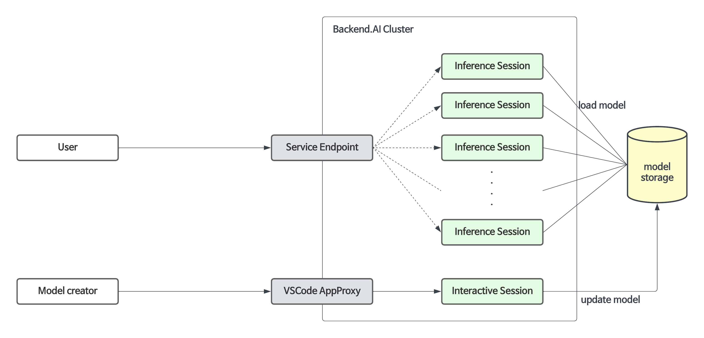

การปรับใช้ขยายความสามารถของเซสชันการคำนวณทั่วไปด้วยการบำรุงรักษาแบบอัตโนมัติ การปรับขนาดของ replica และที่อยู่ endpoint ถาวรซึ่งไม่เปลี่ยนแปลงไม่ว่ามีการเพิ่มหรือลด replica อย่างไรก็ตาม คุณเพียงระบุพารามิเตอร์การปรับขนาดที่ต้องการเท่านั้น Backend.AI จะสร้าง ตรวจสอบ และยุติเซสชัน inference เบื้องหลังให้โดยอัตโนมัติ คุณจึงไม่ต้องจัดการเซสชันเหล่านั้นด้วยตนเอง

## หน้าการปรับใช้

หน้าการปรับใช้แสดงรายการการปรับใช้ทั้งหมดในโปรเจกต์ปัจจุบัน คุณสามารถเข้าถึงได้โดยคลิก **การปรับใช้** ในเมนูด้านข้าง

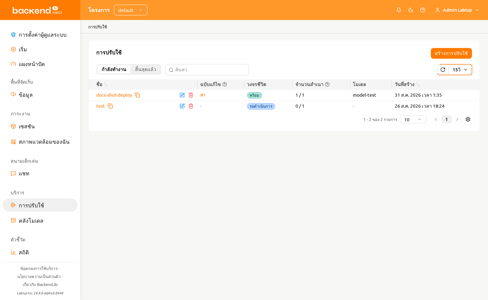
<!-- TODO(screenshot): /deployment (Deployments list) — show the Create Deployment button in the Deployments card header, plus the Active/Destroyed filter and the property filter bar in the body. Not captured 2026-08-30: the capture webserver was unreachable. -->

ที่ด้านบนของหน้า คุณสามารถกรองการปรับใช้ตามขั้นตอนวงจรชีวิต:

- **คล่องแคล่ว**: แสดงการปรับใช้ที่กำลังทำงานหรือกำลังสร้าง นี่คือมุมมองเริ่มต้น
- **ถูกทำลาย**: แสดงการปรับใช้ที่ถูกยุติแล้ว

คุณยังสามารถใช้แถบตัวกรองคุณสมบัติเพื่อค้นหาการปรับใช้ตาม **ชื่อการปรับใช้ (Deployment Name)**, **URL ของ Service Endpoint** หรือ **เจ้าของ** (มีให้สำหรับผู้ดูแลระบบ)

คลิกปุ่ม `สร้างการปรับใช้` เพื่อเปิดหน้าต่าง **สร้างการปรับใช้**

<a id="create-deployment"></a>

## การสร้างการปรับใช้

การสร้างการปรับใช้แบ่งเป็นสองขั้นตอน

1. **สร้างการปรับใช้ (deployment)** — คอนเทนเนอร์น้ำหนักเบาที่กำหนดเฉพาะข้อมูลระบุตัวตนของการปรับใช้ (ชื่อ การมองเห็น เมตาดาตาของการปรับใช้ และ resource group)
2. **เพิ่ม Revision** — snapshot ของการกำหนดค่าที่ระบุสิ่งที่จะรันจริง (start command, environment variables, runtime variant, image, ทรัพยากร และ model storage)

แต่ละการปรับใช้สามารถมี Revision ได้หลายรายการ แต่ในแต่ละช่วงเวลาจะมี Revision *ปัจจุบัน* (Revision ที่ให้บริการ traffic) เพียงรายการเดียว และคุณสามารถสลับระหว่าง Revision ได้จากแท็บ Revisions ในหน้าข้อมูลรายละเอียดการปรับใช้

### หน้าต่างสร้างการปรับใช้

ในหน้าการปรับใช้ ให้คลิกปุ่ม `สร้างการปรับใช้` เพื่อเปิดหน้าต่าง **สร้างการปรับใช้** หน้าต่างนี้รับเฉพาะเมตาดาตาระดับการปรับใช้เท่านั้น และจะยังไม่มีการสร้าง Revision ในขั้นตอนนี้

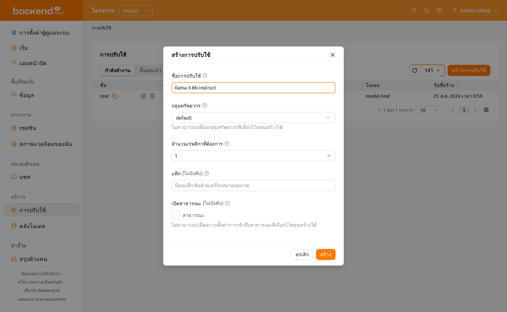

หน้าต่างประกอบด้วยฟิลด์ต่อไปนี้

- **ชื่อการปรับใช้ (Deployment Name)**: ชื่อที่ไม่ซ้ำกันที่ใช้ระบุการปรับใช้ทั้งใน dashboard, API และ URL ของ endpoint
- **กลุ่มทรัพยากร (Resource Group)**: กลุ่มทรัพยากรที่การปรับใช้จะทำงาน หากโปรเจกต์ของคุณมี resource group เพียงกลุ่มเดียว ระบบจะเลือกให้โดยอัตโนมัติและสามารถดำเนินการต่อได้โดยไม่ต้องเลือกเอง
- **จำนวนเรพลิกาที่ต้องการ (Desired Replicas)**: จำนวนเรพลิกาที่ต้องคงไว้ให้ทำงานสำหรับการปรับใช้นี้ ระบบจะปรับขนาดพูลที่ใช้งานอยู่ไปยังเป้าหมายนี้
- **แท็ก (Tags)**: ป้ายกำกับที่ไม่บังคับสำหรับจัดระเบียบและกรองการปรับใช้ กด Enter หรือจุลภาคเพื่อเพิ่ม
- **เปิดสาธารณะ (Open to Public)**: เมื่อเปิดใช้งาน endpoint จะสามารถเข้าถึงได้โดยไม่ต้องใช้ access token เมื่อปิดใช้งาน ทุกคำขอจะต้องแนบ token ดูรายละเอียดที่ [การสร้างโทเค็น](#generating-tokens)

:::warning[กลุ่มทรัพยากรและการเข้าถึงสาธารณะถูกกำหนดตายตัวตั้งแต่ตอนสร้าง]
ตั้งแต่เปิดหน้าต่างขึ้นมา จะมีคำเตือนแสดงอยู่ใต้ฟิลด์ **กลุ่มทรัพยากร** ว่า *"ไม่สามารถเปลี่ยนกลุ่มทรัพยากรที่เลือกไว้ตอนสร้างได้"* และใต้ฟิลด์ **เปิดสาธารณะ** ว่า *"ไม่สามารถเปลี่ยนการตั้งค่าการเข้าถึงสาธารณะที่เลือกไว้ตอนสร้างได้"*

กลุ่มทรัพยากรเป็นสมบัติของการปรับใช้ ไม่ใช่ของ Revision คุณจึงไม่สามารถย้ายการปรับใช้ไปยังกลุ่มทรัพยากรอื่นในภายหลังได้ ไม่ว่าจะด้วยการแก้ไขการปรับใช้หรือการเพิ่ม Revision ใหม่ **เปิดสาธารณะ** ก็ถูกกำหนดตายตัวในลักษณะเดียวกัน โดยในหน้าต่าง **แก้ไขการปรับใช้** ช่องทำเครื่องหมายนี้จะเป็นแบบอ่านอย่างเดียว และมีคำเตือนเดียวกันแสดงอยู่ด้านล่าง กรุณาเลือกค่าทั้งสองให้ถูกต้องก่อนสร้าง หากต้องการค่าอื่น ให้สร้างการปรับใช้ใหม่
:::

คลิก `สร้าง` เพื่อสร้างการปรับใช้ จากนั้นคุณจะถูกพาไปยังหน้าข้อมูลรายละเอียดการปรับใช้ และจะเห็นคำเตือน **ไม่มีการปรับใช้รุ่นแก้ไข** จนกว่าคุณจะเพิ่ม Revision แรก

หากต้องการเปลี่ยนการตั้งค่าระดับการปรับใช้ (ชื่อ, จำนวนเรพลิกาที่ต้องการ, หรือแท็ก) หลังจากสร้างแล้ว ให้คลิกปุ่ม **แก้ไข** บนการ์ดข้อมูลบริการ จากนั้นแก้ไขค่าต่าง ๆ ในหน้าต่าง **แก้ไขการปรับใช้** แล้วบันทึกการเปลี่ยนแปลง กลุ่มทรัพยากรและการตั้งค่า **เปิดสาธารณะ** ไม่สามารถเปลี่ยนแปลงได้ที่นี่ เนื่องจากถูกกำหนดตายตัวตั้งแต่ตอนสร้างตามที่อธิบายไว้ข้างต้น

<a id="add-revision"></a>

### การเพิ่ม Revision

Revision รวบรวมการตั้งค่าที่จำเป็นทั้งหมดสำหรับการรัน inference server ได้แก่ image, start command, ทรัพยากร, การ mount โมเดล และ environment variables จากหน้าข้อมูลรายละเอียดการปรับใช้ ให้คลิก `เพิ่ม Revision` เพื่อเปิดหน้าต่าง

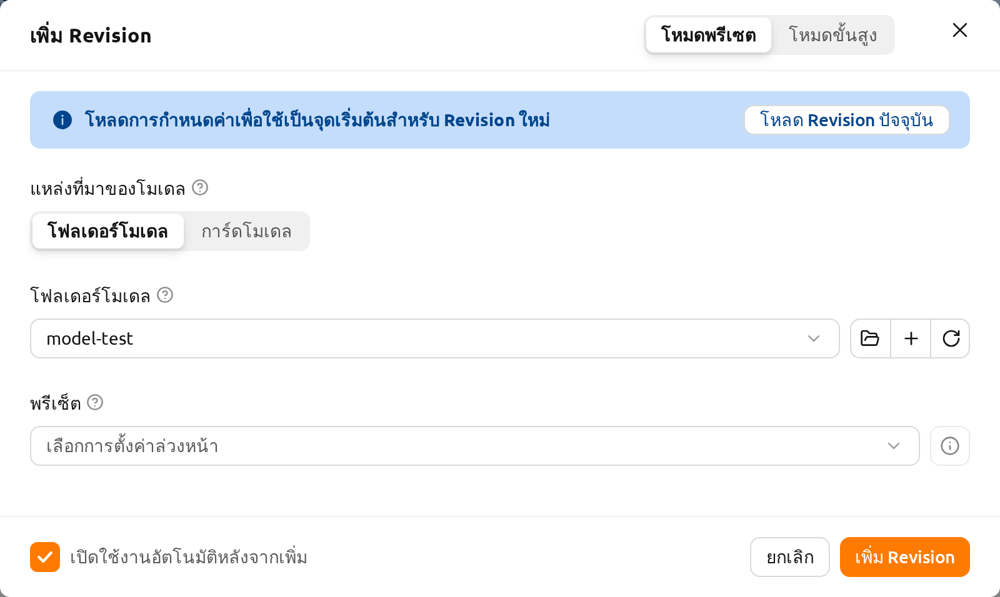

ใช้ตัวสลับ **โหมดพรีเซต** / **โหมดขั้นสูง** ในส่วนหัวของหน้าต่างเพื่อเลือกวิธีกำหนดค่า Revision

เมื่อการปรับใช้มี Revision ปัจจุบันอยู่แล้ว จะมีแบนเนอร์ **โหลด Revision ปัจจุบัน** แสดงอยู่เหนือฟอร์มในทั้งสองโหมด คลิก **โหลด Revision ปัจจุบัน** เพื่อกรอกข้อมูลในฟอร์มล่วงหน้าด้วยการกำหนดค่าของ Revision ปัจจุบันเป็นจุดเริ่มต้น (หน้าต่างจะสลับไปยังโหมดขั้นสูงโดยอัตโนมัติหากจำเป็น) แบนเนอร์นี้จะไม่แสดงเมื่อการปรับใช้ยังไม่มี Revision ปัจจุบัน และจะหายไปเมื่อคุณโหลดการกำหนดค่าแล้ว

#### โหมดพรีเซต

เพิ่ม Revision อย่างรวดเร็วโดยใช้ deployment preset ที่กำหนดไว้ล่วงหน้า

- **แหล่งที่มาของโมเดล**: เลือกว่าโมเดลของ Revision นี้มาจากที่ใด ระหว่าง **โฟลเดอร์โมเดล** หรือ **การ์ดโมเดล** ตัวเลือกด้านล่างจะเปลี่ยนไปตามที่คุณเลือก และการสลับแหล่งที่มาจะล้างการเลือกโมเดลและ preset ที่เลือกไว้ก่อนหน้า
- **โฟลเดอร์โมเดล** *(แหล่งที่มาแบบโฟลเดอร์โมเดล)*: โฟลเดอร์จัดเก็บที่จะเมาต์ในแต่ละ replica
- **การ์ดโมเดล** *(แหล่งที่มาแบบการ์ดโมเดล)*: การ์ดโมเดลที่จะปรับใช้ โฟลเดอร์โมเดลที่รองรับการ์ดนั้นจะถูกเมาต์ในแต่ละ replica และจะแสดงเฉพาะ preset ที่เข้ากันได้กับการ์ดนั้นเท่านั้น คลิกปุ่ม ⓘ ข้างตัวเลือกเพื่อเปิดลิ้นชัก **รายละเอียดการ์ดโมเดล** ของการ์ดที่เลือก
- **พรีเซ็ต**: deployment preset ที่เข้ากันได้กับ resource group ของการปรับใช้ คลิกปุ่ม ⓘ ข้างตัวเลือกเพื่อดูรายละเอียดของ preset เมื่อใช้แหล่งที่มาแบบ **การ์ดโมเดล** ตัวเลือกนี้จะถูกปิดใช้งานพร้อมคำแนะนำ *"โปรดเลือกการ์ดโมเดลก่อน"* จนกว่าคุณจะเลือกการ์ด

หากการ์ดโมเดลที่เลือกไม่มีโฟลเดอร์โมเดลสำหรับเมานต์ ระบบจะไม่สร้าง Revision และจะแสดงข้อความแสดงข้อผิดพลาด *"แหล่งที่มาของโมเดลที่เลือกไม่มีโฟลเดอร์โมเดลสำหรับเมานต์ โปรดเลือกโมเดลการ์ดหรือโฟลเดอร์โมเดลอื่น"* ให้เลือกการ์ดโมเดลอื่น หรือสลับแหล่งที่มากลับไปเป็น **โฟลเดอร์โมเดล**

หากไม่มี preset ที่ใช้ได้กับ resource group ของการปรับใช้ ระบบจะแสดงข้อความแนะนำแทน ให้สลับไปยังโหมดขั้นสูงเพื่อกำหนดค่า Revision ด้วยตนเอง

#### โหมดขั้นสูง

กำหนดค่าทุกการตั้งค่าของ Revision โดยตรง

ฟอร์มประกอบด้วยส่วนต่อไปนี้

- **โมเดลและ Runtime**: เลือกโฟลเดอร์โมเดล ปลายทางการเมาต์ และ runtime variant สำหรับ variant `vLLM` / `SGLang` จะแสดงแผง Runtime Parameters ส่วน variant `Custom` จะแสดงส่วนการกำหนดค่าบริการ ดูรายละเอียดฟิลด์เฉพาะ runtime ได้ที่ส่วนด้านล่าง
- **การตรวจสอบสุขภาพ** และ **การกระทำก่อนเริ่ม**: กำหนดค่าการตรวจสอบสุขภาพและการกระทำที่จะรันก่อนเริ่ม inference server ทั้งสองส่วนใช้ได้กับทุก runtime variant
- **สภาพแวดล้อม**: เลือก container image (สภาพแวดล้อม / เวอร์ชัน) และเพิ่ม environment variables
- **คลัสเตอร์และทรัพยากร**: จัดสรรทรัพยากร CPU, memory และ accelerator
- **การตั้งค่าขั้นสูง** *(ย่อ/ขยายได้)*: กำหนดเส้นทางไฟล์กำหนดโมเดล และเมาต์โฟลเดอร์จัดเก็บเพิ่มเติมนอกเหนือจากโฟลเดอร์โมเดล

ที่ด้านล่างของหน้าต่าง ให้เลือก **เปิดใช้งานอัตโนมัติหลังจากเพิ่ม** เพื่อเปิดใช้งาน Revision ทันทีหลังจากสร้าง หากไม่ได้เลือก Revision จะถูกบันทึกในสถานะไม่ได้ใช้งาน และคุณสามารถนำมาใช้ภายหลังได้จากแท็บ Revisions

### ฟิลด์อ้างอิง Revision: Add Revision

ส่วนย่อยด้านล่างนี้อธิบายฟิลด์ระดับ Revision อย่างละเอียด ซึ่งใช้ได้ทั้งเมื่อเพิ่ม Revision ด้วยตนเองใน **โหมดขั้นสูง** และเมื่อต้องการทำความเข้าใจว่าแต่ละฟิลด์ควบคุมอะไร

#### การเมาต์โฟลเดอร์โมเดล

ทุก Revision จะเมาต์โฟลเดอร์จัดเก็บโมเดลหนึ่งโฟลเดอร์ลงในแต่ละเรพลิกา ฟิลด์ที่อยู่ใต้ตัวเลือกโฟลเดอร์จะกำหนดว่าโฟลเดอร์นั้นจะปรากฏที่ตำแหน่งใดภายในคอนเทนเนอร์

- **โฟลเดอร์โมเดล**: โฟลเดอร์จัดเก็บโมเดลที่จะเมาต์ในแต่ละเรพลิกา
- **ปลายทางการเมาท์สำหรับโฟลเดอร์โมเดล**: เส้นทางภายในคอนเทนเนอร์ที่โฟลเดอร์จัดเก็บโมเดลถูกเมาต์ (ค่าเริ่มต้น: `/models`)
- **พาธย่อย**: โฟลเดอร์ย่อยภายในโฟลเดอร์โมเดลที่จะเมาต์แทนรากของโฟลเดอร์ หากเว้นว่างไว้จะเมาต์รากของโฟลเดอร์

<a id="service-configuration"></a>

#### การกำหนดค่าบริการ (เฉพาะ Custom Runtime)

runtime variant ที่อ่านการตั้งค่าจากโฟลเดอร์โมเดล เช่น variant **Custom** จะแสดงส่วน **การกำหนดค่าบริการ** ใต้ตัวเลือก **Runtime** ส่วนนี้จะขยายไว้เป็นค่าเริ่มต้น และใช้กำหนดวิธีเริ่มต้นกระบวนการของ inference server

- **การรันคำสั่ง**: วิธีการรันคำสั่ง
   * **Shell**: รันคำสั่งผ่าน shell (`bash -c "..."`) จึงสามารถใช้ shell operator ได้ แนะนำสำหรับกรณีทั่วไป
   * **Exec**: รันคำสั่งโดยตรงในรูปแบบอาร์กิวเมนต์ โดยไม่ผ่าน shell ใช้ตัวเลือกนี้เฉพาะเมื่อจำเป็นต้องรันคำสั่งโดยไม่มี shell เช่น อิมเมจที่ไม่มีไบนารีของ shell
- **Shell**: ไบนารีของ shell ที่ใช้รันคำสั่ง (เช่น `/bin/bash`) จะแสดงและจำเป็นต้องกรอกเฉพาะในโหมด **Shell** ไบนารีนี้ต้องมีอยู่ในคอนเทนเนอร์อิมเมจ มิฉะนั้นบริการจะเริ่มต้นไม่สำเร็จ
- **คำสั่ง**: คำสั่งสำหรับเปิดใช้งาน inference server เช่น `python -m http.server 8000` ในโหมด **Shell** ฟิลด์นี้เป็นกล่องข้อความหลายบรรทัด ส่วนในโหมด **Exec** จะเปลี่ยนชื่อเป็น **คำสั่ง (argv)** และเป็นช่องกรอกบรรทัดเดียว
- **พอร์ต**: พอร์ตคอนเทนเนอร์ที่ inference server รับฟัง (2–65535)

:::tip[Shell operator ทำงานเฉพาะในโหมด Shell]
ในโหมด **Shell** คำสั่งจะถูกส่งต่อให้ shell ดังนั้น operator เช่น `;`, `|`, `&&`, `$VAR` และการเปลี่ยนทิศทาง (redirection) จะถูกตีความเหมือนที่ใช้ในเทอร์มินัล:

```bash
chmod +x /setup.sh; vllm serve /models
```

ในโหมด **Exec** ข้อความเดียวกันจะถูกแยกเป็นอาร์กิวเมนต์และรันโดยตรง operator เหล่านั้นจึงถูกส่งผ่านเป็นข้อความธรรมดา ให้คั่นอาร์กิวเมนต์ด้วยช่องว่าง และใส่เครื่องหมายคำพูดสำหรับอาร์กิวเมนต์ที่มีช่องว่าง เช่น `--name "my model"` หากคุณต้องใช้ไวยากรณ์ของ shell ให้เปลี่ยน **การรันคำสั่ง** กลับเป็น **Shell** แทนการครอบคำสั่งด้วย `/bin/bash -c "..."` เอง
:::

<a id="health-check-and-pre-start-actions"></a>

#### การตรวจสอบสุขภาพและการกระทำก่อนเริ่ม

ฟิลด์ **เปิดใช้การตรวจสอบสุขภาพ** และ **การกระทำก่อนเริ่ม** อยู่ถัดจากส่วนการกำหนดค่าบริการ และแสดงสำหรับทุก runtime variant

- **เปิดใช้การตรวจสอบสุขภาพ**: เมื่อเปิดใช้งาน ระบบจะส่งคำขอ HTTP ไปยัง inference server เป็นระยะเพื่อตรวจสอบว่าตอบสนองอย่างถูกต้อง เมื่อปิดใช้งาน (ค่าเริ่มต้นสำหรับ Revision ใหม่) ระบบจะไม่มีการตรวจสอบสุขภาพและ replica ที่ไม่แข็งแรงจะไม่ถูกตรวจพบโดยอัตโนมัติ ควรเปิดใช้งานสำหรับ deployment ที่ใช้งานจริง เมื่อเลือก **เปิดใช้การตรวจสอบสุขภาพ** จะมีฟิลด์เพิ่มเติมดังนี้:
   * **เส้นทาง**: เส้นทาง HTTP endpoint ที่เรียกใช้ระหว่างการตรวจสอบสุขภาพของบริการ (ค่าเริ่มต้น: `/health`)
   * **ช่วงเวลา**: ช่วงเวลาระหว่างการตรวจสอบแต่ละครั้ง (วินาที)
   * **จำนวนลองใหม่สูงสุด**: จำนวนความล้มเหลวต่อเนื่องสูงสุดก่อนที่เรพลิกาจะถูกทำเครื่องหมายเป็น `UNHEALTHY`
   * **เวลารอสูงสุด**: หมดเวลาสำหรับคำขอตรวจสอบสุขภาพแต่ละครั้ง (วินาที)
   * **รหัสสถานะ**: รหัสสถานะ HTTP ที่ระบุว่าบริการทำงานปกติ
   * **ระยะผ่อนผันการเริ่มต้น**: ระยะเวลาผ่อนผันหลังคอนเทนเนอร์เริ่มทำงาน (วินาที) ซึ่งยอมให้การตรวจสอบสุขภาพล้มเหลวได้ เรพลิกาจะทำงานเมื่อตรวจสอบสำเร็จครั้งแรก ควรเพิ่มค่านี้สำหรับโมเดลขนาดใหญ่ที่ใช้เวลาโหลดนาน
- **การกระทำก่อนเริ่ม**: การกระทำที่จะรันก่อนเริ่มบริการโมเดล คลิก **เพิ่มการกระทำก่อนเริ่ม** เพื่อเพิ่มแถว จากนั้นกรอก **การกระทำ** (ชื่อของการกระทำ เช่น `wait_for_file`) และ **อาร์กิวเมนต์ (JSON)** (อาร์กิวเมนต์ในรูปแบบอ็อบเจกต์ JSON เช่น `{}`) ทั้งสองฟิลด์จำเป็นต้องกรอกในทุกแถว และอาร์กิวเมนต์ต้องเป็น JSON ที่ถูกต้อง ดูรายการการกระทำที่รองรับได้ที่ [คำอธิบายการกระทำของบริการที่รองรับใน Backend.AI Model Serving](#prestart-actions)

เส้นทางของไฟล์กำหนดโมเดลอยู่ในแผง **การตั้งค่าขั้นสูง** ที่ด้านล่างของฟอร์ม สำหรับคำแนะนำในการสร้างไฟล์ดังกล่าว ดูที่ [การสร้างไฟล์กำหนดโมเดล](#model-definition-guide)

<a id="runtime-parameters"></a>

#### พารามิเตอร์ Runtime (vLLM / SGLang)

เมื่อคุณเลือก runtime variant `vLLM` หรือ `SGLang` ส่วน **พารามิเตอร์ Runtime** จะปรากฏขึ้นแทนส่วนการกำหนดค่าบริการ ส่วนนี้ช่วยให้คุณกำหนดค่า serving framework โดยไม่ต้องแก้ไขไฟล์การกำหนดค่าด้วยตนเอง

พารามิเตอร์ถูกจัดเป็นหมวดหมู่ที่แยกตามแท็บ รายการแท็บที่มีจะแตกต่างกันตาม runtime variant

:::note
พารามิเตอร์ที่ไม่เปลี่ยนแปลงจะใช้ค่าเริ่มต้นของ runtime
:::

:::note[พารามิเตอร์ที่จำเป็น]
ผู้ดูแลระบบสามารถกำหนดให้พารามิเตอร์แต่ละตัวเป็นแบบจำเป็น พารามิเตอร์ที่จำเป็นจะแสดงด้วยเครื่องหมายดอกจัน (★) สีแดงถัดจากป้ายกำกับ การส่งฟอร์มโดยมีพารามิเตอร์ที่จำเป็นว่างเปล่าจะถูกปิดกั้น — ฟิลด์จะแสดงข้อผิดพลาดการตรวจสอบแม้ว่าพารามิเตอร์นั้นจะอยู่ในแท็บที่ยังไม่ได้เยี่ยมชม
:::

**เปิดใช้การตรวจสอบสุขภาพ**

ฟิลด์ **เปิดใช้การตรวจสอบสุขภาพ** และ **การกระทำก่อนเริ่ม** อยู่ใต้ส่วนพารามิเตอร์ Runtime และทำงานเหมือนกับที่อธิบายไว้ใน [การตรวจสอบสุขภาพและการกระทำก่อนเริ่ม](#health-check-and-pre-start-actions) โดยแสดงสำหรับ `vLLM` และ `SGLang` เช่นเดียวกับ variant `Custom`

**พารามิเตอร์ Runtime ของ vLLM**

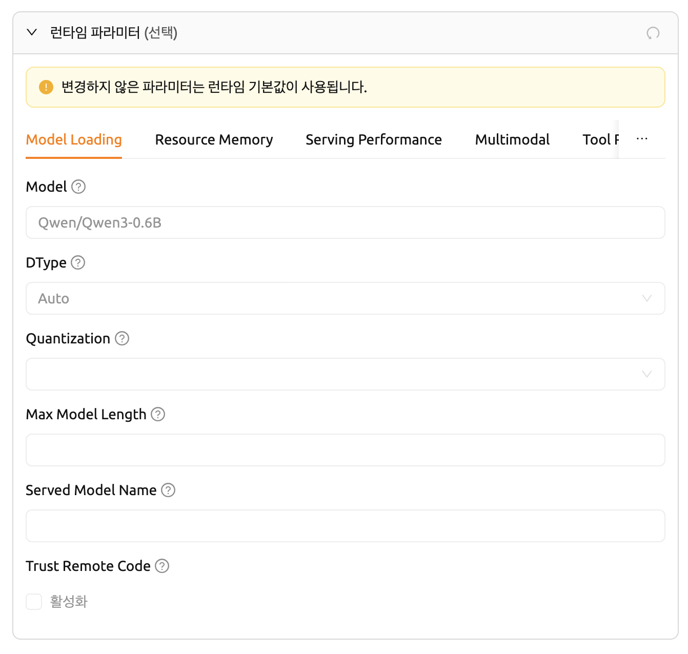

vLLM มีแท็บพารามิเตอร์ดังต่อไปนี้: **Model Loading**, **Resource Memory**, **Serving Performance**, **Multimodal**, **Tool Reasoning** และอื่น ๆ

ฟิลด์หลักในแท็บ **Model Loading**:

- **Model**: ชื่อหรือเส้นทางของโมเดลที่จะใช้
- **DType**: ประเภทข้อมูลสำหรับน้ำหนักโมเดลและการคำนวณ (เช่น `Auto`, `float16`, `bfloat16`)
- **Quantization**: วิธีการ quantization ของโมเดล (เช่น `awq`, `gptq`, `fp8`)
- **Max Model Length**: ความยาวบริบทสูงสุด (จำนวน token) ที่โมเดลสามารถประมวลผลได้
- **Served Model Name**: ชื่อโมเดลที่เปิดเผยบน API endpoint
- **Trust Remote Code**: อนุญาตให้รันโค้ดโมเดลที่กำหนดเองจากคลังโมเดล

**พารามิเตอร์ Runtime ของ SGLang**

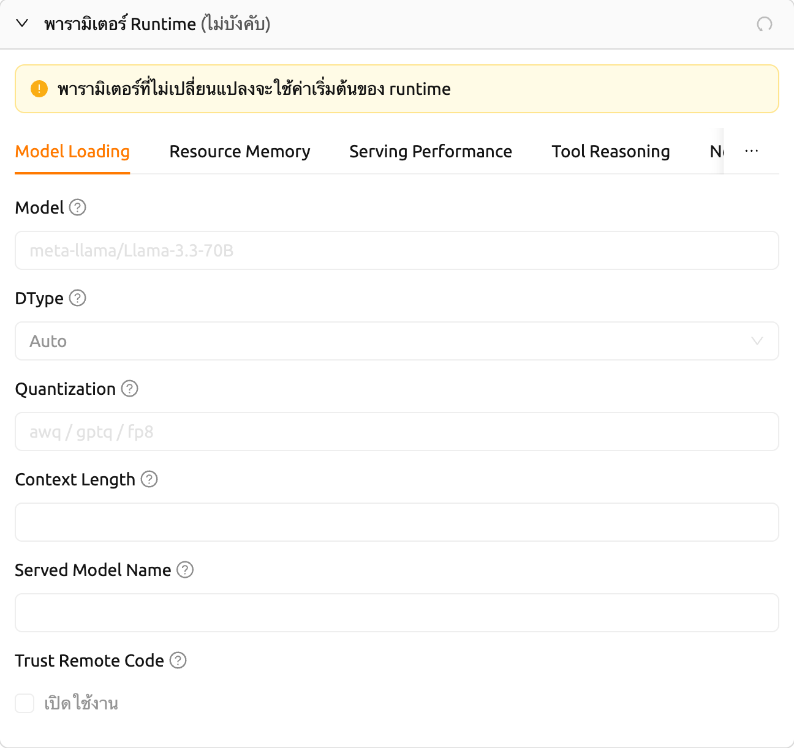

SGLang มีแท็บพารามิเตอร์ดังต่อไปนี้: **Model Loading**, **Resource Memory**, **Serving Performance**, **Tool Reasoning** และอื่น ๆ

ฟิลด์หลักในแท็บ **Model Loading**:

- **Model**: ชื่อหรือเส้นทางของโมเดลที่จะใช้
- **DType**: ประเภทข้อมูลสำหรับน้ำหนักโมเดลและการคำนวณ (เช่น `Auto`, `float16`, `bfloat16`)
- **Quantization**: วิธีการ quantization ของโมเดล (เช่น `awq`, `gptq`, `fp8`)
- **Context Length**: ความยาวบริบทสูงสุดที่โมเดลสามารถประมวลผลได้
- **Served Model Name**: ชื่อโมเดลที่เปิดเผยบน API endpoint
- **Trust Remote Code**: อนุญาตให้รันโค้ดโมเดลที่กำหนดเองจากคลังโมเดล

runtime variant `vLLM` และ `SGLang` จะกรอกตัวแปรสภาพแวดล้อมต่อไปนี้ล่วงหน้าในส่วน **สภาพแวดล้อม**:

- **vLLM**: `BACKEND_MODEL_NAME`, `VLLM_QUANTIZATION`, `VLLM_TP_SIZE` (tensor parallelism), `VLLM_PP_SIZE` (pipeline parallelism), `VLLM_EXTRA_ARGS` (อาร์กิวเมนต์ CLI เพิ่มเติม)
- **SGLang**: `BACKEND_MODEL_NAME`, `SGLANG_QUANTIZATION`, `SGLANG_TP_SIZE` (tensor parallelism), `SGLANG_PP_SIZE` (pipeline parallelism), `SGLANG_EXTRA_ARGS` (อาร์กิวเมนต์ CLI เพิ่มเติม)

#### สภาพแวดล้อม

ส่วน **สภาพแวดล้อม** มีอยู่สำหรับ runtime variant ทั้งหมด

- **สภาพแวดล้อม / เวอร์ชัน**: container image ที่ใช้สำหรับ inference server เมื่อเลือก runtime variant รายการจะถูกกรองให้เหลือเฉพาะ image ที่เข้ากันได้กับ runtime นั้น
- **ชื่ออิมเมจ (กำหนดเอง)**: ช่องสำหรับพิมพ์ข้อมูลอ้างอิงอิมเมจโดยตรง จะแสดงเฉพาะเมื่อผู้ดูแลระบบเปิดใช้งานการป้อนชื่ออิมเมจด้วยตนเองบนเซิร์ฟเวอร์ การพิมพ์ในช่องนี้จะล้างการเลือกใน **สภาพแวดล้อม / เวอร์ชัน** และในทางกลับกันเช่นกัน ทั้งสองเป็นวิธีเลือกอิมเมจเดียวกันในรูปแบบที่ต่างกัน
- **ตัวแปรสภาพแวดล้อม**: คู่ key/value ที่จะถูกส่งให้คอนเทนเนอร์ของ inference server สำหรับ `vLLM` และ `SGLang` ตัวแปรเฉพาะ runtime ที่ระบุไว้ข้างต้นจะถูกกรอกไว้ล่วงหน้า คุณสามารถเพิ่ม แก้ไข หรือลบรายการได้อย่างอิสระ เมื่อพิมพ์ชื่อตัวแปร ระบบจะแนะนำชื่อตัวแปรสภาพแวดล้อมที่ใช้บ่อย ได้แก่ `HF_TOKEN`, `WANDB_API_KEY`, `AWS_ACCESS_KEY_ID`, `AWS_SECRET_ACCESS_KEY`, `AWS_DEFAULT_REGION`, `HTTP_PROXY`, `HTTPS_PROXY` และ `NO_PROXY` ควบคู่ไปกับตัวแปรที่ runtime variant ที่เลือกกำหนดไว้ ชื่อที่ถูกใช้ไปแล้วในแถวอื่นจะไม่แสดงในรายการ และเมื่อกำหนดชื่อที่ระบบรู้จักแล้ว ช่องค่าจะแสดงคำใบ้ที่ตรงกัน เช่น *"โทเค็นการเข้าถึง Hugging Face ของคุณ"* สำหรับ `HF_TOKEN`

##### การป้อนชื่ออิมเมจด้วยตนเอง

เมื่อคุณพิมพ์ใน **ชื่ออิมเมจ (กำหนดเอง)** แทนการเลือกจากรายการ ระบบจะนำข้อมูลอ้างอิงที่คุณป้อนไปเทียบกับอิมเมจที่ลงทะเบียนไว้บนเซิร์ฟเวอร์ในตอนที่ส่งฟอร์ม แล้วสร้าง Revision จากอิมเมจที่ตรงกัน

- ป้อนข้อมูลอ้างอิงในรูปแบบเดียวกับที่ registry ใช้ เช่น `cr.backend.ai/stable/python:3.10-ubuntu20.04`
- คุณสามารถต่อท้ายด้วย `@` และชื่อสถาปัตยกรรมเพื่อระบุสถาปัตยกรรมที่ต้องการ เช่น `cr.backend.ai/stable/python:3.10-ubuntu20.04@aarch64` หากไม่ระบุ ระบบจะใช้สถาปัตยกรรมเริ่มต้นของ manager

หากไม่มีอิมเมจที่ลงทะเบียนไว้ตรงกับที่คุณพิมพ์ ระบบจะ**ไม่**สร้าง Revision และจะแสดงข้อความผิดพลาดที่ฟิลด์นั้นว่า *"ไม่พบอิมเมจที่ป้อนด้วยตนเอง กรุณาป้อนข้อมูลอ้างอิงอิมเมจที่ลงทะเบียนไว้ หรือเลือกจากรายการ"* พร้อมเลื่อนหน้าจอไปยังฟิลด์ดังกล่าว ให้แก้ไขข้อมูลอ้างอิง หรือล้างฟิลด์แล้วเลือกอิมเมจจาก **สภาพแวดล้อม / เวอร์ชัน** แทน

   เนื่องจากการค้นหาอิมเมจเกิดขึ้นตอนส่งฟอร์ม ข้อความผิดพลาดจึงปรากฏหลังจากคลิกปุ่มยืนยัน ไม่ใช่ระหว่างที่คุณพิมพ์

#### คลัสเตอร์และทรัพยากร

ส่วน **คลัสเตอร์และทรัพยากร** ช่วยให้คุณระบุทรัพยากรการประมวลผลที่จะจัดสรรให้แต่ละเรพลิกา

- **Resource Preset**: ชุดการจัดสรร CPU, หน่วยความจำ และ accelerator ที่กำหนดไว้ล่วงหน้า รายการ preset ที่มีจะถูกกรองตาม resource group ของการปรับใช้ คุณยังสามารถกำหนดค่าทรัพยากร (CPU, หน่วยความจำ, GPU) ด้วยตนเองโดยไม่ต้องเลือก preset

#### การตั้งค่าขั้นสูง

ขยายแผง **การตั้งค่าขั้นสูง** เพื่อระบุไฟล์กำหนดโมเดล และเมาต์โฟลเดอร์จัดเก็บเพิ่มเติมควบคู่กับโฟลเดอร์จัดเก็บโมเดล

- **เส้นทางไฟล์นิยามโมเดล**: เส้นทางไปยังไฟล์กำหนดโมเดลภายในโฟลเดอร์จัดเก็บโมเดล (ค่าเริ่มต้น: `model-definition.yaml`) แสดงเฉพาะ runtime variant ที่อ่านการตั้งค่าจากโฟลเดอร์โมเดล เช่น `Custom`
- **เมาต์เพิ่มเติม**: รายการโฟลเดอร์จัดเก็บที่จะเมาต์ลงในคอนเทนเนอร์ inference server สามารถเลือกได้เฉพาะโฟลเดอร์ทั่วไป (ไม่ใช่โมเดล) ที่อยู่ในสถานะพร้อมใช้งาน (`ready`) โฟลเดอร์ที่ซ่อนอยู่ (ชื่อขึ้นต้นด้วย `.`) และโฟลเดอร์จัดเก็บโมเดลหลักจะถูกยกเว้น

<a id="custom-runtime-config-files"></a>

### ไฟล์การกำหนดค่าสำหรับ Custom Runtime

<a id="model-definition-guide"></a>

#### การสร้างไฟล์กำหนดโมเดล

:::note
คุณสามารถกำหนดชื่อไฟล์กำหนดโมเดลได้ หากคุณไม่ได้
ป้อนฟิลด์อื่นใดในเส้นทางไฟล์กำหนดโมเดล ระบบจะถือว่าเป็น `model-definition.yml`
หรือ `model-definition.yaml`
:::

ไฟล์กำหนดโมเดลประกอบด้วยข้อมูลการกำหนดค่าที่ระบบ Backend.AI ต้องการเพื่อเริ่มต้น เตรียมการ และปรับขนาดเซสชัน inference โดยอัตโนมัติ ไฟล์นี้ถูกจัดเก็บในโฟลเดอร์ประเภทโมเดลแยกต่างหากจากอิมเมจคอนเทนเนอร์ที่มีเอนจิน inference ซึ่งช่วยให้เอนจินสามารถให้บริการโมเดลที่แตกต่างกันตามความต้องการเฉพาะ และไม่จำเป็นต้องสร้างและ deploy อิมเมจคอนเทนเนอร์ใหม่ทุกครั้งที่โมเดลเปลี่ยน โดยการโหลดการกำหนดโมเดลและข้อมูลโมเดลจากที่จัดเก็บบนเครือข่าย กระบวนการ deploy สามารถทำได้ง่ายและเหมาะสมยิ่งขึ้นระหว่างการปรับขนาดอัตโนมัติ

ไฟล์กำหนดโมเดลมีรูปแบบดังนี้:

```yaml
models:
  - name: "simple-http-server"
    model_path: "/models"
    service:
      start_command:
        - python
        - -m
        - http.server
        - --directory
        - /home/work
        - "8000"
      port: 8000
      health_check:
        path: /
        interval: 10.0
        max_retries: 10
        max_wait_time: 15.0
        expected_status_code: 200
        initial_delay: 60.0
```

**คำอธิบายคู่คีย์-ค่า สำหรับไฟล์กำหนดโมเดล**

:::note
ฟิลด์ที่ไม่มีเครื่องหมาย "(จำเป็น)" เป็นตัวเลือก
:::

- `name` (จำเป็น): กำหนดชื่อของโมเดล
- `model_path` (จำเป็น): ระบุเส้นทางที่โมเดลถูกกำหนด
- `service`: รายการสำหรับจัดระเบียบข้อมูลเกี่ยวกับไฟล์ที่จะให้บริการ
  (รวมถึงสคริปต์คำสั่งและโค้ด)

   - `pre_start_actions`: การดำเนินการที่จะดำเนินการก่อน `start_command` การดำเนินการเหล่านี้
     เตรียมสภาพแวดล้อมโดยการสร้างไฟล์การกำหนดค่า การตั้งค่าไดเรกทอรี หรือ
     การรันสคริปต์เริ่มต้น การดำเนินการจะถูกดำเนินการตามลำดับที่กำหนด

      - `action`: ประเภทของการดำเนินการที่จะดำเนินการ ดูข้อมูลประเภทการดำเนินการที่มีและพารามิเตอร์ได้ที่
        [การดำเนินการก่อนเริ่ม](#prestart-actions)
      - `args`: พารามิเตอร์เฉพาะการดำเนินการ แต่ละประเภทการดำเนินการมีอาร์กิวเมนต์ที่จำเป็นต่างกัน

   - `start_command` (จำเป็น): ระบุคำสั่งที่จะดำเนินการในการให้บริการโมเดล
     สามารถเป็นสตริงหรือรายการสตริง
   - `port` (จำเป็น): พอร์ตคอนเทนเนอร์สำหรับบริการโมเดล (เช่น `8000`, `8080`)
   - `health_check`: การกำหนดค่าสำหรับการตรวจสอบสุขภาพของบริการโมเดลเป็นระยะ
     เมื่อได้รับการกำหนดค่าแล้ว ระบบจะตรวจสอบโดยอัตโนมัติว่าบริการตอบสนองอย่างถูกต้อง
     และลบอินสแตนซ์ที่ไม่สมบูรณ์ออกจากการเส้นทางการรับส่งข้อมูล

      - `path` (จำเป็น): เส้นทาง HTTP endpoint สำหรับคำขอตรวจสอบสุขภาพ (เช่น `/health`, `/v1/health`)
      - `interval` (ค่าเริ่มต้น: `10.0`): เวลาเป็นวินาทีระหว่างการตรวจสอบสุขภาพต่อเนื่อง
      - `max_retries` (ค่าเริ่มต้น: `10`): จำนวนความล้มเหลวต่อเนื่องที่อนุญาตก่อนที่จะทำเครื่องหมาย
        บริการเป็น `UNHEALTHY` บริการจะยังคงรับการรับส่งข้อมูลจนกว่าจะเกินเกณฑ์นี้
      - `max_wait_time` (ค่าเริ่มต้น: `15.0`): เวลาหมดเวลาเป็นวินาทีสำหรับแต่ละคำขอ HTTP ตรวจสอบสุขภาพ
        หากไม่ได้รับการตอบกลับภายในเวลานี้ การตรวจสอบจะถือว่าล้มเหลว
      - `expected_status_code` (ค่าเริ่มต้น: `200`): รหัสสถานะ HTTP ที่บ่งชี้ว่าการตอบกลับมีสุขภาพดี
        ค่าทั่วไป: `200` (OK), `204` (No Content)
      - `initial_delay` (ค่าเริ่มต้น: `60.0`): เวลาเป็นวินาทีที่รอหลังจากสร้างคอนเทนเนอร์
        ก่อนที่จะเริ่มการตรวจสอบสุขภาพ สิ่งนี้ให้เวลาสำหรับการโหลดโมเดล การเตรียม GPU
        และการอุ่นเครื่องบริการ ตั้งค่าที่สูงขึ้นสำหรับโมเดลขนาดใหญ่ (เช่น `300.0` สำหรับ LLMs 70B+)

**ความเข้าใจพฤติกรรมการตรวจสอบสุขภาพ**

ระบบการตรวจสอบสุขภาพจะตรวจสอบคอนเทนเนอร์บริการโมเดลแต่ละตัวและจัดการการเส้นทางการรับส่งข้อมูลโดยอัตโนมัติตามสถานะสุขภาพ

**① AppProxy: การควบคุมการกำหนดเส้นทาง Traffic**

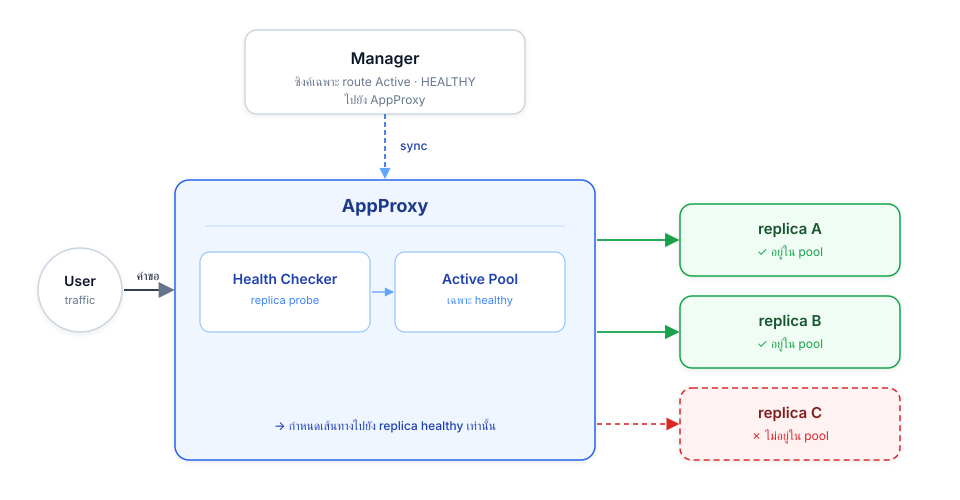

**② Manager: การจัดการสถานะสุขภาพและ Eviction**

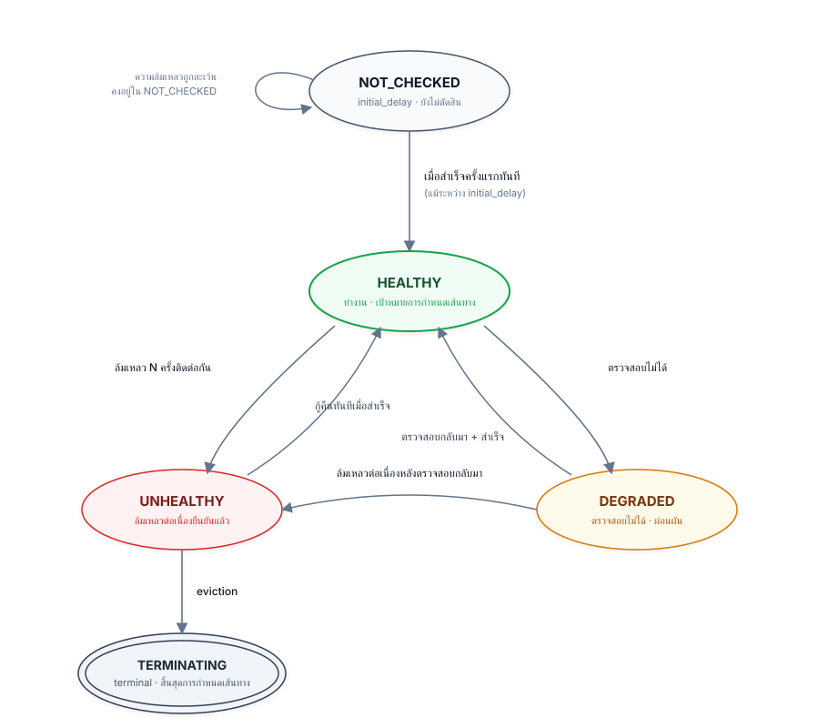

:::note
สถานะสุขภาพภายใน (ใช้สำหรับการเส้นทางการรับส่งข้อมูล) อาจไม่ถูก
ซิงโครไนซ์ทันทีกับสถานะที่แสดงในส่วนติดต่อผู้ใช้
:::

**เวลาจนถึง UNHEALTHY**:

- การเริ่มต้นครั้งแรก: `initial_delay + interval × (max_retries + 1)`

  ตัวอย่างกับค่าเริ่มต้น: 60 + 10 × 11 = **170 วินาที** (ประมาณ 3 นาที)

- ระหว่างการทำงาน (หลังจากสุขภาพดีแล้ว): `interval × (max_retries + 1)`

  ตัวอย่างกับค่าเริ่มต้น: 10 × 11 = **110 วินาที** (ประมาณ 2 นาที)

<a id="prestart-actions"></a>

**คำอธิบายการดำเนินการบริการที่รองรับใน Backend.AI การให้บริการโมเดล**

- `write_file`: การดำเนินการเพื่อสร้างไฟล์ด้วยชื่อไฟล์ที่กำหนดและเพิ่มเนื้อหา
  สิทธิ์การเข้าถึงเริ่มต้นคือ `644`

   - `arg/filename`: ระบุชื่อไฟล์
   - `body`: ระบุเนื้อหาที่จะเพิ่มลงในไฟล์
   - `mode`: ระบุสิทธิ์การเข้าถึงไฟล์
   - `append`: ตั้งค่าว่าจะเขียนทับหรือผนวกเนื้อหาลงในไฟล์เป็น `True` หรือ `False`

- `write_tempfile`: การดำเนินการเพื่อสร้างไฟล์ด้วยชื่อไฟล์ชั่วคราว (`.py`) และผนวกเนื้อหา
  หากไม่ได้ระบุค่าสำหรับ mode สิทธิ์การเข้าถึงเริ่มต้นจะเป็น `644`

   - `body`: ระบุเนื้อหาที่จะเพิ่มลงในไฟล์
   - `mode`: ระบุสิทธิ์การเข้าถึงไฟล์

- `run_command`: ผลลัพธ์จากการดำเนินการคำสั่ง รวมถึงข้อผิดพลาดใดๆ จะถูกส่งกลับในรูปแบบต่อไปนี้
  (`out`: ผลลัพธ์จากการดำเนินการคำสั่ง, `err`: ข้อความแสดงข้อผิดพลาดหากเกิดข้อผิดพลาดระหว่างการดำเนินการ)

   - `args/command`: ระบุคำสั่งที่จะดำเนินการเป็นอาร์เรย์ (เช่น คำสั่ง `python3 -m http.server 8080` กลายเป็น ["python3", "-m", "http.server", "8080"])

- `mkdir`: การดำเนินการเพื่อสร้างไดเรกทอรีตามเส้นทางที่ระบุ

   - `args/path`: ระบุเส้นทางเพื่อสร้างไดเรกทอรี

- `log`: การดำเนินการเพื่อพิมพ์ล็อกตามข้อความที่ระบุ

   - `args/message`: ระบุข้อความที่จะแสดงในล็อก
   - `debug`: ตั้งค่าเป็น `True` หากอยู่ในโหมดดีบัก มิฉะนั้นตั้งค่าเป็น `False`

#### การอัปโหลดไฟล์กำหนดโมเดลไปยังโฟลเดอร์ประเภทโมเดล

เพื่ออัปโหลดไฟล์กำหนดโมเดล (`model-definition.yml`) ไปยังโฟลเดอร์ประเภทโมเดล คุณต้องสร้างโฟลเดอร์เสมือน เมื่อสร้างโฟลเดอร์เสมือน ให้เลือกประเภท `model` แทนประเภท `general` เริ่มต้น โปรดดูส่วน [การสร้างโฟลเดอร์จัดเก็บ](#create-storage-folder) ในหน้า Data สำหรับคำแนะนำเกี่ยวกับวิธีสร้างโฟลเดอร์

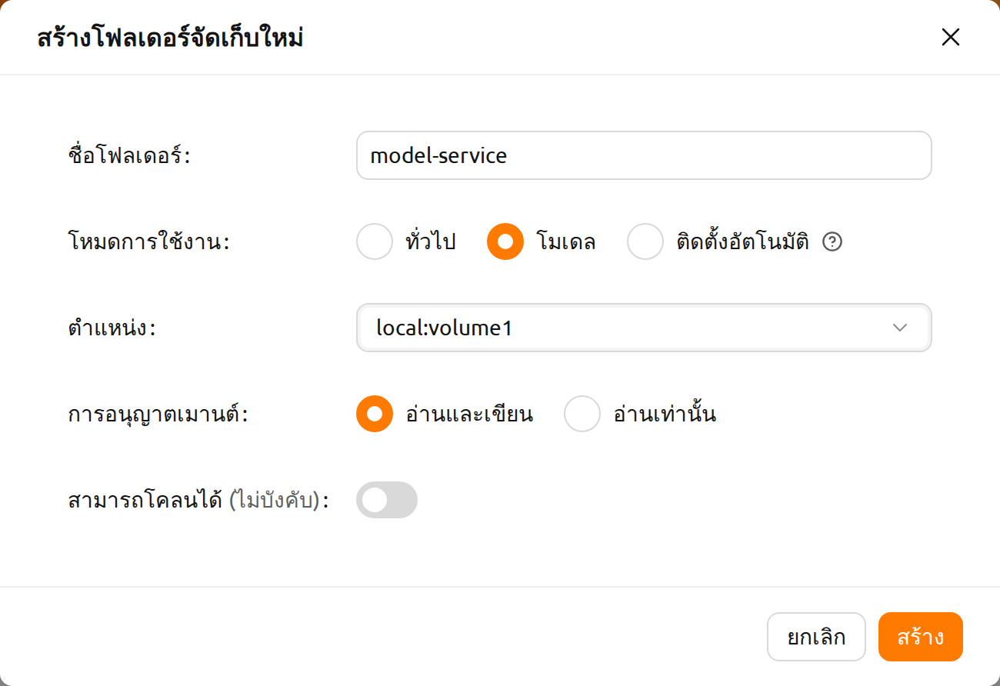

หลังจากสร้างโฟลเดอร์แล้ว ให้เลือกแท็บ 'MODELS' ในหน้า Data คลิกไอคอนโฟลเดอร์ประเภทโมเดลที่สร้างขึ้นล่าสุดเพื่อเปิดตัวสำรวจโฟลเดอร์ และอัปโหลดไฟล์กำหนดโมเดล สำหรับข้อมูลเพิ่มเติมเกี่ยวกับวิธีใช้ตัวสำรวจโฟลเดอร์ โปรดดูส่วน [สำรวจโฟลเดอร์](#explore-folder)

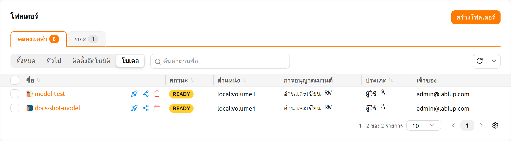

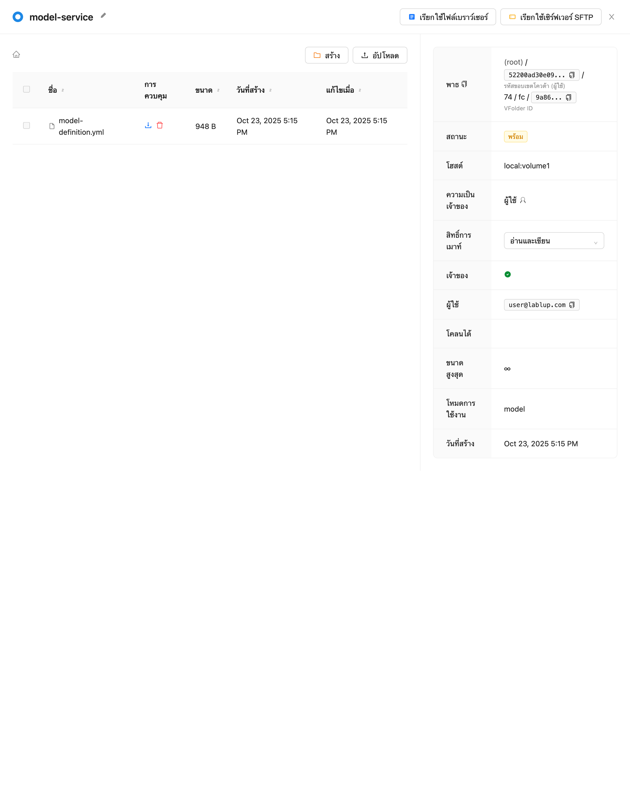

<a id="service-definition-file"></a>

#### การกำหนดค่าล่วงหน้าสำหรับ Deployment (`deployment-config.yaml`)

คุณสามารถวางไฟล์ `deployment-config.yaml` ในโฟลเดอร์โมเดลเพื่อกำหนดค่าล่วงหน้าสำหรับทรัพยากร สภาพแวดล้อม และการตั้งค่า runtime ที่ใช้เมื่อสร้าง deployment จากโมเดลนั้น เมื่อไฟล์มีอยู่ ค่าต่างๆ จะถูกใช้เป็น **ค่าเริ่มต้น** สิ่งใดก็ตามที่คุณตั้งค่าเมื่อสร้าง deployment (ในฟอร์ม Add Revision หรือคำขอ API) จะแทนที่ค่าเหล่านั้น

:::note
ไฟล์ `service-definition.toml` (รูปแบบ TOML) ในโฟลเดอร์เดียวกันยังคงถูกอ่านเป็นทางเลือกสำรอง แต่เป็น **deprecated** — ให้ใช้ `deployment-config.yaml` สำหรับโฟลเดอร์โมเดลของคุณ
:::

`deployment-config.yaml` เป็น **ตัวเลือก** และไม่ขัดขวาง deployment คุณสามารถ deploy โมเดลได้ไม่ว่าไฟล์จะมีอยู่หรือไม่ — ไฟล์ที่หายไปหรือมีรูปแบบผิดจะถูกข้ามไป เมื่อใช้ร่วมกับ `model-definition.yaml` ที่เป็นตัวเลือก (ซึ่งอธิบายโมเดลและเซิร์ฟเวอร์ inference) จะช่วยให้ผู้ดูแลระบบสามารถส่งค่าเริ่มต้นที่สมเหตุสมผลไปพร้อมกับโมเดลได้

ค่าต่างๆ ถูกแก้ไขผ่าน **ลำดับชั้นการแทนที่สามระดับ** จากความสำคัญต่ำสุดถึงสูงสุด

1. **ค่าเริ่มต้นระดับราก** — ใช้กับทุก runtime variant
2. **ส่วนของ runtime-variant** (ตัวอย่างเช่น `vllm`, `sglang`, `tgi`) — แทนที่เฉพาะช่องสำหรับ variant นั้นเท่านั้น
3. **การป้อนข้อมูลเมื่อ deployment** (ฟอร์ม Add Revision / คำขอ API) — แทนที่ทุกสิ่ง

```yaml title="deployment-config.yaml"
# Root level — defaults for all runtime variants
environment:
  image: "example.com/model-server:latest"
  architecture: "x86_64"

resource_slots:
  cpu: 4
  mem: "16gb"
  "cuda.shares": "0.5"

environ:
  MODEL_NAME: "example-model-name"

resource_opts:
  shmem: "8g"

# vLLM variant — overrides only the listed fields
vllm:
  environment:
    image: "vllm-optimized:0.4.0"
  resource_slots:
    cpu: 8
    "cuda.device": 2
```

**ข้อมูลอ้างอิงช่อง**

- `environment`: อิมเมจคอนเทนเนอร์และสถาปัตยกรรมสำหรับบริการ inference
   - `image`: เส้นทางแบบเต็มของอิมเมจคอนเทนเนอร์ (เช่น `example.com/model-server:latest`)
   - `architecture`: สถาปัตยกรรม CPU ของอิมเมจ (เช่น `x86_64`, `aarch64`)
- `resource_slots`: ทรัพยากรการคำนวณที่จัดสรรให้กับแต่ละ replica
   - `cpu`: จำนวนแกน CPU (เช่น `4`, `8`)
   - `mem`: จำนวนหน่วยความจำพร้อมคำนำหน้าหน่วย (เช่น `"16gb"`)
   - `"cuda.shares"` / `"cuda.device"`: การจัดสรร GPU แบบเศษส่วนหรือทั้งหมด ใส่เครื่องหมายคำพูดสำหรับคีย์ที่มีจุด
- `environ`: ตัวแปรสภาพแวดล้อมที่ส่งไปยังคอนเทนเนอร์บริการ inference ค่า root และ variant จะถูกรวมเข้าด้วยกัน
- `resource_opts`: ตัวเลือกทรัพยากรเพิ่มเติมเช่น `shmem` (ขนาดหน่วยความจำที่แชร์)

:::note
สำหรับการ deploy vLLM ค่าเริ่มต้นระดับรากจะถูกรวมเข้ากับส่วน `vllm` (ช่องของ variant ชนะ) และการป้อนข้อมูลเมื่อ deployment ของคุณจะแทนที่ทั้งสองอย่าง เฉพาะช่องที่ระบุในส่วน variant เท่านั้นที่ถูกแทนที่ สิ่งอื่นๆ ทั้งหมดจะกลับไปยังระดับรากเสมอ
:::

<a id="quick-deploy"></a>

## การปรับใช้อย่างรวดเร็ว

การปรับใช้อย่างรวดเร็วแบบอิงพรีเซตช่วยให้คุณสร้างการปรับใช้ได้โดยไม่ต้องใช้ไฟล์กำหนดค่าแยกต่างหาก คุณสามารถเริ่มการปรับใช้อย่างรวดเร็วได้จากสองจุดเริ่มต้น:

- เรียกดูการ์ดโมเดลที่กำหนดค่าไว้ล่วงหน้าใน [คลังโมเดล](#model-store) และคลิกปุ่ม `Deploy` เพื่อ deploy ทันทีโดยใช้พรีเซต
- ในแท็บ **โมเดล** ของหน้า Data ให้คลิกปุ่ม `ปรับใช้เป็นบริการ` ของโฟลเดอร์โมเดลเพื่อเปิดหน้าต่าง **สร้าง Deployment ใหม่ด้วย Preset** จากนั้นเลือกพรีเซตและกลุ่มทรัพยากรเพื่อ deploy โดยไม่ต้องตั้งค่าเพิ่มเติม

สำหรับขั้นตอนการ deploy โมเดลทั้งหมด ดูที่ส่วน [คลังโมเดล](#model-store)

<a id="deployment-detail-page"></a>

## หน้าข้อมูลรายละเอียดการปรับใช้

คลิกชื่อการปรับใช้ในรายการการปรับใช้เพื่อดูข้อมูลรายละเอียดเกี่ยวกับการปรับใช้

### การแจ้งเตือนของการปรับใช้

หน้าข้อมูลรายละเอียดการปรับใช้แสดงแบนเนอร์แจ้งเตือนตามบริบทที่ด้านบนของหน้า ขึ้นอยู่กับสถานะปัจจุบันของการปรับใช้

- **การปรับใช้พร้อมแล้ว**: แสดงเมื่อการปรับใช้มีสถานะ `HEALTHY` แบนเนอร์นี้มีปุ่ม **ทดสอบในแชท** เป็นทางลัดไปยังอินเทอร์เฟซ LLM Chat Test เพื่อให้คุณทดสอบโมเดลได้โดยไม่ต้องออกจากหน้า
- **การปรับใช้แบบส่วนตัว — ใช้โทเค็นการเข้าถึงเพื่อเข้าถึงปลายทาง**: แสดงเมื่อ **เปิดสาธารณะ** ถูกปิดใช้งาน, มีการออก URL ของ endpoint แล้ว และการปรับใช้ยังไม่มีโทเค็นการเข้าถึงเลย แบนเนอร์นี้มีปุ่ม **เพิ่มโทเค็นการเข้าถึง** ที่เปิดหน้าต่างสร้างโทเค็นการเข้าถึงได้ทันที และแบนเนอร์จะหายไปเมื่อคุณสร้างโทเค็นแรกแล้ว ดูรายละเอียดที่ [การสร้างโทเค็น](#generating-tokens)
- **ไม่มีการปรับใช้รุ่นแก้ไข — เพิ่มรุ่นแก้ไขเพื่อเปิดใช้งานบริการนี้**: แสดงเมื่อการปรับใช้ยังไม่มี Revision ปัจจุบัน คลิก `เพิ่ม Revision` เพื่อสร้าง Revision แรกและเปิดใช้งานบริการ

- **กำลังเตรียมบริการของคุณ**: แสดงเมื่อการปรับใช้กำลังถูกสร้างหรืออยู่ระหว่างการเปลี่ยนสถานะ บ่งบอกว่าบริการยังไม่พร้อมรับคำขอ

- **บริการโมเดลนี้อยู่ในโปรเจกต์อื่น**: แสดงเมื่อการปรับใช้เป็นของโปรเจกต์อื่นที่ไม่ใช่โปรเจกต์ที่เลือกในปัจจุบัน ปุ่ม Edit จะถูกปิดใช้งานขณะที่การแจ้งเตือนนี้แสดงอยู่ คลิกปุ่ม **สลับโปรเจกต์** ในการแจ้งเตือนเพื่อสลับไปยังโปรเจกต์ที่ถูกต้อง

### ข้อมูลบริการ

การ์ดข้อมูลบริการแสดงรายละเอียดต่อไปนี้:

- **ชื่อการปรับใช้** และ **สถานะ**: ถัดจากแท็กสถานะจะมีปุ่มลิงก์ **ประวัติการจัดตาราง** เมื่อคลิกจะแสดงประวัติเหตุการณ์การจัดตารางของการปรับใช้นี้ในรูปแบบโมดอล
- **ID การปรับใช้** และ **เจ้าของเซสชัน**
- **การมองเห็น (Visibility)**: แสดงเป็นแท็ก สาธารณะ / ส่วนตัว โดย **สาธารณะ** หมายความว่าสามารถเข้าถึง endpoint ได้โดยไม่ต้องใช้ access token และ **ส่วนตัว** หมายความว่าผู้เรียกต้องส่ง access token ที่ถูกต้องมาด้วย
- **จำนวนเรพลิกา**
- **Service Endpoint**: URL สำหรับเข้าถึงการปรับใช้ สำหรับการปรับใช้ LLM จะมีปุ่ม `ทดสอบในแชท` ให้ใช้งาน
- **Resource Group**: resource group ที่การปรับใช้ทำงานอยู่ ปัจจุบัน resource group เป็นส่วนหนึ่งของเมตาดาตาในระดับการปรับใช้ (ตั้งครั้งเดียวเมื่อสร้างการปรับใช้) ไม่ใช่ระดับ Revision อีกต่อไป
- **ทรัพยากร**: CPU, หน่วยความจำ, accelerator และ **หน่วยความจำที่ใช้ร่วมกัน (SHM)** ที่จัดสรร ค่าหน่วยความจำที่ใช้ร่วมกันมาจาก Revision ปัจจุบัน และแสดงขนาดของ `/dev/shm` ที่ inference server สามารถใช้ได้ ซึ่งสำคัญสำหรับ workload การอนุมานแบบ multi-GPU และ multi-process
- **Model Storage**: โฟลเดอร์จัดเก็บโมเดลที่เมาต์และปลายทางเมาต์
- **เมาต์เพิ่มเติม**: โฟลเดอร์จัดเก็บเพิ่มเติมที่เมาต์
- **ตัวแปรสภาพแวดล้อม**: แสดงเป็นบล็อกโค้ด
- **อิมเมจ**: อิมเมจคอนเทนเนอร์ที่ใช้สำหรับบริการ

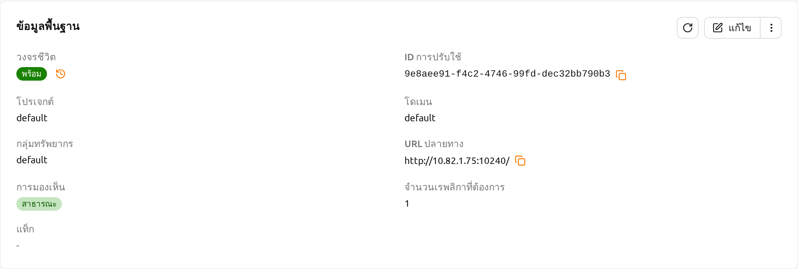

#### เมนูเพิ่มเติม (แก้ไขและลบ)

ส่วนหัวของการ์ดข้อมูลบริการมีปุ่ม **แก้ไข** ควบคู่ไปกับเมนู **เพิ่มเติม** ปุ่ม **แก้ไข** จะเปิดหน้าต่าง **แก้ไขการปรับใช้** ตามที่อธิบายไว้ใน [หน้าต่างสร้างการปรับใช้](#create-deployment) ปัจจุบันเมนูเพิ่มเติมมีการกระทำ **ลบการปรับใช้**

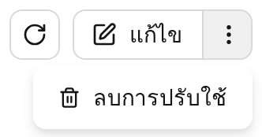

<a id="scheduling-history"></a>

#### ประวัติการจัดตาราง

คลิกปุ่มลิงก์ **ประวัติการจัดตาราง** ที่อยู่ถัดจากแท็กสถานะ เพื่อเปิดโมดอล **ประวัติการจัดตารางของการปรับใช้** โมดอลนี้จะแสดงเหตุการณ์การจัดตารางที่บันทึกไว้สำหรับการปรับใช้นี้โดยเรียงจากใหม่ไปเก่า พร้อมแถบตัวกรองคุณสมบัติ (ID, เฟส, ผลลัพธ์, สถานะเดิม, สถานะใหม่, รหัสข้อผิดพลาด, ข้อความ, สร้างเมื่อ, อัปเดตเมื่อ) และปุ่มรีเฟรช

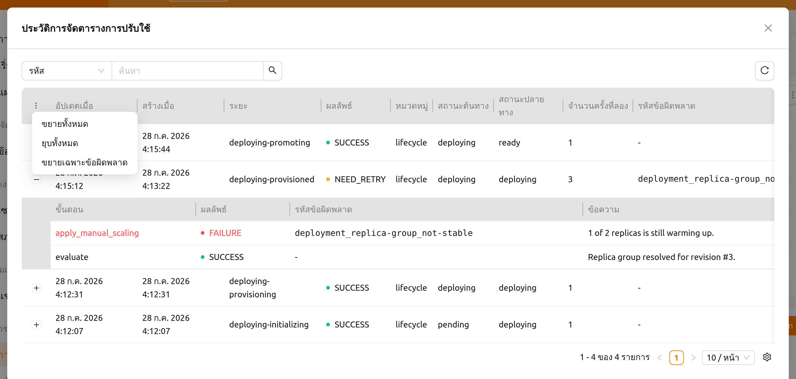

<a id="scheduling-history-substeps"></a>

เหตุการณ์ที่มีการบันทึกขั้นตอนย่อยจะมีลูกศรขยายอยู่ทางซ้ายของแถว คลิกเพื่อแสดงตารางแบบอินไลน์ที่กระชับซึ่งแสดงขั้นตอนย่อยของเฟสนั้นแถวละหนึ่งขั้นตอน โดยมีคอลัมน์ดังนี้

- **ขั้นตอน**: ชื่อของขั้นตอนย่อย
- **ผลลัพธ์**: ผลลัพธ์ของขั้นตอนย่อย แสดงเป็นเครื่องหมายที่แยกด้วยสี
- **ระยะเวลา**: ระยะเวลาที่ขั้นตอนย่อยใช้ เช่น `120 ms` หรือ `1.35 s`
- **เวลา**: เวลาที่ขั้นตอนย่อยเริ่มต้น แสดงละเอียดถึงระดับมิลลิวินาที
- **รหัสข้อผิดพลาด**: รหัสข้อผิดพลาดที่บันทึกไว้สำหรับขั้นตอนย่อย หรือ `-` เมื่อไม่มี
- **ข้อความ**: รายละเอียดหรือข้อความแสดงข้อผิดพลาดของขั้นตอนย่อย ย่อให้เหลือบรรทัดเดียว

โมดอล **ประวัติการจัดตารางเวลาของ Replica** ที่เปิดจากแท็บเรพลิกาก็ใช้ตารางชุดเดียวกัน ดูที่ [เรพลิกา](#replicas-tab-history)

<a id="revisions-tab"></a>

### แท็บ Revisions

การ์ด **Revisions** บนหน้ารายละเอียดการปรับใช้มีสามแท็บ ได้แก่ **Revision ปัจจุบัน**, **ประวัติ Revision** และ **บันทึกการตรวจสอบ** ปุ่ม `เพิ่ม Revision` ที่ด้านบนของการ์ดใช้งานได้จากทุกแท็บ และเปิดหน้าต่างเพิ่ม Revision (ดู [การเพิ่ม Revision](#add-revision))

#### แท็บ Revision ปัจจุบัน

แท็บ **Revision ปัจจุบัน** แสดงการกำหนดค่าทั้งหมดของ Revision ที่ใช้งานอยู่และกำลังให้บริการทราฟฟิก

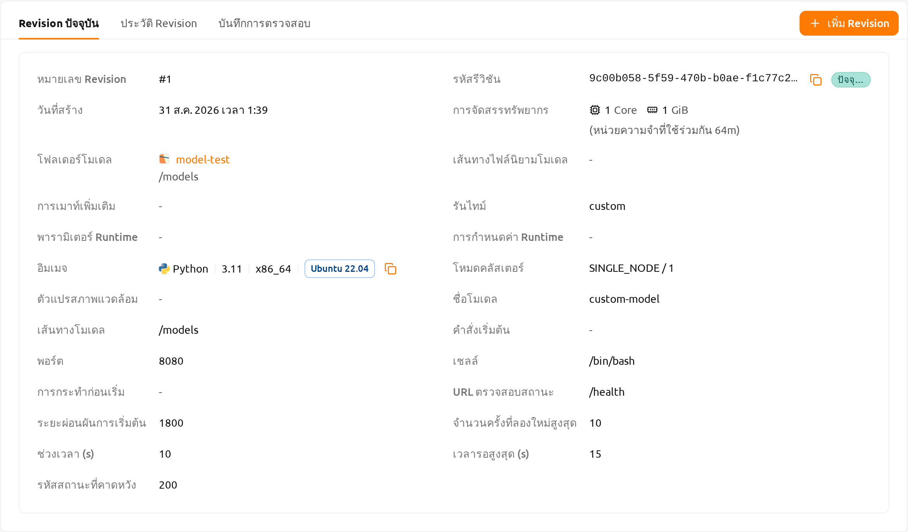

ฟิลด์ที่แสดงมีดังต่อไปนี้:

- **หมายเลข Revision**: หมายเลขลำดับที่กำหนดโดยอัตโนมัติ (เช่น *#3*)
- **ID Revision**: UUID ของ Revision นี้
- **สร้างเมื่อ**
- **การจัดสรรทรัพยากร**: การจัดสรรทรัพยากร (CPU, หน่วยความจำ, และตัวเร่งความเร็ว) สำหรับแต่ละเรพลิกา
- **โฟลเดอร์โมเดล**: โฟลเดอร์โมเดลที่ติดตั้งในแต่ละเรพลิกา แสดงเป็นลิงก์พร้อม **ปลายทางการเมาท์สำหรับโฟลเดอร์โมเดล** หาก Revision เมาต์โฟลเดอร์ย่อย จะแสดงบรรทัด `พาธย่อย: <ค่า>` เพิ่มด้วย
- **เส้นทางไฟล์นิยามโมเดล**: เส้นทางของไฟล์นิยามโมเดลภายในโฟลเดอร์โมเดล
- **การเมาท์เพิ่มเติม**: โฟลเดอร์จัดเก็บเพิ่มเติมที่ติดตั้งในแต่ละเรพลิกา
- **Runtime**: รันไทม์การให้บริการ (เช่น `vLLM`, `SGLang`, หรือ `Custom`)
- **พารามิเตอร์ Runtime (Runtime Parameters)**: ค่าพารามิเตอร์ preset ที่กำหนดค่าสำหรับ Revision นี้ (เช่น DType: float32, Quantization: awq) แสดงเฉพาะสำหรับ Revision `vLLM` หรือ `SGLang` ที่มีการกำหนดค่าพารามิเตอร์ preset ไว้ แสดงเครื่องหมายขีดสำหรับ runtime `Custom` หรือ Revision ที่ไม่มีค่า preset
- **การกำหนดค่า Runtime**: สำหรับ runtime `vLLM` หรือ `SGLang` หากมีการตั้งค่าเพิ่มเติม จะแสดงในรูปแบบ JSON
- **อิมเมจ**: คอนเทนเนอร์อิมเมจที่ใช้รันเรพลิกา
- **โหมดคลัสเตอร์**: รูปแบบการจัดกลุ่มของเซสชันการประมวลผลของแต่ละเรพลิกา (โหมด / ขนาด)
- **ตัวแปรสภาพแวดล้อม**: คู่คีย์-ค่าที่ถูกฉีดเข้าไปในคอนเทนเนอร์ แสดงเป็นบล็อก shell script

เมื่อไฟล์นิยามโมเดลมีการกำหนดโมเดล จะแสดงฟิลด์เพิ่มเติมดังนี้:

- **ชื่อโมเดล**, **เส้นทางโมเดล**, **คำสั่งเริ่มต้น**, **พอร์ต**, **Shell**, **การกระทำก่อนเริ่ม**, **URL ตรวจสอบสุขภาพ**, **ระยะผ่อนผันการเริ่มต้น**, **จำนวนครั้งที่ลองใหม่สูงสุด**, **ช่วงเวลา (s)**, **เวลารอสูงสุด (s)**, **รหัสสถานะที่คาดหวัง**

**สถานะกำลังปรับใช้**

ขณะที่ Revision อื่นกำลังถูกปรับใช้ แท็บ **Revision ปัจจุบัน** จะแสดงการแจ้งเตือน: *"กำลังปรับใช้ Revision N"* ปุ่ม **ดู Revision** ในการแจ้งเตือนจะเปิด drawer รายละเอียดของ Revision ที่กำลังถูกปรับใช้ แท็บจะรีเฟรชอัตโนมัติทุก 5 วินาทีจนกว่าการปรับใช้จะเสร็จสิ้น

**สถานะว่างเปล่า**

หากยังไม่มี Revision ที่ถูกปรับใช้ แท็บจะแสดง: *"ไม่มีการปรับใช้รุ่นแก้ไข — เพิ่มรุ่นแก้ไขเพื่อเปิดใช้งานบริการนี้"*

#### แท็บประวัติ Revision

แท็บ **ประวัติ Revision** แสดงรายการ Revision ทั้งหมดที่เพิ่มในการปรับใช้ เรียงจากใหม่ไปเก่าตามค่าเริ่มต้น

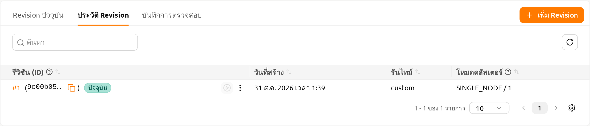

ตารางประกอบด้วยคอลัมน์ต่อไปนี้:

- **Revision (ID)**: หมายเลข Revision และ UUID ของมัน หมายเลข Revision เป็นจำนวนเต็มที่เพิ่มขึ้น ตัวเลขที่น้อยกว่าคือ Revision ที่เก่ากว่า คลิกหมายเลข Revision เพื่อเปิด drawer รายละเอียด Revision
- **สร้างเมื่อ**
- **Runtime**: รันไทม์การให้บริการที่ใช้สำหรับ Revision นี้ (เช่น `vLLM`, `SGLang`, หรือ `Custom`)
- **โหมดคลัสเตอร์**: รูปแบบการจัดกลุ่มในรูปแบบ "โหมด / ขนาด" วางเมาส์เหนือส่วนหัวคอลัมน์เพื่อดูคำอธิบาย

คอลัมน์ที่ซ่อนตามค่าเริ่มต้น แต่สามารถเปิดใช้งานได้จากการตั้งค่าคอลัมน์:

- **ชื่อโมเดล**, **อิมเมจ**, **โฟลเดอร์โมเดล**

**การปรับใช้ Revision และการกระทำอื่น ๆ**

แต่ละแถวมีปุ่ม **ปรับใช้** และเมนูเพิ่มเติม

- **ปรับใช้**: คลิกเพื่อเปิดกล่องโต้ตอบยืนยัน เมื่อยืนยัน Revision ที่เลือกจะกลายเป็น Revision ปัจจุบันและการปรับใช้จะเริ่มให้บริการทราฟฟิกด้วยการกำหนดค่าใหม่ Revision ก่อนหน้าจะถูกเก็บไว้ในประวัติ
- **สร้าง Revision ใหม่จากนี้**: เลือกได้จากเมนูเพิ่มเติม จะเปิดหน้าต่างเพิ่ม Revision โดยกรอกการกำหนดค่าของ Revision นั้นไว้ล่วงหน้า เพื่อให้คุณแก้ไขและปรับใช้ใหม่ได้อย่างรวดเร็ว

- แท็กสีเขียว **ปัจจุบัน** ทำเครื่องหมาย Revision ที่ใช้งานอยู่ในปัจจุบัน
- แท็กสีเหลือง **กำลังปรับใช้** (พร้อมตัวหมุนโหลด) ทำเครื่องหมาย Revision ที่กำลังถูกปรับใช้
- ปุ่ม **ปรับใช้** ถูกปิดใช้งานสำหรับ Revision ที่ใช้งานอยู่และ Revision ที่กำลังถูกปรับใช้

การคลิกหมายเลข Revision ในแถวใด ๆ จะเปิด drawer รายละเอียด Revision ที่แสดงการกำหนดค่าทั้งหมดของ Revision นั้น Drawer ยังมีปุ่ม **ปรับใช้** และปุ่ม **สร้าง Revision ใหม่จากนี้** ด้วย โดยปุ่ม **ปรับใช้** จะถูกปิดใช้งานสำหรับ Revision ที่ใช้งานอยู่และกำลังปรับใช้

:::note
ฟิลด์ **พารามิเตอร์ Runtime** ยังปรากฏใน drawer รายละเอียด Revision สำหรับ Revision `vLLM` และ `SGLang` ด้วย โดยแสดงค่าพารามิเตอร์ preset เดียวกันกับแท็บ Revision ปัจจุบัน
:::

#### แท็บบันทึกการตรวจสอบ

แท็บ **บันทึกการตรวจสอบ (Audit Log)** แสดงบันทึกตามลำดับเวลาของการดำเนินการทั้งหมดที่เกิดขึ้นกับการปรับใช้นี้ ใช้เพื่อติดตามว่าใครเปลี่ยนแปลงการปรับใช้และเมื่อใด

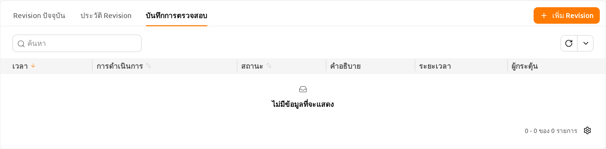

### เรพลิกา

แท็บเรพลิกาแสดง routing node ที่ประกอบกันเป็นการปรับใช้ รายการเรพลิกาจะถูกกรองด้วยตัวควบคุมแบบ radio **กำลังทำงาน / สิ้นสุดแล้ว** ที่ด้านบนของแท็บ

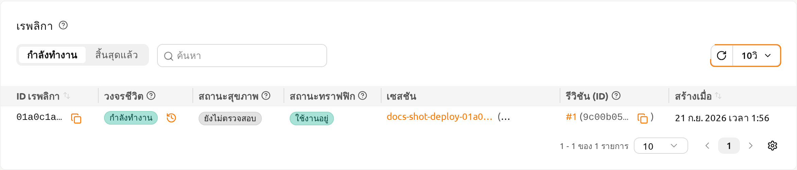

- **กำลังทำงาน**: แสดงเรพลิกาที่กำลังเตรียม กำลังทำงาน หรืออยู่ในสถานะใช้งานอื่น ๆ
- **สิ้นสุดแล้ว**: แสดงเรพลิกาที่สิ้นสุด lifecycle แล้ว

แต่ละแถวของเรพลิกามีฟิลด์สถานะที่**เป็นอิสระต่อกัน**สามฟิลด์ ฟิลด์เหล่านี้แสดงมิติที่แตกต่างกันและควรอ่านร่วมกัน ตัวอย่างเช่น เรพลิกาอาจอยู่ในสถานะ Lifecycle *กำลังทำงาน* ในขณะที่สถานะสุขภาพยัง *ยังไม่ตรวจสอบ* อยู่

- **สถานะ Lifecycle**: ตำแหน่งของเรพลิกาใน lifecycle (เช่น *กำลังจัดเตรียม*, *กำลังอุ่นเครื่อง*, *กำลังทำงาน*, *กำลังสิ้นสุด*, *สิ้นสุดแล้ว*) ในระหว่าง **กำลังอุ่นเครื่อง** เรพลิกาจะอยู่ภายในระยะผ่อนผันการเริ่มต้น นั่นคือกำลังเริ่มต้นและรอการตรวจสอบสุขภาพครั้งแรกที่สำเร็จ ในช่วงนี้การตรวจสอบสุขภาพที่ล้มเหลวจะได้รับการยอมรับ เรพลิกาจะเปลี่ยนเป็น *กำลังทำงาน* เมื่อสำเร็จครั้งแรก และจะถูกสิ้นสุดหากไม่สำเร็จเลยจนกว่าช่วงเวลาจะสิ้นสุด หัวคอลัมน์จะแสดงเป็น **วงจรชีวิต**
- **สถานะสุขภาพ**: สถานะสุขภาพปัจจุบันของกระบวนการเรพลิกา (*ปกติ*, *ผิดปกติ*, *เสื่อมสภาพ*, *ยังไม่ตรวจสอบ*)
   * **ยังไม่ตรวจสอบ** หมายความว่าการตรวจสอบสุขภาพครั้งแรกยังไม่เสร็จสมบูรณ์ โดยปกติเรพลิกายังอยู่ในช่วงผ่อนผัน **กำลังอุ่นเครื่อง** โดยตัวมันเองไม่ใช่ข้อผิดพลาด ให้ดู **สถานะ Lifecycle** เพื่อดูว่าเรพลิกาอยู่ในขั้นตอนใด
- **สถานะ Traffic**: เรพลิกากำลังให้บริการคำขออยู่หรือไม่ เรพลิกาสามารถถูกนำออกจาก traffic โดยไม่ขึ้นกับสถานะสุขภาพ (เช่น เมื่อถูกปิดใช้งานด้วยตนเอง) จึงแสดง traffic เป็นสถานะแยกต่างหากแทนที่จะรวมเข้ากับสถานะสุขภาพ

:::note
สถานะทั้งสามเป็นมิติที่เป็นอิสระต่อกัน ในระหว่างขั้นตอน Lifecycle **กำลังอุ่นเครื่อง** เรพลิกาจะอยู่ภายในระยะผ่อนผันการเริ่มต้น และ **สถานะสุขภาพ** มักจะแสดงเป็น *ยังไม่ตรวจสอบ* จนกว่าการตรวจสอบครั้งแรกจะเสร็จสมบูรณ์ ซึ่งไม่ได้บ่งชี้ถึงปัญหาด้วยตัวมันเอง
:::

คลิกชื่อเซสชันในคอลัมน์ **เซสชัน** เพื่อเปิด drawer รายละเอียดเซสชัน คลิกหมายเลข Revision ในคอลัมน์ **Revision (ID)** เพื่อเปิด drawer รายละเอียด Revision

<a id="replicas-tab-history"></a>

ถัดจากแท็กสถานะในคอลัมน์ **วงจรชีวิต** จะมีปุ่มไอคอนประวัติ เมื่อคลิกจะเปิดโมดอล **ประวัติการจัดตารางเวลาของ Replica** ของเรพลิกานั้น ซึ่งคุณสามารถกรองประวัติเหตุการณ์การจัดตารางของเรพลิกาได้ตามช่วงวันที่ สถานะ และอื่น ๆ

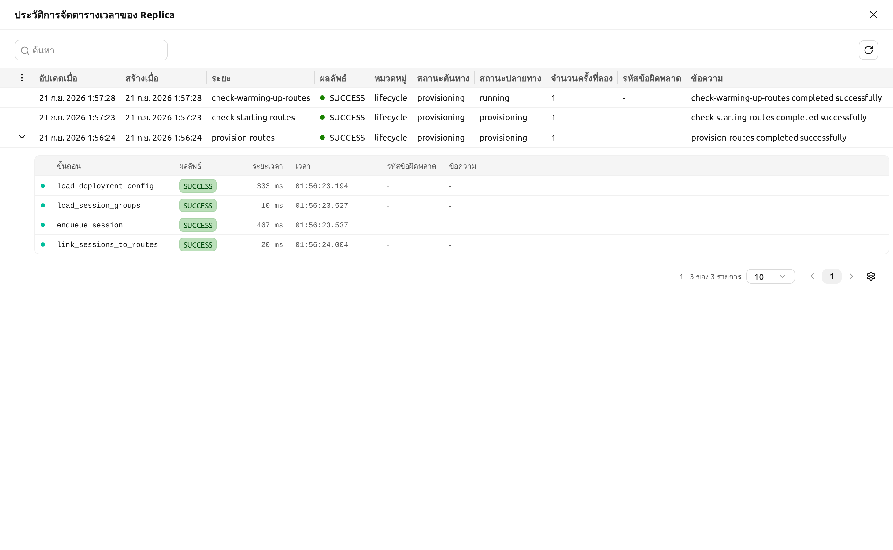

หากเรพลิกาพบข้อผิดพลาด คลิกที่ตัวบ่งชี้ข้อผิดพลาดในแถวเพื่อเปิดหน้าต่าง JSON viewer ที่แสดงข้อมูลข้อผิดพลาดดิบ ซึ่งมีประโยชน์ในการวินิจฉัยปัญหาของเรพลิกาแต่ละตัว

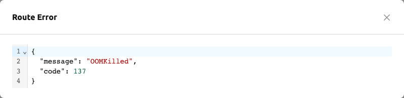

### กฎการปรับขนาดอัตโนมัติ

กฎการปรับขนาดอัตโนมัติ (Auto Scaling Rules) จะเพิ่มหรือลดจำนวนเรพลิกาของบริการโมเดลโดยอัตโนมัติตามเมตริกสด ช่วยประหยัดทรัพยากรในช่วงการใช้งานต่ำ และป้องกันความล่าช้าหรือความล้มเหลวของคำขอในช่วงการใช้งานสูง

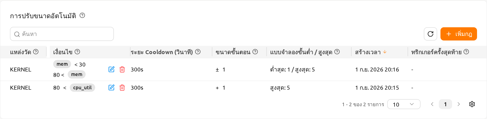

รายการกฎให้บริการดังนี้:

- แถบตัวกรองคุณสมบัติสำหรับกรองกฎตามช่วงวันเวลาของ สร้างเวลา (Created At) และ ทริกเกอร์ครั้งสุดท้าย (Last Triggered)
- การแบ่งหน้าที่ฝั่งเซิร์ฟเวอร์
- คอลัมน์ต่อไปนี้: แหล่งวัด (Metric Source), เงื่อนไข (Condition), ระยะ Cooldown (Cooldown Sec.), ขนาดขั้นตอน (Step Size), เรพลิกาขั้นต่ำ / สูงสุด (Min / Max Replicas), สร้างเวลา (Created At), ทริกเกอร์ครั้งสุดท้าย (Last Triggered) คอลัมน์ขนาดขั้นตอนจะแสดง `+`, `−`, หรือ `±` โดยอัตโนมัติตามทิศทางที่ได้จากเกณฑ์ที่คุณตั้งไว้
- ไอคอนแก้ไขและลบต่อแถว แสดงถัดจากสรุปเงื่อนไขในแต่ละแถว

คลิกปุ่ม `เพิ่มกฎ` เพื่อเปิดตัวแก้ไข **เพิ่มกฎการปรับขนาดอัตโนมัติ** หากต้องการแก้ไขกฎที่มีอยู่ ให้คลิกไอคอนแก้ไขในแถวนั้น ตัวแก้ไข **แก้ไขกฎการปรับขนาดอัตโนมัติ** จะเปิดขึ้นโดยมีค่าของกฎที่กรอกไว้ล่วงหน้า ตัวแก้ไขประกอบด้วยฟิลด์ต่อไปนี้ตามลำดับ:

- **แหล่งวัด (Metric Source)**: เลือก `Kernel` หรือ `Prometheus`
- **ชื่อเมตริก (Metric Name)**: สำหรับ `Kernel` ให้ใส่ชื่อเมตริก เมตริกทั่วไป เช่น `cpu_util`, `mem`, `net_rx` และ `net_tx` เป็นคำแนะนำให้เติมอัตโนมัติ และคุณยังสามารถพิมพ์ชื่อที่กำหนดเองได้อย่างอิสระ
- **ชื่อเมตริกแบบ Preset (Metric Name (Prometheus Preset))**: แสดงเฉพาะเมื่อแหล่งวัดเป็น `Prometheus` เลือก preset จากดรอปดาวน์ ชื่อเมตริก เทมเพลตคิวรี และ (เมื่อกำหนดไว้) ระยะ Cooldown (Cooldown Sec.) ของ preset จะถูกกรอกโดยอัตโนมัติ
- **เงื่อนไข (Condition)**: ตัวควบคุมแบบแบ่งส่วนสำหรับเลือกทิศทางการปรับขนาด มีสามตัวเลือก

   * **ย่อขนาด**: ลดจำนวนเรพลิกาเมื่อเมตริกต่ำกว่าเกณฑ์ กำหนดเงื่อนไข `Metric < [เกณฑ์]`
   * **ขยายแนวนอน**: เพิ่มจำนวนเรพลิกาเมื่อเมตริกสูงกว่าเกณฑ์ กำหนดเงื่อนไข `Metric > [เกณฑ์]`
   * **ขยายและย่อขนาด**: ปรับขยายหรือลดขนาดโดยอัตโนมัติตามด้านที่เมตริกข้ามออกจากช่วงที่กำหนด กำหนดเงื่อนไข `Metric < Min Threshold` หรือ `Metric > Max Threshold`

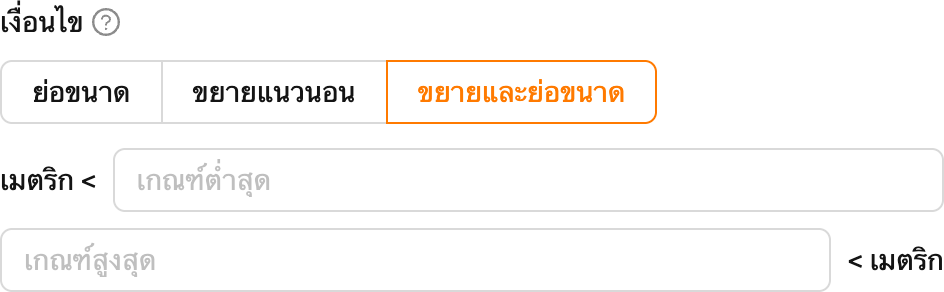

- **ขนาดขั้นตอน (Step Size)**: จำนวนเต็มบวกที่ระบุจำนวนเรพลิกาที่จะเพิ่มหรือลบต่อเหตุการณ์การปรับขนาด เครื่องหมาย `-`, `+`, หรือ `±` จะแสดงโดยอัตโนมัติตามเงื่อนไขที่เลือก (ย่อขนาด / ขยายแนวนอน / ขยายและย่อขนาด)

   * ตั้งเฉพาะเกณฑ์ต่ำสุด: `[metric] < [minThreshold]` จะทริกเกอร์ **ย่อขนาด** (เรพลิกาลดลงเมื่อเมตริกต่ำกว่าเกณฑ์)
   * ตั้งเฉพาะเกณฑ์สูงสุด: `[metric] > [maxThreshold]` จะทริกเกอร์ **ขยายแนวนอน** (เรพลิกาเพิ่มขึ้นเมื่อเมตริกสูงกว่าเกณฑ์)
   * ตั้งทั้งสองเกณฑ์: หาก `[metric] < [minThreshold]` เรพลิกาจะ **ย่อขนาด**; หาก `[metric] > [maxThreshold]` เรพลิกาจะ **ขยายแนวนอน**

- **ระยะ Cooldown (Cooldown Sec.)**: เวลาเป็นวินาทีที่รอหลังจากเหตุการณ์การปรับขนาดก่อนการประเมินครั้งถัดไป
- **เรพลิกาขั้นต่ำ (Min Replicas) และเรพลิกาสูงสุด (Max Replicas)**: ขอบเขตล่างและบนที่การปรับขนาดอัตโนมัติบังคับใช้กับจำนวนเรพลิกา การปรับขนาดอัตโนมัติจะไม่ลดจำนวนเรพลิกาต่ำกว่าเรพลิกาขั้นต่ำ หรือเพิ่มให้มากกว่าเรพลิกาสูงสุด

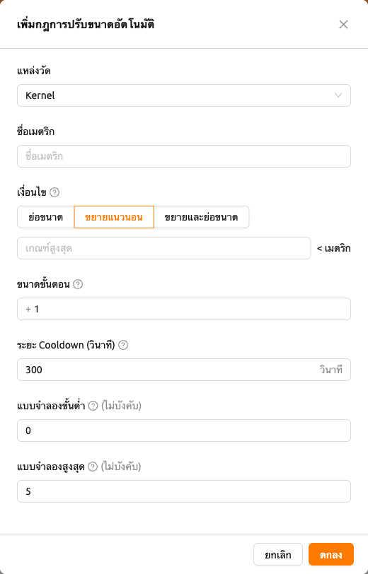

<a id="generating-tokens"></a>

### การสร้างโทเค็น

เมื่อสถานะการปรับใช้เป็น `HEALTHY` ให้คลิกชื่อการปรับใช้ในรายการการปรับใช้เพื่อเปิดหน้าข้อมูลรายละเอียดการปรับใช้ คุณสามารถตรวจสอบ URL **Service Endpoint** ได้ในการ์ดข้อมูลบริการ หาก **เปิดสาธารณะ** เปิดใช้งาน ผู้ใช้ปลายทางสามารถเข้าถึงการปรับใช้ได้โดยไม่ต้องใช้โทเค็น หากปิดใช้งาน ให้สร้างโทเค็นตามคำอธิบายด้านล่าง

โทเค็นการเข้าถึงจัดการได้จากการ์ด **โทเค็นการเข้าถึง** ที่ด้านล่างของหน้าข้อมูลรายละเอียดการปรับใช้ วางเมาส์เหนือไอคอน ⓘ ถัดจากชื่อการ์ดเพื่อดูคำอธิบาย: *"จัดการโทเค็นการเข้าถึงสำหรับการยืนยันตัวตนคำขอ API ไปยังเอนด์พอยต์ของการปรับใช้นี้"*

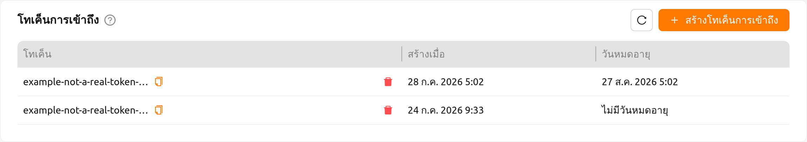

#### การสร้างโทเค็นการเข้าถึง

1. คลิกปุ่ม `สร้างโทเค็นการเข้าถึง` ในส่วนหัวของการ์ด หรือคลิก **เพิ่มโทเค็นการเข้าถึง** ในแบนเนอร์ **การปรับใช้แบบส่วนตัว** ที่ด้านบนของหน้า ซึ่งจะเปิดหน้าต่างเดียวกัน
2. เลือก **วันหมดอายุ** ของโทเค็น
   * `7 วัน`, `30 วัน` หรือ `90 วัน`: โทเค็นจะหมดอายุตามจำนวนวันดังกล่าวนับจากตอนนี้ ค่าเริ่มต้นคือ `7 วัน`
   * **วันหมดอายุที่กำหนดเอง**: จะแสดงตัวเลือกวันและเวลาเพื่อกำหนดเวลาหมดอายุเอง เวลาที่เลือกต้องอยู่ในอนาคต
   * **ไม่มีวันหมดอายุ**: ตั้งวันหมดอายุเป็นวันที่ในอนาคตไกล ๆ (`31 ธันวาคม 2099`) ทำให้โทเค็นแทบไม่หมดอายุในทางปฏิบัติ หลังจากนี้ หน้าต่างโทเค็น รายการโทเค็น และตัวเลือกโทเค็นในหน้าแชท จะแสดงวันที่นี้แทนคำว่า "ไม่มีวันหมดอายุ"
3. คลิก `สร้างโทเค็นการเข้าถึง` เพื่อออกโทเค็น

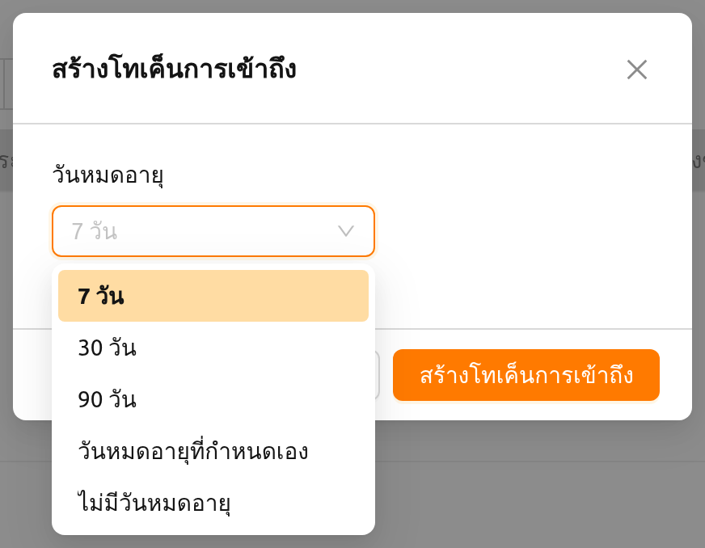

   ปุ่ม `สร้างโทเค็นการเข้าถึง` จะถูกปิดใช้งานจนกว่า manager จะออก endpoint ของเครือข่ายให้การปรับใช้นี้ ระหว่างที่ปิดใช้งาน คำแนะนำของปุ่มจะระบุว่า *"ยังไม่ได้ออก endpoint ของเครือข่าย"* ปุ่มนี้ยังถูกปิดใช้งานสำหรับการปรับใช้ที่คุณไม่ได้เป็นเจ้าของ และการปรับใช้ที่กำลังถูกลบด้วย

เมื่อออกโทเค็นแล้ว หน้าต่าง **โทเค็น** จะแสดงค่าโทเค็นเพียงครั้งเดียว พร้อมปุ่มคัดลอกและวันหมดอายุที่คุณเลือก คัดลอกโทเค็นจากหน้าต่างนี้ หรือคัดลอกจากตารางในภายหลังก็ได้

#### รายการโทเค็นการเข้าถึง

การ์ดนี้แสดงโทเค็นการเข้าถึงทุกรายการที่ออกให้การปรับใช้นี้ โดยเรียงจากใหม่ไปเก่า

- **โทเค็น**: ค่าของโทเค็น แสดงแบบย่อพร้อมปุ่มคัดลอก ไอคอนลบในเซลล์เดียวกันใช้ลบโทเค็นได้
- **สร้างเมื่อ**: เวลาที่ออกโทเค็น
- **วันหมดอายุ**: เวลาที่โทเค็นจะหมดอายุ โทเค็นที่สร้างด้วย **ไม่มีวันหมดอายุ** จะแสดงเป็น `31 ธันวาคม 2099`

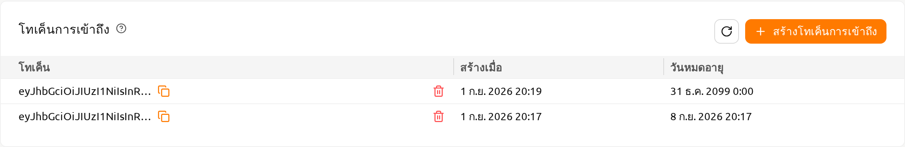

ส่งโทเค็นไปในส่วนหัวคำขอ `Authorization`

| Key           | Value                   |
|---------------|-------------------------|
| Content-Type  | application/json        |
| Authorization | BackendAI `<token>`     |

#### การลบโทเค็นการเข้าถึง

คลิกไอคอนลบในแถวของโทเค็น หน้าต่าง **ลบโทเค็นการเข้าถึง** จะขอให้คุณพิมพ์ `ลบ` เพื่อยืนยัน และปุ่มตกลงจะยังถูกปิดใช้งานจนกว่าข้อความที่พิมพ์จะตรงกัน

:::danger
การลบโทเค็นการเข้าถึง **ไม่สามารถย้อนกลับได้** และมีผลทันที ไคลเอนต์ที่ยังส่งโทเค็นนั้นอยู่จะเริ่มได้รับข้อผิดพลาดในการยืนยันตัวตน
:::

### การยุติการปรับใช้

หากไม่จำเป็นต้องใช้การปรับใช้แล้ว แนะนำให้ยุติการปรับใช้นั้น หากต้องการยุติการปรับใช้ ให้เปิดเมนู **เพิ่มเติม** บนการ์ดข้อมูลบริการ และเลือก **ลบการปรับใช้** หน้าต่างยืนยันแบบพิมพ์จะปรากฏขึ้น — พิมพ์ชื่อการปรับใช้เพื่อเปิดใช้งานปุ่ม **ลบถาวร** การปรับใช้ที่ยุติแล้วจะปรากฏในมุมมองตัวกรอง **ถูกทำลาย**

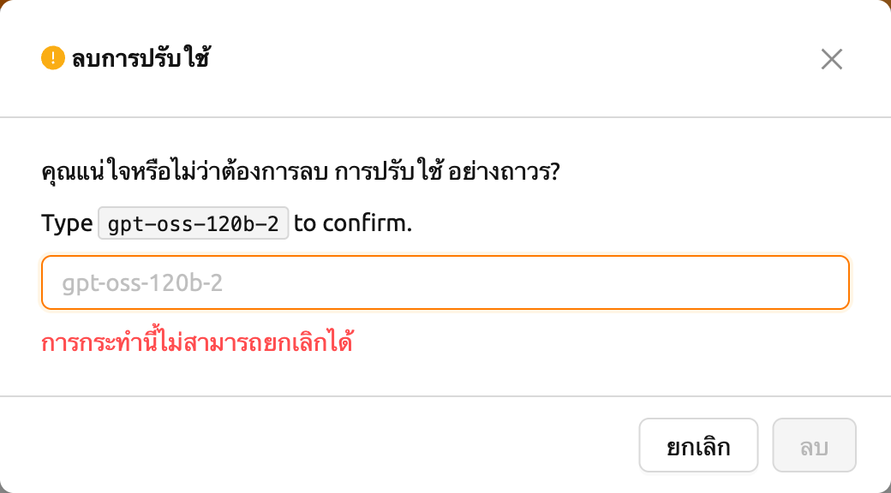

## การเข้าถึงการปรับใช้ของคุณ

### การส่งคำขอ API

หากต้องการให้ผู้ใช้ปลายทางเรียกใช้การปรับใช้ของคุณ ให้แบ่งปัน URL การปรับใช้กับพวกเขา หาก **เปิดสาธารณะ** เปิดใช้งาน คุณสามารถแบ่งปัน URL **Service Endpoint** จากหน้าข้อมูลรายละเอียดการปรับใช้ได้โดยตรง สำหรับการปรับใช้แบบส่วนตัว ให้แบ่งปัน URL พร้อมกับ access token ด้วย

นี่คือคำสั่ง `curl` ง่ายๆ เพื่อตรวจสอบว่าการส่งคำขอไปยัง URL การปรับใช้ทำงานอย่างถูกต้องหรือไม่:

```bash
export API_TOKEN="<token>"
export MODEL_SERVICE_ENDPOINT="<model-service-endpoint>"
curl -H "Content-Type: application/json" -X GET \
  -H "Authorization: BackendAI $API_TOKEN" \
  "$MODEL_SERVICE_ENDPOINT"
```

:::warning
โดยค่าเริ่มต้น ผู้ใช้ปลายทางต้องอยู่ในเครือข่ายที่สามารถเข้าถึง
endpoint ได้ หากบริการถูกสร้างในเครือข่ายปิด เฉพาะผู้ใช้ปลายทาง
ที่มีการเข้าถึงภายในเครือข่ายปิดนั้นเท่านั้นที่สามารถเข้าถึงบริการได้
:::

### การทดสอบ LLM Chat

หากคุณสร้างบริการ Large Language Model (LLM) คุณสามารถทดสอบ LLM แบบเรียลไทม์
เมื่อการปรับใช้พร้อมแล้ว ปุ่ม `ทดสอบในแชท` จะปรากฏในแบนเนอร์ **การปรับใช้พร้อมแล้ว** ที่ด้านบนของหน้าข้อมูลรายละเอียดการปรับใช้ คลิกปุ่มดังกล่าวเพื่อเริ่มการทดสอบ

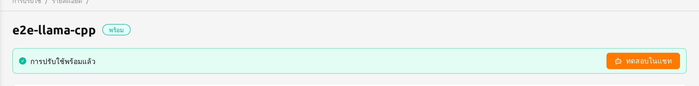

คุณจะถูกเปลี่ยนเส้นทางไปยังหน้า Chat ซึ่งโมเดลที่คุณสร้างจะถูกเลือกโดยอัตโนมัติ
โดยใช้อินเทอร์เฟซแชทที่ให้บริการในหน้า Chat คุณสามารถทดสอบโมเดล LLM
สำหรับข้อมูลเพิ่มเติมเกี่ยวกับฟีเจอร์แชท โปรดดู [หน้าแชท](#chat-page)

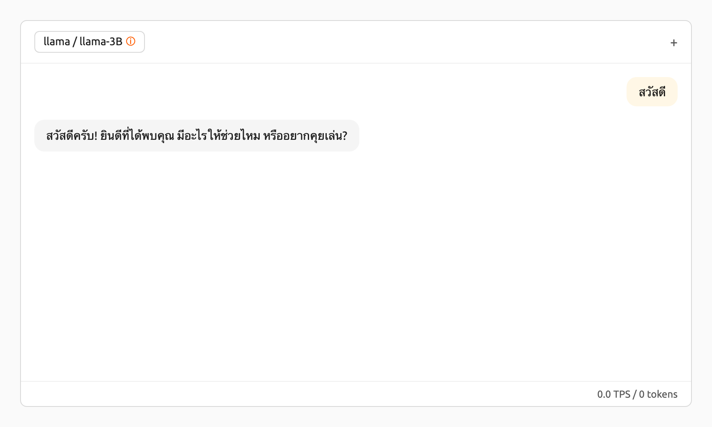

#### การเลือกโทเค็นในหน้า Chat

เมื่อหน้า Chat เชื่อมต่อกับการปรับใช้ของ Backend.AI ช่องโทเค็นจะไม่ใช่ช่องข้อความธรรมดา แต่เป็นตัวเลือกที่แสดงรายการโทเค็นการเข้าถึงของการปรับใช้นั้น

- แต่ละตัวเลือกจะแสดง **อักขระ 6 ตัวสุดท้าย** ของโทเค็นในรูปแบบโค้ด พร้อมวันหมดอายุ (เช่น `~ 26 ส.ค. 2026` หรือ `~ 31 ธ.ค. 2099` สำหรับโทเค็นที่สร้างด้วย **ไม่มีวันหมดอายุ**) เนื่องจากโทเค็นทุกตัวขึ้นต้นด้วยส่วนหัว JWT เหมือนกัน ส่วนท้ายจึงเป็นสิ่งที่ใช้แยกความแตกต่างได้จริง วางเมาส์เหนือตัวเลือกเพื่อดูเวลาที่ออกโทเค็น → เวลาหมดอายุแบบเต็ม
- **โทเค็นที่หมดอายุแล้วจะไม่ถูกแสดง** รายการจะมีเฉพาะโทเค็นที่ยังใช้ได้เท่านั้น
- เมื่อช่องยังว่าง ระบบจะเลือก **โทเค็นที่ใช้ได้ซึ่งสร้างล่าสุด** ให้โดยอัตโนมัติ หากคุณล้างการเลือกเอง ระบบจะไม่เลือกให้ใหม่อีก
- ไอคอนรูปเฟืองถัดจากช่อง (**การตั้งค่าโทเค็นการเข้าถึง**) จะพาไปยังส่วนโทเค็นการเข้าถึงของการปรับใช้นั้น เพื่อให้คุณออกโทเค็นใหม่ได้โดยไม่เสียบริบทเดิม เมื่อกลับมา รายการจะถูกโหลดใหม่ คุณจึงเลือกโทเค็นที่เพิ่งสร้างได้ทันที

หากการปรับใช้ไม่มีโทเค็นที่ใช้ได้เลย ตัวเลือกจะว่างเปล่า ให้สร้างโทเค็นก่อนตามที่อธิบายไว้ใน [การสร้างโทเค็น](#generating-tokens)

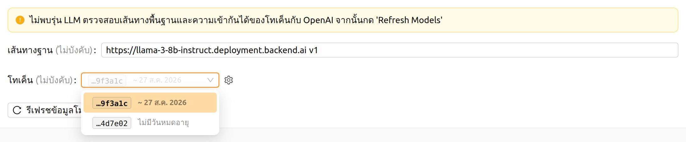

หากคุณพบปัญหาในการเชื่อมต่อกับ API หน้าแชทจะแสดงตัวเลือกที่ให้คุณกำหนดค่าการตั้งค่าโมเดลด้วยตนเอง
ในการใช้โมเดล คุณจะต้องมีข้อมูลต่อไปนี้:

- **เส้นทางฐาน** (ไม่บังคับ): Base URL ของเซิร์ฟเวอร์ที่โมเดลตั้งอยู่
  ตรวจสอบให้แน่ใจว่าได้รวมข้อมูลเวอร์ชัน
  เช่น เมื่อใช้ OpenAI API คุณควรใส่ https://api.openai.com/v1
- **โทเค็น** (ไม่บังคับ): คีย์การรับรองความถูกต้องเพื่อเข้าถึงบริการโมเดล โทเค็นสามารถ
  สร้างได้จากบริการต่างๆ ไม่ใช่แค่ Backend.AI เท่านั้น รูปแบบและกระบวนการสร้าง
  อาจแตกต่างกันไปขึ้นอยู่กับบริการ ควรอ้างถึงคู่มือของบริการเฉพาะสำหรับรายละเอียด
  เช่น เมื่อใช้บริการที่สร้างโดย Backend.AI โปรดดู
  [การสร้างโทเค็น](#generating-tokens) สำหรับคำแนะนำเกี่ยวกับวิธีสร้างโทเค็น

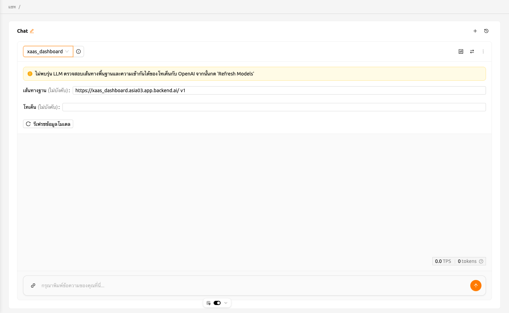

<a id="model-store"></a>

## คลังโมเดล

คลังโมเดล (Model Store) ให้บริการแกลเลอรีแบบการ์ดของโมเดลที่กำหนดค่าไว้ล่วงหน้าซึ่งคุณสามารถเรียกดู ค้นหา และ deploy ได้ คุณสามารถเข้าถึงคลังโมเดลได้จากเมนูด้านข้าง

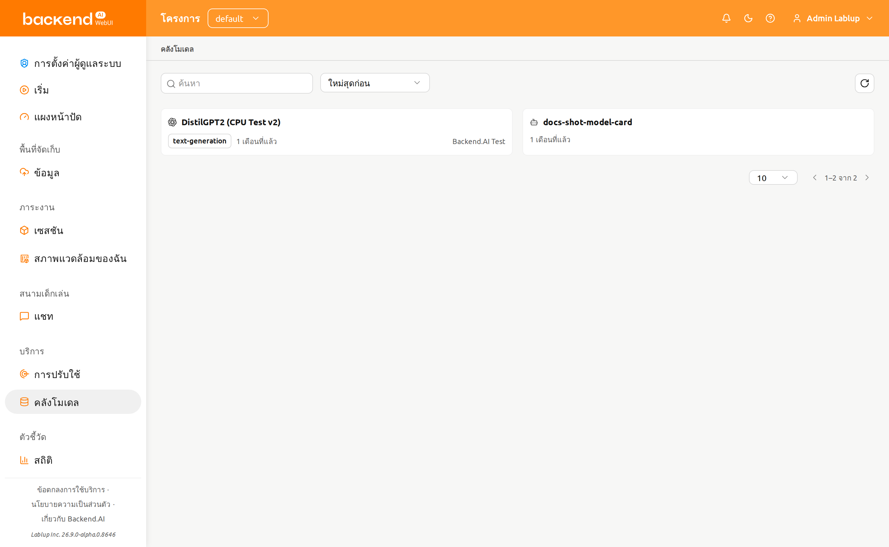

### การเรียกดูและค้นหาโมเดล

ส่วนบนของหน้าใช้รูปแบบตัวกรองและเรียงลำดับ:

- **แถบตัวกรองคุณสมบัติ**: เพิ่มเงื่อนไขหนึ่งข้อขึ้นไปเพื่อจำกัดรายการการ์ด มีคุณสมบัติให้ใช้สองรายการ
   * **ชื่อโมเดล**: ค้นหาการ์ดโมเดลตามชื่อ
   * **โฮสต์ที่เก็บข้อมูล**: กรองการ์ดตาม storage host ที่โฟลเดอร์โมเดลตั้งอยู่ แทนที่จะพิมพ์ชื่อโฮสต์ ให้เลือกจากดรอปดาวน์ของ storage host ที่ลงทะเบียนไว้บนเซิร์ฟเวอร์ ค่าที่เลือกจะถูกเพิ่มเป็นเงื่อนไขตัวกรองทันที ใช้ตัวดำเนินการ `equals` เพื่อแสดงเฉพาะโฮสต์นั้น หรือ `not equals` เพื่อยกเว้นโฮสต์นั้น
- **เรียงลำดับ (Sort)**: เลือกวิธีการเรียงลำดับผลลัพธ์ ตัวเลือกที่ใช้งานได้คือ `ชื่อ (A→Z)`, `ชื่อ (Z→A)`, `เก่าสุดก่อน` และ `ใหม่สุดก่อน`
- **รีเฟรช (Refresh)**: คลิกปุ่มรีเฟรชเพื่อโหลดรายการการ์ดใหม่

   เนื่องจากเลือกโฮสต์จากรายการแทนการพิมพ์เอง การพิมพ์ชื่อโฮสต์ผิดจึงไม่ทำให้ได้ผลลัพธ์ว่างเปล่าโดยไม่รู้ตัว เงื่อนไขจะถูกรวมกันด้วย `AND` คุณจึงใช้เงื่อนไขชื่อร่วมกับเงื่อนไข storage host ได้

:::note
รายการโมเดลจะถูกกำหนดขอบเขตโดยอัตโนมัติให้เฉพาะโปรเจกต์ MODEL_STORE ของโดเมนปัจจุบัน โดยไม่มีตัวกรองโดเมนแยกต่างหาก การ์ดทั้งหมดที่มองเห็นได้ในหน้านี้เป็นของโดเมนของคุณอยู่แล้ว
:::

การ์ดแต่ละใบจะแสดงไอคอนแบรนด์ของโมเดล ชื่อเรื่อง (หรือชื่อเมื่อไม่มีการตั้งชื่อเรื่อง) แท็กงาน เวลาสร้างแบบสัมพัทธ์ และผู้เขียน (Author) พร้อมไอคอน การ์ดที่ **ไม่มี preset ที่เข้ากันได้** สำหรับโปรเจกต์ปัจจุบันจะถูกแสดงที่ความโปร่งใส 50 % คุณสามารถเปิดการ์ดดังกล่าวเพื่อดูรายละเอียดได้ แต่ปุ่ม `Deploy` จะถูกปิดใช้งานและมีการแจ้งเตือนข้อผิดพลาด **ไม่มี preset ที่เข้ากันได้ ไม่สามารถ deploy โมเดลนี้ได้** แสดงใน Drawer

หากไม่ได้ตั้งค่าโปรเจกต์ `MODEL_STORE` บนเซิร์ฟเวอร์ หน้าจะแสดงข้อความ *ไม่พบโปรเจกต์ Model Store* พร้อมคำแนะนำให้ติดต่อผู้ดูแลระบบ หากไม่มีการ์ดโมเดลใดที่ตรงกับตัวกรองของคุณ หน้าจะแสดง *ไม่พบโมเดล*

รายการจะถูกแบ่งหน้าที่ด้านล่าง คุณสามารถเปลี่ยนขนาดหน้าระหว่าง `10`, `20` และ `50` รายการได้

### รายละเอียดการ์ดโมเดล

คลิกการ์ดเพื่อเปิด Drawer การ์ดโมเดลทางด้านขวาของหน้า Drawer จะแสดงชื่อเรื่องและคำอธิบายโมเดลที่ด้านบน ตามด้วยแท็กงาน หมวดหมู่ ป้ายกำกับ และใบอนุญาต จากนั้นจะเป็นรายการรายละเอียดที่มีรายการต่อไปนี้:

- **ผู้เขียน (Author)**
- **สถาปัตยกรรม (Architecture)**
- **เฟรมเวิร์ก (Framework)** (เฟรมเวิร์กแต่ละตัวจะแสดงพร้อมไอคอน)
- **เวอร์ชัน (Version)**
- **สร้างเมื่อ (Created) และแก้ไขล่าสุด (Last Modified)** เวลาประทับ
- **โฟลเดอร์โมเดล (Model Folder)**: ลิงก์ที่คลิกได้ซึ่งเปิดตัวสำรวจโฟลเดอร์สำหรับโฟลเดอร์จัดเก็บโมเดล
- **ทรัพยากรขั้นต่ำ (Min Resource)**: ข้อกำหนดทรัพยากรขั้นต่ำ (CPU, หน่วยความจำ, GPU)

หากการ์ดโมเดลมี README จะถูกเรนเดอร์เป็นการ์ด `README.md` ที่ด้านล่างของ Drawer

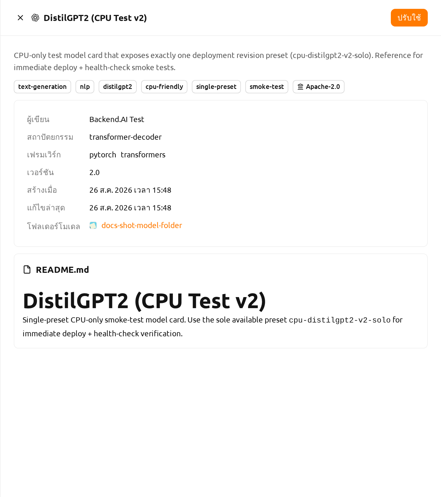

### การ Deploy โมเดล

คลิกปุ่ม `Deploy` ในส่วนหัวของ Drawer เพื่อ deploy โมเดลเป็นบริการ ขั้นตอนการ deploy ทำงานได้ด้วยหนึ่งในสองรูปแบบ:

- **Deploy อัตโนมัติ**: หากโมเดลมี preset ที่ใช้งานได้เพียงหนึ่งรายการ และโปรเจกต์ปัจจุบันมีกลุ่มทรัพยากรที่เข้าถึงได้เพียงหนึ่งรายการ การ deploy จะถูกสร้างขึ้นอย่างเงียบ ๆ โดยไม่มีโมดอลแสดงขึ้น หลังจาก endpoint พร้อมให้สืบค้นแล้ว คุณจะถูกนำไปยังหน้าข้อมูลรายละเอียดการปรับใช้
- **โมดอล Deploy Model**: มิฉะนั้น โมดอล Deploy Model จะเปิดขึ้นพร้อมด้วยฟิลด์ที่จำเป็นต่อไปนี้

   * **Preset**: ดรอปดาวน์ที่จัดกลุ่มของ preset ทรัพยากรที่ใช้งานได้ เมื่อ preset ครอบคลุมตัวแปร runtime หลายตัว ตัวเลือกจะถูกจัดกลุ่มตามชื่อตัวแปร runtime มิฉะนั้น ตัวเลือกจะถูกแสดงเป็นรายการแบบแบน
   * **Resource Group**: กลุ่มทรัพยากรที่บริการจะทำงาน

   คลิกปุ่ม `Deploy` ในโมดอลเพื่อเริ่มการ deploy จะมีการแสดง toast แสดงความสำเร็จที่ยืนยันว่าโมเดลได้รับการ deploy แล้ว และคุณจะถูกนำไปยังหน้าข้อมูลรายละเอียดการปรับใช้

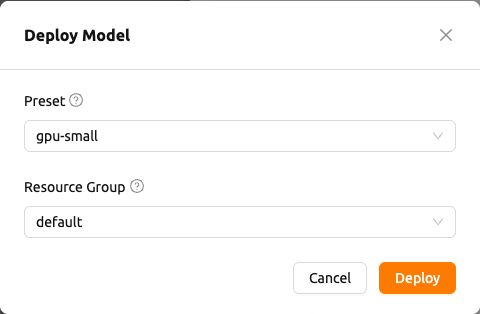

:::note
หากโมเดลที่เลือกไม่มี preset ที่เข้ากันได้สำหรับโปรเจกต์ปัจจุบัน ปุ่ม `Deploy` ใน Drawer
จะถูกปิดใช้งาน และการ deploy จะถูกปิดกั้นจนกว่าจะมี preset ที่เข้ากันได้
:::
