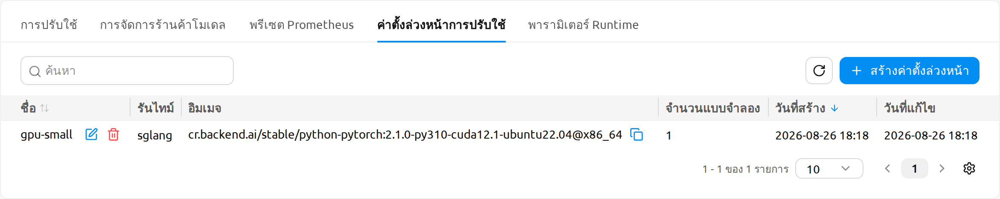
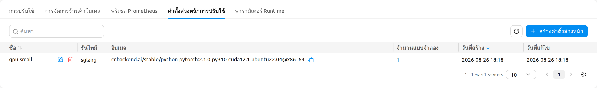
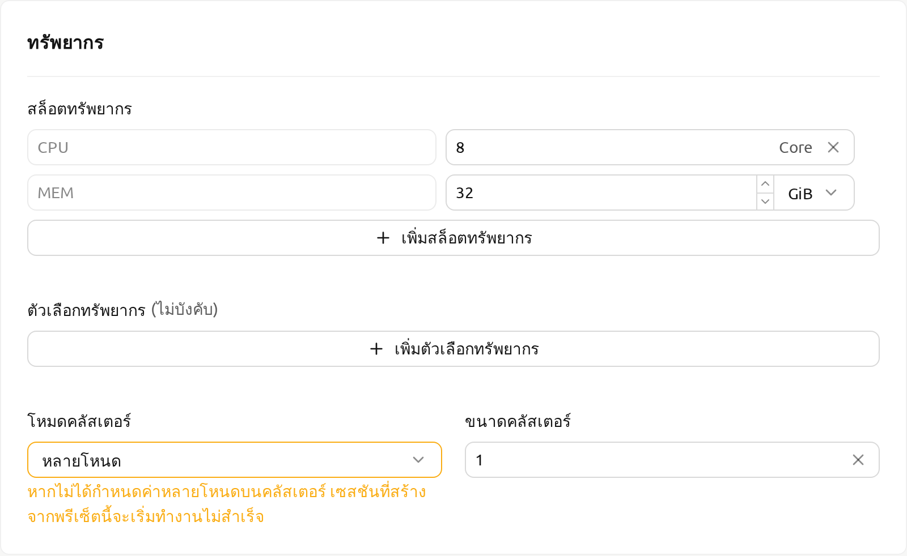
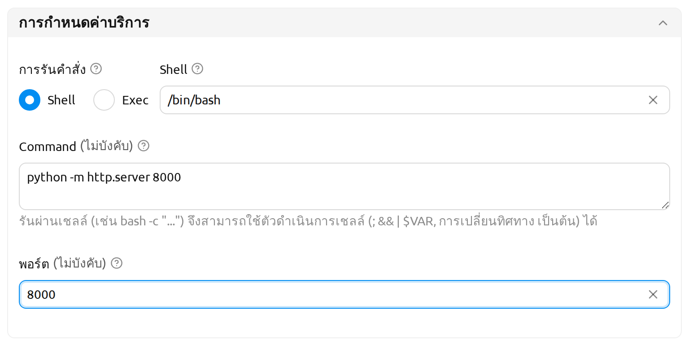
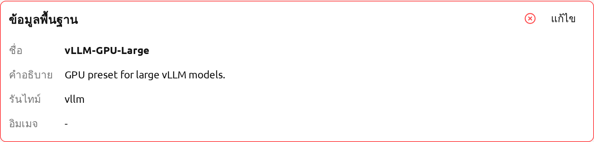
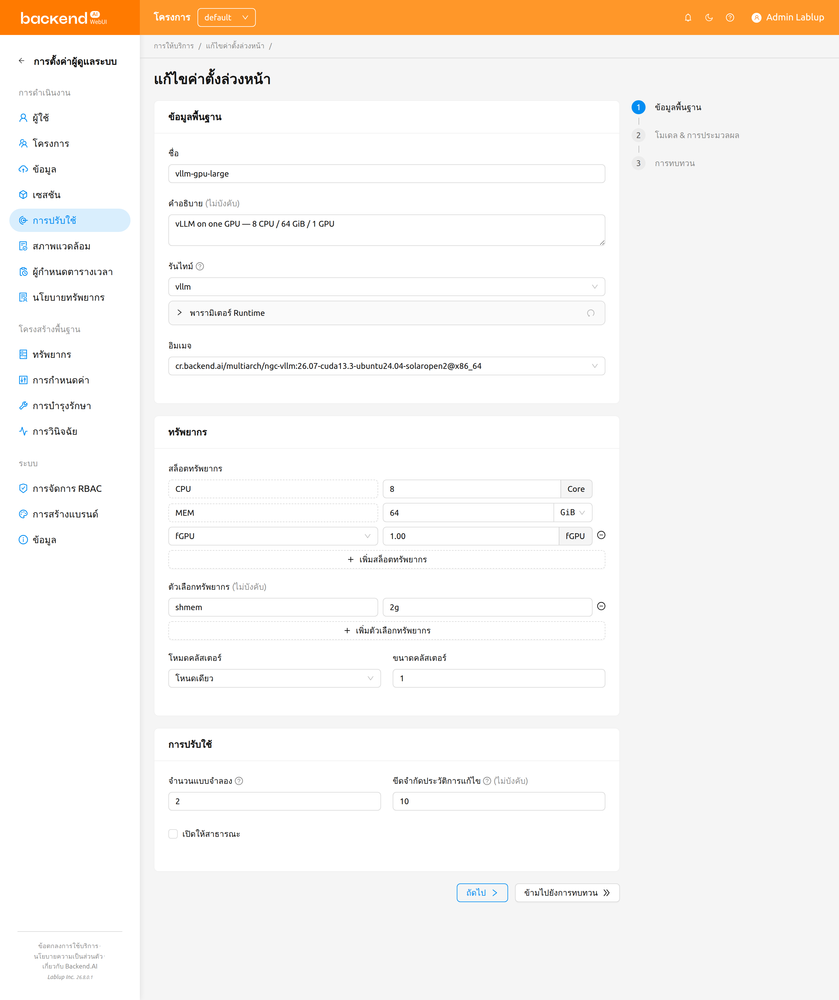
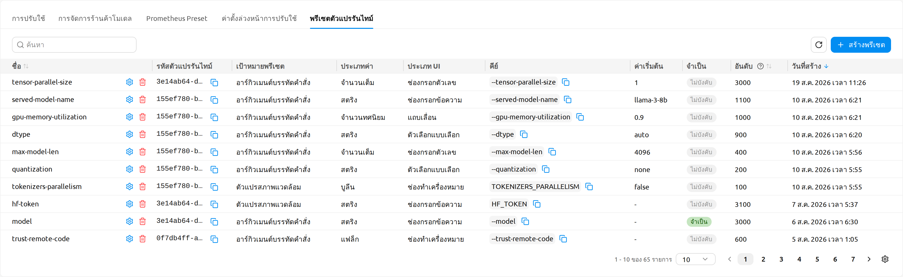
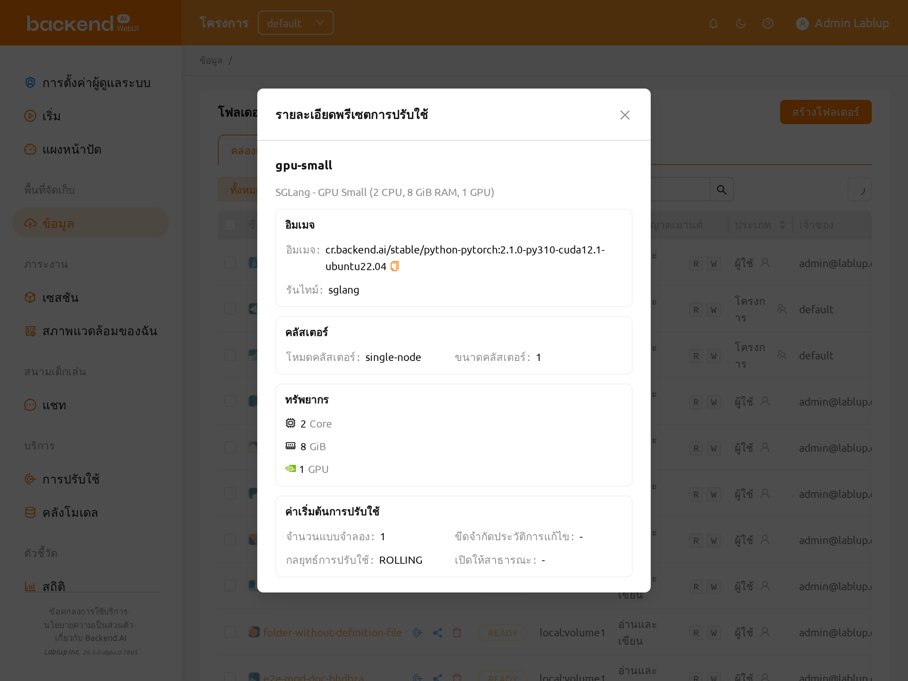
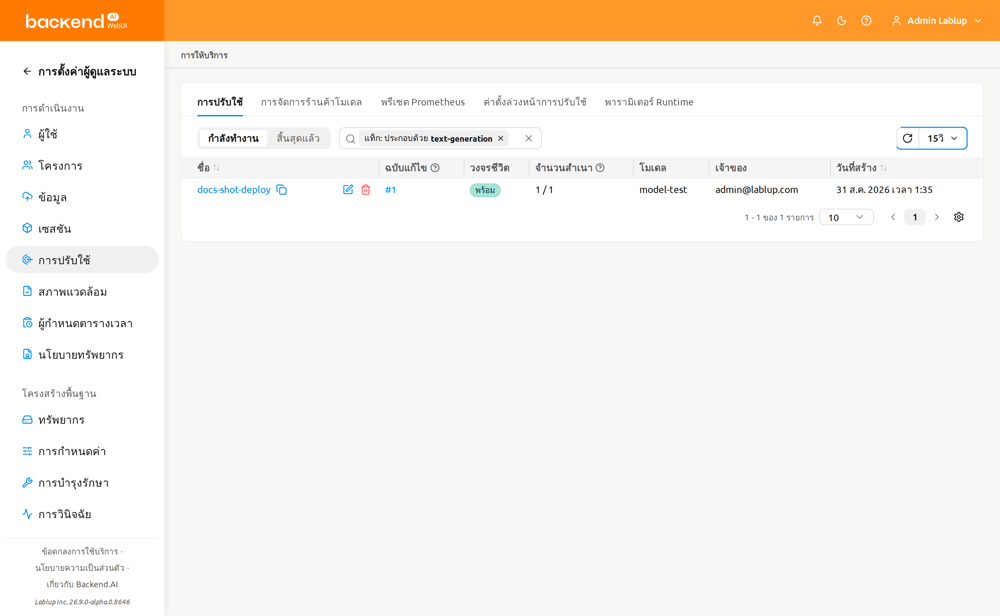

# พรีเซ็ตการดีพลอย

**พรีเซ็ตการดีพลอย (Deployment Preset)** คือชุดค่าตั้งต้นที่ใช้ซ้ำได้สำหรับการดีพลอยโมเดล โดยรวมถึง image, runtime, resource slots, cluster mode, environment variables, startup command, จำนวน replica, ระดับการเผยแพร่ และค่าเริ่มต้นอื่น ๆ ผู้ดูแลระบบเป็นผู้กำหนดพรีเซ็ตเหล่านี้ไว้ล่วงหน้า เพื่อให้ผู้ใช้ทั่วไปนำไปใช้ได้ตอนสร้าง deployment ของโมเดลจากโฟลเดอร์จัดเก็บ ผู้ดูแลระบบสามารถเผยแพร่ชุดรูปแบบการดีพลอยที่ผ่านการตรวจสอบแล้ว เช่น *vLLM-GPU-Large* หรือ *SGLang-CPU-Small* เพื่อให้ผู้ใช้สามารถดีพลอยโมเดลได้โดยไม่ต้องเลือกฟิลด์ขั้นสูงทุกตัวเอง

:::info
หน้านี้อยู่ภายใต้หมวด **การดูแลระบบ** เนื่องจากเฉพาะผู้ดูแลระบบเท่านั้นที่สามารถสร้าง แก้ไข และลบพรีเซ็ตการดีพลอยได้ ผู้ใช้ทั่วไปไม่สามารถจัดการพรีเซ็ตได้เอง แต่สามารถ **นำไปใช้** กับพรีเซ็ตที่เผยแพร่ในโปรเจกต์ของตนได้ในขณะดีพลอยโมเดล หน้านี้แบ่งเป็นสองส่วน: [การจัดการพรีเซ็ตการดีพลอย](#managing-deployment-presets) อธิบายเวิร์กโฟลว์สำหรับผู้ดูแลระบบ ส่วน [การใช้พรีเซ็ตเมื่อดีพลอยโมเดล](#using-a-preset-when-deploying-a-model) อธิบายเวิร์กโฟลว์สำหรับผู้ใช้ทั่วไป สำหรับการสร้าง revision โดยอ้างอิงพรีเซ็ต ให้ดูที่หน้า [การปรับใช้](#model-serving) เพิ่มเติม
:::

## พรีเซ็ตการดีพลอยคืออะไร

พรีเซ็ตการดีพลอยเก็บค่าเริ่มต้นของการดีพลอยโมเดลไว้เพื่อให้:

- **ผู้ดูแลระบบ** สามารถจัดเตรียมแคตาล็อกของรูปแบบการดีพลอยที่ผ่านการตรวจสอบและสอดคล้องกับฮาร์ดแวร์และนโยบายขององค์กรให้กับผู้ใช้
- **ผู้ใช้ทั่วไป** เลือกพรีเซ็ตได้ขณะดีพลอยโมเดลจากหน้า Data ผ่านขั้นตอน *สร้าง Deployment ใหม่ด้วย Preset* โดยไม่ต้องกรอกฟิลด์ขั้นสูงด้วยตนเอง
- **ผู้ดูแลการใช้งาน** มั่นใจได้ว่า deployment ที่ใช้ในงานจริงทั่วทั้งองค์กรใช้การจัดสรรทรัพยากร, runtime และค่าเริ่มต้นด้านการเผยแพร่ที่สอดคล้องกัน

เมื่อสร้าง deployment จากพรีเซ็ต ค่าของพรีเซ็ตจะถูกเติมในฟอร์ม deployment launcher โดยอัตโนมัติ ผู้ใช้สามารถตรวจสอบและแก้ไขค่าเหล่านี้ก่อนยืนยันการดีพลอย

แต่ละพรีเซ็ตจะเก็บข้อมูลต่อไปนี้:

- **ข้อมูลพื้นฐาน (Basic Info)**: ชื่อ คำอธิบาย runtime อันดับการแสดงผล (rank) และพารามิเตอร์ Runtime (สำหรับ runtime ที่ไม่ใช่ Custom)
- **อิมเมจ (Image)**: คอนเทนเนอร์อิมเมจที่ใช้ดีพลอย
- **ทรัพยากร (Resources)**: resource slots (CPU, memory, GPU), หน่วยความจำที่แชร์ (SHM) และตัวเลือกทรัพยากร
- **คลัสเตอร์ (Cluster)**: cluster mode (Single Node หรือ Multi Node) และขนาดคลัสเตอร์
- **การเรียกใช้งาน (Execution)**: คำสั่งเตรียมสภาพแวดล้อม (Startup Command), environment variables และ bootstrap script
- **การกำหนดค่าบริการ (Service Configuration)**: การรันคำสั่ง (Shell หรือ Exec), shell, คำสั่ง และพอร์ต โดยจะถูกเก็บไว้สำหรับ runtime ที่อ่านการตั้งค่าจากโฟลเดอร์โมเดล เช่น Custom
- **ค่าเริ่มต้นของการดีพลอย (Deployment Defaults)**: จำนวน replica, จำนวน revision ที่เก็บไว้ และค่าเริ่มต้นของ *Open to Public*
- **การตรวจสอบสุขภาพ (Health Check)**: การตรวจสอบสุขภาพเป็นระยะ (ตัวเลือกเสริม) ควบคุมด้วยสวิตช์ **เปิดใช้การตรวจสอบสุขภาพ**
- **การกระทำก่อนเริ่ม (Pre-Start Actions)**: การกระทำที่จะรันก่อนเริ่มบริการโมเดล
- **คำจำกัดความโมเดล (Model Definition)** (ตัวเลือกเสริม): ชื่อและ path ของโมเดลที่ให้บริการ พร้อม metadata ตามต้องการ

## การจัดการพรีเซ็ตการดีพลอย

เฉพาะผู้ดูแลระบบเท่านั้นที่สามารถสร้าง แก้ไข หรือลบพรีเซ็ตการดีพลอยได้ ผู้ดูแลระบบจัดการพรีเซ็ตเหล่านี้ได้จากแท็บ **พรีเซ็ตการดีพลอย** ในหน้าการปรับใช้ของผู้ดูแลระบบที่ `/admin/deployments`

มุมมองรายการจะแสดงแต่ละพรีเซ็ตพร้อมชื่อ, runtime, image, อันดับการแสดงผล, คอลัมน์ **แก้ไขเมื่อ (Modified)** และฟิลด์ทรัพยากรสำคัญ ผู้ดูแลระบบสามารถทำสิ่งต่อไปนี้จากรายการนี้ได้:

- กรองพรีเซ็ตด้วยชื่อ, runtime หรือแท็ก
- คลิกชิปแท็กในแถวใดก็ได้เพื่อกรองรายการให้แสดงเฉพาะพรีเซ็ตที่มีแท็กเดียวกัน
- เปิดหน้ารายละเอียดของพรีเซ็ตเพื่อดูการตั้งค่าทั้งหมด
- สร้าง แก้ไข หรือลบพรีเซ็ต

คอลัมน์ **แก้ไขเมื่อ (Modified)** จะแสดงโดยค่าเริ่มต้น คอลัมน์เพิ่มเติม ได้แก่ **คำอธิบาย (Description)**, **คำสั่งเตรียมสภาพแวดล้อม (Startup Command)**, **เปิดให้สาธารณะ (Open to Public)** และ **อันดับ (Rank)** จะถูกซ่อนไว้โดยค่าเริ่มต้น คุณสามารถแสดงหรือซ่อนคอลัมน์เหล่านี้ได้โดยคลิกไอคอนรูปเฟือง (gear) ที่ส่วนหัวของตารางเพื่อเปิดตัวจัดการคอลัมน์

:::note[ที่อยู่ของหน้าพรีเซ็ต]
หน้าพรีเซ็ตการดีพลอยอยู่ในขอบเขตของผู้ดูแลระบบ ที่อยู่จึงขึ้นต้นด้วย `/admin` ทั้งหมด

| หน้า | ที่อยู่ |
|---|---|
| รายการพรีเซ็ต | `/admin/deployments` (แท็บ **ค่าตั้งล่วงหน้าการปรับใช้**) |
| สร้างพรีเซ็ต | `/admin/deployments/deployment-presets/new` |
| แก้ไขพรีเซ็ต | `/admin/deployments/deployment-presets/{presetId}/edit` |

ขั้นตอนสำหรับผู้ใช้ทั่วไปที่อธิบายไว้ใน [การใช้พรีเซ็ตเมื่อดีพลอยโมเดล](#using-a-preset-when-deploying-a-model) ทำงานในขอบเขตของโปรเจกต์ ดังนั้นหน้า Data ที่คุณใช้ดีพลอยโมเดลจะอยู่ที่ `/project/{ชื่อโปรเจกต์}/data` ส่วนที่อยู่หลัง `/project/` คือ **ชื่อ** ของโปรเจกต์ ไม่ใช่ ID

ลิงก์รูปแบบเดิม เช่น `/admin-deployments/deployment-presets/new` ยังใช้งานได้และจะเปลี่ยนเส้นทางไปยังที่อยู่ตามขอบเขตข้างต้น บุ๊กมาร์กเดิมจึงไม่เสียหาย
:::

เมื่อคุณเปิดหน้ารายละเอียดของพรีเซ็ตเพื่อดูการตั้งค่าทั้งหมด หน้านี้จะแสดงการ์ด **การตรวจสอบสุขภาพ (Health Check)** ที่สรุปการกำหนดค่า health check ของพรีเซ็ต (เช่น path, interval, จำนวนครั้งที่ลองใหม่ และ status code ที่คาดหวัง) หากพรีเซ็ตนั้นเปิดใช้การตรวจสอบสุขภาพไว้

### สร้างพรีเซ็ตการดีพลอย

1. คลิกปุ่ม **สร้างค่าตั้งล่วงหน้า** ที่มุมขวาบนของรายการพรีเซ็ต ระบบจะเปิดฟอร์มพรีเซ็ตที่ `/admin/deployments/deployment-presets/new`
2. กรอกฟิลด์ต่าง ๆ ฟอร์มนี้เป็นตัวช่วยสามขั้นตอน ได้แก่ **ข้อมูลพื้นฐาน**, **โมเดล & การประมวลผล** และ **การทบทวน** โดยมีรายการขั้นตอนอยู่ทางขวาและปุ่ม `ก่อนหน้า` / `ถัดไป` อยู่ด้านล่าง ใช้ `ข้ามไปยังการทบทวน` เพื่อไปยังขั้นตอนสุดท้ายได้ทันที ฟิลด์จัดเป็นส่วนต่าง ๆ ดังนี้:

   - **ข้อมูลพื้นฐาน**:
      * **ชื่อ**: ชื่อพรีเซ็ตที่ไม่ซ้ำกัน (เช่น `vLLM-GPU-Large`)
      * **คำอธิบาย**: สรุปสั้น ๆ เกี่ยวกับการใช้งานพรีเซ็ตนี้
      * **Runtime**: runtime variant (เช่น vLLM, SGLang หรือ Custom)
      * **อันดับการแสดงผล**: ลำดับการแสดงผลในกลุ่มพรีเซ็ตของ runtime เดียวกัน ค่าน้อยจะแสดงก่อน
   - **พารามิเตอร์ Runtime (Runtime Parameters)**: ส่วนนี้จะปรากฏ **เฉพาะเมื่อเลือก runtime variant เป็น vLLM หรือ SGLang เท่านั้น** พารามิเตอร์จะถูกจัดเป็นหลายแท็บ ได้แก่ **Model Loading**, **Resource Memory** และ **Serving Performance** เพื่อให้กำหนดค่าได้ง่ายขึ้น พารามิเตอร์ที่จำเป็นจะมีเครื่องหมายดอกจันสีแดง (`*`) กำกับ และฟอร์มจะไม่อนุญาตให้ส่งหากฟิลด์ที่จำเป็นเหล่านั้นว่างเปล่า

   - **อิมเมจ**: คอนเทนเนอร์อิมเมจที่จะใช้ดีพลอย
   - **การกำหนดค่าบริการ** (จะปรากฏเมื่อ runtime ที่เลือกอ่านการตั้งค่าจากโฟลเดอร์โมเดล เช่น Custom): **การรันคำสั่ง** (**Shell** หรือ **Exec**), **Shell**, **คำสั่ง** / **คำสั่ง (argv)** และ **พอร์ต** — เป็นฟิลด์ชุดเดียวกับในหน้าต่าง Add Revision ซึ่งอธิบายไว้ที่ [การกำหนดค่าบริการ](#service-configuration) ในหน้าการปรับใช้ หากเว้น **พอร์ต** ว่างไว้ deployment ที่สร้างจากพรีเซ็ตนี้จะสืบทอดพอร์ตเริ่มต้นของ runtime variant

      :::note[ตำแหน่งที่ส่วนนี้ปรากฏ]
      **การกำหนดค่าบริการ**, **การตรวจสอบสุขภาพ** และ **การกระทำก่อนเริ่ม** ทั้งหมดจะอยู่ในขั้นตอน **ข้อมูลพื้นฐาน** ใต้ฟิลด์ของ runtime และถูกบันทึกแยกจากคำจำกัดความโมเดล
      :::
   - **ทรัพยากร**: resource slots (CPU, memory, GPU), หน่วยความจำที่แชร์ และตัวเลือกทรัพยากร (คู่ key/value)
   - **คลัสเตอร์**: cluster mode (Single Node หรือ Multi Node) และขนาดคลัสเตอร์ พรีเซ็ตที่สร้างใหม่จะใช้ **Single Node** เป็นค่าเริ่มต้น การเลือก **Multi Node** จะแสดงคำเตือน *"หากไม่ได้กำหนดค่าหลายโหนดบนคลัสเตอร์ เซสชันที่สร้างจากพรีเซ็ตนี้จะเริ่มทำงานไม่สำเร็จ"* คำเตือนนี้ไม่ได้ปิดกั้นการบันทึก ดังนั้นให้เลือก Multi Node เฉพาะเมื่อคลัสเตอร์ของคุณรองรับเท่านั้น
   - **การเรียกใช้งาน**: **คำสั่งเตรียมสภาพแวดล้อม (Startup Command)**, environment variables และ bootstrap script ฟิลด์คำสั่งเตรียมสภาพแวดล้อมจะแสดงคำใบ้ไวยากรณ์เชลล์ (`ไวยากรณ์เชลล์: /bin/bash -c "cmd1; cmd2"`) เนื่องจากคำสั่งจะถูกเรียกใช้งานในรูปแบบ `/bin/bash -c <command>` คุณจึงสามารถใช้ตัวดำเนินการของเชลล์ เช่น `;`, `|` และ `&&` ได้โดยตรง

      :::note[คำสั่งเตรียมสภาพแวดล้อมไม่ใช่คำสั่ง]
      คำสั่งทั้งสองเป็นคนละอย่างกัน และแต่ละฟิลด์มีคำอธิบายของตัวเอง จึงแยกความแตกต่างได้ง่าย

      | ฟิลด์ | ตำแหน่ง | หน้าที่ | ตัวอย่าง |
      |---|---|---|---|
      | **คำสั่งเตรียมสภาพแวดล้อม** | ส่วนการเรียกใช้งานของพรีเซ็ต | *"คำสั่งที่ใช้เตรียมสภาพแวดล้อมก่อนที่เฟรมเวิร์กของโมเดลจะเริ่มทำงาน (เช่น การติดตั้งแพ็กเกจอย่าง vllm)"* | `pip install vllm` |
      | **คำสั่ง** (ในโหมด Exec คือ **คำสั่ง (argv)**) | ส่วนการกำหนดค่าบริการของพรีเซ็ต | คำสั่งที่เริ่มต้นกระบวนการให้บริการโมเดล | `vllm serve /models --tp 2` |

      ใช้ **คำสั่งเตรียมสภาพแวดล้อม** สำหรับงานเตรียมการ เช่น การติดตั้งแพ็กเกจ การดึงไฟล์ประกอบ หรือการเขียนไฟล์การตั้งค่า และใช้ **คำสั่ง** สำหรับคำสั่งที่เปิดใช้งานเฟรมเวิร์กให้บริการจริง ข้อความตัวอย่างในแต่ละฟิลด์ก็แสดงตัวอย่างของคำสั่งประเภทที่ถูกต้อง
      :::
   - **ค่าเริ่มต้นของการดีพลอย**:
      * **จำนวน Replica**: จำนวน replica เริ่มต้นสำหรับ deployment ที่สร้างจากพรีเซ็ตนี้
      * **จำนวน Revision ที่เก็บไว้**: จำนวน revision ก่อนหน้าที่ถูกเก็บไว้สำหรับแต่ละ deployment ที่สร้างจากพรีเซ็ตนี้
      * **Open to Public**: ค่าเริ่มต้นว่า endpoint ของ deployment ที่สร้างจากพรีเซ็ตนี้สามารถเข้าถึงได้โดยไม่ต้องใช้ access token หรือไม่
   - **การตรวจสอบสุขภาพ**: ส่วนนี้มีสวิตช์ **เปิดใช้การตรวจสอบสุขภาพ** ซึ่งตั้งค่าเริ่มต้นเป็น **ปิด** เมื่อปิดอยู่ ฟิลด์การตรวจสอบสุขภาพจะถูกซ่อนไว้ เมื่อเปิดใช้งาน ฟิลด์ต่าง ๆ จะปรากฏขึ้นและกำหนดค่าได้ ได้แก่ เส้นทาง, ช่วงเวลา, จำนวนลองใหม่สูงสุด, เวลารอสูงสุด, รหัสสถานะ และระยะผ่อนผันการเริ่มต้น
   - **การกระทำก่อนเริ่ม**: การกระทำที่จะรันก่อนเริ่มบริการโมเดล คลิก **เพิ่มการกระทำก่อนเริ่ม** เพื่อเพิ่มแถว จากนั้นกรอก **การกระทำ** และ **อาร์กิวเมนต์ (JSON)**
   - **คำจำกัดความโมเดล** (ตัวเลือกเสริม): สวิตช์ที่ส่วนหัวของการ์ดใช้เปิดคำจำกัดความโมเดล เมื่อเปิดใช้งาน ให้กรอก **ชื่อโมเดล** และ **เส้นทางโมเดล** (จำเป็นทั้งคู่) และหากต้องการ สามารถขยายส่วน **ข้อมูลเมตา** เพื่อกรอกชื่อเรื่อง ผู้เขียน เวอร์ชัน สัญญาอนุญาต คำอธิบาย งาน หมวดหมู่ สถาปัตยกรรม เฟรมเวิร์ก และป้ายกำกับของโมเดลที่ให้บริการ

      :::note
      toggle **เปิดใช้การตรวจสอบสุขภาพ (Enable Health Check)** ใช้กับ Advanced Mode ของ runtime variant vLLM และ SGLang ด้วย
      :::

   

   

3. ในขั้นตอน **การทบทวน** ให้ตรวจสอบสรุปข้อมูล แล้วคลิก `สร้าง` เพื่อบันทึก ระบบจะแสดงการแจ้งเตือนเมื่อสร้างพรีเซ็ตสำเร็จ

:::tip
หากฟิลด์ที่จำเป็นว่างเปล่าหรือมีค่าที่ไม่ถูกต้อง ปุ่มยืนยันในขั้นตอนการทบทวนจะยังคงถูกปิดใช้งานจนกว่าจะแก้ไขข้อผิดพลาด การ์ดในขั้นตอนการทบทวนที่มีฟิลด์ดังกล่าวจะถูกตีกรอบสีแดงพร้อมไอคอนข้อผิดพลาดข้างลิงก์ **แก้ไข** และขั้นตอนที่ฟิลด์นั้นอยู่จะถูกทำเครื่องหมายว่ามีข้อผิดพลาดในรายการขั้นตอนทางด้านขวา คุณจึงเห็นได้ว่าต้องย้อนกลับไปที่ขั้นตอนใด แม้จะเป็นฟิลด์ในขั้นตอนที่ยังไม่เคยเปิดดูก็ตาม ฟิลด์ที่จำเป็นจะแสดงข้อความตรวจสอบความถูกต้องในตำแหน่งของฟิลด์ขณะที่คุณพิมพ์
:::

#### ขั้นตอนการทบทวน

ขั้นตอนสุดท้ายของตัวช่วยคือสรุปแบบอ่านอย่างเดียวที่สะท้อนทุกขั้นตอนก่อนหน้า โดยจัดกลุ่มเป็นการ์ดชุดเดียวกับที่คุณกรอกข้อมูลไว้ การ์ดแต่ละใบมีลิงก์ **แก้ไข** ที่พาคุณกลับไปยังขั้นตอนที่เกี่ยวข้องและเลื่อนไปยังการ์ดนั้น

การ์ด **ข้อมูลพื้นฐาน** สรุปรายการต่อไปนี้ตามลำดับของฟิลด์ในขั้นตอนที่ 1:

- **ชื่อ**
- **คำอธิบาย** (เฉพาะพรีเซ็ตที่มีคำอธิบาย)
- **Runtime**: runtime variant ที่พรีเซ็ตใช้ แสดงเป็นชื่อที่ใช้แสดงผล
- **อิมเมจ**: ในรูปแบบ `<canonicalName>@<architecture>`
- **พารามิเตอร์ Runtime** (เฉพาะ runtime ที่ไม่ใช่ Custom และมีการตั้งค่าไว้)
- **Shell**, **คำสั่ง** และ **พอร์ต**: ค่าการกำหนดค่าบริการ จะแสดงเฉพาะ runtime ที่อ่านการตั้งค่าจากโฟลเดอร์โมเดล ส่วน **Shell** จะไม่แสดงในโหมด Exec เนื่องจากไม่มีการใช้ shell
- **เปิดใช้การตรวจสอบสุขภาพ** ตามด้วยค่าการตรวจสอบสุขภาพที่ตั้งไว้เมื่อเปิดใช้งาน

การ์ดที่เหลือสรุป **ทรัพยากร** (resource slots, ตัวเลือกทรัพยากร, cluster mode, ขนาดคลัสเตอร์), **การปรับใช้** (จำนวน replica, จำนวน revision ที่เก็บไว้, Open to Public) และ **โมเดล & การประมวลผล** (คำสั่งเตรียมสภาพแวดล้อม, bootstrap script, environment variables และคำจำกัดความโมเดลเมื่อเปิดใช้งาน)

   แถว **Runtime** จะแสดงทั้งตอนที่คุณสร้างพรีเซ็ต **และ** ตอนที่คุณแก้ไขพรีเซ็ต เนื่องจากฟิลด์นี้แก้ไขได้ในขั้นตอนที่ 1 ทั้งสองกรณี ใช้แถวนี้เพื่อยืนยันว่าพรีเซ็ตจะใช้ runtime ใดก่อนบันทึก

### แก้ไขพรีเซ็ตการดีพลอย

1. จากรายการพรีเซ็ต ให้เปิดเมนูการกระทำของแถวพรีเซ็ต (หรือเปิดหน้ารายละเอียดของพรีเซ็ต) แล้วเลือก **แก้ไขค่าตั้งล่วงหน้า**
2. ฟอร์มพรีเซ็ตจะเปิดขึ้นที่ `/admin/deployments/deployment-presets/{presetId}/edit` พร้อมเติมค่าปัจจุบันของพรีเซ็ตไว้ล่วงหน้า ขั้นตอนและส่วนต่าง ๆ เหมือนกับขั้นตอนการสร้างทุกประการ รวมถึงส่วน **พารามิเตอร์ Runtime** สำหรับ runtime vLLM และ SGLang
3. ปรับค่าตามต้องการ จากนั้นในขั้นตอน **การทบทวน** ให้ยืนยันสรุปข้อมูล รวมถึงแถว **Runtime** แล้วคลิก `บันทึก` เพื่อบันทึกการเปลี่ยนแปลง

การแก้ไขพรีเซ็ตจะเปลี่ยนเฉพาะค่าเริ่มต้นของ deployment ที่จะสร้าง **ในอนาคต** เท่านั้น deployment ที่สร้างจากพรีเซ็ตนี้อยู่แล้วจะไม่ถูกแก้ไข

### ลบพรีเซ็ตการดีพลอย

1. จากรายการพรีเซ็ต (หรือหน้ารายละเอียดของพรีเซ็ต) ให้เปิดเมนูการกระทำของพรีเซ็ต แล้วเลือก **ลบค่าตั้งล่วงหน้า**
2. ไดอะล็อกยืนยันแบบพิมพ์ชื่อจะปรากฏขึ้นและขอให้คุณพิมพ์ชื่อพรีเซ็ตเพื่อยืนยัน ปุ่ม **OK** จะถูกปิดใช้งานจนกว่าค่าที่พิมพ์จะตรงกับชื่อพรีเซ็ตอย่างถูกต้องทุกประการ
3. พิมพ์ชื่อพรีเซ็ต แล้วคลิก **OK** เพื่อยืนยัน

:::danger
การลบพรีเซ็ตการดีพลอย **ไม่สามารถย้อนกลับได้** ตัวพรีเซ็ตจะถูกลบออก แต่ deployment ที่ถูกสร้างจากพรีเซ็ตไปแล้วจะยังคงทำงานต่อโดยไม่ได้รับผลกระทบ การดีพลอยในอนาคตจะไม่สามารถอ้างอิงพรีเซ็ตนี้ได้อีก
:::

## พรีเซตตัวแปรรันไทม์

แท็บ **พรีเซตตัวแปรรันไทม์** บนหน้า **การปรับใช้ของผู้ดูแลระบบ** (`/admin/deployments`) ใช้กำหนดพารามิเตอร์แต่ละตัวที่ตัวแปรรันไทม์เปิดให้ใช้งาน แต่ละรายการอธิบายพารามิเตอร์หนึ่งตัว ทั้งคีย์ที่จะส่งให้คอนเทนเนอร์ ประเภทค่า ค่าเริ่มต้น และวิธีแสดงผลบนหน้าจอ เมื่อรวมกันแล้วรายการเหล่านี้จะประกอบขึ้นเป็นแท็บ **พารามิเตอร์ Runtime** ที่ผู้ใช้กรอกเมื่อเพิ่ม Revision ของการปรับใช้ (ดู [พารามิเตอร์ Runtime](#runtime-parameters) ในหน้าการปรับใช้)

<!-- TODO(screenshot): recaptured 2026-08-28 — UI Type and Default Value are now shown. The capture server runs manager 26.8.0rc1, which does not serve the runtime variant field, so the column appears in its bare-ID fallback form; recapture on a server that serves it to show the qualified "Runtime Variant (ID)" form. -->

เหนือตารางมีตัวกรองคุณสมบัติ (**ชื่อ**, **รหัสตัวแปรรันไทม์**) ปุ่มรีเฟรช และปุ่ม **สร้างพรีเซต** คอลัมน์ที่แสดงตามค่าเริ่มต้นมีดังนี้

- **ชื่อ**: ชื่อของพรีเซตพารามิเตอร์ คอลัมน์นี้ยังมีปุ่มแก้ไขและลบของแต่ละแถวด้วย
- **ตัวแปรรันไทม์ (ID)**: รันไทม์ที่พารามิเตอร์นี้สังกัดอยู่ แสดงเป็นชื่อของรันไทม์ตามด้วย ID ในวงเล็บ โดยมีปุ่มคัดลอกอยู่ข้าง ID บนเซิร์ฟเวอร์ที่ไม่ได้ให้ชื่อของตัวแปรรันไทม์ หัวคอลัมน์จะเป็น **รหัสตัวแปรรันไทม์** และแสดงเฉพาะ ID เท่านั้น
- **เป้าหมายพรีเซต**: วิธีที่ค่าถูกส่งไปยังคอนเทนเนอร์ ระหว่าง **ตัวแปรสภาพแวดล้อม** หรือ **อาร์กิวเมนต์บรรทัดคำสั่ง**
- **ประเภทค่า**: **สตริง**, **จำนวนเต็ม**, **จำนวนทศนิยม**, **บูลีน** หรือ **แฟล็ก**
- **ประเภท UI**: ตัวควบคุมที่ใช้แสดงพารามิเตอร์นี้ในแบบฟอร์มการปรับใช้ ได้แก่ **ช่องกรอกข้อความ**, **ช่องกรอกตัวเลข**, **ช่องทำเครื่องหมาย**, **ตัวเลือกแบบเลือก** หรือ **แถบเลื่อน** ตัวควบคุมที่ WebUI รุ่นนี้ไม่รู้จักจะแสดงเป็นค่าที่บันทึกไว้ตามเดิม และ `-` หมายความว่าไม่ได้กำหนดตัวควบคุมไว้ ในแบบฟอร์มการปรับใช้ หากตัวควบคุมที่กำหนดไว้ไม่สามารถแสดงประเภทค่าของพารามิเตอร์ได้ ระบบจะเปลี่ยนไปใช้ช่องกรอกข้อความธรรมดาแทน
- **คีย์**: ชื่อตัวแปรสภาพแวดล้อมหรืออาร์กิวเมนต์บรรทัดคำสั่งที่ใช้ส่งค่า
- **ค่าเริ่มต้น**: ค่าที่รันไทม์ใช้เมื่อผู้ใช้ไม่ได้แก้ไขพารามิเตอร์นี้
- **จำเป็น**: พารามิเตอร์นี้ต้องระบุหรือไม่เมื่อสร้าง Revision จากรันไทม์นี้
- **อันดับ**: ลำดับการแสดงผลระหว่างพรีเซตของตัวแปรรันไทม์เดียวกัน ค่าที่น้อยกว่าจะแสดงก่อน
- **วันที่สร้าง**: เวลาที่สร้างพรีเซต

คอลัมน์ **คำอธิบาย**, **หมวดหมู่**, **ชื่อที่แสดง** และ **วันที่แก้ไข** จะถูกซ่อนไว้ตามค่าเริ่มต้น และสามารถเปิดแสดงได้ด้วยปุ่มตั้งค่าการแสดงคอลัมน์ (⚙) ที่ด้านขวาของหัวตาราง

### การสร้างและแก้ไขพรีเซตตัวแปรรันไทม์

คลิกปุ่ม **สร้างพรีเซต** เหนือตารางเพื่อเปิดหน้าต่าง **สร้างพรีเซต** หรือคลิกปุ่มแก้ไขบนแถวเพื่อเปิดหน้าต่าง **แก้ไขพรีเซต** ที่กรอกค่าปัจจุบันไว้แล้ว ทั้งนี้ไม่สามารถเปลี่ยนตัวแปรรันไทม์ของพรีเซตที่มีอยู่แล้วได้

<!-- TODO(screenshot): /admin/deployments -> Runtime Variant Presets tab -> Create Preset modal, showing the UI Type selector and its Choices rows. Still blocked as of 2026-08-28: every reachable server runs manager 26.8.0rc1 or 26.8.1, and these fields require 26.9.0. -->

หน้าต่างนี้มีฟิลด์ต่อไปนี้ ตามลำดับที่ปรากฏ

- **ตัวแปรรันไทม์**: รันไทม์ที่พารามิเตอร์นี้สังกัดอยู่ จำเป็นต้องระบุ
- **ชื่อ**: ชื่อของพารามิเตอร์ที่อ่านเข้าใจง่าย เช่น `Tensor Parallel Size` จำเป็นต้องระบุ
- **คำอธิบาย**: สิ่งที่พารามิเตอร์นี้ควบคุมและผลต่อพฤติกรรมการอนุมาน จะแสดงเป็นทูลทิปของฟิลด์ในแบบฟอร์มการปรับใช้
- **หมวดหมู่**: หมวดหมู่ UI ที่ใช้จัดกลุ่มพารามิเตอร์ที่เกี่ยวข้องไว้ด้วยกัน หมวดหมู่จะกลายเป็นแท็บของส่วน **พารามิเตอร์ Runtime** ดังนั้นพารามิเตอร์ที่อยู่ในหมวดหมู่เดียวกันจะแสดงในแท็บเดียวกัน ฟิลด์นี้เป็นข้อความอิสระ และหมวดหมู่ที่ถูกใช้อยู่แล้วจะแสดงเป็นคำใบ้ในข้อความตัวอย่างของช่องกรอก
- **ชื่อที่แสดง**: ป้ายกำกับที่อ่านง่ายซึ่งแสดงแทนชื่อพารามิเตอร์ในแบบฟอร์มการปรับใช้
- **เป้าหมายพรีเซต**: **ตัวแปรสภาพแวดล้อม** หรือ **อาร์กิวเมนต์บรรทัดคำสั่ง** จำเป็นต้องระบุ
- **ประเภทค่า**: **สตริง**, **จำนวนเต็ม**, **จำนวนทศนิยม**, **บูลีน** หรือ **แฟล็ก** จำเป็นต้องระบุ ควรเลือกก่อน **ประเภท UI** ด้านล่าง เพราะการเปลี่ยนประเภทค่าจะล้างตัวควบคุมที่เลือกไว้ เนื่องจากตัวควบคุมที่เลือกไว้สำหรับประเภทเดิมอาจแสดงประเภทใหม่ไม่ได้
- **ประเภท UI**: ตัวควบคุมที่ใช้แสดงพารามิเตอร์นี้ในแบบฟอร์มการปรับใช้ หากเว้นว่างไว้ พารามิเตอร์จะแสดงเป็นช่องกรอกข้อความธรรมดา เลือกได้เฉพาะตัวควบคุมที่แสดง **ประเภทค่า** ที่เลือกไว้ได้เท่านั้น ส่วนตัวเลือกอื่นจะถูกปิดใช้งาน เมื่อเลือกประเภทแล้วจะมีการตั้งค่าเฉพาะของประเภทนั้นปรากฏขึ้น
   * **ช่องกรอกข้อความ** (สตริง, จำนวนเต็ม, จำนวนทศนิยม): **ข้อความตัวอย่างในช่องกรอก** — ข้อความแนะนำที่แสดงขณะช่องยังว่าง
   * **ช่องกรอกตัวเลข** (จำนวนเต็ม, จำนวนทศนิยม): **ค่าต่ำสุด** และ **ค่าสูงสุด** ค่าที่อยู่นอกช่วงจะถูกรายงานเป็นข้อผิดพลาดในการตรวจสอบความถูกต้องบนแบบฟอร์มการปรับใช้
   * **ช่องทำเครื่องหมาย** (บูลีน, แฟล็ก): ไม่มีการตั้งค่าเพิ่มเติม
   * **ตัวเลือกแบบเลือก** (สตริง): **ตัวเลือก** — กรอก **ค่า** / **ป้ายกำกับ** หนึ่งแถวต่อหนึ่งตัวเลือก คลิก **เพิ่มตัวเลือก** เพื่อเพิ่มแถว และคลิกปุ่มถังขยะเพื่อลบ ต้องมีอย่างน้อยหนึ่งตัวเลือก
   * **แถบเลื่อน** (จำนวนเต็ม, จำนวนทศนิยม): **ค่าต่ำสุด** และ **ค่าสูงสุด** (จำเป็นทั้งคู่ และค่าสูงสุดต้องมากกว่าค่าต่ำสุด) และ **ขั้น** ซึ่งเป็นค่าเพิ่มขั้นของแถบเลื่อน (ค่าเริ่มต้นคือ `1`)
- **คีย์**: ชื่อตัวแปรสภาพแวดล้อมหรืออาร์กิวเมนต์บรรทัดคำสั่งที่ใช้ส่งค่า เช่น `TENSOR_PARALLEL_SIZE` จำเป็นต้องระบุ
- **ค่าเริ่มต้น**: ค่าที่รันไทม์ใช้เมื่อผู้ใช้ไม่ได้แก้ไขพารามิเตอร์นี้ ในแบบฟอร์มการปรับใช้ค่านี้จะแสดงเป็นข้อความตัวอย่างในช่องกรอกแทนที่จะกรอกไว้ล่วงหน้า ดังนั้นพารามิเตอร์ที่จำเป็นยังคงต้องการค่าที่ผู้ใช้ระบุเอง
- **การบังคับกรอก**: เลือกช่องทำเครื่องหมาย **จำเป็น** เพื่อบังคับให้ผู้ใช้ระบุพารามิเตอร์นี้เมื่อสร้าง Revision พารามิเตอร์ที่จำเป็นจะมีเครื่องหมายดอกจันสีแดง (★) ในแบบฟอร์มการปรับใช้
- **อันดับ** *(แสดงเฉพาะตอนแก้ไข)*: ลำดับการแสดงผลระหว่างพรีเซตของตัวแปรรันไทม์เดียวกัน ค่าที่น้อยกว่าจะแสดงก่อน

:::note
หากเปิดพรีเซตที่บันทึกตัวควบคุมและประเภทค่าที่เข้ากันไม่ได้ไว้ เช่น พรีเซตที่สร้างผ่าน API ระบบจะแสดงคำเตือนว่าประเภทค่าที่บันทึกไว้ไม่สามารถแสดงด้วยประเภท UI ที่บันทึกไว้ได้ และฟิลด์ที่เกี่ยวข้องจะมีข้อความ **ประเภท UI ที่เลือกไม่สามารถแสดงประเภทค่านี้ได้** กำกับไว้ ให้เปลี่ยนอย่างใดอย่างหนึ่งก่อนบันทึก

บนเซิร์ฟเวอร์ที่ไม่มีฟิลด์ **ประเภท UI** ระบบจะบังคับความเข้ากันได้จากอีกด้านหนึ่งแทน กล่าวคือ ตัวควบคุมที่บันทึกไว้กับพรีเซตจะเป็นตัวจำกัดว่าเลือก **ประเภทค่า** ใดได้บ้าง
:::

คลิก `สร้าง` (หรือ `บันทึก` เมื่อแก้ไข) เพื่อบันทึกพรีเซต ระบบจะแจ้งเตือนว่าพรีเซตตัวแปรรันไทม์ถูกสร้างหรืออัปเดตแล้ว และรายการจะรีเฟรช

### การลบพรีเซตตัวแปรรันไทม์

คลิกปุ่มลบบนแถวของพรีเซต จะมีกล่องยืนยันที่ให้พิมพ์ชื่อพรีเซตปรากฏขึ้น ปุ่ม **ลบ** จะยังคงถูกปิดใช้งานจนกว่าข้อความที่พิมพ์จะตรงกันทุกประการ

:::danger
การลบพรีเซตตัวแปรรันไทม์ **ไม่สามารถย้อนกลับได้** พารามิเตอร์นี้จะหายไปจากส่วน **พารามิเตอร์ Runtime** ของทุกแบบฟอร์มการปรับใช้ที่ใช้ตัวแปรรันไทม์นี้
:::

## การใช้พรีเซ็ตเมื่อดีพลอยโมเดล

ผู้ใช้ทั่วไปจะใช้พรีเซ็ตการดีพลอยผ่านโมดอล **VFolder Deploy** ซึ่งจะเปิดขึ้นเมื่อคุณดีพลอยโมเดลจากโฟลเดอร์จัดเก็บในหน้า Data

1. ในหน้า Data ค้นหาโฟลเดอร์โมเดลที่ต้องการดีพลอย แล้วคลิก **Deploy as Service**
2. โมดอล VFolder Deploy จะเปิดขึ้นและแสดงรายการพรีเซ็ตการดีพลอยที่ใช้งานได้สำหรับโปรเจกต์ของคุณ
3. คลิกแถวพรีเซ็ตเพื่อเปิดหน้า **รายละเอียดพรีเซ็ตการปรับใช้** หน้านี้จะแสดงทุกฟิลด์ที่พรีเซ็ตจะนำไปใช้ ทั้ง image, runtime, ทรัพยากร, cluster mode, จำนวน replica, การเผยแพร่ และอื่น ๆ

   

4. จากหน้ารายละเอียด เลือกวิธีดำเนินการต่อ:

   - **Auto-deploy**: สร้าง deployment ทันทีโดยใช้ค่าของพรีเซ็ตตามที่กำหนดไว้ เป็นเส้นทางที่เร็วที่สุด เนื่องจาก deployment ถูกสร้างขึ้นด้วยการคลิกเพียงครั้งเดียวโดยไม่ต้องป้อนข้อมูลเพิ่มเติม
   - **Manual deploy** (*สร้าง Deployment ใหม่ด้วย Preset*): เปิด deployment launcher โดยเติมทุกฟิลด์จากพรีเซ็ตล่วงหน้า ทำให้คุณสามารถตรวจสอบและปรับแต่งก่อนยืนยันได้

## ฟิลด์ของ Launcher ที่ถูกเติมไว้ล่วงหน้า

เมื่อคุณเลือกเส้นทาง Manual deploy, deployment launcher จะเปิดขึ้นโดยเติมทุกฟิลด์จากพรีเซ็ตที่เลือกล่วงหน้า ดังนี้:

- อิมเมจ, runtime variant และ resource group
- Resource slots, หน่วยความจำที่แชร์ และตัวเลือกทรัพยากร
- Cluster mode และขนาดคลัสเตอร์
- Startup command และ environment variables
- จำนวน replica, จำนวน revision ที่เก็บไว้ และค่า **Open to Public**
- resource preset ที่ถูกเลือกอัตโนมัติ และจะคงอยู่ตลอดกระบวนการกำหนดค่าเริ่มต้นของ launcher

คุณสามารถแก้ไขฟิลด์ที่ถูกเติมไว้ก่อนทำการดีพลอย การแก้ไขฟิลด์ **จะไม่** เปลี่ยนพรีเซ็ตต้นทาง แต่จะเปลี่ยนเฉพาะค่าที่ใช้สำหรับ deployment ครั้งนี้เท่านั้น ค่าเริ่มต้นของพรีเซ็ตยังคงไม่เปลี่ยนแปลงสำหรับการดีพลอยในอนาคต

:::tip
หาก resource preset ที่ถูกเลือกอัตโนมัติเหมาะสมกับภาระงานของคุณอยู่แล้ว ให้คงไว้ตามเดิม launcher จะรักษาผลการเลือกอัตโนมัตินี้ไว้แม้ผ่านการกำหนดค่าเริ่มต้น คุณจึงไม่จำเป็นต้องเลือกซ้ำหลังจากสลับพรีเซ็ต
:::

## การกรองด้วยแท็ก

ทั้งรายการพรีเซ็ตของผู้ใช้และรายการพรีเซ็ตของผู้ดูแลระบบรองรับ **ชิปแท็กที่คลิกได้** ซึ่งจะกรองรายการให้แสดงเฉพาะพรีเซ็ตที่ใช้แท็กเดียวกัน

1. ค้นหาแถวพรีเซ็ตที่มีแท็กที่คุณต้องการใช้กรอง
2. คลิกชิปแท็กในแถวนั้น
3. รายการจะรีเฟรชโดยแสดงเฉพาะพรีเซ็ตที่มีแท็กที่เลือกไว้ ฟิลเตอร์ที่ใช้งานอยู่จะแสดงในแถบตัวกรอง คลิกเพื่อล้างฟิลเตอร์และกลับไปยังรายการทั้งหมด

วิธีนี้มีประโยชน์เมื่อคุณมีพรีเซ็ตจำนวนมากและต้องการกรองอย่างรวดเร็ว เช่น พรีเซ็ตที่ใช้ GPU ทั้งหมด หรือพรีเซ็ตของ runtime family ที่ระบุ
