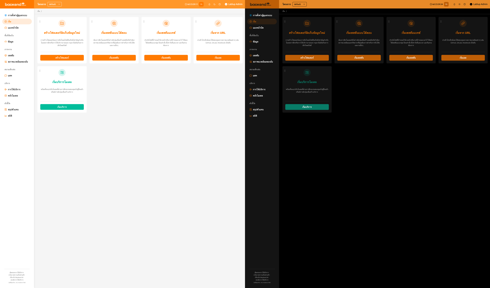
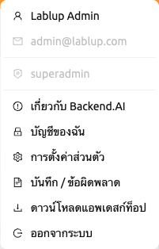
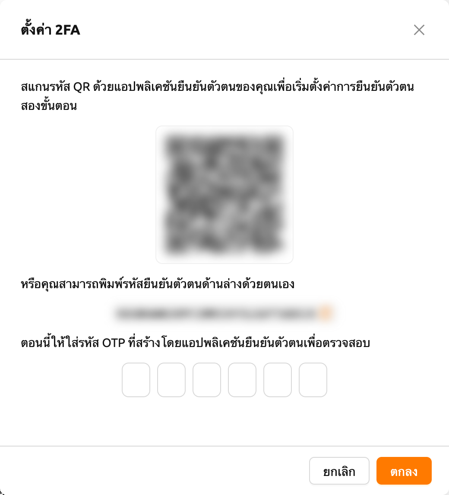
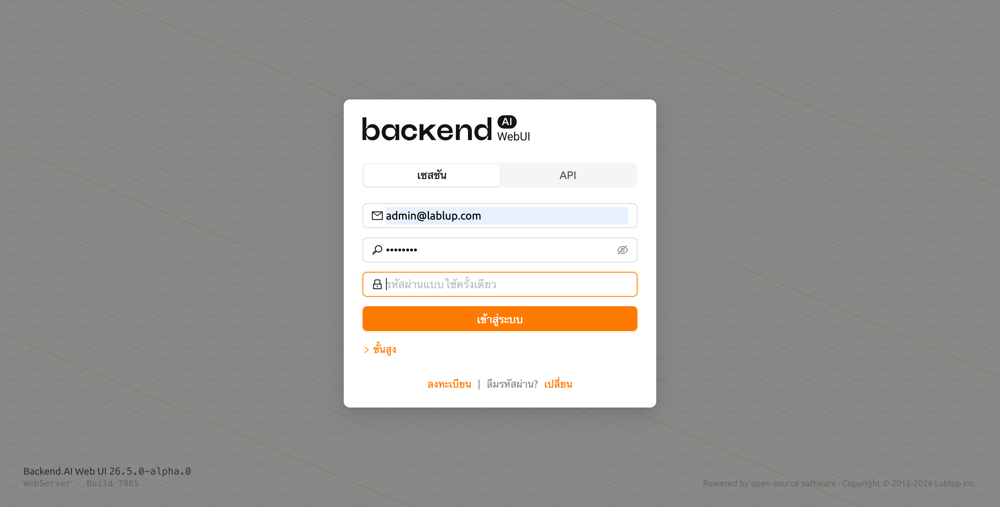
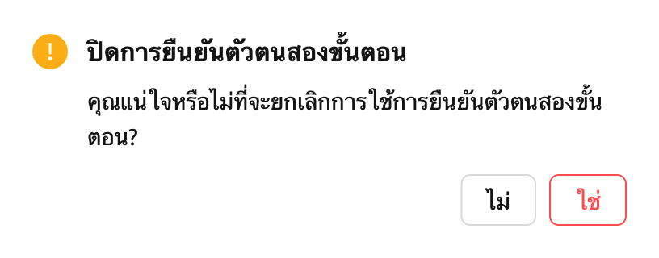

# คุณสมบัติแถบด้านบน

แถบด้านบนประกอบด้วยคุณสมบัติต่างๆ ที่สนับสนุนการใช้งาน WebUI

## ตัวเลือกโปรเจกต์

ผู้ใช้สามารถสลับระหว่างโปรเจกต์ได้โดยใช้ตัวเลือกโปรเจกต์ที่อยู่ในแถบด้านบน เนื่องจากแต่ละโปรเจกต์อาจมีนโยบายทรัพยากรที่แตกต่างกัน การสลับโปรเจกต์อาจเปลี่ยนนโยบายทรัพยากรที่ใช้ได้

## ตัวจับเวลาเซสชันการเข้าสู่ระบบ

เมื่อเปิดใช้งานการจัดการเซสชันการเข้าสู่ระบบ แถบด้านบนจะแสดงเวลาที่เหลือจนกระทั่งออกจากระบบอัตโนมัติพร้อมกับปุ่มขยายเวลา ตัวจับเวลาจะแสดงเวลาในรูปแบบ `HH:mm:ss` (หรือรวมจำนวนวันหากนานกว่า 24 ชั่วโมง)

คลิกปุ่มขยายเวลา (ไอคอนรีพีท) ข้างตัวจับเวลาเพื่อรีเซ็ตเวลาหมดอายุของเซสชันและขยายเวลาเซสชันการเข้าสู่ระบบ

:::note
ตัวจับเวลาเซสชันการเข้าสู่ระบบจะแสดงเฉพาะเมื่อเซิร์ฟเวอร์สนับสนุนการขยายเวลาเซสชันการเข้าสู่ระบบและเปิดใช้งานในการตั้งค่าระบบ
:::

## การแจ้งเตือน

ปุ่มรูประฆังคือปุ่มแจ้งเตือนเหตุการณ์ เหตุการณ์ที่ต้องบันทึกระหว่างการใช้งาน WebUI จะแสดงที่นี่ เมื่อมีงานเบื้องหลังกำลังทำงาน เช่น การสร้างเซสชันการคำนวณ คุณสามารถตรวจสอบงานได้ที่นี่
กดปุ่มลัด (`]`) เพื่อเปิดและปิดพื้นที่การแจ้งเตือน

## โหมดธีม

คุณสามารถเปลี่ยนโหมดธีมของ WebUI ผ่านปุ่มโหมดมืดที่ด้านขวาของส่วนหัว

## ช่วยเหลือ

คลิกปุ่มเครื่องหมายคำถามเพื่อเข้าถึงเอกสารคู่มือนี้ในเวอร์ชันเว็บ คุณจะถูกนำไปยังเอกสารที่เหมาะสมตามหน้าที่คุณกำลังดูอยู่

## เลย์เอาต์แบบตอบสนอง

บนหน้าจอขนาดเล็ก แถบด้านบนจะปรับเลย์เอาต์เพื่อเพิ่มความสะดวกในการใช้งาน เมื่อความกว้างหน้าจอแคบ ปุ่มไอคอนเมนูจะปรากฏในแถบด้านบนแทนปุ่มสลับแถบด้านข้าง ชื่อที่แสดงของผู้ใช้อาจถูกซ่อนโดยแสดงเฉพาะไอคอนอวาตาร์สำหรับเมนูผู้ใช้ บนหน้าจอที่เล็กมาก ข้อความป้ายกำกับโปรเจกต์จะถูกซ่อนด้วย

## เมนูผู้ใช้

คลิกไอคอนผู้ใช้ที่ด้านขวาของแถบด้านบนเพื่อดูเมนูผู้ใช้

ที่ด้านบนของดรอปดาวน์จะแสดงข้อมูลผู้ใช้ดังต่อไปนี้เพื่อเป็นข้อมูลอ้างอิง รายการเหล่านี้ไม่สามารถคลิกได้

- **ชื่อเต็ม**: ชื่อเต็มของผู้ใช้ปัจจุบัน
- **อีเมล**: ที่อยู่อีเมลของผู้ใช้ปัจจุบัน
- **บทบาท**: บทบาทของผู้ใช้ปัจจุบัน (เช่น ผู้ใช้, ผู้ดูแลโดเมน, ซุปเปอร์แอดมิน)

ด้านล่างข้อมูลผู้ใช้มีรายการการดำเนินการดังต่อไปนี้

- `เกี่ยวกับ Backend.AI`: แสดงข้อมูลเช่น เวอร์ชันของ Backend.AI WebUI ประเภทใบอนุญาต เป็นต้น
- `บัญชีของฉัน`: ตรวจสอบและอัปเดตข้อมูลของผู้ใช้ที่เข้าสู่ระบบอยู่
- `การตั้งค่าส่วนตัว`: ไปที่หน้าการตั้งค่าผู้ใช้
- `บันทึก / ข้อผิดพลาด`: ไปที่แท็บบันทึกในหน้าการตั้งค่าผู้ใช้ คุณสามารถตรวจสอบประวัติบันทึกและข้อผิดพลาดที่บันทึกไว้ฝั่งไคลเอนต์ได้
- `ดาวน์โหลดแอพเดสก์ท็อป`: ดาวน์โหลดแอป WebUI แบบสแตนด์อะโลนสำหรับแพลตฟอร์มของคุณ ตัวเลือกนี้แสดงเฉพาะเมื่อผู้ดูแลระบบเปิดใช้งาน
- `ออกจากระบบ`: ออกจากระบบ WebUI

### บัญชีของฉัน

หากคุณคลิก `บัญชีของฉัน` กล่องโต้ตอบต่อไปนี้จะปรากฏขึ้น

แต่ละรายการมีความหมายดังต่อไปนี้ ป้อนค่าที่ต้องการและคลิกปุ่ม `อัปเดต` เพื่ออัปเดตข้อมูลผู้ใช้

- **ชื่อเต็ม**: ชื่อผู้ใช้ (สูงสุด 64 ตัวอักษร)
- **รหัสผ่านเดิม**: รหัสผ่านเดิม คลิกปุ่มดูทางด้านขวาเพื่อดูเนื้อหาที่ป้อน
- **รหัสผ่านใหม่**: รหัสผ่านใหม่ (8 ตัวอักษรขึ้นไปที่มีตัวอักษร ตัวเลข และสัญลักษณ์อย่างน้อย 1 ตัว) คลิกปุ่มดูทางด้านขวาเพื่อดูเนื้อหาที่ป้อน
- **รหัสผ่านใหม่ (อีกครั้ง)**: ป้อนรหัสผ่านใหม่อีกครั้งเพื่อยืนยัน
- **เปิดใช้งาน 2FA**: การเปิดใช้งาน 2FA ผู้ใช้จำเป็นต้องป้อนรหัส OTP เมื่อเข้าสู่ระบบหากเปิดใช้งาน

:::note
ขึ้นอยู่กับการตั้งค่าปลั๊กอิน คอลัมน์ `2FA Enabled` อาจไม่แสดง
ในกรณีนี้โปรดติดต่อผู้ดูแลระบบ
:::

### การตั้งค่า 2FA

หากคุณเปิดใช้งานสวิตช์ `2FA Enabled` กล่องโต้ตอบต่อไปนี้จะปรากฏขึ้น

เปิดแอปพลิเคชัน 2FA ที่คุณใช้และสแกนรหัส QR หรือป้อนรหัสยืนยันด้วยตนเอง มีแอปพลิเคชันที่รองรับ 2FA หลายตัว เช่น Google Authenticator, 2STP, 1Password และ Bitwarden

จากนั้นให้ป้อนรหัส 6 หลักจากรายการที่เพิ่มไปยังแอปพลิเคชัน 2FA ของคุณในกล่องโต้ตอบด้านบน 2FA จะถูกเปิดใช้งานเมื่อคุณกดปุ่ม `ยืนยัน`

เมื่อคุณเข้าสู่ระบบในภายหลัง หากคุณใส่อีเมลและรหัสผ่าน จะมีฟิลด์เพิ่มเติมปรากฏขึ้นเพื่อขอรหัส OTP

ในการเข้าสู่ระบบ คุณต้องเปิดแอปพลิเคชัน 2FA และป้อนรหัส 6 หลักในช่องรหัสผ่านใช้ครั้งเดียว

หากคุณต้องการปิดใช้งาน 2FA ให้ปิดสวิตช์ `2FA Enabled` และคลิกปุ่มยืนยันในกล่องโต้ตอบที่ปรากฏขึ้น
