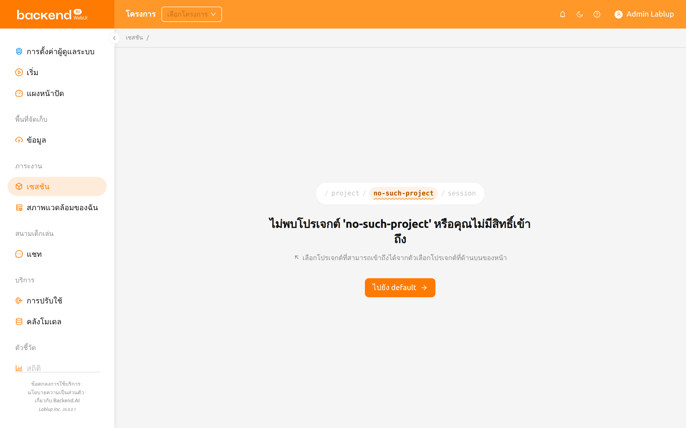
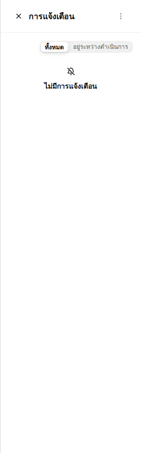
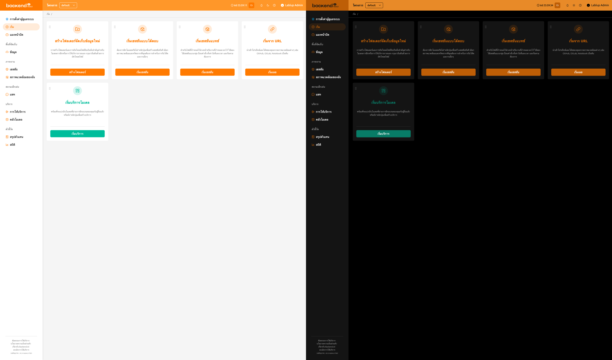
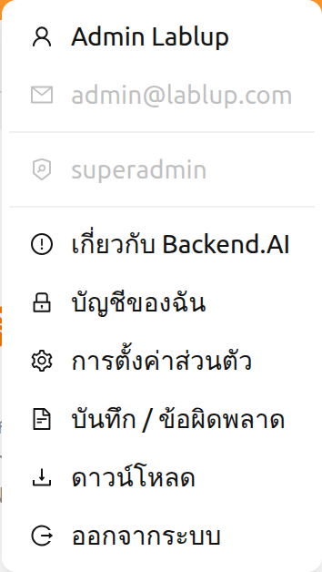
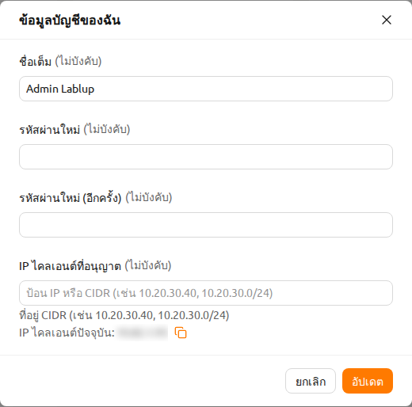
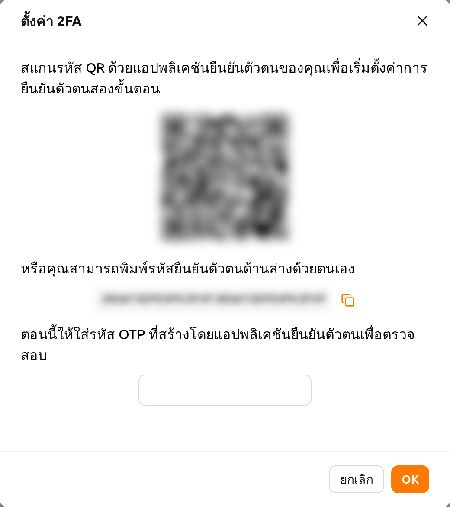
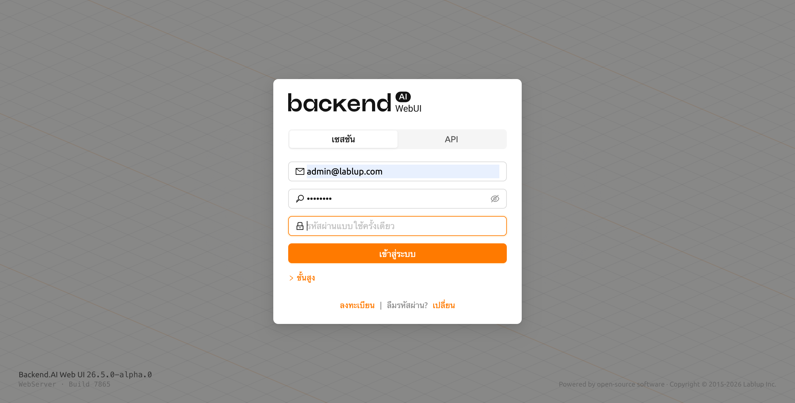
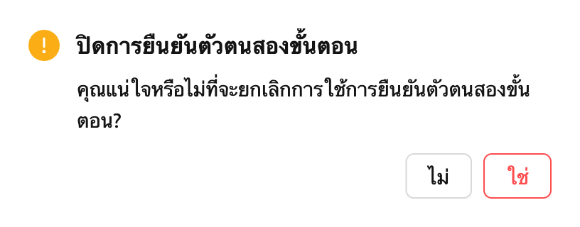
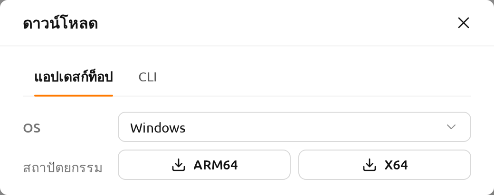
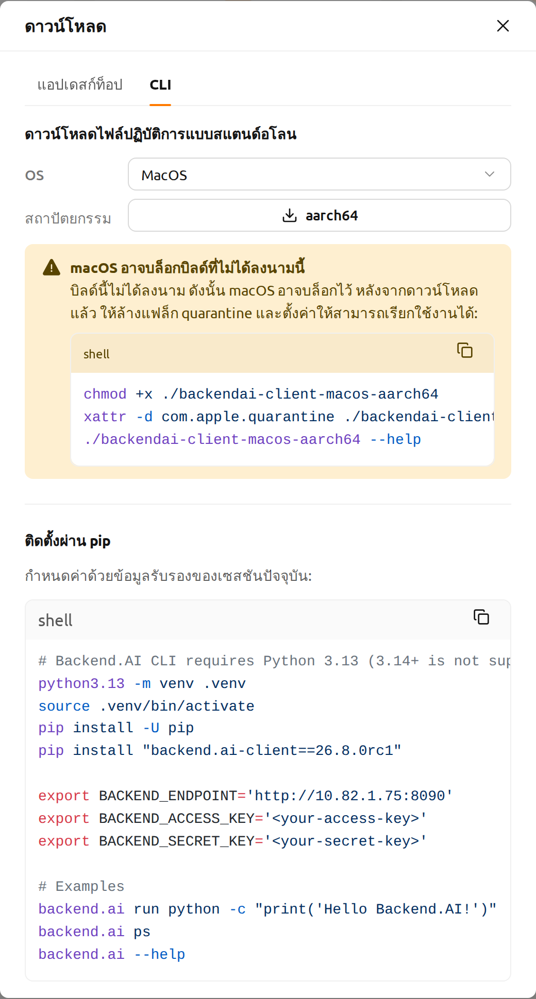

# คุณสมบัติแถบด้านบน

แถบด้านบนประกอบด้วยคุณสมบัติต่างๆ ที่สนับสนุนการใช้งาน WebUI

## ตัวเลือกโปรเจกต์

ผู้ใช้สามารถสลับระหว่างโปรเจกต์ได้โดยใช้ตัวเลือกโปรเจกต์ที่อยู่ในแถบด้านบน เนื่องจากแต่ละโปรเจกต์อาจมีนโยบายทรัพยากรที่แตกต่างกัน การสลับโปรเจกต์อาจเปลี่ยนนโยบายทรัพยากรที่ใช้ได้

ตัวเลือกโปรเจกต์จะแสดงรายการโปรเจกต์ที่คุณเข้าถึงได้
หากคุณเปิดที่อยู่ที่ระบุชื่อโปรเจกต์ซึ่งไม่มีอยู่จริงหรือคุณไม่มีสิทธิ์เข้าถึง ระบบจะไม่สลับไปยังโปรเจกต์อื่นโดยอัตโนมัติ
แต่ตัวเลือกโปรเจกต์จะแสดงสถานะที่ยังไม่ได้เลือก และหน้าจะอธิบายสิ่งที่เกิดขึ้น

- ข้อความที่แสดงคือ `ไม่พบโปรเจกต์ '<name>' หรือคุณไม่มีสิทธิ์เข้าถึง`
- ด้านล่างจะมีคำแนะนำให้เลือกโปรเจกต์ที่สามารถเข้าถึงได้จากตัวเลือกโปรเจกต์ที่ด้านบนของหน้า
- ปุ่ม `ไปยัง <project>` จะพาคุณไปยังโปรเจกต์ที่คุณเข้าถึงได้

หากคุณไม่ได้อยู่ในโปรเจกต์ใดเลย หน้าจะแสดง `ไม่มีโปรเจกต์ที่สามารถเข้าถึงได้` พร้อมกับ
`โปรดติดต่อผู้ดูแลระบบเพื่อขอสิทธิ์เข้าถึงโปรเจกต์`

:::note
ตัวเลือกโปรเจกต์จะไม่แสดงในหน้าของผู้ดูแลระบบภายใต้ **การตั้งค่าผู้ดูแลระบบ** (ที่อยู่ที่ขึ้นต้นด้วย `/admin/`)
เนื่องจากหน้าเหล่านี้ทำงานครอบคลุมทุกโปรเจกต์แทนที่จะทำงานภายในโปรเจกต์เดียว
แถบด้านบนจึงซ่อนตัวเลือกโปรเจกต์ไว้ขณะที่คุณอยู่ในหน้าเหล่านั้น โดยโปรเจกต์ที่คุณเลือกไว้จะไม่ถูกเปลี่ยนแปลง
เมื่อคุณออกจากหน้าของผู้ดูแลระบบ โปรเจกต์ที่เลือกไว้ก่อนหน้านี้จะยังคงถูกเลือกอยู่
ในกรณีที่หน้าของผู้ดูแลระบบจำเป็นต้องใช้โปรเจกต์ หน้าหรือกล่องโต้ตอบนั้นจะให้คุณระบุโปรเจกต์อย่างชัดเจน
ตัวอย่างเช่น กล่องโต้ตอบการสร้างโฟลเดอร์ในหน้าข้อมูลของผู้ดูแลระบบจะมีช่อง **โครงการปลายทาง**
และกล่องโต้ตอบการติดตั้งอิมเมจจะมีช่อง **โปรเจกต์ของเซสชันการติดตั้ง**
:::

## ตัวจับเวลาเซสชันการเข้าสู่ระบบ

เมื่อเปิดใช้งานการจัดการเซสชันการเข้าสู่ระบบ แถบด้านบนจะแสดงเวลาที่เหลือจนกระทั่งออกจากระบบอัตโนมัติพร้อมกับปุ่มขยายเวลา ตัวจับเวลาจะแสดงเวลาในรูปแบบ `HH:mm:ss` (หรือรวมจำนวนวันหากนานกว่า 24 ชั่วโมง)

คลิกปุ่มขยายเวลา (ไอคอนรีพีท) ข้างตัวจับเวลาเพื่อรีเซ็ตเวลาหมดอายุของเซสชันและขยายเวลาเซสชันการเข้าสู่ระบบ

:::note
ตัวจับเวลาเซสชันการเข้าสู่ระบบจะแสดงเฉพาะเมื่อเซิร์ฟเวอร์สนับสนุนการขยายเวลาเซสชันการเข้าสู่ระบบและเปิดใช้งานในการตั้งค่าระบบ
:::

## การแจ้งเตือน

ปุ่มรูประฆังคือปุ่มแจ้งเตือนเหตุการณ์ เหตุการณ์ที่ต้องบันทึกระหว่างการใช้งาน WebUI จะแสดงที่นี่ เมื่อมีงานเบื้องหลังกำลังทำงาน เช่น การสร้างเซสชันการคำนวณ คุณสามารถตรวจสอบงานได้ที่นี่
กดปุ่มลัด (`]`) เพื่อเปิดและปิดพื้นที่การแจ้งเตือน

## โหมดหน้าจอ

คุณสามารถเปลี่ยนโหมดหน้าจอของ WebUI ผ่านปุ่มโหมดสว่าง/โหมดมืด

## ช่วยเหลือ

คลิกปุ่มเครื่องหมายคำถามเพื่อเข้าถึงเอกสารคู่มือนี้ในเวอร์ชันเว็บ ลิงก์จะถูกสร้างขึ้นให้ตรงกับ WebUI ที่คุณกำลังใช้งาน

## เลย์เอาต์แบบตอบสนอง

บนหน้าจอขนาดเล็ก แถบด้านบนจะปรับเลย์เอาต์เพื่อเพิ่มความสะดวกในการใช้งาน เมื่อความกว้างหน้าจอแคบ ปุ่มไอคอนเมนูจะปรากฏในแถบด้านบนแทนปุ่มสลับแถบด้านข้าง ชื่อที่แสดงของผู้ใช้อาจถูกซ่อนโดยแสดงเฉพาะไอคอนอวาตาร์สำหรับเมนูผู้ใช้ บนหน้าจอที่เล็กมาก ข้อความป้ายกำกับโปรเจกต์จะถูกซ่อนด้วย

## เมนูผู้ใช้

คลิกไอคอนผู้ใช้ที่ด้านขวาของแถบด้านบนเพื่อดูเมนูผู้ใช้

ที่ด้านบนของดรอปดาวน์จะแสดงข้อมูลผู้ใช้ดังต่อไปนี้เพื่อเป็นข้อมูลอ้างอิง รายการเหล่านี้ไม่สามารถคลิกได้

- **ชื่อเต็ม**: ชื่อเต็มของผู้ใช้ปัจจุบัน
- **อีเมล**: ที่อยู่อีเมลของผู้ใช้ปัจจุบัน
- **บทบาท**: บทบาทของผู้ใช้ปัจจุบัน (เช่น ผู้ใช้, ซุปเปอร์แอดมิน)

ด้านล่างข้อมูลผู้ใช้มีรายการการดำเนินการดังต่อไปนี้

- `เกี่ยวกับ Backend.AI`: แสดงข้อมูลเช่น เวอร์ชันของ Backend.AI WebUI ประเภทใบอนุญาต เป็นต้น
- `บัญชีของฉัน`: ตรวจสอบและอัปเดตข้อมูลของผู้ใช้ที่เข้าสู่ระบบอยู่
- `การตั้งค่าส่วนตัว`: ไปที่หน้าการตั้งค่าผู้ใช้
- `บันทึก / ข้อผิดพลาด`: ไปที่แท็บบันทึกในหน้าการตั้งค่าผู้ใช้ คุณสามารถตรวจสอบประวัติบันทึกและข้อผิดพลาดที่บันทึกไว้ฝั่งไคลเอนต์ได้
- `ดาวน์โหลด`: เปิดกล่องโต้ตอบดาวน์โหลด ซึ่งคุณสามารถรับแอป WebUI สำหรับเดสก์ท็อปแบบสแตนด์อะโลน และอินเทอร์เฟซบรรทัดคำสั่ง (CLI) ของ Backend.AI ได้ ตัวเลือกนี้แสดงเฉพาะเมื่อผู้ดูแลระบบเปิดใช้งานอย่างน้อยหนึ่งอย่างจากสองอย่างนี้
- `ออกจากระบบ`: ออกจากระบบ WebUI

### บัญชีของฉัน

หากคุณคลิก `บัญชีของฉัน` กล่องโต้ตอบข้อมูลบัญชีของฉันจะปรากฏขึ้น

แต่ละรายการมีความหมายดังต่อไปนี้ ป้อนค่าที่ต้องการและคลิกปุ่ม `อัปเดต`
เพื่ออัปเดตข้อมูลผู้ใช้

- **ชื่อเต็ม**: ชื่อผู้ใช้ (สูงสุด 64 ตัวอักษร)
- **รหัสผ่านใหม่**: รหัสผ่านใหม่ (8 ตัวอักษรขึ้นไปที่มีตัวอักษร ตัวเลข
  และสัญลักษณ์อย่างน้อย 1 ตัว) คลิกไอคอนรูปตาเพื่อแสดงเนื้อหาที่ป้อน
- **รหัสผ่านใหม่ (อีกครั้ง)**: ป้อนรหัสผ่านใหม่อีกครั้งเพื่อยืนยัน
- **IP ไคลเอนต์ที่อนุญาต**: จำกัดการเข้าถึงการเข้าสู่ระบบเฉพาะที่อยู่ IP
  หรือช่วง CIDR ที่กำหนด ป้อนที่อยู่ IP หรือสัญกรณ์ CIDR หนึ่งรายการขึ้นไป
  (เช่น `10.20.30.40`, `10.20.30.0/24`) ด้านล่างฟิลด์จะแสดง IP ไคลเอนต์
  ปัจจุบันของคุณพร้อมปุ่มคัดลอกเพื่อความสะดวก หากรายการที่กำหนดไม่รวม IP
  ปัจจุบันของคุณ จะแสดงคำเตือน
- **เปิดใช้งาน 2FA แล้ว**: เปิดหรือปิดใช้งานการยืนยันตัวตนสองขั้นตอน
  เมื่อเปิดใช้งาน คุณต้องป้อนรหัส OTP เมื่อเข้าสู่ระบบ

:::note
ขึ้นอยู่กับการตั้งค่าปลั๊กอิน ฟิลด์ `เปิดใช้งาน 2FA แล้ว` อาจไม่แสดง
ในกรณีนี้โปรดติดต่อผู้ดูแลระบบ
:::

### การตั้งค่า 2FA

หากคุณเปิดใช้งานสวิตช์ `2FA Enabled` กล่องโต้ตอบต่อไปนี้จะปรากฏขึ้น

เปิดแอปพลิเคชัน 2FA ที่คุณใช้และสแกนรหัส QR หรือป้อนรหัสยืนยันด้วยตนเอง มีแอปพลิเคชันที่รองรับ 2FA หลายตัว เช่น Google Authenticator, 2STP, 1Password และ Bitwarden

จากนั้นให้ป้อนรหัส 6 หลักจากรายการที่เพิ่มไปยังแอปพลิเคชัน 2FA ของคุณในกล่องโต้ตอบด้านบน 2FA จะถูกเปิดใช้งานเมื่อคุณกดปุ่ม `ยืนยัน`

เมื่อคุณเข้าสู่ระบบในภายหลัง หากคุณใส่อีเมลและรหัสผ่าน จะมีฟิลด์เพิ่มเติมปรากฏขึ้นเพื่อขอรหัส OTP

ในการเข้าสู่ระบบ คุณต้องเปิดแอปพลิเคชัน 2FA และป้อนรหัส 6 หลักในช่องรหัสผ่านใช้ครั้งเดียว

หากคุณต้องการปิดใช้งาน 2FA ให้ปิดสวิตช์ `2FA Enabled` และคลิกปุ่มยืนยันในกล่องโต้ตอบที่ปรากฏขึ้น

### ดาวน์โหลด

เมื่อเลือก `ดาวน์โหลด` จะเปิดกล่องโต้ตอบที่มีแท็บหนึ่งแท็บสำหรับแต่ละรายการที่ผู้ดูแลระบบเปิดใช้งานไว้
ได้แก่ `แอปเดสก์ท็อป` และ `CLI`

ในแท็บ `แอปเดสก์ท็อป` ให้เลือกระบบปฏิบัติการของคุณในช่อง **OS** จากนั้นคลิกปุ่มที่ตรงกับสถาปัตยกรรม CPU
ของคุณเพื่อเริ่มดาวน์โหลด แอปแบบสแตนด์อะโลนช่วยให้คุณใช้ WebUI เดียวกันได้โดยไม่ต้องใช้เบราว์เซอร์

แท็บ `CLI` มีสองวิธีในการเริ่มใช้งานไคลเอนต์บรรทัดคำสั่ง

- **ดาวน์โหลดไฟล์ปฏิบัติการแบบสแตนด์อโลน**: เลือกระบบปฏิบัติการของคุณ จากนั้นคลิกปุ่มที่ตรงกับ
  สถาปัตยกรรม CPU ของคุณ มีบิลด์สำหรับ Linux และ macOS หลังจากดาวน์โหลดแล้ว ให้รันคำสั่งที่แสดงอยู่
  ใต้ปุ่มเพื่อตั้งค่าให้ไฟล์สามารถเรียกใช้งานได้ และหากต้องการ สามารถติดตั้งเป็น `backend.ai` ไว้บน `PATH` ได้
  สำหรับ macOS กล่องโต้ตอบจะแสดงวิธีล้างแฟล็ก quarantine ก่อนแทน เนื่องจากบิลด์ยังไม่ได้ลงนาม
- **ติดตั้งผ่าน pip**: สคริปต์ที่พร้อมใช้งานซึ่งสร้างสภาพแวดล้อมเสมือนของ Python ติดตั้งไคลเอนต์เวอร์ชัน
  ที่ตรงกับเซิร์ฟเวอร์ที่คุณเชื่อมต่ออยู่ และตั้งค่าตัวแปรสภาพแวดล้อมที่ไคลเอนต์ต้องการ ใช้ปุ่มคัดลอกที่มุมขวาบน
  ของสคริปต์เพื่อคัดลอกทั้งบล็อก

:::note
สคริปต์จะเติมปลายทาง (endpoint) ของเซสชันปัจจุบันให้ แต่จะไม่แสดงข้อมูลรับรองของคุณ
โปรดแทนที่ `<your-access-key>` และ `<your-secret-key>` ด้วยคีย์แพร์ของคุณเองก่อนรัน
นอกจากนี้สคริปต์ยังกำหนดให้ใช้ Python 3.13 ซึ่งเป็นเวอร์ชันที่ไคลเอนต์ต้องการ
:::
