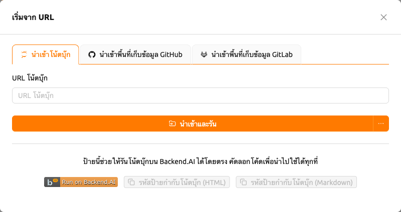
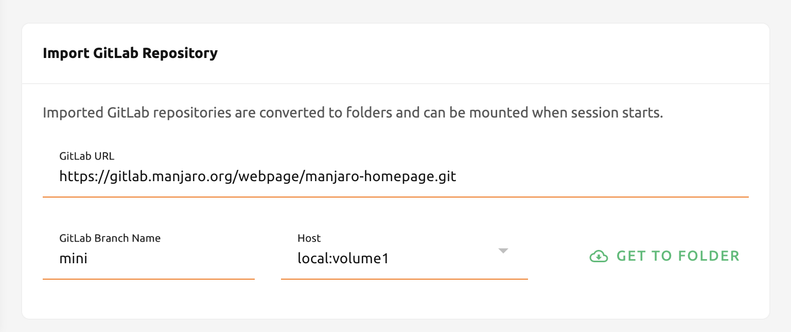

# นำเข้าและรันโน้ตบุ๊คและที่เก็บ Git แบบเว็บ

On the 'Import & Run' page, Backend.AI รองรับการรันไฟล์ Jupyter notebook และการนำเข้าคลัง Git ที่เป็นเว็บ เช่น GitHub และ GitLab ได้อย่างทันที คุณไม่จำเป็นต้องสร้างหรือดาวน์โหลดไปยังที่เก็บข้อมูลในเครื่องแล้วอัปโหลดอีกครั้ง สิ่งที่คุณต้องทำคือป้อน URL ที่ถูกต้องที่คุณต้องการรันหรือ นำเข้า และคลิกที่ปุ่มด้านขวา

## นำเข้าและรันสมุดบันทึก Jupyter

To import Jupyter notebooks and run, you need one thing, the valid URL for the notebook file.
For example, if you want execute Jupyter notebook that's in github, you can copy and paste
the URL and click 'IMPORT & RUN' button.

:::note
เมื่อคุณพยายามนำเข้าและเรียกใช้งานไฟล์ Jupyter notebook ด้วยที่อยู่ภายในเครื่อง มันจะถูกถือว่าไม่ถูกต้อง คุณต้องป้อน URL ที่ไม่เริ่มต้นจาก localhost
:::

After clicking the button, the dialog appears. This is a session launcher dialog same as
when you starts the session at Sessions page or Summary page. Difference between import notebook
and starting a new session is that import notebook automatically imports Jupyter notebook in the
URL, but simple starting a new session doesn't do that. the rest is same. Click 'LAUNCH' button to
the notebook after setting the environments and resource allocation as needed.

:::note
The pop-up blocker must be turned off before clicking 'LAUNCH' button to immediately
see the running notebook window. Also, if there's not enough resources to execute the session,
imported Jupyter notebook will not run.
:::

You can see the importing operation is successfully completed in Sessions page.

## Create executable Jupyter notebook button

You can also create HTML or Markdown button about Jupyter notebook URL, too.
Input a valid Jupyter notebook URL and click 'CREATE' button. It will show code blocks that directly
links to creating a session with notebook. You can see the badge code working by inserting it in
the GitHub repositories or where it supports html or markdown.

:::note
your account must be logined before clicking the button. Otherwise, you have to login first.
:::

## Importing GitHub Repositories

Importing a GitHub repository is similar to import and running Jupyter notebook.
All you have to do is to fill out with github repository URL and click 'GET TO
FOLDER' button. If you can access to more than one storage host, you can select one from the list.

:::note
If there are not enough resources to start a session or folder count is at
the limit, then importing repository will fail. Please check resource
statistics panel and Data & Storage page before importing the repository.
:::

You can see the repository is successfully imported as a data folder with its
name.

## Importing GitLab Repositories

From 22.03, Backend.AI supports importing from GitLab. It's almost the same as
[Importing GitHub Repositories](#importing-github-repositories),
but you need to explicitly set the branch name to import.

:::note
If there's data folder that has the same name already, the system will append
`_` (underscore) and number in the imported repository folder.
:::