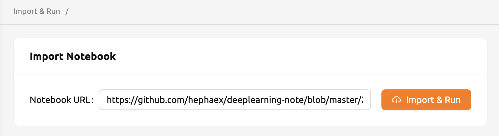
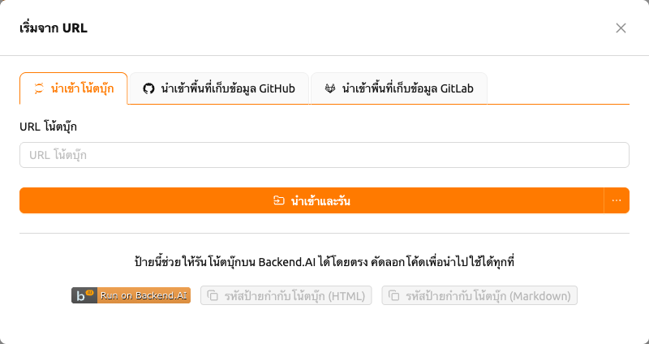
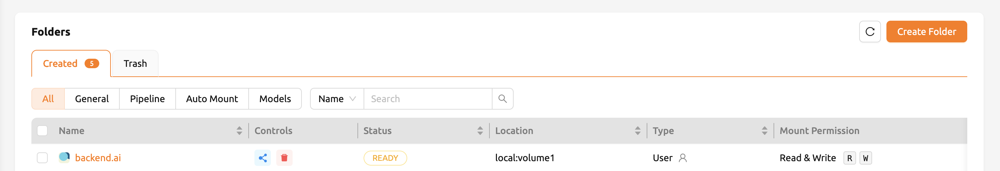

# นำเข้าและรันโน้ตบุ๊กและที่เก็บ Git แบบเว็บ

ในหน้า `นำเข้าและรัน` Backend.AI รองรับการรันไฟล์ Jupyter notebook และการนำเข้าคลัง Git ที่เป็นเว็บ เช่น GitHub และ GitLab ได้อย่างทันที คุณไม่จำเป็นต้องสร้างหรือดาวน์โหลดไปยังที่เก็บข้อมูลในเครื่องแล้วอัปโหลดอีกครั้ง สิ่งที่คุณต้องทำคือป้อน URL ที่ถูกต้องที่คุณต้องการรันหรือนำเข้า และคลิกที่ปุ่มด้านขวา

## นำเข้าและรันสมุดบันทึก Jupyter

ในการนำเข้าและรัน Jupyter notebook คุณต้องมี URL ที่ถูกต้องของไฟล์ notebook
ตัวอย่างเช่น หากคุณต้องการรัน Jupyter notebook ที่อยู่บน GitHub คุณสามารถคัดลอกและวาง
URL แล้วคลิกปุ่ม `นำเข้าและรัน`

:::note
เมื่อคุณพยายามนำเข้าและเรียกใช้งานไฟล์ Jupyter notebook ด้วยที่อยู่ภายในเครื่อง มันจะถูกถือว่าไม่ถูกต้อง คุณต้องป้อน URL ที่ไม่เริ่มต้นจาก localhost
:::

หลังจากคลิกปุ่ม `นำเข้าและรัน` เซสชันจะถูกสร้างขึ้นโดยตรงด้วยการตั้งค่าเริ่มต้น คุณไม่จำเป็นต้องกำหนดค่าตัวเปิดเซสชันด้วยตนเอง ไฟล์ notebook จะถูกดาวน์โหลดลงในเซสชันโดยอัตโนมัติผ่าน URL ที่คุณระบุ

หากคุณต้องการปรับแต่งสภาพแวดล้อมหรือการจัดสรรทรัพยากรก่อนเริ่มใช้งาน ให้คลิกปุ่มดรอปดาวน์ถัดจาก `นำเข้าและรัน` แล้วเลือก `เริ่มด้วยตัวเลือก` ซึ่งจะเปิดหน้าตัวเปิดเซสชันแบบเต็มที่คุณสามารถปรับการตั้งค่าก่อนเริ่มเซสชันได้

:::note
ต้องปิดตัวบล็อกป๊อปอัพเพื่อดูหน้าต่าง notebook ที่กำลังทำงานทันที นอกจากนี้ หากไม่มีทรัพยากรเพียงพอในการรันเซสชัน Jupyter notebook ที่นำเข้าจะไม่ทำงาน
:::

คุณจะเห็นว่าการนำเข้าเสร็จสมบูรณ์ในหน้าเซสชัน

## สร้างป้ายกำกับ Jupyter notebook ที่สามารถรันได้

คุณยังสามารถสร้าง badge HTML หรือ Markdown สำหรับ URL ของ Jupyter notebook ได้
ป้อน URL ของ Jupyter notebook ที่ถูกต้อง แล้วคลิกปุ่มคัดลอก `รหัสป้ายกำกับโน้ตบุ๊ก (HTML)` หรือ
`รหัสป้ายกำกับโน้ตบุ๊ก (Markdown)` เพื่อคัดลอกรหัส badge ไปยังคลิปบอร์ด
รหัส badge จะสร้างลิงก์ที่เปิดเซสชันพร้อมกับ notebook โดยตรง
คุณสามารถใช้รหัส badge โดยแทรกลงใน GitHub repositories หรือที่ใดก็ตามที่รองรับ HTML หรือ Markdown

:::note
บัญชีของคุณต้องเข้าสู่ระบบก่อนคลิกปุ่ม มิฉะนั้นคุณต้องเข้าสู่ระบบก่อน
:::

## การนำเข้ารีโพซิทอรี GitHub

การนำเข้า GitHub repository คล้ายกับการนำเข้าและรัน Jupyter notebook
สิ่งที่คุณต้องทำคือกรอก URL ของ GitHub repository เลือกโฮสต์จัดเก็บจากเมนู
`โฮสต์ที่เก็บข้อมูล` แล้วคลิกปุ่ม `นำเข้าไปยังโฟลเดอร์`

การคลิก `นำเข้าไปยังโฟลเดอร์` จะสร้างโฟลเดอร์จัดเก็บด้วยชื่อ repository โดยอัตโนมัติ และเริ่มเซสชันแบบ batch เพื่อดาวน์โหลดและแตกไฟล์เนื้อหา repository ลงในโฟลเดอร์นั้น

:::note
หากไม่มีทรัพยากรเพียงพอในการเริ่มเซสชันหรือจำนวนโฟลเดอร์ถึงขีดจำกัด การนำเข้า repository จะล้มเหลว กรุณาตรวจสอบแผงสถิติทรัพยากรและหน้าข้อมูล & ที่จัดเก็บก่อนนำเข้า repository
:::

คุณจะเห็นว่า repository ถูกนำเข้าเป็นโฟลเดอร์จัดเก็บพร้อมชื่อของมันสำเร็จแล้ว

## การนำเข้ารีโพซิทอรี GitLab

ตั้งแต่เวอร์ชัน 22.03 Backend.AI รองรับการนำเข้าจาก GitLab ซึ่งเกือบเหมือนกับ
[การนำเข้า GitHub Repositories](#importing-github-repositories)
แต่คุณต้องตั้งค่าชื่อ branch ที่จะนำเข้าอย่างชัดเจน

:::note
หากมีโฟลเดอร์จัดเก็บที่มีชื่อเดียวกันอยู่แล้ว ระบบจะเพิ่ม `_` (ขีดล่าง) และตัวเลขในชื่อโฟลเดอร์ repository ที่นำเข้า
:::
