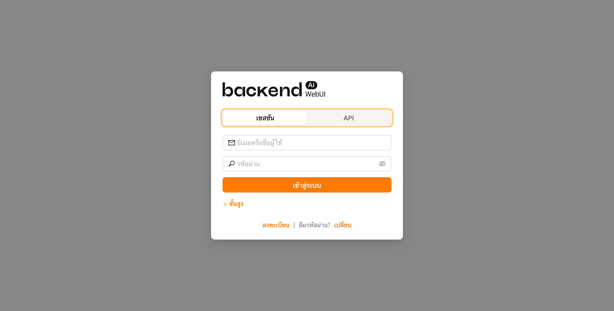
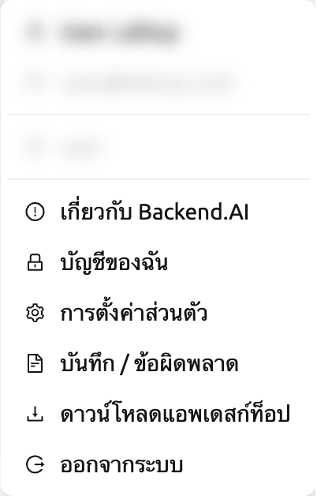
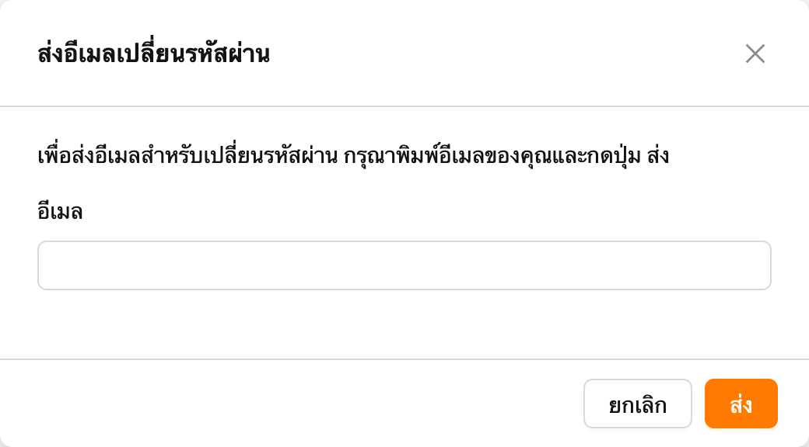
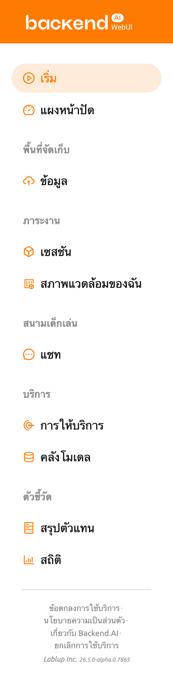

# Sign up and Log in

## Sign up

When you launch the WebUI, log in dialog appears. If you haven't signed up
yet, press the SIGN UP button.

กรอกข้อมูลที่จำเป็น อ่านและยอมรับข้อกำหนดในการให้บริการ / นโยบายความเป็นส่วนตัว และคลิกปุ่ม SIGNUP ขึ้นอยู่กับการตั้งค่าของระบบของคุณ อาจต้องกรอกโทเค็นการเชิญเพื่อสมัครสมาชิก อีเมลยืนยันอาจถูกส่งเพื่อยืนยันว่าอีเมลนั้นเป็นของคุณ หากมีการส่งอีเมลยืนยัน คุณจะต้องอ่านอีเมลและคลิกลิงก์ภายในเพื่อผ่านการตรวจสอบก่อนที่คุณจะสามารถเข้าสู่ระบบด้วยบัญชีของคุณได้

   ขึ้นอยู่กับการตั้งค่าเซิร์ฟเวอร์และการตั้งค่าปลั๊กอิน อาจไม่อนุญาตให้ผู้ใช้ที่ไม่ระบุตัวตนลงทะเบียน ในกรณีนี้โปรดติดต่อผู้ดูแลระบบของระบบของคุณ

   เพื่อป้องกันไม่ให้ผู้ใช้ที่ไม่หวังดีเดารหัสผ่านของผู้ใช้ รหัสผ่านควรมีความยาวมากกว่า 8 ตัวอักษร และมีอักขระหนึ่งตัวขึ้นไปที่เป็นตัวอักษร, ตัวเลข, และอักขระพิเศษ

## Log in

ป้อนID และรหัสผ่านของคุณแล้วกดปุ่ม LOGIN ใน API ENDPOINT ควรป้อน URL ของ Backend.AI Webserver ซึ่งจะทำการส่งต่อคำขอไปยังผู้จัดการ

   ขึ้นอยู่กับการติดตั้งและสภาพแวดล้อมการตั้งค่าของ Webserver อาจมีการกำหนดสถานะของ endpoint และไม่สามารถปรับแต่งได้

   Backend.AI เก็บรหัสผ่านของผู้ใช้ไว้เป็นอย่างดีผ่านการแฮชแบบทางเดียว โดยใช้ BCrypt ซึ่งเป็นแฮชรหัสผ่านเริ่มต้นของ BSD ดังนั้นแม้แต่ผู้ดูแลเซิร์ฟเวอร์ก็ไม่สามารถทราบรหัสผ่านของผู้ใช้ได้

After logging in, you can check the information of the current resource usage in
the สรุป tab.

โดยการคลิกที่ไอคอนในมุมขวาบน คุณจะเห็นเมนูย่อย คุณสามารถออกจากระบบได้โดยการเลือกเมนูออกจากระบบ

## เมื่อคุณลืมรหัสผ่านของคุณ

If you have forgotten your password, you can click the CHANGE PASSWORD button on
the log in panel to email a link to change password. You can change your password
by reading and following the instruction. Depending on the server settings, the
password change feature may be disabled. In this case, contact the
ผู้ดูแลระบบistrator.

   นี่เป็นฟีเจอร์แบบโมดูลาร์ ดังนั้นการเปลี่ยนรหัสผ่านอาจไม่เป็นไปได้ในบางระบบ

   If log in failure occurs more than 10 times consecutively, access
   to the endpoint is temporarily restricted for 20 minutes for security
   reasons. If the access restriction continues on more than 20 minutes, please contact
   your system ผู้ดูแลระบบistrator.

## เมนูแถบด้านข้าง

เปลี่ยนขนาดของแถบด้านข้างผ่านปุ่มที่ด้านขวาของแถบด้านข้าง คลิกที่มันเพื่อทำให้ความกว้างของแถบด้านข้างลดลงอย่างมาก ทำให้คุณมองเห็นเนื้อหาของมันได้กว้างขึ้น การคลิกอีกครั้งจะทำให้แถบด้านข้างกลับไปที่ความกว้างเดิม
You can also use the shortcut key ( `[` ) to toggle between the narrow and original sidebar widths.

