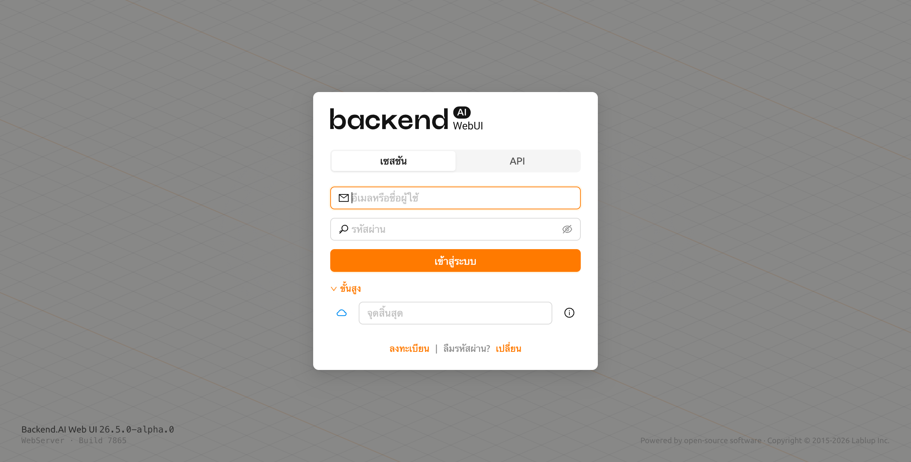
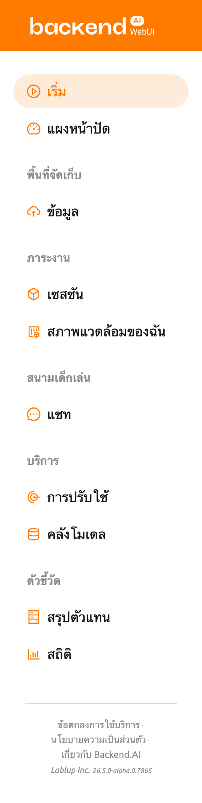

# ลงทะเบียนและเข้าสู่ระบบ

## ลงทะเบียน

เมื่อคุณเปิด WebUI กล่องโต้ตอบเข้าสู่ระบบจะปรากฏขึ้น หากคุณยังไม่ได้ลงทะเบียน ให้คลิกลิงก์ `ลงทะเบียน` ที่ด้านล่างของกล่องโต้ตอบ

กรอกข้อมูลที่จำเป็น อ่านและยอมรับข้อกำหนดในการให้บริการ / นโยบายความเป็นส่วนตัว และคลิกปุ่ม `ลงทะเบียน` ขึ้นอยู่กับการตั้งค่าของระบบ อาจต้องกรอกโทเค็นการเชิญเพื่อลงทะเบียน อีเมลยืนยันอาจถูกส่งเพื่อยืนยันว่าอีเมลนั้นเป็นของคุณ หากมีการส่งอีเมลยืนยัน คุณจะต้องอ่านอีเมลและคลิกลิงก์ภายในเพื่อผ่านการตรวจสอบก่อนที่จะสามารถเข้าสู่ระบบด้วยบัญชีของคุณได้

:::note
ขึ้นอยู่กับการตั้งค่าเซิร์ฟเวอร์และการตั้งค่าปลั๊กอิน อาจไม่อนุญาตให้ผู้ใช้ที่ไม่ระบุตัวตนลงทะเบียน ในกรณีนี้โปรดติดต่อผู้ดูแลระบบของคุณ
:::

:::note
เพื่อป้องกันไม่ให้ผู้ใช้ที่ไม่หวังดีเดารหัสผ่านของผู้ใช้ รหัสผ่านต้องมีความยาวมากกว่า 8 ตัวอักษร และมีตัวอักษร ตัวเลข และอักขระพิเศษอย่างน้อยอย่างละ 1 ตัว
:::

## เข้าสู่ระบบ

ป้อนอีเมล (หรือชื่อผู้ใช้) และรหัสผ่าน จากนั้นคลิกปุ่ม **เข้าสู่ระบบ**

### โหมดการเชื่อมต่อ

หากผู้ดูแลระบบเปิดใช้งาน ตัวเลือกโหมดจะปรากฏที่ด้านบนของกล่องโต้ตอบเข้าสู่ระบบ ให้คุณเลือกระหว่างโหมด **เซสชัน** และโหมด **API**

- **เซสชัน**: โหมดเข้าสู่ระบบมาตรฐาน ป้อนอีเมล/ชื่อผู้ใช้และรหัสผ่านเพื่อยืนยันตัวตน โหมดนี้เป็นโหมดเริ่มต้นสำหรับผู้ใช้ส่วนใหญ่
- **API**: เข้าสู่ระบบโดยใช้คีย์แพร์ API ป้อน **API Key** และ **Secret Key** แทนอีเมลและรหัสผ่าน โหมดนี้เหมาะสำหรับการเข้าถึงแบบโปรแกรม

### API Endpoint

คลิกลิงก์ **ขั้นสูง** เพื่อขยายส่วนการตั้งค่า endpoint ในฟิลด์ API Endpoint ให้ป้อน URL ของ Backend.AI Webserver ที่ทำหน้าที่ส่งต่อคำขอไปยัง Manager

:::note
ขึ้นอยู่กับการติดตั้งและสภาพแวดล้อมการตั้งค่าของ Webserver อาจมีการกำหนดค่า endpoint ไว้แล้วและไม่สามารถปรับแต่งได้
:::

:::note
Backend.AI เก็บรหัสผ่านของผู้ใช้อย่างปลอดภัยผ่านการแฮชแบบทางเดียว โดยใช้ BCrypt ซึ่งเป็นแฮชรหัสผ่านเริ่มต้นของ BSD ดังนั้นแม้แต่ผู้ดูแลเซิร์ฟเวอร์ก็ไม่สามารถทราบรหัสผ่านของผู้ใช้ได้
:::

### SSO เข้าสู่ระบบ (SAML / OpenID)

หากผู้ดูแลระบบได้ตั้งค่า SSO (Single Sign-On) ปุ่มเข้าสู่ระบบเพิ่มเติมอาจปรากฏด้านล่างปุ่ม **เข้าสู่ระบบ** มาตรฐาน

- **เข้าสู่ระบบด้วย SAML**: ยืนยันตัวตนโดยใช้ผู้ให้บริการระบุตัวตน SAML ขององค์กร
- **เข้าสู่ระบบด้วย [ชื่อ Realm]**: ยืนยันตัวตนโดยใช้ผู้ให้บริการ OpenID Connect ป้ายกำกับปุ่มจะแสดงชื่อ realm ที่ผู้ดูแลระบบกำหนดไว้

คลิกปุ่ม SSO ที่เหมาะสมเพื่อเปลี่ยนเส้นทางไปยังผู้ให้บริการระบุตัวตนขององค์กรเพื่อยืนยันตัวตน

:::note
ตัวเลือกเข้าสู่ระบบ SSO จะแสดงเฉพาะเมื่อผู้ดูแลระบบเปิดใช้งานเท่านั้น
:::

### OTP เข้าสู่ระบบ (การยืนยันตัวตนสองขั้นตอน)

หากเปิดใช้งานการยืนยันตัวตนสองขั้นตอน (2FA) สำหรับบัญชีของคุณ ฟิลด์ OTP (รหัสผ่านใช้ครั้งเดียว) จะปรากฏเพิ่มเติมหลังจากที่คุณป้อนอีเมลและรหัสผ่าน

เปิดแอปพลิเคชันยืนยันตัวตน (เช่น Google Authenticator, 1Password หรือ Bitwarden) และป้อนรหัส 6 หลักในฟิลด์ OTP เพื่อเข้าสู่ระบบ

### การตั้งค่า TOTP เมื่อเข้าสู่ระบบครั้งแรก

หากผู้ดูแลระบบกำหนดให้ใช้การยืนยันตัวตนสองขั้นตอนและคุณยังไม่ได้ตั้งค่า TOTP กล่องโต้ตอบการตั้งค่าจะปรากฏโดยอัตโนมัติหลังจากเข้าสู่ระบบสำเร็จครั้งแรก สแกนรหัส QR ด้วยแอปพลิเคชันยืนยันตัวตนหรือป้อนคีย์ที่ให้มาด้วยตนเอง จากนั้นป้อนรหัสยืนยัน 6 หลักเพื่อดำเนินการตั้งค่าให้เสร็จสิ้น

หลังจากตั้งค่า TOTP แล้ว คุณจะต้องป้อนรหัส OTP ทุกครั้งที่เข้าสู่ระบบ

:::note
สำหรับรายละเอียดเพิ่มเติมเกี่ยวกับการเปิดหรือปิดใช้งาน 2FA จากการตั้งค่าบัญชี โปรดดูส่วน [การตั้งค่า 2FA](#2fa-setup) ในคุณสมบัติแถบด้านบน
:::

หลังจากเข้าสู่ระบบ คุณสามารถตรวจสอบข้อมูลการใช้ทรัพยากรปัจจุบันได้ที่หน้าเริ่มต้น

คลิกไอคอนผู้ใช้ที่มุมขวาบนเพื่อดูเมนูผู้ใช้ คุณสามารถออกจากระบบได้โดยเลือกเมนู **ออกจากระบบ**

## เมื่อคุณลืมรหัสผ่าน

หากคุณลืมรหัสผ่าน ให้คลิกข้อความ **ลืมรหัสผ่าน?** และลิงก์ **เปลี่ยน** ในแผงเข้าสู่ระบบ กล่องโต้ตอบจะปรากฏขึ้นเพื่อให้คุณป้อนที่อยู่อีเมลเพื่อรับลิงก์เปลี่ยนรหัสผ่าน ทำตามคำแนะนำในอีเมลเพื่อรีเซ็ตรหัสผ่าน

:::note
ขึ้นอยู่กับการตั้งค่าเซิร์ฟเวอร์ ฟีเจอร์การเปลี่ยนรหัสผ่านอาจไม่พร้อมใช้งาน ในกรณีนี้โปรดติดต่อผู้ดูแลระบบ
:::

:::warning
หากเข้าสู่ระบบล้มเหลวมากกว่า 10 ครั้งติดต่อกัน การเข้าถึง endpoint จะถูกจำกัดชั่วคราวเป็นเวลา 20 นาทีด้วยเหตุผลด้านความปลอดภัย หากการจำกัดการเข้าถึงยังคงดำเนินต่อไปหลังจาก 20 นาที โปรดติดต่อผู้ดูแลระบบ
:::

## เมนูแถบด้านข้าง

เปลี่ยนขนาดของแถบด้านข้างผ่านปุ่มที่ด้านขวาของแถบด้านข้าง คลิกเพื่อลดความกว้างของแถบด้านข้างอย่างมาก ทำให้คุณมองเห็นเนื้อหาได้กว้างขึ้น การคลิกอีกครั้งจะทำให้แถบด้านข้างกลับไปที่ความกว้างเดิม
คุณสามารถใช้ปุ่มลัด ( `[` ) เพื่อสลับระหว่างแถบด้านข้างแบบแคบและความกว้างเดิมได้

