<a id="model-serving"></a>

# การให้บริการโมเดล

## บริการโมเดล


:::note
ฟีเจอร์นี้รองรับเฉพาะในเวอร์ชัน Enterprise เท่านั้น
:::

Backend.AI ไม่เพียงแต่อำนวยความสะดวกในการสร้างสภาพแวดล้อมการพัฒนา
และการจัดการทรัพยากรในช่วงการฝึกโมเดล แต่ยังสนับสนุน
ฟีเจอร์บริการโมเดลตั้งแต่เวอร์ชัน 23.09 เป็นต้นไป ฟีเจอร์นี้ช่วยให้
ผู้ใช้ปลายทาง (เช่น แอพมือถือและ backend ของเว็บเซอร์วิสที่ใช้ AI) สามารถเรียก
inference API ได้เมื่อต้องการ deploy โมเดลที่เสร็จสมบูรณ์แล้วเป็น
บริการ inference


บริการโมเดลขยายฟังก์ชันการทำงานของเซสชันการคอมพิวเตอร์การฝึกอบรมที่มีอยู่ โดยช่วยให้การบำรุงรักษา การปรับขนาดอัตโนมัติ และการแมพตำแหน่งพอร์ตและที่อยู่เอ็นด์พอยต์ถาวรสำหรับบริการการผลิต ทำให้ผู้พัฒนาหรือผู้ดูแลระบบจำเป็นต้องระบุพารามิเตอร์การปรับขนาดที่จำเป็นสำหรับบริการโมเดล โดยไม่จำเป็นต้องสร้างหรือลบเซสชันการคอมพิวเตอร์ด้วยตนเอง

## การกำหนดค่าและข้อจำกัดของบริการโมเดลในเวอร์ชัน 23.03 และก่อนหน้า

แม้ว่าฟีเจอร์เฉพาะสำหรับการให้บริการโมเดลจะได้รับการสนับสนุนอย่างเป็นทางการตั้งแต่
เวอร์ชัน 23.09 แต่คุณยังคงสามารถใช้บริการโมเดลในเวอร์ชันก่อนหน้าได้

ตัวอย่างเช่น ในเวอร์ชัน 23.03 คุณสามารถกำหนดค่าบริการโมเดลโดย
การแก้ไขเซสชันการคำนวณสำหรับการฝึกอบรมในวิธีต่อไปนี้:

1. Add pre-opened ports during session creation to map the running
   server port inside the session for model serving.
   (For instructions on how to use preopen ports, refer to [Set Preopen Ports](#set-preopen-ports).)

2. Check 'Open app to public' to allow the service mapped to the
   pre-opened port to be publicly accessible.
   (For detailed information about "Open app to public," refer to [Open app to public](#open-app-to-public).)

However, there are certain limitations in version 23.03:

-  เซสชันจะไม่ฟื้นคืนโดยอัตโนมัติหากถูกยกเลิกเนื่องจากปัจจัยภายนอกเช่นเวลาไม่ทำงานหรือตัวบกพร่องของระบบ
-  พอร์ตของแอปจะเปลี่ยนทุกครั้งที่เริ่มเซสชันใหม่
-  หากเซสชันถูกรีสตาร์ทซ้ำๆ พอร์ตที่ไม่ได้ใช้งานอาจหมดลง

The official บริการโมเดล feature in version 23.09 resolves these
limitations. Therefore, starting from version 23.09, it is recommended
to create/manage บริการโมเดลs through the model serving menu whenever
possible. The use of pre-opened ports is recommended only for
development and testing purposes.

## คู่มือสำหรับขั้นตอนการใช้งานบริการโมเดล

เพื่อใช้บริการโมเดล คุณต้องปฏิบัติตามขั้นตอนด้านล่างนี้:

1. สร้างไฟล์กำหนดโมเดล
2. สร้างไฟล์กำหนดบริการ
3. อัปโหลดไฟล์กำหนดไปยังโฟลเดอร์ประเภทโมเดล
4. สร้าง/ตรวจสอบบริการโมเดล
5. (ถ้าบริการโมเดลไม่เป็นสาธารณะ) รับโทเค็น
6. (สำหรับผู้ใช้ปลายทาง) เข้าถึงจุดสุดท้ายที่สอดคล้องกับบริการโมเดลเพื่อตรวจสอบบริการ
7. (ถ้าจำเป็น) ปรับเปลี่ยนบริการโมเดล
8. (ถ้าจำเป็น) ยกเลิกบริการโมเดล

<a id="model-definition-guide"></a>

#### การสร้างไฟล์กำหนดรูปแบบโมเดล

:::note
ตั้งแต่เวอร์ชัน 24.03 คุณสามารถกำหนดชื่อไฟล์กำหนดโมเดลได้ หากคุณไม่ได้
ป้อนฟิลด์อื่นใดในเส้นทางไฟล์กำหนดโมเดล ระบบจะถือว่าเป็น `model-definition.yml`
หรือ `model-definition.yaml`
:::

ไฟล์การกำหนดโมเดลประกอบด้วยข้อมูลการกำหนดค่าที่ระบบ Backend.AI ต้องการเพื่อเริ่มต้น อ初始化 และปรับขนาดเซสชันการสรุปผลโดยอัตโนมัติ มันถูกเก็บในโฟลเดอร์ประเภทโมเดลแยกต่างหากจากภาพคอนเทนเนอร์ที่มีเอนจินการบริการการสรุปผล ซึ่งอนุญาตให้เอนจินให้บริการโมเดลที่แตกต่างกันตามความต้องการเฉพาะและกำจัดความจำเป็นในการสร้างและปรับใช้ภาพคอนเทนเนอร์ใหม่ทุกครั้งที่โมเดลเปลี่ยน โดยการโหลดการกำหนดโมเดลและข้อมูลโมเดลจากที่เก็บข้อมูลบนเครือข่าย กระบวนการปรับใช้สามารถทำให้เรียบง่ายและถูกปรับปรุงในระหว่างการปรับขนาดอัตโนมัติ

ไฟล์นิยามโมเดลมีรูปแบบดังนี้:

```yaml
models:
  - name: "simple-http-server"
    model_path: "/models"
    service:
      start_command:
        - python
        - -m
        - http.server
        - --directory
        - /home/work
        - "8000"
      port: 8000
      health_check:
        path: /
        interval: 10.0
        max_retries: 10
        max_wait_time: 15.0
        expected_status_code: 200
        initial_delay: 60.0
```

**คำอธิบายคู่คีย์-ค่า สำหรับไฟล์กำหนดแบบจำลอง**

:::note
ฟิลด์ที่ไม่มีเครื่องหมาย "(Required)" เป็นตัวเลือก
:::

- `name` (Required): Defines the name of the model.
- `model_path` (Required): Addresses the path of where model is defined.
- `service`: Item for organizing information about the files to be served
  (includes command scripts and code).

   - `pre_start_actions` : Item for organizing preceding commands or actions to be executed before the `start_command`.

      - `action`: Further information and description is in [Prestart Actions](#prestart-actions).
      - `args/*`: Further information and description is in [Prestart Actions](#prestart-actions).

   - `start_command` (Required): Specify the command to be executed in model serving.
     Can be a string or a list of strings.
   - `port` (Required): Container port for the model service (e.g., `8000`, `8080`).
   - `health_check`: การกำหนดค่าสำหรับการตรวจสอบสุขภาพของบริการโมเดลเป็นระยะ
     เมื่อได้รับการกำหนดค่าแล้ว ระบบจะตรวจสอบโดยอัตโนมัติว่าบริการตอบสนองอย่างถูกต้อง
     และลบอินสแตนซ์ที่ไม่มีสุขภาพดีออกจากการเส้นทางการรับส่งข้อมูล

      - `path` (จำเป็น): เส้นทาง HTTP endpoint สำหรับคำขอตรวจสอบสุขภาพ (เช่น `/health`, `/v1/health`)
      - `interval` (ค่าเริ่มต้น: `10.0`): เวลาเป็นวินาทีระหว่างการตรวจสอบสุขภาพต่อเนื่อง
      - `max_retries` (ค่าเริ่มต้น: `10`): จำนวนความล้มเหลวต่อเนื่องที่ได้รับอนุญาตก่อนที่จะทำเครื่องหมาย
        บริการเป็น `UNHEALTHY` บริการจะยังคงได้รับการรับส่งข้อมูลจนกว่าจะเกินเกณฑ์นี้
      - `max_wait_time` (ค่าเริ่มต้น: `15.0`): เวลาหมดเวลาเป็นวินาทีสำหรับแต่ละคำขอ HTTP ตรวจสอบสุขภาพ
        หากไม่ได้รับการตอบกลับภายในเวลานี้ การตรวจสอบจะถือว่าล้มเหลว
      - `expected_status_code` (ค่าเริ่มต้น: `200`): รหัสสถานะ HTTP ที่บ่งชี้ว่าการตอบกลับมีสุขภาพดี
        ค่าทั่วไป: `200` (OK), `204` (No Content)
      - `initial_delay` (ค่าเริ่มต้น: `60.0`): เวลาเป็นวินาทีที่รอหลังจากสร้างคอนเทนเนอร์
        ก่อนที่จะเริ่มการตรวจสอบสุขภาพ สิ่งนี้ให้เวลาสำหรับการโหลดโมเดล การเตรียม GPU
        และการอุ่นเครื่องบริการ ตั้งค่าที่สูงขึ้นสำหรับโมเดลขนาดใหญ่ (เช่น `300.0` สำหรับ LLMs 70B+)


**ความเข้าใจพฤติกรรมการตรวจสอบสุขภาพ**

ระบบการตรวจสอบสุขภาพจะตรวจสอบคอนเทนเนอร์บริการโมเดลแต่ละตัวและจัดการ
การเส้นทางการรับส่งข้อมูลโดยอัตโนมัติตามสถานะสุขภาพ

```
Container Created
│
▼
┌─────────────────────────────────┐
│  Wait for initial_delay (60s)   │  ← Model loading, GPU init, warmup
│  Status: DEGRADED               │
│  No health checks during this   │
└─────────────────────────────────┘
│
▼
Start Health Check Cycle
│
▼
┌─────────────────────────────────┐
│  Every interval (10s):          │
│  HTTP GET → path ("/health")    │
└─────────────────────────────────┘
│
▼
Wait up to max_wait_time (15s)
│
┌──────────┴──────────┐
▼                     ▼
Response              Timeout/Error
│                     │
▼                     │
Status ==             │
expected?             │
│                     │
┌──┴──┐               │
▼     ▼               │
Y     N               │
│     │               │
│     └───────┬───────┘
│             ▼
│        Consecutive
│        failures +1
│             │
▼             ▼
HEALTHY       Failures > max_retries?
(reset                │
failures)       ┌─────┴─────┐
                ▼           ▼
               Yes          No
                │           │
                ▼           ▼
            UNHEALTHY    Keep current
            (removed     status
            from traffic
            internally)
```

:::note
สถานะสุขภาพภายใน (ใช้สำหรับการเส้นทางการรับส่งข้อมูล) อาจไม่ถูก
ซิงโครไนซ์ทันทีกับสถานะที่แสดงในส่วนติดต่อผู้ใช้
:::

**เวลาจนถึง UNHEALTHY**:

- การเริ่มต้นครั้งแรก: `initial_delay + interval × (max_retries + 1)`

  ตัวอย่างกับค่าเริ่มต้น: 60 + 10 × 11 = **170 วินาที** (ประมาณ 3 นาที)

- ระหว่างการทำงาน (หลังจากสุขภาพดีแล้ว): `interval × (max_retries + 1)`

  ตัวอย่างกับค่าเริ่มต้น: 10 × 11 = **110 วินาที** (ประมาณ 2 นาที)


<a id="prestart-actions"></a>

**Description for service action supported in Backend.AI Model serving**


- `write_file`: This is an action to create a file with the given
  file name and append control to it. the default access permission is `644`.

   - `arg/filename`: ระบุชื่อไฟล์
   - `body`: ระบุเนื้อหาที่จะเพิ่มลงในไฟล์
   - `mode`: ระบุสิทธิ์การเข้าถึงไฟล์
   - `append`: ตั้งค่าว่าจะเขียนทับหรือผนวกเนื้อหาลงในไฟล์เป็น `True` หรือ `False`

- `write_tempfile`: นี่คือการดำเนินการเพื่อสร้างไฟล์ด้วยชื่อไฟล์ชั่วคราว (`.py`) และผนวกเนื้อหาเข้าไป หากไม่ได้ระบุค่าสำหรับ mode สิทธิ์การเข้าถึงเริ่มต้นจะเป็น `644`

   - `body`: ระบุเนื้อหาที่จะเพิ่มลงในไฟล์
   - `mode`: ระบุสิทธิ์การเข้าถึงไฟล์

- `run_command`: ผลลัพธ์จากการดำเนินการคำสั่ง รวมถึงข้อผิดพลาดใดๆ จะถูกส่งกลับในรูปแบบต่อไปนี้ (`out`: ผลลัพธ์จากการดำเนินการคำสั่ง, `err`: ข้อความแสดงข้อผิดพลาดหากเกิดข้อผิดพลาดขึ้นระหว่างการดำเนินการคำสั่ง)

   - `args/command`: ระบุคำสั่งที่จะดำเนินการเป็นอาร์เรย์ (เช่น คำสั่ง `python3 -m http.server 8080` กลายเป็น ["python3", "-m", "http.server", "8080"])

- `mkdir`: นี่คือการดำเนินการเพื่อสร้างไดเรกทอรีตามเส้นทางที่ระบุ

   - `args/path`: ระบุเส้นทางเพื่อสร้างไดเรกทอรี

- `log`: นี่คือการดำเนินการเพื่อพิมพ์ล็อกตามข้อความที่ระบุ

   - `args/message`: ระบุข้อความที่จะแสดงในล็อก
   - `debug`: ตั้งค่าเป็น `True` หากอยู่ในโหมดดีบัก มิฉะนั้นตั้งค่าเป็น `False`

#### การอัปโหลดไฟล์กำหนดโมเดลไปยังโฟลเดอร์ประเภทโมเดล

เพื่ออัปโหลดไฟล์กำหนดโมเดล (`model-definition.yml`) ไปยังโฟลเดอร์ประเภทโมเดล คุณต้องสร้างโฟลเดอร์เสมือน เมื่อสร้างโฟลเดอร์เสมือน ให้เลือกประเภท `model` แทนประเภท `general` เริ่มต้น โปรดอ้างถึงส่วนเกี่ยวกับ [การสร้างโฟลเดอร์จัดเก็บ](#create-storage-folder) ในหน้า Data สำหรับคำแนะนำเกี่ยวกับวิธีสร้างโฟลเดอร์

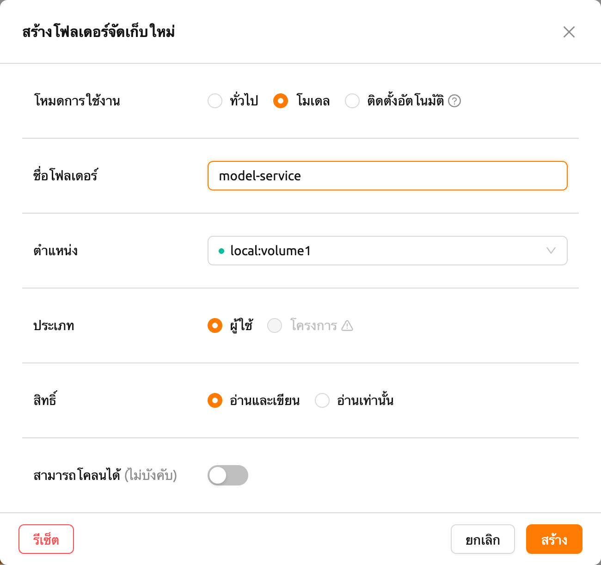

หลังจากสร้างโฟลเดอร์แล้ว ให้เลือกแท็บ 'MODELS' ในหน้า Data คลิกไอคอนโฟลเดอร์ประเภทโมเดลที่สร้างขึ้นล่าสุดเพื่อเปิดตัวสำรวจโฟลเดอร์ และอัปโหลดไฟล์กำหนดโมเดล สำหรับข้อมูลเพิ่มเติมเกี่ยวกับวิธีใช้ตัวสำรวจโฟลเดอร์ โปรดอ้างถึงส่วน [สำรวจโฟลเดอร์](#explore-folder)

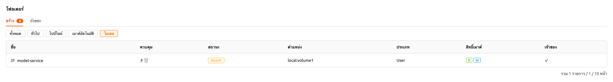


<a id="service-definition-file"></a>

#### การสร้างไฟล์กำหนดบริการ

ไฟล์กำหนดบริการ (`service-definition.toml`) ช่วยให้ผู้ดูแลระบบสามารถกำหนดค่าทรัพยากร สภาพแวดล้อม และการตั้งค่าเวลาทำงานที่จำเป็นสำหรับบริการโมเดลล่วงหน้า เมื่อไฟล์นี้อยู่ในโฟลเดอร์โมเดล ระบบจะใช้การตั้งค่าเหล่านี้เป็นค่าเริ่มต้นเมื่อสร้างบริการ

ทั้ง `model-definition.yaml` และ `service-definition.toml` ต้องอยู่ในโฟลเดอร์โมเดลเพื่อเปิดใช้งานปุ่ม "Run this model" ในหน้า Model Store ไฟล์ทั้งสองทำงานร่วมกัน: ไฟล์กำหนดโมเดลระบุการกำหนดค่าโมเดลและเซิร์ฟเวอร์อนุมาน ในขณะที่ไฟล์กำหนดบริการระบุสภาพแวดล้อมเวลาทำงาน การจัดสรรทรัพยากร และตัวแปรสภาพแวดล้อม

ไฟล์กำหนดบริการใช้รูปแบบ TOML โดยมีส่วนต่างๆ จัดตามรูปแบบเวลาทำงาน แต่ละส่วนกำหนดลักษณะเฉพาะของบริการ:

```toml
[vllm.environment]
image        = "example.com/model-server:latest"
architecture = "x86_64"

[vllm.resource_slots]
cpu = 1
mem = "8gb"
"cuda.shares" = "0.5"

[vllm.environ]
MODEL_NAME = "example-model-name"
```

**คำอธิบายคู่คีย์-ค่า สำหรับไฟล์กำหนดบริการ**

- `[{runtime}.environment]`: ระบุภาพคอนเทนเนอร์และสถาปัตยกรรมสำหรับบริการโมเดล

   - `image` (จำเป็น): เส้นทางเต็มของภาพคอนเทนเนอร์ที่ใช้สำหรับบริการอนุมาน (เช่น `example.com/model-server:latest`)
   - `architecture` (จำเป็น): สถาปัตยกรรม CPU ของภาพคอนเทนเนอร์ (เช่น `x86_64`, `aarch64`)

- `[{runtime}.resource_slots]`: กำหนดทรัพยากรการคำนวณที่จัดสรรให้กับบริการโมเดล

   - `cpu`: จำนวนคอร์ CPU ที่จะจัดสรร (เช่น `1`, `2`, `4`)
   - `mem`: จำนวนหน่วยความจำที่จะจัดสรร รองรับคำต่อท้ายหน่วย (เช่น `"8gb"`, `"16gb"`)
   - `"cuda.shares"`: ส่วนแบ่ง GPU เศษส่วน (fGPU) ที่จะจัดสรร (เช่น `"0.5"`, `"1.0"`) ค่านี้ใส่เครื่องหมายคำพูดเนื่องจากคีย์มีจุด

- `[{runtime}.environ]`: ตั้งค่าตัวแปรสภาพแวดล้อมที่จะส่งผ่านไปยังคอนเทนเนอร์บริการอนุมาน

   - คุณสามารถกำหนดตัวแปรสภาพแวดล้อมใดๆ ที่จำเป็นสำหรับเวลาทำงาน เช่น `MODEL_NAME` มักใช้เพื่อระบุโมเดลที่จะโหลด

:::note
คำนำหน้า `{runtime}` ในแต่ละส่วนหัวสอดคล้องกับชื่อรูปแบบเวลาทำงาน (เช่น `vllm`, `nim`, `custom`) ระบบจะจับคู่คำนำหน้านี้กับรูปแบบเวลาทำงานที่เลือกเมื่อสร้างบริการ
:::

:::note
เมื่อบริการถูกสร้างขึ้นจาก Model Store โดยใช้ปุ่ม "Run this model" การตั้งค่าจาก `service-definition.toml` จะถูกนำไปใช้โดยอัตโนมัติ หากคุณต้องการปรับการจัดสรรทรัพยากรในภายหลัง คุณสามารถแก้ไขบริการผ่านหน้า Model Serving
:::

#### การสร้าง/ตรวจสอบบริการโมเดล

เมื่ออัปโหลดไฟล์กำหนดโมเดลไปยังโฟลเดอร์เสมือนของประเภทโมเดลแล้ว คุณก็พร้อมที่จะสร้างบริการโมเดล

คลิกปุ่ม 'Start Service' ในหน้า Model Serving ซึ่งจะเปิดหน้าที่คุณสามารถใส่การตั้งค่าที่จำเป็นสำหรับการสร้างบริการ

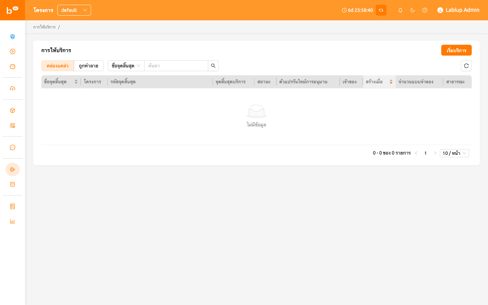

ขั้นแรก ให้ระบุชื่อบริการ สำหรับคำอธิบายรายละเอียดของแต่ละรายการ โปรดอ้างถึงสิ่งต่อไปนี้:

-  เปิดสู่สาธารณะ: ตัวเลือกนี้อนุญาตให้เข้าถึงบริการโมเดลโดยไม่ต้องใช้โทเค็นแยกต่างหากบนเซิร์ฟเวอร์ที่จะเป็นโฮสต์บริการ โดยค่าเริ่มต้นจะถูกปิดใช้งาน
-  Model Storage To Mount: นี่คือโฟลเดอร์โมเดลที่จะเมาต์ ซึ่งประกอบด้วยไฟล์กำหนดโมเดลภายในไดเรกทอรี
-  Inference Runtime Variant: สิ่งนี้แบ่งประเภทของโมเดลออกเป็นสี่ประเภท: `vLLM`, `NVIDIA NIM`, `Predefined Image Command`, `Custom`, `Predefined Image Command`, `Custom`.

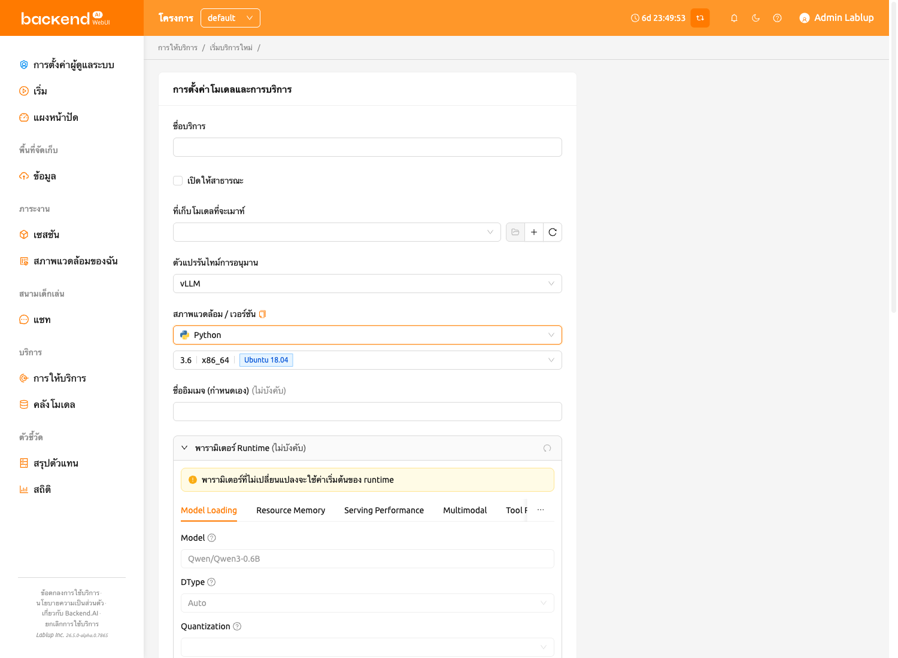

For example, if you choose `vLLM` or `NVIDIA NIM` or `Predefined Image Command` as a runtime variant of model service,
there's no need to configure a `model-definition` file in your model folder to mount. Instead, you might have to set an additional environment variable.
For more information, please take a look at
[Model Variant: Easily Serving Various Model Services](https://www.backend.ai/blog/2024-07-10-various-ways-of-model-serving).

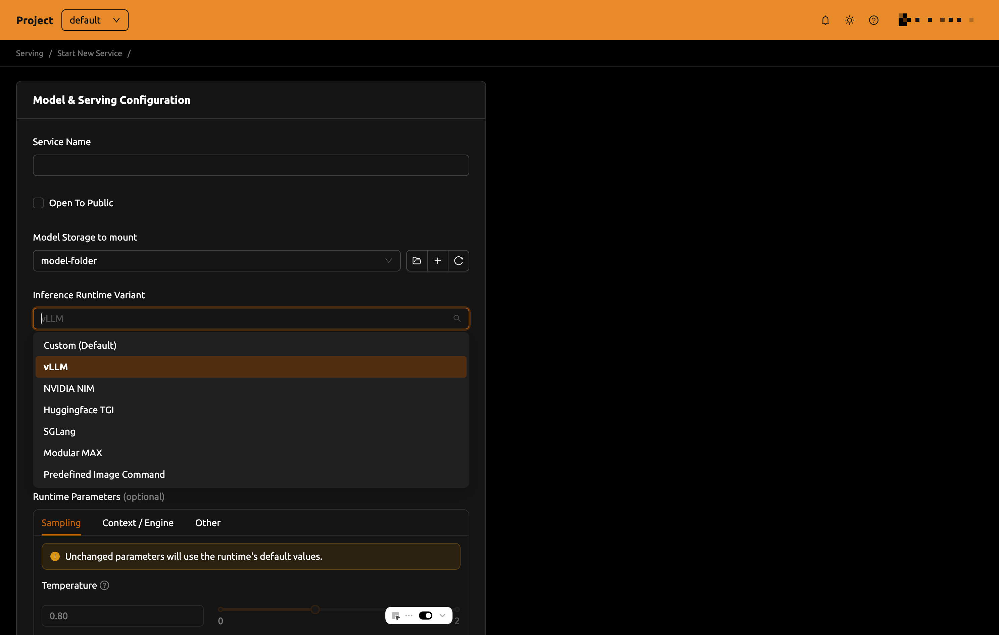

-  Model Destination For Model Folder: This option allows aliasing path of
   model storage path to session corresponding to routing, which represents
   the service. default value is `/models`.
-  Model Definition File Path: You can also set model definition file as you
   uploaded in model storage path. The default value is `model-definition.yaml`.
-  Additional Mounts: Likewise session, service provides additional mounts.
   Please make sure that only you can mount general/data usage mode folder, not additional
   model folder.


Then set number of replicas and select environments and resource group. The resource group is a collection of
resources that can be allocated to the model service.

-  Number of replicas: This setting serves as the basis for determining the number
   of routing sessions to maintain for the current service. If you change the value of this
   setting, the manager can create a new replica session or terminate a running session
   by referring to the number of existing replica sessions.
-  Environment / Version: You can configure the execution environment
   for the dedicated server of the model service. Currently, even if the
   service has multiple routings, it will be executed in a single
   environment only. (Support for multiple execution environments will
   be added in a future update)

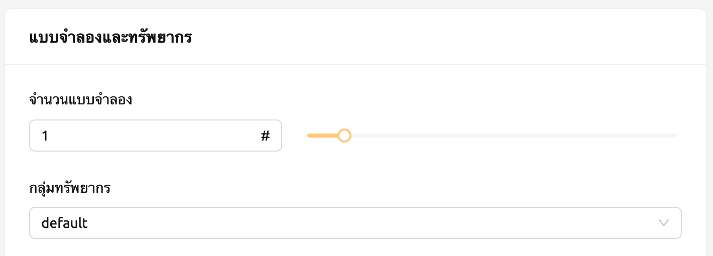

-  Resource Presets: Allows you to select the amount of resources to allocate from the model service.
   Resource contains CPU, RAM, and AI accelerator, as known as GPU.

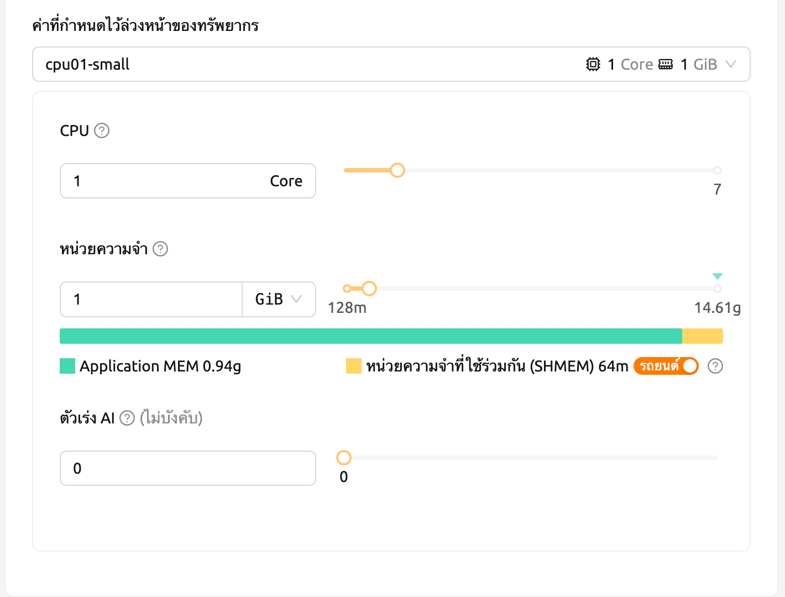

-  Single Node: When running a session, the managed node and worker nodes are
   placed on a single physical node or virtual machine.
-  Multi Node: When running a session, one managed node and one or more worker
   nodes are split across multiple physical nodes or virtual machines.
-  Variable: In this section, you can set environment variable when starting a model service.
   It is useful when you trying to create a model service using runtime variant. some runtime variant needs
   certain environment variable setting before execution.

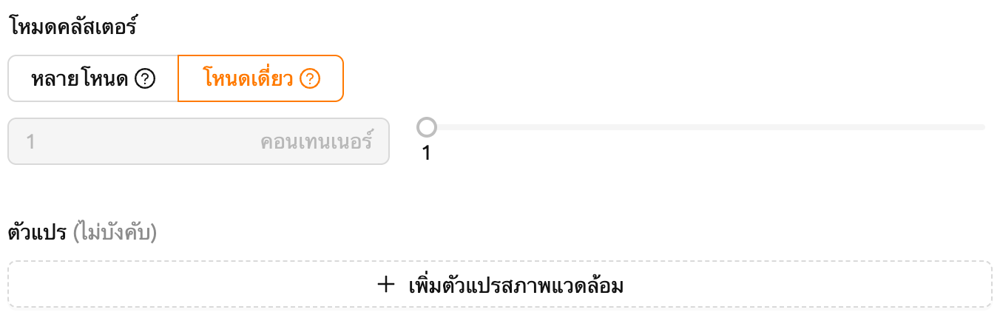

Before creating model service, Backend.AI supports validation feature to check
whether execution is available or not(due to any errors during execution).
By clicking the 'Validate' button at the bottom-left of the service launcher,
a new popup for listening to validation events will pop up. In the popup modal,
you can check the status through the container log. When the result is set to
`Finished`, then the validation check is finished.


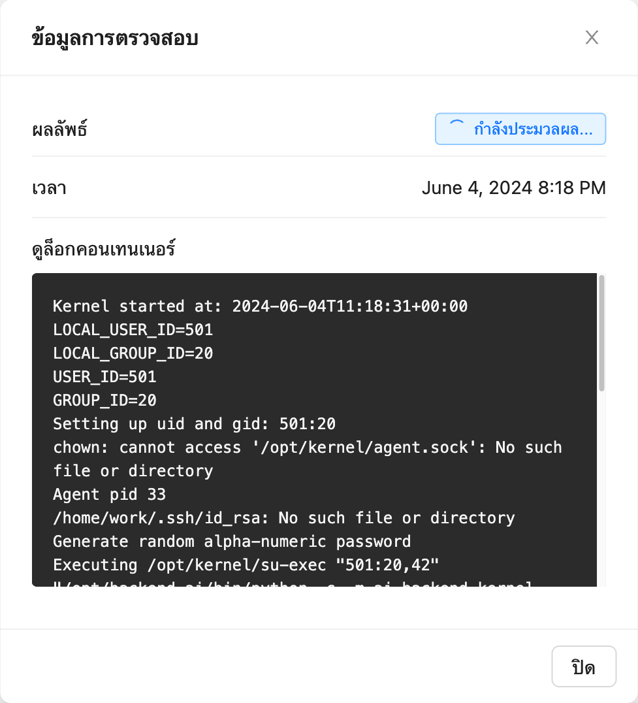


:::note
The result `Finished` doesn't guarantee that the execution is successfully done.
Instead, please check the container log.
:::


**Handling Failed Model Service Creation**

If the status of the model service remains `UNHEALTHY`, it indicates
that the model service cannot be executed properly.

The common reasons for creation failure and their solutions are as
follows:

-  Insufficient allocated resources for the routing when creating the
   model service

   -  Solution: Terminate the problematic service and recreate it with
      an allocation of more sufficient resources than the previous
      settings.

-  Incorrect format of the model definition file (`model-definition.yml`)

   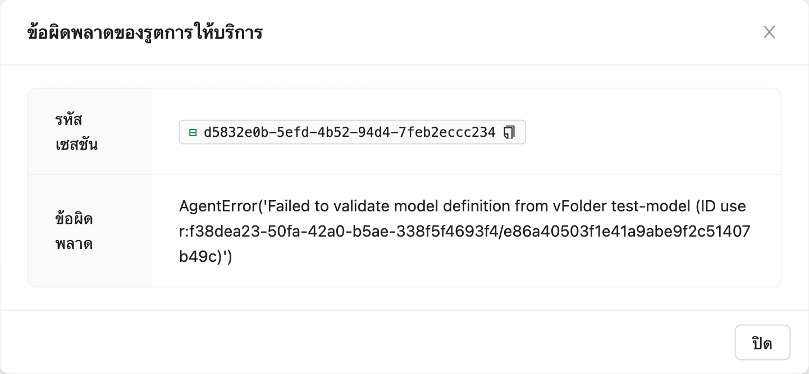

   -  Solution: Verify [the format of the model definition file](#model-definition-guide) and
      if any key-value pairs are incorrect, modify them and overwrite the file in the saved location.
      Then, click 'Clear error and Retry' button to remove all the error stacked in routes info
      table and ensure that the routing of the model service is set correctly.

   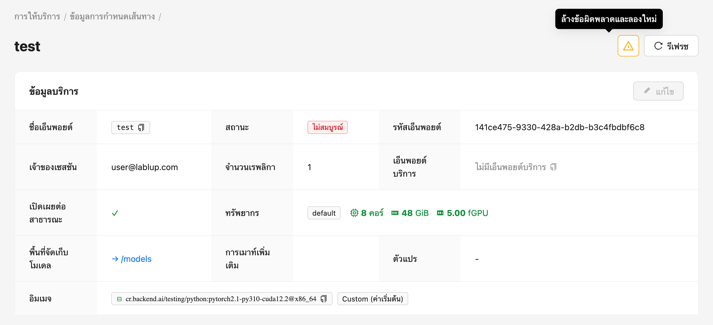


#### กฎการปรับขนาดอัตโนมัติ
คุณสามารถกำหนดค่ากฎการปรับขนาดอัตโนมัติสำหรับบริการโมเดล
ตามกฎที่กำหนด จำนวนเรพลิกาจะถูกลดลงโดยอัตโนมัติในช่วงที่ใช้งานต่ำเพื่อประหยัดทรัพยากร
และเพิ่มขึ้นในช่วงที่ใช้งานสูงเพื่อป้องกันความล่าช้าของคำขอหรือความล้มเหลว

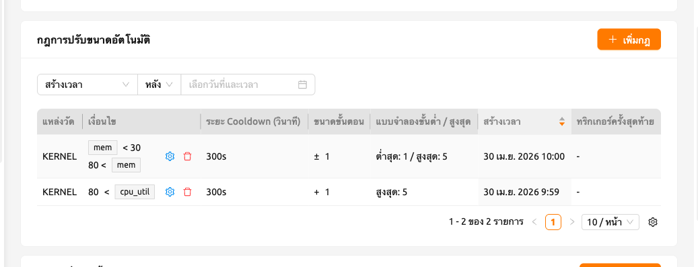

คลิกปุ่ม 'Add Rules' เพื่อเพิ่มกฎใหม่ เมื่อคุณคลิกปุ่ม โมดอลจะปรากฏขึ้น
ซึ่งคุณสามารถเพิ่มกฎได้ ฟิลด์แต่ละฟิลด์ในโมดอลมีคำอธิบายดังนี้:

- Type: กำหนดกฎ เลือก 'ขยายแนวนอน' หรือ 'ย่อขนาด' ตามขอบเขตของกฎ

- Metric Source: Inference Framework หรือ kernel

   - Inference Framework: ค่าเฉลี่ยที่นำมาจากทุกเรพลิกา รองรับเฉพาะเมื่อ AppProxy ทั้งคู่รายงานเมตริกการอนุมาน
   - Kernel: ค่าเฉลี่ยที่นำมาจากทุกเคอร์เนลที่รองรับ endpoint

- Condition: ตั้งค่าเงื่อนไขที่จะใช้กฎการปรับขนาดอัตโนมัติ

   - Metric Name: ชื่อของเมตริกที่จะใช้เปรียบเทียบ คุณสามารถใส่เมตริกใดๆ ที่รองรับโดยสภาพแวดล้อมเวลาทำงาน
   - Comparator: วิธีการเปรียบเทียบเมตริกสดกับค่าเกณฑ์

      - LESS_THAN: กฎจะทำงานเมื่อค่าเมตริกปัจจุบันต่ำกว่าเกณฑ์ที่กำหนด
      - LESS_THAN_OR_EQUAL: กฎจะทำงานเมื่อค่าเมตริกปัจจุบันต่ำกว่าหรือเท่ากับเกณฑ์ที่กำหนด
      - GREATER_THAN: กฎจะทำงานเมื่อค่าเมตริกปัจจุบันสูงกว่าเกณฑ์ที่กำหนด
      - GREATER_THAN_OR_EQUAL: กฎจะทำงานเมื่อค่าเมตริกปัจจุบันสูงกว่าหรือเท่ากับเกณฑ์ที่กำหนด

   - Threshold: ค่าอ้างอิงเพื่อกำหนดว่าเงื่อนไขการปรับขนาดเป็นไปตามหรือไม่

- Step Size: ขนาดขั้นตอนของจำนวนเรพลิกาที่จะเปลี่ยนแปลงเมื่อกฎทำงาน
  สามารถแสดงเป็นค่าบวกและค่าลบได้
  เมื่อกำหนดเป็นค่าลบ กฎจะลดจำนวนเรพลิกา

- Max/Min Replicas: ตั้งค่าสูงสุด/ต่ำสุดสำหรับจำนวนเรพลิกาของ endpoint
  กฎจะไม่ทำงานหากจำนวนเรพลิกาที่เป็นไปได้สูงกว่า/ต่ำกว่าค่านี้

- CoolDown Seconds: ระยะเวลาเป็นวินาทีเพื่อข้ามการใช้กฎซ้ำทันทีหลังจากที่กฎทำงานครั้งแรก


<a id="generating-tokens"></a>

#### การสร้างโทเค็น

เมื่อบริการโมเดลทำงานสำเร็จแล้ว สถานะจะถูกตั้งเป็น
`HEALTHY` ในกรณีนี้ คุณสามารถคลิกที่ชื่อ endpoint ที่สอดคล้อง
ในแท็บ Model Service เพื่อดูข้อมูลรายละเอียดเกี่ยวกับ
บริการโมเดล จากนั้น คุณสามารถตรวจสอบ service endpoint ใน
ข้อมูลการเส้นทางของบริการโมเดล หากตัวเลือก 'Open to Public'
เปิดใช้งานเมื่อสร้างบริการ endpoint จะสามารถเข้าถึงได้สาธารณะ
โดยไม่ต้องใช้โทเค็นแยกต่างหาก และผู้ใช้ปลายทางสามารถเข้าถึงได้
อย่างไรก็ตาม หากถูกปิดใช้งาน คุณสามารถออกโทเค็นตามที่อธิบายด้านล่าง
เพื่อตรวจสอบว่าบริการทำงานอย่างถูกต้อง

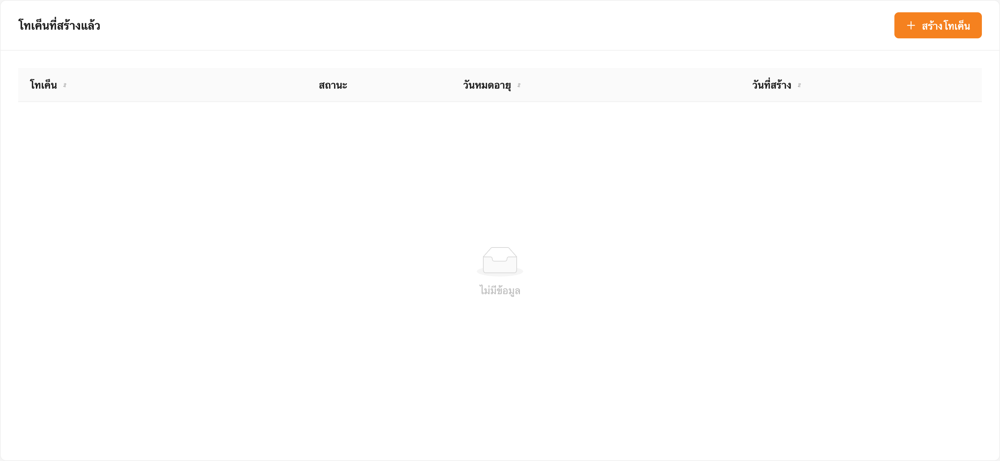

คลิกปุ่ม 'Generate Token' ที่อยู่ทางขวาของรายการโทเค็นที่สร้างขึ้น
ในข้อมูลการเส้นทาง ในโมดอลที่ปรากฏขึ้นสำหรับ
การสร้างโทเค็น ให้ใส่วันที่หมดอายุ

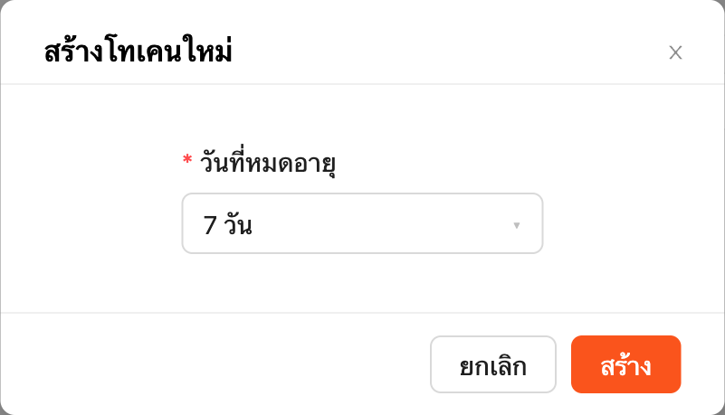

โทเค็นที่ออกจะถูกเพิ่มลงในรายการโทเค็นที่สร้างขึ้น คลิกปุ่ม 'copy' ในรายการโทเค็น
เพื่อคัดลอกโทเค็น และเพิ่มเป็นค่าของคีย์ต่อไปนี้

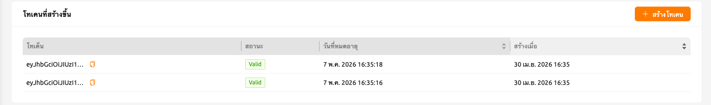

| Key           | Value            |
|---------------|------------------|
| Content-Type  | application/json |
| Authorization | BackendAI        |

#### การเข้าถึง Model Service Endpoint สำหรับผู้ใช้ปลายทาง

เพื่อให้การให้บริการโมเดลสมบูรณ์ คุณต้องแบ่งปันข้อมูลกับ
ผู้ใช้ปลายทางจริงเพื่อให้พวกเขาสามารถเข้าถึงเซิร์ฟเวอร์ที่
บริการโมเดลกำลังทำงานอยู่ หากตัวเลือก Open to Public เปิดใช้งานเมื่อ
สร้างบริการ คุณสามารถแบ่งปันค่า service endpoint จาก
หน้าข้อมูลการเส้นทาง หากบริการถูกสร้างด้วยตัวเลือก
ปิดใช้งาน คุณสามารถแบ่งปันค่า service endpoint พร้อมกับโทเค็น
ที่สร้างขึ้นก่อนหน้านี้

นี่คือคำสั่งง่ายๆ ใช้คำสั่ง `curl` เพื่อตรวจสอบการส่งคำขอใดๆ
ไปยัง model serving endpoint ว่าทำงานอย่างถูกต้องหรือไม่


```bash
$ export API_TOKEN="<token>"
$ curl -H "Content-Type: application/json" -X GET \
  -H "Authorization: BackendAI $API_TOKEN" \
  <model-service-endpoint>
```


:::warning
โดยค่าเริ่มต้น ผู้ใช้ปลายทางต้องอยู่ในเครือข่ายที่สามารถเข้าถึง
endpoint ได้ หากบริการถูกสร้างในเครือข่ายปิด เฉพาะผู้ใช้ปลายทาง
ที่มีการเข้าถึงภายในเครือข่ายปิดนั้นเท่านั้นที่สามารถเข้าถึง
บริการได้
:::

#### การใช้ Large Language Model

หากคุณสร้างบริการ Large Language Model (LLM) คุณสามารถทดสอบ LLM แบบเรียลไทม์
เพียงคลิกปุ่ม 'LLM Chat Test' ที่อยู่ในคอลัมน์ Service Endpoint


จากนั้น คุณจะถูกเปลี่ยนเส้นทางไปยังหน้า Chat ซึ่งโมเดลที่คุณสร้างจะถูกเลือกโดยอัตโนมัติ
โดยใช้อินเทอร์เฟซแชทที่ให้บริการในหน้า Chat คุณสามารถทดสอบโมเดล LLM
สำหรับข้อมูลเพิ่มเติมเกี่ยวกับฟีเจอร์แชท โปรดอ้างถึง [หน้าแชท](#chat-page)

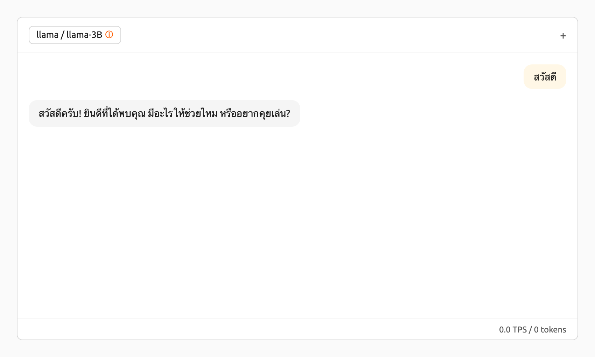

หากคุณพบปัญหาในการเชื่อมต่อกับ API หน้าแชทจะแสดงตัวเลือกที่ให้คุณกำหนดค่าการตั้งค่าโมเดลด้วยตนเอง
ในการใช้โมเดล คุณจะต้องมีข้อมูลต่อไปนี้:

- baseURL (ไม่บังคับ): Base URL ของเซิร์ฟเวอร์ที่โมเดลตั้งอยู่
  ตรวจสอบให้แน่ใจว่าได้รวมข้อมูลเวอร์ชัน
  เช่น เมื่อใช้ OpenAI API คุณควรใส่ https://api.openai.com/v1
- Token (ไม่บังคับ): คีย์การรับรองความถูกต้องเพื่อเข้าถึงบริการโมเดล โทเค็นสามารถ
  สร้างได้จากบริการต่างๆ ไม่ใช่แค่ Backend.AI เท่านั้น รูปแบบและกระบวนการสร้าง
  อาจแตกต่างกันไปขึ้นอยู่กับบริการ ควรอ้างถึงคู่มือของบริการเฉพาะสำหรับรายละเอียด
  เช่น เมื่อใช้บริการที่สร้างโดย Backend.AI โปรดอ้างถึง
  [การสร้างโทเค็น](#generating-tokens) สำหรับคำแนะนำเกี่ยวกับวิธีสร้างโทเค็น

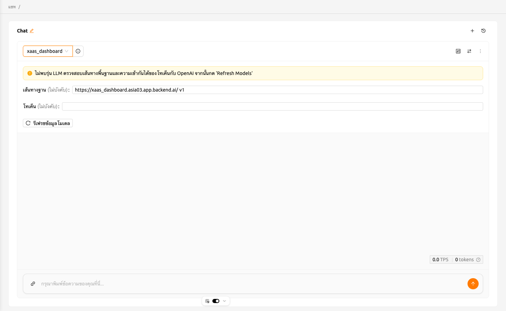

#### การปรับเปลี่ยนบริการโมเดล

คลิกไอคอนประแจในแท็บ Control เพื่อปรับเปลี่ยนบริการโมเดลที่คุณต้องการอัปเดต
รูปแบบจะเหมือนกับโมดอลเริ่มบริการโมเดล โดยมี
ฟิลด์ที่ป้อนไว้ก่อนหน้านี้ถูกกรอกไว้แล้ว คุณสามารถเลือกปรับเปลี่ยนเฉพาะ
ฟิลด์ที่คุณต้องการเปลี่ยนแปลง หลังจากปรับเปลี่ยนฟิลด์แล้ว ให้คลิกปุ่ม 'confirm'
การเปลี่ยนแปลงจะถูกปรับให้เหมาะสม

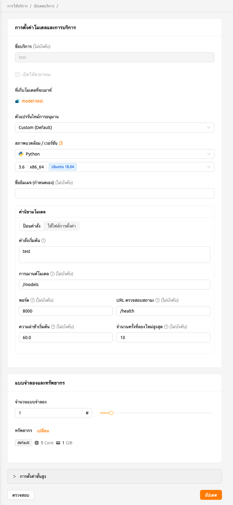

#### การยุติบริการโมเดล

บริการโมเดลจะเรียกใช้ตัวจัดตารางเป็นระยะๆ เพื่อปรับจำนวนการเส้นทาง
ให้ตรงกับจำนวนเซสชันที่ต้องการ อย่างไรก็ตาม สิ่งนี้สร้างภาระให้กับ
ตัวจัดตาราง Backend.AI ดังนั้น จึงแนะนำให้ยุติ
บริการโมเดลหากไม่จำเป็นต้องใช้แล้ว เพื่อยุติบริการโมเดล
ให้คลิกปุ่ม 'trash' ในคอลัมน์ Control โมดอลจะปรากฏขึ้นเพื่อขอ
การยืนยันในการยุติบริการโมเดล การคลิก `Delete`
จะยุติบริการโมเดล บริการโมเดลที่ยุติแล้วจะถูก
ลบออกจากรายการบริการโมเดล

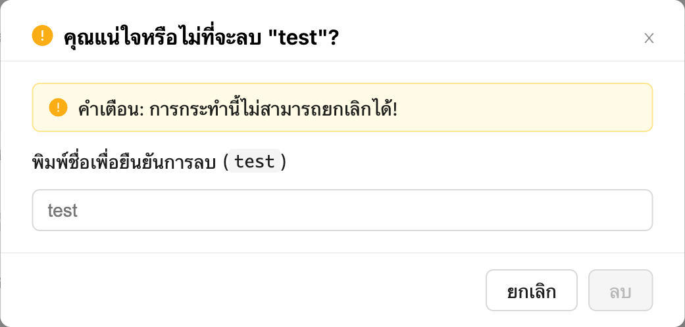