<a id="model-serving"></a>

# การให้บริการโมเดล

## บริการโมเดล


:::note
ฟีเจอร์นี้รองรับเฉพาะในเวอร์ชัน Enterprise เท่านั้น
:::

Backend.AI ไม่เพียงแต่อำนวยความสะดวกในการสร้างสภาพแวดล้อมการพัฒนา
และการจัดการทรัพยากรในช่วงการฝึกโมเดล แต่ยังสนับสนุน
ฟีเจอร์บริการโมเดลตั้งแต่เวอร์ชัน 23.09 เป็นต้นไป ฟีเจอร์นี้ช่วยให้
ผู้ใช้ปลายทาง (เช่น แอพมือถือและ backend ของเว็บเซอร์วิสที่ใช้ AI) สามารถเรียก
inference API ได้เมื่อต้องการ deploy โมเดลที่เสร็จสมบูรณ์แล้วเป็น
บริการ inference


บริการโมเดลขยายฟังก์ชันการทำงานของเซสชันการคำนวณสำหรับการฝึกที่มีอยู่ โดยช่วยให้การบำรุงรักษาอัตโนมัติ การปรับขนาด และการแมพตำแหน่งพอร์ตและที่อยู่เอ็นด์พอยต์ถาวรสำหรับบริการการผลิต ผู้พัฒนาหรือผู้ดูแลระบบจำเป็นต้องระบุพารามิเตอร์การปรับขนาดที่จำเป็นสำหรับบริการโมเดลเท่านั้น โดยไม่จำเป็นต้องสร้างหรือลบเซสชันการคำนวณด้วยตนเอง

## คู่มือขั้นตอนการใช้งานบริการโมเดล

ตั้งแต่เวอร์ชัน 26.4.0 เป็นต้นไป คุณสามารถ deploy บริการโมเดลได้อย่างง่ายดายโดยไม่ต้องใช้ไฟล์กำหนดค่าแยกต่างหาก

**Quick Deploy (แนะนำ)**: เรียกดูโมเดลที่กำหนดค่าไว้ล่วงหน้าใน [Model Store](#model-store) และคลิกปุ่ม `Deploy` เพื่อ deploy ได้ทันที

**Deploy ผ่าน Service Launcher**: คลิกปุ่ม `Start Service` ในหน้า Serving เพื่อเปิด service launcher แล้วเลือกตัวแปร runtime เช่น `vLLM` หรือ `SGLang` เพื่อสร้างบริการโมเดลโดยไม่ต้องใช้ไฟล์กำหนดโมเดลแยกต่างหาก

ขั้นตอนการทำงานทั่วไปมีดังนี้:

1. สร้างบริการโมเดลโดยใช้ service launcher
2. (ถ้าบริการโมเดลไม่เป็นสาธารณะ) สร้างโทเค็น
3. (สำหรับผู้ใช้ปลายทาง) เข้าถึง service endpoint เพื่อตรวจสอบบริการ
4. (ถ้าจำเป็น) แก้ไขบริการโมเดล
5. (ถ้าจำเป็น) ยุติบริการโมเดล

<details>
<summary>ขั้นสูง: การใช้ไฟล์กำหนดโมเดลและไฟล์กำหนดบริการ (Custom Runtime)</summary>

หากคุณใช้ตัวแปร runtime `Custom` หรือต้องการการควบคุมที่ละเอียดกว่า คุณสามารถสร้างและใช้ไฟล์กำหนดโมเดลและไฟล์กำหนดบริการได้:

1. สร้างไฟล์กำหนดโมเดล
2. สร้างไฟล์กำหนดบริการ
3. อัปโหลดไฟล์กำหนดไปยังโฟลเดอร์ประเภทโมเดล
4. เลือก runtime `Custom` ใน service launcher เพื่อสร้าง/ตรวจสอบบริการโมเดล

สำหรับรายละเอียด โปรดดูส่วน [การสร้างไฟล์กำหนดโมเดล](#model-definition-guide) และ [การสร้างไฟล์กำหนดบริการ](#service-definition-file) ด้านล่าง

</details>

<a id="model-definition-guide"></a>

### การสร้างไฟล์กำหนดโมเดล

:::note
ตั้งแต่เวอร์ชัน 24.03 คุณสามารถกำหนดชื่อไฟล์กำหนดโมเดลได้ หากคุณไม่ได้
ป้อนฟิลด์อื่นใดในเส้นทางไฟล์กำหนดโมเดล ระบบจะถือว่าเป็น `model-definition.yml`
หรือ `model-definition.yaml`
:::

ไฟล์กำหนดโมเดลประกอบด้วยข้อมูลการกำหนดค่าที่ระบบ Backend.AI ต้องการเพื่อเริ่มต้น เตรียมการ และปรับขนาดเซสชัน inference โดยอัตโนมัติ ไฟล์นี้ถูกจัดเก็บในโฟลเดอร์ประเภทโมเดลแยกต่างหากจากอิมเมจคอนเทนเนอร์ที่มีเอนจิน inference ซึ่งช่วยให้เอนจินสามารถให้บริการโมเดลที่แตกต่างกันตามความต้องการเฉพาะ และไม่จำเป็นต้องสร้างและ deploy อิมเมจคอนเทนเนอร์ใหม่ทุกครั้งที่โมเดลเปลี่ยน โดยการโหลดการกำหนดโมเดลและข้อมูลโมเดลจากที่จัดเก็บบนเครือข่าย กระบวนการ deploy สามารถทำได้ง่ายและเหมาะสมยิ่งขึ้นระหว่างการปรับขนาดอัตโนมัติ

ไฟล์กำหนดโมเดลมีรูปแบบดังนี้:

```yaml
models:
  - name: "simple-http-server"
    model_path: "/models"
    service:
      start_command:
        - python
        - -m
        - http.server
        - --directory
        - /home/work
        - "8000"
      port: 8000
      health_check:
        path: /
        interval: 10.0
        max_retries: 10
        max_wait_time: 15.0
        expected_status_code: 200
        initial_delay: 60.0
```

**คำอธิบายคู่คีย์-ค่า สำหรับไฟล์กำหนดโมเดล**

:::note
ฟิลด์ที่ไม่มีเครื่องหมาย "(จำเป็น)" เป็นตัวเลือก
:::

- `name` (จำเป็น): กำหนดชื่อของโมเดล
- `model_path` (จำเป็น): ระบุเส้นทางที่โมเดลถูกกำหนด
- `service`: รายการสำหรับจัดระเบียบข้อมูลเกี่ยวกับไฟล์ที่จะให้บริการ
  (รวมถึงสคริปต์คำสั่งและโค้ด)

   - `pre_start_actions`: การดำเนินการที่จะดำเนินการก่อน `start_command` การดำเนินการเหล่านี้
     เตรียมสภาพแวดล้อมโดยการสร้างไฟล์การกำหนดค่า การตั้งค่าไดเรกทอรี หรือ
     การรันสคริปต์เริ่มต้น การดำเนินการจะถูกดำเนินการตามลำดับที่กำหนด

      - `action`: ประเภทของการดำเนินการที่จะดำเนินการ ดูข้อมูลประเภทการดำเนินการที่มีและพารามิเตอร์ได้ที่
        [การดำเนินการก่อนเริ่ม](#prestart-actions)
      - `args`: พารามิเตอร์เฉพาะการดำเนินการ แต่ละประเภทการดำเนินการมีอาร์กิวเมนต์ที่จำเป็นต่างกัน

   - `start_command` (จำเป็น): ระบุคำสั่งที่จะดำเนินการในการให้บริการโมเดล
     สามารถเป็นสตริงหรือรายการสตริง
   - `port` (จำเป็น): พอร์ตคอนเทนเนอร์สำหรับบริการโมเดล (เช่น `8000`, `8080`)
   - `health_check`: การกำหนดค่าสำหรับการตรวจสอบสุขภาพของบริการโมเดลเป็นระยะ
     เมื่อได้รับการกำหนดค่าแล้ว ระบบจะตรวจสอบโดยอัตโนมัติว่าบริการตอบสนองอย่างถูกต้อง
     และลบอินสแตนซ์ที่ไม่สมบูรณ์ออกจากการเส้นทางการรับส่งข้อมูล

      - `path` (จำเป็น): เส้นทาง HTTP endpoint สำหรับคำขอตรวจสอบสุขภาพ (เช่น `/health`, `/v1/health`)
      - `interval` (ค่าเริ่มต้น: `10.0`): เวลาเป็นวินาทีระหว่างการตรวจสอบสุขภาพต่อเนื่อง
      - `max_retries` (ค่าเริ่มต้น: `10`): จำนวนความล้มเหลวต่อเนื่องที่อนุญาตก่อนที่จะทำเครื่องหมาย
        บริการเป็น `UNHEALTHY` บริการจะยังคงรับการรับส่งข้อมูลจนกว่าจะเกินเกณฑ์นี้
      - `max_wait_time` (ค่าเริ่มต้น: `15.0`): เวลาหมดเวลาเป็นวินาทีสำหรับแต่ละคำขอ HTTP ตรวจสอบสุขภาพ
        หากไม่ได้รับการตอบกลับภายในเวลานี้ การตรวจสอบจะถือว่าล้มเหลว
      - `expected_status_code` (ค่าเริ่มต้น: `200`): รหัสสถานะ HTTP ที่บ่งชี้ว่าการตอบกลับมีสุขภาพดี
        ค่าทั่วไป: `200` (OK), `204` (No Content)
      - `initial_delay` (ค่าเริ่มต้น: `60.0`): เวลาเป็นวินาทีที่รอหลังจากสร้างคอนเทนเนอร์
        ก่อนที่จะเริ่มการตรวจสอบสุขภาพ สิ่งนี้ให้เวลาสำหรับการโหลดโมเดล การเตรียม GPU
        และการอุ่นเครื่องบริการ ตั้งค่าที่สูงขึ้นสำหรับโมเดลขนาดใหญ่ (เช่น `300.0` สำหรับ LLMs 70B+)


**ความเข้าใจพฤติกรรมการตรวจสอบสุขภาพ**

ระบบการตรวจสอบสุขภาพจะตรวจสอบคอนเทนเนอร์บริการโมเดลแต่ละตัวและจัดการการเส้นทางการรับส่งข้อมูลโดยอัตโนมัติตามสถานะสุขภาพ

**① AppProxy: การควบคุมการกำหนดเส้นทาง Traffic**

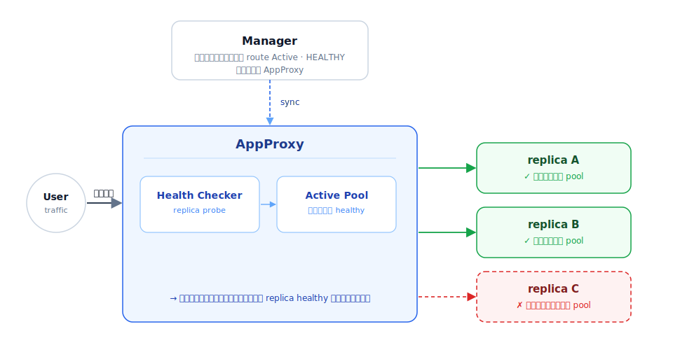

**② Manager: การจัดการสถานะสุขภาพและ Eviction**

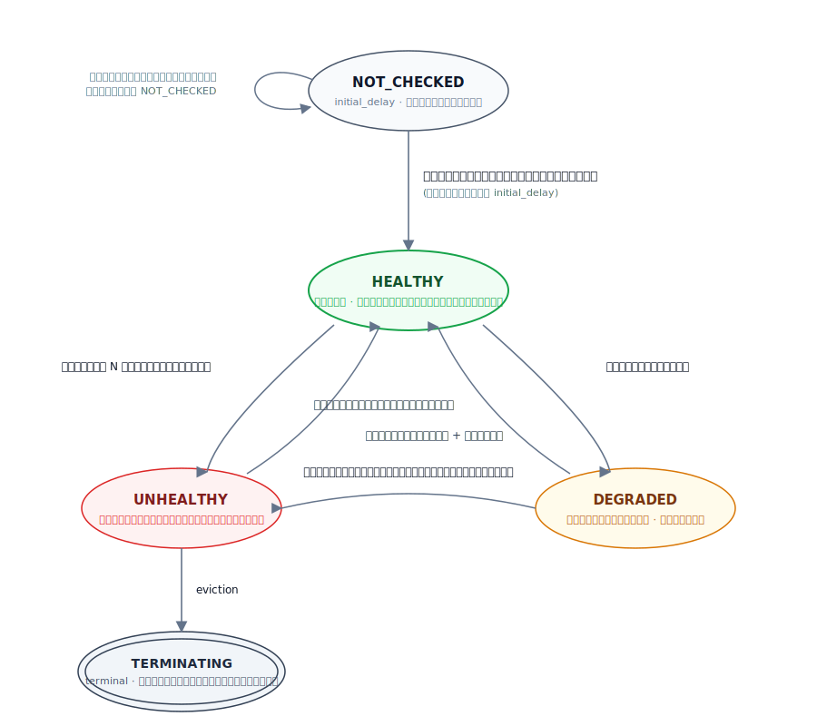

:::note
สถานะสุขภาพภายใน (ใช้สำหรับการเส้นทางการรับส่งข้อมูล) อาจไม่ถูก
ซิงโครไนซ์ทันทีกับสถานะที่แสดงในส่วนติดต่อผู้ใช้
:::

**เวลาจนถึง UNHEALTHY**:

- การเริ่มต้นครั้งแรก: `initial_delay + interval × (max_retries + 1)`

  ตัวอย่างกับค่าเริ่มต้น: 60 + 10 × 11 = **170 วินาที** (ประมาณ 3 นาที)

- ระหว่างการทำงาน (หลังจากสุขภาพดีแล้ว): `interval × (max_retries + 1)`

  ตัวอย่างกับค่าเริ่มต้น: 10 × 11 = **110 วินาที** (ประมาณ 2 นาที)


<a id="prestart-actions"></a>

**คำอธิบายการดำเนินการบริการที่รองรับใน Backend.AI การให้บริการโมเดล**


- `write_file`: การดำเนินการเพื่อสร้างไฟล์ด้วยชื่อไฟล์ที่กำหนดและเพิ่มเนื้อหา
  สิทธิ์การเข้าถึงเริ่มต้นคือ `644`

   - `arg/filename`: ระบุชื่อไฟล์
   - `body`: ระบุเนื้อหาที่จะเพิ่มลงในไฟล์
   - `mode`: ระบุสิทธิ์การเข้าถึงไฟล์
   - `append`: ตั้งค่าว่าจะเขียนทับหรือผนวกเนื้อหาลงในไฟล์เป็น `True` หรือ `False`

- `write_tempfile`: การดำเนินการเพื่อสร้างไฟล์ด้วยชื่อไฟล์ชั่วคราว (`.py`) และผนวกเนื้อหา
  หากไม่ได้ระบุค่าสำหรับ mode สิทธิ์การเข้าถึงเริ่มต้นจะเป็น `644`

   - `body`: ระบุเนื้อหาที่จะเพิ่มลงในไฟล์
   - `mode`: ระบุสิทธิ์การเข้าถึงไฟล์

- `run_command`: ผลลัพธ์จากการดำเนินการคำสั่ง รวมถึงข้อผิดพลาดใดๆ จะถูกส่งกลับในรูปแบบต่อไปนี้
  (`out`: ผลลัพธ์จากการดำเนินการคำสั่ง, `err`: ข้อความแสดงข้อผิดพลาดหากเกิดข้อผิดพลาดระหว่างการดำเนินการ)

   - `args/command`: ระบุคำสั่งที่จะดำเนินการเป็นอาร์เรย์ (เช่น คำสั่ง `python3 -m http.server 8080` กลายเป็น ["python3", "-m", "http.server", "8080"])

- `mkdir`: การดำเนินการเพื่อสร้างไดเรกทอรีตามเส้นทางที่ระบุ

   - `args/path`: ระบุเส้นทางเพื่อสร้างไดเรกทอรี

- `log`: การดำเนินการเพื่อพิมพ์ล็อกตามข้อความที่ระบุ

   - `args/message`: ระบุข้อความที่จะแสดงในล็อก
   - `debug`: ตั้งค่าเป็น `True` หากอยู่ในโหมดดีบัก มิฉะนั้นตั้งค่าเป็น `False`

### การอัปโหลดไฟล์กำหนดโมเดลไปยังโฟลเดอร์ประเภทโมเดล

เพื่ออัปโหลดไฟล์กำหนดโมเดล (`model-definition.yml`) ไปยังโฟลเดอร์ประเภทโมเดล คุณต้องสร้างโฟลเดอร์เสมือน เมื่อสร้างโฟลเดอร์เสมือน ให้เลือกประเภท `model` แทนประเภท `general` เริ่มต้น โปรดดูส่วน [การสร้างโฟลเดอร์จัดเก็บ](#create-storage-folder) ในหน้า Data สำหรับคำแนะนำเกี่ยวกับวิธีสร้างโฟลเดอร์

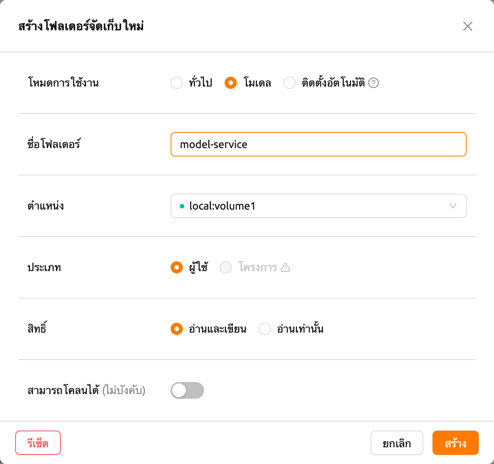

หลังจากสร้างโฟลเดอร์แล้ว ให้เลือกแท็บ 'MODELS' ในหน้า Data คลิกไอคอนโฟลเดอร์ประเภทโมเดลที่สร้างขึ้นล่าสุดเพื่อเปิดตัวสำรวจโฟลเดอร์ และอัปโหลดไฟล์กำหนดโมเดล สำหรับข้อมูลเพิ่มเติมเกี่ยวกับวิธีใช้ตัวสำรวจโฟลเดอร์ โปรดดูส่วน [สำรวจโฟลเดอร์](#explore-folder)

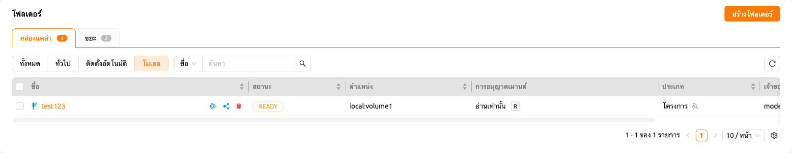

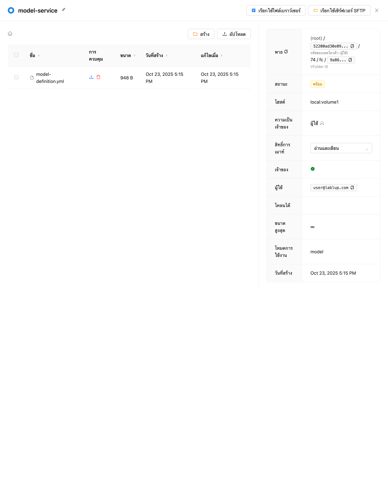

<a id="service-definition-file"></a>

### การสร้างไฟล์กำหนดบริการ

ไฟล์กำหนดบริการ (`service-definition.toml`) ช่วยให้ผู้ดูแลระบบสามารถกำหนดค่าทรัพยากร สภาพแวดล้อม และการตั้งค่า runtime ที่จำเป็นสำหรับบริการโมเดลล่วงหน้า เมื่อไฟล์นี้อยู่ในโฟลเดอร์โมเดล ระบบจะใช้การตั้งค่าเหล่านี้เป็นค่าเริ่มต้นเมื่อสร้างบริการ

ทั้ง `model-definition.yaml` และ `service-definition.toml` ต้องอยู่ในโฟลเดอร์โมเดลเพื่อเปิดใช้งานปุ่ม `Deploy` ในหน้า Model Store ไฟล์ทั้งสองทำงานร่วมกัน: ไฟล์กำหนดโมเดลระบุการกำหนดค่าโมเดลและเซิร์ฟเวอร์ inference ในขณะที่ไฟล์กำหนดบริการระบุสภาพแวดล้อม runtime การจัดสรรทรัพยากร และตัวแปรสภาพแวดล้อม

ไฟล์กำหนดบริการใช้รูปแบบ TOML โดยมีส่วนต่างๆ จัดตามตัวแปร runtime แต่ละส่วนกำหนดลักษณะเฉพาะของบริการ:

```toml
[vllm.environment]
image        = "example.com/model-server:latest"
architecture = "x86_64"

[vllm.resource_slots]
cpu = 1
mem = "8gb"
"cuda.shares" = "0.5"

[vllm.environ]
MODEL_NAME = "example-model-name"
```

**คำอธิบายคู่คีย์-ค่า สำหรับไฟล์กำหนดบริการ**

- `[{runtime}.environment]`: ระบุอิมเมจคอนเทนเนอร์และสถาปัตยกรรมสำหรับบริการโมเดล

   - `image` (จำเป็น): เส้นทางเต็มของอิมเมจคอนเทนเนอร์ที่ใช้สำหรับบริการ inference (เช่น `example.com/model-server:latest`)
   - `architecture` (จำเป็น): สถาปัตยกรรม CPU ของอิมเมจคอนเทนเนอร์ (เช่น `x86_64`, `aarch64`)

- `[{runtime}.resource_slots]`: กำหนดทรัพยากรการคำนวณที่จัดสรรให้กับบริการโมเดล

   - `cpu`: จำนวนคอร์ CPU ที่จะจัดสรร (เช่น `1`, `2`, `4`)
   - `mem`: จำนวนหน่วยความจำที่จะจัดสรร รองรับคำต่อท้ายหน่วย (เช่น `"8gb"`, `"16gb"`)
   - `"cuda.shares"`: ส่วนแบ่ง GPU เศษส่วน (fGPU) ที่จะจัดสรร (เช่น `"0.5"`, `"1.0"`) ค่านี้ใส่เครื่องหมายคำพูดเนื่องจากคีย์มีจุด

- `[{runtime}.environ]`: ตั้งค่าตัวแปรสภาพแวดล้อมที่จะส่งผ่านไปยังคอนเทนเนอร์บริการ inference

   - คุณสามารถกำหนดตัวแปรสภาพแวดล้อมใดๆ ที่จำเป็นสำหรับ runtime เช่น `MODEL_NAME` มักใช้เพื่อระบุโมเดลที่จะโหลด

:::note
คำนำหน้า `{runtime}` ในแต่ละส่วนหัวสอดคล้องกับชื่อตัวแปร runtime (เช่น `vllm`, `nim`, `custom`) ระบบจะจับคู่คำนำหน้านี้กับตัวแปร runtime ที่เลือกเมื่อสร้างบริการ
:::

:::note
เมื่อบริการถูกสร้างขึ้นจาก Model Store โดยใช้ปุ่ม `Deploy` การตั้งค่าจาก `service-definition.toml` จะถูกนำไปใช้โดยอัตโนมัติ หากคุณต้องการปรับการจัดสรรทรัพยากรในภายหลัง คุณสามารถแก้ไขบริการผ่านหน้า Serving ได้
:::

## ภาพรวมหน้า Serving

หน้า Serving แสดงรายการ endpoint บริการโมเดลทั้งหมดในโปรเจกต์ปัจจุบัน คุณสามารถเข้าถึงได้โดยคลิก **การให้บริการ** ในเมนูด้านข้าง

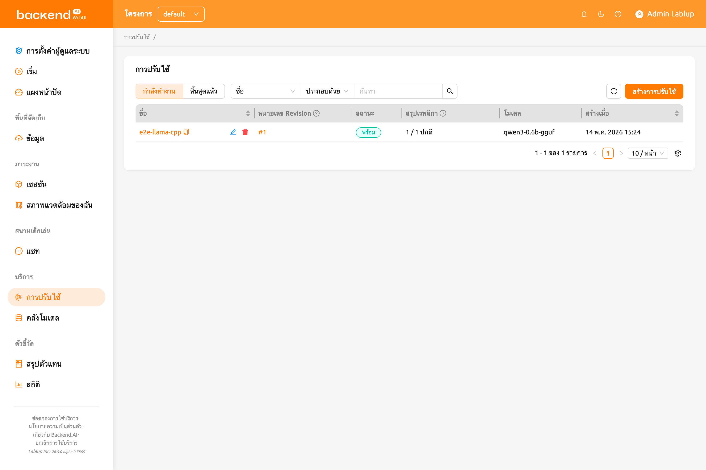

ที่ด้านบนของหน้า คุณสามารถกรอง endpoint ตามขั้นตอนวงจรชีวิต:

- **Active**: แสดง endpoint ที่กำลังทำงานหรือกำลังสร้าง นี่คือมุมมองเริ่มต้น
- **Destroyed**: แสดง endpoint ที่ถูกยุติแล้ว

คุณยังสามารถใช้แถบตัวกรองคุณสมบัติเพื่อค้นหา endpoint ตาม **ชื่อ Endpoint**, **URL ของ Service Endpoint** หรือ **เจ้าของ** (มีให้สำหรับผู้ดูแลระบบ)

คลิกปุ่ม `Start Service` เพื่อเปิดตัวเปิดใช้บริการและสร้างบริการโมเดลใหม่

## การสร้างบริการโมเดล

ตั้งแต่บนสาขา main ล่าสุด การสร้างบริการโมเดลแบ่งเป็นสองขั้นตอน

1. **สร้างการปรับใช้ (deployment)** — คอนเทนเนอร์น้ำหนักเบาที่กำหนดเฉพาะข้อมูลระบุตัวตนของการปรับใช้ (ชื่อ การมองเห็น เมตาดาตาของการปรับใช้ และ resource group)
2. **เพิ่ม Revision** — snapshot ของการกำหนดค่าที่ระบุสิ่งที่จะรันจริง (start command, environment variables, runtime variant, image, ทรัพยากร และ model storage)

แต่ละการปรับใช้สามารถมี Revision ได้หลายรายการ แต่ในแต่ละช่วงเวลาจะมี Revision *ปัจจุบัน* (Revision ที่ให้บริการ traffic) เพียงรายการเดียว และคุณสามารถสลับระหว่าง Revision ได้จากแท็บ Revisions ในหน้ารายละเอียด Endpoint

### หน้าต่างสร้างการปรับใช้

คลิกปุ่ม `New Deployment` ในหน้า Serving เพื่อเปิดหน้าต่าง **Create Deployment** หน้าต่างนี้รับเฉพาะเมตาดาตาระดับการปรับใช้เท่านั้น และจะยังไม่มีการสร้าง Revision ในขั้นตอนนี้

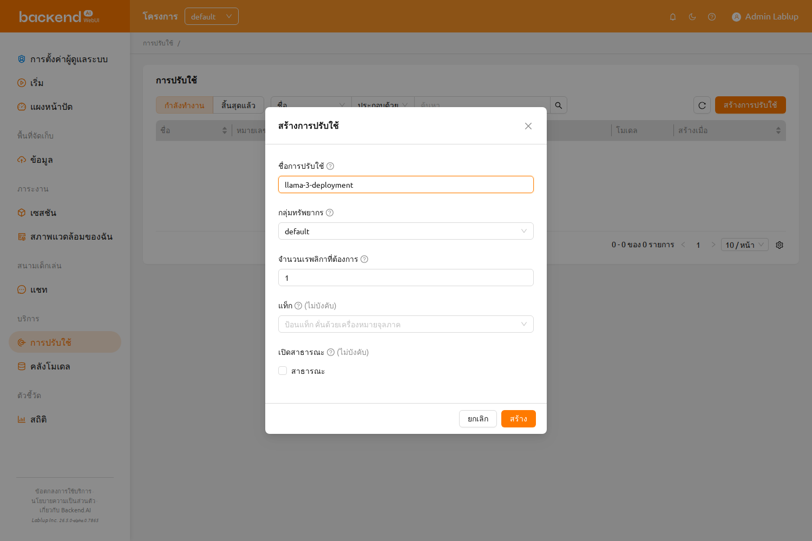
<!-- TODO: Capture screenshot — FR-2822 deployment-only create modal -->

หน้าต่างประกอบด้วยฟิลด์ต่อไปนี้

- **ชื่อการปรับใช้ (Deployment Name)**: ชื่อที่ไม่ซ้ำกันที่ใช้ระบุการปรับใช้ทั้งใน dashboard, API และ URL ของ endpoint
- **เปิดให้สาธารณะ (Open To Public)**: เมื่อเปิดใช้งาน endpoint จะสามารถเข้าถึงได้โดยไม่ต้องใช้ access token เมื่อปิดใช้งาน ทุกคำขอจะต้องแนบ token ดูรายละเอียดที่ [การสร้างโทเค็น](#generating-tokens)
- **Resource Group**: กลุ่มทรัพยากรที่การปรับใช้จะทำงาน หากโปรเจกต์ของคุณมี resource group เพียงกลุ่มเดียว ระบบจะเลือกให้โดยอัตโนมัติและสามารถดำเนินการต่อได้โดยไม่ต้องเลือกเอง

คลิก `Create Deployment` เพื่อสร้างการปรับใช้ จากนั้นคุณจะถูกพาไปยังหน้ารายละเอียด Endpoint และจะเห็นคำเตือน **No Current Revision** จนกว่าคุณจะเพิ่ม Revision แรก

### การเพิ่ม Revision

Revision รวบรวมการตั้งค่าที่จำเป็นทั้งหมดสำหรับการรัน inference server ได้แก่ image, start command, ทรัพยากร, การ mount โมเดล และ environment variables จากหน้ารายละเอียด Endpoint ให้คลิก `เพิ่ม Revision` เพื่อเปิดหน้าต่าง

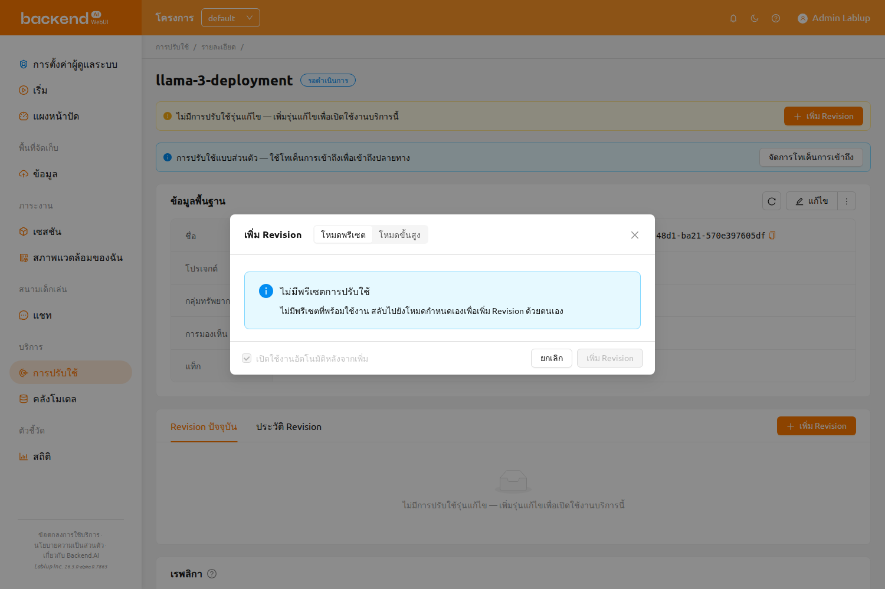
<!-- TODO: Capture screenshot — redesigned Add Revision modal -->

หน้าต่างประกอบด้วยรายการต่อไปนี้

- **Runtime**: serving runtime ที่ใช้รันโมเดล (เช่น `vLLM`, `SGLang`, `NVIDIA NIM`, `Modular MAX`, `Custom`) เลือก `Custom` หากต้องการกำหนด start command ของคุณเอง รายการ runtime variant ที่มีจะถูกโหลดจากแบ็กเอนด์โดยอัตโนมัติ
- **สภาพแวดล้อม / เวอร์ชัน**: container image ที่ใช้สำหรับ inference server เมื่อเลือก runtime variant รายการจะถูกกรองให้เหลือเฉพาะ image ที่เข้ากันได้
- **ที่เก็บโมเดลที่จะเมาท์ (Model Storage to Mount)**: โฟลเดอร์จัดเก็บที่มีไฟล์โมเดล
- **Start Command** (เฉพาะ Custom): คำสั่งที่ใช้รัน inference server สำหรับ variant อื่น ๆ ระบบจะใช้ start command เริ่มต้นของ runtime นั้นโดยอัตโนมัติ
- **Environment Variables**: คู่ key/value ที่จะถูกส่งให้คอนเทนเนอร์ของ inference server
- **Resource Preset**: ชุดการจัดสรร CPU, memory และ accelerator ที่ถูกกำหนดไว้ล่วงหน้า รายการ preset ที่มีจะถูกกรองตาม resource group ของการปรับใช้
- **เปิดใช้งานอัตโนมัติหลังจากเพิ่ม**: เมื่อเปิดใช้งาน Revision ที่สร้างจะถูกนำมาใช้ทันทีและแทนที่ Revision ปัจจุบัน เมื่อปิดใช้งาน Revision จะถูกเพิ่มในสถานะไม่ได้ใช้งาน และคุณสามารถนำมาใช้ภายหลังได้จากแท็บ Revisions

:::note
ฟิลด์ **ชื่อ** ของ Revision ถูกนำออกแล้ว แต่ละ Revision จะถูกระบุด้วยหมายเลข Revision ที่กำหนดให้โดยอัตโนมัติ ดู [แท็บ Revisions](#revisions-tab) ด้านล่าง
:::

### โหมด Preset สำหรับการสร้าง Revision

หากมี deployment preset ที่ใช้ได้ หน้าต่าง Add Revision สามารถทำงานใน **โหมด Preset** โหมด Preset ช่วยให้คุณเริ่มต้นจาก deployment preset ที่จัดเตรียมไว้ แทนการกรอกทุกฟิลด์ด้วยตัวเอง

ในโหมด Preset

- ตัวเลือก preset จะแสดงรายการ deployment preset ทั้งหมดที่เข้ากันได้กับ runtime variant และ resource group ของการปรับใช้
- เมื่อเลือก preset ระบบจะกรอก runtime variant, image, start command, environment variables, resource preset และการเลือก model storage ให้โดยอัตโนมัติจากค่าเริ่มต้นของ preset
- คุณยังคงสามารถปรับแก้ฟิลด์ใด ๆ ได้หลังจาก preset ถูกนำมาใช้ การแก้ไขจะไม่ถูกบันทึกย้อนกลับไปยัง preset
- ลิงก์ **Deployment Preset Detail** จะเปิดแผงด้านข้างที่แสดงการกำหนดค่าทั้งหมดของ preset เพื่อให้คุณตรวจสอบสิ่งที่จะถูกนำไปใช้

หากโปรเจกต์ของคุณไม่มี preset ที่เข้ากันได้ หน้าต่างจะเปลี่ยนเป็นโหมดด้วยตนเอง และคุณจะกรอกฟิลด์โดยตรง ดูวิธีการสร้างและจัดการ preset ได้ที่ [Deployment Presets](deployment_presets.md)
<!-- TODO: Cross-reference Work Item 11 — Deployment Presets page will be added in PR C -->

### ตัวเปิดใช้บริการ (ฟิลด์รายละเอียด)

ส่วนต่อไปนี้อธิบายฟิลด์ในระดับ Revision อย่างละเอียด ใช้ได้ทั้งเมื่อเพิ่ม Revision ด้วยตนเอง และเมื่อพิจารณาเนื้อหา preset ก่อนนำไปใช้

#### โหมดกำหนดโมเดล (เฉพาะ Custom Runtime)

เมื่อคุณเลือกตัวแปร runtime `Custom` คุณสามารถเลือกระหว่างสองโหมดสำหรับกำหนดบริการโมเดล:

##### โหมดป้อนคำสั่ง

เลือก `ป้อนคำสั่ง` เพื่อวางคำสั่ง CLI โดยตรง ตัวอย่างเช่น:

```shell
vllm serve /models/my-model --tp 2
```


ระบบจะวิเคราะห์คำสั่งโดยอัตโนมัติและกรอกฟิลด์ต่อไปนี้:

- **คำสั่งเริ่มต้น**: ป้อนคำสั่งที่จะดำเนินการในการให้บริการโมเดลโดยตรง
- **การเมานต์โมเดล (Model Mount)**: เส้นทางที่โฟลเดอร์จัดเก็บโมเดลถูกเมาต์ภายในคอนเทนเนอร์ (ค่าเริ่มต้น `/models`)
- **พอร์ต (Port)**: ตรวจจับอัตโนมัติจากคำสั่ง (ค่าเริ่มต้น `8000`) หมายเลขพอร์ตที่กระบวนการให้บริการโมเดลรับฟัง
- **URL ตรวจสอบสถานะ**: ตรวจจับอัตโนมัติจากคำสั่ง (ค่าเริ่มต้น `/health`) เส้นทาง HTTP endpoint ที่ใช้ตรวจสอบสุขภาพบริการ
- **ความล่าช้าเริ่มต้น**: จำนวนวินาทีที่รอหลังจากบริการเริ่มทำงานก่อนการตรวจสอบสถานะครั้งแรก (ค่าเริ่มต้น `60.0`)
- **จำนวนครั้งที่ลองใหม่สูงสุด**: จำนวนครั้งสูงสุดในการพยายามตรวจสอบสถานะก่อนที่บริการจะถูกถือว่าล้มเหลว (ค่าเริ่มต้น `10`)

:::tip
หากคำสั่งแนะนำการใช้ multi-GPU (เช่น `--tp 2`) คำแนะนำ GPU จะปรากฏขึ้น
เพื่อช่วยคุณจัดสรรจำนวนทรัพยากร GPU ที่ถูกต้อง
:::

##### โหมดใช้ไฟล์การตั้งค่า

เลือก `ใช้ไฟล์การตั้งค่า` เพื่อใช้วิธี `model-definition.yaml` แบบดั้งเดิม โหมดนี้ช่วยให้คุณตั้งค่า:

- **ปลายทางเมาต์สำหรับโฟลเดอร์โมเดล**: เส้นทางที่จัดเก็บโมเดลถูกเมาต์ในเซสชัน ค่าเริ่มต้นคือ `/models`
- **เส้นทางไฟล์กำหนดโมเดล**: เส้นทางไปยังไฟล์กำหนดโมเดลที่คุณอัปโหลด ค่าเริ่มต้นคือ `model-definition.yaml`
- **เมาต์เพิ่มเติม**: คุณสามารถเมาต์โฟลเดอร์จัดเก็บเพิ่มเติมได้ โปรดทราบว่าสามารถเมาต์เฉพาะโฟลเดอร์โหมดใช้งานทั่วไป/ข้อมูลเท่านั้น ไม่ใช่โฟลเดอร์โมเดลเพิ่มเติม


#### พารามิเตอร์ Runtime (vLLM / SGLang)

เมื่อคุณเลือกตัวแปร runtime `vLLM` หรือ `SGLang` ส่วน **พารามิเตอร์ Runtime** จะปรากฏขึ้น ส่วนนี้ช่วยให้คุณปรับแต่งพฤติกรรมการให้บริการโมเดลอย่างละเอียดโดยไม่ต้องแก้ไขไฟล์การกำหนดค่าด้วยตนเอง

พารามิเตอร์ถูกจัดเป็นหมวดหมู่ที่แยกตามแท็บ รายการแท็บจะแตกต่างกันตามตัวแปร runtime

:::note
พารามิเตอร์ที่ไม่เปลี่ยนแปลงจะใช้ค่าเริ่มต้นของ runtime
:::

**พารามิเตอร์ Runtime ของ vLLM**

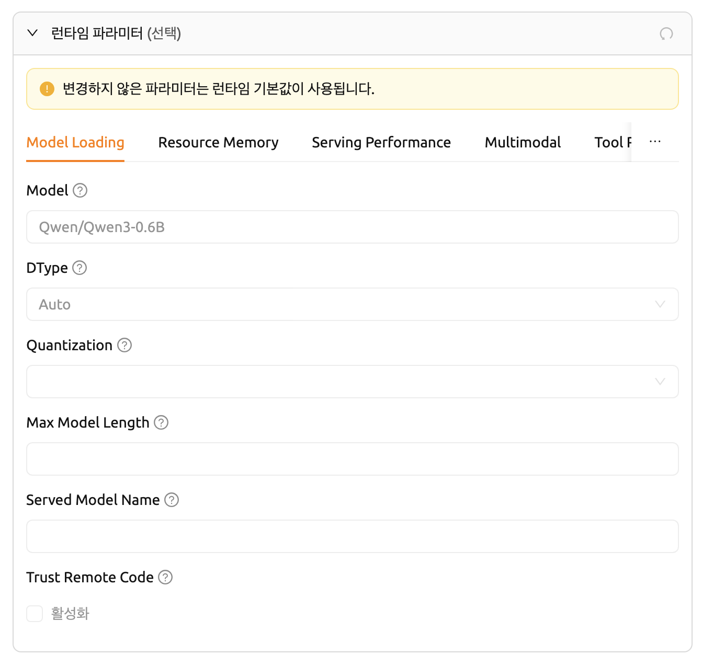

vLLM มีแท็บดังต่อไปนี้: **Model Loading**, **Resource Memory**, **Serving Performance**, **Multimodal**, **Tool Reasoning** และอื่นๆ

ฟิลด์หลักในแท็บ **Model Loading**:

- **Model**: ชื่อหรือเส้นทางของโมเดลที่จะใช้
- **DType**: ประเภทข้อมูลสำหรับน้ำหนักโมเดลและการคำนวณ (เช่น `Auto`, `float16`, `bfloat16`)
- **Quantization**: วิธีการ quantization ของโมเดล (เช่น `awq`, `gptq`, `fp8`)
- **Max Model Length**: ความยาวบริบทสูงสุด (จำนวน token) ที่โมเดลสามารถประมวลผลได้
- **Served Model Name**: ชื่อโมเดลที่เปิดเผยบน API endpoint
- **Trust Remote Code**: อนุญาตให้รันโค้ดโมเดลที่กำหนดเองจากคลังโมเดล

**พารามิเตอร์ Runtime ของ SGLang**

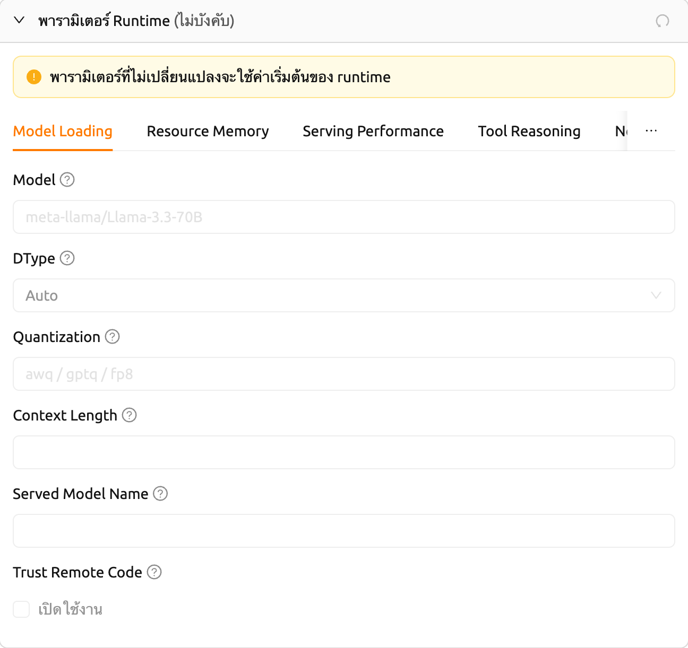

SGLang มีแท็บดังต่อไปนี้: **Model Loading**, **Resource Memory**, **Serving Performance**, **Tool Reasoning** และอื่นๆ

ฟิลด์หลักในแท็บ **Model Loading**:

- **Model**: ชื่อหรือเส้นทางของโมเดลที่จะใช้
- **DType**: ประเภทข้อมูลสำหรับน้ำหนักโมเดลและการคำนวณ (เช่น `Auto`, `float16`, `bfloat16`)
- **Quantization**: วิธีการ quantization ของโมเดล (เช่น `awq`, `gptq`, `fp8`)
- **Context Length**: ความยาวบริบทสูงสุดที่โมเดลสามารถประมวลผลได้
- **Served Model Name**: ชื่อโมเดลที่เปิดเผยบน API endpoint
- **Trust Remote Code**: อนุญาตให้รันโค้ดโมเดลที่กำหนดเองจากคลังโมเดล

นอกจากพารามิเตอร์ runtime แล้ว ตัวแปร runtime `vLLM` และ `SGLang` ยังให้ตัวแปรสภาพแวดล้อมเฉพาะในส่วน **ตัวแปรสภาพแวดล้อม** ของตัวเปิดใช้บริการ:

- **vLLM**: `BACKEND_MODEL_NAME`, `VLLM_QUANTIZATION`, `VLLM_TP_SIZE` (tensor parallelism), `VLLM_PP_SIZE` (pipeline parallelism), `VLLM_EXTRA_ARGS` (อาร์กิวเมนต์ CLI เพิ่มเติม)
- **SGLang**: `BACKEND_MODEL_NAME`, `SGLANG_QUANTIZATION`, `SGLANG_TP_SIZE` (tensor parallelism), `SGLANG_PP_SIZE` (pipeline parallelism), `SGLANG_EXTRA_ARGS` (อาร์กิวเมนต์ CLI เพิ่มเติม)

:::note
ตัวแปรสภาพแวดล้อมเหล่านี้จะปรากฏในส่วน **ตัวแปรสภาพแวดล้อม** ของตัวเปิดใช้บริการ
ไม่ใช่ในส่วนพารามิเตอร์ Runtime โดยให้ตัวเลือกการกำหนดค่าเพิ่มเติมที่เฉพาะเจาะจงสำหรับแต่ละตัวแปร runtime
:::

#### การเปรียบเทียบตัวแปร Runtime

ตารางต่อไปนี้สรุปความแตกต่างหลักระหว่างตัวแปร runtime สามรายการ:

| ฟีเจอร์ | Custom | vLLM | SGLang |
|---------|--------|------|--------|
| ส่วนพารามิเตอร์ Runtime | ไม่มี | มี | มี |
| สลับระหว่างโหมดป้อนคำสั่ง / ใช้ไฟล์การตั้งค่า | มี | ไม่มี | ไม่มี |
| ค่าล่วงหน้าตัวแปรสภาพแวดล้อม | ป้อนด้วยตนเองเท่านั้น | ค่าล่วงหน้า `VLLM_*` | ค่าล่วงหน้า `SGLANG_*` |
| กรอกฟอร์มล่วงหน้าเมื่อแก้ไข | มี (ตาม revision ล่าสุด) | ไม่มี | ไม่มี |

#### สภาพแวดล้อมและทรัพยากร

ตั้งค่าจำนวนเรพลิกาและเลือกสภาพแวดล้อมและกลุ่มทรัพยากร

- **จำนวนเรพลิกา**: กำหนดจำนวนเซสชันการเส้นทางที่จะรักษาไว้สำหรับบริการ การเปลี่ยนค่านี้จะทำให้ตัวจัดการสร้างหรือยุติเซสชันเรพลิกาตามลำดับ
- **สภาพแวดล้อม / เวอร์ชัน**: กำหนดค่าสภาพแวดล้อมการทำงานสำหรับบริการโมเดล การเลือกตัวแปร runtime เช่น vLLM จะกรองอิมเมจสภาพแวดล้อมโดยอัตโนมัติเพื่อแสดงอิมเมจที่เกี่ยวข้อง


- **พรีเซ็ตทรัพยากร**: เลือกจำนวนทรัพยากรที่จะจัดสรร ทรัพยากรรวมถึง CPU, RAM และ GPU

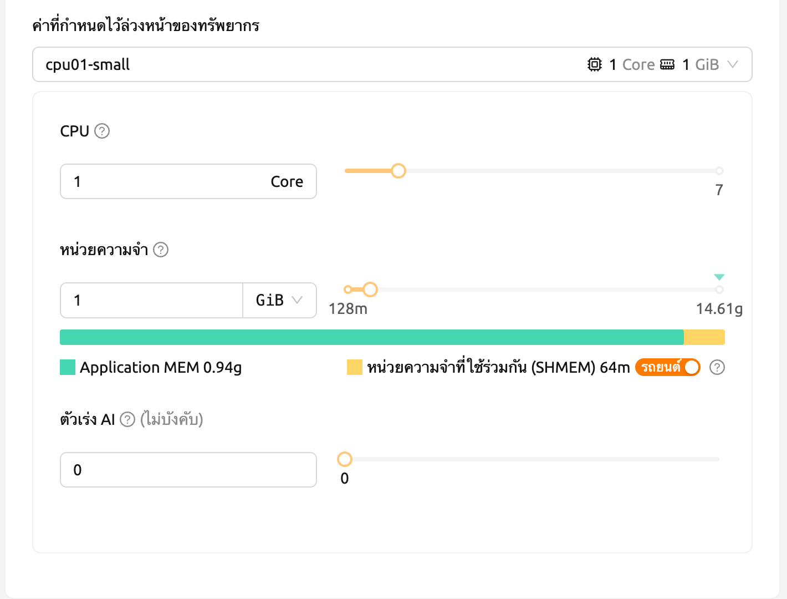

#### โหมดคลัสเตอร์และตัวแปรสภาพแวดล้อม

- **Single Node**: เมื่อรันเซสชัน โหนดจัดการและโหนดผู้ปฏิบัติงานจะอยู่บนโหนดจริงหรือเครื่องเสมือนเดียวกัน
- **Multi Node**: โหนดจัดการหนึ่งตัวและโหนดผู้ปฏิบัติงานหนึ่งตัวหรือมากกว่าจะถูกแบ่งข้ามโหนดจริงหรือเครื่องเสมือนหลายตัว
- **Variable**: ตั้งค่าตัวแปรสภาพแวดล้อมเมื่อเริ่มบริการโมเดล สิ่งนี้มีประโยชน์เมื่อใช้ตัวแปร runtime ที่ต้องการการตั้งค่าตัวแปรสภาพแวดล้อมเฉพาะ


#### การตรวจสอบความถูกต้องของบริการ

ก่อนที่จะสร้างบริการโมเดล Backend.AI สนับสนุนฟีเจอร์การตรวจสอบความถูกต้องเพื่อตรวจสอบ
ว่าสามารถทำงานได้หรือไม่ คลิกปุ่ม `Validate` ที่ด้านล่างซ้ายของตัวเปิดใช้บริการ
และป๊อปอัพใหม่สำหรับรับฟังเหตุการณ์การตรวจสอบจะปรากฏขึ้น
ในป๊อปอัพโมดอล คุณสามารถตรวจสอบสถานะผ่านล็อกคอนเทนเนอร์ เมื่อผลลัพธ์ถูกตั้งเป็น
`Finished` การตรวจสอบจะเสร็จสมบูรณ์

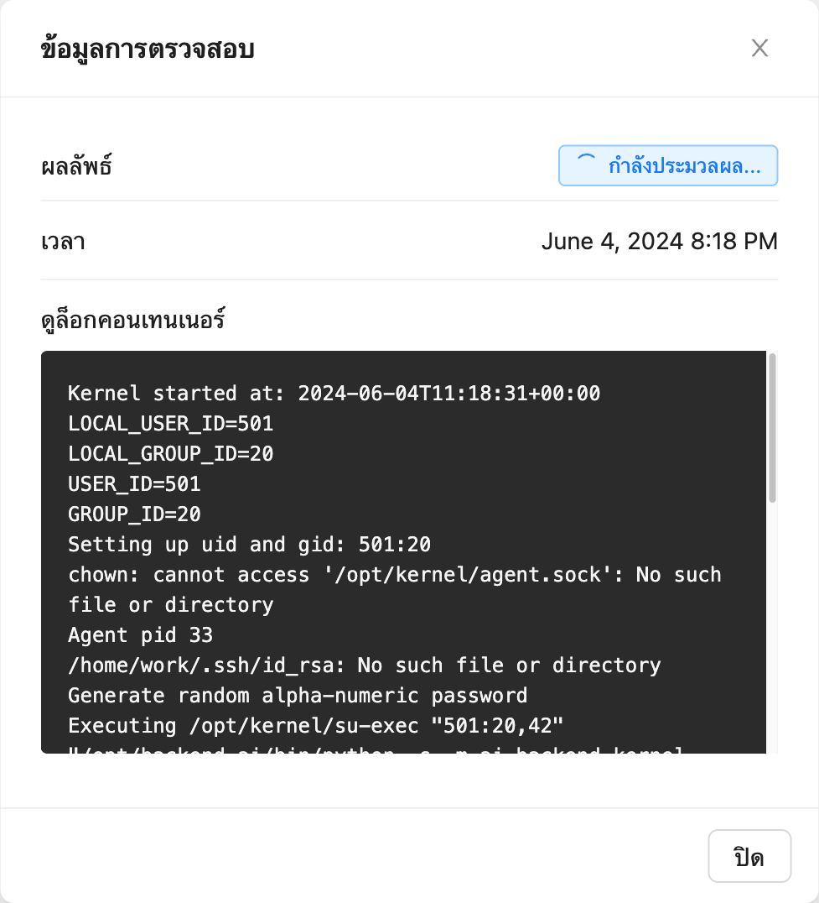

:::note
ผลลัพธ์ `Finished` ไม่ได้รับประกันว่าการทำงานเสร็จสมบูรณ์สำเร็จ
โปรดตรวจสอบล็อกคอนเทนเนอร์แทน
:::

### การจัดการการสร้างบริการโมเดลที่ล้มเหลว

หากสถานะของบริการโมเดลยังคงเป็น `UNHEALTHY` แสดงว่า
บริการโมเดลไม่สามารถทำงานได้อย่างถูกต้อง

สาเหตุทั่วไปของการสร้างที่ล้มเหลวและวิธีแก้ไขมีดังนี้:

-  ทรัพยากรที่จัดสรรไม่เพียงพอสำหรับการเส้นทางเมื่อสร้าง
   บริการโมเดล

   -  วิธีแก้ไข: ยุติบริการที่มีปัญหาและสร้างใหม่ด้วย
      การจัดสรรทรัพยากรที่เพียงพอกว่าการตั้งค่าก่อนหน้า

-  รูปแบบของไฟล์กำหนดโมเดล (`model-definition.yml`) ไม่ถูกต้อง

   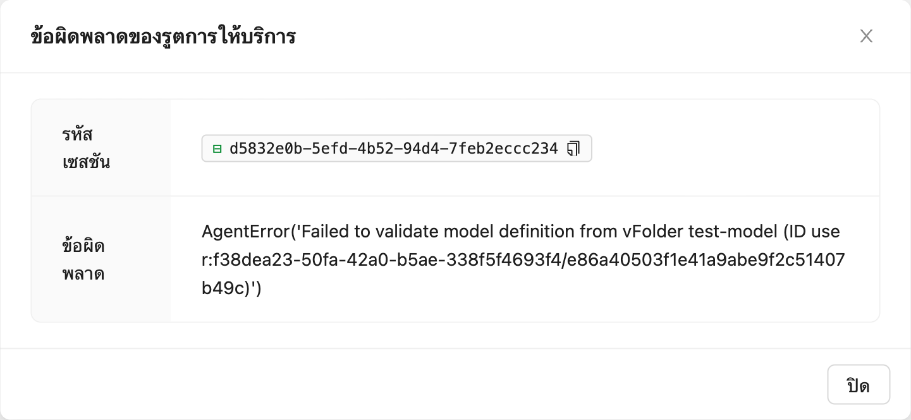

   -  วิธีแก้ไข: ตรวจสอบ[รูปแบบของไฟล์กำหนดโมเดล](#model-definition-guide) และ
      หากคู่คีย์-ค่าใดไม่ถูกต้อง ให้แก้ไขและเขียนทับไฟล์ในตำแหน่งที่บันทึกไว้
      จากนั้น คลิกปุ่ม `Clear error and retry` เพื่อลบข้อผิดพลาดทั้งหมดที่สะสมในตาราง
      ข้อมูลเส้นทาง และให้แน่ใจว่าการเส้นทางของบริการโมเดลถูกตั้งค่าอย่างถูกต้อง

   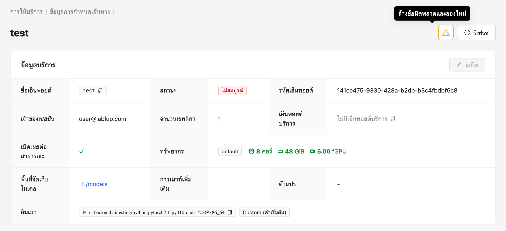

## หน้ารายละเอียด Endpoint

คลิกชื่อ endpoint ในรายการ Serving เพื่อดูข้อมูลรายละเอียดเกี่ยวกับการปรับใช้

### การแจ้งเตือนของการปรับใช้

หน้ารายละเอียด Endpoint แสดงแบนเนอร์แจ้งเตือนตามบริบทที่ด้านบนของหน้า ขึ้นอยู่กับสถานะปัจจุบันของการปรับใช้

- **การปรับใช้พร้อมแล้ว**: แสดงเมื่อการปรับใช้มีสถานะ `HEALTHY` แบนเนอร์นี้มีปุ่ม **Start Chat** เป็นทางลัดไปยังอินเทอร์เฟซ LLM Chat Test เพื่อให้คุณทดสอบโมเดลได้โดยไม่ต้องออกจากหน้า


<!-- TODO: Capture screenshot — Deployment Ready alert with Start Chat shortcut -->

- **การปรับใช้แบบส่วนตัว — ใช้โทเค็นการเข้าถึงเพื่อเข้าถึงปลายทาง**: แสดงเมื่อ **เปิดให้สาธารณะ** ถูกปิดใช้งาน แบนเนอร์นี้มีทางลัดไปยัง **จัดการโทเค็นการเข้าถึง** เพื่อให้คุณออกหรือคัดลอกโทเค็นได้ ดูรายละเอียดที่ [การสร้างโทเค็น](#generating-tokens)

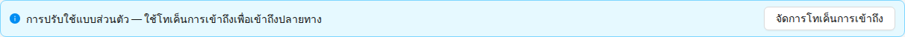
<!-- TODO: Capture screenshot — Private deployment alert with access-token shortcut -->

- **ไม่มีการปรับใช้รุ่นแก้ไข — เพิ่มรุ่นแก้ไขเพื่อเปิดใช้งานบริการนี้**: แสดงเมื่อการปรับใช้ยังไม่มี Revision ปัจจุบัน คลิก `เพิ่ม Revision` เพื่อสร้าง Revision แรกและเปิดใช้งานบริการ

- **กำลังเตรียมบริการของคุณ**: แสดงเมื่อการปรับใช้กำลังถูกสร้างหรืออยู่ระหว่างการเปลี่ยนสถานะ บ่งบอกว่าบริการยังไม่พร้อมรับคำขอ


- **บริการโมเดลนี้อยู่ในโปรเจกต์อื่น**: แสดงเมื่อ endpoint เป็นของโปรเจกต์อื่นที่ไม่ใช่โปรเจกต์ที่เลือกในปัจจุบัน ปุ่ม Edit จะถูกปิดใช้งานขณะที่การแจ้งเตือนนี้แสดงอยู่ คลิกปุ่ม **สลับโปรเจกต์** ในการแจ้งเตือนเพื่อสลับไปยังโปรเจกต์ที่ถูกต้อง

### ข้อมูลบริการ

การ์ดข้อมูลบริการแสดงรายละเอียดต่อไปนี้:

- **ชื่อการปรับใช้** และ **สถานะ**
- **ID การปรับใช้** และ **เจ้าของเซสชัน**
- **การมองเห็น (Visibility)**: แสดงเป็นแท็ก Public / Private โดย **Public** หมายความว่าสามารถเข้าถึง endpoint ได้โดยไม่ต้องใช้ access token และ **Private** หมายความว่าผู้เรียกต้องส่ง access token ที่ถูกต้องมาด้วย
- **จำนวนเรพลิกา**
- **Service Endpoint**: URL สำหรับเข้าถึงการปรับใช้ สำหรับการปรับใช้ LLM จะมีปุ่ม `ทดสอบในแชท` ให้ใช้งาน
- **Resource Group**: resource group ที่การปรับใช้ทำงานอยู่ ปัจจุบัน resource group เป็นส่วนหนึ่งของเมตาดาตาในระดับการปรับใช้ (ตั้งครั้งเดียวเมื่อสร้างการปรับใช้) ไม่ใช่ระดับ Revision อีกต่อไป
- **ทรัพยากร**: CPU, หน่วยความจำ, accelerator และ **หน่วยความจำที่ใช้ร่วมกัน (SHM)** ที่จัดสรร ค่าหน่วยความจำที่ใช้ร่วมกันมาจาก Revision ปัจจุบัน และแสดงขนาดของ `/dev/shm` ที่ inference server สามารถใช้ได้ ซึ่งสำคัญสำหรับ workload การอนุมานแบบ multi-GPU และ multi-process
- **Model Storage**: โฟลเดอร์จัดเก็บโมเดลที่เมาต์และปลายทางเมาต์
- **เมาต์เพิ่มเติม**: โฟลเดอร์จัดเก็บเพิ่มเติมที่เมาต์
- **ตัวแปรสภาพแวดล้อม**: แสดงเป็นบล็อกโค้ด
- **อิมเมจ**: อิมเมจคอนเทนเนอร์ที่ใช้สำหรับบริการ

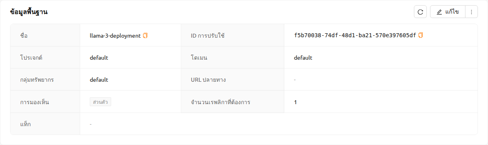
<!-- TODO: Capture screenshot — Visibility row with Public/Private tag and Deployment ID -->


<!-- TODO: Capture screenshot — SHM displayed in endpoint detail config -->

#### เมนูเพิ่มเติม (แก้ไขและลบ)

ส่วนหัวของการ์ดข้อมูลบริการมีปุ่ม **Edit** ควบคู่ไปกับเมนู **เพิ่มเติม** ปัจจุบันเมนูเพิ่มเติมมีการกระทำ **Delete Deployment**

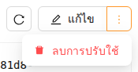
<!-- TODO: Capture screenshot — More menu containing Delete action -->

ไอคอนการลบและถังขยะทั่วทั้งหน้า Model Serving ใช้แบบแผนต่อไปนี้

- **ไอคอนถังขยะแบบทึบ (`DeleteFilled`)** — *ลบถาวร* การยืนยันจะเปิดหน้าต่างยืนยันแบบพิมพ์ ซึ่งคุณต้องพิมพ์ชื่อการปรับใช้ก่อนจะกดปุ่ม OK ได้ และไม่สามารถยกเลิกการกระทำได้
- **ไอคอนถังขยะแบบเส้น (`DeleteOutlined`)** — *ย้ายไปถังขยะ* (soft delete) การยืนยันจะส่งรายการไปยังถังขยะที่สามารถกู้คืนได้

ตรวจสอบรูปแบบของไอคอนทุกครั้งก่อนยืนยันการลบ

### เรพลิกา

แท็บเรพลิกาแสดง routing node ที่ประกอบกันเป็นการปรับใช้ รายการเรพลิกาจะถูกกรองด้วยตัวควบคุมแบบ radio **Running / Terminated** ที่ด้านบนของแท็บ ซึ่งแทนที่ตัวกรองสถานะแบบ enum เดิม

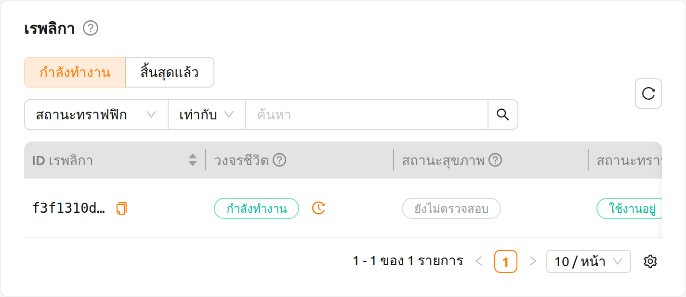
<!-- TODO: Capture screenshot — Running/Terminated radio filter -->

- **Running**: แสดงเรพลิกาที่กำลังเตรียม กำลังทำงาน หรืออยู่ในสถานะใช้งานอื่น ๆ
- **Terminated**: แสดงเรพลิกาที่สิ้นสุด lifecycle แล้ว

แต่ละแถวของเรพลิกามีฟิลด์สถานะอิสระสามฟิลด์

- **สถานะ Lifecycle**: ตำแหน่งของเรพลิกาใน lifecycle (เช่น *Provisioning*, *Running*, *Terminating*)
- **สถานะสุขภาพ**: สถานะสุขภาพปัจจุบันของกระบวนการเรพลิกา (เช่น *Healthy*, *Unhealthy*)
- **สถานะ Traffic**: เรพลิกากำลังให้บริการคำขออยู่หรือไม่

คลิก node ของเรพลิกาเพื่อเปิด drawer รายละเอียดเซสชันสำหรับดูข้อมูลเซสชันแต่ละรายการ

หากเรพลิกาพบข้อผิดพลาด คลิกที่ตัวบ่งชี้ข้อผิดพลาดในแถวเพื่อเปิดหน้าต่าง JSON viewer ที่แสดงข้อมูลข้อผิดพลาดดิบ ซึ่งมีประโยชน์ในการวินิจฉัยปัญหาของเรพลิกาแต่ละตัว


<a id="revisions-tab"></a>

### แท็บ Revisions

แท็บ Revisions แสดงรายการ Revision ทุกตัวที่ถูกเพิ่มในการปรับใช้ เรียงตามหมายเลข Revision

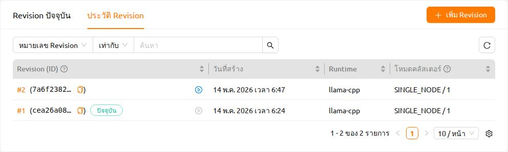
<!-- TODO: Capture screenshot — revision history with revision number column + filter/sort -->

คอลัมน์ที่แสดงประกอบด้วย

- **หมายเลข Revision**: จำนวนเต็มที่เพิ่มขึ้นซึ่งกำหนดตามลำดับการสร้าง ตัวเลขที่น้อยกว่าคือ Revision ที่เก่ากว่า แต่ละแถวยังแสดง Revision ID อ้างอิงด้วย
- **สถานะ**: สถานะปัจจุบันของ Revision (เช่น *Active*, *Inactive*, *Applying*)
- **Runtime**, **อิมเมจ**, และ **Resource Preset**: สรุปการกำหนดค่าของ Revision
- **สร้างเมื่อ**

คุณสามารถกรองและเรียงลำดับรายการตามทุกคอลัมน์ที่แสดง รวมถึงหมายเลข Revision, สถานะ, runtime variant และเวลาที่สร้าง

#### การนำ Revision มาใช้

ทุกแถวมีการกระทำ **นำมาใช้ (Apply)** เมื่อคลิก `นำมาใช้` Revision นั้นจะกลายเป็น Revision **ปัจจุบัน** การปรับใช้จะเริ่มให้บริการ traffic ด้วยการกำหนดค่าใหม่ และ Revision ที่เคย active ก่อนหน้าจะกลายเป็น inactive ขณะที่ Revision ใหม่กำลังถูก roll out การปรับใช้จะแสดงการแจ้งเตือน *กำลังนำ Revision ถัดไปมาใช้* และการกระทำ Apply จะถูกปิดใช้งานเพื่อป้องกันการนำมาใช้ซ้อนกัน

:::note
ในทุกพื้นผิว UI ที่เกี่ยวกับ Revision (การกระทำในแถว, การยืนยันในหน้าต่าง, ข้อความแจ้งเตือน) ชื่อการกระทำถูกรวมเป็น **นำมาใช้ (Apply)** คำเดิม เช่น *Activate* หรือ *Promote* ถูกรวมให้เป็น **Apply** แล้ว
:::

<a id="revision-info"></a>

### ข้อมูลรีวิชัน

:::note
การ์ดข้อมูลรีวิชันจะใช้งานได้เมื่อเซิร์ฟเวอร์รองรับ Model Card v2
(Backend.AI เวอร์ชัน 26.4.0 ขึ้นไป)
:::

การ์ดข้อมูลรีวิชันบนหน้ารายละเอียด Endpoint จะแสดงการกำหนดค่าของ **รีวิชันล่าสุด** — รีวิชันที่อยู่ในคิวเพื่อนำไปใช้ถัดไป ซึ่งอาจแตกต่างจากรีวิชันที่กำลังทำงานอยู่บนบริการในปัจจุบัน


การ์ดจะแสดงฟิลด์ต่อไปนี้:

- **Revision ID**: ตัวระบุของรีวิชันล่าสุด
- **Model Name**: ชื่อโมเดลตามที่กำหนดในคำจำกัดความโมเดล
- **Model Path**: เส้นทางที่โมเดลถูกเมาต์
- **Start Command**: คำสั่งที่ใช้เริ่มเซิร์ฟเวอร์ inference
- **Port**: พอร์ตคอนเทนเนอร์สำหรับบริการโมเดล
- **Health Check Path**: เส้นทาง HTTP endpoint สำหรับการตรวจสอบสุขภาพ
- **Initial Delay**: วินาทีที่ต้องรอก่อนการตรวจสอบสุขภาพครั้งแรก
- **Max Retries**: จำนวนสูงสุดของการตรวจสอบสุขภาพที่ล้มเหลวต่อเนื่องที่อนุญาต

#### สถานะรีวิชันไม่ตรงกัน

เมื่อมีรีวิชันใหม่ถูกเพิ่มในคิวแต่บริการยังคงทำงานบนรีวิชันก่อนหน้า การ์ดข้อมูลรีวิชันจะแสดงการแจ้งเตือน **"กำลังใช้งานรีวิชันถัดไป"** สิ่งนี้บ่งบอกว่าค่ารีวิชันล่าสุดที่แสดงในการ์ดยังไม่ตรงกับการกำหนดค่าที่กำลังทำงานอยู่


คลิกปุ่ม **ดูรีวิชันปัจจุบัน** เพื่อเปิดโมดอลที่แสดงคำจำกัดความโมเดลของรีวิชันที่ **กำลังทำงานอยู่ในปัจจุบัน** ทำให้คุณสามารถเปรียบเทียบรีวิชันที่กำลังจะมา (แสดงในการ์ดข้อมูลรีวิชัน) กับรีวิชันที่ใช้งานอยู่ (แสดงในโมดอล)

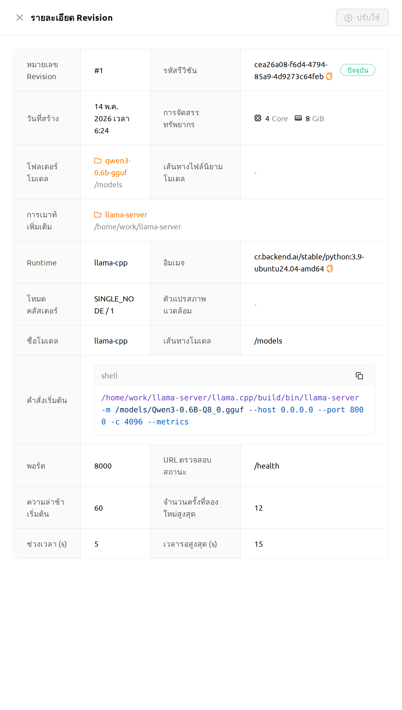

:::tip
สรุป: **การ์ดข้อมูลรีวิชัน** จะแสดง **ค่ารีวิชันล่าสุด/ที่กำลังจะมา** เสมอ
ขณะที่ **โมดอลดูรีวิชันปัจจุบัน** จะแสดง **ค่ารีวิชันที่กำลังทำงานอยู่ในปัจจุบัน**
:::

#### พฤติกรรมการแก้ไขพร้อมรีวิชัน (เฉพาะ Custom เท่านั้น)

เมื่อคุณคลิกปุ่ม **Edit** บนแผงข้อมูลบริการสำหรับบริการที่ใช้ตัวแปร runtime `Custom` ฟอร์มตัวเปิดใช้บริการจะถูกกรอกล่วงหน้าด้วยค่าคำจำกัดความโมเดลของรีวิชันล่าสุดเป็นค่าเริ่มต้น ทำให้ง่ายต่อการปรับการตั้งค่าทีละน้อยโดยไม่ต้องกรอกฟิลด์ทั้งหมดใหม่

:::note
พฤติกรรมการกรอกล่วงหน้าของค่าการกำหนดโมเดลนี้ใช้ได้เฉพาะกับตัวแปร runtime `Custom` เท่านั้น
ตัวแปร `vLLM` และ `SGLang` ไม่ใช้ฟิลด์การกำหนดโมเดล แต่จะแสดงส่วน **พารามิเตอร์ Runtime**
(`inference_runtime_config`) สำหรับการกำหนดค่าเฉพาะเฟรมเวิร์ก
การกำหนดโมเดลและพารามิเตอร์ runtime เป็นแนวคิดที่แตกต่างกันและจัดเก็บแยกกันในรีวิชัน
:::

### กฎการปรับขนาดอัตโนมัติ

กฎการปรับขนาดอัตโนมัติ (Auto Scaling Rules) จะเพิ่มหรือลดจำนวนเรพลิกาของบริการโมเดลโดยอัตโนมัติตามเมตริกสด ช่วยประหยัดทรัพยากรในช่วงการใช้งานต่ำ และป้องกันความล่าช้าหรือความล้มเหลวของคำขอในช่วงการใช้งานสูง

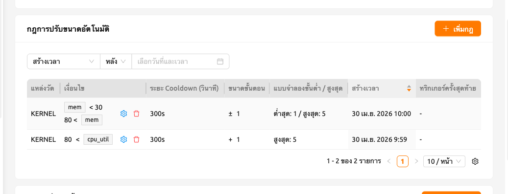

รายการกฎให้บริการดังนี้:

- แถบตัวกรองคุณสมบัติสำหรับกรองกฎตามช่วงวันเวลาของ สร้างเวลา (Created At) และ ทริกเกอร์ครั้งสุดท้าย (Last Triggered)
- การแบ่งหน้าที่ฝั่งเซิร์ฟเวอร์
- คอลัมน์ต่อไปนี้: แหล่งวัด (Metric Source), เงื่อนไข (Condition), ระยะ Cooldown (Cooldown Sec.), ขนาดขั้นตอน (Step Size), แบบจำลองขั้นต่ำ / สูงสุด (Min / Max Replicas), สร้างเวลา (Created At), ทริกเกอร์ครั้งสุดท้าย (Last Triggered) คอลัมน์ขนาดขั้นตอนจะแสดง `+`, `−`, หรือ `±` โดยอัตโนมัติตามทิศทางที่ได้จากเกณฑ์ที่คุณตั้งไว้ ดังนั้นคุณจึงไม่ต้องเลือก `Scale Out` หรือ `Scale In` โดยตรงอีกต่อไป
- ไอคอนแก้ไขและลบต่อแถว แสดงถัดจากสรุปเงื่อนไขในแต่ละแถว

คลิกปุ่ม `Add Rules` เพื่อเปิดตัวแก้ไข **เพิ่มกฎการปรับขนาดอัตโนมัติ** หากต้องการแก้ไขกฎที่มีอยู่ ให้คลิกไอคอนแก้ไขในแถวนั้น ตัวแก้ไข **แก้ไขกฎการปรับขนาดอัตโนมัติ** จะเปิดขึ้นโดยมีค่าของกฎที่กรอกไว้ล่วงหน้า ตัวแก้ไขประกอบด้วยฟิลด์ต่อไปนี้ตามลำดับ:

- **แหล่งวัด (Metric Source)**: เลือก `Kernel`, `Inference Framework` หรือ `Prometheus`
- **ชื่อเมตริก (Metric Name)**: สำหรับ `Kernel` และ `Inference Framework` ให้ใส่ชื่อเมตริก สำหรับ `Kernel` จะมีเมตริกทั่วไป เช่น `cpu_util`, `mem`, `net_rx` และ `net_tx` เป็นคำแนะนำให้เติมอัตโนมัติ และคุณยังสามารถพิมพ์ชื่อที่กำหนดเองได้อย่างอิสระ
- **ชื่อเมตริกแบบ Preset (Metric Name (Prometheus Preset))**: แสดงเฉพาะเมื่อแหล่งวัดเป็น `Prometheus` เลือก preset จากดรอปดาวน์ ชื่อเมตริก เทมเพลตคิวรี และ (เมื่อกำหนดไว้) ระยะ Cooldown (Cooldown Sec.) ของ preset จะถูกกรอกโดยอัตโนมัติ ด้านล่างตัวเลือก การแสดงตัวอย่างค่าปัจจุบัน (Current value) จะแสดงค่าล่าสุดที่ preset ส่งกลับพร้อมปุ่มรีเฟรช เมื่อมีชุดข้อมูลหลายชุดถูกส่งกลับ การแสดงตัวอย่างจะแสดงจำนวนชุดข้อมูลและค่าล่าสุด หากไม่มีข้อมูลให้ใช้งาน จะแสดงเป็น ไม่มีข้อมูล (No data available)
- **เงื่อนไข (Condition)**: ตัวควบคุมแบบแบ่งส่วนสำหรับเลือกทิศทางการปรับขนาด มีสามตัวเลือก

   * **Scale In**: ลดจำนวนเรพลิกาเมื่อเมตริกต่ำกว่าเกณฑ์ กำหนดเงื่อนไข `Metric < [เกณฑ์]`
   * **Scale Out**: เพิ่มจำนวนเรพลิกาเมื่อเมตริกสูงกว่าเกณฑ์ กำหนดเงื่อนไข `Metric > [เกณฑ์]`
   * **Scale In & Out**: ปรับขยายหรือลดขนาดโดยอัตโนมัติตามด้านที่เมตริกข้ามออกจากช่วงที่กำหนด กำหนดเงื่อนไข `Metric < Min Threshold` หรือ `Metric > Max Threshold`

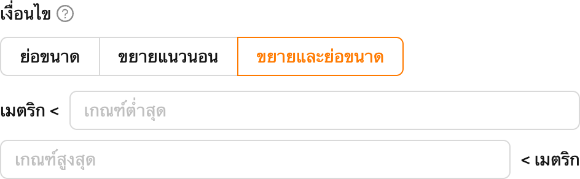

- **ขนาดขั้นตอน (Step Size)**: จำนวนเต็มบวกที่ระบุจำนวนเรพลิกาที่จะเพิ่มหรือลบต่อเหตุการณ์การปรับขนาด เครื่องหมาย `-`, `+`, หรือ `±` จะแสดงโดยอัตโนมัติตามเงื่อนไขที่เลือก (Scale In / Scale Out / Scale In & Out)

   * ตั้งเฉพาะเกณฑ์ต่ำสุด: `[metric] < [minThreshold]` จะทริกเกอร์ **Scale In** (เรพลิกาลดลงเมื่อเมตริกต่ำกว่าเกณฑ์)
   * ตั้งเฉพาะเกณฑ์สูงสุด: `[metric] > [maxThreshold]` จะทริกเกอร์ **Scale Out** (เรพลิกาเพิ่มขึ้นเมื่อเมตริกสูงกว่าเกณฑ์)
   * ตั้งทั้งสองเกณฑ์: เรพลิกาจะถูกเพิ่มหรือลดตามขอบเขตที่เมตริกข้ามผ่าน (`[minThreshold] < [metric] < [maxThreshold]` คือช่วงการทำงานปกติ)

- **ระยะ Cooldown (Cooldown Sec.)**: เวลาเป็นวินาทีที่รอหลังจากเหตุการณ์การปรับขนาดก่อนการประเมินครั้งถัดไป
- **แบบจำลองขั้นต่ำ (Min Replicas) และแบบจำลองสูงสุด (Max Replicas)**: ขอบเขตล่างและบนที่การปรับขนาดอัตโนมัติบังคับใช้กับจำนวนเรพลิกา การปรับขนาดอัตโนมัติจะไม่ลดจำนวนเรพลิกาต่ำกว่าแบบจำลองขั้นต่ำ หรือเพิ่มให้มากกว่าแบบจำลองสูงสุด

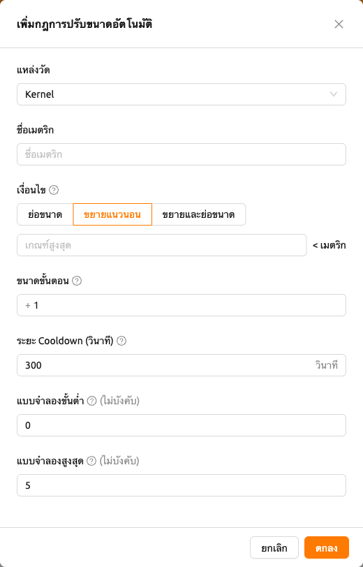

เมื่อแหล่งวัด (Metric Source) ถูกตั้งเป็น `Prometheus` ตัวแก้ไขจะแสดงตัวเลือก preset และการแสดงตัวอย่างค่าปัจจุบัน (Current value) แบบสด

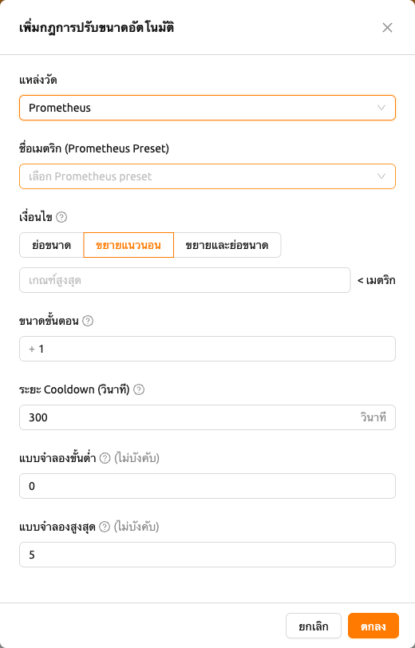

<a id="generating-tokens"></a>

### การสร้างโทเค็น

เมื่อบริการโมเดลทำงานสำเร็จแล้ว สถานะจะถูกตั้งเป็น
`HEALTHY` คุณสามารถคลิกที่ชื่อ endpoint ที่สอดคล้องในรายการ Serving
เพื่อดูข้อมูลรายละเอียด คุณสามารถตรวจสอบ service endpoint ใน
ข้อมูลการเส้นทาง หากตัวเลือก **Open To Public**
เปิดใช้งานเมื่อสร้างบริการ endpoint จะสามารถเข้าถึงได้สาธารณะ
โดยไม่ต้องใช้โทเค็นแยกต่างหาก
อย่างไรก็ตาม หากถูกปิดใช้งาน คุณสามารถออกโทเค็นตามที่อธิบายด้านล่าง
เพื่อตรวจสอบว่าบริการทำงานอย่างถูกต้อง

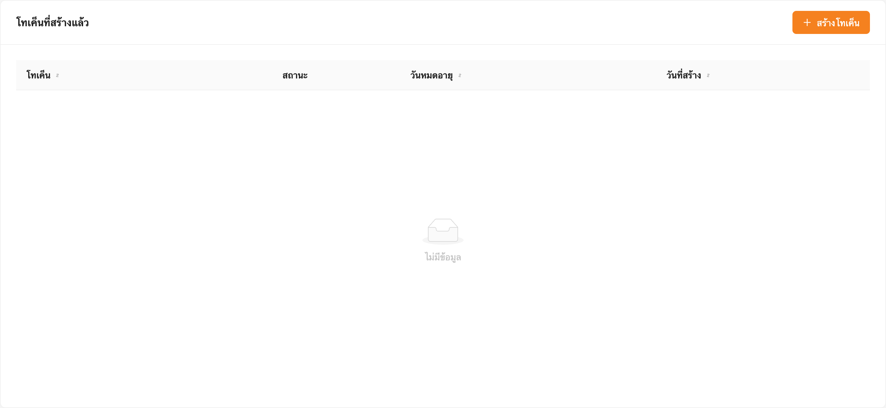

คลิกปุ่ม `Generate Token` ที่อยู่ทางขวาของรายการโทเค็นที่สร้างขึ้น
ในโมดอลที่ปรากฏขึ้น ให้ใส่วันที่หมดอายุ

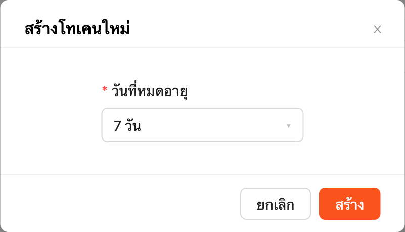

โทเค็นที่ออกจะถูกเพิ่มลงในรายการโทเค็นที่สร้างขึ้น แต่ละโทเค็นจะแสดง **สถานะ** (ใช้ได้หรือหมดอายุ), **วันที่หมดอายุ** และ **วันที่สร้าง** คลิกปุ่ม `copy` ในรายการโทเค็น
เพื่อคัดลอกโทเค็น และเพิ่มเป็นค่าของคีย์ต่อไปนี้

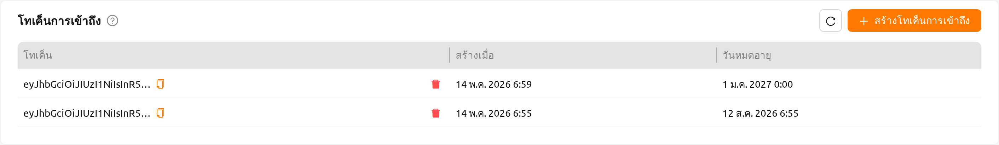

| Key           | Value            |
|---------------|------------------|
| Content-Type  | application/json |
| Authorization | BackendAI        |

### ข้อมูลเส้นทาง

การ์ดข้อมูลเส้นทางแสดงสถานะการเส้นทางของบริการโมเดล คุณสามารถกรองเส้นทางตาม:

- **Running / Finished**: สลับระหว่างโหนดเส้นทางที่ใช้งานอยู่และที่เสร็จสิ้น
- **ตัวกรองคุณสมบัติ**: กรองตามสถานะสุขภาพและสถานะการรับส่งข้อมูล


คลิกโหนดเส้นทางเพื่อเปิดลิ้นชักรายละเอียดเซสชัน ซึ่งคุณสามารถดูรายละเอียดเซสชันแต่ละรายการ

หากเส้นทางพบข้อผิดพลาด การคลิกตัวบ่งชี้ข้อผิดพลาดบนแถวเส้นทางจะเปิดโมดอล JSON viewer ที่แสดงข้อมูลข้อผิดพลาดดิบสำหรับเส้นทางนั้น สิ่งนี้มีประโยชน์สำหรับการวินิจฉัยปัญหาของโหนดเส้นทางแต่ละรายการ


### การแก้ไขบริการ

คลิกปุ่ม `Edit` บนหน้ารายละเอียด endpoint เพื่อแก้ไขบริการโมเดล ตัวเปิดใช้บริการจะเปิดขึ้นพร้อมฟิลด์ที่ป้อนไว้ก่อนหน้านี้ คุณสามารถเลือกแก้ไขเฉพาะฟิลด์ที่คุณต้องการเปลี่ยนแปลง หลังจากแก้ไขฟิลด์แล้ว ให้คลิก `Update` เพื่อใช้การเปลี่ยนแปลง

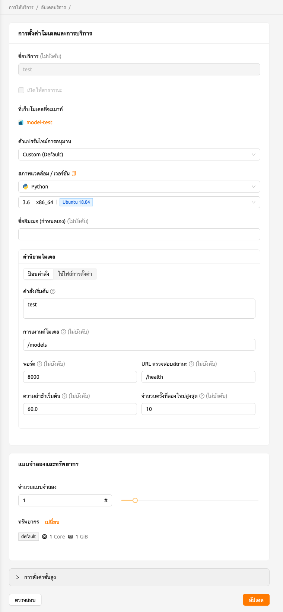

### การยุติบริการ

บริการโมเดลจะรันตัวจัดตารางเป็นระยะๆ เพื่อปรับจำนวนการเส้นทาง
ให้ตรงกับจำนวนเซสชันที่ต้องการ อย่างไรก็ตาม สิ่งนี้สร้างภาระให้กับ
ตัวจัดตาราง Backend.AI ดังนั้น แนะนำให้ยุติการปรับใช้หากไม่จำเป็นต้องใช้แล้ว
หากต้องการยุติการปรับใช้ ให้เปิดเมนู **เพิ่มเติม** บนการ์ดข้อมูลบริการ และเลือก **Delete Deployment**
หน้าต่างยืนยันแบบพิมพ์จะปรากฏขึ้น — พิมพ์ชื่อการปรับใช้เพื่อเปิดใช้งานปุ่ม **ลบถาวร**
การปรับใช้ที่ยุติแล้วจะปรากฏในมุมมองตัวกรอง **Destroyed**

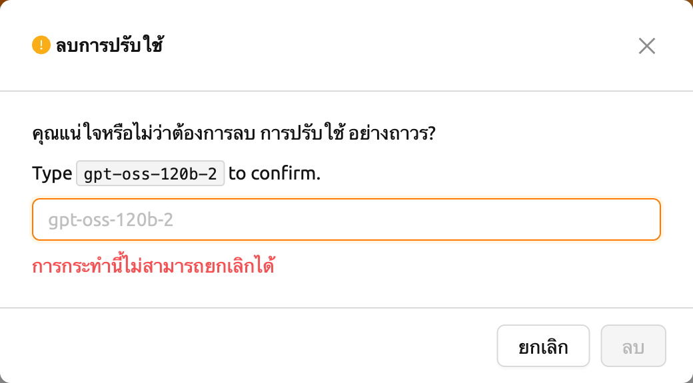

## การเข้าถึง Service Endpoint

### การส่งคำขอ API

เพื่อให้การให้บริการโมเดลสมบูรณ์ คุณต้องแบ่งปันข้อมูลกับ
ผู้ใช้ปลายทางจริงเพื่อให้พวกเขาสามารถเข้าถึงเซิร์ฟเวอร์ที่
บริการโมเดลกำลังทำงานอยู่ หากตัวเลือก **Open To Public** เปิดใช้งานเมื่อ
สร้างบริการ คุณสามารถแบ่งปันค่า service endpoint จากหน้ารายละเอียด endpoint
หากบริการถูกสร้างด้วยตัวเลือกปิดใช้งาน
คุณสามารถแบ่งปันค่า service endpoint พร้อมกับโทเค็นที่สร้างขึ้นก่อนหน้านี้

นี่คือคำสั่ง `curl` ง่ายๆ เพื่อตรวจสอบว่าการส่งคำขอไปยัง
endpoint การให้บริการโมเดล ทำงานอย่างถูกต้องหรือไม่:

```bash
export API_TOKEN="<token>"
export MODEL_SERVICE_ENDPOINT="<model-service-endpoint>"
curl -H "Content-Type: application/json" -X GET \
  -H "Authorization: BackendAI $API_TOKEN" \
  "$MODEL_SERVICE_ENDPOINT"
```

:::warning
โดยค่าเริ่มต้น ผู้ใช้ปลายทางต้องอยู่ในเครือข่ายที่สามารถเข้าถึง
endpoint ได้ หากบริการถูกสร้างในเครือข่ายปิด เฉพาะผู้ใช้ปลายทาง
ที่มีการเข้าถึงภายในเครือข่ายปิดนั้นเท่านั้นที่สามารถเข้าถึงบริการได้
:::

### การทดสอบ LLM Chat

หากคุณสร้างบริการ Large Language Model (LLM) คุณสามารถทดสอบ LLM แบบเรียลไทม์
คลิกปุ่ม `LLM Chat Test` ที่อยู่ในส่วน Service Endpoint ของหน้ารายละเอียด endpoint

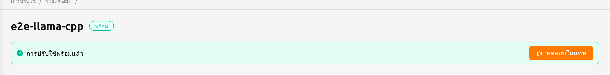

คุณจะถูกเปลี่ยนเส้นทางไปยังหน้า Chat ซึ่งโมเดลที่คุณสร้างจะถูกเลือกโดยอัตโนมัติ
โดยใช้อินเทอร์เฟซแชทที่ให้บริการในหน้า Chat คุณสามารถทดสอบโมเดล LLM
สำหรับข้อมูลเพิ่มเติมเกี่ยวกับฟีเจอร์แชท โปรดดู [หน้าแชท](#chat-page)

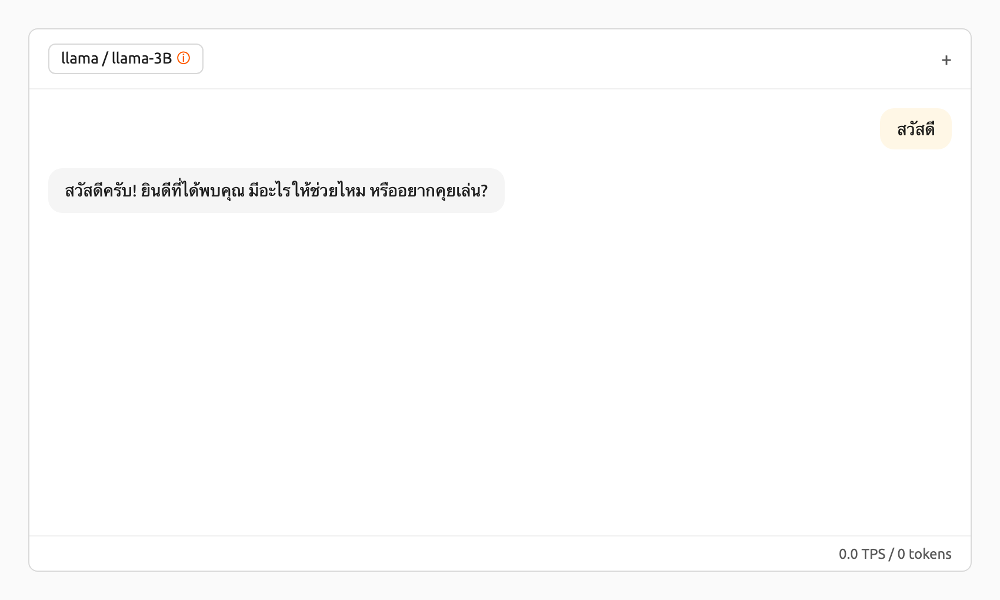

หากคุณพบปัญหาในการเชื่อมต่อกับ API หน้าแชทจะแสดงตัวเลือกที่ให้คุณกำหนดค่าการตั้งค่าโมเดลด้วยตนเอง
ในการใช้โมเดล คุณจะต้องมีข้อมูลต่อไปนี้:

- **baseURL** (ไม่บังคับ): Base URL ของเซิร์ฟเวอร์ที่โมเดลตั้งอยู่
  ตรวจสอบให้แน่ใจว่าได้รวมข้อมูลเวอร์ชัน
  เช่น เมื่อใช้ OpenAI API คุณควรใส่ https://api.openai.com/v1
- **Token** (ไม่บังคับ): คีย์การรับรองความถูกต้องเพื่อเข้าถึงบริการโมเดล โทเค็นสามารถ
  สร้างได้จากบริการต่างๆ ไม่ใช่แค่ Backend.AI เท่านั้น รูปแบบและกระบวนการสร้าง
  อาจแตกต่างกันไปขึ้นอยู่กับบริการ ควรอ้างถึงคู่มือของบริการเฉพาะสำหรับรายละเอียด
  เช่น เมื่อใช้บริการที่สร้างโดย Backend.AI โปรดดู
  [การสร้างโทเค็น](#generating-tokens) สำหรับคำแนะนำเกี่ยวกับวิธีสร้างโทเค็น

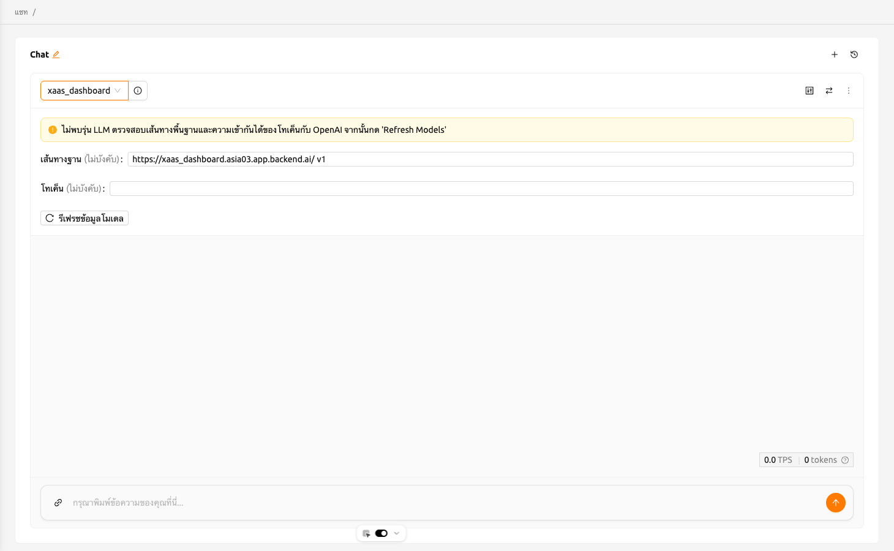

<a id="model-store"></a>

## คลังโมเดล

คลังโมเดล (Model Store) ให้บริการแกลเลอรีแบบการ์ดของโมเดลที่กำหนดค่าไว้ล่วงหน้าซึ่งคุณสามารถเรียกดู ค้นหา และ deploy ได้ คุณสามารถเข้าถึงคลังโมเดลได้จากเมนูด้านข้าง

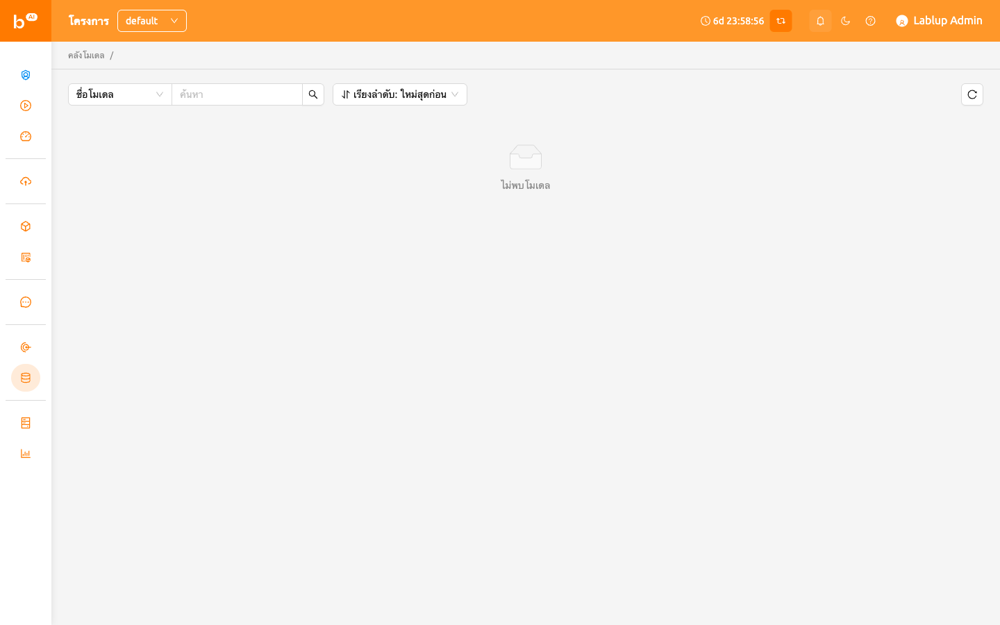

### การเรียกดูและค้นหาโมเดล

ส่วนบนของหน้าใช้รูปแบบค้นหาและเรียงลำดับ:

- **ค้นหาโมเดล (Search Models)**: ใช้ตัวกรองคุณสมบัติ กรองตามชื่อ (Filter By Name) เพื่อค้นหาการ์ดโมเดลตามชื่อ
- **เรียงลำดับ (Sort)**: เลือกวิธีการเรียงลำดับผลลัพธ์ ตัวเลือกที่ใช้งานได้คือ `ชื่อ (A→Z)`, `ชื่อ (Z→A)`, `เก่าสุดก่อน` และ `ใหม่สุดก่อน`
- **รีเฟรช (Refresh)**: คลิกปุ่มรีเฟรชเพื่อโหลดรายการการ์ดใหม่

การ์ดแต่ละใบจะแสดงไอคอนแบรนด์ของโมเดล ชื่อเรื่อง (หรือชื่อเมื่อไม่มีการตั้งชื่อเรื่อง) แท็กงาน เวลาสร้างแบบสัมพัทธ์ และผู้เขียน (Author) พร้อมไอคอน การ์ดที่ **ไม่มี preset ที่เข้ากันได้** สำหรับโปรเจกต์ปัจจุบันจะถูกแสดงที่ความโปร่งใส 50 % คุณสามารถเปิดการ์ดดังกล่าวเพื่อดูรายละเอียดได้ แต่ปุ่ม `Deploy` จะถูกปิดใช้งานและมีการแจ้งเตือนข้อผิดพลาด **ไม่มี preset ที่เข้ากันได้ ไม่สามารถ deploy โมเดลนี้ได้** แสดงใน Drawer

หากไม่ได้ตั้งค่าโปรเจกต์ `MODEL_STORE` บนเซิร์ฟเวอร์ หน้าจะแสดงข้อความ *ไม่พบโปรเจกต์ Model Store* พร้อมคำแนะนำให้ติดต่อผู้ดูแลระบบ หากไม่มีการ์ดโมเดลใดที่ตรงกับตัวกรองของคุณ หน้าจะแสดง *ไม่พบโมเดล*

รายการจะถูกแบ่งหน้าที่ด้านล่าง คุณสามารถเปลี่ยนขนาดหน้าระหว่าง `10`, `20` และ `50` รายการได้

### รายละเอียดการ์ดโมเดล

คลิกการ์ดเพื่อเปิด Drawer การ์ดโมเดลทางด้านขวาของหน้า Drawer จะแสดงชื่อเรื่องและคำอธิบายโมเดลที่ด้านบน ตามด้วยแท็กงาน หมวดหมู่ ป้ายกำกับ และใบอนุญาต จากนั้นจะเป็นรายการรายละเอียดที่มีรายการต่อไปนี้:

- **ผู้เขียน (Author)**
- **สถาปัตยกรรม (Architecture)**
- **เฟรมเวิร์ก (Framework)** (เฟรมเวิร์กแต่ละตัวจะแสดงพร้อมไอคอน)
- **เวอร์ชัน (Version)**
- **สร้างเมื่อ (Created) และแก้ไขล่าสุด (Last Modified)** เวลาประทับ
- **โฟลเดอร์โมเดล (Model Folder)**: ลิงก์ที่คลิกได้ซึ่งเปิดตัวสำรวจโฟลเดอร์สำหรับโฟลเดอร์จัดเก็บโมเดล
- **ทรัพยากรขั้นต่ำ (Min Resource)**: ข้อกำหนดทรัพยากรขั้นต่ำ (CPU, หน่วยความจำ, GPU)

หากการ์ดโมเดลมี README จะถูกเรนเดอร์เป็นการ์ด `README.md` ที่ด้านล่างของ Drawer

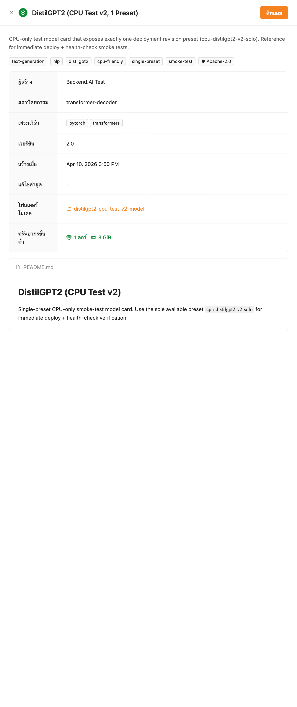

### การ Deploy โมเดล

คลิกปุ่ม `Deploy` ในส่วนหัวของ Drawer เพื่อ deploy โมเดลเป็นบริการ ขั้นตอนการ deploy ทำงานได้ด้วยหนึ่งในสองรูปแบบ:

- **Deploy อัตโนมัติ**: หากโมเดลมี preset ที่ใช้งานได้เพียงหนึ่งรายการ และโปรเจกต์ปัจจุบันมีกลุ่มทรัพยากรที่เข้าถึงได้เพียงหนึ่งรายการ การ deploy จะถูกสร้างขึ้นอย่างเงียบ ๆ โดยไม่มีโมดอลแสดงขึ้น หลังจาก endpoint พร้อมให้สืบค้นแล้ว คุณจะถูกนำไปยังหน้ารายละเอียด endpoint
- **โมดอล Deploy Model**: มิฉะนั้น โมดอล Deploy Model จะเปิดขึ้นพร้อมด้วยฟิลด์ที่จำเป็นต่อไปนี้

   * **Preset**: ดรอปดาวน์ที่จัดกลุ่มของ preset ทรัพยากรที่ใช้งานได้ เมื่อ preset ครอบคลุมตัวแปร runtime หลายตัว ตัวเลือกจะถูกจัดกลุ่มตามชื่อตัวแปร runtime มิฉะนั้น ตัวเลือกจะถูกแสดงเป็นรายการแบบแบน
   * **Resource Group**: กลุ่มทรัพยากรที่บริการจะทำงาน

   คลิกปุ่ม `Deploy` ในโมดอลเพื่อเริ่มการ deploy จะมีการแสดง toast แสดงความสำเร็จที่ยืนยันว่าโมเดลได้รับการ deploy แล้ว และคุณจะถูกนำไปยังหน้ารายละเอียด endpoint


:::note
หากโมเดลที่เลือกไม่มี preset ที่เข้ากันได้สำหรับโปรเจกต์ปัจจุบัน ปุ่ม `Deploy` ใน Drawer
จะถูกปิดใช้งาน และการ deploy จะถูกปิดกั้นจนกว่าจะมี preset ที่เข้ากันได้
:::


