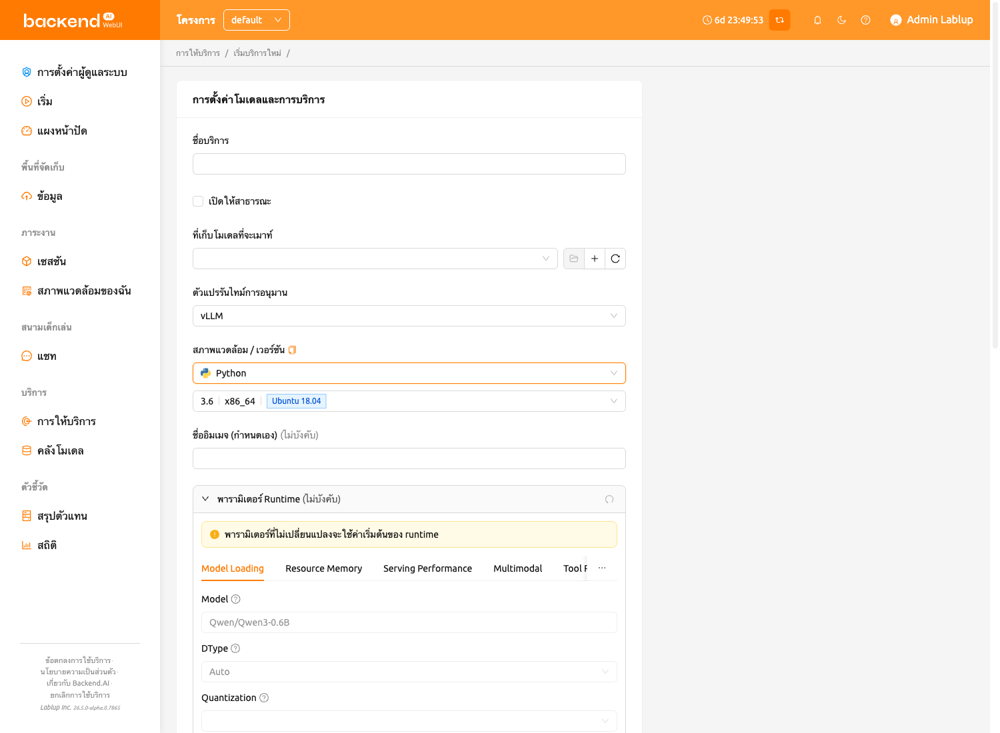
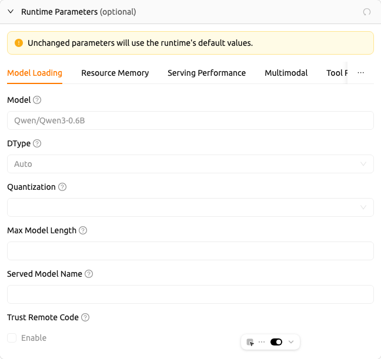
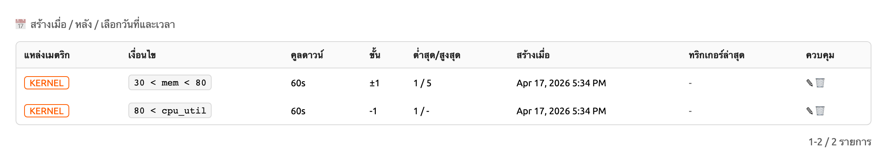
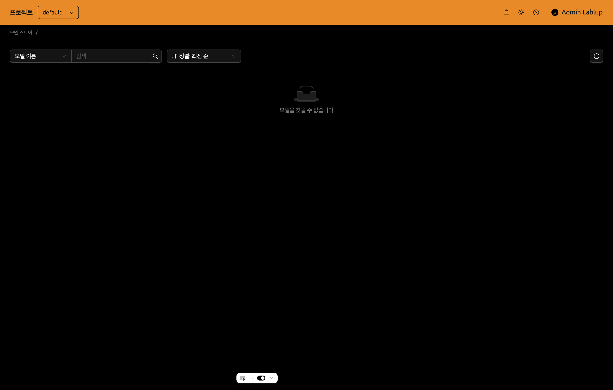
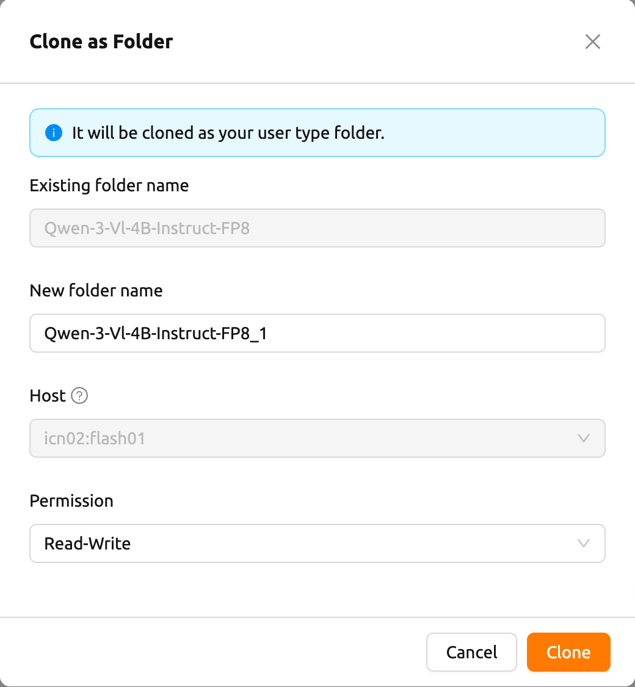
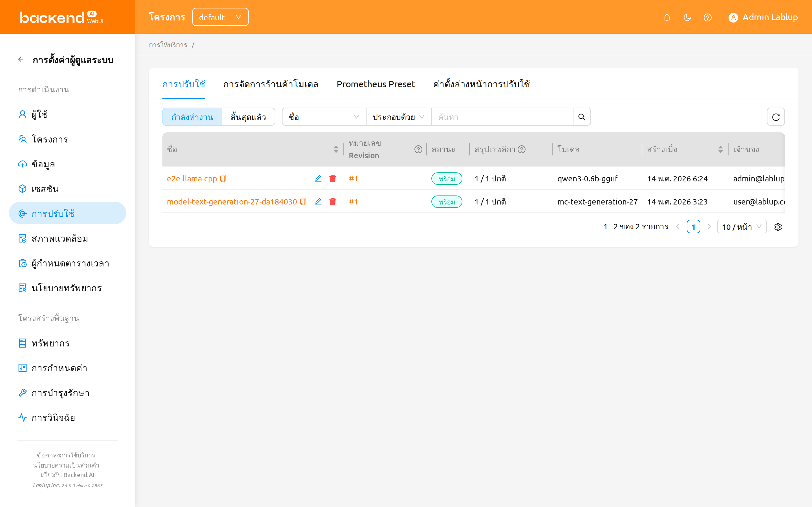
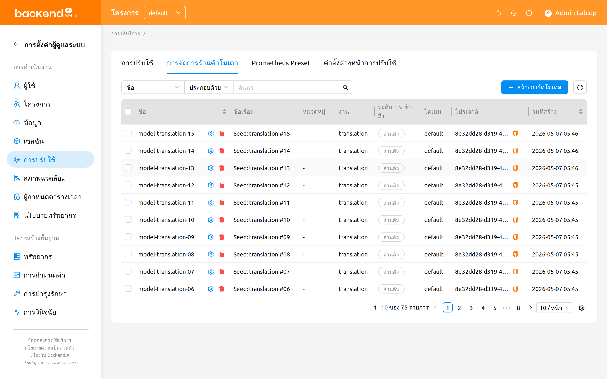

<a id="model-serving"></a>

# การให้บริการโมเดล

## บริการโมเดล


:::note
ฟีเจอร์นี้รองรับเฉพาะในเวอร์ชัน Enterprise เท่านั้น
:::

Backend.AI ไม่เพียงแต่อำนวยความสะดวกในการสร้างสภาพแวดล้อมการพัฒนา
และการจัดการทรัพยากรในช่วงการฝึกโมเดล แต่ยังสนับสนุน
ฟีเจอร์บริการโมเดลตั้งแต่เวอร์ชัน 23.09 เป็นต้นไป ฟีเจอร์นี้ช่วยให้
ผู้ใช้ปลายทาง (เช่น แอพมือถือและ backend ของเว็บเซอร์วิสที่ใช้ AI) สามารถเรียก
inference API ได้เมื่อต้องการ deploy โมเดลที่เสร็จสมบูรณ์แล้วเป็น
บริการ inference


บริการโมเดลขยายฟังก์ชันการทำงานของเซสชันการคำนวณสำหรับการฝึกที่มีอยู่ โดยช่วยให้การบำรุงรักษาอัตโนมัติ การปรับขนาด และการแมพตำแหน่งพอร์ตและที่อยู่เอ็นด์พอยต์ถาวรสำหรับบริการการผลิต ผู้พัฒนาหรือผู้ดูแลระบบจำเป็นต้องระบุพารามิเตอร์การปรับขนาดที่จำเป็นสำหรับบริการโมเดลเท่านั้น โดยไม่จำเป็นต้องสร้างหรือลบเซสชันการคำนวณด้วยตนเอง

<details>
<summary>บริการโมเดลในเวอร์ชัน 23.03 และก่อนหน้า</summary>

แม้ว่าฟีเจอร์เฉพาะสำหรับการให้บริการโมเดลจะได้รับการสนับสนุนอย่างเป็นทางการตั้งแต่
เวอร์ชัน 23.09 แต่คุณยังคงสามารถใช้บริการโมเดลในเวอร์ชันก่อนหน้าได้

ตัวอย่างเช่น ในเวอร์ชัน 23.03 คุณสามารถกำหนดค่าบริการโมเดลโดย
การแก้ไขเซสชันการคำนวณสำหรับการฝึกในวิธีต่อไปนี้:

1. เพิ่มพอร์ตที่เปิดไว้ล่วงหน้าระหว่างการสร้างเซสชัน เพื่อแมพพอร์ตเซิร์ฟเวอร์ที่ทำงานอยู่
   ภายในเซสชันสำหรับการให้บริการโมเดล
   (สำหรับคำแนะนำเกี่ยวกับวิธีใช้พอร์ตเปิดไว้ล่วงหน้า โปรดดู [ตั้งค่าพอร์ตเปิดไว้ล่วงหน้า](#set-preopen-ports))

2. เลือก 'เปิดแอพสู่สาธารณะ' เพื่ออนุญาตให้บริการที่แมพกับพอร์ตเปิดไว้ล่วงหน้า
   สามารถเข้าถึงได้สาธารณะ
   (สำหรับข้อมูลรายละเอียดเกี่ยวกับ "เปิดแอพสู่สาธารณะ" โปรดดู [เปิดแอพสู่สาธารณะ](#open-app-to-public))

อย่างไรก็ตาม มีข้อจำกัดบางประการในเวอร์ชัน 23.03:

-  เซสชันจะไม่ฟื้นคืนโดยอัตโนมัติหากถูกยกเลิกเนื่องจากปัจจัยภายนอก เช่น หมดเวลาไม่ทำงานหรือข้อผิดพลาดของระบบ
-  พอร์ตของแอพจะเปลี่ยนทุกครั้งที่เริ่มเซสชันใหม่
-  หากเซสชันถูกรีสตาร์ทซ้ำๆ พอร์ตที่ไม่ได้ใช้งานอาจหมดลง

ฟีเจอร์บริการโมเดลอย่างเป็นทางการในเวอร์ชัน 23.09 แก้ไขข้อจำกัดเหล่านี้
ดังนั้น ตั้งแต่เวอร์ชัน 23.09 เป็นต้นไป แนะนำให้สร้าง/จัดการบริการโมเดล
ผ่านเมนูการให้บริการโมเดลเมื่อทำได้ การใช้พอร์ตเปิดไว้ล่วงหน้าแนะนำเฉพาะ
สำหรับวัตถุประสงค์ในการพัฒนาและทดสอบเท่านั้น

</details>

## คู่มือขั้นตอนการใช้งานบริการโมเดล

เพื่อใช้บริการโมเดล คุณต้องปฏิบัติตามขั้นตอนด้านล่างนี้:

1. สร้างไฟล์กำหนดโมเดล
2. สร้างไฟล์กำหนดบริการ
3. อัปโหลดไฟล์กำหนดไปยังโฟลเดอร์ประเภทโมเดล
4. สร้าง/ตรวจสอบบริการโมเดลโดยใช้ตัวเปิดใช้บริการ
5. (ถ้าบริการโมเดลไม่เป็นสาธารณะ) รับโทเค็น
6. (สำหรับผู้ใช้ปลายทาง) เข้าถึง endpoint ที่สอดคล้องกับบริการโมเดลเพื่อตรวจสอบบริการ
7. (ถ้าจำเป็น) ปรับเปลี่ยนบริการโมเดล
8. (ถ้าจำเป็น) ยุติบริการโมเดล

:::tip
เป็นเวิร์กโฟลว์ทางเลือก คุณสามารถเรียกดูโมเดลที่กำหนดค่าไว้ล่วงหน้าใน
[Model Store](#model-store) และ deploy ด้วยคลิกเดียวโดยใช้ปุ่ม `Run this model`
(เปลี่ยนชื่อเป็น `Deploy` ในเวอร์ชัน 26.4.0 ขึ้นไป)
:::

<a id="model-definition-guide"></a>

### การสร้างไฟล์กำหนดโมเดล

:::note
ตั้งแต่เวอร์ชัน 24.03 คุณสามารถกำหนดชื่อไฟล์กำหนดโมเดลได้ หากคุณไม่ได้
ป้อนฟิลด์อื่นใดในเส้นทางไฟล์กำหนดโมเดล ระบบจะถือว่าเป็น `model-definition.yml`
หรือ `model-definition.yaml`
:::

ไฟล์กำหนดโมเดลประกอบด้วยข้อมูลการกำหนดค่าที่ระบบ Backend.AI ต้องการเพื่อเริ่มต้น เตรียมการ และปรับขนาดเซสชัน inference โดยอัตโนมัติ ไฟล์นี้ถูกจัดเก็บในโฟลเดอร์ประเภทโมเดลแยกต่างหากจากอิมเมจคอนเทนเนอร์ที่มีเอนจิน inference ซึ่งช่วยให้เอนจินสามารถให้บริการโมเดลที่แตกต่างกันตามความต้องการเฉพาะ และไม่จำเป็นต้องสร้างและ deploy อิมเมจคอนเทนเนอร์ใหม่ทุกครั้งที่โมเดลเปลี่ยน โดยการโหลดการกำหนดโมเดลและข้อมูลโมเดลจากที่จัดเก็บบนเครือข่าย กระบวนการ deploy สามารถทำได้ง่ายและเหมาะสมยิ่งขึ้นระหว่างการปรับขนาดอัตโนมัติ

ไฟล์กำหนดโมเดลมีรูปแบบดังนี้:

```yaml
models:
  - name: "simple-http-server"
    model_path: "/models"
    service:
      start_command:
        - python
        - -m
        - http.server
        - --directory
        - /home/work
        - "8000"
      port: 8000
      health_check:
        path: /
        interval: 10.0
        max_retries: 10
        max_wait_time: 15.0
        expected_status_code: 200
        initial_delay: 60.0
```

**คำอธิบายคู่คีย์-ค่า สำหรับไฟล์กำหนดโมเดล**

:::note
ฟิลด์ที่ไม่มีเครื่องหมาย "(จำเป็น)" เป็นตัวเลือก
:::

- `name` (จำเป็น): กำหนดชื่อของโมเดล
- `model_path` (จำเป็น): ระบุเส้นทางที่โมเดลถูกกำหนด
- `service`: รายการสำหรับจัดระเบียบข้อมูลเกี่ยวกับไฟล์ที่จะให้บริการ
  (รวมถึงสคริปต์คำสั่งและโค้ด)

   - `pre_start_actions`: การดำเนินการที่จะดำเนินการก่อน `start_command` การดำเนินการเหล่านี้
     เตรียมสภาพแวดล้อมโดยการสร้างไฟล์การกำหนดค่า การตั้งค่าไดเรกทอรี หรือ
     การรันสคริปต์เริ่มต้น การดำเนินการจะถูกดำเนินการตามลำดับที่กำหนด

      - `action`: ประเภทของการดำเนินการที่จะดำเนินการ ดูข้อมูลประเภทการดำเนินการที่มีและพารามิเตอร์ได้ที่
        [การดำเนินการก่อนเริ่ม](#prestart-actions)
      - `args`: พารามิเตอร์เฉพาะการดำเนินการ แต่ละประเภทการดำเนินการมีอาร์กิวเมนต์ที่จำเป็นต่างกัน

   - `start_command` (จำเป็น): ระบุคำสั่งที่จะดำเนินการในการให้บริการโมเดล
     สามารถเป็นสตริงหรือรายการสตริง
   - `port` (จำเป็น): พอร์ตคอนเทนเนอร์สำหรับบริการโมเดล (เช่น `8000`, `8080`)
   - `health_check`: การกำหนดค่าสำหรับการตรวจสอบสุขภาพของบริการโมเดลเป็นระยะ
     เมื่อได้รับการกำหนดค่าแล้ว ระบบจะตรวจสอบโดยอัตโนมัติว่าบริการตอบสนองอย่างถูกต้อง
     และลบอินสแตนซ์ที่ไม่สมบูรณ์ออกจากการเส้นทางการรับส่งข้อมูล

      - `path` (จำเป็น): เส้นทาง HTTP endpoint สำหรับคำขอตรวจสอบสุขภาพ (เช่น `/health`, `/v1/health`)
      - `interval` (ค่าเริ่มต้น: `10.0`): เวลาเป็นวินาทีระหว่างการตรวจสอบสุขภาพต่อเนื่อง
      - `max_retries` (ค่าเริ่มต้น: `10`): จำนวนความล้มเหลวต่อเนื่องที่อนุญาตก่อนที่จะทำเครื่องหมาย
        บริการเป็น `UNHEALTHY` บริการจะยังคงรับการรับส่งข้อมูลจนกว่าจะเกินเกณฑ์นี้
      - `max_wait_time` (ค่าเริ่มต้น: `15.0`): เวลาหมดเวลาเป็นวินาทีสำหรับแต่ละคำขอ HTTP ตรวจสอบสุขภาพ
        หากไม่ได้รับการตอบกลับภายในเวลานี้ การตรวจสอบจะถือว่าล้มเหลว
      - `expected_status_code` (ค่าเริ่มต้น: `200`): รหัสสถานะ HTTP ที่บ่งชี้ว่าการตอบกลับมีสุขภาพดี
        ค่าทั่วไป: `200` (OK), `204` (No Content)
      - `initial_delay` (ค่าเริ่มต้น: `60.0`): เวลาเป็นวินาทีที่รอหลังจากสร้างคอนเทนเนอร์
        ก่อนที่จะเริ่มการตรวจสอบสุขภาพ สิ่งนี้ให้เวลาสำหรับการโหลดโมเดล การเตรียม GPU
        และการอุ่นเครื่องบริการ ตั้งค่าที่สูงขึ้นสำหรับโมเดลขนาดใหญ่ (เช่น `300.0` สำหรับ LLMs 70B+)


**ความเข้าใจพฤติกรรมการตรวจสอบสุขภาพ**

ระบบการตรวจสอบสุขภาพจะตรวจสอบคอนเทนเนอร์บริการโมเดลแต่ละตัวและจัดการการเส้นทางการรับส่งข้อมูลโดยอัตโนมัติตามสถานะสุขภาพ

```
Container Created
│
▼
┌─────────────────────────────────┐
│  Wait for initial_delay (60s)   │  ← Model loading, GPU init, warmup
│  Status: DEGRADED               │
│  No health checks during this   │
└─────────────────────────────────┘
│
▼
Start Health Check Cycle
│
▼
┌─────────────────────────────────┐
│  Every interval (10s):          │
│  HTTP GET → path ("/health")    │
└─────────────────────────────────┘
│
▼
Wait up to max_wait_time (15s)
│
┌──────────┴──────────┐
▼                     ▼
Response              Timeout/Error
│                     │
▼                     │
Status ==             │
expected?             │
│                     │
┌──┴──┐               │
▼     ▼               │
Y     N               │
│     │               │
│     └───────┬───────┘
│             ▼
│        Consecutive
│        failures +1
│             │
▼             ▼
HEALTHY       Failures > max_retries?
(reset                │
failures)       ┌─────┴─────┐
                ▼           ▼
               Yes          No
                │           │
                ▼           ▼
            UNHEALTHY    Keep current
            (removed     status
            from traffic
            internally)
```

:::note
สถานะสุขภาพภายใน (ใช้สำหรับการเส้นทางการรับส่งข้อมูล) อาจไม่ถูก
ซิงโครไนซ์ทันทีกับสถานะที่แสดงในส่วนติดต่อผู้ใช้
:::

**เวลาจนถึง UNHEALTHY**:

- การเริ่มต้นครั้งแรก: `initial_delay + interval × (max_retries + 1)`

  ตัวอย่างกับค่าเริ่มต้น: 60 + 10 × 11 = **170 วินาที** (ประมาณ 3 นาที)

- ระหว่างการทำงาน (หลังจากสุขภาพดีแล้ว): `interval × (max_retries + 1)`

  ตัวอย่างกับค่าเริ่มต้น: 10 × 11 = **110 วินาที** (ประมาณ 2 นาที)


<a id="prestart-actions"></a>

**คำอธิบายการดำเนินการบริการที่รองรับใน Backend.AI Model Serving**


- `write_file`: การดำเนินการเพื่อสร้างไฟล์ด้วยชื่อไฟล์ที่กำหนดและเพิ่มเนื้อหา
  สิทธิ์การเข้าถึงเริ่มต้นคือ `644`

   - `arg/filename`: ระบุชื่อไฟล์
   - `body`: ระบุเนื้อหาที่จะเพิ่มลงในไฟล์
   - `mode`: ระบุสิทธิ์การเข้าถึงไฟล์
   - `append`: ตั้งค่าว่าจะเขียนทับหรือผนวกเนื้อหาลงในไฟล์เป็น `True` หรือ `False`

- `write_tempfile`: การดำเนินการเพื่อสร้างไฟล์ด้วยชื่อไฟล์ชั่วคราว (`.py`) และผนวกเนื้อหา
  หากไม่ได้ระบุค่าสำหรับ mode สิทธิ์การเข้าถึงเริ่มต้นจะเป็น `644`

   - `body`: ระบุเนื้อหาที่จะเพิ่มลงในไฟล์
   - `mode`: ระบุสิทธิ์การเข้าถึงไฟล์

- `run_command`: ผลลัพธ์จากการดำเนินการคำสั่ง รวมถึงข้อผิดพลาดใดๆ จะถูกส่งกลับในรูปแบบต่อไปนี้
  (`out`: ผลลัพธ์จากการดำเนินการคำสั่ง, `err`: ข้อความแสดงข้อผิดพลาดหากเกิดข้อผิดพลาดระหว่างการดำเนินการ)

   - `args/command`: ระบุคำสั่งที่จะดำเนินการเป็นอาร์เรย์ (เช่น คำสั่ง `python3 -m http.server 8080` กลายเป็น ["python3", "-m", "http.server", "8080"])

- `mkdir`: การดำเนินการเพื่อสร้างไดเรกทอรีตามเส้นทางที่ระบุ

   - `args/path`: ระบุเส้นทางเพื่อสร้างไดเรกทอรี

- `log`: การดำเนินการเพื่อพิมพ์ล็อกตามข้อความที่ระบุ

   - `args/message`: ระบุข้อความที่จะแสดงในล็อก
   - `debug`: ตั้งค่าเป็น `True` หากอยู่ในโหมดดีบัก มิฉะนั้นตั้งค่าเป็น `False`

### การอัปโหลดไฟล์กำหนดโมเดลไปยังโฟลเดอร์ประเภทโมเดล

เพื่ออัปโหลดไฟล์กำหนดโมเดล (`model-definition.yml`) ไปยังโฟลเดอร์ประเภทโมเดล คุณต้องสร้างโฟลเดอร์เสมือน เมื่อสร้างโฟลเดอร์เสมือน ให้เลือกประเภท `model` แทนประเภท `general` เริ่มต้น โปรดดูส่วน [การสร้างโฟลเดอร์จัดเก็บ](#create-storage-folder) ในหน้า Data สำหรับคำแนะนำเกี่ยวกับวิธีสร้างโฟลเดอร์


หลังจากสร้างโฟลเดอร์แล้ว ให้เลือกแท็บ 'MODELS' ในหน้า Data คลิกไอคอนโฟลเดอร์ประเภทโมเดลที่สร้างขึ้นล่าสุดเพื่อเปิดตัวสำรวจโฟลเดอร์ และอัปโหลดไฟล์กำหนดโมเดล สำหรับข้อมูลเพิ่มเติมเกี่ยวกับวิธีใช้ตัวสำรวจโฟลเดอร์ โปรดดูส่วน [สำรวจโฟลเดอร์](#explore-folder)


<a id="service-definition-file"></a>

### การสร้างไฟล์กำหนดบริการ

ไฟล์กำหนดบริการ (`service-definition.toml`) ช่วยให้ผู้ดูแลระบบสามารถกำหนดค่าทรัพยากร สภาพแวดล้อม และการตั้งค่า runtime ที่จำเป็นสำหรับบริการโมเดลล่วงหน้า เมื่อไฟล์นี้อยู่ในโฟลเดอร์โมเดล ระบบจะใช้การตั้งค่าเหล่านี้เป็นค่าเริ่มต้นเมื่อสร้างบริการ

ทั้ง `model-definition.yaml` และ `service-definition.toml` ต้องอยู่ในโฟลเดอร์โมเดลเพื่อเปิดใช้งานปุ่ม `Run this model` (`Deploy` ในเวอร์ชัน 26.4.0 ขึ้นไป) ในหน้า Model Store ไฟล์ทั้งสองทำงานร่วมกัน: ไฟล์กำหนดโมเดลระบุการกำหนดค่าโมเดลและเซิร์ฟเวอร์ inference ในขณะที่ไฟล์กำหนดบริการระบุสภาพแวดล้อม runtime การจัดสรรทรัพยากร และตัวแปรสภาพแวดล้อม

ไฟล์กำหนดบริการใช้รูปแบบ TOML โดยมีส่วนต่างๆ จัดตามตัวแปร runtime แต่ละส่วนกำหนดลักษณะเฉพาะของบริการ:

```toml
[vllm.environment]
image        = "example.com/model-server:latest"
architecture = "x86_64"

[vllm.resource_slots]
cpu = 1
mem = "8gb"
"cuda.shares" = "0.5"

[vllm.environ]
MODEL_NAME = "example-model-name"
```

**คำอธิบายคู่คีย์-ค่า สำหรับไฟล์กำหนดบริการ**

- `[{runtime}.environment]`: ระบุอิมเมจคอนเทนเนอร์และสถาปัตยกรรมสำหรับบริการโมเดล

   - `image` (จำเป็น): เส้นทางเต็มของอิมเมจคอนเทนเนอร์ที่ใช้สำหรับบริการ inference (เช่น `example.com/model-server:latest`)
   - `architecture` (จำเป็น): สถาปัตยกรรม CPU ของอิมเมจคอนเทนเนอร์ (เช่น `x86_64`, `aarch64`)

- `[{runtime}.resource_slots]`: กำหนดทรัพยากรการคำนวณที่จัดสรรให้กับบริการโมเดล

   - `cpu`: จำนวนคอร์ CPU ที่จะจัดสรร (เช่น `1`, `2`, `4`)
   - `mem`: จำนวนหน่วยความจำที่จะจัดสรร รองรับคำต่อท้ายหน่วย (เช่น `"8gb"`, `"16gb"`)
   - `"cuda.shares"`: ส่วนแบ่ง GPU เศษส่วน (fGPU) ที่จะจัดสรร (เช่น `"0.5"`, `"1.0"`) ค่านี้ใส่เครื่องหมายคำพูดเนื่องจากคีย์มีจุด

- `[{runtime}.environ]`: ตั้งค่าตัวแปรสภาพแวดล้อมที่จะส่งผ่านไปยังคอนเทนเนอร์บริการ inference

   - คุณสามารถกำหนดตัวแปรสภาพแวดล้อมใดๆ ที่จำเป็นสำหรับ runtime เช่น `MODEL_NAME` มักใช้เพื่อระบุโมเดลที่จะโหลด

:::note
คำนำหน้า `{runtime}` ในแต่ละส่วนหัวสอดคล้องกับชื่อตัวแปร runtime (เช่น `vllm`, `nim`, `custom`) ระบบจะจับคู่คำนำหน้านี้กับตัวแปร runtime ที่เลือกเมื่อสร้างบริการ
:::

:::note
เมื่อบริการถูกสร้างขึ้นจาก Model Store โดยใช้ปุ่ม `Run this model` (`Deploy` ในเวอร์ชัน 26.4.0 ขึ้นไป) การตั้งค่าจาก `service-definition.toml` จะถูกนำไปใช้โดยอัตโนมัติ หากคุณต้องการปรับการจัดสรรทรัพยากรในภายหลัง คุณสามารถแก้ไขบริการผ่านหน้า Model Serving
:::

## ภาพรวมหน้า Serving

หน้า Serving แสดงรายการ endpoint บริการโมเดลทั้งหมดในโปรเจกต์ปัจจุบัน คุณสามารถเข้าถึงได้โดยคลิก **การให้บริการ** ในเมนูด้านข้าง


ที่ด้านบนของหน้า คุณสามารถกรอง endpoint ตามขั้นตอนวงจรชีวิต:

- **Active**: แสดง endpoint ที่กำลังทำงานหรือกำลังสร้าง นี่คือมุมมองเริ่มต้น
- **Destroyed**: แสดง endpoint ที่ถูกยุติแล้ว

คุณยังสามารถใช้แถบตัวกรองคุณสมบัติเพื่อค้นหา endpoint ตาม **ชื่อ Endpoint**, **URL ของ Service Endpoint** หรือ **เจ้าของ** (มีให้สำหรับผู้ดูแลระบบ)

คลิกปุ่ม `Start Service` เพื่อเปิดตัวเปิดใช้บริการและสร้างบริการโมเดลใหม่

## การสร้างบริการโมเดล

### ตัวเปิดใช้บริการ

คลิกปุ่ม `Start Service` ในหน้า Serving เพื่อเปิดตัวเปิดใช้บริการ

#### ชื่อบริการและการตั้งค่าพื้นฐาน

ขั้นแรก ให้ระบุชื่อบริการ ฟิลด์ต่อไปนี้มีให้ใช้งาน:

- **Open To Public**: ตัวเลือกนี้อนุญาตให้เข้าถึงบริการโมเดลโดยไม่ต้องใช้โทเค็นแยกต่างหาก โดยค่าเริ่มต้นจะถูกปิดใช้งาน
- **Model Storage**: โฟลเดอร์จัดเก็บโมเดลที่จะเมาต์ ซึ่งประกอบด้วยไฟล์กำหนดโมเดลภายในไดเรกทอรี
- **ตัวแปรรันไทม์การอนุมาน**: เลือกตัวแปร runtime สำหรับบริการโมเดล ตัวแปรที่มีจะถูกโหลดแบบไดนามิกจากแบ็กเอนด์ และอาจรวมถึง `vLLM`, `SGLang`, `NVIDIA NIM`, `Modular MAX`, `Custom` และอื่นๆ ขึ้นอยู่กับการติดตั้งของคุณ



สำหรับตัวแปร runtime เช่น `vLLM`, `SGLang`, `NVIDIA NIM` หรือ `Modular MAX` ไม่จำเป็นต้องกำหนดค่าไฟล์ `model-definition` ในโฟลเดอร์โมเดลของคุณ ระบบจะจัดการการกำหนดค่าโมเดลโดยอัตโนมัติตามตัวแปรที่เลือก


#### โหมดกำหนดโมเดล (เฉพาะ Custom Runtime)

เมื่อคุณเลือกตัวแปร runtime `Custom` คุณสามารถเลือกระหว่างสองโหมดสำหรับกำหนดบริการโมเดล:

##### โหมดป้อนคำสั่ง

เลือก `ป้อนคำสั่ง` เพื่อวางคำสั่ง CLI โดยตรง ตัวอย่างเช่น:

```shell
vllm serve /models/my-model --tp 2
```

ระบบจะวิเคราะห์คำสั่งโดยอัตโนมัติและกรอกฟิลด์ต่อไปนี้:

- **Port**: ตรวจจับอัตโนมัติจากคำสั่ง (ค่าเริ่มต้น `8000`)
- **URL ตรวจสอบสถานะ**: ตรวจจับอัตโนมัติจากคำสั่ง (ค่าเริ่มต้น `/health`)
- **เส้นทางเมาต์โมเดล**: ตรวจจับอัตโนมัติจากคำสั่ง


คุณยังสามารถกำหนดค่า:

- **ความล่าช้าเริ่มต้น**: จำนวนวินาทีที่รอก่อนการตรวจสอบสถานะครั้งแรกหลังจากบริการเริ่มทำงาน
- **จำนวนครั้งที่ลองใหม่สูงสุด**: จำนวนครั้งสูงสุดในการพยายามตรวจสอบสถานะก่อนที่บริการจะถูกถือว่าล้มเหลว

:::tip
หากคำสั่งแนะนำการใช้ multi-GPU (เช่น `--tp 2`) คำแนะนำ GPU จะปรากฏขึ้น
เพื่อช่วยคุณจัดสรรจำนวนทรัพยากร GPU ที่ถูกต้อง
:::

##### โหมดใช้ไฟล์การตั้งค่า

เลือก `ใช้ไฟล์การตั้งค่า` เพื่อใช้วิธี `model-definition.yaml` แบบดั้งเดิม โหมดนี้ช่วยให้คุณตั้งค่า:

- **ปลายทางเมาต์สำหรับโฟลเดอร์โมเดล**: เส้นทางที่จัดเก็บโมเดลถูกเมาต์ในเซสชัน ค่าเริ่มต้นคือ `/models`
- **เส้นทางไฟล์กำหนดโมเดล**: เส้นทางไปยังไฟล์กำหนดโมเดลที่คุณอัปโหลด ค่าเริ่มต้นคือ `model-definition.yaml`
- **เมาต์เพิ่มเติม**: คุณสามารถเมาต์โฟลเดอร์จัดเก็บเพิ่มเติมได้ โปรดทราบว่าสามารถเมาต์เฉพาะโฟลเดอร์โหมดใช้งานทั่วไป/ข้อมูลเท่านั้น ไม่ใช่โฟลเดอร์โมเดลเพิ่มเติม


#### พารามิเตอร์ Runtime (vLLM / SGLang)

เมื่อคุณเลือกตัวแปร runtime `vLLM` หรือ `SGLang` ส่วน **พารามิเตอร์ Runtime** จะปรากฏขึ้น ส่วนนี้ช่วยให้คุณปรับแต่งพฤติกรรมการให้บริการโมเดลอย่างละเอียดโดยไม่ต้องแก้ไขไฟล์การกำหนดค่าด้วยตนเอง



พารามิเตอร์ถูกจัดเป็นหมวดหมู่:

**พารามิเตอร์การสุ่มตัวอย่าง:**

- **Temperature**: ควบคุมความสุ่มในการสร้างข้อความ ค่าที่สูงกว่าจะให้ผลลัพธ์ที่หลากหลายกว่า
- **Top P**: เกณฑ์การสุ่มตัวอย่าง Nucleus
- **Top K**: จำกัดจำนวน token ที่มีความน่าจะเป็นสูงสุดที่จะพิจารณา
- **Min P**: เกณฑ์ความน่าจะเป็นขั้นต่ำสำหรับการเลือก token
- **Frequency Penalty**: ลงโทษ token ตามความถี่ในข้อความที่สร้างขึ้น
- **Presence Penalty**: ลงโทษ token ที่ปรากฏแล้ว
- **Repetition Penalty**: ลงโทษ token ที่ซ้ำกัน ค่าที่สูงกว่า 1.0 จะยับยั้งการซ้ำ
- **Seed**: Seed แบบสุ่มสำหรับการสร้างที่ทำซ้ำได้

**พารามิเตอร์บริบท / Engine:**

- **ความยาวบริบท**: ความยาวบริบทสูงสุดที่โมเดลสามารถประมวลผลได้
- **ประเภทข้อมูล**: ประเภทข้อมูลสำหรับน้ำหนักโมเดลและการคำนวณ
- **ประเภทข้อมูล KV Cache**: ประเภทข้อมูลสำหรับ cache คีย์-ค่า
- **การใช้งานหน่วยความจำ GPU**: สัดส่วนของหน่วยความจำ GPU ที่ใช้สำหรับโมเดล
- **เชื่อถือโค้ดจากระยะไกล**: อนุญาตให้รันโค้ดโมเดลที่กำหนดเองจากคลังโมเดล
- **บังคับใช้โหมด Eager** (เฉพาะ vLLM): ปิดใช้งานการเพิ่มประสิทธิภาพ CUDA graph เพื่อการดีบัก
- **ปิดใช้งาน CUDA Graph** (เฉพาะ SGLang): ปิดใช้งานการจับภาพ CUDA graph
- **สัดส่วนหน่วยความจำ (คงที่)** (เฉพาะ SGLang): สัดส่วนหน่วยความจำคงที่สำหรับโมเดล
- **ความยาวโมเดลสูงสุด**: ความยาวบริบทสูงสุด (จำนวน token) ที่โมเดลสามารถประมวลผลได้

**อาร์กิวเมนต์เพิ่มเติม**: ช่องข้อความสำหรับอาร์กิวเมนต์ CLI เพิ่มเติมที่ไม่ครอบคลุมโดยตัวควบคุมด้านบน

:::note
พารามิเตอร์ที่ไม่เปลี่ยนแปลงจะใช้ค่าเริ่มต้นของ runtime
:::

#### สภาพแวดล้อมและทรัพยากร

ตั้งค่าจำนวนเรพลิกาและเลือกสภาพแวดล้อมและกลุ่มทรัพยากร

- **จำนวนเรพลิกา**: กำหนดจำนวนเซสชันการเส้นทางที่จะรักษาไว้สำหรับบริการ การเปลี่ยนค่านี้จะทำให้ตัวจัดการสร้างหรือยุติเซสชันเรพลิกาตามลำดับ
- **สภาพแวดล้อม / เวอร์ชัน**: กำหนดค่าสภาพแวดล้อมการทำงานสำหรับบริการโมเดล การเลือกตัวแปร runtime เช่น vLLM จะกรองอิมเมจสภาพแวดล้อมโดยอัตโนมัติเพื่อแสดงอิมเมจที่เกี่ยวข้อง


- **พรีเซ็ตทรัพยากร**: เลือกจำนวนทรัพยากรที่จะจัดสรร ทรัพยากรรวมถึง CPU, RAM และ GPU


#### โหมดคลัสเตอร์และตัวแปรสภาพแวดล้อม

- **Single Node**: เมื่อรันเซสชัน โหนดจัดการและโหนดผู้ปฏิบัติงานจะอยู่บนโหนดจริงหรือเครื่องเสมือนเดียวกัน
- **Multi Node**: โหนดจัดการหนึ่งตัวและโหนดผู้ปฏิบัติงานหนึ่งตัวหรือมากกว่าจะถูกแบ่งข้ามโหนดจริงหรือเครื่องเสมือนหลายตัว
- **Variable**: ตั้งค่าตัวแปรสภาพแวดล้อมเมื่อเริ่มบริการโมเดล สิ่งนี้มีประโยชน์เมื่อใช้ตัวแปร runtime ที่ต้องการการตั้งค่าตัวแปรสภาพแวดล้อมเฉพาะ


#### การตรวจสอบความถูกต้องของบริการ

ก่อนที่จะสร้างบริการโมเดล Backend.AI สนับสนุนฟีเจอร์การตรวจสอบความถูกต้องเพื่อตรวจสอบ
ว่าสามารถทำงานได้หรือไม่ คลิกปุ่ม `Validate` ที่ด้านล่างซ้ายของตัวเปิดใช้บริการ
และป๊อปอัพใหม่สำหรับรับฟังเหตุการณ์การตรวจสอบจะปรากฏขึ้น
ในป๊อปอัพโมดอล คุณสามารถตรวจสอบสถานะผ่านล็อกคอนเทนเนอร์ เมื่อผลลัพธ์ถูกตั้งเป็น
`Finished` การตรวจสอบจะเสร็จสมบูรณ์


:::note
ผลลัพธ์ `Finished` ไม่ได้รับประกันว่าการทำงานเสร็จสมบูรณ์สำเร็จ
โปรดตรวจสอบล็อกคอนเทนเนอร์แทน
:::

### การจัดการการสร้างบริการโมเดลที่ล้มเหลว

หากสถานะของบริการโมเดลยังคงเป็น `UNHEALTHY` แสดงว่า
บริการโมเดลไม่สามารถทำงานได้อย่างถูกต้อง

สาเหตุทั่วไปของการสร้างที่ล้มเหลวและวิธีแก้ไขมีดังนี้:

-  ทรัพยากรที่จัดสรรไม่เพียงพอสำหรับการเส้นทางเมื่อสร้าง
   บริการโมเดล

   -  วิธีแก้ไข: ยุติบริการที่มีปัญหาและสร้างใหม่ด้วย
      การจัดสรรทรัพยากรที่เพียงพอกว่าการตั้งค่าก่อนหน้า

-  รูปแบบของไฟล์กำหนดโมเดล (`model-definition.yml`) ไม่ถูกต้อง

   

   -  วิธีแก้ไข: ตรวจสอบ[รูปแบบของไฟล์กำหนดโมเดล](#model-definition-guide) และ
      หากคู่คีย์-ค่าใดไม่ถูกต้อง ให้แก้ไขและเขียนทับไฟล์ในตำแหน่งที่บันทึกไว้
      จากนั้น คลิกปุ่ม `Clear error and retry` เพื่อลบข้อผิดพลาดทั้งหมดที่สะสมในตาราง
      ข้อมูลเส้นทาง และให้แน่ใจว่าการเส้นทางของบริการโมเดลถูกตั้งค่าอย่างถูกต้อง

   

## หน้ารายละเอียด Endpoint

คลิกชื่อ endpoint ในรายการ Serving เพื่อดูข้อมูลรายละเอียดเกี่ยวกับบริการโมเดล

### ข้อมูลบริการ

การ์ดข้อมูลบริการแสดงรายละเอียดต่อไปนี้:

- **ชื่อ Endpoint** และ **สถานะ**
- **ID ของ Endpoint** และ **เจ้าของเซสชัน**
- **จำนวนเรพลิกา**
- **Service Endpoint**: URL สำหรับเข้าถึงบริการโมเดล สำหรับบริการ LLM จะมีปุ่ม `LLM Chat Test` ให้ใช้งาน
- **Open To Public**: บริการเข้าถึงได้สาธารณะหรือไม่
- **ทรัพยากร**: กลุ่มทรัพยากรและ CPU/หน่วยความจำ/GPU ที่จัดสรร
- **Model Storage**: โฟลเดอร์จัดเก็บโมเดลที่เมาต์และปลายทางเมาต์
- **เมาต์เพิ่มเติม**: โฟลเดอร์จัดเก็บเพิ่มเติมที่เมาต์
- **ตัวแปรสภาพแวดล้อม**: แสดงเป็นบล็อกโค้ด
- **อิมเมจ**: อิมเมจคอนเทนเนอร์ที่ใช้สำหรับบริการ

คลิกปุ่ม `Edit` บนการ์ดข้อมูลบริการเพื่อไปยังตัวเปิดใช้อัปเดตและแก้ไขการตั้งค่าบริการ

:::warning
หาก endpoint เป็นของโปรเจกต์อื่นที่ไม่ใช่โปรเจกต์ที่เลือกในปัจจุบัน
จะแสดงคำเตือนการไม่ตรงกันของโปรเจกต์ สลับไปยังโปรเจกต์ที่ถูกต้องเพื่อจัดการ endpoint
:::

### กฎการปรับขนาดอัตโนมัติ

คุณสามารถกำหนดค่ากฎการปรับขนาดอัตโนมัติสำหรับบริการโมเดล
ตามกฎที่กำหนด จำนวนเรพลิกาจะถูกลดลงโดยอัตโนมัติในช่วงที่ใช้งานต่ำเพื่อประหยัดทรัพยากร
และเพิ่มขึ้นในช่วงที่ใช้งานสูงเพื่อป้องกันความล่าช้าของคำขอหรือความล้มเหลว


คลิกปุ่ม `Add Rules` เพื่อเพิ่มกฎใหม่ เมื่อคุณคลิกปุ่ม โมดอลจะปรากฏขึ้น
ซึ่งคุณสามารถเพิ่มกฎได้ ฟิลด์แต่ละฟิลด์ในโมดอลมีคำอธิบายดังนี้:

- **Type**: กำหนดกฎ เลือก `Scale Out` หรือ `Scale In` ตามขอบเขตของกฎ

- **Metric Source**: Inference Framework หรือ kernel

   - Inference Framework: ค่าเฉลี่ยที่นำมาจากทุกเรพลิกา รองรับเฉพาะเมื่อ AppProxy รายงานเมตริก inference
   - Kernel: ค่าเฉลี่ยที่นำมาจากทุกเคอร์เนลที่รองรับ endpoint

- **Condition**: ตั้งค่าเงื่อนไขที่จะใช้กฎการปรับขนาดอัตโนมัติ

   - **Metric Name**: ชื่อของเมตริกที่จะใช้เปรียบเทียบ คุณสามารถใส่เมตริกใดๆ ที่รองรับโดยสภาพแวดล้อม runtime
   - **Comparator**: วิธีการเปรียบเทียบเมตริกสดกับค่าเกณฑ์

      - LESS_THAN: กฎจะทำงานเมื่อค่าเมตริกปัจจุบันต่ำกว่าเกณฑ์ที่กำหนด
      - LESS_THAN_OR_EQUAL: กฎจะทำงานเมื่อค่าเมตริกปัจจุบันต่ำกว่าหรือเท่ากับเกณฑ์ที่กำหนด
      - GREATER_THAN: กฎจะทำงานเมื่อค่าเมตริกปัจจุบันสูงกว่าเกณฑ์ที่กำหนด
      - GREATER_THAN_OR_EQUAL: กฎจะทำงานเมื่อค่าเมตริกปัจจุบันสูงกว่าหรือเท่ากับเกณฑ์ที่กำหนด

   - **Threshold**: ค่าอ้างอิงเพื่อกำหนดว่าเงื่อนไขการปรับขนาดเป็นไปตามหรือไม่

- **Step Size**: ขนาดขั้นตอนของจำนวนเรพลิกาที่จะเปลี่ยนแปลงเมื่อกฎทำงาน
  สามารถแสดงเป็นค่าบวกและค่าลบได้
  เมื่อกำหนดเป็นค่าลบ กฎจะลดจำนวนเรพลิกา

- **Max/Min Replicas**: ตั้งค่าสูงสุด/ต่ำสุดสำหรับจำนวนเรพลิกาของ endpoint
  กฎจะไม่ทำงานหากจำนวนเรพลิกาที่เป็นไปได้สูงกว่า/ต่ำกว่าค่านี้

- **CoolDown Seconds**: ระยะเวลาเป็นวินาทีเพื่อข้ามการใช้กฎซ้ำทันทีหลังจากที่กฎทำงานครั้งแรก


:::note
ตั้งแต่ Backend.AI เวอร์ชัน **26.4.0** เป็นต้นไป กฎการปรับขนาดอัตโนมัติได้รับการออกแบบใหม่
พร้อมการรองรับ Prometheus preset และโมเดลเงื่อนไขใหม่ หากคุณใช้เวอร์ชันที่เก่ากว่า คำอธิบาย
ข้างต้นยังคงใช้ได้ มิฉะนั้น ให้ดู
[กฎการปรับขนาดอัตโนมัติ (เวอร์ชัน 26.4.0 ขึ้นไป)](#auto-scaling-rules-version-26-4-0-and-later)
ด้านล่าง
:::

<a id="auto-scaling-rules-version-26-4-0-and-later"></a>

#### กฎการปรับขนาดอัตโนมัติ (เวอร์ชัน 26.4.0 ขึ้นไป)

ใน Backend.AI เวอร์ชัน 26.4.0 ขึ้นไป กฎการปรับขนาดอัตโนมัติได้รับการออกแบบใหม่พร้อมด้วยแหล่งเมตริก Prometheus, ตัวควบคุมเงื่อนไขแบบแบ่งส่วน และรายการกฎที่มีรายละเอียดมากขึ้น



รายการกฎให้บริการดังนี้:

- แถบตัวกรองคุณสมบัติสำหรับกรองกฎตามช่วงวันเวลาของ **สร้างเวลา** (Created At) และ **ทริกเกอร์ครั้งสุดท้าย** (Last Triggered)
- การแบ่งหน้าที่ฝั่งเซิร์ฟเวอร์
- คอลัมน์ต่อไปนี้: **แหล่งวัด** (Metric Source), **เงื่อนไข** (Condition), **กรอบเวลา** (Time Window), **ขนาดขั้นตอน** (Step Size), **แบบจำลองขั้นต่ำ / สูงสุด** (Min / Max Replicas), **สร้างเวลา** (Created At), **ทริกเกอร์ครั้งสุดท้าย** (Last Triggered) คอลัมน์ **ขนาดขั้นตอน** จะแสดง `+`, `−`, หรือ `±` โดยอัตโนมัติตามทิศทางที่ได้จากเกณฑ์ที่คุณตั้งไว้ ดังนั้นคุณจึงไม่ต้องเลือก `Scale Out` หรือ `Scale In` โดยตรงอีกต่อไป
- ไอคอนแก้ไขและลบต่อแถว แสดงถัดจากสรุปเงื่อนไขในแต่ละแถว

คลิกปุ่ม `Add Rules` เพื่อเปิดตัวแก้ไข **เพิ่มกฎการปรับขนาดอัตโนมัติ** หากต้องการแก้ไขกฎที่มีอยู่ ให้คลิกไอคอนแก้ไขในแถวนั้น ตัวแก้ไข **แก้ไขกฎการปรับขนาดอัตโนมัติ** จะเปิดขึ้นโดยมีค่าของกฎที่กรอกไว้ล่วงหน้า ตัวแก้ไขประกอบด้วยฟิลด์ต่อไปนี้ตามลำดับ:

- **แหล่งวัด** (Metric Source): เลือก `Kernel`, `Inference Framework` หรือ `Prometheus`
- **ชื่อเมตริก** (Metric Name): สำหรับ `Kernel` และ `Inference Framework` ให้ใส่ชื่อเมตริก สำหรับ `Kernel` จะมีเมตริกทั่วไป เช่น `cpu_util`, `mem`, `net_rx` และ `net_tx` เป็นคำแนะนำให้เติมอัตโนมัติ และคุณยังสามารถพิมพ์ชื่อที่กำหนดเองได้อย่างอิสระ
- **ชื่อเมตริก (Prometheus Preset)** (Metric Name (Prometheus Preset)): แสดงเฉพาะเมื่อ **แหล่งวัด** เป็น `Prometheus` เลือก preset จากดรอปดาวน์ ชื่อเมตริก เทมเพลตคิวรี และ (เมื่อกำหนดไว้) **กรอบเวลา** ของ preset จะถูกกรอกโดยอัตโนมัติ ด้านล่างตัวเลือก การแสดงตัวอย่าง **ค่าปัจจุบัน** (Current value) จะแสดงค่าล่าสุดที่ preset ส่งกลับพร้อมปุ่มรีเฟรช เมื่อมีชุดข้อมูลหลายชุดถูกส่งกลับ การแสดงตัวอย่างจะแสดงจำนวนชุดข้อมูลและค่าล่าสุด หากไม่มีข้อมูลให้ใช้งาน จะแสดงเป็น **ไม่มีข้อมูล** (No data available)
- **เงื่อนไข** (Condition): ตัวควบคุมแบบแบ่งส่วนที่มีสองโหมด:

   - **รายการเดียว** (Single): กำหนดการเปรียบเทียบแบบเดียว `Metric <op> Threshold` โดยที่ `<op>` เป็น `>` หรือ `<`
   - **ช่วง** (Range): กำหนดช่วง `Min Threshold < Metric < Max Threshold` ต้องระบุทั้งสองเกณฑ์ และเกณฑ์ต่ำสุดต้องน้อยกว่าเกณฑ์สูงสุด

- **ขนาดขั้นตอน** (Step Size): จำนวนเต็มบวกที่ระบุจำนวนเรพลิกาที่จะเพิ่มหรือลบต่อเหตุการณ์การปรับขนาด ทิศทาง (เพิ่มหรือลบ) ได้มาจากเกณฑ์ที่กำหนดค่าไว้โดยอัตโนมัติ ดังนั้นคุณจึงระบุเฉพาะขนาดเท่านั้น
- **กรอบเวลา** (Time Window): กรอบเวลาเป็นวินาทีที่ใช้ในการรวบรวมและประเมินเมตริกสำหรับการปรับขนาด ค่านี้แทนที่ฟิลด์ `CoolDown Seconds` เดิมและมีความหมายที่แตกต่างออกไป
- **แบบจำลองขั้นต่ำ** (Min Replicas) และ **แบบจำลองสูงสุด** (Max Replicas): ขอบเขตล่างและบนที่การปรับขนาดอัตโนมัติบังคับใช้กับจำนวนเรพลิกา การปรับขนาดอัตโนมัติจะไม่ลดจำนวนเรพลิกาต่ำกว่า **แบบจำลองขั้นต่ำ** หรือเพิ่มให้มากกว่า **แบบจำลองสูงสุด**


เมื่อ **แหล่งวัด** ถูกตั้งเป็น `Prometheus` ตัวแก้ไขจะแสดงตัวเลือก preset และการแสดงตัวอย่าง **ค่าปัจจุบัน** แบบสด


<a id="generating-tokens"></a>

### การสร้างโทเค็น

เมื่อบริการโมเดลทำงานสำเร็จแล้ว สถานะจะถูกตั้งเป็น
`HEALTHY` คุณสามารถคลิกที่ชื่อ endpoint ที่สอดคล้องในรายการ Serving
เพื่อดูข้อมูลรายละเอียด คุณสามารถตรวจสอบ service endpoint ใน
ข้อมูลการเส้นทาง หากตัวเลือก **Open To Public**
เปิดใช้งานเมื่อสร้างบริการ endpoint จะสามารถเข้าถึงได้สาธารณะ
โดยไม่ต้องใช้โทเค็นแยกต่างหาก
อย่างไรก็ตาม หากถูกปิดใช้งาน คุณสามารถออกโทเค็นตามที่อธิบายด้านล่าง
เพื่อตรวจสอบว่าบริการทำงานอย่างถูกต้อง


คลิกปุ่ม `Generate Token` ที่อยู่ทางขวาของรายการโทเค็นที่สร้างขึ้น
ในโมดอลที่ปรากฏขึ้น ให้ใส่วันที่หมดอายุ


โทเค็นที่ออกจะถูกเพิ่มลงในรายการโทเค็นที่สร้างขึ้น แต่ละโทเค็นจะแสดง **สถานะ** (ใช้ได้หรือหมดอายุ), **วันที่หมดอายุ** และ **วันที่สร้าง** คลิกปุ่ม `copy` ในรายการโทเค็น
เพื่อคัดลอกโทเค็น และเพิ่มเป็นค่าของคีย์ต่อไปนี้


| Key           | Value            |
|---------------|------------------|
| Content-Type  | application/json |
| Authorization | BackendAI        |

### ข้อมูลเส้นทาง

การ์ดข้อมูลเส้นทางแสดงสถานะการเส้นทางของบริการโมเดล คุณสามารถกรองเส้นทางตาม:

- **Running / Finished**: สลับระหว่างโหนดเส้นทางที่ใช้งานอยู่และที่เสร็จสิ้น
- **ตัวกรองคุณสมบัติ**: กรองตามสถานะสุขภาพและสถานะการรับส่งข้อมูล

คลิกปุ่ม `Sync Routes` เพื่อซิงโครไนซ์ข้อมูลเส้นทางกับแบ็กเอนด์

คลิกโหนดเส้นทางเพื่อเปิดลิ้นชักรายละเอียดเซสชัน ซึ่งคุณสามารถดูรายละเอียดเซสชันแต่ละรายการ

### การแก้ไขบริการ

คลิกปุ่ม `Edit` บนหน้ารายละเอียด endpoint เพื่อแก้ไขบริการโมเดล ตัวเปิดใช้บริการจะเปิดขึ้นพร้อมฟิลด์ที่ป้อนไว้ก่อนหน้านี้ คุณสามารถเลือกแก้ไขเฉพาะฟิลด์ที่คุณต้องการเปลี่ยนแปลง หลังจากแก้ไขฟิลด์แล้ว ให้คลิก `Confirm` เพื่อใช้การเปลี่ยนแปลง


### การยุติบริการ

บริการโมเดลจะรันตัวจัดตารางเป็นระยะๆ เพื่อปรับจำนวนการเส้นทาง
ให้ตรงกับจำนวนเซสชันที่ต้องการ อย่างไรก็ตาม สิ่งนี้สร้างภาระให้กับ
ตัวจัดตาราง Backend.AI ดังนั้น แนะนำให้ยุติบริการโมเดลหากไม่จำเป็นต้องใช้แล้ว
เพื่อยุติบริการโมเดล ให้คลิกปุ่ม `Delete` ในคอลัมน์ Controls
โมดอลจะปรากฏขึ้นเพื่อขอการยืนยันในการยุติบริการโมเดล การคลิก `Delete`
จะยุติบริการโมเดล บริการโมเดลที่ยุติแล้วจะปรากฏในมุมมองตัวกรอง **Destroyed**


## การเข้าถึง Service Endpoint

### การส่งคำขอ API

เพื่อให้การให้บริการโมเดลสมบูรณ์ คุณต้องแบ่งปันข้อมูลกับ
ผู้ใช้ปลายทางจริงเพื่อให้พวกเขาสามารถเข้าถึงเซิร์ฟเวอร์ที่
บริการโมเดลกำลังทำงานอยู่ หากตัวเลือก **Open To Public** เปิดใช้งานเมื่อ
สร้างบริการ คุณสามารถแบ่งปันค่า service endpoint จากหน้ารายละเอียด endpoint
หากบริการถูกสร้างด้วยตัวเลือกปิดใช้งาน
คุณสามารถแบ่งปันค่า service endpoint พร้อมกับโทเค็นที่สร้างขึ้นก่อนหน้านี้

นี่คือคำสั่ง `curl` ง่ายๆ เพื่อตรวจสอบว่าการส่งคำขอไปยัง
model serving endpoint ทำงานอย่างถูกต้องหรือไม่:

```bash
$ export API_TOKEN="<token>"
$ curl -H "Content-Type: application/json" -X GET \
  -H "Authorization: BackendAI $API_TOKEN" \
  <model-service-endpoint>
```

:::warning
โดยค่าเริ่มต้น ผู้ใช้ปลายทางต้องอยู่ในเครือข่ายที่สามารถเข้าถึง
endpoint ได้ หากบริการถูกสร้างในเครือข่ายปิด เฉพาะผู้ใช้ปลายทาง
ที่มีการเข้าถึงภายในเครือข่ายปิดนั้นเท่านั้นที่สามารถเข้าถึงบริการได้
:::

### การทดสอบ LLM Chat

หากคุณสร้างบริการ Large Language Model (LLM) คุณสามารถทดสอบ LLM แบบเรียลไทม์
คลิกปุ่ม `LLM Chat Test` ที่อยู่ในส่วน Service Endpoint ของหน้ารายละเอียด endpoint


คุณจะถูกเปลี่ยนเส้นทางไปยังหน้า Chat ซึ่งโมเดลที่คุณสร้างจะถูกเลือกโดยอัตโนมัติ
โดยใช้อินเทอร์เฟซแชทที่ให้บริการในหน้า Chat คุณสามารถทดสอบโมเดล LLM
สำหรับข้อมูลเพิ่มเติมเกี่ยวกับฟีเจอร์แชท โปรดดู [หน้าแชท](#chat-page)


หากคุณพบปัญหาในการเชื่อมต่อกับ API หน้าแชทจะแสดงตัวเลือกที่ให้คุณกำหนดค่าการตั้งค่าโมเดลด้วยตนเอง
ในการใช้โมเดล คุณจะต้องมีข้อมูลต่อไปนี้:

- **baseURL** (ไม่บังคับ): Base URL ของเซิร์ฟเวอร์ที่โมเดลตั้งอยู่
  ตรวจสอบให้แน่ใจว่าได้รวมข้อมูลเวอร์ชัน
  เช่น เมื่อใช้ OpenAI API คุณควรใส่ https://api.openai.com/v1
- **Token** (ไม่บังคับ): คีย์การรับรองความถูกต้องเพื่อเข้าถึงบริการโมเดล โทเค็นสามารถ
  สร้างได้จากบริการต่างๆ ไม่ใช่แค่ Backend.AI เท่านั้น รูปแบบและกระบวนการสร้าง
  อาจแตกต่างกันไปขึ้นอยู่กับบริการ ควรอ้างถึงคู่มือของบริการเฉพาะสำหรับรายละเอียด
  เช่น เมื่อใช้บริการที่สร้างโดย Backend.AI โปรดดู
  [การสร้างโทเค็น](#generating-tokens) สำหรับคำแนะนำเกี่ยวกับวิธีสร้างโทเค็น


<a id="model-store"></a>

## Model Store

คลังโมเดลให้บริการแกลเลอรีแบบการ์ดของโมเดลที่กำหนดค่าไว้ล่วงหน้าที่คุณสามารถเรียกดู ค้นหา และ deploy ได้ คุณสามารถเข้าถึงคลังโมเดลจากเมนูด้านข้าง



### การเรียกดูและค้นหาโมเดล

คุณสามารถค้นหาโมเดลตามชื่อ คำอธิบาย task หมวดหมู่ หรือป้ายกำกับโดยใช้แถบค้นหาที่ด้านบนของหน้า นอกจากนี้ คุณสามารถใช้ดรอปดาวน์ตัวกรองเพื่อจำกัดผลลัพธ์:

- **Category**: กรองตามหมวดหมู่โมเดล (เช่น LLM)
- **Task**: กรองตามประเภท task (เช่น text-generation)
- **Label**: กรองตามป้ายกำกับโมเดล

### รายละเอียดการ์ดโมเดล

คลิกการ์ดโมเดลเพื่อดูรายละเอียดในโมดอล โมดอลการ์ดโมเดลจะแสดง:

- **Title**, **Author** และ **Version**
- **Description** และ **README**
- **Task**, **Category** และ **Architecture**
- **Framework** และ **Labels**
- **License**
- **ทรัพยากรขั้นต่ำ** ที่จำเป็นในการรันโมเดล
- ลิงก์ไปยังโฟลเดอร์จัดเก็บโมเดล


### การโคลนโมเดล

คลิกปุ่ม `Clone to a folder` บนการ์ดโมเดลเพื่อโคลนโฟลเดอร์โมเดลไปยังที่จัดเก็บของคุณ กล่องโต้ตอบยืนยันจะปรากฏขึ้นซึ่งคุณสามารถระบุชื่อโฟลเดอร์ปลายทาง



### การรันโมเดลจากคลังโมเดล

คลิกปุ่ม `Run this model` บนการ์ดโมเดลเพื่อ deploy โมเดลเป็นบริการ สิ่งนี้ต้องการทั้ง `model-definition.yaml` และ `service-definition.toml` อยู่ในโฟลเดอร์โมเดล

- หากมีตัวแปร runtime เพียงตัวเดียวที่กำหนดค่าในไฟล์กำหนดบริการ บริการจะเริ่มต้นโดยอัตโนมัติด้วยการตั้งค่าที่กำหนดไว้ล่วงหน้า
- หากมีตัวแปร runtime หลายตัวให้เลือก คุณจะถูกเปลี่ยนเส้นทางไปยังหน้าตัวเปิดใช้บริการเพื่อเลือก

:::note
เมื่อบริการถูกสร้างจากคลังโมเดล การตั้งค่าจาก `service-definition.toml`
จะถูกนำไปใช้โดยอัตโนมัติ คุณสามารถแก้ไขบริการในภายหลังผ่านหน้าการให้บริการ
:::

:::note
ตั้งแต่ Backend.AI เวอร์ชัน **26.4.0** เป็นต้นไป Model Store ได้รับการออกแบบใหม่ หากคุณ
ใช้เวอร์ชันที่เก่ากว่า คำอธิบายข้างต้นยังคงใช้ได้ มิฉะนั้น ให้ดู
[Model Store (เวอร์ชัน 26.4.0 ขึ้นไป)](#model-store-version-26-4-0-and-later) ด้านล่าง
:::

<a id="model-store-version-26-4-0-and-later"></a>

### Model Store (เวอร์ชัน 26.4.0 ขึ้นไป)

ใน Backend.AI เวอร์ชัน 26.4.0 ขึ้นไป Model Store ได้รับการออกแบบใหม่พร้อมด้วยประสบการณ์การเรียกดูที่เรียบง่ายขึ้น, Drawer แสดงรายละเอียดการ์ด และขั้นตอนการ deploy ที่กระชับซึ่งแทนที่เวิร์กโฟลว์แบบเรียกดู/รายละเอียด/เรียกใช้แบบเดิม


ส่วนบนของหน้าใช้รูปแบบค้นหาและเรียงลำดับ:

- **ค้นหาโมเดล** (Search Models): ใช้ตัวกรองคุณสมบัติ **กรองตามชื่อ** (Filter By Name) เพื่อค้นหาการ์ดโมเดลตามชื่อ
- **เรียงลำดับ** (Sort): เลือกวิธีการเรียงลำดับผลลัพธ์ ตัวเลือกที่ใช้งานได้คือ `ชื่อ (A→Z)`, `ชื่อ (Z→A)`, `เก่าสุดก่อน`, และ `ใหม่สุดก่อน`
- **รีเฟรช**: คลิกปุ่มรีเฟรชเพื่อโหลดรายการการ์ดใหม่

การ์ดแต่ละใบจะแสดงไอคอนแบรนด์ของโมเดล, ชื่อเรื่อง (หรือชื่อเมื่อไม่มีการตั้งชื่อเรื่อง), แท็กงาน, เวลาสร้างแบบสัมพัทธ์ และผู้เขียนพร้อมไอคอน การ์ดที่ **ไม่มี preset ที่เข้ากันได้** สำหรับโปรเจกต์ปัจจุบันจะถูกแสดงที่ความโปร่งใส 50 % คุณสามารถเปิดการ์ดดังกล่าวเพื่อดูรายละเอียดได้ แต่ปุ่ม **Deploy** จะถูกปิดใช้งานและมีการแจ้งเตือนข้อผิดพลาด *No compatible presets available. This model cannot be deployed.* แสดงใน Drawer

หากไม่ได้ตั้งค่าโปรเจกต์ `MODEL_STORE` บนเซิร์ฟเวอร์ หน้าจะแสดงข้อความ *ไม่พบโปรเจกต์ Model Store* พร้อมคำแนะนำให้ติดต่อผู้ดูแลระบบ หากไม่มีการ์ดโมเดลใดที่ตรงกับตัวกรองของคุณ หน้าจะแสดง *ไม่พบโมเดล*

รายการจะถูกแบ่งหน้าที่ด้านล่าง คุณสามารถเปลี่ยนขนาดหน้าระหว่าง `10`, `20` และ `50` รายการได้

คลิกการ์ดเพื่อเปิด Drawer การ์ดโมเดลทางด้านขวาของหน้า Drawer จะแสดงชื่อเรื่องและคำอธิบายโมเดลที่ด้านบน ตามด้วยแท็กงาน หมวดหมู่ ป้ายกำกับ และใบอนุญาต จากนั้นจะเป็นรายการรายละเอียดที่มีรายการต่อไปนี้:

- **ผู้เขียน** (Author)
- **สถาปัตยกรรม** (Architecture)
- **เฟรมเวิร์ก** (Framework) (เฟรมเวิร์กแต่ละตัวจะแสดงพร้อมไอคอน)
- **เวอร์ชัน** (Version)
- **สร้างเมื่อ** (Created) และ **แก้ไขล่าสุด** (Last Modified) เวลาประทับ
- **โฟลเดอร์โมเดล** (Model Folder): ลิงก์ที่คลิกได้ซึ่งเปิดตัวสำรวจโฟลเดอร์สำหรับโฟลเดอร์จัดเก็บโมเดล
- **ทรัพยากรขั้นต่ำ** (Min Resource): ข้อกำหนดทรัพยากรขั้นต่ำ (CPU, หน่วยความจำ, GPU)

หากการ์ดโมเดลมี README จะถูกเรนเดอร์เป็นการ์ด `README.md` ที่ด้านล่างของ Drawer


ในการโคลนโฟลเดอร์โมเดลในเวอร์ชัน 26.4.0 ขึ้นไป ให้ใช้หน้า [Data](../vfolder/vfolder.md) โดยตรง เนื่องจาก Drawer ของ Model Store ไม่มีปุ่ม Clone เฉพาะอีกต่อไป

คลิกปุ่ม **Deploy** ในส่วนหัวของ Drawer เพื่อ deploy โมเดลเป็นบริการ ขั้นตอนการ deploy ทำงานได้ด้วยหนึ่งในสองรูปแบบ:

- **Deploy อัตโนมัติ**: หากโมเดลมี preset ที่ใช้งานได้เพียงหนึ่งรายการ และโปรเจกต์ปัจจุบันมีกลุ่มทรัพยากรที่เข้าถึงได้เพียงหนึ่งรายการ การ deploy จะถูกสร้างขึ้นอย่างเงียบ ๆ โดยไม่มีโมดอลแสดงขึ้น หลังจาก endpoint พร้อมให้สืบค้นแล้ว คุณจะถูกนำไปยังหน้ารายละเอียด endpoint
- **โมดอล Deploy Model**: มิฉะนั้น โมดอล **Deploy Model** จะเปิดขึ้นพร้อมด้วยฟิลด์ที่จำเป็นต่อไปนี้:

   - **Preset**: ดรอปดาวน์ที่จัดกลุ่มของ preset ทรัพยากรที่ใช้งานได้ เมื่อ preset ครอบคลุมตัวแปร runtime หลายตัว ตัวเลือกจะถูกจัดกลุ่มตามชื่อตัวแปร runtime มิฉะนั้น ตัวเลือกจะถูกแสดงเป็นรายการแบบแบน
   - **Resource Group**: กลุ่มทรัพยากรที่บริการจะทำงาน

   คลิกปุ่ม **Deploy** ในโมดอลเพื่อเริ่มการ deploy จะมีการแสดง toast แสดงความสำเร็จที่ยืนยันว่าโมเดลได้รับการ deploy แล้ว และคุณจะถูกนำไปยังหน้ารายละเอียด endpoint


:::note
หากโมเดลที่เลือกไม่มี preset ที่เข้ากันได้สำหรับโปรเจกต์ปัจจุบัน ปุ่ม **Deploy** ใน Drawer
จะถูกปิดใช้งาน และการ deploy จะถูกปิดกั้นจนกว่าจะมี preset ที่เข้ากันได้
:::

## ฟีเจอร์สำหรับผู้ดูแลระบบ

### หน้า Admin Serving

ผู้ดูแลระบบและผู้ดูแลระบบขั้นสูงสามารถเข้าถึงหน้า Admin Serving ซึ่งให้มุมมองข้ามโปรเจกต์ของ endpoint ทั้งหมด หน้านี้แสดงคอลัมน์ **โปรเจกต์** เพิ่มเติมจากคอลัมน์รายการ endpoint มาตรฐาน ช่วยให้ผู้ดูแลระบบจัดการบริการข้ามทุกโปรเจกต์



หน้า Admin Serving มีสองแท็บ:

- **การให้บริการ**: แสดงรายการ endpoint ข้ามทุกโปรเจกต์ พร้อมตัวกรองวงจรชีวิตและคุณสมบัติเดียวกับหน้าการให้บริการสำหรับผู้ใช้
- **การจัดการร้านค้าโมเดล**: มีให้เฉพาะผู้ดูแลระบบขั้นสูง ดูส่วนด้านล่าง

### การจัดการคลังโมเดลสำหรับผู้ดูแลระบบ

ผู้ดูแลระบบขั้นสูงสามารถจัดการการ์ดโมเดลผ่านแท็บ **การจัดการร้านค้าโมเดล** ในหน้าการให้บริการสำหรับผู้ดูแลระบบ แท็บนี้ให้มุมมองตารางของการ์ดโมเดลทั้งหมดพร้อมคอลัมน์: **Name**, **Title**, **Task**, **Category**, **Labels**, **Created At**, **Controls**


#### การสร้างการ์ดโมเดล

คลิกปุ่ม `Create Model Card` เพื่อเปิดโมดอลการสร้าง กรอกฟิลด์ต่อไปนี้:

- **Name** (จำเป็น): ตัวระบุเฉพาะสำหรับการ์ดโมเดล
- **Title**: ชื่อที่แสดงที่มนุษย์อ่านได้
- **Description**: คำอธิบายรายละเอียดของโมเดล
- **Author**: ผู้สร้างโมเดลหรือองค์กร
- **Model Version**: เวอร์ชันของโมเดล
- **Task**: ประเภท task inference (เช่น text-generation)
- **Category**: หมวดหมู่โมเดล (เช่น LLM)
- **Framework**: ML framework ที่ใช้ (เช่น PyTorch, TensorFlow)
- **Label**: แท็กสำหรับการจัดหมวดหมู่และการกรอง
- **License**: สัญญาอนุญาตที่โมเดลถูกเผยแพร่
- **Architecture**: สถาปัตยกรรมโมเดล (เช่น Transformer)
- **README**: README มาร์กดาวน์สำหรับโมเดล
- **Domain**: โดเมนที่จะเชื่อมโยงการ์ดโมเดล
- **Project ID** (จำเป็น): โปรเจกต์ที่เป็นเจ้าของการ์ดโมเดล
- **VFolder** (จำเป็น): โฟลเดอร์จัดเก็บที่มีไฟล์โมเดล
- **Access Level**: ตั้งเป็น `Internal` (มองเห็นได้ภายในโดเมน) หรือ `Public` (มองเห็นได้สำหรับทุกคน)

#### การแก้ไขการ์ดโมเดล

คลิกไอคอนแก้ไขในคอลัมน์ **Controls** เพื่อแก้ไขการ์ดโมเดลที่มีอยู่ โมดอลแก้ไขจะเปิดขึ้นพร้อมฟิลด์ที่ป้อนไว้ก่อนหน้านี้

#### การลบการ์ดโมเดล

คุณสามารถลบการ์ดโมเดลแต่ละรายการโดยคลิกไอคอนลบในคอลัมน์ **Controls** หรือทำการลบจำนวนมากโดยเลือกการ์ดโมเดลหลายรายการแล้วคลิก `Delete Selected`

#### การสแกนการ์ดโมเดลโปรเจกต์

คลิกปุ่ม `Scan Project Model Cards` เพื่อสแกนโฟลเดอร์โมเดลของโปรเจกต์โดยอัตโนมัติและสร้างการ์ดโมเดลสำหรับโฟลเดอร์ที่มีคำจำกัดความโมเดลที่ถูกต้อง ผลลัพธ์การสแกนจะแสดงจำนวนการ์ดโมเดลที่สร้างและอัปเดต


:::note
ตั้งแต่ Backend.AI เวอร์ชัน **26.4.0** เป็นต้นไป แท็บการจัดการ Model Store สำหรับผู้ดูแล
ระบบได้รับการออกแบบใหม่ หากคุณใช้เวอร์ชันที่เก่ากว่า คำอธิบายข้างต้นยังคงใช้ได้ มิฉะนั้น
ให้ดู
[การจัดการ Model Store สำหรับผู้ดูแลระบบ (เวอร์ชัน 26.4.0 ขึ้นไป)](#admin-model-store-management-version-26-4-0-and-later)
ด้านล่าง
:::

<a id="admin-model-store-management-version-26-4-0-and-later"></a>

#### การจัดการ Model Store สำหรับผู้ดูแลระบบ (เวอร์ชัน 26.4.0 ขึ้นไป)

ใน Backend.AI เวอร์ชัน 26.4.0 ขึ้นไป แท็บ **Model Store Management** จะแสดงรายการการ์ดโมเดลที่ได้รับการออกแบบใหม่



รายการมีคอลัมน์ต่อไปนี้:

- **ชื่อ** (Name): ตัวระบุเฉพาะของการ์ดโมเดล
- **ชื่อเรื่อง** (Title): ชื่อที่แสดงผลซึ่งมนุษย์อ่านได้
- **หมวดหมู่** (Category): หมวดหมู่โมเดล (เช่น LLM)
- **งาน** (Task): ประเภทงาน inference (เช่น text-generation)
- **ระดับการเข้าถึง** (Access Level): แสดงแท็ก `Public` สีเขียวเมื่อการ์ดโมเดลเข้าถึงได้แบบสาธารณะ หรือแท็ก `Private` แบบเริ่มต้นเมื่อเป็นแบบส่วนตัว
- **โดเมน** (Domain): โดเมนที่เป็นเจ้าของการ์ดโมเดล
- **โปรเจกต์** (Project): โปรเจกต์ที่เป็นเจ้าของการ์ดโมเดล
- **สร้างเวลา** (Created At): เวลาที่สร้างการ์ดโมเดล

คุณสามารถกรองรายการตาม **ชื่อ** โดยใช้แถบตัวกรองคุณสมบัติที่ด้านบน ไอคอนแก้ไขและลบจะแสดงอยู่ในเซลล์ **ชื่อ** ของแต่ละแถวโดยตรง

หากต้องการลบการ์ดโมเดลหลายรายการในคราวเดียว ให้เลือกแถวที่ต้องการลบโดยใช้ช่องทำเครื่องหมาย จากนั้นคลิกปุ่มถังขยะสีแดงถัดจากจำนวนที่เลือก กล่องโต้ตอบยืนยันจะปรากฏขึ้นก่อนที่การ์ดจะถูกลบ

:::note
กล่องโต้ตอบสำหรับการสร้าง, การแก้ไข และการลบของการ์ดโมเดลแต่ละรายการเหมือนกับในเวอร์ชัน
เดิม ดู [การสร้างการ์ดโมเดล](#creating-a-model-card),
[การแก้ไขการ์ดโมเดล](#editing-a-model-card), และ
[การลบการ์ดโมเดล](#deleting-model-cards)
:::

:::note
ปุ่ม **Scan Project Model Cards** ไม่มีให้ใช้งานใน Backend.AI เวอร์ชัน 26.4.0 ขึ้นไป
:::
