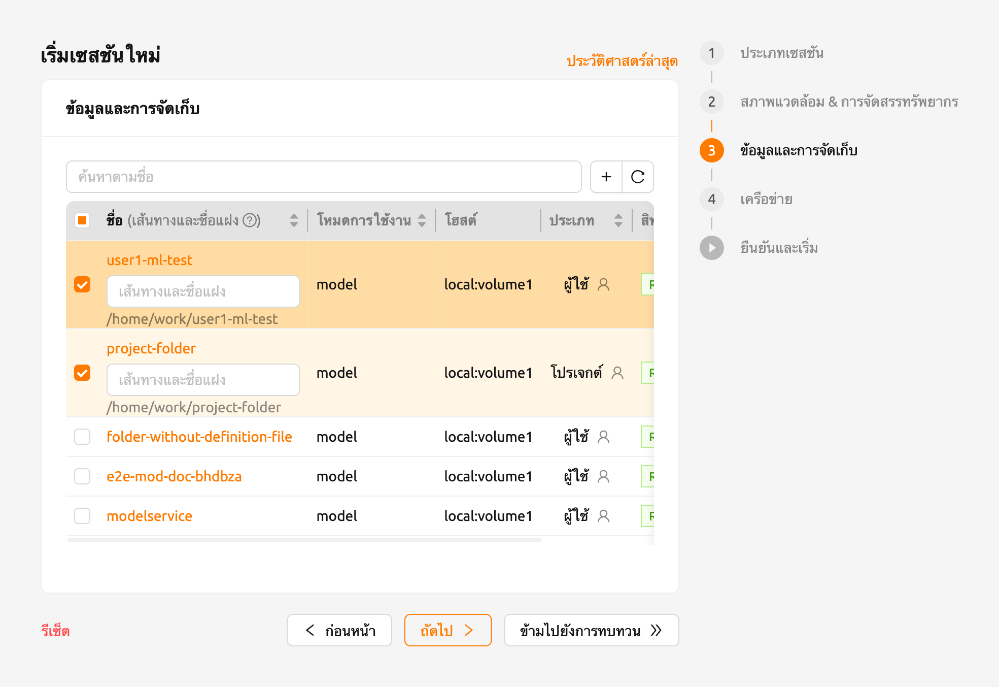
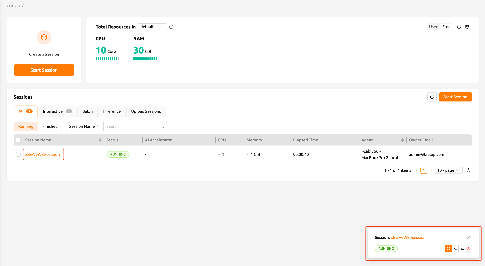
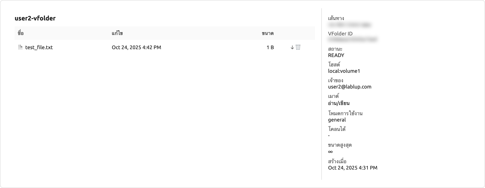

# การเชื่อมต่อโฟลเดอร์เข้ากับเซสชันการคอมพิวเตอร์

<a id="session-mounts"></a>

Backend.AI มีฟังก์ชันในการเมาท์โฟลเดอร์จัดเก็บเมื่อสร้างเซสชันการคำนวณ
เมื่อเริ่มเซสชันการคำนวณใหม่ ผู้ใช้จะสามารถเข้าถึงไดเรกทอรี `/home/work/` ได้
ไดเรกทอรีและไฟล์ทั่วไปที่สร้างไว้ภายใต้ `/home/work/` จะหายไปเมื่อเซสชันการคำนวณสิ้นสุดลง
ทั้งนี้เนื่องจากเซสชันการคำนวณถูกสร้างและลบแบบไดนามิกบนพื้นฐานของคอนเทนเนอร์
หากต้องการเก็บข้อมูลภายในคอนเทนเนอร์ไว้โดยไม่คำนึงถึงวงจรชีวิตของคอนเทนเนอร์ ต้องเมาท์โฟลเดอร์โฮสต์แยกต่างหากเข้าไปในคอนเทนเนอร์ จากนั้นจึงสร้างไฟล์ภายในโฟลเดอร์ที่เมาท์ไว้

ไปที่หน้า 'เซสชัน' แล้วคลิกปุ่ม 'เริ่มต้น'
หลังจากกรอกข้อมูลในขั้นตอน 'ประเภทเซสชัน' และ 'สภาพแวดล้อมและการจัดสรรทรัพยากร' แล้ว
ให้ไปที่ขั้นตอน 'ข้อมูลและการจัดเก็บ' เพื่อดูรายการโฟลเดอร์ที่ผู้ใช้สามารถเมาท์ได้
จากรายการนี้ ให้เลือกโฟลเดอร์ที่ต้องการเมาท์แล้วเพิ่มเข้าไป หรือเลือกหลายโฟลเดอร์เพื่อเมาท์เพิ่มเติม
เอกสารนี้จะอธิบายวิธีการเมาท์โฟลเดอร์สองโฟลเดอร์คือ `user1-ml-test` และ `user2-vfolder` และสร้างเซสชัน




:::note
เมื่อดูข้อมูลและข้อมูลโฟลเดอร์ภายในโปรเจกต์นั้น ผู้ใช้จะเห็นข้อมูลต่าง ๆ เช่น โหมดการใช้งาน
โฮสต์ที่เก็บข้อมูลที่โฟลเดอร์สังกัด สิทธิ์ และอื่น ๆ
โปรดทราบว่าขั้นตอน 'ข้อมูลและการจัดเก็บ' จะแสดงเฉพาะโฟลเดอร์ข้อมูลที่ผู้ใช้ปัจจุบันสามารถเมาท์ได้เท่านั้น
ตัวอย่างเช่น ไม่สามารถดูโฟลเดอร์ที่สังกัดโปรเจกต์อื่นได้
:::

:::note
การคลิก 'ชื่อโฟลเดอร์' ในขั้นตอน 'ข้อมูลและการจัดเก็บ' จะเปิดตัวสำรวจโฟลเดอร์ของโฟลเดอร์นั้น
จากหน้านี้ ผู้ใช้สามารถดูโฟลเดอร์ที่สร้างไว้ สร้างโฟลเดอร์ใหม่ และอัปโหลดไฟล์ได้
สำหรับคำแนะนำที่ละเอียดยิ่งขึ้นเกี่ยวกับโฟลเดอร์ โปรดดูที่ส่วน [สำรวจโฟลเดอร์](#explore-folder)
:::

:::note
นอกจากนี้ ยังสามารถสร้างโฟลเดอร์เสมือนใหม่ได้โดยการคลิกปุ่ม '+'
สำหรับข้อมูลเพิ่มเติมเกี่ยวกับการสร้างโฟลเดอร์ใหม่ในหน้าตัวเปิดเซสชัน (session launcher)
โปรดดูที่ส่วน [สร้างโฟลเดอร์จัดเก็บ](#create-storage-folder)
:::

ในเซสชันที่สร้างขึ้น ให้คลิกที่ชื่อเซสชันที่สร้างเพื่อเปิดลิ้นชักข้อมูลรายละเอียด จากนั้น
คลิกปุ่มไอคอน 'เรียกใช้แอปเทอร์มินัล' (ที่มุมขวาบน ลำดับที่สองจากขวา) เพื่อเปิดแอปเทอร์มินัล
หรือคุณสามารถเปิดแอปเทอร์มินัลจากการแจ้งเตือนได้เช่นกัน
เมื่อรันคำสั่ง `ls` คุณจะเห็นว่าโฟลเดอร์ `user1-ml-test` และ `user2-vfolder` ถูกเมาท์ไว้ภายใต้ไดเรกทอรีโฮม




:::note
โดยค่าเริ่มต้น โฟลเดอร์ที่เลือกจะถูกเมาท์โดยใช้ชื่อของโฟลเดอร์ภายใต้ `/home/work/` ภายในเซสชันการคำนวณ
ตัวอย่างเช่น หากชื่อโฟลเดอร์คือ `test` จะถูกเมาท์ที่ `/home/work/test`
หากต้องการกำหนดพาธของการเมาท์เอง ให้ระบุพาธแบบสัมบูรณ์ในช่อง 'Path and Alias'
การระบุ `/workspace` ในช่องข้อมูลของโฟลเดอร์ `test` จะเมาท์ไปที่ `/workspace` ภายในเซสชัน
การระบุพาธแบบสัมพัทธ์จะเมาท์โฟลเดอร์ภายใต้ `/home/work/` ด้วยพาธดังกล่าว
:::

Backend.AI มีตัวเลือกในการเก็บไฟล์ในโฟลเดอร์ไว้เมื่อเซสชันการคำนวณถูกลบ
ตัวอย่างด้านล่างแสดงให้เห็นถึงสิ่งที่เกิดขึ้น

ภายใต้ `user2-vfolder` ให้สร้าง `test_file`
เติมเนื้อหาด้วยข้อความ "file inside user2-vfolder"


เมื่อรันคำสั่ง `ls` ที่ `user2-vfolder` ผู้ใช้จะยืนยันได้ว่าไฟล์ถูกสร้างขึ้นเรียบร้อยแล้ว
โปรดทราบว่าสามารถตรวจสอบเนื้อหาของไฟล์ได้ด้วยคำสั่ง `cat`

ตอนนี้ให้ลบเซสชันการคำนวณและไปที่หน้า Storage
หาโฟลเดอร์ `user2-vfolder` เปิดตัวสำรวจไฟล์ และตรวจสอบว่า `test_file` มีอยู่
คลิกปุ่ม 'ดาวน์โหลด' ในแท็บ 'การกระทำ' เพื่อดาวน์โหลดไฟล์ไปยังเครื่องในเครื่อง และเปิดไฟล์
เพื่อยืนยันว่าเนื้อหาเป็น "file inside user2-vfolder"



เมื่อคุณจัดการไฟล์บนโฟลเดอร์ที่เมาท์ไว้ในขณะสร้างเซสชันการคำนวณ
ข้อมูลจะสามารถคงอยู่ได้แม้หลังจากที่ผู้ใช้สิ้นสุดเซสชันการคำนวณ


<a id="using-automount-folder"></a>

## การกำหนดค่าสภาพแวดล้อมของเซสชันการคำนวณด้วยโฟลเดอร์เมาท์อัตโนมัติ

หากต้องการใช้โปรแกรมหรือไลบรารีใหม่ที่ไม่ได้ถูกติดตั้งไว้ล่วงหน้าในเซสชันการคำนวณ คุณสามารถใช้คุณลักษณะของโฟลเดอร์จัดเก็บและ[โฟลเดอร์เมาท์อัตโนมัติ](#automount-folder)
ซึ่งเป็นอิสระจากวงจรชีวิตของเซสชันการคำนวณ ในการติดตั้งแพ็กเกจ
สิ่งนี้ช่วยให้คุณสามารถกำหนดค่าสภาพแวดล้อมที่สอดคล้องกันได้ โดยไม่คำนึงถึงประเภทของเซสชันการคำนวณ


<a id="using-pip-with-automountfolder"></a>

### ติดตั้งแพ็กเกจ Python ผ่าน pip

การสร้างโฟลเดอร์ชื่อ `.local` จะช่วยให้ผู้ใช้สามารถติดตั้งแพ็กเกจ Python ของผู้ใช้ไว้ในโฟลเดอร์เดียวกันได้
โดยค่าเริ่มต้น `pip` จะติดตั้งแพ็กเกจในโฟลเดอร์ `.local` ภายใต้โฟลเดอร์โฮมของผู้ใช้
(โปรดทราบว่าโฟลเดอร์เมาท์อัตโนมัติจะถูกเมาท์ไว้ภายใต้โฟลเดอร์โฮมของผู้ใช้)
ดังนั้น หากต้องการให้แพ็กเกจ Python ที่ชื่อ `tqdm` ถูกติดตั้งอยู่ตลอดเวลา ไม่ว่าสภาพแวดล้อมการคำนวณจะเป็นแบบใด
สามารถรันคำสั่งต่อไปนี้ได้จากเทอร์มินัล:

```shell
pip install tqdm
```

หลังจากนั้น เมื่อสร้างเซสชันการคำนวณใหม่ โฟลเดอร์ `.local` ที่ติดตั้งแพ็กเกจ `tqdm` ไว้จะถูกเมาท์โดยอัตโนมัติ
ทำให้ผู้ใช้สามารถใช้งานได้โดยไม่ต้องติดตั้งแพ็กเกจ `tqdm` ซ้ำอีก

:::note
เมื่อใช้งาน Python หลายเวอร์ชัน หรือใช้เซสชันที่มี Python เวอร์ชันต่างกัน แพ็กเกจอาจมีปัญหาด้านความเข้ากันได้
สามารถหลีกเลี่ยงปัญหานี้ได้โดยการแยกตัวแปรสภาพแวดล้อม `PYTHONPATH` ผ่านไฟล์ `.bashrc`
เนื่องจากแพ็กเกจ `pip` ของผู้ใช้จะถูกติดตั้งในพาธที่ระบุไว้ใน `PYTHONPATH`
:::


<a id="using-linuxbrew-with-automountfolder"></a>

### ติดตั้งแพ็กเกจผ่าน Homebrew

ตัวจัดการแพ็กเกจ เช่น `apt` ของ Ubuntu หรือ `yum` ของ CentOS มักจะต้องใช้สิทธิ์ `root`
ด้วยเหตุผลด้านความปลอดภัย การเข้าถึง `sudo` และ `root` ถูกบล็อกไว้โดยค่าเริ่มต้นในเซสชันการคำนวณของ Backend.AI (อาจได้รับอนุญาตขึ้นอยู่กับการตั้งค่า) ดังนั้นเราจึงแนะนำให้ใช้ [Homebrew on Linux](https://docs.brew.sh/Homebrew-on-Linux) ซึ่งไม่ต้องใช้ `sudo`

สามารถตั้งค่า Homebrew ได้ดังนี้:

- สร้างโฟลเดอร์ `.linuxbrew` ในหน้า Data & Storage
- สร้างเซสชันการคำนวณ (โฟลเดอร์ `.linuxbrew` จะถูกเมาท์โดยอัตโนมัติที่
  `/home/linuxbrew/.linuxbrew`)
- ติดตั้ง Homebrew ในเซสชันการคำนวณ หากยังไม่ได้ติดตั้ง

   ```shell
   $ /bin/bash -c "$(curl -fsSL https://raw.githubusercontent.com/Homebrew/install/HEAD/install.sh)"
   ```
- สามารถติดตั้งแพ็กเกจ Homebrew ได้ดังนี้:

   ```shell
   $ brew install hello
   $ hello
   Hello, world!
   ```
`brew` จะติดตั้งแพ็กเกจภายใต้ `/home/linuxbrew/.linuxbrew` ซึ่งจะถูกเมาท์โดยอัตโนมัติเมื่อมีโฟลเดอร์ `.linuxbrew` อยู่
ดังนั้น หากคุณสร้างโฟลเดอร์เมาท์อัตโนมัติชื่อ `.linuxbrew` ไว้แล้ว แพ็กเกจ Homebrew ที่ติดตั้งไว้ก่อนหน้านี้จะสามารถใช้งานได้อีกครั้ง แม้ว่าจะลบเซสชันการคำนวณเดิมและสร้างเซสชันการคำนวณใหม่ก็ตาม