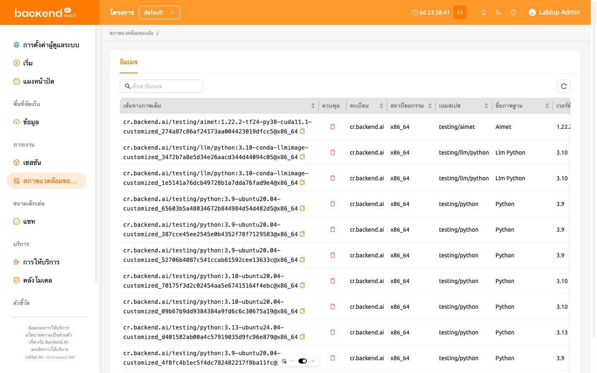
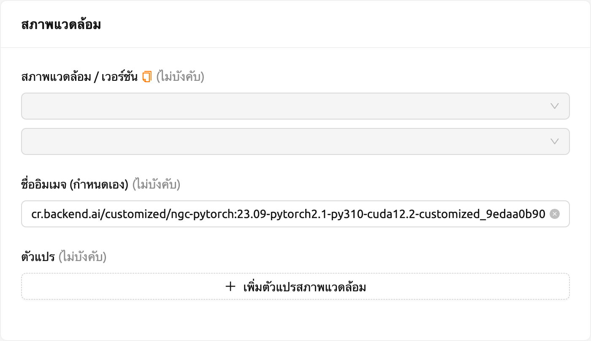
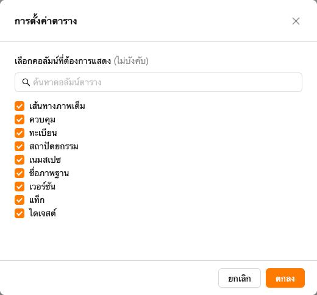

# สภาพแวดล้อมของฉัน

ตั้งแต่เวอร์ชัน 24.03 มีการเปิดตัวหน้า "สภาพแวดล้อมของฉัน" ใหม่สำหรับผู้ใช้
หน้านี้แสดงเนื้อหาเช่น รายการภาพที่สร้างขึ้นจาก
[เซสชันคอมมิต](#save-session-commit) ของผู้ใช้

ในแท็บภาพของหน้าสิ่งแวดล้อมของฉัน ผู้ใช้สามารถจัดการภาพที่กำหนดเองซึ่งใช้ในการสร้างเซสชันการคำนวณ แท็บนี้จะแสดงข้อมูลเมตาดาต้าของภาพที่แปลงจากเซสชันการคำนวณเป็นภาพ ผู้ใช้สามารถดูรายละเอียด เช่น รีจิสตรี สถาปัตยกรรม เนมสเปซ ภาษา เวอร์ชัน เบส ข้อจำกัด ดิจสต์ และข้อมูลอื่น ๆ สำหรับแต่ละภาพ

ในการลบภาพ ให้คลิกที่ปุ่มถังขยะสีแดงในคอลัมน์ควบคุม หลังจากที่ทำการลบแล้ว คุณจะไม่สามารถสร้างเซสชันใหม่โดยใช้ภาพนั้นได้

คุณยังสามารถคัดลอกชื่อภาพและสร้างเซสชันด้วยภาพแบบแมนนวล คลิกไอคอนคัดลอกข้างชื่อภาพในคอลัมน์เส้นทางภาพเต็ม เพื่อคัดลอกไปยังคลิปบอร์ด จากนั้นไปที่หน้าเซสชันและสร้างเซสชัน กรอกข้อมูลในช่องป้อนภาพแบบแมนนวลโดยการวางชื่อภาพที่คุณคัดลอกไว้

หากคุณต้องการซ่อนหรือแสดงคอลัมน์บางอย่าง ให้คลิกที่ไอคอนเฟืองที่มุมขวาล่างของตาราง จากนั้นคุณจะสามารถเห็นกล่องโต้ตอบด้านล่างเพื่อเลือกคอลัมน์ที่คุณต้องการเห็น

