

# ฟีเจอร์ผู้ดูแลโปรเจกต์

**ผู้ดูแลโปรเจกต์** คือผู้ใช้ที่ได้รับสิทธิ์การดูแลระบบสำหรับโปรเจกต์เฉพาะ ผู้ดูแลโปรเจกต์สามารถดูผู้ใช้ที่อยู่ในโปรเจกต์ที่ตนดูแล จัดการเซสชันการคำนวณและการปรับใช้โมเดล รวมถึงดูแลโฟลเดอร์จัดเก็บของโปรเจกต์ได้ โดยไม่ต้องมีสิทธิ์ผู้ดูแลระบบระดับสูงทั่วทั้งระบบ

## การระบุโปรเจกต์ที่คุณเป็นผู้ดูแล

เมื่อคุณเปิดดรอปดาวน์โปรเจกต์ในส่วนหัว โปรเจกต์ที่คุณมีบทบาทผู้ดูแลโปรเจกต์จะมีตราสัญลักษณ์รูปโล่ปรากฏข้างชื่อโปรเจกต์ การวางเคอร์เซอร์เหนือตราสัญลักษณ์จะแสดงคำแนะนำ **ผู้ดูแลโปรเจกต์** ซึ่งยืนยันว่าการเลือกโปรเจกต์นี้จะเปิดเผยรายการในแถบด้านข้างสำหรับผู้ดูแลโปรเจกต์ตามที่อธิบายไว้ด้านล่าง

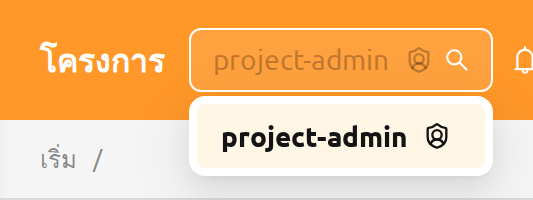

การสลับไปยังโปรเจกต์อื่นจากตัวเลือกโปรเจกต์ในส่วนหัวจะประเมินบทบาทของผู้ใช้ใหม่ ผู้ใช้คนเดียวกันอาจทำหน้าที่เป็นผู้ดูแลโปรเจกต์ในโปรเจกต์หนึ่งและเป็นผู้ใช้ทั่วไปในอีกโปรเจกต์หนึ่งภายในเซสชันการเข้าสู่ระบบเดียวกันได้ สำหรับวิธีการมอบและเพิกถอนบทบาทผู้ดูแลโปรเจกต์ ดูที่ส่วน[การมอบสิทธิ์ผู้ดูแลโปรเจกต์](#grant-project-admin)ในบทการจัดการ RBAC

## แถบด้านข้างของผู้ดูแลโปรเจกต์

เมื่อคุณเลือกโปรเจกต์ที่คุณเป็นผู้ดูแลโปรเจกต์ ส่วน **การดำเนินงาน** ของแถบด้านข้างจะแสดงรายการสี่รายการที่อุทิศให้กับการจัดการโปรเจกต์นั้น:

- **ผู้ใช้** — สมาชิกของโปรเจกต์ปัจจุบัน
- **ข้อมูล** — โฟลเดอร์จัดเก็บที่โปรเจกต์ปัจจุบันเป็นเจ้าของ
- **เซสชัน** — เซสชันการคำนวณที่ผู้ใช้ในโปรเจกต์ปัจจุบันเป็นเจ้าของ
- **การปรับใช้** — การปรับใช้โมเดลที่โปรเจกต์ปัจจุบันเป็นเจ้าของ

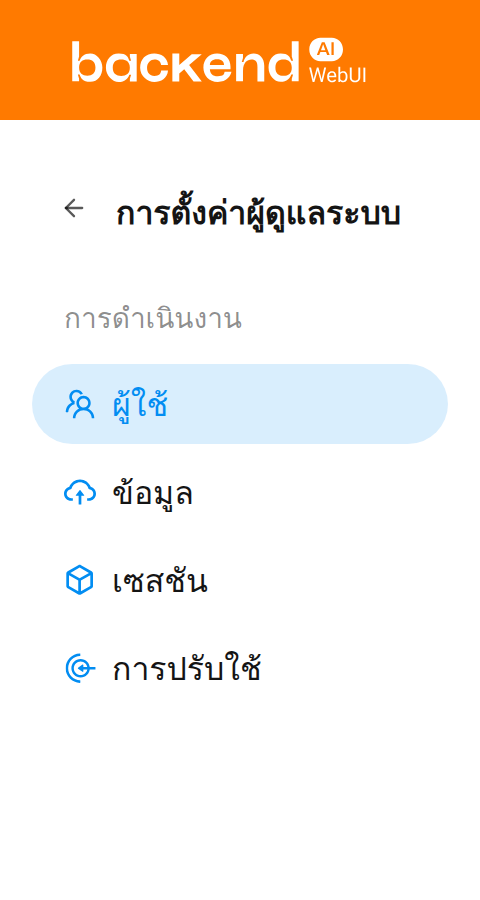

ในหน้าผู้ดูแลโปรเจกต์ จะแสดงเฉพาะรายการภายใต้โปรเจกต์ที่เลือกด้วยตัวเลือกโปรเจกต์ที่ด้านบนเท่านั้น คุณสามารถตรวจสอบเนื้อหานี้ได้จากแบนเนอร์ที่ด้านบนของหน้า

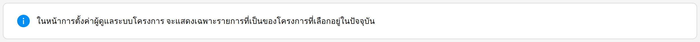

## ผู้ใช้

หน้า **ผู้ใช้** แสดงผู้ใช้ทุกคนที่เป็นสมาชิกของโปรเจกต์ที่เลือกอยู่ในปัจจุบัน ใช้หน้านี้เพื่อตรวจสอบสมาชิกในโปรเจกต์ได้อย่างรวดเร็ว ตัวอย่างเช่น เพื่อยืนยันว่าใครมีสิทธิ์เข้าถึงทรัพยากรของโปรเจกต์ หรือเพื่อระบุบัญชีที่ไม่ได้ใช้งาน

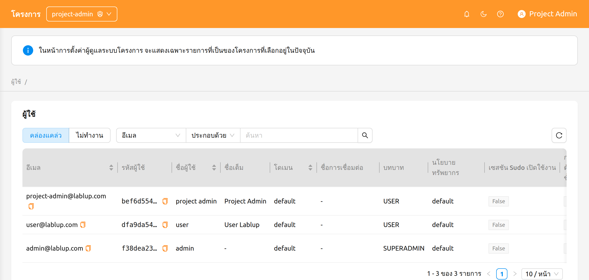

หน้านี้มีตัวควบคุมต่อไปนี้:

- ตัวควบคุมแบบแบ่งส่วน **ใช้งานอยู่ / ไม่ได้ใช้งาน**: สลับระหว่างผู้ใช้ที่ใช้งานอยู่และไม่ได้ใช้งาน โดยค่าเริ่มต้นจะเลือกใช้งานอยู่
- **ตัวกรองคุณสมบัติ**: กรองรายการตาม E-Mail, ID, ชื่อผู้ใช้, บทบาท หรือวันที่สร้าง

สำหรับผู้ดูแลโปรเจกต์ หน้าผู้ใช้เป็นแบบ**อ่านอย่างเดียว** ไม่มีการดำเนินการสร้าง แก้ไข หรือปิดการใช้งานในหน้านี้ การดำเนินการเหล่านั้นสงวนไว้สำหรับผู้ดูแลระบบระดับสูงผ่านหน้าผู้ใช้ทั่วทั้งระบบในบท[ฟีเจอร์ผู้ดูแลระบบ](#admin-menus)

## ข้อมูล

หน้า **ข้อมูล** แสดงโฟลเดอร์จัดเก็บ (vfolder) ที่โปรเจกต์ที่เลือกอยู่ในปัจจุบันเป็นเจ้าของ ใช้หน้านี้เพื่อสร้างโฟลเดอร์ที่แชร์ในโปรเจกต์ คืนค่าโฟลเดอร์ที่ถูกลบโดยไม่ตั้งใจ หรือล้างโฟลเดอร์ที่ไม่จำเป็นต้องเก็บไว้อีกต่อไปอย่างถาวร

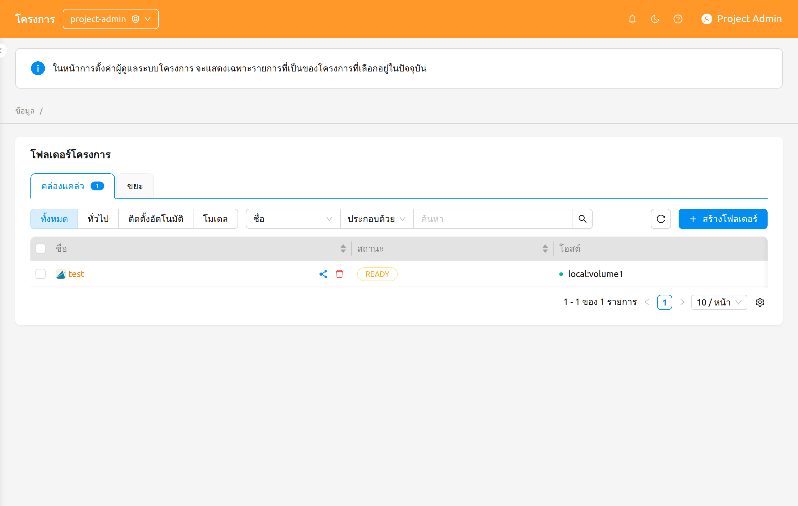

หน้านี้มีตัวควบคุมต่อไปนี้:

- แท็บ **ใช้งานอยู่ / ขยะ**: สลับระหว่างโฟลเดอร์ที่ใช้งานอยู่และโฟลเดอร์ที่ถูกลบแบบนุ่ม แต่ละแท็บจะแสดงตราจำนวนที่บอกจำนวนโฟลเดอร์ที่อยู่ในแท็บนั้น
- **ตัวกรองโหมด**: กรองตามโหมดการใช้งานของโฟลเดอร์ — **ทั้งหมด**, **ทั่วไป**, **โฟลเดอร์ไปป์ไลน์**, **ติดตั้งอัตโนมัติ**, **โมเดล**

   ตัวเลือก **โฟลเดอร์ไปป์ไลน์** และ **โมเดล** จะปรากฏเฉพาะเมื่อมีการเปิดใช้งานฟีเจอร์ที่เกี่ยวข้องในการปรับใช้เท่านั้น — **โฟลเดอร์ไปป์ไลน์** ต้องเปิดใช้งานปลายทางไปป์ไลน์ FastTrack และ **โมเดล** ต้องเปิดใช้งานโฟลเดอร์โมเดล

- **ตัวกรองคุณสมบัติ**: กรองรายการโดยใช้ตัวกรองคุณสมบัติโฟลเดอร์จัดเก็บมาตรฐาน

### การสร้างโฟลเดอร์

ในการสร้างโฟลเดอร์ใหม่จากหน้านี้:

1. คลิกปุ่ม **สร้างโฟลเดอร์** ที่มุมขวาบนของหน้า
2. กรอกข้อมูลโฟลเดอร์ในโมดอลการสร้าง
3. คลิก **ตกลง** เพื่อสร้างโฟลเดอร์

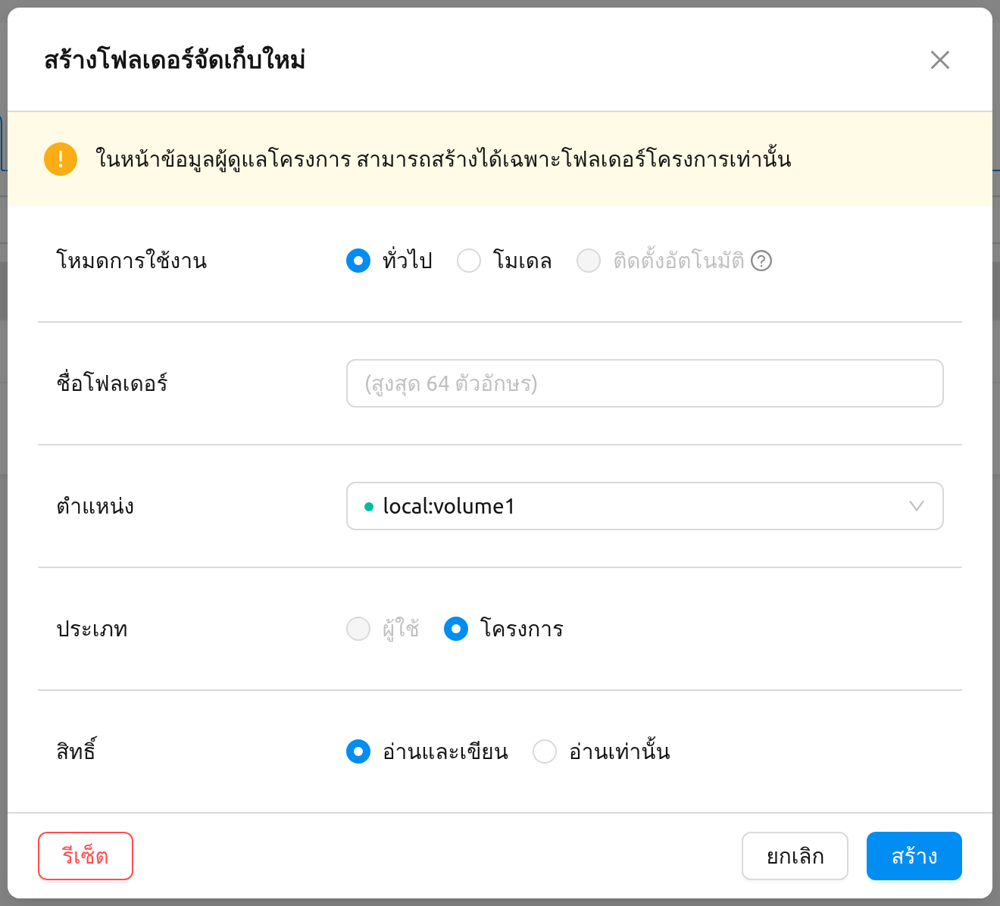

:::info
จากหน้าข้อมูลของผู้ดูแลโปรเจกต์ สามารถสร้างได้เฉพาะโฟลเดอร์ที่**โปรเจกต์เป็นเจ้าของ**เท่านั้น โมดอลการสร้างจะแสดงข้อความต่อไปนี้เพื่อระบุสิ่งนี้อย่างชัดเจน:

> ในหน้าข้อมูลผู้ดูแลโครงการ สามารถสร้างได้เฉพาะโฟลเดอร์โครงการเท่านั้น
:::

สำหรับรายละเอียดเกี่ยวกับโหมดการใช้งานโฟลเดอร์, สิทธิ์ และโควต้า ดูที่บท[โฟลเดอร์จัดเก็บ](#vfolders)

### การคืนค่าหรือลบโฟลเดอร์อย่างถาวร

สลับไปยังแท็บ **ขยะ** เพื่อดูโฟลเดอร์ที่ถูกลบแบบนุ่ม เลือกโฟลเดอร์หนึ่งรายการหรือมากกว่าโดยใช้ช่องทำเครื่องหมายในแถว จากนั้นใช้ปุ่มการดำเนินการในส่วนหัวที่ปรากฏข้างจำนวนที่เลือก:

- **คืนค่า**: ย้ายโฟลเดอร์ที่เลือกกลับไปยังแท็บใช้งานอยู่
- **ลบถาวร**: ล้างโฟลเดอร์ที่เลือกอย่างถาวร การดำเนินการนี้ไม่สามารถยกเลิกได้ และต้องการให้คุณพิมพ์ชื่อโฟลเดอร์เพื่อยืนยัน

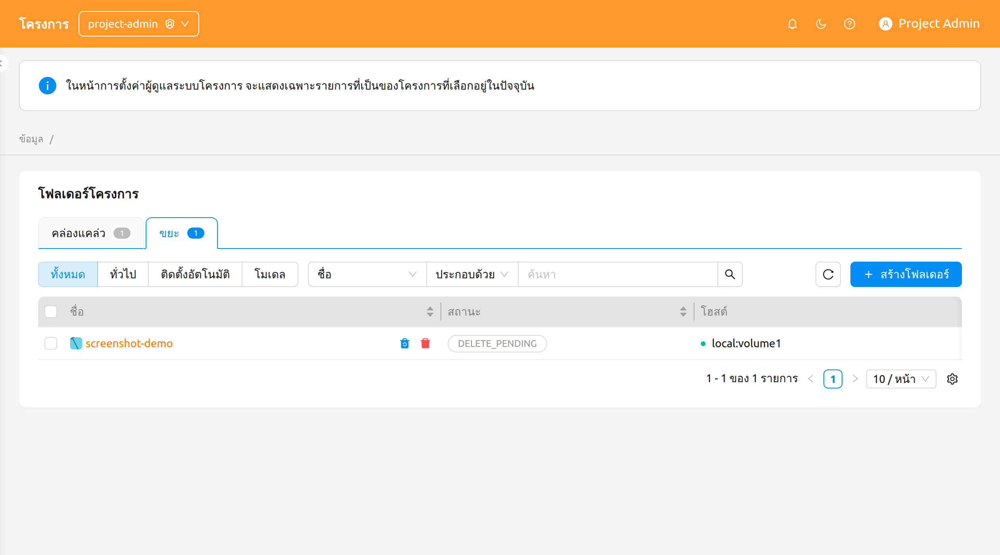

:::danger
การลบโฟลเดอร์จัดเก็บอย่างถาวรจะลบเนื้อหาทั้งหมดและไม่สามารถยกเลิกได้ โมดอลยืนยันต้องการให้คุณพิมพ์ชื่อโฟลเดอร์ก่อนที่ปุ่มลบจะใช้งานได้
:::

## เซสชัน

หน้า **เซสชัน** แสดงเซสชันการคำนวณที่ผู้ใช้ในโปรเจกต์ที่เลือกอยู่ในปัจจุบันเป็นเจ้าของ ใช้หน้านี้เพื่อเฝ้าติดตามภาระงานที่ใช้งานอยู่ ระบุเซสชันที่ทำงานเป็นเวลานาน หรือยุติเซสชันที่ไม่จำเป็นอีกต่อไป

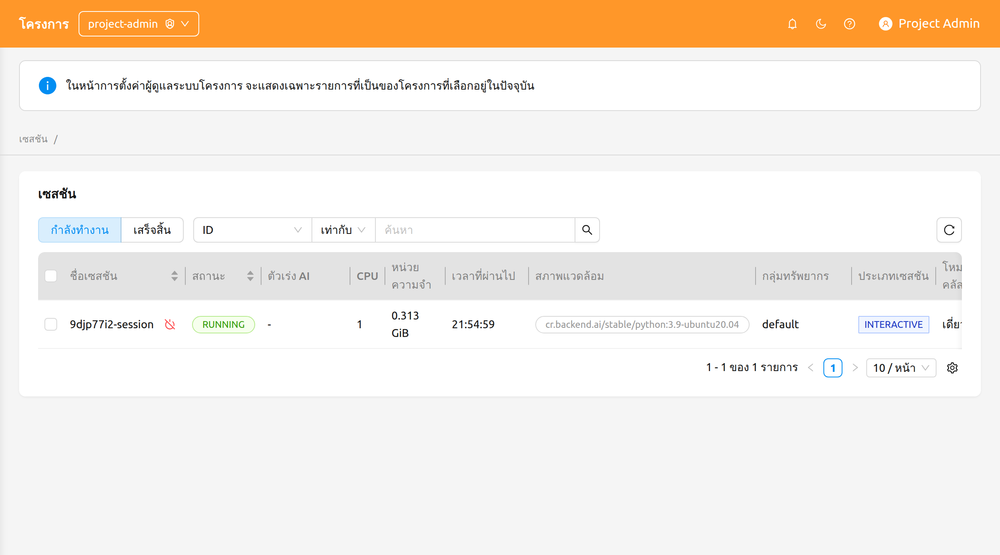

หน้านี้มีตัวควบคุมต่อไปนี้:

- ตัวควบคุมแบบแบ่งส่วน **กำลังทำงาน / สิ้นสุดแล้ว**: สลับระหว่างเซสชันที่กำลังทำงานในปัจจุบันและเซสชันที่สิ้นสุดแล้ว
- **ตัวกรองคุณสมบัติและการจัดเรียง**: กรองรายการตาม ID, ชื่อเซสชัน หรือ UUID ของเจ้าของ คลิกที่ส่วนหัวคอลัมน์ที่สามารถจัดเรียงได้เพื่อจัดเรียงตาราง

### การยุติเซสชัน

ในการยุติเซสชันหนึ่งหรือหลายเซสชัน:

1. เลือกเซสชันที่ต้องการยุติโดยใช้ช่องทำเครื่องหมายในคอลัมน์ซ้ายสุด หากต้องการยุติเซสชันเดียว คุณสามารถใช้ปุ่ม **ยุติ** ที่อยู่ข้างชื่อเซสชันได้
2. คลิกไอคอนปิดเครื่องในส่วนหัวของตารางเพื่อเปิดโมดอลยืนยัน
3. ตรวจสอบรายการเซสชันเป้าหมายในโมดอล
4. หากต้องการ ให้เลือกช่องทำเครื่องหมาย **บังคับยุติ** เพื่อยุติหรือยกเลิกเซสชันโดยไม่คำนึงถึงสถานะปัจจุบัน การเปิดใช้งานตัวเลือกนี้จะแสดงคำเตือนและเปลี่ยนป้ายกำกับปุ่มยืนยันจาก **ยุติ** เป็น **บังคับยุติ**
5. คลิกปุ่มยืนยันเพื่อยุติเซสชัน

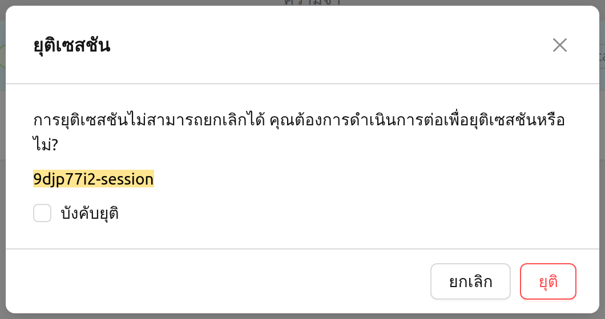

:::warning
ใช้ **บังคับยุติ** เฉพาะเมื่อเซสชันค้างและสถานะไม่เปลี่ยนแปลงเป็นระยะเวลานานเกินไปเท่านั้น การบังคับยุติจะไม่ลบคอนเทนเนอร์จริงบนเอเจนต์ ดังนั้นอาจต้องทำความสะอาดด้วยตนเองในภายหลัง
:::

:::note
ในขณะนี้ การคลิกชื่อเซสชันบนหน้าเซสชันของผู้ดูแลโปรเจกต์ยังไม่เปิดแผงรายละเอียดเซสชัน สำหรับข้อมูลพื้นฐานเกี่ยวกับเซสชันการคำนวณและมุมมองรายละเอียด ดูที่บท[หน้าเซสชัน](#session-page)
:::

## การปรับใช้

หน้า **การปรับใช้** แสดงการปรับใช้โมเดลที่โปรเจกต์ที่เลือกอยู่ในปัจจุบันเป็นเจ้าของ ใช้หน้านี้เพื่อดูแลปลายทางการอนุมาน แก้ไขการตั้งค่าการปรับใช้ หรือลบการปรับใช้ที่ไม่ใช้งานแล้ว

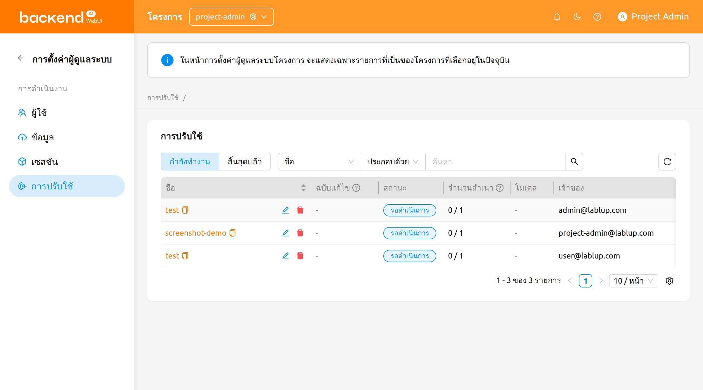

หน้านี้มีตัวควบคุมต่อไปนี้:

- ตัวควบคุมแบบแบ่งส่วน **กำลังทำงาน / สิ้นสุดแล้ว**: สลับระหว่างการปรับใช้ที่กำลังทำงานในปัจจุบันและการปรับใช้ที่สิ้นสุดแล้ว
- **ตัวกรองคุณสมบัติ**: กรองรายการตามชื่อ, แท็ก, URL ปลายทาง หรือการเปิดเป็นสาธารณะ

ตารางแสดงคอลัมน์ชื่อ, รีวิชัน, สถานะ, เรพลิกา, โมเดล, วันที่สร้าง และเจ้าของของการปรับใช้ พร้อมด้วยโดเมน, โปรเจกต์ และกลุ่มทรัพยากรของการปรับใช้ตามความเหมาะสม

คอลัมน์ **รีวิชัน** แสดงรีวิชันปัจจุบันของการปรับใช้เป็นลิงก์ `#N` ที่คลิกได้ คลิกที่ลิงก์นี้เพื่อเปิดแผงที่แสดงรายละเอียดของรีวิชันปัจจุบัน

### การดำเนินการของการปรับใช้

การดำเนินการต่อไปนี้พร้อมใช้งานในแต่ละแถวการปรับใช้:

- คลิก**ชื่อการปรับใช้**เพื่อไปยังหน้ารายละเอียดการปรับใช้ภายในขอบเขตของผู้ดูแลโปรเจกต์
- คลิก**หมายเลขรีวิชัน** (`#N`) เพื่อเปิดแผงรายละเอียดของรีวิชันปัจจุบัน
- คลิก**ไอคอนดินสอ**เพื่อแก้ไขการกำหนดค่าของการปรับใช้ในโมดอลการตั้งค่า
- คลิก**ไอคอนถังขยะ**เพื่อลบการปรับใช้ โมดอลยืนยันต้องการให้คุณพิมพ์ชื่อการปรับใช้ก่อนจึงจะดำเนินการลบ

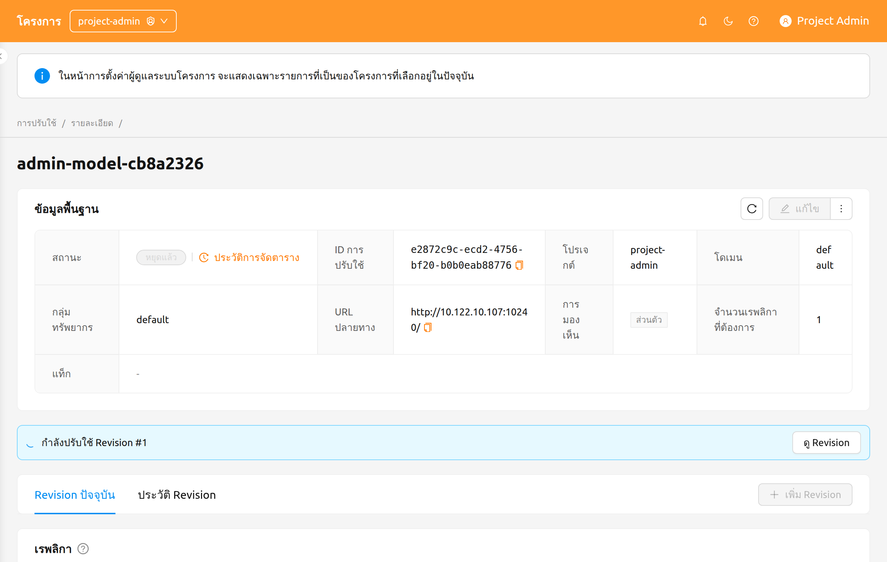

สำหรับรายละเอียดเกี่ยวกับรีวิชัน, เรพลิกา และการกำหนดเส้นทางทราฟฟิกของการปรับใช้ ดูที่บท[การปรับใช้](#model-serving)
