

# การจัดการ RBAC

การจัดการ RBAC (Role-Based Access Control) ช่วยให้ผู้ดูแลระบบระดับสูงสามารถกำหนดบทบาทที่มีสิทธิ์แบบละเอียดและมอบหมายให้กับผู้ใช้ได้ ด้วย RBAC คุณสามารถควบคุมการดำเนินการที่ผู้ใช้เฉพาะสามารถทำได้กับทรัพยากรต่าง ๆ ในระบบ Backend.AI

:::note
การจัดการ RBAC ใช้ได้เฉพาะผู้ดูแลระบบระดับสูงเท่านั้น และต้องใช้ Backend.AI Manager เวอร์ชัน 26.4.0 ขึ้นไป
:::

ในการเข้าถึงหน้าการจัดการ RBAC ให้คลิก **การจัดการ RBAC** ในส่วน **การตั้งค่าผู้ดูแลระบบ** ของเมนูแถบด้านข้าง

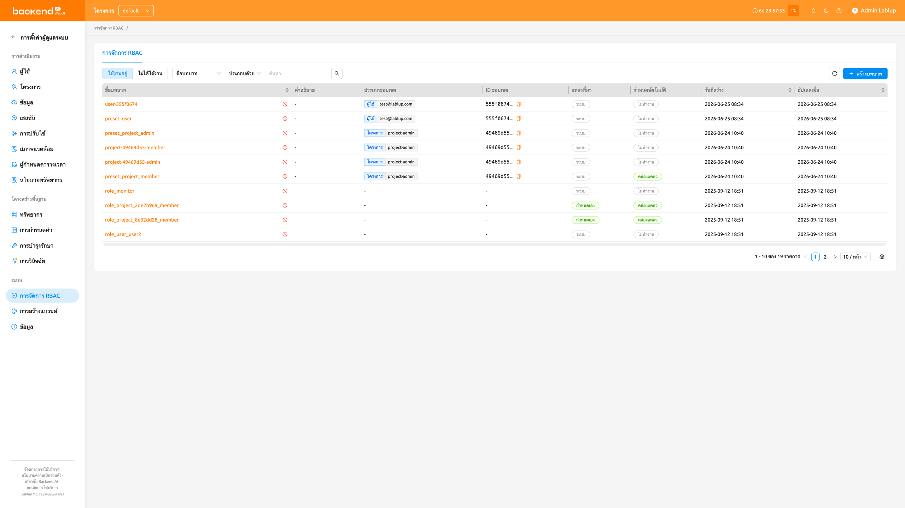

## รายการบทบาท

หน้ารายการบทบาทแสดงบทบาททั้งหมดในรูปแบบตาราง คุณสามารถกรอง ค้นหา และเรียงลำดับบทบาทโดยใช้ตัวควบคุมที่ด้านบนของหน้า

- **ตัวกรองสถานะ**: ตัวควบคุมแบบแบ่งส่วนสำหรับสลับระหว่างบทบาท**ใช้งานอยู่**และ**ไม่ได้ใช้งาน** โดยค่าเริ่มต้นจะเลือกใช้งานอยู่
- **ค้นหาชื่อ**: ตัวกรองคุณสมบัติสำหรับค้นหาบทบาทตามชื่อหรือกรองตามแหล่งที่มา (ระบบ หรือ กำหนดเอง) ช่องป้อนค่าของตัวกรองจะปรับเปลี่ยนตามคุณสมบัติที่เลือก ตัวอย่างเช่น ตัวกรอง **แหล่งที่มา** จะแสดงค่าที่ใช้ได้ (ระบบ / กำหนดเอง) ในรูปแบบตัวเลือก ขณะที่ตัวกรอง **ชื่อ** จะรับข้อความแบบอิสระ
- **สร้างบทบาท**: ปุ่มสำหรับสร้างบทบาทแบบกำหนดเองใหม่

ตารางแสดงคอลัมน์ต่อไปนี้:

- **ชื่อบทบาท**: ชื่อของบทบาท คลิกชื่อเพื่อเปิดแผงรายละเอียดบทบาท
- **คำอธิบาย**: คำอธิบายสั้น ๆ เกี่ยวกับวัตถุประสงค์ของบทบาท
- **ประเภทขอบเขต**: ประเภทของขอบเขตแรกที่ถูกกำหนดให้กับบทบาท หากบทบาทมีหลายขอบเขต จะมีการแสดง `+N` กำกับไว้ด้วย
- **ID ขอบเขต**: ID ดั้งเดิมของขอบเขตแรกที่กำหนดให้กับบทบาท หากบทบาทมีหลายขอบเขต จะมีการแสดง `+N` กำกับไว้ด้วย
- **แหล่งที่มา**: ระบุว่าบทบาทเป็น**ระบบ** (กำหนดไว้ล่วงหน้า) หรือ**กำหนดเอง** (สร้างโดยผู้ใช้)
- **มอบหมายอัตโนมัติ**: ระบุว่าบทบาทถูกมอบหมายให้กับผู้ใช้โดยอัตโนมัติเมื่อมีการเพิ่มผู้ใช้เข้าสู่ขอบเขตที่บทบาทนั้นลงทะเบียนไว้หรือไม่ แสดง**ใช้งานอยู่**เมื่อเปิดใช้การมอบหมายอัตโนมัติ หรือ**ไม่ได้ใช้งาน**เมื่อปิดใช้
- **วันที่สร้าง**: วันที่และเวลาที่สร้างบทบาท
- **วันที่อัปเดต**: วันที่และเวลาที่แก้ไขบทบาทล่าสุด

คุณสามารถเรียงลำดับตารางโดยคลิกที่ส่วนหัวคอลัมน์ **ชื่อบทบาท** **วันที่สร้าง** หรือ **วันที่อัปเดต** ใช้ปุ่มตั้งค่าการแสดงคอลัมน์ทางด้านขวาของส่วนหัวตารางเพื่อแสดงหรือซ่อนคอลัมน์แต่ละรายการ ปุ่มรีเฟรชที่อยู่ถัดจากปุ่ม **สร้างบทบาท** จะโหลดรายการใหม่ด้วยข้อมูลล่าสุด นอกจากนี้ยังมีปุ่มรีเฟรชในแผงรายละเอียดบทบาทและในแต่ละแท็บอีกด้วย

:::note
ต้องใช้ Backend.AI Manager เวอร์ชัน 26.4.4 ขึ้นไปเพื่อให้คอลัมน์**มอบหมายอัตโนมัติ**ปรากฏขึ้น
:::

### บทบาทระบบและบทบาทกำหนดเอง

บทบาทแบ่งออกเป็นสองประเภทแหล่งที่มา:

- **ระบบ**: บทบาทที่สร้างขึ้นโดยอัตโนมัติ ไม่สามารถแก้ไขชื่อหรือคำอธิบายได้ แต่สามารถจัดการการมอบหมายผู้ใช้และสิทธิ์ได้
- **กำหนดเอง**: บทบาทที่สร้างโดยผู้ดูแลระบบระดับสูง สามารถแก้ไขได้ทั้งหมด รวมถึงชื่อ คำอธิบาย การมอบหมาย ขอบเขต และสิทธิ์

## การเปิดและปิดใช้งานบทบาท

บทบาทสามารถอยู่ในสถานะ**ใช้งานอยู่**หรือ**ไม่ได้ใช้งาน**ได้ การปิดใช้งานบทบาทเป็นการดำเนินการแบบลบชั่วคราว (soft-delete) ที่สามารถย้อนกลับได้ บทบาทที่ปิดใช้งานจะถูกซ่อนจากรายการที่ใช้งานอยู่ แต่จะยังคงถูกเก็บไว้และสามารถกู้คืนได้ทุกเมื่อด้วยการเปิดใช้งานอีกครั้ง ใช้ **ตัวกรองสถานะ** ที่ด้านบนของรายการบทบาทเพื่อสลับระหว่างบทบาทที่ใช้งานอยู่และไม่ได้ใช้งาน

การดำเนินการเกี่ยวกับวงจรชีวิตจะแสดงเป็นการดำเนินการแบบโฮเวอร์บนเซลล์ **ชื่อบทบาท** วางเมาส์เหนือแถวบทบาทเพื่อแสดงไอคอนการดำเนินการถัดจากชื่อบทบาท

<!-- TODO: Capture screenshot of rbac_role_row_actions.png — Role Name cell hover actions on an active role row showing the Deactivate (ban) icon -->

ในการปิดใช้งานบทบาทที่ใช้งานอยู่:

1. เมื่อตั้งค่า **ตัวกรองสถานะ** เป็น **ใช้งานอยู่** ให้วางเมาส์เหนือแถวบทบาทที่ต้องการปิดใช้งาน
2. คลิกการดำเนินการ **ปิดใช้งาน** (ไอคอนห้าม) ถัดจากชื่อบทบาท
3. ในป๊อปอัปยืนยัน คลิก **ปิดใช้งาน** เพื่อยืนยัน หรือ **ยกเลิก** เพื่อปิด

บทบาทจะย้ายไปยังรายการที่ไม่ได้ใช้งาน หากต้องการดูอีกครั้ง ให้ตั้งค่า **ตัวกรองสถานะ** เป็น **ไม่ได้ใช้งาน**

เมื่อตั้งค่า **ตัวกรองสถานะ** เป็น **ไม่ได้ใช้งาน** แต่ละแถวบทบาทจะแสดงการดำเนินการแบบโฮเวอร์สองรายการ ได้แก่ **เปิดใช้งาน** (ไอคอนย้อนกลับ) และ **ลบบทบาทอย่างถาวร** (ไอคอนลบ)

<!-- TODO: Capture screenshot of rbac_inactive_role_actions.png — Role Name cell hover actions on an inactive role row showing the Activate (undo) and Purge Role (delete) icons -->

ในการเปิดใช้งานบทบาทที่ไม่ได้ใช้งานอีกครั้ง:

1. ตั้งค่า **ตัวกรองสถานะ** เป็น **ไม่ได้ใช้งาน** และวางเมาส์เหนือแถวบทบาท
2. คลิกการดำเนินการ **เปิดใช้งาน** (ไอคอนย้อนกลับ) ถัดจากชื่อบทบาท
3. ในป๊อปอัปยืนยัน คลิก **เปิดใช้งาน** เพื่อยืนยัน หรือ **ยกเลิก** เพื่อปิด

บทบาทจะกลับไปยังรายการที่ใช้งานอยู่โดยที่ขอบเขต สิทธิ์ และการมอบหมายผู้ใช้ยังคงอยู่ครบถ้วน

## ลบบทบาทอย่างถาวร

การลบอย่างถาวรจะนำบทบาทออกจากระบบโดยสมบูรณ์ ซึ่งต่างจากการปิดใช้งาน การลบอย่างถาวรไม่สามารถย้อนกลับได้

:::danger
การลบบทบาทอย่างถาวร**ไม่สามารถย้อนกลับได้** บทบาทและการกำหนดค่าจะถูกลบอย่างถาวรและไม่สามารถกู้คืนได้ หากคุณต้องการเพียงปิดใช้งานชั่วคราว ให้ใช้การปิดใช้งานแทนการลบอย่างถาวร
:::

การดำเนินการ **ลบบทบาทอย่างถาวร** ใช้ได้เฉพาะกับบทบาทที่ **ไม่ได้ใช้งาน** เท่านั้น หากบทบาทกำลังใช้งานอยู่ ให้ปิดใช้งานก่อน (ดู [การเปิดและปิดใช้งานบทบาท](#activate-and-deactivate-roles))

ในการลบบทบาทที่ไม่ได้ใช้งานอย่างถาวร:

1. ตั้งค่า **ตัวกรองสถานะ** เป็น **ไม่ได้ใช้งาน** และวางเมาส์เหนือแถวบทบาท
2. คลิกการดำเนินการ **ลบบทบาทอย่างถาวร** (ไอคอนลบ) ถัดจากชื่อบทบาท
3. ในโมดอลยืนยัน ให้พิมพ์ชื่อบทบาทให้ตรงทุกตัวอักษรลงในช่องป้อนค่าเพื่อยืนยัน ปุ่ม **ลบบทบาทอย่างถาวร** จะยังคงปิดใช้งานจนกว่าชื่อที่พิมพ์จะตรงกัน
4. คลิก **ลบบทบาทอย่างถาวร** เพื่อลบบทบาทอย่างถาวร หรือ **ยกเลิก** เพื่อปิด

<!-- TODO: Capture screenshot of rbac_purge_role_modal.png — Purge Role typed-name confirmation modal -->

:::warning
บทบาทจะสามารถลบอย่างถาวรได้หลังจากที่การมอบหมายผู้ใช้และสิทธิ์ทั้งหมดถูกลบออกแล้วเท่านั้น หากยังคงเหลืออยู่ การลบอย่างถาวรจะล้มเหลวพร้อมข้อความ *"ไม่สามารถลบบทบาทนี้อย่างถาวรได้ กรุณาลบการมอบหมายและสิทธิ์ทั้งหมดก่อน"* ให้ลบ[สิทธิ์](#manage-permissions)และ[การมอบหมายผู้ใช้](#manage-user-assignments)ของบทบาทก่อนทำการลบอย่างถาวร
:::

## การสร้างบทบาท

ในการสร้างบทบาท คุณต้องกำหนด**ขอบเขต**ล่วงหน้า ขอบเขตจะผูกบทบาทเข้ากับเอนทิตีทรัพยากรที่ระบุ (เช่น โดเมน โปรเจกต์ หรือผู้ใช้) เพื่อให้สิทธิ์ทุกข้อที่เพิ่มในภายหลังถูกจำกัดให้อยู่ภายในขอบเขตที่กำหนดไว้ที่นี่เท่านั้น

ในการสร้างบทบาทแบบกำหนดเองใหม่:

1. คลิกปุ่ม **สร้างบทบาท** ที่มุมขวาบนของหน้ารายการบทบาท
2. ในโมดอลการสร้าง ให้กรอกฟิลด์ต่อไปนี้:
   - **ชื่อบทบาท** (จำเป็น): ป้อนชื่อบทบาทที่ไม่ซ้ำกัน
   - **คำอธิบาย** (ไม่บังคับ): ป้อนคำอธิบายเกี่ยวกับวัตถุประสงค์ของบทบาท
   - **มอบหมายอัตโนมัติ** (ไม่บังคับ): เมื่อเปิดใช้งาน บทบาทจะถูกมอบหมายให้กับผู้ใช้โดยอัตโนมัติเมื่อมีการเพิ่มผู้ใช้เข้าสู่ขอบเขตที่บทบาทนั้นลงทะเบียนไว้ ปิดใช้งานโดยค่าเริ่มต้น
   - **ประเภทขอบเขต / เป้าหมาย** (จำเป็น, อย่างน้อย 1 รายการ): สำหรับแต่ละแถวขอบเขต เลือก**ประเภทขอบเขต**ก่อน จากนั้นเลือก**เป้าหมาย**เฉพาะภายในประเภทขอบเขตนั้น คลิก **เพิ่ม** เพื่อเพิ่มแถวขอบเขตอีก หรือคลิกไอคอนลบเพื่อลบแถว คุณต้องเพิ่มขอบเขตอย่างน้อยหนึ่งรายการ
3. คลิก **ตกลง** เพื่อสร้างบทบาท

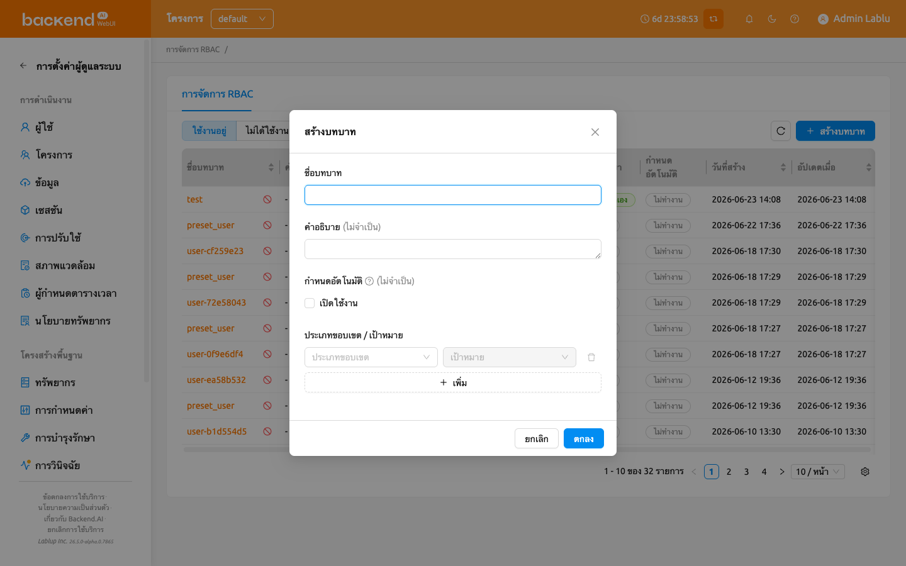

:::info
ขอบเขตถูกกำหนดในเวลาสร้างบทบาท และไม่สามารถแก้ไขได้ในภายหลังผ่านแผงรายละเอียดบทบาท โปรดวางแผนขอบเขตอย่างรอบคอบก่อนสร้างบทบาท
:::

### ประเภทขอบเขต

ประเภทขอบเขตจะกำหนดชนิดของเอนทิตีทรัพยากรที่ขอบเขตจะผูกบทบาทเข้าไว้ ขึ้นอยู่กับการติดตั้งของคุณ ประเภทขอบเขตต่อไปนี้สามารถเลือกได้เมื่อสร้างบทบาท:

- **โดเมน**: เลือกจากรายการโดเมนที่ใช้งานอยู่
- **โปรเจกต์**: เลือกโปรเจกต์ (สามารถกรองตามโดเมน)
- **ผู้ใช้**: ค้นหาผู้ใช้ตามอีเมลหรือชื่อ
- **โฟลเดอร์**: เลือกโฟลเดอร์จัดเก็บ
- **กลุ่มทรัพยากร**: เลือกกลุ่มทรัพยากร
- **เซสชัน**: เลือกเซสชันการคำนวณ
- **บริการโมเดล**: เลือกบริการโมเดล
- **Container Registry**: เลือก Container Registry
- **Storage Host**: เลือก Storage Host
- **Keypair**: เลือก Keypair

:::note
รายการประเภทขอบเขตที่ใช้งานได้จะถูกกำหนดโดย Backend.AI Manager โดยจะแสดงเฉพาะประเภทขอบเขตที่มีเอนทิตีที่ดำเนินการได้อย่างน้อยหนึ่งรายการเท่านั้น ดังนั้นชุดประเภทขอบเขตที่เลือกได้ที่แน่นอนอาจแตกต่างกันไปตามเวอร์ชันและการติดตั้ง และอาจแตกต่างจากรายการข้างต้น
:::

## ดูรายละเอียดบทบาท

ในการดูข้อมูลรายละเอียดของบทบาท ให้คลิกชื่อบทบาทในตาราง แผงรายละเอียดจะเปิดขึ้นทางด้านขวาของหน้า

ส่วนหัวของแผงจะแสดงชื่อบทบาทและมีปุ่ม**แก้ไข**สำหรับบทบาทแบบกำหนดเอง ส่วนรายละเอียดจะแสดงข้อมูลเมตาต่อไปนี้:

- **แหล่งที่มา**: ระบบ หรือ กำหนดเอง
- **สถานะ**: ใช้งานอยู่ หรือ ไม่ได้ใช้งาน
- **มอบหมายอัตโนมัติ**: ระบุว่าการมอบหมายอัตโนมัตินั้นใช้งานอยู่หรือไม่ได้ใช้งาน เมื่อใช้งานอยู่ บทบาทจะถูกมอบหมายให้กับผู้ใช้ที่เพิ่มเข้าสู่ขอบเขตที่ลงทะเบียนไว้แห่งใดแห่งหนึ่งโดยอัตโนมัติ
- **วันที่สร้าง**: เวลาที่สร้าง
- **วันที่อัปเดต**: เวลาที่แก้ไขล่าสุด
- **คำอธิบาย**: คำอธิบายของบทบาท

ด้านล่างข้อมูลเมตามีสามแท็บ: **ขอบเขต**, **สิทธิ์** และ **การมอบหมายบทบาท**

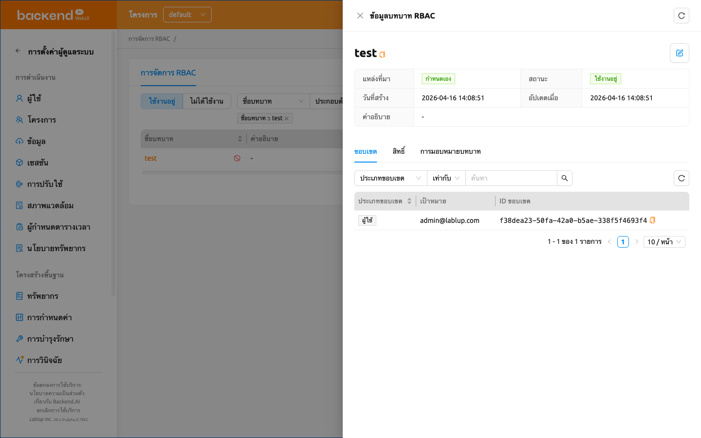

### การแก้ไขบทบาท

ในการแก้ไขชื่อ คำอธิบาย หรือการตั้งค่าการมอบหมายอัตโนมัติของบทบาทแบบกำหนดเอง:

1. คลิกชื่อบทบาทในตารางเพื่อเปิดแผงรายละเอียด
2. คลิกปุ่ม**แก้ไข** (ไอคอนดินสอ) ในส่วนหัวของแผง
3. แก้ไขฟิลด์ต่อไปนี้ในโมดอลแก้ไข:
   - **ชื่อบทบาท**: ชื่อของบทบาท
   - **คำอธิบาย**: คำอธิบายเกี่ยวกับวัตถุประสงค์ของบทบาท
   - **มอบหมายอัตโนมัติ**: เมื่อเปิดใช้งาน บทบาทจะถูกมอบหมายให้กับผู้ใช้ที่เพิ่มเข้าสู่ขอบเขตที่บทบาทนั้นลงทะเบียนไว้โดยอัตโนมัติ ฟิลด์นี้ใช้ได้เฉพาะกับ Backend.AI Manager เวอร์ชัน 26.4.4 ขึ้นไปเท่านั้น
4. คลิก **ตกลง** เพื่อบันทึกการเปลี่ยนแปลง

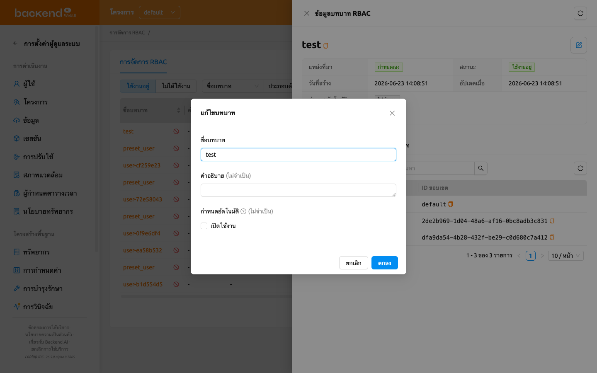
<!-- TODO: Recapture rbac_edit_role_modal.png so the Auto Assign checkbox is visible -->

:::note
ปุ่มแก้ไขใช้ได้เฉพาะกับบทบาทแบบกำหนดเองเท่านั้น ไม่สามารถแก้ไขชื่อหรือคำอธิบายของบทบาทระบบได้ และไม่สามารถแก้ไขขอบเขตหลังจากที่สร้างบทบาทแล้วในทั้งสองกรณี
:::

## ดูขอบเขตของบทบาท

แท็บ **ขอบเขต** ในแผงรายละเอียดบทบาทจะแสดงรายการขอบเขตที่ได้รับการกำหนดให้กับบทบาทในเวลาสร้าง แต่ละรายการจะจำกัดชุดเป้าหมายที่สิทธิ์ของบทบาทนี้สามารถอ้างอิงได้

ตารางแสดงคอลัมน์ต่อไปนี้:

- **ประเภทขอบเขต**: ประเภทของรายการขอบเขต (เช่น โดเมน, โปรเจกต์, ผู้ใช้)
- **เป้าหมาย**: ชื่อที่แสดงของเป้าหมายขอบเขต (เช่น ชื่อโดเมน, ชื่อโปรเจกต์, อีเมลของผู้ใช้)
- **ID ขอบเขต**: UUID ของเป้าหมายขอบเขต

ใช้ตัวควบคุมตัวกรองที่ด้านบนเพื่อจำกัดรายการขอบเขตตาม**ประเภทขอบเขต**

:::note
ในแท็บนี้ ขอบเขตเป็นแบบอ่านอย่างเดียว หากต้องการเปลี่ยนขอบเขตของบทบาท คุณต้องสร้างบทบาทใหม่พร้อมกับขอบเขตที่ต้องการ
:::

## การจัดการสิทธิ์

แท็บ**สิทธิ์**ในแผงรายละเอียดบทบาทจะแสดงสิทธิ์แบบละเอียดที่กำหนดค่าไว้สำหรับบทบาท

### ทำความเข้าใจเกี่ยวกับสิทธิ์

แต่ละสิทธิ์ประกอบด้วยสี่องค์ประกอบ:

- **ประเภทขอบเขต**: ประเภทของทรัพยากรที่สิทธิ์กำหนดเป้าหมาย (เช่น โดเมน, โปรเจกต์, ผู้ใช้)
- **เป้าหมาย**: เอนทิตีเฉพาะภายในประเภทขอบเขต (เช่น ชื่อโดเมนเฉพาะ, โปรเจกต์เฉพาะ)
- **ประเภทสิทธิ์**: หมวดหมู่ของทรัพยากรที่สิทธิ์ควบคุม กรองตามประเภทขอบเขตที่เลือก ประเภทสิทธิ์ที่ใช้งานได้ ได้แก่ **โดเมน**, **โปรเจกต์**, **ผู้ใช้**, **เซสชัน**, **โฟลเดอร์**, **บริการโมเดล**, **กลุ่มทรัพยากร** และ **Image** เป็นต้น ชุดที่แน่นอนขึ้นอยู่กับประเภทขอบเขตที่เลือกและการติดตั้งของคุณ
- **สิทธิ์**: การดำเนินการที่อนุญาตบนทรัพยากร จะแสดงเฉพาะการดำเนินการที่ถูกต้องสำหรับประเภทสิทธิ์ที่เลือกเท่านั้น การดำเนินการแบ่งออกเป็นสองหมวดหมู่:
   * **โดยตรง**: สร้าง, อ่าน, แก้ไข, ลบ, ลบถาวร
   * **มอบหมายให้ผู้อื่น**: มอบหมายสิทธิ์ทั้งหมด, มอบหมายสิทธิ์อ่าน, มอบหมายสิทธิ์แก้ไข, มอบหมายสิทธิ์ลบ, มอบหมายสิทธิ์ลบถาวร

:::info
การรวม **ประเภทขอบเขต / เป้าหมาย** ของแต่ละสิทธิ์ได้รับการสืบทอดมาจากรายการขอบเขตของบทบาท เมื่อเพิ่มสิทธิ์ คุณสามารถเลือกได้เฉพาะจากขอบเขตที่กำหนดไว้เมื่อสร้างบทบาทเท่านั้น หากต้องการขยายการเข้าถึงของบทบาท ให้สร้างบทบาทใหม่พร้อมกับขอบเขตเพิ่มเติม
:::

### ตัวอย่างการตั้งค่าสิทธิ์

ต่อไปนี้คือตัวอย่างการตั้งค่าสิทธิ์ทั่วไปเพื่อช่วยให้คุณเข้าใจว่าองค์ประกอบทั้งสี่ทำงานร่วมกันอย่างไร คอลัมน์ **ประเภทขอบเขต / เป้าหมาย** แสดงขอบเขตระดับบทบาทที่สิทธิ์นำมาใช้ซ้ำ

| สถานการณ์ | ประเภทขอบเขต / เป้าหมาย | ประเภทสิทธิ์ | สิทธิ์ |
|----------|------------------------|------------|-------|
| อนุญาตให้สร้างโฟลเดอร์จัดเก็บในโปรเจกต์เฉพาะ | โปรเจกต์ / my-project | โฟลเดอร์ | สร้าง |
| อนุญาตให้ดูเซสชันทั้งหมดในโดเมน | โดเมน / default | เซสชัน | อ่าน |
| อนุญาตให้จัดการบริการโมเดล | โดเมน / default | บริการโมเดล | สร้าง, อ่าน, แก้ไข |
| อนุญาตให้ลบคอนเทนเนอร์อิมเมจ | โดเมน / default | Image | ลบ |

### การเพิ่มสิทธิ์

1. เปิดแผงรายละเอียดบทบาทและเลือกแท็บ**สิทธิ์**
2. คลิกปุ่ม**เพิ่มสิทธิ์**
3. ในโมดอล ให้กรอกฟิลด์ต่อไปนี้:
   - **ประเภทขอบเขต / เป้าหมาย**: เลือกหนึ่งในรายการขอบเขตที่ได้รับการกำหนดให้กับบทบาท ดรอปดาวน์จะแสดงเฉพาะขอบเขตที่มีเอนทิตีที่ดำเนินการได้อย่างน้อยหนึ่งรายการ เป้าหมายจะแสดงด้วยชื่อที่ได้รับการแปลตามภาษา (เช่น ชื่อโดเมนหรือชื่อโปรเจกต์) แทน UUID ดิบ เพื่อให้คุณจดจำขอบเขตได้ทันที
   - **ประเภทสิทธิ์**: เลือกประเภทเอนทิตี จะแสดงเฉพาะประเภทที่ถูกต้องสำหรับประเภทขอบเขตที่เลือก ป้ายกำกับของประเภทสิทธิ์ (เช่น **การมอบหมายบทบาท**) ก็จะถูกแปลให้ตรงกับภาษา UI ของคุณ
   - **สิทธิ์**: เลือกการดำเนินการ (เช่น สร้าง, อ่าน, แก้ไข, ลบ, ลบถาวร หรือการดำเนินการมอบหมาย)
4. คลิก **เพิ่ม** เพื่อสร้างสิทธิ์

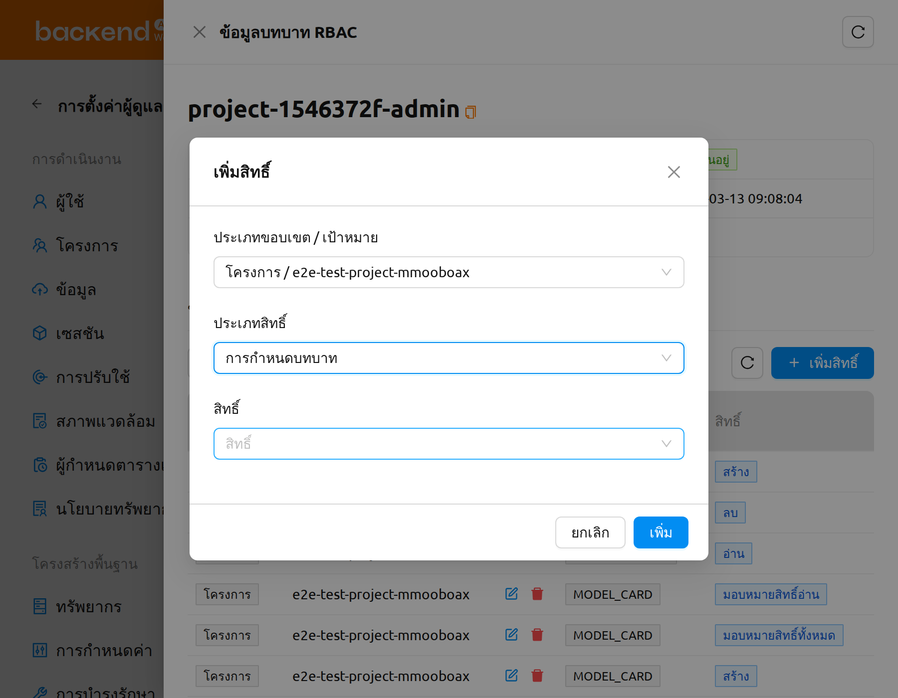

:::note
ตัวควบคุมตัวกรองในรายการสิทธิ์จะใช้ประเภทของช่องป้อนค่าที่เหมาะกับแต่ละคุณสมบัติของตัวกรอง โดยใช้ตัวเลือกสำหรับค่าที่กำหนดไว้ (เช่น ประเภทสิทธิ์, สิทธิ์) และข้อความอิสระสำหรับฟิลด์ประเภทชื่อ ทำให้กรองรายการที่ต้องการได้รวดเร็วยิ่งขึ้น
:::

:::note
สำหรับบทบาทที่ถูกสร้างโดยไม่มีขอบเขตใด ๆ (เช่น บทบาทเดิมที่นำเข้ามาจากเวอร์ชันก่อนหน้า) โมดอล **เพิ่มสิทธิ์** จะแสดงฟิลด์ **ประเภทขอบเขต** และ **เป้าหมาย** แยกกันเพื่อให้ผู้ดูแลระบบสามารถกำหนดค่าเป้าหมายสิทธิ์ได้โดยตรง
:::

### การแก้ไขสิทธิ์

คุณสามารถแก้ไขสิทธิ์ที่มีอยู่ได้โดยไม่ต้องลบและเพิ่มใหม่

1. ในแท็บ**สิทธิ์** วางเมาส์เหนือแถวสิทธิ์ที่ต้องการเปลี่ยนแปลง แล้วคลิกการดำเนินการ **แก้ไข** (ไอคอนดินสอ)
2. โมดอลเดียวกับที่ใช้เพิ่มสิทธิ์จะเปิดขึ้นโดยกรอกค่าปัจจุบันไว้ล่วงหน้า ปรับ **ประเภทขอบเขต / เป้าหมาย**, **ประเภทสิทธิ์** และ **สิทธิ์** ตามต้องการ
3. คลิก **บันทึก** เพื่อใช้การเปลี่ยนแปลง

<!-- TODO: Capture screenshot of rbac_edit_permission_modal.png — Edit Permission modal showing the Edit Permission title and the Save button -->

ฟิลด์ที่แก้ไขได้จะเหมือนกับฟิลด์ใน[การเพิ่มสิทธิ์](#add-a-permission) ต่างกันเพียงชื่อโมดอล (**แก้ไขสิทธิ์**) และปุ่มยืนยัน (**บันทึก**)

### การลบสิทธิ์

1. ในแท็บ**สิทธิ์** คลิกปุ่ม**ลบสิทธิ์**ถัดจากสิทธิ์ที่ต้องการลบ
2. ป๊อปอัปยืนยันขนาดเล็กจะปรากฏแนบกับปุ่ม คลิก **ตกลง** เพื่อยืนยัน หรือ **ยกเลิก** เพื่อปิด

การลบสิทธิ์ออกจากบทบาทเป็นการตัดสิทธิ์นั้นออกจากชุดสิทธิ์ของบทบาทเท่านั้น บทบาท ขอบเขต และการมอบหมายผู้ใช้ยังคงอยู่ คุณสามารถเพิ่มสิทธิ์เดิมกลับเข้ามาจากแท็บเดียวกันได้ในภายหลัง จึงถือว่าการดำเนินการนี้สามารถย้อนกลับได้ และใช้ป๊อปอัปยืนยันแบบเบาแทนการยืนยันด้วยการพิมพ์ชื่อ

## การจัดการการมอบหมายผู้ใช้

แท็บ **การมอบหมายบทบาท** ในแผงรายละเอียดบทบาทจะแสดงผู้ใช้ที่ถูกมอบหมายให้กับบทบาท

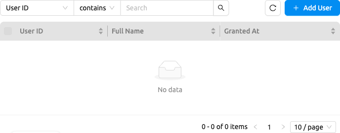

### การเพิ่มผู้ใช้ในบทบาท

1. เปิดแผงรายละเอียดบทบาทและเลือกแท็บ **การมอบหมายบทบาท**
2. คลิกปุ่ม **เพิ่มผู้ใช้**
3. ในโมดอล ค้นหาผู้ใช้ตามอีเมลหรือชื่อ
4. เลือกผู้ใช้หนึ่งคนขึ้นไปโดยใช้ช่องทำเครื่องหมาย
5. คลิก **มอบหมาย** เพื่อมอบหมายผู้ใช้ที่เลือกให้กับบทบาท

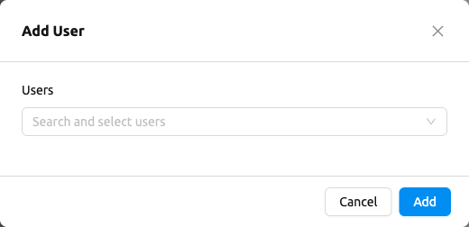

การเพิ่มผู้ใช้เป็นการดำเนินการแบบกลุ่ม คุณสามารถเลือกผู้ใช้หลายคนในครั้งเดียวและมอบหมายทั้งหมดพร้อมกันได้

:::note
หากไม่สามารถมอบหมายผู้ใช้บางคนที่เลือกได้ การมอบหมายจะดำเนินต่อไปสำหรับผู้ใช้ที่เหลือ ข้อความสรุปจะรายงานว่ามีผู้ใช้กี่คนที่ล้มเหลว และจะมีการแจ้งเตือนข้อผิดพลาดแยกต่างหากสำหรับผู้ใช้แต่ละคนที่ล้มเหลวพร้อมอธิบายสาเหตุ
:::

### การเพิกถอนผู้ใช้จากบทบาท

คุณสามารถเพิกถอนผู้ใช้คนเดียวหรือหลายคนพร้อมกันได้

ในการเพิกถอนผู้ใช้คนเดียว:

1. ในแท็บ **การมอบหมายบทบาท** วางเมาส์เหนือแถวผู้ใช้แล้วคลิกไอคอนเพิกถอน (ถังขยะ) ถัดจากผู้ใช้
2. โมดอลยืนยัน **นำผู้ใช้ออกจากบทบาท** จะเปิดขึ้น ตรวจสอบผู้ใช้ที่แสดงในรายการ จากนั้นคลิก **นำผู้ใช้ออกจากบทบาท** เพื่อยืนยัน หรือ **ยกเลิก** เพื่อปิด

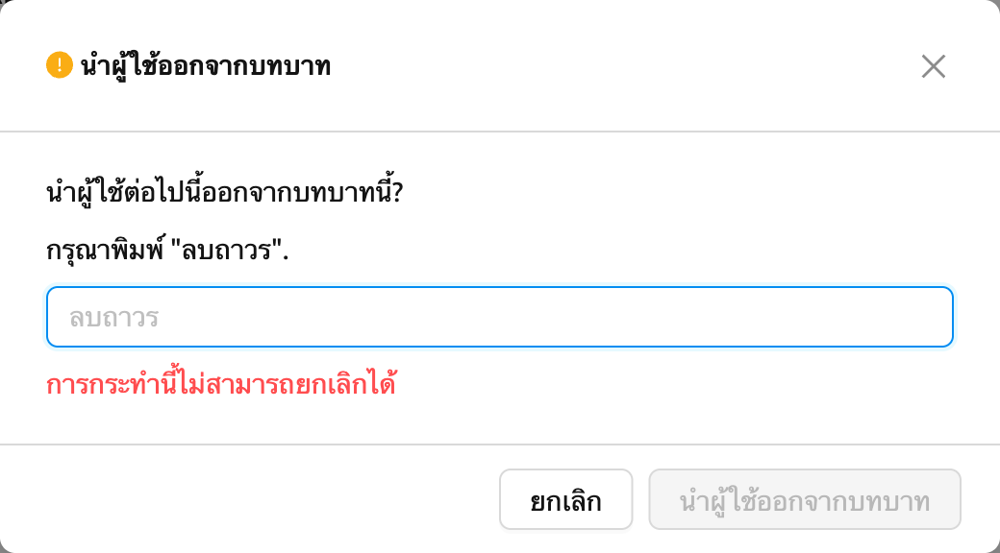

ในการเพิกถอนผู้ใช้หลายคนพร้อมกัน:

1. ในแท็บ **การมอบหมายบทบาท** ใช้ช่องทำเครื่องหมายเพื่อเลือกผู้ใช้ที่ต้องการนำออก ป้ายแสดงจำนวนที่เลือกจะปรากฏถัดจากตัวควบคุมการเพิกถอน โดยแสดงจำนวนแถวที่เลือกไว้ ใช้ตัวควบคุมล้างการเลือกบนป้ายนั้นเพื่อยกเลิกการเลือกทุกแถว
2. คลิกปุ่ม **นำผู้ใช้ออกจากบทบาท** แบบกลุ่ม (ไอคอนถังขยะ) ที่ปรากฏขึ้นเมื่อมีการเลือกหนึ่งแถวขึ้นไป
3. ในโมดอลยืนยัน **นำผู้ใช้ออกจากบทบาท** ตรวจสอบผู้ใช้ที่แสดงในรายการ จากนั้นคลิก **นำผู้ใช้ออกจากบทบาท** เพื่อยืนยัน หรือ **ยกเลิก** เพื่อปิด

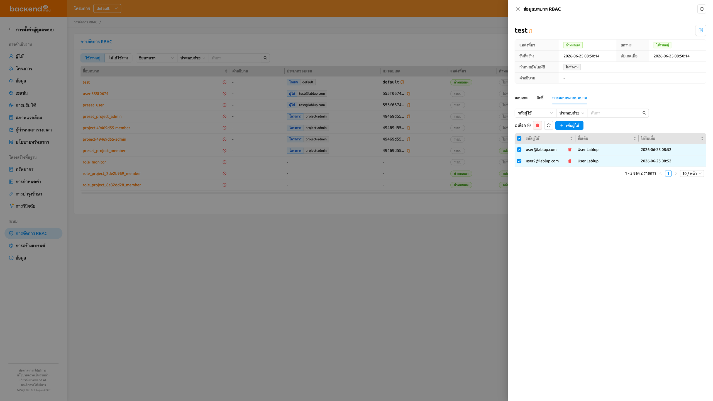
<!-- TODO: Capture screenshot of rbac_bulk_revoke_selection.png — Role Assignments tab with multiple rows selected, showing the selection-count label and the bulk Revoke User control -->

การเพิกถอนผู้ใช้จะลบเฉพาะการมอบหมายของผู้ใช้นั้นกับบทบาทนี้เท่านั้น บทบาทและการมอบหมายอื่น ๆ ยังคงไม่เปลี่ยนแปลง

:::note
หากไม่สามารถเพิกถอนผู้ใช้บางคนที่เลือกได้ การดำเนินการจะดำเนินต่อไปสำหรับผู้ใช้ที่เหลือ ข้อความสรุปจะรายงานว่ามีผู้ใช้กี่คนที่ล้มเหลว และจะมีการแจ้งเตือนข้อผิดพลาดแยกต่างหากสำหรับผู้ใช้แต่ละคนที่ล้มเหลวพร้อมอธิบายสาเหตุ
:::

:::note
การเพิกถอนการมอบหมายบทบาทสามารถยกเลิกได้โดยการเพิ่มผู้ใช้กลับเข้าสู่บทบาทจากแท็บ **การมอบหมายบทบาท**
:::

## การมอบสิทธิ์ผู้ดูแลโปรเจกต์

เมื่อสร้างโปรเจกต์ ระบบจะสร้างบทบาทเฉพาะชื่อ `project-<project_id>-admin` ขึ้นมาด้วย โดย `<project_id>` คือ UUID ของโปรเจกต์นั้น การมอบหมายผู้ใช้ให้กับบทบาทนี้จะเป็นการให้สิทธิ์ [ผู้ดูแลโปรเจกต์](#project-admin-features) เหนือโปรเจกต์ดังกล่าวโดยเฉพาะ ผู้ใช้สามารถจัดการผู้ใช้ เซสชัน การปรับใช้ และโฟลเดอร์จัดเก็บของโปรเจกต์ได้โดยไม่ต้องมีสิทธิ์ผู้ดูแลระบบระดับสูงทั่วทั้งระบบ

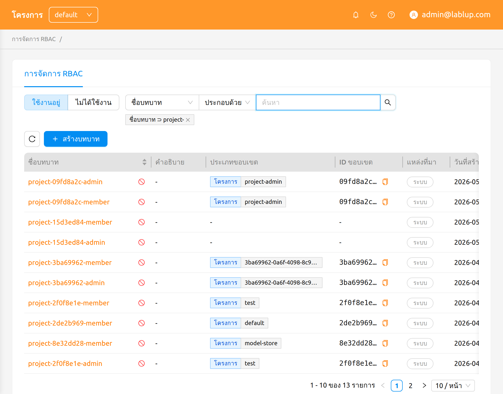

ในการมอบสิทธิ์ผู้ดูแลโปรเจกต์ให้กับผู้ใช้:

1. เปิด[รายการบทบาท](#role-list) และค้นหาบทบาท `project-<project_id>-admin` ของโปรเจกต์เป้าหมาย ใช้ตัวกรองคุณสมบัติเพื่อค้นหาตามชื่อบทบาท (เช่น ป้อน `project-` เพื่อจำกัดรายการ)
2. คลิกชื่อบทบาทเพื่อเปิดมุมมองรายละเอียดบทบาท
3. ปฏิบัติตามขั้นตอน[การเพิ่มผู้ใช้ในบทบาท](#add-users-to-a-role) บนบทบาทนี้เพื่อมอบหมายผู้ใช้

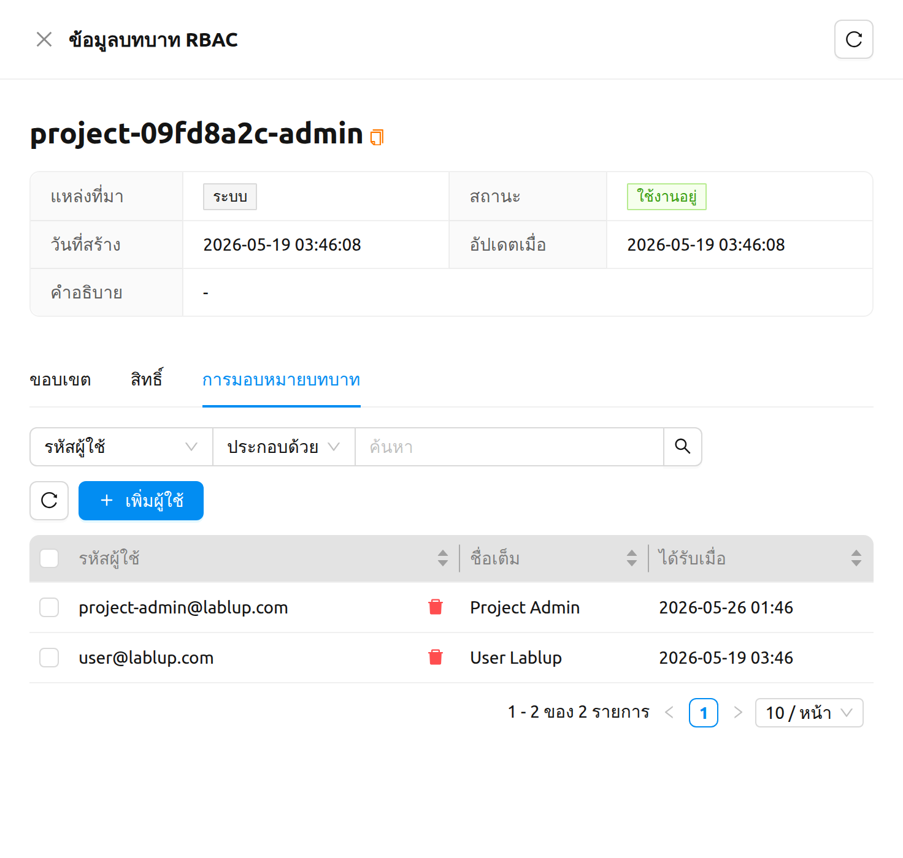

ผู้ใช้จะได้รับสิทธิ์ผู้ดูแลโปรเจกต์ทันที เมื่อผู้ใช้เปิดดรอปดาวน์โปรเจกต์ในส่วนหัวในครั้งถัดไป ผู้ใช้จะเห็นป้ายผู้ดูแลโปรเจกต์ถัดจากโปรเจกต์ที่เกี่ยวข้อง รวมถึงรายการแถบด้านข้างสำหรับผู้ดูแลโปรเจกต์ที่อธิบายไว้ในบท [ฟีเจอร์สำหรับผู้ดูแลโปรเจกต์](#project-admin-features)

ในการเพิกถอนสิทธิ์ผู้ดูแลโปรเจกต์ ให้ปฏิบัติตามขั้นตอน[การเพิกถอนผู้ใช้จากบทบาท](#revoke-users-from-a-role) บนบทบาท `project-<project_id>-admin` เดิม
