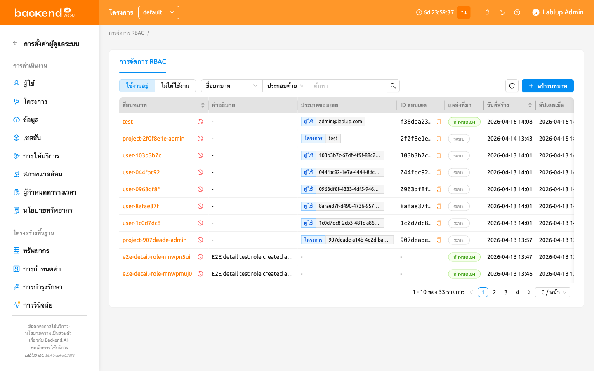
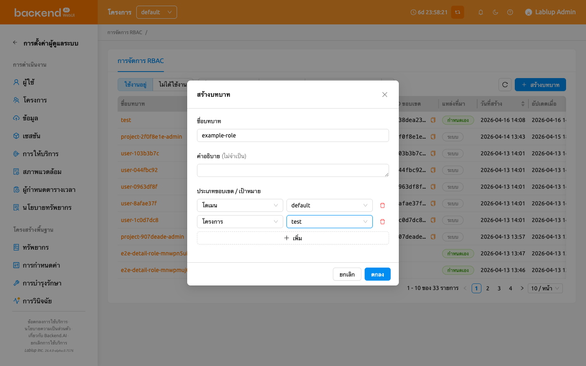
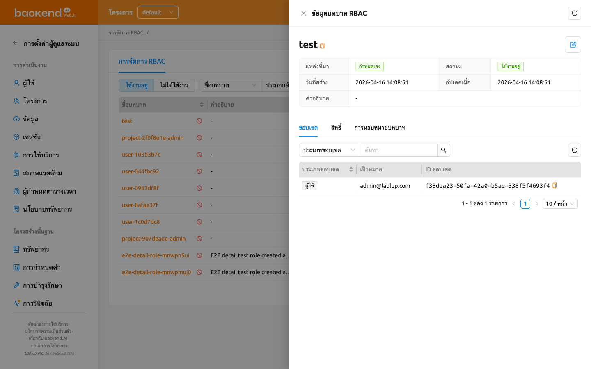
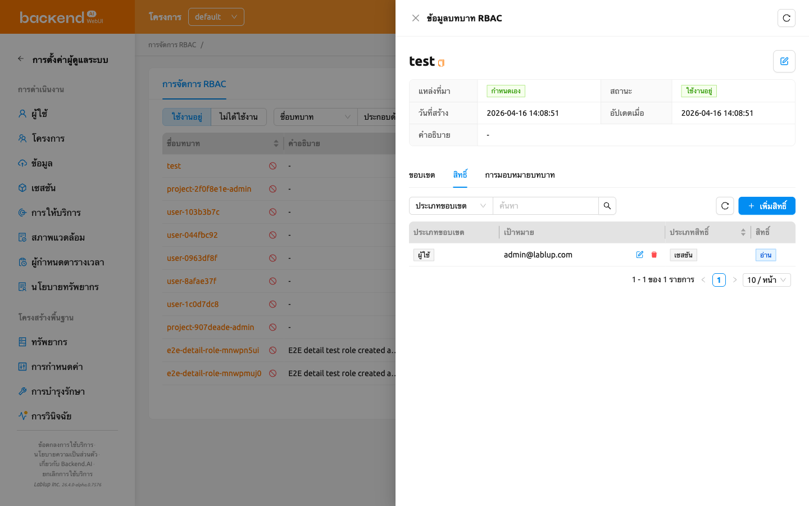
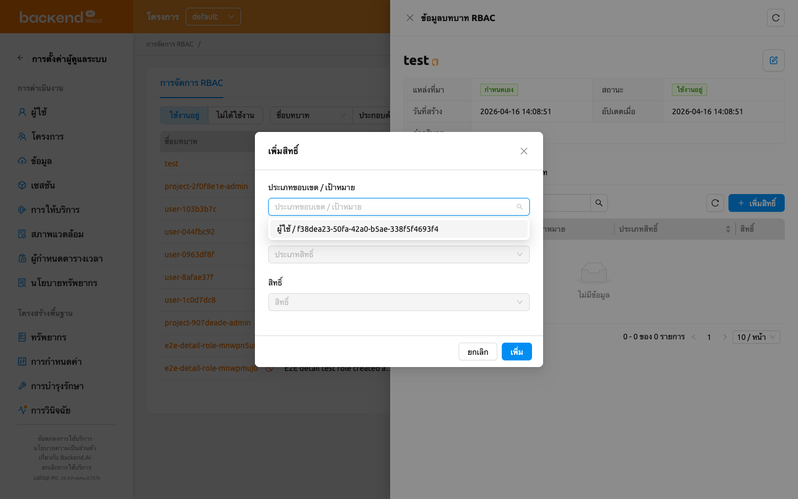
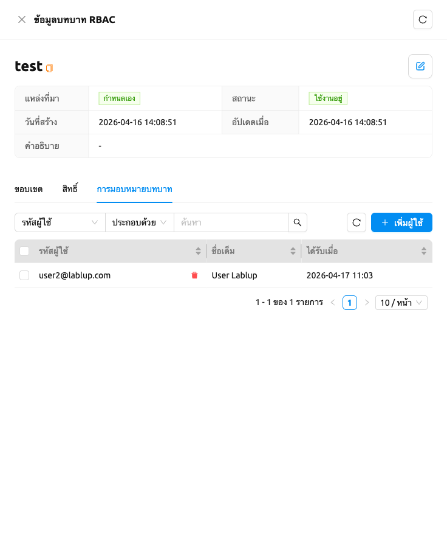
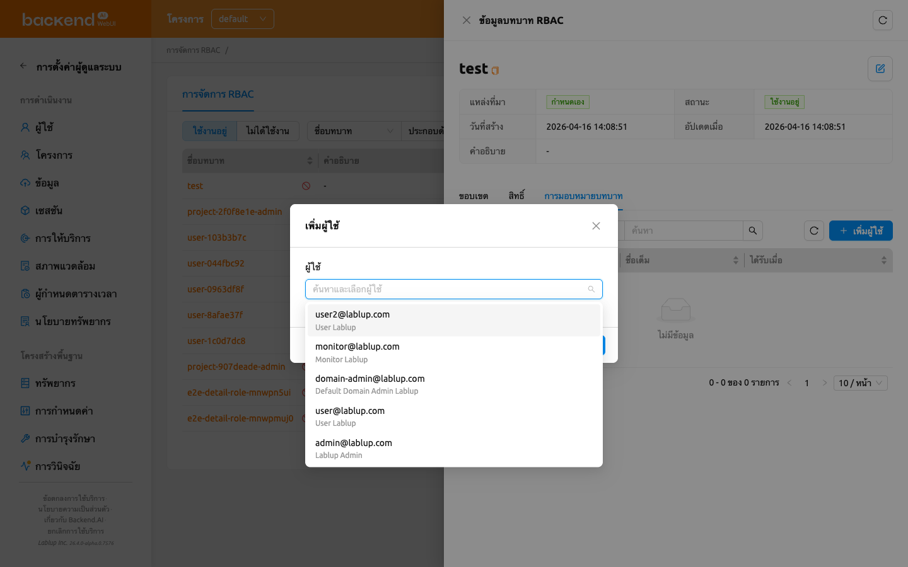
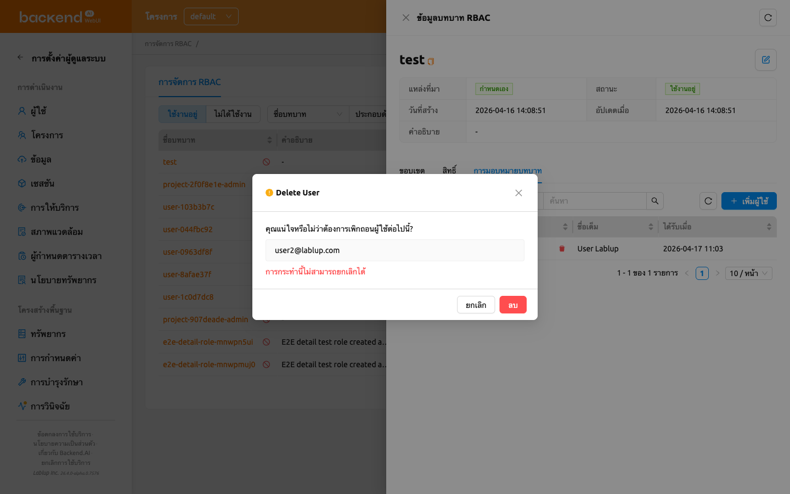

# การจัดการ RBAC

การจัดการ RBAC (Role-Based Access Control) ช่วยให้ผู้ดูแลระบบระดับสูงสามารถกำหนดบทบาทที่มีสิทธิ์แบบละเอียดและมอบหมายให้กับผู้ใช้ได้ ด้วย RBAC คุณสามารถควบคุมการดำเนินการที่ผู้ใช้เฉพาะสามารถทำได้กับทรัพยากรต่าง ๆ ในระบบ Backend.AI

:::note
การจัดการ RBAC ใช้ได้เฉพาะผู้ดูแลระบบระดับสูงเท่านั้น และต้องใช้ Backend.AI Manager เวอร์ชัน 25.4.0 ขึ้นไป
:::

ในการเข้าถึงหน้าการจัดการ RBAC ให้คลิก **การจัดการ RBAC** ในส่วน **การตั้งค่าผู้ดูแลระบบ** ของเมนูแถบด้านข้าง

## รายการบทบาท

หน้ารายการบทบาทแสดงบทบาททั้งหมดในรูปแบบตาราง คุณสามารถกรอง ค้นหา และเรียงลำดับบทบาทโดยใช้ตัวควบคุมที่ด้านบนของหน้า

- **ตัวกรองสถานะ**: ตัวควบคุมแบบแบ่งส่วนสำหรับสลับระหว่างบทบาท**ใช้งานอยู่**และ**ไม่ได้ใช้งาน** โดยค่าเริ่มต้นจะเลือกใช้งานอยู่
- **ค้นหาชื่อ**: ตัวกรองคุณสมบัติสำหรับค้นหาบทบาทตามชื่อหรือกรองตามแหล่งที่มา (ระบบ หรือ กำหนดเอง)
- **สร้างบทบาท**: ปุ่มสำหรับสร้างบทบาทแบบกำหนดเองใหม่

ตารางแสดงคอลัมน์ต่อไปนี้:

- **ชื่อบทบาท**: ชื่อของบทบาท คลิกชื่อเพื่อเปิดแผงรายละเอียดบทบาท
- **คำอธิบาย**: คำอธิบายสั้น ๆ เกี่ยวกับวัตถุประสงค์ของบทบาท
- **ประเภทขอบเขต**: ประเภทของขอบเขตแรกที่ถูกกำหนดให้กับบทบาท หากบทบาทมีหลายขอบเขต จะมีการแสดง `+N` กำกับไว้ด้วย
- **ID ขอบเขต**: ID ดั้งเดิมของขอบเขตแรกที่กำหนดให้กับบทบาท หากบทบาทมีหลายขอบเขต จะมีการแสดง `+N` กำกับไว้ด้วย
- **แหล่งที่มา**: ระบุว่าบทบาทเป็น**ระบบ** (กำหนดไว้ล่วงหน้า) หรือ**กำหนดเอง** (สร้างโดยผู้ใช้)
- **วันที่สร้าง**: วันที่และเวลาที่สร้างบทบาท
- **วันที่อัปเดต**: วันที่และเวลาที่แก้ไขบทบาทล่าสุด

คุณสามารถเรียงลำดับตารางโดยคลิกที่ส่วนหัวคอลัมน์ **ชื่อบทบาท** **วันที่สร้าง** หรือ **วันที่อัปเดต**

### บทบาทระบบและบทบาทกำหนดเอง

บทบาทแบ่งออกเป็นสองประเภทแหล่งที่มา:

- **ระบบ**: บทบาทที่สร้างขึ้นโดยอัตโนมัติ ไม่สามารถแก้ไขชื่อหรือคำอธิบายได้ แต่สามารถจัดการการมอบหมายผู้ใช้และสิทธิ์ได้
- **กำหนดเอง**: บทบาทที่สร้างโดยผู้ดูแลระบบระดับสูง สามารถแก้ไขได้ทั้งหมด รวมถึงชื่อ คำอธิบาย การมอบหมาย ขอบเขต และสิทธิ์

## การสร้างบทบาท

ในการสร้างบทบาท คุณต้องกำหนด**ขอบเขต**ล่วงหน้า ขอบเขตจะผูกบทบาทเข้ากับเอนทิตีทรัพยากรที่ระบุ (เช่น โดเมน โปรเจกต์ หรือผู้ใช้) เพื่อให้สิทธิ์ทุกข้อที่เพิ่มในภายหลังถูกจำกัดให้อยู่ภายในขอบเขตที่กำหนดไว้ที่นี่เท่านั้น

ในการสร้างบทบาทแบบกำหนดเองใหม่:

1. คลิกปุ่ม **สร้างบทบาท** ที่มุมขวาบนของหน้ารายการบทบาท
2. ในโมดอลการสร้าง ให้กรอกฟิลด์ต่อไปนี้:
   - **ชื่อบทบาท** (จำเป็น): ป้อนชื่อบทบาทที่ไม่ซ้ำกัน
   - **คำอธิบาย** (ไม่บังคับ): ป้อนคำอธิบายเกี่ยวกับวัตถุประสงค์ของบทบาท
   - **ประเภทขอบเขต / เป้าหมาย** (จำเป็น, อย่างน้อย 1 รายการ): สำหรับแต่ละแถวขอบเขต เลือก**ประเภทขอบเขต**ก่อน จากนั้นเลือก**เป้าหมาย**เฉพาะภายในประเภทขอบเขตนั้น คลิก **เพิ่ม** เพื่อเพิ่มแถวขอบเขตอีก หรือคลิกไอคอนลบเพื่อลบแถว คุณต้องเพิ่มขอบเขตอย่างน้อยหนึ่งรายการ
3. คลิก **ตกลง** เพื่อสร้างบทบาท

:::info
ขอบเขตถูกกำหนดในเวลาสร้างบทบาท และไม่สามารถแก้ไขได้ในภายหลังผ่านแผงรายละเอียดบทบาท โปรดวางแผนขอบเขตอย่างรอบคอบก่อนสร้างบทบาท
:::

### ประเภทขอบเขต

ประเภทขอบเขตที่สามารถใช้งานได้เมื่อสร้างบทบาท:

- **โดเมน**: เลือกจากรายการโดเมนที่ใช้งานอยู่
- **โปรเจกต์**: เลือกโปรเจกต์ (สามารถกรองตามโดเมน)
- **ผู้ใช้**: ค้นหาผู้ใช้ตามอีเมลหรือชื่อ

## ดูรายละเอียดบทบาท

ในการดูข้อมูลรายละเอียดของบทบาท ให้คลิกชื่อบทบาทในตาราง แผงรายละเอียดจะเปิดขึ้นทางด้านขวาของหน้า

ส่วนหัวของแผงจะแสดงชื่อบทบาทและมีปุ่ม**แก้ไข**สำหรับบทบาทแบบกำหนดเอง ส่วนรายละเอียดจะแสดงข้อมูลเมตาต่อไปนี้:

- **แหล่งที่มา**: ระบบ หรือ กำหนดเอง
- **สถานะ**: ใช้งานอยู่ หรือ ไม่ได้ใช้งาน
- **วันที่สร้าง**: เวลาที่สร้าง
- **วันที่อัปเดต**: เวลาที่แก้ไขล่าสุด
- **คำอธิบาย**: คำอธิบายของบทบาท

ด้านล่างข้อมูลเมตามีสามแท็บ: **ขอบเขต**, **สิทธิ์** และ **การมอบหมายบทบาท**

### การแก้ไขบทบาท

ในการแก้ไขชื่อหรือคำอธิบายของบทบาทแบบกำหนดเอง:

1. คลิกชื่อบทบาทในตารางเพื่อเปิดแผงรายละเอียด
2. คลิกปุ่ม**แก้ไข** (ไอคอนดินสอ) ในส่วนหัวของแผง
3. แก้ไข**ชื่อบทบาท**และ/หรือ**คำอธิบาย**ในโมดอลแก้ไข
4. คลิก **ตกลง** เพื่อบันทึกการเปลี่ยนแปลง

:::note
ปุ่มแก้ไขใช้ได้เฉพาะกับบทบาทแบบกำหนดเองเท่านั้น ไม่สามารถแก้ไขชื่อหรือคำอธิบายของบทบาทระบบได้ และไม่สามารถแก้ไขขอบเขตหลังจากที่สร้างบทบาทแล้วในทั้งสองกรณี
:::

### การจัดการสถานะบทบาท

มีสองสถานะที่สามารถจัดการได้จากรายการบทบาท:

- **ใช้งานอยู่**: บทบาทมีผลบังคับใช้ในปัจจุบัน คุณสามารถ**ปิดใช้งาน**บทบาทที่ใช้งานอยู่เพื่อระงับชั่วคราว
- **ไม่ได้ใช้งาน**: บทบาทถูกระงับ คุณสามารถ**เปิดใช้งาน**บทบาทที่ไม่ได้ใช้งานเพื่อกู้คืน หรือ**ลบอย่างถาวร**เพื่อลบออกอย่างสมบูรณ์

แต่ละแถวบทบาทจะแสดงปุ่ม**ปิดใช้งาน**เมื่อดูบทบาท**ใช้งานอยู่** หรือปุ่ม**เปิดใช้งาน**และ**ลบบทบาทอย่างถาวร**เมื่อดูบทบาท**ไม่ได้ใช้งาน**

:::danger
การลบบทบาทอย่างถาวรไม่สามารถย้อนกลับได้ บทบาทและข้อมูลที่เกี่ยวข้องทั้งหมดจะถูกลบอย่างถาวร คุณต้องลบการมอบหมายผู้ใช้และสิทธิ์ทั้งหมดออกจากบทบาทก่อนการลบอย่างถาวร
:::

## ดูขอบเขตของบทบาท

แท็บ **ขอบเขต** ในแผงรายละเอียดบทบาทจะแสดงรายการขอบเขตที่ได้รับการกำหนดให้กับบทบาทในเวลาสร้าง แต่ละรายการจะจำกัดชุดเป้าหมายที่สิทธิ์ของบทบาทนี้สามารถอ้างอิงได้

ตารางแสดงคอลัมน์ต่อไปนี้:

- **ประเภทขอบเขต**: ประเภทของรายการขอบเขต (เช่น โดเมน, โปรเจกต์, ผู้ใช้)
- **เป้าหมาย**: ชื่อที่แสดงของเป้าหมายขอบเขต (เช่น ชื่อโดเมน, ชื่อโปรเจกต์, อีเมลของผู้ใช้)
- **ID ขอบเขต**: UUID ของเป้าหมายขอบเขต

ใช้ตัวควบคุมตัวกรองที่ด้านบนเพื่อจำกัดรายการขอบเขตตาม**ประเภทขอบเขต**

:::note
ในแท็บนี้ ขอบเขตเป็นแบบอ่านอย่างเดียว หากต้องการเปลี่ยนขอบเขตของบทบาท คุณต้องสร้างบทบาทใหม่พร้อมกับขอบเขตที่ต้องการ
:::

## การจัดการสิทธิ์

แท็บ**สิทธิ์**ในแผงรายละเอียดบทบาทจะแสดงสิทธิ์แบบละเอียดที่กำหนดค่าไว้สำหรับบทบาท

### ทำความเข้าใจเกี่ยวกับสิทธิ์

แต่ละสิทธิ์ประกอบด้วยสี่องค์ประกอบ:

- **ประเภทขอบเขต**: ประเภทของทรัพยากรที่สิทธิ์กำหนดเป้าหมาย (เช่น โดเมน, โปรเจกต์, ผู้ใช้)
- **เป้าหมาย**: เอนทิตีเฉพาะภายในประเภทขอบเขต (เช่น ชื่อโดเมนเฉพาะ, โปรเจกต์เฉพาะ)
- **ประเภทสิทธิ์**: หมวดหมู่ของทรัพยากรที่สิทธิ์ควบคุม กรองตามประเภทขอบเขตที่เลือก
- **สิทธิ์**: การดำเนินการที่อนุญาตบนทรัพยากร จะแสดงเฉพาะการดำเนินการที่ถูกต้องสำหรับประเภทสิทธิ์ที่เลือกเท่านั้น การดำเนินการแบ่งออกเป็นสองหมวดหมู่:
   * **โดยตรง**: สร้าง, อ่าน, แก้ไข, ลบ, ลบถาวร
   * **มอบหมายให้ผู้อื่น**: มอบหมายสิทธิ์ทั้งหมด, มอบหมายสิทธิ์อ่าน, มอบหมายสิทธิ์แก้ไข, มอบหมายสิทธิ์ลบ, มอบหมายสิทธิ์ลบถาวร

:::info
การรวม **ประเภทขอบเขต / เป้าหมาย** ของแต่ละสิทธิ์ได้รับการสืบทอดมาจากรายการขอบเขตของบทบาท เมื่อเพิ่มสิทธิ์ คุณสามารถเลือกได้เฉพาะจากขอบเขตที่กำหนดไว้เมื่อสร้างบทบาทเท่านั้น หากต้องการขยายการเข้าถึงของบทบาท ให้สร้างบทบาทใหม่พร้อมกับขอบเขตเพิ่มเติม
:::

### ตัวอย่างการตั้งค่าสิทธิ์

ต่อไปนี้คือตัวอย่างการตั้งค่าสิทธิ์ทั่วไปเพื่อช่วยให้คุณเข้าใจว่าองค์ประกอบทั้งสี่ทำงานร่วมกันอย่างไร คอลัมน์ **ประเภทขอบเขต / เป้าหมาย** แสดงขอบเขตระดับบทบาทที่สิทธิ์นำมาใช้ซ้ำ

| สถานการณ์ | ประเภทขอบเขต / เป้าหมาย | ประเภทสิทธิ์ | สิทธิ์ |
|----------|------------------------|------------|-------|
| อนุญาตให้สร้างโฟลเดอร์จัดเก็บในโปรเจกต์เฉพาะ | โปรเจกต์ / my-project | VFolder | สร้าง |
| อนุญาตให้ดูเซสชันทั้งหมดในโดเมน | โดเมน / default | Session | อ่าน |
| อนุญาตให้จัดการเอนด์พอยต์โมเดลเซอร์วิง | โดเมน / default | Endpoint | สร้าง, อ่าน, แก้ไข |
| อนุญาตให้ลบคอนเทนเนอร์อิมเมจ | โดเมน / default | Image | ลบ |

### การเพิ่มสิทธิ์

1. เปิดแผงรายละเอียดบทบาทและเลือกแท็บ**สิทธิ์**
2. คลิกปุ่ม**เพิ่มสิทธิ์**
3. ในโมดอล ให้กรอกฟิลด์ต่อไปนี้:
   - **ประเภทขอบเขต / เป้าหมาย**: เลือกหนึ่งในรายการขอบเขตที่ได้รับการกำหนดให้กับบทบาท ดรอปดาวน์จะแสดงเฉพาะขอบเขตที่มีเอนทิตีที่ดำเนินการได้อย่างน้อยหนึ่งรายการ
   - **ประเภทสิทธิ์**: เลือกประเภทเอนทิตี จะแสดงเฉพาะประเภทที่ถูกต้องสำหรับประเภทขอบเขตที่เลือก
   - **สิทธิ์**: เลือกการดำเนินการ (เช่น สร้าง, อ่าน, แก้ไข, ลบ, ลบถาวร หรือการดำเนินการมอบหมาย)
4. คลิก **เพิ่ม** เพื่อสร้างสิทธิ์

:::note
สำหรับบทบาทที่ถูกสร้างโดยไม่มีขอบเขตใด ๆ (เช่น บทบาทเดิมที่นำเข้ามาจากเวอร์ชันก่อนหน้า) โมดอล **เพิ่มสิทธิ์** จะแสดงฟิลด์ **ประเภทขอบเขต** และ **เป้าหมาย** แยกกันเพื่อให้ผู้ดูแลระบบสามารถกำหนดค่าเป้าหมายสิทธิ์ได้โดยตรง
:::

### การลบสิทธิ์

1. ในแท็บ**สิทธิ์** คลิกปุ่ม**ลบสิทธิ์**ถัดจากสิทธิ์ที่ต้องการลบ
2. ยืนยันการลบในกล่องโต้ตอบยืนยัน

## การจัดการการมอบหมายผู้ใช้

แท็บ **การมอบหมายบทบาท** ในแผงรายละเอียดบทบาทจะแสดงผู้ใช้ที่ถูกมอบหมายให้กับบทบาท

### การเพิ่มผู้ใช้ในบทบาท

1. เปิดแผงรายละเอียดบทบาทและเลือกแท็บ **การมอบหมายบทบาท**
2. คลิกปุ่ม **เพิ่มผู้ใช้**
3. ในโมดอล ค้นหาผู้ใช้ตามอีเมลหรือชื่อ
4. เลือกผู้ใช้หนึ่งคนขึ้นไปโดยใช้ช่องทำเครื่องหมาย
5. คลิก **มอบหมาย** เพื่อมอบหมายผู้ใช้ที่เลือกให้กับบทบาท

### การลบผู้ใช้จากบทบาท

1. ในแท็บ **การมอบหมายบทบาท** คลิกปุ่ม**ลบผู้ใช้**ถัดจากผู้ใช้ที่ต้องการลบ
2. ยืนยันการลบในกล่องโต้ตอบยืนยัน

