

# การจัดการ RBAC

การจัดการ RBAC (Role-Based Access Control) ช่วยให้ผู้ดูแลระบบระดับสูงสามารถกำหนดบทบาทที่มีสิทธิ์แบบละเอียดและมอบหมายให้กับผู้ใช้ได้ ด้วย RBAC คุณสามารถควบคุมการดำเนินการที่ผู้ใช้เฉพาะสามารถทำได้กับทรัพยากรต่าง ๆ ในระบบ Backend.AI

ในการเข้าถึงหน้าการจัดการ RBAC ให้คลิก **การจัดการ RBAC** ในส่วน **การตั้งค่าผู้ดูแลระบบ** ของเมนูแถบด้านข้าง

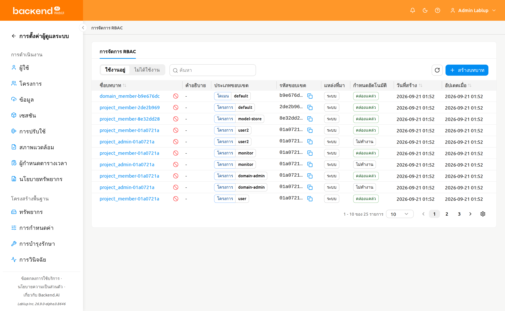

## รายการบทบาท

หน้ารายการบทบาทแสดงบทบาททั้งหมดในรูปแบบตาราง คุณสามารถกรอง ค้นหา และเรียงลำดับบทบาทโดยใช้ตัวควบคุมที่ด้านบนของหน้า

- **ตัวกรองสถานะ**: ตัวควบคุมแบบแบ่งส่วนสำหรับสลับระหว่างบทบาท**ใช้งานอยู่**และ**ไม่ได้ใช้งาน** โดยค่าเริ่มต้นจะเลือกใช้งานอยู่
- **ตัวกรองคุณสมบัติ**: ตัวกรองคุณสมบัติสำหรับจำกัดรายการ ช่องป้อนค่าของตัวกรองจะปรับเปลี่ยนตามคุณสมบัติที่เลือก มีคุณสมบัติต่อไปนี้ให้ใช้:
   * **ชื่อ**: ข้อความแบบอิสระสำหรับค้นหาตามชื่อบทบาท
   * **แหล่งที่มา**: แสดงค่าที่ใช้ได้ (**ระบบ** / **กำหนดเอง**) ในรูปแบบตัวเลือกแทนช่องข้อความแบบอิสระ
   * **ผู้ใช้ที่ถูกมอบหมาย**: ตัวเลือกผู้ใช้ที่กรองรายการให้เหลือเฉพาะบทบาทที่มอบหมายให้กับผู้ใช้ที่เลือก อีเมลของผู้ใช้จะแสดงบนแท็กเงื่อนไขที่สร้างขึ้น
   * **ประเภทขอบเขต**: ตัวเลือกที่แสดงประเภทขอบเขตของ RBAC (เช่น โดเมน, โปรเจกต์, หรือผู้ใช้)
   * **รหัสขอบเขต**: ข้อความแบบอิสระสำหรับค้นหาตาม UUID ขอบเขตดิบ
- **สร้างบทบาท**: ปุ่มสำหรับสร้างบทบาทแบบกำหนดเองใหม่

ตารางแสดงคอลัมน์ต่อไปนี้:

- **ชื่อบทบาท**: ชื่อของบทบาท คลิกชื่อเพื่อเปิดแผงรายละเอียดบทบาท
- **คำอธิบาย**: คำอธิบายสั้น ๆ เกี่ยวกับวัตถุประสงค์ของบทบาท
- **ประเภทขอบเขต**: ประเภทของขอบเขตแรกที่ถูกกำหนดให้กับบทบาท หากบทบาทมีหลายขอบเขต จะมีการแสดง `+N` กำกับไว้ด้วย
- **ID ขอบเขต**: ID ดั้งเดิมของขอบเขตแรกที่กำหนดให้กับบทบาท หากบทบาทมีหลายขอบเขต จะมีการแสดง `+N` กำกับไว้ด้วย
- **แหล่งที่มา**: ระบุว่าบทบาทเป็น**ระบบ** (กำหนดไว้ล่วงหน้า) หรือ**กำหนดเอง** (สร้างโดยผู้ใช้)
- **มอบหมายอัตโนมัติ**: ระบุว่าบทบาทถูกมอบหมายให้กับผู้ใช้โดยอัตโนมัติเมื่อมีการเพิ่มผู้ใช้เข้าสู่ขอบเขตที่บทบาทนั้นลงทะเบียนไว้หรือไม่ แสดง**ใช้งานอยู่**เมื่อเปิดใช้การมอบหมายอัตโนมัติ หรือ**ไม่ได้ใช้งาน**เมื่อปิดใช้
- **วันที่สร้าง**: วันที่และเวลาที่สร้างบทบาท
- **วันที่อัปเดต**: วันที่และเวลาที่แก้ไขบทบาทล่าสุด

### บทบาทระบบและบทบาทกำหนดเอง

บทบาทแบ่งออกเป็นสองประเภทแหล่งที่มา:

- **ระบบ**: บทบาทที่สร้างขึ้นโดยอัตโนมัติ ไม่สามารถแก้ไขชื่อหรือคำอธิบายได้ แต่สามารถจัดการการมอบหมายผู้ใช้และสิทธิ์ได้
- **กำหนดเอง**: บทบาทที่สร้างโดยผู้ดูแลระบบระดับสูง สามารถแก้ไขได้ทั้งหมด รวมถึงชื่อ คำอธิบาย การมอบหมาย ขอบเขต และสิทธิ์

## การสร้างบทบาท

ในการสร้างบทบาท คุณต้องกำหนด**ขอบเขต**ล่วงหน้า ขอบเขตจะผูกบทบาทเข้ากับเอนทิตีทรัพยากรที่ระบุ (เช่น โดเมน โปรเจกต์ หรือผู้ใช้) เพื่อให้สิทธิ์ทุกข้อที่เพิ่มในภายหลังถูกจำกัดให้อยู่ภายในขอบเขตที่กำหนดไว้ที่นี่เท่านั้น

ในการสร้างบทบาทแบบกำหนดเองใหม่:

1. คลิกปุ่ม **สร้างบทบาท** ที่มุมขวาบนของหน้ารายการบทบาท
2. ในโมดอลการสร้าง ให้กรอกฟิลด์ต่อไปนี้:
   - **ชื่อบทบาท** (จำเป็น): ป้อนชื่อบทบาทที่ไม่ซ้ำกัน
   - **คำอธิบาย** (ไม่บังคับ): ป้อนคำอธิบายเกี่ยวกับวัตถุประสงค์ของบทบาท
   - **มอบหมายอัตโนมัติ** (ไม่บังคับ): เมื่อเปิดใช้งาน บทบาทจะถูกมอบหมายให้กับผู้ใช้โดยอัตโนมัติเมื่อมีการเพิ่มผู้ใช้เข้าสู่ขอบเขตที่บทบาทนั้นลงทะเบียนไว้ ปิดใช้งานโดยค่าเริ่มต้น
   - **ประเภทขอบเขต / เป้าหมาย** (จำเป็น, อย่างน้อย 1 รายการ): สำหรับแต่ละแถวขอบเขต เลือก**ประเภทขอบเขต**ก่อน จากนั้นเลือก**เป้าหมาย**เฉพาะภายในประเภทขอบเขตนั้น คลิก **เพิ่ม** เพื่อเพิ่มแถวขอบเขตอีก หรือคลิกไอคอนลบเพื่อลบแถว คุณต้องเพิ่มขอบเขตอย่างน้อยหนึ่งรายการ
3. คลิก **ตกลง** เพื่อสร้างบทบาท

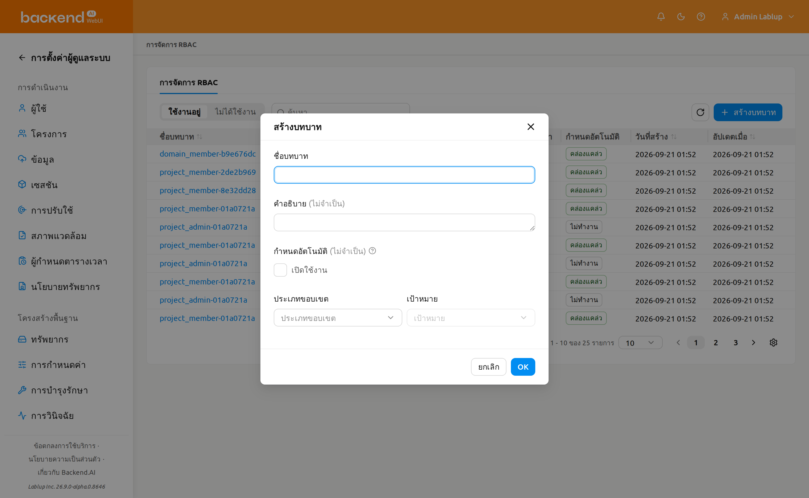

:::info
**ประเภทขอบเขต**และ**เป้าหมาย**ที่คุณกำหนดเมื่อสร้างบทบาทจะไม่ให้สิทธิ์ใด ๆ ด้วยตัวมันเอง แต่จะกำหนดล่วงหน้าว่ามี**ประเภทขอบเขต / เป้าหมาย**ใดบ้างที่สามารถเลือกได้เมื่อคุณเพิ่ม[สิทธิ์](#manage-permissions)ให้กับบทบาทนี้ในภายหลัง กล่าวคือ ขั้นตอนการสร้างบทบาทเป็นเพียงการจำกัดขอบเขตของประเภทขอบเขตและเป้าหมายที่สิทธิ์ของบทบาทนี้สามารถใช้ได้ไว้ล่วงหน้า และสิทธิ์แต่ละข้อจะตั้งค่าได้เฉพาะภายในประเภทขอบเขตและเป้าหมายที่กำหนดไว้ที่นี่เท่านั้น
:::

:::warning
ขอบเขตถูกกำหนดในเวลาสร้างบทบาท และไม่สามารถแก้ไขได้ในภายหลังผ่านแผงรายละเอียดบทบาท โปรดวางแผนขอบเขตอย่างรอบคอบก่อนสร้างบทบาท
:::

## ดูรายละเอียดบทบาท

ในการดูข้อมูลรายละเอียดของบทบาท ให้คลิกชื่อบทบาทในตาราง แผงรายละเอียดจะเปิดขึ้นทางด้านขวาของหน้า

ส่วนหัวของแผงจะแสดงชื่อบทบาทและมีปุ่ม**แก้ไข**สำหรับบทบาทแบบกำหนดเอง ส่วนรายละเอียดจะแสดงข้อมูลเมตาต่อไปนี้:

- **แหล่งที่มา**: ระบบ หรือ กำหนดเอง
- **สถานะ**: ใช้งานอยู่ หรือ ไม่ได้ใช้งาน
- **มอบหมายอัตโนมัติ**: ระบุว่าการมอบหมายอัตโนมัตินั้นใช้งานอยู่หรือไม่ได้ใช้งาน เมื่อใช้งานอยู่ บทบาทจะถูกมอบหมายให้กับผู้ใช้ที่เพิ่มเข้าสู่ขอบเขตที่ลงทะเบียนไว้แห่งใดแห่งหนึ่งโดยอัตโนมัติ
- **วันที่สร้าง**: เวลาที่สร้าง
- **วันที่อัปเดต**: เวลาที่แก้ไขล่าสุด
- **คำอธิบาย**: คำอธิบายของบทบาท

ด้านล่างข้อมูลเมตามีสองแท็บ: **สิทธิ์** และ **การมอบหมายบทบาท** โดยค่าเริ่มต้นจะเลือกแท็บ **สิทธิ์**

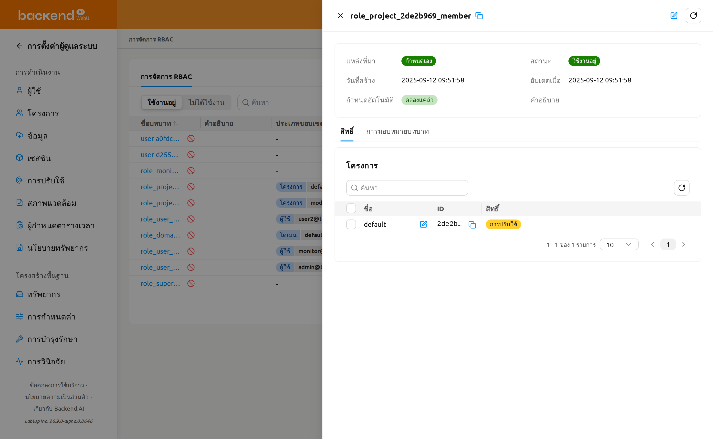

### การแก้ไขบทบาท

ในการแก้ไขชื่อ คำอธิบาย หรือการตั้งค่าการมอบหมายอัตโนมัติของบทบาทแบบกำหนดเอง:

1. คลิกชื่อบทบาทในตารางเพื่อเปิดแผงรายละเอียด
2. คลิกปุ่ม**แก้ไข** (ไอคอนดินสอ) ในส่วนหัวของแผง
3. แก้ไขฟิลด์ต่อไปนี้ในโมดอลแก้ไข:
   - **ชื่อบทบาท**: ชื่อของบทบาท
   - **คำอธิบาย**: คำอธิบายเกี่ยวกับวัตถุประสงค์ของบทบาท
   - **มอบหมายอัตโนมัติ**: เมื่อเปิดใช้งาน บทบาทจะถูกมอบหมายให้กับผู้ใช้ที่เพิ่มเข้าสู่ขอบเขตที่บทบาทนั้นลงทะเบียนไว้โดยอัตโนมัติ
4. คลิก **ตกลง** เพื่อบันทึกการเปลี่ยนแปลง

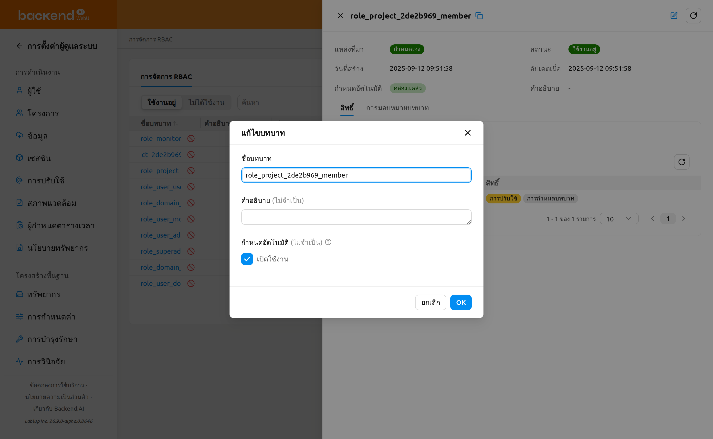

:::note
ปุ่มแก้ไขใช้ได้เฉพาะกับบทบาทแบบกำหนดเองเท่านั้น ไม่สามารถแก้ไขชื่อหรือคำอธิบายของบทบาทระบบได้ และไม่สามารถแก้ไขขอบเขตหลังจากที่สร้างบทบาทแล้วในทั้งสองกรณี
:::

## การจัดการสิทธิ์

แท็บ**สิทธิ์**ในแผงรายละเอียดบทบาทเป็นมุมมองรายละเอียดแบบรวมที่ผสานขอบเขตของบทบาทกับสิทธิ์แบบละเอียดเข้าด้วยกัน โดยจะแสดง**การ์ดหนึ่งใบต่อประเภทขอบเขต**ที่บทบาทใช้ และการ์ดแต่ละใบจะแสดงขอบเขตของประเภทขอบเขตนั้นพร้อมกับสิทธิ์ที่มอบให้กับขอบเขตเหล่านั้น

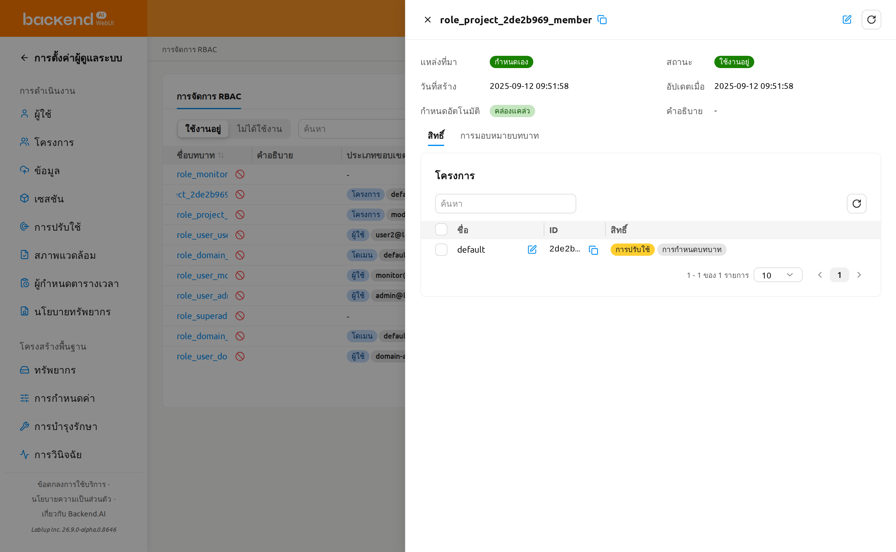

:::info
ขอบเขตที่บทบาทสามารถอ้างอิงได้จะถูกกำหนดเมื่อสร้างบทบาทและเป็นแบบ**อ่านอย่างเดียว**หลังจากนั้น คุณไม่สามารถเปลี่ยนได้จากแผงรายละเอียดบทบาท ในแท็บสิทธิ์ ขอบเขตจะปรากฏเป็นแถวภายในการ์ดของแต่ละประเภทขอบเขต หากต้องการเปลี่ยนขอบเขตของบทบาท ให้สร้างบทบาทใหม่พร้อมกับขอบเขตที่ต้องการ
:::

### การ์ดประเภทขอบเขต

แท็บสิทธิ์จะแสดงการ์ดหนึ่งใบสำหรับแต่ละประเภทขอบเขตที่บทบาทใช้ (เช่น โดเมน, โปรเจกต์, หรือผู้ใช้) ประเภทขอบเขตที่บทบาทไม่ได้ใช้จะถูกซ่อนไว้ และชื่อการ์ดคือชื่อประเภทขอบเขตที่ได้รับการแปลตามภาษา การ์ดแต่ละใบประกอบด้วย:

- **ตัวกรองรหัสขอบเขต**: ตัวกรองคุณสมบัติที่จำกัดแถวของการ์ดตาม UUID ขอบเขตดิบ ไม่รองรับการค้นหาด้วยชื่อขอบเขตที่ได้รับการแปล
- ปุ่ม**รีเฟรช**: โหลดแถวของการ์ดใหม่และคำนวณแท็กสิทธิ์อีกครั้ง
- **ตารางขอบเขต**: แสดงขอบเขตของบทบาทที่เป็นประเภทนี้ พร้อมคอลัมน์ต่อไปนี้:
   * **ชื่อ**: ชื่อขอบเขตที่ได้รับการแปล (เช่น ชื่อที่แสดงของโดเมน, โปรเจกต์, หรือผู้ใช้) พร้อมการดำเนินการ**แก้ไข**แบบอินไลน์ที่เปิดโมดอลแก้ไขสิทธิ์สำหรับขอบเขตนั้น
   * **ID**: UUID ขอบเขต
   * **สิทธิ์**: หนึ่งแท็กต่อประเภทสิทธิ์ ซึ่งมีสีตามสถานะการมอบสิทธิ์ (ดูด้านล่าง) เมื่อประเภทขอบเขตไม่มีเอนทิตีที่ตั้งค่าได้ คอลัมน์นี้จะแสดง `-`
- **การแบ่งหน้า**: แบ่งขอบเขตของการ์ดออกเป็นหน้าเมื่อมีจำนวนมาก

หากบทบาทไม่มีขอบเขตเลย แท็บจะแสดงข้อความ **ไม่มีขอบเขตที่กำหนดไว้สำหรับบทบาทนี้** แทนการ์ดใด ๆ

### แท็กสถานะการมอบสิทธิ์

ในคอลัมน์ **สิทธิ์** แต่ละแท็กประเภทสิทธิ์จะมีสีตามจำนวนการดำเนินการของประเภทนั้นที่ถูกมอบให้กับขอบเขต:

- **อนุญาตทั้งหมด** (สีเขียว): การดำเนินการทุกอย่างของประเภทสิทธิ์นั้นถูกมอบให้
- **อนุญาตบางส่วน** (สีเหลือง): มีการดำเนินการบางอย่างถูกมอบให้ แต่ไม่ทั้งหมด
- **ไม่อนุญาต** (ไม่มีสี): ไม่มีการดำเนินการใดถูกมอบให้

วางเคอร์เซอร์เหนือแท็กเพื่อดูป้ายสถานะของแท็ก

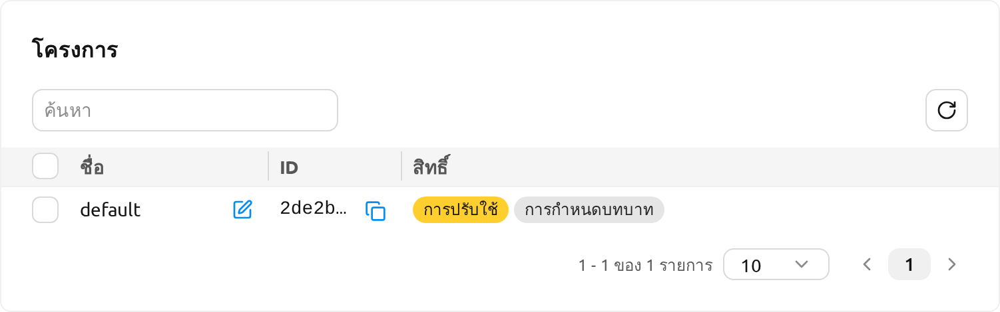

### ทำความเข้าใจเกี่ยวกับสิทธิ์

แต่ละสิทธิ์ประกอบด้วยสี่องค์ประกอบ:

- **ประเภทขอบเขต**: ขอบเขตที่มีผลซึ่งสิทธิ์จะถูกนำไปใช้ (เช่น โดเมน, โปรเจกต์, ผู้ใช้)
- **เป้าหมาย**: เอนทิตีเฉพาะภายในขอบเขตที่มีผล (เช่น ชื่อโดเมนเฉพาะ, โปรเจกต์เฉพาะ)
- **ประเภทสิทธิ์**: เป้าหมายที่การดำเนินการถูกกระทำภายในขอบเขตที่มีผลของสิทธิ์
- **สิทธิ์**: การดำเนินการที่อนุญาตสำหรับประเภทสิทธิ์ จะแสดงเฉพาะการดำเนินการที่ถูกต้องสำหรับประเภทสิทธิ์ที่เลือกเท่านั้น การดำเนินการแบ่งออกเป็นสองหมวดหมู่:
   * **โดยตรง**: สร้าง, อ่าน, แก้ไข, ลบ, ลบถาวร
   * **มอบหมายให้ผู้อื่น**: มอบหมายสิทธิ์ทั้งหมด, มอบหมายสิทธิ์อ่าน, มอบหมายสิทธิ์แก้ไข, มอบหมายสิทธิ์ลบ, มอบหมายสิทธิ์ลบถาวร

:::info
การรวม **ประเภทขอบเขต / เป้าหมาย** ของแต่ละสิทธิ์ได้รับการสืบทอดมาจากรายการขอบเขตของบทบาท คุณสามารถมอบสิทธิ์ได้เฉพาะบนขอบเขตที่กำหนดไว้เมื่อสร้างบทบาทเท่านั้น หากต้องการขยายการเข้าถึงของบทบาท ให้สร้างบทบาทใหม่พร้อมกับขอบเขตเพิ่มเติม
:::

### ตัวอย่างการตั้งค่าสิทธิ์

ต่อไปนี้คือตัวอย่างการตั้งค่าสิทธิ์ทั่วไปเพื่อช่วยให้คุณเข้าใจว่าองค์ประกอบทั้งสี่ทำงานร่วมกันอย่างไร คอลัมน์ **ประเภทขอบเขต / เป้าหมาย** แสดงขอบเขตระดับบทบาทที่สิทธิ์นำมาใช้ซ้ำ

| สถานการณ์ | ประเภทขอบเขต / เป้าหมาย | ประเภทสิทธิ์ | สิทธิ์ |
|----------|------------------------|------------|-------|
| อนุญาตให้สร้างโฟลเดอร์จัดเก็บในโปรเจกต์เฉพาะ | โปรเจกต์ / my-project | โฟลเดอร์ | สร้าง |
| อนุญาตให้ดูเซสชันทั้งหมดในโดเมนที่ระบุ | โดเมน / default | เซสชัน | อ่าน |
| อนุญาตให้จัดการบริการโมเดลในโดเมนที่ระบุ | โดเมน / default | บริการโมเดล | สร้าง, อ่าน, แก้ไข |
| อนุญาตให้ลบคอนเทนเนอร์อิมเมจในโดเมนที่ระบุ | โดเมน / default | อิมเมจ | ลบ |

### แก้ไขสิทธิ์สำหรับขอบเขต (ขอบเขตเดียว)

สิทธิ์จะถูกแก้ไขทีละขอบเขตผ่านโมดอลแบบกริด โดยที่แต่ละแถวคือประเภทสิทธิ์และแต่ละเซลล์คือช่องทำเครื่องหมายการดำเนินการ

1. ในแท็บ **สิทธิ์** เปิดการ์ดประเภทขอบเขตและคลิกการดำเนินการ **แก้ไข** บนแถวขอบเขตที่คุณต้องการเปลี่ยน
2. โมดอล **แก้ไขสิทธิ์ {ประเภทขอบเขต}** จะเปิดขึ้นโดยแสดงชื่อขอบเขตเป็นคำบรรยายย่อย จะแสดงกริดที่:
   - แถวคือ **ประเภทสิทธิ์** ที่ถูกต้องสำหรับประเภทขอบเขต
   - คอลัมน์แบ่งเป็นกลุ่ม **โดยตรง** (สร้าง, อ่าน, แก้ไข, ลบ, ลบถาวร) และ **มอบหมายให้ผู้อื่น** (ทั้งหมด, อ่าน, แก้ไข, ลบ, ลบถาวร)
   - เซลล์ที่เมทริกซ์สิทธิ์ไม่รองรับจะแสดงเป็น `-` พร้อมคำแนะนำ **ไม่สามารถมอบหมายสิทธิ์นี้ได้**
3. ช่องทำเครื่องหมายแต่ละช่องจะถูก**เลือกไว้ล่วงหน้า**ตามการดำเนินการที่มอบให้กับขอบเขตในปัจจุบัน เลือกหรือยกเลิกการเลือกเซลล์เพื่อเปลี่ยนสิ่งที่อนุญาต
4. คลิก **บันทึก** การเปลี่ยนแปลงจะถูกกระทบกับการมอบสิทธิ์ปัจจุบันของขอบเขต — เซลล์ที่เลือกใหม่จะถูกมอบให้และเซลล์ที่ยกเลิกจะถูกลบออก

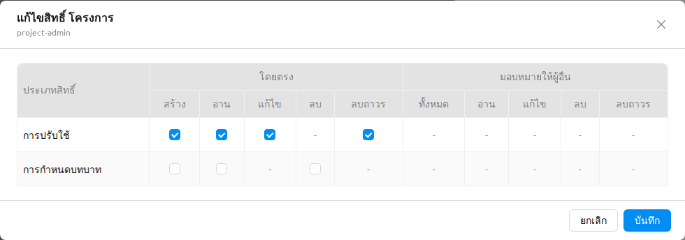

:::note
การแก้ไขสิทธิ์เป็นการดำเนินการที่**ย้อนกลับได้** — คุณสามารถเปิดโมดอลอีกครั้งและเปลี่ยนกริดได้ตลอดเวลา — ดังนั้นการบันทึกจึงใช้ปุ่ม **บันทึก** ปกติแทนการยืนยันด้วยการพิมพ์ชื่อ
:::

### แก้ไขสิทธิ์สำหรับหลายขอบเขต (เป็นชุด)

คุณสามารถใช้การเปลี่ยนแปลงสิทธิ์เดียวกันกับหลายขอบเขตที่เป็นประเภทเดียวกันพร้อมกันได้

1. ในการ์ดประเภทขอบเขต ใช้ช่องทำเครื่องหมายแถวเพื่อเลือกขอบเขต**ตั้งแต่สองรายการขึ้นไป** ป้ายแสดงจำนวนที่เลือกจะปรากฏขึ้น ใช้ตัวควบคุมดินสอ (**แก้ไขสิทธิ์**) ถัดจากป้ายนั้นเพื่อเปิดโมดอลแบบชุด
2. โมดอล **แก้ไขสิทธิ์ {ประเภทขอบเขต} เป็นชุด** จะเปิดขึ้น ทุกเซลล์จะเริ่มต้นในสถานะ **คงค่าเดิม** เซลล์ที่ไม่ได้แตะจะคงค่าปัจจุบันของแต่ละขอบเขตที่เลือกไว้ และเฉพาะเซลล์ที่คุณสลับเป็นโหมดแก้ไขเท่านั้นที่จะถูกนำไปใช้กับ**ทุก**ขอบเขตที่เลือก
3. คลิกเซลล์เพื่อสลับเป็นโหมดแก้ไข (เริ่มต้นในสถานะเลือกไว้) เลือกหรือยกเลิกการเลือกเพื่อกำหนดค่าที่จะนำไปใช้กับทุกขอบเขตที่เลือก
4. คลิก **บันทึก** เพื่อใช้การเปลี่ยนแปลงกับทุกขอบเขตที่เลือก

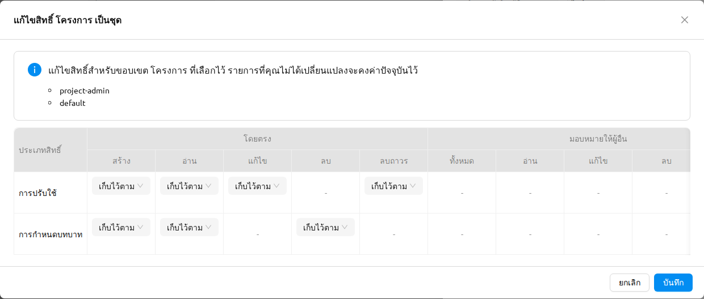

### พฤติกรรมกรณีไม่มีการเปลี่ยนแปลงและกรณีล้มเหลวบางส่วน

เมื่อคุณบันทึกการเปลี่ยนแปลงสิทธิ์:

- หากไม่มีการเปลี่ยนแปลง โมดอลจะปิดโดยไม่ส่งคำขอ และแสดงข้อความ **ไม่มีการเปลี่ยนแปลง.**
- เมื่อสำเร็จ จะแสดงข้อความ **บันทึกสิทธิ์สำเร็จแล้ว** และแท็กของการ์ดจะถูกคำนวณใหม่
- ในกรณี**ล้มเหลวบางส่วน** โมดอลจะยังคงเปิดอยู่โดยมีการทำเครื่องหมายเซลล์ที่ล้มเหลว โมดอลข้อผิดพลาดแบบชุดจะแสดงคำขอที่ล้มเหลวแต่ละรายการ — ขอบเขตเป้าหมาย, สิทธิ์, และข้อความแสดงข้อผิดพลาด — พร้อมจำนวนที่สำเร็จและล้มเหลว คุณสามารถปรับกริดและบันทึกอีกครั้งเพื่อลองใหม่เฉพาะเซลล์ที่ล้มเหลว

<!--  -->
<!-- TODO: Capture the bulk-error modal shown after a partial-failure permission save -->

## การจัดการการมอบหมายผู้ใช้

แท็บ **การมอบหมายบทบาท** ในแผงรายละเอียดบทบาทจะแสดงผู้ใช้ที่ถูกมอบหมายให้กับบทบาท

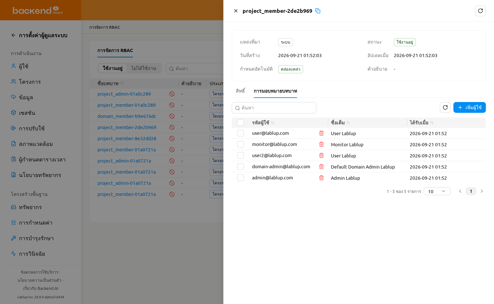

### การเพิ่มผู้ใช้ในบทบาท

1. เปิดแผงรายละเอียดบทบาทและเลือกแท็บ **การมอบหมายบทบาท**
2. คลิกปุ่ม **เพิ่มผู้ใช้**
3. ในโมดอล ค้นหาผู้ใช้ตามอีเมลหรือชื่อ
4. เลือกผู้ใช้หนึ่งคนขึ้นไปโดยใช้ช่องทำเครื่องหมาย
5. คลิก **มอบหมาย** เพื่อมอบหมายผู้ใช้ที่เลือกให้กับบทบาท

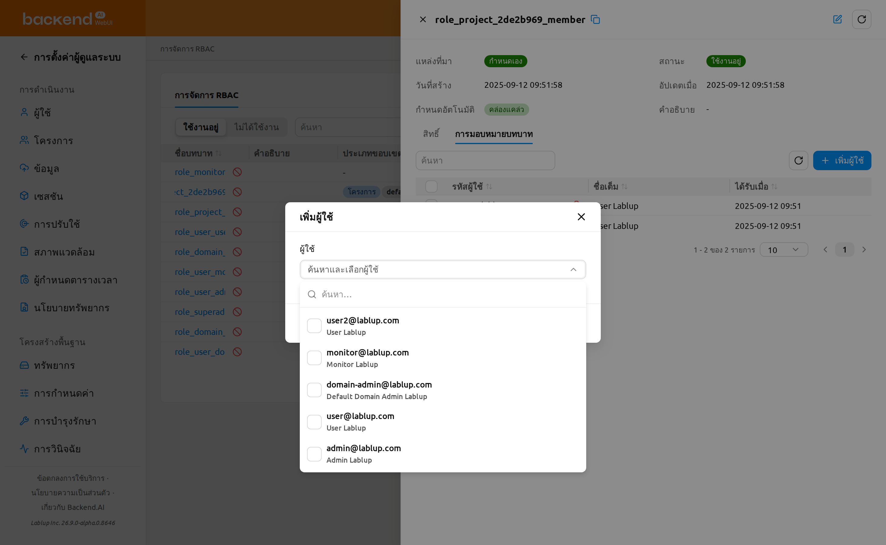

การเพิ่มผู้ใช้เป็นการดำเนินการแบบกลุ่ม คุณสามารถเลือกผู้ใช้หลายคนในครั้งเดียวและมอบหมายทั้งหมดพร้อมกันได้ หากการมอบหมายบางรายการล้มเหลว โมดอลจะยังคงเปิดอยู่ และโมดอลข้อผิดพลาดแบบชุดจะแสดงผู้ใช้ที่ล้มเหลวแต่ละรายพร้อมข้อความแสดงข้อผิดพลาดและจำนวนที่สำเร็จและล้มเหลว ผู้ใช้ที่ถูกมอบหมายสำเร็จจะถูกล้างออกจากการเลือก ดังนั้นจึงเหลือเฉพาะผู้ใช้ที่ล้มเหลวที่ถูกเลือกไว้ และคุณสามารถคลิก **เพิ่มผู้ใช้** อีกครั้งเพื่อลองใหม่เฉพาะผู้ใช้เหล่านั้น

<!--  -->
<!-- TODO: Capture the Add User modal with the bulk-error modal listing failed assignments -->

### บทบาทระบบและข้อจำกัดในการมอบหมาย

บทบาทผู้ดูแลโปรเจกต์ที่ระบบสร้างขึ้น (บทบาท `role_project_<project_id>_admin` ที่มี**แหล่งที่มา**เป็น**ระบบ**) ไม่สามารถมอบหมายหรือเพิกถอนผู้ใช้ได้โดยตรงจากแท็บการมอบหมายบทบาท แท็บนี้จะแสดงการแจ้งเตือน **บทบาทที่ระบบสร้างขึ้นโดยอัตโนมัติไม่สามารถมอบหมายหรือนำผู้ใช้ออกได้โดยตรง** และตารางการมอบหมายจะเป็นแบบอ่านอย่างเดียว (ตัวควบคุม **เพิ่มผู้ใช้** และการเพิกถอนจะถูกซ่อนไว้)

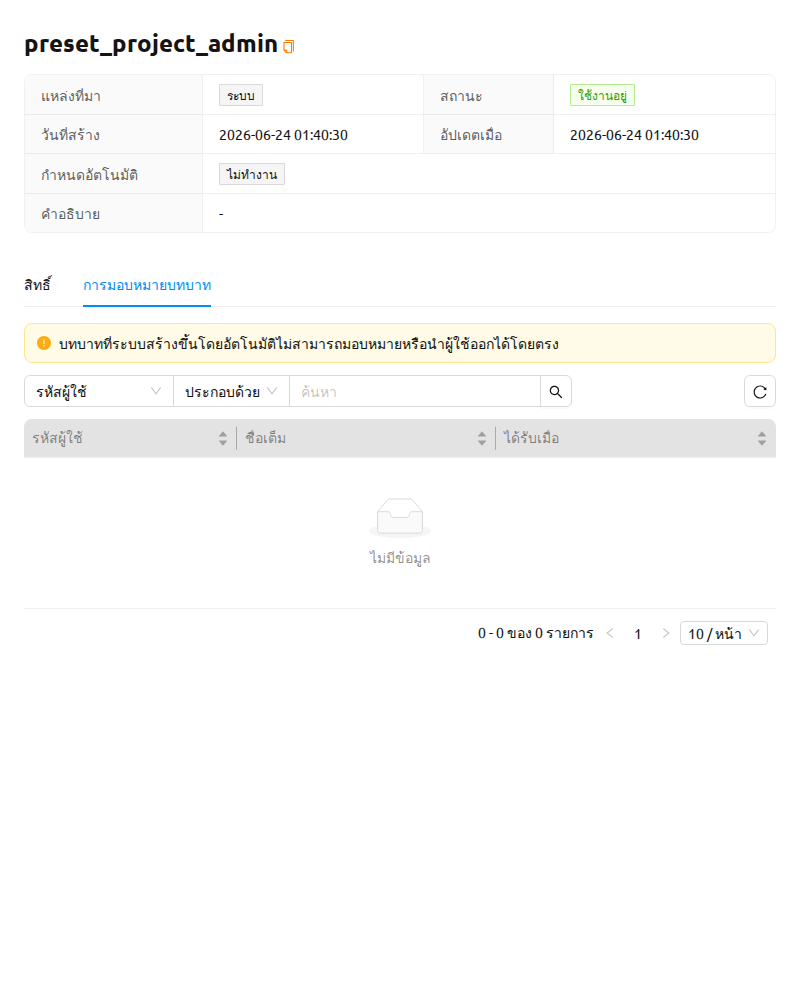

หากต้องการจัดการผู้ที่ดูแลโปรเจกต์ ให้ใช้ **ตั้งค่าผู้ดูแลโปรเจกต์** บนหน้าโปรเจกต์แทน ดูที่[ตั้งค่าผู้ดูแลโปรเจกต์](#set-project-admin)ในบทฟีเจอร์สำหรับผู้ดูแลโปรเจกต์ และ[การมอบสิทธิ์ผู้ดูแลโปรเจกต์](#grant-project-admin)ด้านล่าง

### การเพิกถอนผู้ใช้จากบทบาท

คุณสามารถเพิกถอนผู้ใช้คนเดียวหรือหลายคนพร้อมกันได้

ในการเพิกถอนผู้ใช้คนเดียว:

1. ในแท็บ **การมอบหมายบทบาท** วางเมาส์เหนือแถวผู้ใช้แล้วคลิกไอคอนเพิกถอน (ถังขยะ) ถัดจากผู้ใช้
2. โมดอลยืนยัน **นำผู้ใช้ออกจากบทบาท** จะเปิดขึ้น ตรวจสอบผู้ใช้ที่แสดงในรายการ จากนั้นคลิก **นำผู้ใช้ออกจากบทบาท** เพื่อยืนยัน หรือ **ยกเลิก** เพื่อปิด

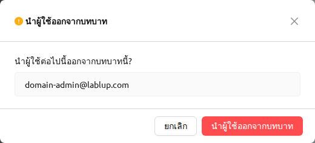

ในการเพิกถอนผู้ใช้หลายคนพร้อมกัน:

1. ในแท็บ **การมอบหมายบทบาท** ใช้ช่องทำเครื่องหมายเพื่อเลือกผู้ใช้ที่ต้องการนำออก ป้ายแสดงจำนวนที่เลือกจะปรากฏถัดจากตัวควบคุมการเพิกถอน โดยแสดงจำนวนแถวที่เลือกไว้ ใช้ตัวควบคุมล้างการเลือกบนป้ายนั้นเพื่อยกเลิกการเลือกทุกแถว
2. คลิกปุ่ม **นำผู้ใช้ออกจากบทบาท** แบบกลุ่ม (ไอคอนถังขยะ) ที่ปรากฏขึ้นเมื่อมีการเลือกหนึ่งแถวขึ้นไป
3. ในโมดอลยืนยัน **นำผู้ใช้ออกจากบทบาท** ตรวจสอบผู้ใช้ที่แสดงในรายการ จากนั้นคลิก **นำผู้ใช้ออกจากบทบาท** เพื่อยืนยัน หรือ **ยกเลิก** เพื่อปิด

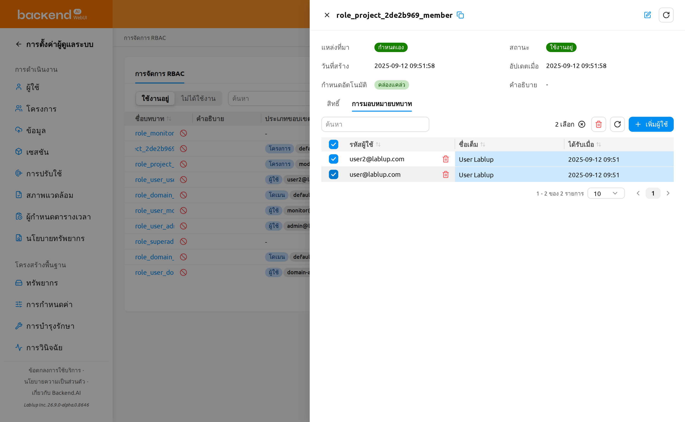

การเพิกถอนผู้ใช้จะลบเฉพาะการมอบหมายของผู้ใช้นั้นกับบทบาทนี้เท่านั้น บทบาทและการมอบหมายอื่น ๆ ยังคงไม่เปลี่ยนแปลง

:::note
การเพิกถอนการมอบหมายบทบาทสามารถยกเลิกได้โดยการเพิ่มผู้ใช้กลับเข้าสู่บทบาทจากแท็บ **การมอบหมายบทบาท**
:::

## การมอบสิทธิ์ผู้ดูแลโปรเจกต์

เมื่อสร้างโปรเจกต์ ระบบจะสร้างบทบาทเฉพาะชื่อ `role_project_<project_id>_admin` ขึ้นมาด้วย โดย `<project_id>` คือ 8 ตัวอักษรแรกของ UUID ของโปรเจกต์นั้น ผู้ใช้ที่ถูกมอบหมายให้กับบทบาทนี้จะได้รับสิทธิ์ [ผู้ดูแลโปรเจกต์](#project-admin-features) เหนือโปรเจกต์ดังกล่าวโดยเฉพาะ ผู้ใช้สามารถจัดการผู้ใช้ เซสชัน การปรับใช้ และโฟลเดอร์จัดเก็บของโปรเจกต์ได้โดยไม่ต้องมีสิทธิ์ผู้ดูแลระบบระดับสูงทั่วทั้งระบบ

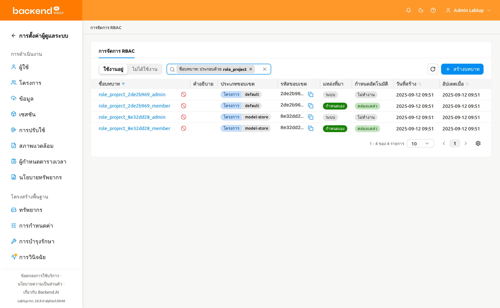

มอบและเพิกถอนสิทธิ์ผู้ดูแลโปรเจกต์ผ่านขั้นตอนคลิกเดียว **ตั้งค่าผู้ดูแลโปรเจกต์** บนหน้าผู้ดูแล**โปรเจกต์** ตามที่อธิบายไว้ใน[ตั้งค่าผู้ดูแลโปรเจกต์](#set-project-admin)ในบทฟีเจอร์สำหรับผู้ดูแลโปรเจกต์ บทบาท `role_project_<project_id>_admin` เป็นบทบาทระบบ ดังนั้นแท็บการมอบหมายบทบาทที่นี่จึงเป็นแบบ**อ่านอย่างเดียว**และมีไว้เพื่อการตรวจสอบ คุณยังสามารถเปิดบทบาทเพื่อดูว่าใครถือสิทธิ์ผู้ดูแลโปรเจกต์อยู่ในปัจจุบัน โมดอล **ตั้งค่าผู้ดูแลโปรเจกต์** ยังลิงก์กลับไปยังแผงรายละเอียดของบทบาทนี้ผ่านทางลัด RBAC ด้วย

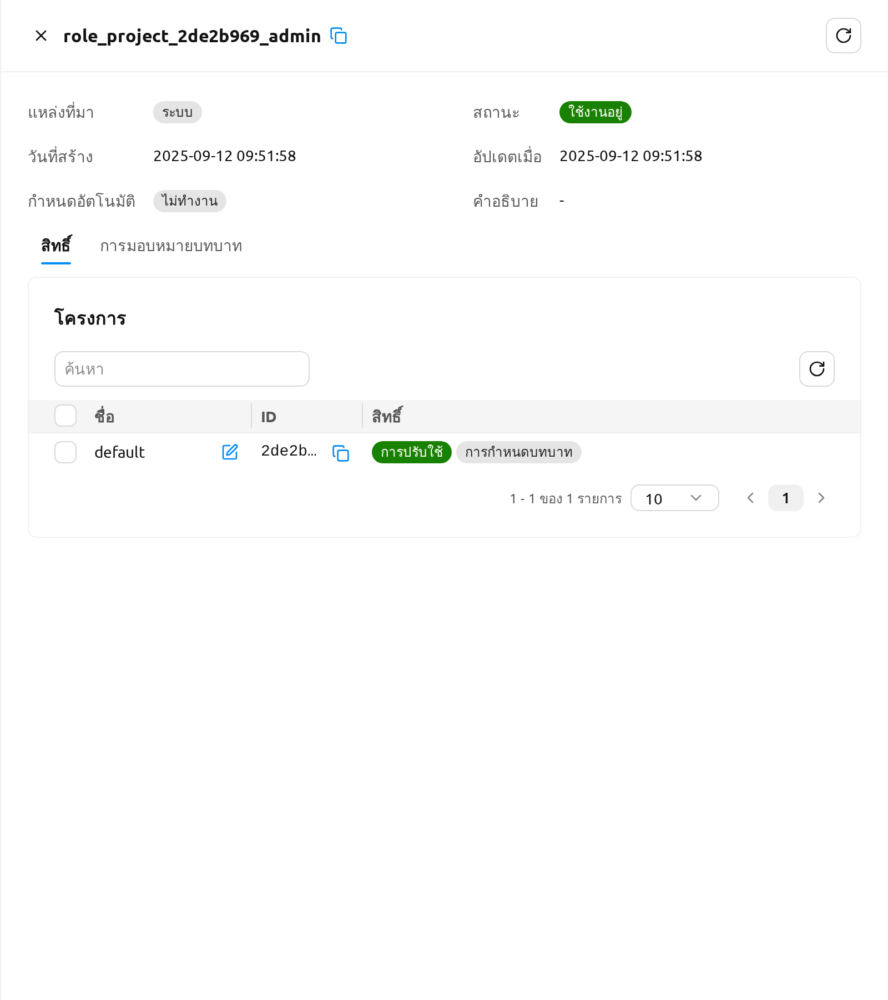

เมื่อมอบสิทธิ์แล้ว ผู้ใช้จะได้รับสิทธิ์ผู้ดูแลโปรเจกต์ทันที เมื่อผู้ใช้เปิดดรอปดาวน์โปรเจกต์ในส่วนหัวในครั้งถัดไป ผู้ใช้จะเห็นป้ายผู้ดูแลโปรเจกต์ถัดจากโปรเจกต์ที่เกี่ยวข้อง รวมถึงรายการแถบด้านข้างสำหรับผู้ดูแลโปรเจกต์ที่อธิบายไว้ในบท [ฟีเจอร์สำหรับผู้ดูแลโปรเจกต์](#project-admin-features)
