

# การจัดการ RBAC

การจัดการ RBAC (Role-Based Access Control) ช่วยให้ผู้ดูแลระบบระดับสูงสามารถกำหนดบทบาทที่มีสิทธิ์แบบละเอียดและมอบหมายให้กับผู้ใช้ได้ ด้วย RBAC คุณสามารถควบคุมการดำเนินการที่ผู้ใช้เฉพาะสามารถทำได้กับทรัพยากรต่าง ๆ ในระบบ Backend.AI

ในการเข้าถึงหน้าการจัดการ RBAC ให้คลิก **การจัดการ RBAC** ในส่วน **การตั้งค่าผู้ดูแลระบบ** ของเมนูแถบด้านข้าง

หน้านี้มีสองแท็บ: **บทบาท** และ **พรีเซ็ต**

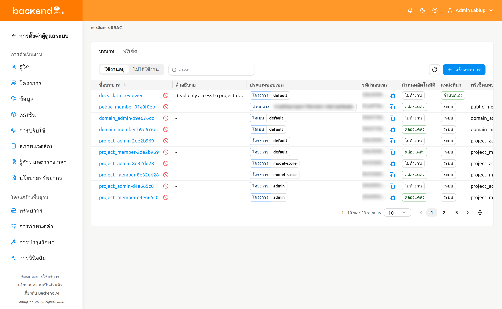

## รายการบทบาท

หน้ารายการบทบาทแสดงบทบาททั้งหมดในรูปแบบตาราง คุณสามารถกรอง ค้นหา และเรียงลำดับบทบาทโดยใช้ตัวควบคุมที่ด้านบนของหน้า

- **ตัวกรองสถานะ**: ตัวควบคุมแบบแบ่งส่วนสำหรับสลับระหว่างบทบาท**ใช้งานอยู่**และ**ไม่ได้ใช้งาน** โดยค่าเริ่มต้นจะเลือกใช้งานอยู่
- **ตัวกรองคุณสมบัติ**: ตัวกรองคุณสมบัติสำหรับจำกัดรายการ ช่องป้อนค่าของตัวกรองจะปรับเปลี่ยนตามคุณสมบัติที่เลือก มีคุณสมบัติต่อไปนี้ให้ใช้:
   * **ชื่อ**: ข้อความแบบอิสระสำหรับค้นหาตามชื่อบทบาท
   * **แหล่งที่มา**: แสดงค่าที่ใช้ได้ (**ระบบ** / **กำหนดเอง**) ในรูปแบบตัวเลือกแทนช่องข้อความแบบอิสระ
   * **ผู้ใช้ที่ถูกมอบหมาย**: ตัวเลือกผู้ใช้ที่กรองรายการให้เหลือเฉพาะบทบาทที่มอบหมายให้กับผู้ใช้ที่เลือก อีเมลของผู้ใช้จะแสดงบนแท็กเงื่อนไขที่สร้างขึ้น
   * **ประเภทขอบเขต**: ตัวเลือกที่แสดงประเภทขอบเขตของ RBAC (เช่น โดเมน, โปรเจกต์, หรือผู้ใช้)
   * **รหัสขอบเขต**: กรองรายการด้วย UUID ขอบเขตที่ตรงกันทุกตัวอักษร
- **สร้างบทบาท**: ปุ่มสำหรับสร้างบทบาทแบบกำหนดเองใหม่

ตารางแสดงคอลัมน์ต่อไปนี้:

- **ชื่อบทบาท**: ชื่อของบทบาท คลิกชื่อเพื่อเปิดแผงรายละเอียดบทบาท
- **คำอธิบาย**: คำอธิบายสั้น ๆ เกี่ยวกับวัตถุประสงค์ของบทบาท
- **ประเภทขอบเขต**: ประเภทของขอบเขตที่กำหนดให้กับบทบาท แสดงพร้อมกับชื่อขอบเขต
- **รหัสขอบเขต**: ID ดั้งเดิมของขอบเขตที่กำหนดให้กับบทบาท
- **แหล่งที่มา**: ระบุว่าบทบาทเป็น**ระบบ** (กำหนดไว้ล่วงหน้า) หรือ**กำหนดเอง** (สร้างโดยผู้ใช้)
- **มอบหมายอัตโนมัติ**: ระบุว่าบทบาทถูกมอบหมายให้กับผู้ใช้โดยอัตโนมัติเมื่อมีการเพิ่มผู้ใช้เข้าสู่ขอบเขตที่บทบาทนั้นลงทะเบียนไว้หรือไม่ แสดง**ใช้งานอยู่**เมื่อเปิดใช้การมอบหมายอัตโนมัติ หรือ**ไม่ได้ใช้งาน**เมื่อปิดใช้
- **วันที่สร้าง**: วันที่และเวลาที่สร้างบทบาท
- **วันที่อัปเดต**: วันที่และเวลาที่แก้ไขบทบาทล่าสุด

### บทบาทระบบและบทบาทกำหนดเอง

บทบาทแบ่งออกเป็นสองประเภทแหล่งที่มา:

- **ระบบ**: บทบาทที่สร้างขึ้นโดยอัตโนมัติ ไม่สามารถแก้ไขชื่อ คำอธิบาย หรือสิทธิ์ได้ แต่สามารถจัดการการมอบหมายผู้ใช้ได้
- **กำหนดเอง**: บทบาทที่สร้างโดยผู้ดูแลระบบระดับสูง สามารถแก้ไขชื่อ คำอธิบาย การมอบหมายผู้ใช้ และสิทธิ์ได้ทั้งหมด

## การสร้างบทบาท

ในการสร้างบทบาท คุณต้องกำหนด**ขอบเขต**ล่วงหน้า ขอบเขตจะผูกบทบาทเข้ากับเอนทิตีทรัพยากรที่ระบุ (เช่น โดเมน โปรเจกต์ หรือผู้ใช้) เพื่อให้สิทธิ์ทุกข้อที่เพิ่มในภายหลังถูกจำกัดให้อยู่ภายในขอบเขตที่กำหนดไว้ที่นี่เท่านั้น บทบาทหนึ่งกำหนดขอบเขตได้เพียงหนึ่งรายการ

ในการสร้างบทบาทแบบกำหนดเองใหม่:

1. คลิกปุ่ม **สร้างบทบาท** ที่มุมขวาบนของหน้ารายการบทบาท
2. ในโมดอลการสร้าง ให้กรอกฟิลด์ต่อไปนี้:
   - **ชื่อบทบาท** (จำเป็น): ป้อนชื่อบทบาทที่ไม่ซ้ำกัน
   - **คำอธิบาย** (ไม่บังคับ): ป้อนคำอธิบายเกี่ยวกับวัตถุประสงค์ของบทบาท
   - **มอบหมายอัตโนมัติ** (ไม่บังคับ): เมื่อเปิดใช้งาน บทบาทจะถูกมอบหมายให้กับผู้ใช้โดยอัตโนมัติเมื่อมีการเพิ่มผู้ใช้เข้าสู่ขอบเขตที่บทบาทนั้นลงทะเบียนไว้ ปิดใช้งานโดยค่าเริ่มต้น
   - **ประเภทขอบเขต** (จำเป็น): เลือกประเภทขอบเขตที่บทบาทจะมีผล (เช่น โดเมน, โปรเจกต์, หรือผู้ใช้)
   - **เป้าหมาย** (จำเป็น): เลือกเป้าหมายเฉพาะภายในประเภทขอบเขตนั้น บทบาทหนึ่งจะผูกกับขอบเขตเพียงหนึ่งรายการเท่านั้น
3. คลิก **ตกลง** เพื่อสร้างบทบาท

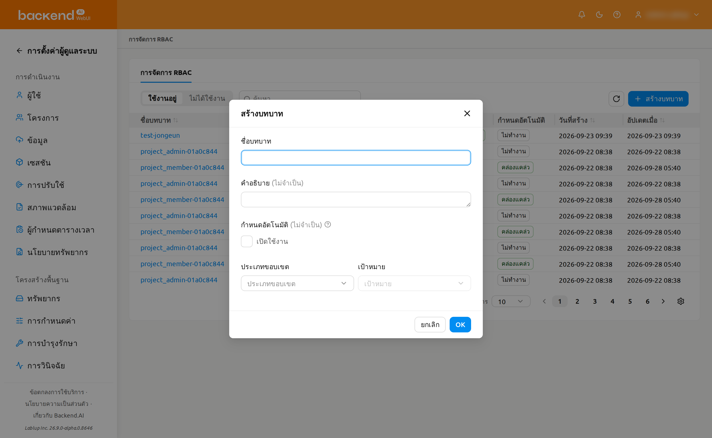

:::info
**ประเภทขอบเขต**และ**เป้าหมาย**ที่คุณกำหนดเมื่อสร้างบทบาทจะไม่ให้สิทธิ์ใด ๆ ด้วยตัวมันเอง แต่จะกำหนดล่วงหน้าว่า**ประเภทขอบเขต / เป้าหมาย**ใดที่สามารถใช้ได้เมื่อคุณเพิ่ม[สิทธิ์](#manage-permissions)ให้กับบทบาทนี้ในภายหลัง กล่าวคือ ขั้นตอนการสร้างบทบาทเป็นเพียงการจำกัดประเภทขอบเขตและเป้าหมายที่สิทธิ์ของบทบาทนี้สามารถใช้ได้ไว้ล่วงหน้า และสิทธิ์แต่ละข้อจะตั้งค่าได้เฉพาะภายในประเภทขอบเขตและเป้าหมายที่กำหนดไว้ที่นี่เท่านั้น
:::

:::warning
ขอบเขตถูกกำหนดในเวลาสร้างบทบาท และไม่สามารถแก้ไขได้ในภายหลังผ่านแผงรายละเอียดบทบาท โปรดวางแผนขอบเขตอย่างรอบคอบก่อนสร้างบทบาท
:::

## ดูรายละเอียดบทบาท

ในการดูข้อมูลรายละเอียดของบทบาท ให้คลิกชื่อบทบาทในตาราง แผงรายละเอียดจะเปิดขึ้นทางด้านขวาของหน้า

ส่วนหัวของแผงจะแสดงชื่อบทบาทและมีปุ่ม**แก้ไข**สำหรับบทบาทแบบกำหนดเอง ส่วนรายละเอียดจะแสดงข้อมูลเมตาต่อไปนี้:

- **แหล่งที่มา**: ระบบ หรือ กำหนดเอง
- **สถานะ**: ใช้งานอยู่ หรือ ไม่ได้ใช้งาน
- **ประเภทขอบเขต / เป้าหมาย**: ขอบเขตที่บทบาทสังกัดอยู่ บทบาทหนึ่งสังกัดขอบเขตเพียงขอบเขตเดียวเท่านั้น
- **มอบหมายอัตโนมัติ**: ระบุว่าการมอบหมายอัตโนมัตินั้นใช้งานอยู่หรือไม่ได้ใช้งาน เมื่อใช้งานอยู่ บทบาทจะถูกมอบหมายให้กับผู้ใช้ที่เพิ่มเข้าสู่ขอบเขตที่ลงทะเบียนไว้แห่งใดแห่งหนึ่งโดยอัตโนมัติ
- **วันที่สร้าง**: เวลาที่สร้าง
- **วันที่อัปเดต**: เวลาที่แก้ไขล่าสุด

ด้านล่างข้อมูลเมตามีสองแท็บ: **สิทธิ์** และ **การมอบหมายบทบาท** โดยค่าเริ่มต้นจะเลือกแท็บ **สิทธิ์**

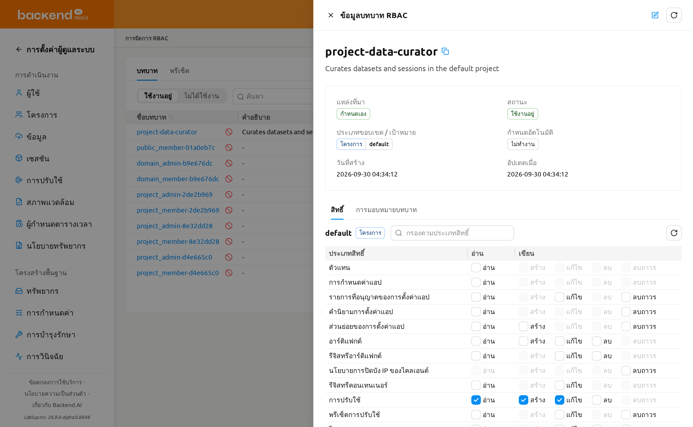

### การแก้ไขบทบาท

ในการแก้ไขชื่อ คำอธิบาย หรือการตั้งค่าการมอบหมายอัตโนมัติของบทบาทแบบกำหนดเอง:

1. คลิกชื่อบทบาทในตารางเพื่อเปิดแผงรายละเอียด
2. คลิกปุ่ม**แก้ไข** (ไอคอนดินสอ) ในส่วนหัวของแผง
3. แก้ไขฟิลด์ต่อไปนี้ในโมดอลแก้ไข:
   - **ชื่อบทบาท**: ชื่อของบทบาท
   - **คำอธิบาย**: คำอธิบายเกี่ยวกับวัตถุประสงค์ของบทบาท
   - **มอบหมายอัตโนมัติ**: เมื่อเปิดใช้งาน บทบาทจะถูกมอบหมายให้กับผู้ใช้ที่เพิ่มเข้าสู่ขอบเขตที่บทบาทนั้นลงทะเบียนไว้โดยอัตโนมัติ
4. คลิก **ตกลง** เพื่อบันทึกการเปลี่ยนแปลง

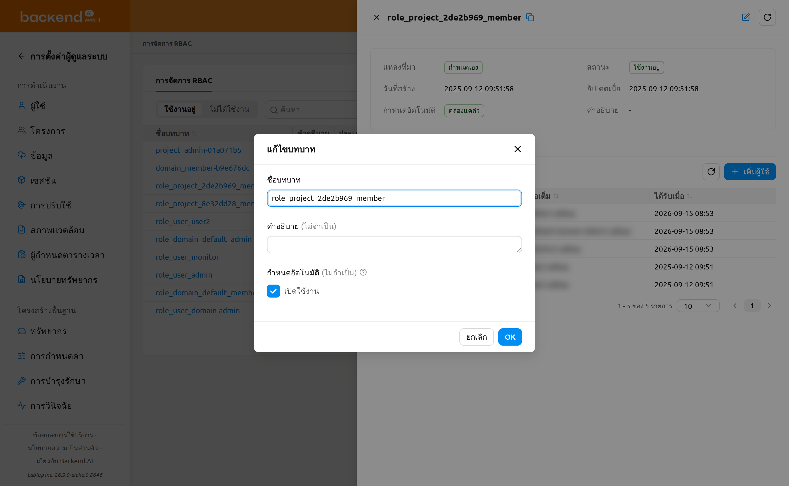

:::note
ปุ่มแก้ไขใช้ได้เฉพาะกับบทบาทแบบกำหนดเองเท่านั้น ไม่สามารถแก้ไขชื่อหรือคำอธิบายของบทบาทระบบได้ และไม่สามารถแก้ไขขอบเขตหลังจากที่สร้างบทบาทแล้วในทั้งสองกรณี
:::

## การจัดการสิทธิ์

แท็บ **สิทธิ์** ในแผงรายละเอียดบทบาทจะแสดงประเภทสิทธิ์ที่ใช้ได้ในขอบเขตของบทบาทแถวละหนึ่งประเภท ช่องทำเครื่องหมายในแต่ละแถวจัดกลุ่มไว้ภายใต้ **อ่าน** และ **เขียน** โดย **เขียน** ครอบคลุมการสร้าง การแก้ไข การลบ และการลบถาวร

ในการเปลี่ยนสิทธิ์ของบทบาท ให้เลือกหรือยกเลิกการเลือกช่องทำเครื่องหมาย แล้วคลิก **บันทึก**

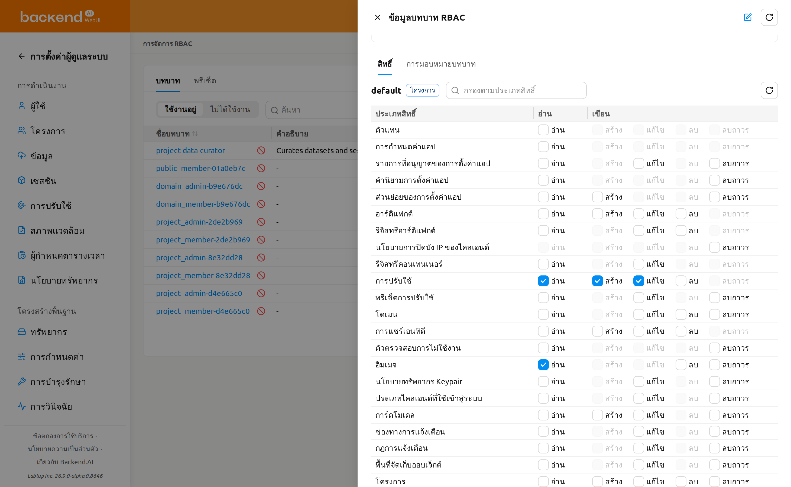

สิทธิ์ของบทบาทระบบเป็นแบบอ่านอย่างเดียวในแท็บนี้ สิทธิ์เหล่านี้เป็นไปตาม[พรีเซ็ตบทบาท](#role-presets)ที่ใช้สร้างบทบาทนั้น คลิก **ดูพรีเซ็ต** เพื่อเปิดพรีเซ็ต

:::info
การรวม **ประเภทขอบเขต / เป้าหมาย** ของแต่ละสิทธิ์ได้รับการสืบทอดมาจากขอบเขตของบทบาท คุณสามารถมอบสิทธิ์ได้เฉพาะบนขอบเขตที่กำหนดไว้เมื่อสร้างบทบาทเท่านั้น หากต้องการขยายการเข้าถึงของบทบาท ให้สร้างบทบาทอีกบทบาทหนึ่งพร้อมกับขอบเขตที่ต้องการ
:::

### ตัวอย่างการตั้งค่าสิทธิ์

ต่อไปนี้คือตัวอย่างการตั้งค่าสิทธิ์ทั่วไป คอลัมน์ **ประเภทขอบเขต / เป้าหมาย** แสดงขอบเขตระดับบทบาทที่สิทธิ์นำมาใช้ซ้ำ

| สถานการณ์ | ประเภทขอบเขต / เป้าหมาย | ประเภทสิทธิ์ | สิทธิ์ |
|----------|------------------------|------------|-------|
| อนุญาตให้สร้างโฟลเดอร์จัดเก็บในโปรเจกต์เฉพาะ | โปรเจกต์ / my-project | โฟลเดอร์ | สร้าง |
| อนุญาตให้ดูเซสชันทั้งหมดในโดเมนที่ระบุ | โดเมน / default | เซสชัน | อ่าน |
| อนุญาตให้จัดการการปรับใช้ในโดเมนที่ระบุ | โดเมน / default | การปรับใช้ | สร้าง, อ่าน, แก้ไข |
| อนุญาตให้ลบคอนเทนเนอร์อิมเมจในโดเมนที่ระบุ | โดเมน / default | อิมเมจ | ลบ |

## พรีเซ็ตบทบาท

แท็บ **พรีเซ็ต** จะแสดงรายการพรีเซ็ตบทบาทที่ใช้สร้างบทบาทระบบ

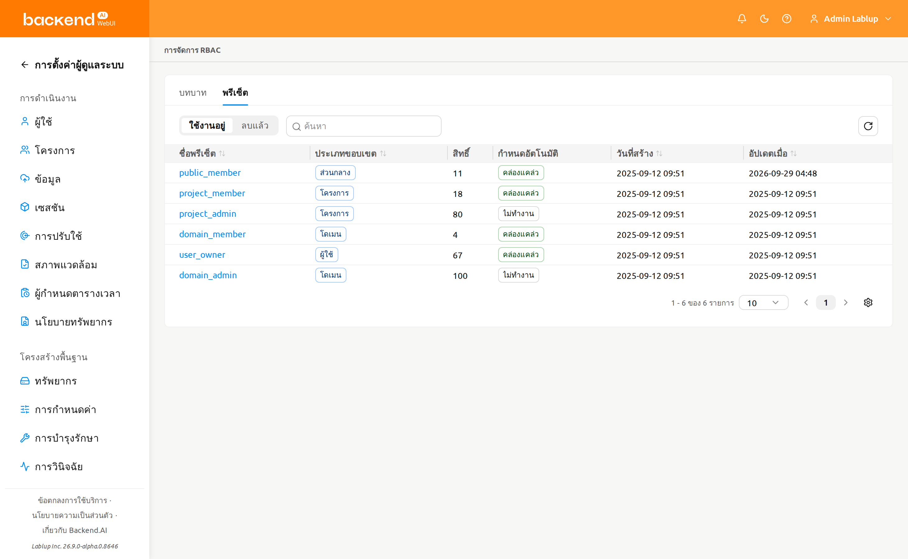

ในการแก้ไขสิทธิ์ของพรีเซ็ต ให้คลิกชื่อพรีเซ็ตเพื่อเปิดแผงรายละเอียด เลือกหรือยกเลิกการเลือกช่องทำเครื่องหมายในกริด **อ่าน** / **เขียน** แล้วคลิก **บันทึก**

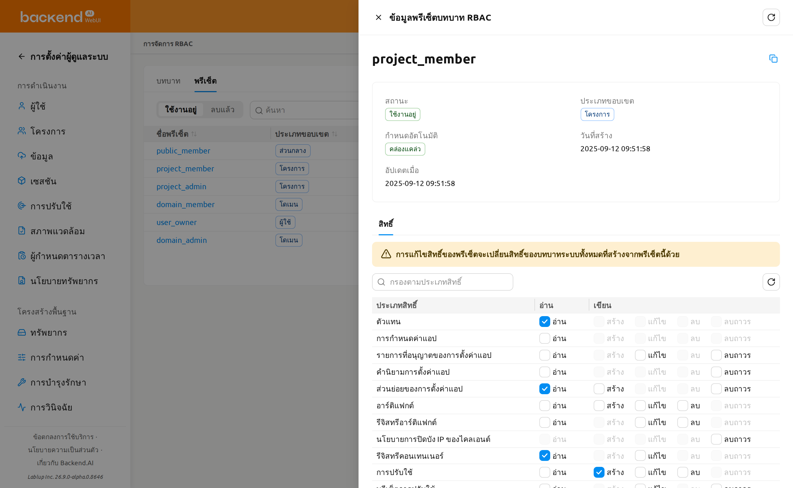

:::warning
การแก้ไขสิทธิ์ของพรีเซ็ตจะเปลี่ยนสิทธิ์ของบทบาทระบบทั้งหมดที่สร้างจากพรีเซ็ตนี้ด้วย
:::

## การจัดการการมอบหมายผู้ใช้

แท็บ **การมอบหมายบทบาท** ในแผงรายละเอียดบทบาทจะแสดงผู้ใช้ที่ถูกมอบหมายให้กับบทบาท

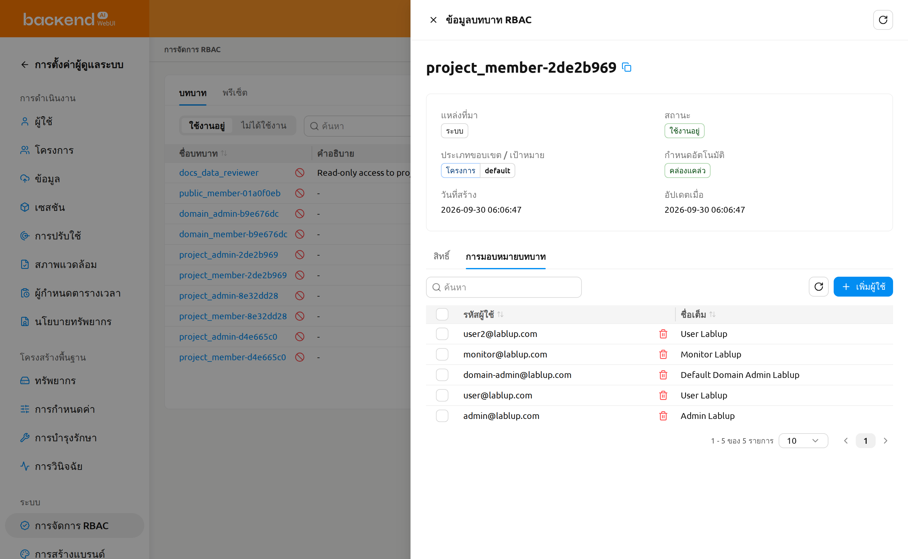

### การเพิ่มผู้ใช้ในบทบาท

1. เปิดแผงรายละเอียดบทบาทและเลือกแท็บ **การมอบหมายบทบาท**
2. คลิกปุ่ม **เพิ่มผู้ใช้**
3. ในโมดอล ค้นหาผู้ใช้ตามอีเมลหรือชื่อ
4. เลือกผู้ใช้หนึ่งคนขึ้นไปโดยใช้ช่องทำเครื่องหมาย
5. คลิก **มอบหมาย** เพื่อมอบหมายผู้ใช้ที่เลือกให้กับบทบาท

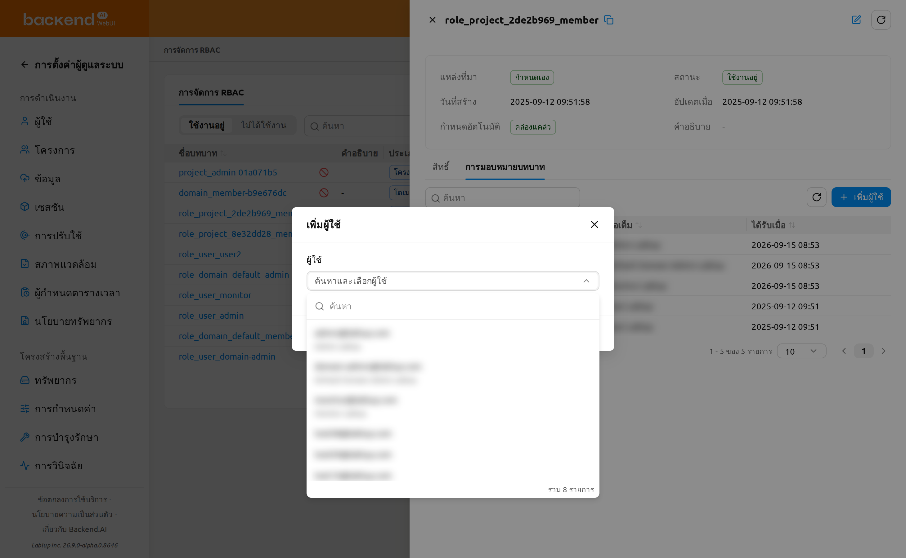

การเพิ่มผู้ใช้เป็นการดำเนินการแบบกลุ่ม คุณสามารถเลือกผู้ใช้หลายคนในครั้งเดียวและมอบหมายทั้งหมดพร้อมกันได้ หากการมอบหมายบางรายการล้มเหลว โมดอลจะยังคงเปิดอยู่ และโมดอลข้อผิดพลาดแบบชุดจะแสดงผู้ใช้ที่ล้มเหลวแต่ละรายพร้อมข้อความแสดงข้อผิดพลาดและจำนวนที่สำเร็จและล้มเหลว ผู้ใช้ที่ถูกมอบหมายสำเร็จจะถูกล้างออกจากการเลือก ดังนั้นจึงเหลือเฉพาะผู้ใช้ที่ล้มเหลวที่ถูกเลือกไว้ และคุณสามารถคลิก **เพิ่มผู้ใช้** อีกครั้งเพื่อลองใหม่เฉพาะผู้ใช้เหล่านั้น

<!--  -->
<!-- TODO: Capture the Add User modal with the bulk-error modal listing failed assignments -->

### บทบาทระบบและข้อจำกัดในการมอบหมาย

บทบาทผู้ดูแลโปรเจกต์ที่ระบบสร้างขึ้น (บทบาทที่มี**แหล่งที่มา**เป็น**ระบบ**) ไม่สามารถมอบหมายหรือเพิกถอนผู้ใช้ได้โดยตรงจากแท็บการมอบหมายบทบาท แท็บนี้จะแสดงการแจ้งเตือน **บทบาทที่ระบบสร้างขึ้นโดยอัตโนมัติไม่สามารถมอบหมายหรือนำผู้ใช้ออกได้โดยตรง** และตารางการมอบหมายจะเป็นแบบอ่านอย่างเดียว (ตัวควบคุม **เพิ่มผู้ใช้** และการเพิกถอนจะถูกซ่อนไว้)

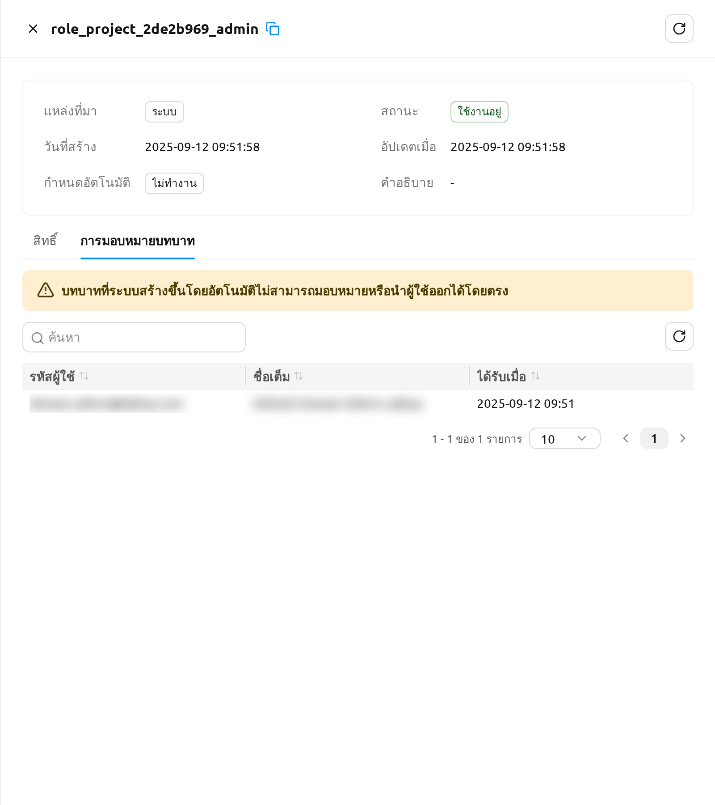

หากต้องการจัดการผู้ที่ดูแลโปรเจกต์ ให้ใช้ **ตั้งค่าผู้ดูแลโปรเจกต์** บนหน้าโปรเจกต์แทน ดูที่[ตั้งค่าผู้ดูแลโปรเจกต์](#set-project-admin)ในบทฟีเจอร์สำหรับผู้ดูแลโปรเจกต์ และ[การมอบสิทธิ์ผู้ดูแลโปรเจกต์](#grant-project-admin)ด้านล่าง

### การเพิกถอนผู้ใช้จากบทบาท

คุณสามารถเพิกถอนผู้ใช้คนเดียวหรือหลายคนพร้อมกันได้

ในการเพิกถอนผู้ใช้คนเดียว:

1. ในแท็บ **การมอบหมายบทบาท** วางเมาส์เหนือแถวผู้ใช้แล้วคลิกไอคอนเพิกถอน (ถังขยะ) ถัดจากผู้ใช้
2. โมดอลยืนยัน **นำผู้ใช้ออกจากบทบาท** จะเปิดขึ้น ตรวจสอบผู้ใช้ที่แสดงในรายการ จากนั้นคลิก **นำผู้ใช้ออกจากบทบาท** เพื่อยืนยัน หรือ **ยกเลิก** เพื่อปิด

ในการเพิกถอนผู้ใช้หลายคนพร้อมกัน:

1. ในแท็บ **การมอบหมายบทบาท** ใช้ช่องทำเครื่องหมายเพื่อเลือกผู้ใช้ที่ต้องการนำออก ป้ายแสดงจำนวนที่เลือกจะปรากฏถัดจากตัวควบคุมการเพิกถอน โดยแสดงจำนวนแถวที่เลือกไว้ ใช้ตัวควบคุมล้างการเลือกบนป้ายนั้นเพื่อยกเลิกการเลือกทุกแถว
2. คลิกปุ่ม **นำผู้ใช้ออกจากบทบาท** แบบกลุ่ม (ไอคอนถังขยะ) ที่ปรากฏขึ้นเมื่อมีการเลือกหนึ่งแถวขึ้นไป
3. ในโมดอลยืนยัน **นำผู้ใช้ออกจากบทบาท** ตรวจสอบผู้ใช้ที่แสดงในรายการ จากนั้นคลิก **นำผู้ใช้ออกจากบทบาท** เพื่อยืนยัน หรือ **ยกเลิก** เพื่อปิด

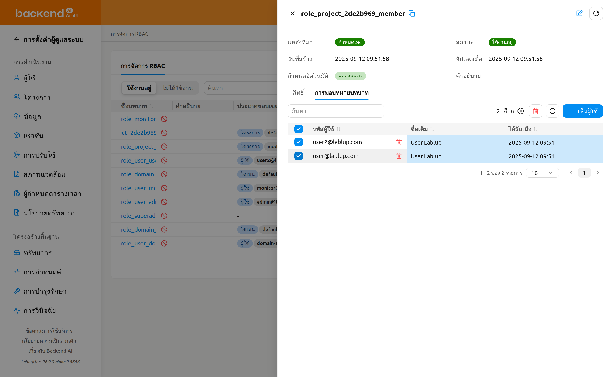

การเพิกถอนผู้ใช้จะลบเฉพาะการมอบหมายของผู้ใช้นั้นกับบทบาทนี้เท่านั้น บทบาทและการมอบหมายอื่น ๆ ยังคงไม่เปลี่ยนแปลง

:::note
การเพิกถอนการมอบหมายบทบาทสามารถยกเลิกได้โดยการเพิ่มผู้ใช้กลับเข้าสู่บทบาทจากแท็บ **การมอบหมายบทบาท**
:::

## การมอบสิทธิ์ผู้ดูแลโปรเจกต์

เมื่อสร้างโปรเจกต์ ระบบจะสร้างบทบาทผู้ดูแลโปรเจกต์เฉพาะสำหรับโปรเจกต์นั้นขึ้นมาด้วย ผู้ใช้ที่ถูกมอบหมายให้กับบทบาทนี้จะได้รับสิทธิ์ [ผู้ดูแลโปรเจกต์](#project-admin-features) เหนือโปรเจกต์ดังกล่าวโดยเฉพาะ ผู้ใช้สามารถจัดการผู้ใช้ เซสชัน การปรับใช้ และโฟลเดอร์จัดเก็บของโปรเจกต์ได้โดยไม่ต้องมีสิทธิ์ผู้ดูแลระบบระดับสูงทั่วทั้งระบบ

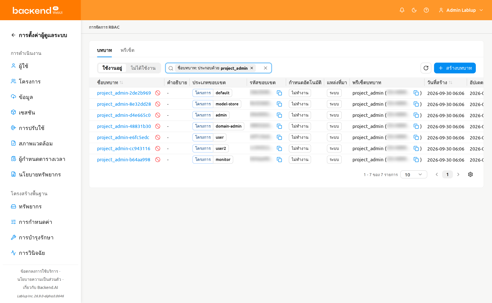

มอบและเพิกถอนสิทธิ์ผู้ดูแลโปรเจกต์ผ่านขั้นตอนคลิกเดียว **ตั้งค่าผู้ดูแลโปรเจกต์** บนหน้าผู้ดูแล**โปรเจกต์** ตามที่อธิบายไว้ใน[ตั้งค่าผู้ดูแลโปรเจกต์](#set-project-admin)ในบทฟีเจอร์สำหรับผู้ดูแลโปรเจกต์ บทบาทผู้ดูแลโปรเจกต์เป็นบทบาทระบบ ดังนั้นแท็บการมอบหมายบทบาทที่นี่จึงเป็นแบบ**อ่านอย่างเดียว**และมีไว้เพื่อการตรวจสอบ คุณยังสามารถเปิดบทบาทเพื่อดูว่าใครถือสิทธิ์ผู้ดูแลโปรเจกต์อยู่ในปัจจุบัน โมดอล **ตั้งค่าผู้ดูแลโปรเจกต์** ยังลิงก์กลับไปยังแผงรายละเอียดของบทบาทนี้ผ่านทางลัด RBAC ด้วย

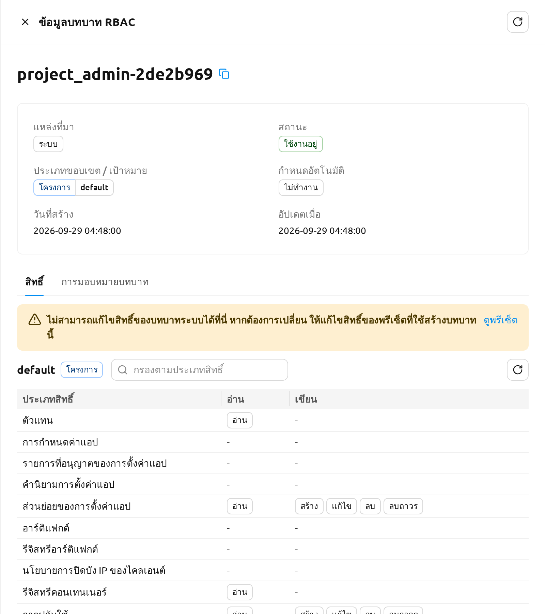

เมื่อมอบสิทธิ์แล้ว ผู้ใช้จะได้รับสิทธิ์ผู้ดูแลโปรเจกต์ทันที เมื่อผู้ใช้เปิดดรอปดาวน์โปรเจกต์ในส่วนหัวในครั้งถัดไป ผู้ใช้จะเห็นป้ายผู้ดูแลโปรเจกต์ถัดจากโปรเจกต์ที่เกี่ยวข้อง รวมถึงรายการแถบด้านข้างสำหรับผู้ดูแลโปรเจกต์ที่อธิบายไว้ในบท [ฟีเจอร์สำหรับผู้ดูแลโปรเจกต์](#project-admin-features)
