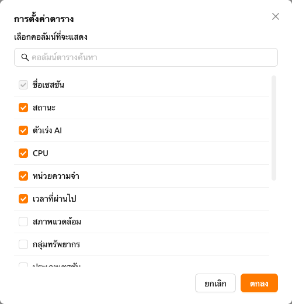

# หน้าเซสชัน

ใน Backend.AI `เซสชัน` หมายถึงสภาพแวดล้อมการประมวลผลแบบแยกส่วนที่ผู้ใช้สามารถรันโค้ด ฝึกโมเดล หรือวิเคราะห์ข้อมูลโดยใช้ทรัพยากรที่ได้รับการจัดสรร
แต่ละเซสชันถูกสร้างขึ้นตามการกำหนดค่าของผู้ใช้ เช่น อิมเมจรันไทม์ ขนาดทรัพยากร และการตั้งค่าสภาพแวดล้อม
เมื่อเซสชันเริ่มต้นแล้ว ผู้ใช้สามารถเข้าถึงแอปพลิเคชันแบบโต้ตอบ เทอร์มินัล และล็อก เพื่อจัดการและตรวจสอบเวิร์กโหลดได้อย่างมีประสิทธิภาพ

## แผงสรุปทรัพยากร

ที่ด้านบนของหน้า "เซสชัน" จะมีแผงแสดงทรัพยากรการประมวลผลที่พร้อมใช้งาน เช่น CPU, RAM และ AI Accelerator
สามารถเลือกมุมมองแผงต่างๆ ได้ตามข้อมูลที่ต้องการ เช่น "My Total Resources Limit", "My Resources in Resource Group" และ "Total Resources in Resource Group" ใช้ปุ่ม "การตั้งค่า" เพื่อเปลี่ยนแผงที่แสดง

สำหรับข้อมูลเพิ่มเติมเกี่ยวกับแผงทรัพยากรและตัวชี้วัด โปรดดูที่หน้า[แดชบอร์ด](#dashboard)

## รายการเซสชัน

ส่วน "เซสชัน" จะแสดงรายการเซสชันการประมวลผลทั้งหมด ทั้งที่กำลังทำงานอยู่และที่เสร็จสิ้นแล้ว
สามารถกรองเซสชันตามประเภท ได้แก่ `ทั้งหมด`, `แบบโต้ตอบ`, `แบบแบตช์`, `การอนุมาน` หรือ `เซสชันอัปโหลด` และสลับระหว่างแท็บ `กำลังทำงาน` กับ `เสร็จสิ้น` เพื่อจัดการเซสชัน

ตามค่าเริ่มต้น สามารถดูคอลัมน์ต่อไปนี้ได้: ชื่อเซสชัน สถานะ ทรัพยากรที่จัดสรร (AI Accelerator, CPU, หน่วยความจำ) และเวลาที่ผ่านไป สำหรับผู้ดูแลระบบระดับสูง จะแสดงเอเจนต์และอีเมลของเจ้าของเพิ่มเติม
สามารถแสดงคอลัมน์เพิ่มเติมหรือซ่อนคอลัมน์ที่ต้องการได้โดยคลิกปุ่ม "การตั้งค่า" ที่มุมขวาล่างของตาราง เพื่อปรับแต่งมุมมอง

:::tip
ตั้งแต่ Backend.AI Manager v26.2.0 เป็นต้นไป สามารถดูประวัติการจัดตารางโดยละเอียดสำหรับแต่ละเซสชันได้จากแผงรายละเอียดเซสชัน ฟีเจอร์นี้ช่วยให้เข้าใจการตัดสินใจในการจัดตาราง ความล่าช้า และความล้มเหลว สำหรับรายละเอียดเพิ่มเติม โปรดดูที่[ประวัติการจัดตารางเซสชัน](#session-scheduling-history)
:::
