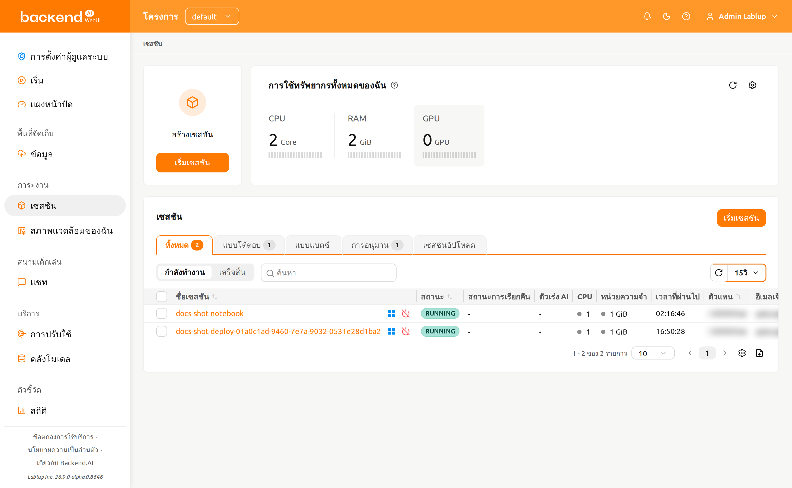
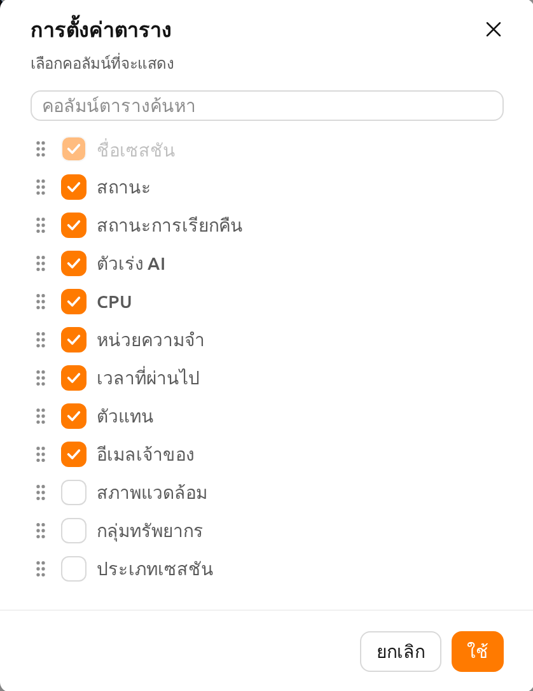
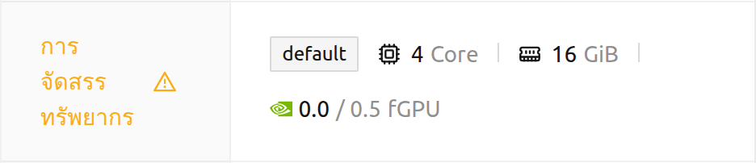

# หน้าเซสชัน

ใน Backend.AI `เซสชัน` หมายถึงสภาพแวดล้อมการประมวลผลแบบแยกส่วนที่ผู้ใช้สามารถรันโค้ด ฝึกโมเดล หรือวิเคราะห์ข้อมูลโดยใช้ทรัพยากรที่ได้รับการจัดสรร
แต่ละเซสชันถูกสร้างขึ้นตามการกำหนดค่าของผู้ใช้ เช่น อิมเมจรันไทม์ ขนาดทรัพยากร และการตั้งค่าสภาพแวดล้อม
เมื่อเซสชันเริ่มต้นแล้ว ผู้ใช้สามารถเข้าถึงแอปพลิเคชันแบบโต้ตอบ เทอร์มินัล และล็อก เพื่อจัดการและตรวจสอบเวิร์กโหลดได้อย่างมีประสิทธิภาพ

## แผงสรุปทรัพยากร

ที่ด้านบนของหน้า "เซสชัน" จะมีแผงแสดงทรัพยากรการประมวลผล เช่น CPU, RAM และ AI Accelerator
สามารถเลือกมุมมองแผงต่างๆ ได้ตามข้อมูลที่ต้องการ เช่น **การใช้ทรัพยากรทั้งหมดของฉัน**, **ทรัพยากรของฉันในกลุ่มทรัพยากร** และ **ทรัพยากรทั้งหมดในกลุ่มทรัพยากร** หากต้องการเปลี่ยนแผงที่แสดง ให้คลิกไอคอนการตั้งค่า (รูปเฟือง) ที่ส่วนหัวของแผง แล้วเลือกมุมมองที่ต้องการใน **การตั้งค่าแผง**

แผง **การใช้ทรัพยากรทั้งหมดของฉัน** แสดงทรัพยากรที่คุณกำลังใช้อยู่ในทุกโปรเจกต์
หากต้องการตรวจสอบขีดจำกัดที่ใช้กับทรัพยากรแต่ละรายการ ให้วางเมาส์เหนือแถบสถานะด้านล่างตัวเลข เมื่อมีการใช้ขีดจำกัดหลายรายการ (โดเมน โปรเจกต์ หรือคีย์แพร์) ระบบจะใช้ขีดจำกัดที่เข้มงวดที่สุด

สำหรับข้อมูลเพิ่มเติมเกี่ยวกับแผงทรัพยากรและตัวชี้วัด โปรดดูที่หน้า[แดชบอร์ด](#dashboard)

## รายการเซสชัน

หน้าเซสชันส่วนตัวจะแสดงเฉพาะเซสชันการประมวลผลที่กำลังทำงานอยู่และที่เสร็จสิ้นแล้วของคุณเองเท่านั้น
สามารถกรองเซสชันตามประเภท ได้แก่ `ทั้งหมด`, `แบบโต้ตอบ`, `แบบแบตช์`, `การอนุมาน` หรือ `เซสชันอัปโหลด` และสลับระหว่างแท็บ `กำลังทำงาน` กับ `เสร็จสิ้น` เพื่อจัดการเซสชัน

:::note
หน้าเซสชันส่วนตัวทำงานภายในขอบเขตของโปรเจกต์ที่คุณกำลังใช้งานอยู่ โดยมีที่อยู่ในรูปแบบ `/project/<ชื่อโปรเจกต์>/session`
และจะแสดงเฉพาะเซสชันของคุณเองเสมอ ไม่ว่าคุณจะมีบทบาทใดก็ตาม
หากต้องการดูและจัดการเซสชันของผู้ใช้ทั้งหมดในโปรเจกต์ ให้ใช้หน้า **เซสชัน** ใน **การตั้งค่าผู้ดูแลระบบ** ของแถบด้านข้าง
:::

ตามค่าเริ่มต้น สามารถดูคอลัมน์ต่อไปนี้ได้: ชื่อเซสชัน สถานะ ทรัพยากรที่จัดสรร (AI Accelerator, CPU, หน่วยความจำ) และเวลาที่ผ่านไป
สามารถแสดงคอลัมน์เพิ่มเติมหรือซ่อนคอลัมน์ที่ต้องการได้โดยคลิกปุ่ม "การตั้งค่า" ที่มุมขวาล่างของตาราง เพื่อปรับแต่งมุมมอง
นอกจากนี้ ในกล่องโต้ตอบการตั้งค่าคอลัมน์ คุณยังสามารถลากคอลัมน์เพื่อเปลี่ยนลำดับการแสดงผลในตารางได้

:::tip
สามารถดูประวัติการจัดตารางโดยละเอียดสำหรับแต่ละเซสชันได้จากแผงรายละเอียดเซสชัน ฟีเจอร์นี้ช่วยให้เข้าใจการตัดสินใจในการจัดตาราง ความล่าช้า และความล้มเหลว สำหรับรายละเอียดเพิ่มเติม โปรดดูที่ [ประวัติการจัดตารางเซสชัน](#session-scheduling-history)
:::

:::note
ปุ่ม **เริ่ม** ที่ตัวเริ่มเซสชันจะสร้างเพียงหนึ่งเซสชันตามค่าเริ่มต้น
หากต้องการเริ่มหลายเซสชันด้วยการตั้งค่าเดียวกันในคราวเดียว ให้เปิดเมนูดรอปดาวน์
ของปุ่มเริ่มแล้วเลือก **เริ่มหลายเซสชัน** ดูรายละเอียดได้ที่
[ยืนยันและเปิดใช้งาน](#confirm-and-launch)
:::

:::note
คุณสามารถส่งออกรายการเซสชันเป็นไฟล์ CSV ได้โดยใช้ปุ่มดาวน์โหลดในแถบเครื่องมือรายการเซสชัน
การส่งออก CSV จากหน้าเซสชันส่วนตัวจะรวมเฉพาะเซสชันของคุณเองเท่านั้น
:::

## ทรัพยากรที่จัดสรรและที่ร้องขอ

คลิกชื่อเซสชันเพื่อเปิดแผงรายละเอียดเซสชัน แถว **การจัดสรรทรัพยากร** ในแผงนี้จะแสดงทรัพยากรที่เซสชันถือครองอยู่จริง
ทำให้คุณทราบว่าเซสชันกำลังทำงานด้วยทรัพยากรเท่าใด ไม่ใช่เพียงจำนวนที่ร้องขอไว้

<!-- TODO: Capture screenshot of the session detail panel Resource Allocation row for a session whose allocation is smaller than its request, showing the warning icon on the label and an `allocated / requested` chip. -->

- เมื่อจำนวนที่จัดสรรตรงกับจำนวนที่ร้องขอ ทรัพยากรแต่ละรายการจะแสดงเป็นค่าเดียว
- เมื่อทั้งสองค่าต่างกัน จะแสดงจำนวนที่จัดสรรตามด้วยจำนวนที่ร้องขอด้วยสีจาง โดยใช้หน่วยร่วมกันเพียงหน่วยเดียว เช่น `1 / 2 Core` เมื่อวางเมาส์เหนือตัวเลขจะแสดงคำแนะนำ **ที่จัดสรร / ที่ร้องขอ**
- เมื่อมีทรัพยากรที่จัดสรรน้อยกว่าที่ร้องขอ จะมีไอคอนคำเตือนปรากฏถัดจากป้ายกำกับ **การจัดสรรทรัพยากร** เมื่อวางเมาส์เหนือไอคอนจะแสดงข้อความ *มีการจัดสรรทรัพยากรน้อยกว่าที่ร้องขอ*
- ก่อนที่เซสชันจะได้รับการจัดสรร เช่น ขณะที่ยังอยู่ในสถานะ `PENDING` ระบบจะแสดงทรัพยากรที่ร้องขอโดยไม่มีการเปรียบเทียบ

ความแตกต่างนี้เกิดขึ้นเมื่อไม่สามารถจัดสรรจำนวนที่ร้องขอได้พอดี เช่น คำขอ GPU แบบเศษส่วน (fGPU) ที่ถูกปัดลงเป็นหน่วยที่จัดสรรได้ที่ใกล้ที่สุด เซสชันจะทำงานด้วยจำนวนที่จัดสรรจริง

สำหรับรายการอื่นๆ ในแผงนี้ โปรดดูที่ [แผงรายละเอียดเซสชัน](#session-detail-panel)
